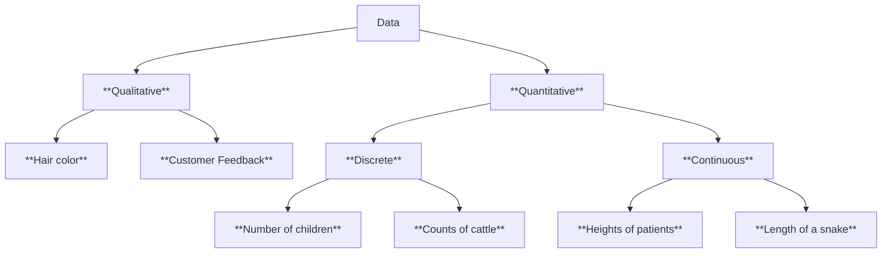

# Dr. Mindaugas Šarpis

# Lessons on **Data Analysis** from **CERN**

## Lecture 10:

## Data Visualization

##### Inspired by: C. O. Wilke Fundamentals of Data Visualization

---
hideInToc: true
---

# Data **Visualization**

- ## One of the key components of data analysis

  - ### Interpreting Results

  - ### Reporting Findings

- ## Chosing appropriate method of visualization and representation is crucial

---
hideInToc: true
backgroundSize: contain
layout: image
image: /image-1.png
---

---
hideInToc: true
backgroundSize: contain
layout: image
image: /image-2.png
---

---
hideInToc: true
backgroundSize: contain
layout: image
image: /image-3.png
---

---
hideInToc: true
backgroundSize: contain
layout: image
image: /image-4.png
---

---
hideInToc: true
---

# **Aesthetics** of Data Visualization

---
hideInToc: true
layout: image
image: /anatomy.png
backgroundSize: contain
---

---
hideInToc: true
---

# **Continuous** and **Discrete** Data

- ## Quantitative / Numerical Data

- ## Qualitative / Categorical Data

- ## Date and Time

---
hideInToc: true
---

# **Legend**

- ## Legend is a key component of a plot that explains the meaning of the data

- ## Legend might not be necessary if the data is self-explanatory (e.g. bar chart, line chart with one line, plot annotations)

---
hideInToc: true
layout: image
image: /data_vis_legend_error_1.png
backgroundSize: contain
---

---
hideInToc: true
layout: image
image: /data_vis_legend_error_2.png
backgroundSize: contain
---

---

---
hideInToc: true
---

---
hideInToc: true
---

---
hideInToc: true
---

# Axis and overall **Scale**

---
hideInToc: true
---

---
hideInToc: true
---

---
hideInToc: true
---

#  Visualizing **Amounts**

- ## Bar Charts
- ## Grouped Bar Charts
- ## Stacked Bar Charts
- ## Heat Maps

---
hideInToc: true
---

---
hideInToc: true
---

---
hideInToc: true
---

---
hideInToc: true
---

---
hideInToc: true
---

---
hideInToc: true
---

---
hideInToc: true
---

---
hideInToc: true
---

---
hideInToc: true
---

---
hideInToc: true
---

---
hideInToc: true
---

# **Histograms** 

---
hideInToc: true
---

---
hideInToc: true
---

---
hideInToc: true
---

---
hideInToc: true
---

# **Color** 

---
hideInToc: true
---

---
hideInToc: true
--- 

# **Error** Bars

---
hideInToc: true
---

---
hideInToc: true
---

---
hideInToc: true
---

# Anatomy of a **Plot**

