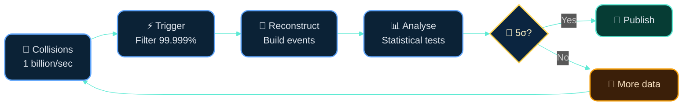

# Dr. Mindaugas Šarpis
# Data Analysis and Artificial Intelligence

## From CERN to Your Data

---
hideInToc: true
layout: quote
---

# Not only is the Universe stranger than we think, it is stranger than we **can** think.
Werner Heisenberg

---
layout: section
hideInToc: true
---

# Our place in the Universe

---
hideInToc: true
---

<VideoPlayer src="VU_VM_Zoom.mp4" autoplay />

---
hideInToc: true
---

<VideoPlayer src="Voyage_in_to_the_world_of_atoms.mp4" autoplay />

---
layout: section
hideInToc: true
---

# Exploring the **Fundamental**

---
hideInToc: true
---

# What is CERN?

## 🏛️ **The Organisation**

- **European Organization for Nuclear Research**
- Founded in **1954** by 12 European states
- Today: **24 member states**, thousands of visiting scientists
- Located at the **French-Swiss border** near Geneva

## 🎯 **The Mission**

- Probe the **fundamental structure** of matter
- Build and operate the world's most powerful **particle accelerators**
- Push the boundaries of **technology and engineering**
- Train the **next generation** of scientists

## 🌍 **By the Numbers**

🔬 World's **largest** particle physics laboratory · 👩‍🔬 **17,000+** scientists from **110+ nations** · 🧪 Home to the **Large Hadron Collider**

---
hideInToc: true
---

# The Large Hadron Collider (LHC)

## ⚙️ **The Machine**

<v-clicks>

- A **27 km** circumference ring situated **100 m** underground
- Accelerates protons to **99.9999991%** the speed of light
- Collides particles **~1 billion times per second**
- Operating temperature: **1.9 K** (~ -271.1°C) — colder than outer space

</v-clicks>

## 🏆 **Key Achievement**

Discovery of the **Higgs boson** in **2012** — confirmed the mechanism that gives particles their mass (Nobel Prize in Physics 2013)

---
layout: section
hideInToc: true
---

# Inside the **Machine**

---
hideInToc: true
---

<VideoPlayer src="CERN_Overview_Short.mp4" autoplay />

---
hideInToc: true
---

<VideoPlayer src="ATLAS-FOOTAGE-2022-004-002-1080p_Shaft.mp4" autoplay />

---
hideInToc: true
---

<VideoPlayer src="QGP_Formation.mp4" autoplay />

---
hideInToc: true
---

# From Collisions to Discovery

💡 No neural networks were needed to discover the Higgs. **Careful experimental design, statistics, and reproducible analysis** — the same skills you can learn.

---
hideInToc: true
---

# Why Data Analysis Matters at CERN

## 📊 **The Data Challenge**

- LHC produces **~1 PB of data per second** of raw detector output
- Only **~1 in a billion** collisions contains interesting physics
- Must filter, reconstruct, and analyse in near real-time

## 🔍 **Needle in a Haystack**

- Signal events look almost identical to background noise
- Statistical methods decide if a discovery is **real or a fluctuation**
- The 5-sigma standard: less than **1 in 3.5 million** chance of being wrong

💡 Finding the Higgs required sifting through **trillions** of events. Not with AI. With **rigorous data analysis.**

---
layout: section
hideInToc: true
---

# What is **Data Analysis?**

---
hideInToc: true
---

# Data → Information → Knowledge → Wisdom

## 📋 **Data**
Capture observations — numbers, text, images, signals

## 💡 **Information**
Emerges when data gain context, structure, and purpose

## 🧠 **Knowledge**
Blends information with experience and domain expertise

## 🎯 **Wisdom**
The responsibility to act on knowledge with judgement

---
hideInToc: true
---

# A Concrete Example

## 📋 **Raw Data**

### `2025-10-24, 22.3°C`

## 💡 **Information**

### `Lab A was 22.3°C at 10:24 on Oct 24, 2025.`

## 🧠 **Knowledge**

### `Lab A runs 1.5°C hotter on Fridays due to load.`

## 🎯 **Wisdom**

### `Shift calibration earlier on Fridays to reduce drift.`

---
hideInToc: true
---

# The Same Process, Everywhere

## ⚛️ **Particle Physics**

Detector signals → event reconstruction → statistical tests → discovery

## 💼 **Business**

Customer clicks → behaviour patterns → predictive models → decisions

## 🏥 **Medicine**

Patient records → clinical patterns → diagnostic models → treatment plans

## 🔑 **Key Insight**

The **methods** are universal. The **domain** changes, the **thinking** doesn't.
Collect → Clean → Explore → Model → Decide → Communicate

---
hideInToc: true
---

# Four Flavours of Analytics

## 📋 **Descriptive** — What happened?

Event rate rose 12% last run · Sales dropped 8% in Q3

## 🔍 **Diagnostic** — Why did it happen?

Rate rose due to trigger threshold change · Drop correlates with pricing change

## 🔮 **Predictive** — What is likely next?

Projected 8% rate increase next fill · Model forecasts recovery in Q1

## 🎯 **Prescriptive** — What should we do?

Raise threshold by 0.3 to maintain buffer · Revert price, A/B test alternatives

---
layout: section
hideInToc: true
---

# Navigating the **Buzzword** Landscape

---
hideInToc: true
---

# What People Call "AI"

<!-- The spectrum bar -->

  

    Spreadsheets & Rules
  

  

    Statistics
  

  

    Machine Learning
  

  

    Deep Learning
  

  

    LLMs / GenAI
  

<!-- Labels below -->

  
IF/ELSE, pivot tables

  
regression, hypothesis tests

  
decision trees, clustering

  
neural networks, CNNs

  
ChatGPT, image generation

<!-- The punchline -->

## ⚠️ **The Marketing Label**

Most of what companies call "AI" lives in the first three boxes. Understanding **where your problem sits** on this spectrum is the real skill.

---
hideInToc: true
---

# The Real Skill Stack

## 🧠 **Think**

Ask the right question. Understand the domain. Know what "good enough" looks like.

## 🔍 **Explore**

Look at the data before modelling it. Distributions, outliers, missing values — they tell a story.

## 🛠️ **Choose**

Pick the simplest method that solves the problem. A good scatter plot beats a bad neural network.

## 📢 **Communicate**

Results that nobody understands have zero impact. Visualisation and storytelling are part of analysis.

---
hideInToc: true
---

# Quiz: Which of These is "AI"?

<MCQ
  question="A company uses a dashboard that flags when monthly sales drop below the 12-month rolling average. Is this AI?"
  :options="[
    'Yes — it automatically detects anomalies',
    'No — it is a simple statistical rule',
    'It depends on how they market it'
  ]"
  :correct="1"
  explanation="This is a straightforward threshold comparison against a moving average — a statistical rule, not machine learning. But it is effective data analysis! The label matters less than whether it solves the problem."
/>

---
hideInToc: true
---

# When "AI" is Just Good Data Analysis

## 📊 **"AI-Powered" Dashboard**

Reality: SQL queries + conditional formatting · Tool: Spreadsheet or BI tool

## 🔔 **"Smart" Anomaly Detection**

Reality: Statistical control charts (invented 1924) · Tool: Basic statistics

## 🎯 **"Predictive" Analytics**

Reality: Linear regression on historical trends · Tool: A few lines of Python

## 🤖 **Actual ML Use Case**

Reality: Image classification with millions of samples · Tool: Deep learning frameworks, GPUs

💡 **3 out of 4** need data analysis skills, not AI expertise. Know the difference.

---
hideInToc: true
---

# How the Disciplines Overlap

## 📊 **Statistics**

Underpins inference, uncertainty, and experimental design

## 🔧 **Data Engineering**

Ensures data are collected, stored, and discoverable

## 🔍 **Data Analysis**

Explores, explains, and communicates what the data say

## 🧪 **Data Science**

Fuses engineering, analysis, and machine learning

## 🤖 **AI / ML**

Automates pattern recognition at scale — one tool among many

🎯 **AI is a tool in the toolbox, not the toolbox itself.** Data analysis is the foundation everything else builds on.

---
hideInToc: true
---

# Common Pitfalls

## ⚠️ Jumping to complex models before understanding the data

## ⚠️ Confusing correlation with causation

## ⚠️ Overfitting pretty charts to noisy data

## ⚠️ Calling everything "AI" to sound impressive

## ⚠️ Shipping insights without reproducibility

---
layout: section
hideInToc: true
---

# **Takeaways**

---
hideInToc: true
---

# What To Take Away

## 🧠 **Data literacy > tool literacy**

Understanding your data matters more than knowing the latest framework

## 🎯 **The thinking matters more than the label**

Good analysis is good analysis — whether you call it statistics, data science, or AI

## 🔬 **CERN-grade rigour is learnable**

The same methods that found the Higgs apply to your business, your research, your career

## 🚀 **These skills transfer everywhere**

From particle physics to finance, from genomics to marketing — data is the common language

---
hideInToc: true
---

# What This Course Teaches

## 🖥️ **Computing Foundations**

How computers actually work, command line, file management

## 🐍 **Python Programming**

From zero to data analysis — the most in-demand language in science and industry

## 📊 **Data Analysis**

Statistics, probability, visualisation, fitting, and real-world case studies

## 🔄 **Reproducibility**

Version control, workflows, and practices used at CERN and in industry

## 🤖 **AI & Machine Learning**

Understand what it is, when to use it, and when not to

## 🎯 **Your Own Project**

Apply everything to a real project in your field

---
hideInToc: true
layout: quote
---

# The best thing about being a scientist is that you never stop being a **student**.

---
hideInToc: true
layout: fact
---

# Thank you.

Dr. Mindaugas Šarpis

Data Analysis and Artificial Intelligence
