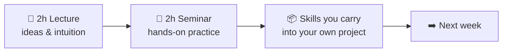
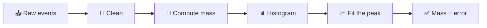

<!--
Parked slides from slides/01_Orientation.md, taken out on 2026-10-06 in the
storytelling rework (the deck now opens on the nine-row pendulum table and the
question "I send you only 9.84. How do you check it?").

Each slide below is the version that stood in the deck before the rework. Some
were merged into a new slide, some were rewritten in place; the original text is
kept here so nothing the lecturer wrote is lost. This file is not in
decks.json: it is not built, not gated and not deployed. To put a slide back,
move it into the lecture file.

Where they stood (old order, after "Who am I talking to?" and the goal quote):
- "Course Structure" and "Two Halves of One Week" (old slides 5 and 19) were
  merged into the new "Course Structure"; the 64 h / 196 h / 1 stat block is
  unchanged.
- "Course Content" (old 6), the 16-lecture map, sat between Course Structure
  and the Schedule. The Schedule's footnote now names block E.
- "The Four Aims" and the four before/after slides (old 8-12) were rewritten
  in place on the pendulum file, in the order 🔧 ♻️ ⚙️ 📁.
- "Grading Structure" and "Your Project — Your Call" (old 14 and 16) were
  merged into "The Grade: One Project"; "Project Details" (old 15) became
  "What You Hand In".
- "How to Succeed Here" (old 21) became "Habits That Work"; "What This Course
  Is Not" (old 22) followed it and is folded into that slide's speaker note.
- "What the Seminars Cover" (old 25) and "From Raw Data to a Result" (old 26)
  were replaced by "One Table Through the Course".
- "The Finished Product" (old 27) now shows the Lecture 13 project tree;
  "The Golden Rule" (old 28) became "Delete and Rebuild".
- "Why You Need These Skills" (old 29) lost its closing "Next lecture" line;
  "Before the Next Session" (old 30) lost its "Think of a dataset" card (set
  for home), now an in-class README line.
-->

---
hideInToc: true
---

# Course **Structure**

<div class="grid-2 mt-md gap-md">

<div class="card card-primary card-glass pad-tight">

## 📖 **Lectures**

- **Theory / Overviews** — main goal is exposure
- **Discussion** — building intuition, interactivity is important

Some of the elements require deeper understanding in statistics, programming,
mathematics. The idea is to strike a balance of what to keep as a "black box"
and what needs to be understood in detail.

</div>

<div class="card card-secondary card-glass pad-tight">

## 🔬 **Seminars**

- **Demos** — live demonstrations
- **Hands-on sessions** — you type, the instructor circulates
- **Case Studies** — real-world examples

It is very important to practice throughout the course. Using the tools and
concepts on your own projects is the best way to learn.
</div>

</div>

<div class="card card-info card-glass pad-tight mt-md">

<div class="stat-grid">
  <div class="stat">
    <span class="stat-num gradient-text">64</span><span class="stat-unit">h</span>
    <div class="stat-label">Contact hours</div>
  </div>
  <div class="stat">
    <span class="stat-num gradient-text energy">196</span><span class="stat-unit">h</span>
    <div class="stat-label">Self study</div>
  </div>
  <div class="stat">
    <span class="stat-num gradient-text">1</span>
    <div class="stat-label">Semester project</div>
  </div>
</div>

</div>

---
hideInToc: true
---

# Course **Content** — 16 lectures, 5 blocks

<div class="grid-3 mt-md gap-md">

<div class="card card-primary card-glass pad-compact reveal-scale">

**A · Foundations & Tooling** *(01–05)*
Orientation, data, computers, command line & files, Git

</div>

<div class="card card-secondary card-glass pad-compact reveal-scale">

**B · Programming** *(06–07)*
Python foundations, then Python for data and NumPy arrays

</div>

<div class="card card-info card-glass pad-compact reveal-scale">

**C · Data Analysis Core** *(08–11)*
Visualisation, probability & statistics, fitting from first principles, the perceptron

</div>

<div class="card card-success card-glass pad-compact reveal-scale">

**D · Practical Data Work** *(12–13)*
Pandas & data cleaning, reproducible workflows & automation

</div>

<div class="card card-warning card-glass pad-compact reveal-scale">

**E · Further Topics** *(14–16, as time allows)*
Concepts of data analysis, computing infrastructure & HPC, machine learning & AI

</div>

<div class="card card-accent card-glass pad-compact reveal-scale">

**🧪 Paired seminars**
Each lecture has a hands-on seminar — self-contained exercises on a shared open dataset; your own project is separate and graded

</div>

</div>

<div class="note-text mt-sm" style="text-align: center;">

Order and depth adapt to the group.

</div>

---
hideInToc: true
---

# The Four <span class="gradient-text">Aims</span>

<div class="card card-info card-glass pad-compact mt-sm">

Everything in this course serves four durable practices. They outlast any tool or language — and your project is graded on them.

</div>

<div class="grid-2 mt-md gap-md">

<div class="card card-primary card-glass pad-tight reveal-scale">

## 🔧 **Tool agnosticism**

Learn the *idea* first, then a tool. Concepts transfer; frameworks come and go.

</div>

<div class="card card-secondary card-glass pad-tight reveal-scale">

## ♻️ **Reproducibility**

If someone else — or future you — can't rebuild your result, it isn't a result.

</div>

<div class="card card-accent card-glass pad-tight reveal-scale">

## ⚙️ **Automation**

Do it once by hand, twice by script. Let the machine repeat the boring parts.

</div>

<div class="card card-success card-glass pad-tight reveal-scale">

## 📁 **Efficient work with data & files**

Organise, name, and format your data so it stays trustworthy and usable.

</div>

</div>

<div class="note-text mt-md">Watch for the 🔧 ♻️ ⚙️ 📁 icons throughout — every lecture advances at least one.</div>

---
hideInToc: true
---

# 📁 Before / After — **Data & Files**

<div class="grid-2 mt-md gap-md">

<div class="card card-warning card-glass pad-tight">

## ❌ **The Downloads folder**

- `data.csv`, `data(1).csv`, `data_final_v2_REAL.csv`
- Raw data, figures, and drafts all in one directory
- Which file fed the plot in the report? Nobody knows
- Deleting anything feels dangerous — so nothing is ever deleted

</div>

<div class="card card-success card-glass pad-tight">

## ✅ **A structured project**

- `data/raw/` is read-only; `data/processed/` is regenerable
- One folder per purpose: `scripts/`, `results/`, `docs/`
- Names carry meaning: `2026-03_temperature_vilnius.csv`
- "Where does this number come from?" answered in seconds

</div>

</div>

<div class="note-text mt-md">The same structure works for any project: build it once and repeat it on your own.</div>

<!--
Speaker: the next four slides are one before/after pair per aim, all drawn from real
projects — including mine. Don't rush them — they are the emotional core of week 1.
Ask for a show of hands at each "before": almost everyone recognises themselves. (~2 min)
-->

---
hideInToc: true
---

# ♻️ Before / After — **Reproducibility**

<div class="grid-2 mt-md gap-md">

<div class="card card-warning card-glass pad-tight">

## ❌ **“It worked on my laptop”**

- The result exists — as a screenshot in an old email
- Rebuilding it needs a specific person, machine, and mood
- Six months later even the author can't remake the plot
- Reviewer asks "what changed since draft one?" — silence

</div>

<div class="card card-success card-glass pad-tight">

## ✅ **Anyone can rerun it**

- Data, code, and environment are recorded together
- One command rebuilds every figure and number
- A new team member reproduces the result on day one
- "What changed?" has an exact, versioned answer

</div>

</div>

<div class="note-text mt-md">This is the single strongest predictor of a good project grade — and of trust in your science.</div>

---
hideInToc: true
---

# ⚙️ Before / After — **Automation**

<div class="grid-2 mt-md gap-md">

<div class="card card-warning card-glass pad-tight">

## ❌ **40 manual steps in a spreadsheet**

- Open file → copy column → paste → sort → delete rows → …
- Every rerun costs an afternoon and invites a fresh typo
- New data arrives → the whole ritual starts again
- The process lives only in one person's muscle memory

</div>

<div class="card card-success card-glass pad-tight">

## ✅ **One script**

- The same 40 steps written down once, executed in seconds
- New data arrives → rerun → done
- The script *is* the documentation of the method
- Boring parts are delegated; your attention goes to thinking

</div>

</div>

<div class="note-text mt-md">Rule of thumb from the aims slide: once by hand, twice by script.</div>

---
hideInToc: true
---

# 🔧 Before / After — **Tool Agnosticism**

<div class="grid-2 mt-md gap-md">

<div class="card card-warning card-glass pad-tight">

## ❌ **Locked in**

- Data lives inside one proprietary tool's project file
- Analysis steps exist only as clicks nobody recorded
- Licence expires, company folds, format changes → work stranded
- Collaborators must buy the same tool just to *look*

</div>

<div class="card card-success card-glass pad-tight">

## ✅ **Open by default**

- Data in open formats: CSV, JSON, plain text
- Logic captured in code — portable across tools and decades
- Concepts learned once transfer to whatever comes next
- Anyone can inspect, verify, and build on your work

</div>

</div>

<div class="note-text mt-md">We still <em>use</em> specific tools (Python, VS Code, Git) — but every skill is chosen to transfer beyond them.</div>

---
hideInToc: true
---

# Grading **Structure**

<div class="card card-success card-glass pad-tight mt-md glow">

## 🎯 **One course-long project — 100%**

The whole grade is a project you carry through the course — the natural place to *practise* everything we cover.

</div>

<div class="grid-2 mt-md gap-md">

<div class="card card-primary card-glass pad-tight reveal-left">

## 📋 **What it is**

- Related to **your** field of study or work
- Includes real **data analysis and/or automation**
- Built with Python and the good practices from this course

</div>

<div class="card card-secondary card-glass pad-tight reveal-left">

## ✅ **Graded on the four aims**

- 🔧 **Tool-agnostic**, reasoned choices
- ♻️ **Reproducible** — someone else can rebuild your results
- ⚙️ **Automated** where it counts
- 📁 **Well-organised** data & files, clearly documented

</div>

</div>

<div class="note-text mt-md">Assessed on a final presentation (graded on the spot) plus the project repository.</div>

---
hideInToc: true
---

# Project **Details**

<div class="grid-2 mt-md gap-md">

<div class="card card-primary card-glass pad-tight">

## 📋 **Requirements**

- Should be a well-developed project
- Graded relative to where you start — beginners and experienced coders are both welcome
- Can be functional (app, dashboard, website)
- Can be more educational (applying a specific method — e.g. a neural network — and explaining the concepts)
- Can use AI tools and components but must understand your code and be able to explain it

</div>

<div class="card card-secondary card-glass pad-tight">

## 📦 **Deliverables**

- Codebase available on course repository (info in eMokymai)
- Project written up in a **one-page report** (added to the repository)
- 10–30 second video showcasing the project (linked to the repository)
- Final **presentation** at the end of the course (graded on the spot)

</div>

</div>

---
hideInToc: true
---

# Your Project — **Your Call**

<div class="grid-2 mt-md gap-md">

<div class="card card-primary card-glass pad-tight">

## 🧭 **Any field, any form**

**One project of your own** — topic, data, and form are entirely your call: a data analysis, a working app or dashboard, an educational piece that explains a method — from physics, biology, economics, or a hobby. Pick something you actually want to exist.

</div>

<div class="card card-accent card-glass pad-tight">

## 🔬 **The seminars feed it**

One hands-on brief per week on a **real, open dataset** — LHCb collision data, or a dataset from your own field. The seminars teach the moves; the project is where you make them yours. How much the two overlap is up to you.

</div>

</div>

<div class="note-text mt-md">Graded on the four aims, not on the topic. Bring a first idea to an early seminar and talk it through — the sooner a project exists, the more of the course it can absorb.</div>

---
hideInToc: true
---

# Two Halves of **One Week**



<div class="grid-2 mt-sm gap-md">

<div class="card card-primary card-glass pad-tight">

## 📖 **The lecture**

- Explains *why* a practice matters and *how* to think about it
- Shows the idea on real examples — including from CERN
- Interactive: questions, votes, and short reflections
- Goal is **exposure and intuition**, not memorising commands

</div>

<div class="card card-secondary card-glass pad-tight">

## 🔬 **The seminar**

- You do it yourself, on a real dataset, in your own project folder
- Inverted classroom: you type, break things, and fix them
- The instructor circulates — help is closest when you are stuck
- Goal is a **working result**, saved in your project before you leave

</div>

</div>

<div class="note-text mt-sm">From week 2, every week has this shape — concepts first, muscle memory second. Miss the seminar and the lecture stays abstract; skip the lecture and the seminar feels like magic. <strong>They are one unit.</strong> Each seminar is a self-contained exercise on a shared, real dataset; every skill it teaches is meant to be carried straight into your own project.</div>

---
hideInToc: true
---

# How to **Succeed** Here

<div class="grid-2 mt-md gap-md">

<div class="card card-success card-glass pad-compact">

## 🌱 **Do this**

- **Show up to the seminar** — the doing is where it sticks
- **Type it yourself**, even when copy-paste would be faster
- Keep one project and grow it; don't restart every week
- Ask early — a five-minute question saves a lost evening

</div>

<div class="card card-warning card-glass pad-compact">

## 🚧 **Avoid this**

- Bingeing every lecture the night before the presentation
- Collecting tools you never actually use on your data
- Hiding a broken step instead of asking about it
- Treating "it ran once" as the same as "it's reproducible"

</div>

</div>

<div class="grid-3 gap-md mt-md">

<div class="card card-primary card-glass pad-compact">

## ⌨️ **You will type a lot**

Commands feel slow at first. Two weeks in, they are faster than clicking.

</div>

<div class="card card-info card-glass pad-compact">

## 💥 **You will break things**

Errors are the normal state of programming. Read them — they usually name the fix.

</div>

<div class="card card-secondary card-glass pad-compact">

## 🙋 **Stuck for 15 minutes? Ask**

The instructor, your neighbour, the error message in a search engine, the docs — and AI assistants, as long as you understand what they hand you.

</div>

</div>

---
hideInToc: true
---

# What This Course **Is Not**

<div class="grid-2 mt-md gap-md">

<div class="card card-warning card-glass pad-tight">

## 🚫 **Not this**

- Not a deep programming course — we write *enough* code to get work done
- Not tied to one tool you must adopt forever
- Not a race to the fanciest machine-learning model
- Not graded on exams full of syntax to memorise

</div>

<div class="card card-success card-glass pad-tight">

## 🎯 **But this**

- A course in *practices* that survive any language or tool
- Enough hands-on fluency to be dangerous — and to keep learning
- One honest, reproducible project you understand end to end
- Judgement about **which** tool, and **why**

</div>

</div>

<div class="note-text mt-md">Already code well? The challenge just shifts from syntax to doing it <em>reproducibly</em>. There's a level here for everyone.</div>

---
hideInToc: true
---

# What the Seminars **Cover**

| **Seminars** | **Hands-on focus** |
| --- | --- |
| 1 | VS Code, Markdown, the project folder, editing many lines at once |
| 3–5 | A file as bytes; the command line; Git |
| 6–7 | Python from the first line; files and arrays |
| 8–9 | A first figure; a value with its uncertainty |
| 10–11 | **A fit from first principles**; a perceptron built by hand |
| 12–13 | Cleaning by script; one command that rebuilds everything |

<div class="note-text mt-sm">Every one of these transfers straight into your own project — that is the point.</div>

---
hideInToc: true
---

# From Raw Data to a **Result**



<div class="card card-info card-glass pad-compact mt-sm">

This is the whole arc in one line — and every box is built in the seminars. The same shape fits any dataset: swap "compute mass" for "compute your variable" and the pipeline is your project's.

</div>

<div class="grid-3 mt-md gap-md">

<div class="card card-primary card-glass pad-compact">

## 📥 **Raw → Clean**

The raw file as bytes, a clean project structure, cleaning by script

</div>

<div class="card card-secondary card-glass pad-compact">

## 📊 **Compute → Histogram**

A first figure, then a value with its uncertainty

</div>

<div class="card card-accent card-glass pad-compact">

## 📈 **Fit → Result**

The fit, then a rebuild in one command

</div>

</div>

<div class="note-text mt-md">By the end, one command walks the entire chain, raw to result, untouched by hand.</div>

---
hideInToc: true
---

# The Finished **Product**

<div class="grid-2 mt-md gap-md">

<div class="card card-primary card-glass pad-tight">

## 📦 **What you hand in**

A single versioned repository: raw data (if any), scripts, results, a pinned environment, and a `README`. The report, video, and presentation from *Project Details* all describe this one thing.

Every seminar practises one piece of this tree on the shared dataset; your project assembles the whole of it around your own question.

</div>

<div class="card card-secondary card-glass pad-tight">

```text
my-project/
├─ data/raw/        # inputs, untouched
│                   # (if your project has data)
├─ scripts/         # one per step
├─ results/         # all regenerable
├─ environment.yml  # pinned
├─ Makefile         # make all
└─ README.md        # how to rebuild
```

</div>

</div>

<div class="note-text mt-md">Clean, automated, documented — the four aims made concrete, in a form you can show a supervisor or an employer.</div>

---
hideInToc: true
---

# The Golden **Rule**

<div class="card card-success card-glass pad-tight mt-md glow">

## 🏆 **Delete everything but `data/raw/` and `scripts/` — then rebuild it all with one command.**

If that is true of your project, you've succeeded. Every practice in this course exists to make that one sentence true of your work.

</div>

<div class="grid-2 mt-md gap-md">

<div class="card card-warning card-glass pad-compact">

## 🗑️ **Safe to delete — it regenerates**

`data/processed/`, `results/`, every figure, table and number in the report: outputs of the scripts, never edited by hand.

</div>

<div class="card card-primary card-glass pad-compact">

## 🔒 **The recipe — keep it**

`data/raw/` (cannot be regenerated), `scripts/` (every step), plus `environment.yml`, `Makefile` and `README.md` — the instructions for the rebuild.

</div>

</div>

<div class="note-text mt-md">Reproducibility isn't a chore you bolt on at the end — it's the property that makes everything else trustworthy.</div>

---
hideInToc: true
---

# Why <span class="gradient-text">You</span> Need These Skills

CERN turns raw collisions into discoveries with exactly the toolkit this course builds:

<div class="grid-2 mt-md gap-md">

<div class="card card-primary card-glass pad-tight reveal-up">

## 📁 **Handling Massive Data**

Petabytes of detector output demand disciplined file handling, data formats, and organisation.

</div>

<div class="card card-secondary card-glass pad-tight reveal-up">

## 🔀 **Working Together**

Thousands of scientists share one codebase — impossible without version control.

</div>

<div class="card card-accent card-glass pad-tight reveal-up">

## 🐍 **Turning Signal into Insight**

Python and data-analysis tools transform readings into physics.

</div>

<div class="card card-warning card-glass pad-tight reveal-up">

## 🎲 **Real or a Fluke?**

Statistics decide whether a bump in the data is a discovery — or noise.

</div>

</div>

<div class="card card-info card-glass pad-compact mt-md" style="text-align: center;">

You don't need a particle accelerator to use any of this. **Next lecture: what data actually is — then we build the skills, from how a computer works to the command line.**

</div>

---
hideInToc: true
---

# Before the **Next Session**

<div class="grid-2 mt-md gap-md">

<div class="card card-primary card-glass pad-tight">

## 💻 **Bring a laptop**

- Windows, macOS or Linux, charged, with its charger
- You must be able to install programs on it. On a university or work laptop, check that now
- Nothing has to be installed beforehand

</div>

<div class="card card-secondary card-glass pad-tight">

## 🗂️ **Think of a dataset**

- A table from a field you care about: weather, sport, prices, health, astronomy, your lab
- It becomes the data of your own project
- No file is needed yet. One sentence about it is enough

</div>

</div>

<div class="card card-info card-glass pad-compact mt-sm">

## 🔬 **The first seminar starts from zero**

It installs the editor, builds a project folder and writes its first file together, step by step. No programming experience is assumed.

</div>
