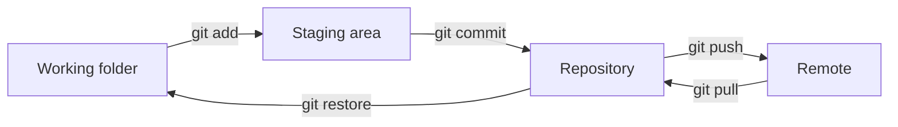

<!--
Parked slides from slides/05_Version_Control.md, taken out on 2026-10-06.

They left the deck when it was rebuilt to open on the two copies of the
pendulum table and close on the same question answered from the history. Both
were on the skip list of the 90-minute plan. This file is not in decks.json:
it is not built, not gated and not deployed. A comment before each slide says
where it stood. To restore one, move it back into the lecture file.
-->

<!-- Parked 2026-10-06 from Lecture 05, after slide 'A History of Changes' and before 'Git Is Installed: a Check': merging was described before commits, branches or diffs exist; Branches & Merging builds it from the model -->

---
hideInToc: true
---

# Two Lines of Work, **Joined**

Two people, or one person on two days, change the same starting state in different ways. The histories diverge. Git joins them: changes to different lines are combined without help, and changes to the same line are shown to a person who decides.

<!-- Parked 2026-10-06 from Lecture 05, section Tags & Stash, after slide 'When Git Says No': its diagram repeated Three Areas with push and pull added; the deck now closes on The Three Questions, Answered -->

---
hideInToc: true
---

# The Whole **Picture**

`git status` and `git diff` look and change nothing. Run them before every step.

`git switch` exchanges the files of the working folder for the snapshot of another branch.

`git merge` joins another branch into the one in use. A pull is a fetch and a merge.

