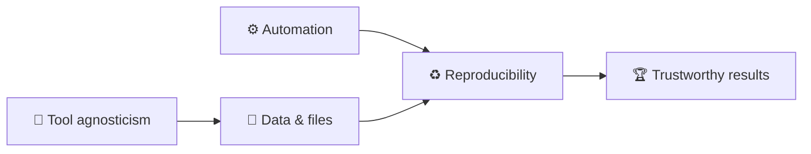

# Dr. Mindaugas Šarpis

# Best Research and Data Analysis Practices from CERN

## Course Orientation

##### <span class="aims-badge">🔧 tool-agnostic · ♻️ reproducible · ⚙️ automation · 📁 data & files — the four aims</span>

<!--
Speaker: welcome them, introduce yourself briefly, and set the tone — this is a
practical course, not a lecture course. Everything is graded on one project that
grows through the seminars. Ask what fields are in the room. (~2 min)
-->

---
hideInToc: true
layout: quote
---

# The goal of this course is to build **intuition**, **competence**, and **confidence** in working with data — using the tools and practices of modern science

---
hideInToc: true
---

# **Course Structure**

<div class="grid-2 mt-md gap-md">

<div class="card card-primary card-glass pad-tight">

## 📖 **Lectures**

- **Theory / Overviews** — main goal is exposure
- **Discussion** — building intuition, interactivity is important

Some of the elements require deeper understanding in statistics, programming,
mathematics. The idea is to strike a balance of what to keep as a "black box"
and what needs to be understood in detail.

</div>

<div class="card card-secondary card-glass pad-tight">

## 🔬 **Seminars**

- **Demos** — live demonstrations
- **Hands-on Sessions** — *Inverted Classroom*
- **Case Studies** — real-world examples

It is very important to practice throughout the course. Using the tools and
concepts on your own projects is the best way to learn.
</div>

</div>

<div class="card card-info card-glass pad-tight mt-md">

<div class="stat-grid">
  <div class="stat">
    <span class="stat-num gradient-text">64</span><span class="stat-unit">h</span>
    <div class="stat-label">Contact hours</div>
  </div>
  <div class="stat">
    <span class="stat-num gradient-text energy">196</span><span class="stat-unit">h</span>
    <div class="stat-label">Self study</div>
  </div>
  <div class="stat">
    <span class="stat-num gradient-text">1</span>
    <div class="stat-label">Semester project</div>
  </div>
</div>

</div>

---
hideInToc: true
---

# <span class="gradient-text">Main Goals</span>

<div class="stack-tight mt-sm">

<div class="card card-primary card-glass pad-compact reveal-left">

🧠 Build intuition for **good practices**

</div>

<div class="card card-secondary card-glass pad-compact reveal-left">

🧰 Be aware of a **plethora of available free tools**

</div>

<div class="card card-accent card-glass pad-compact reveal-left">

💪 Build **competences** in relevant areas

</div>

<div class="card card-success card-glass pad-compact reveal-left glow">

🚀 Use what you learned for your **own projects**

</div>

<div class="card card-info card-glass pad-compact reveal-left">

🤝 Work together and practice **problem solving**

</div>

</div>

---
hideInToc: true
---

# The Four <span class="gradient-text">Aims</span>

<div class="card card-info card-glass pad-compact mt-sm">

Everything in this course serves four durable practices. They outlast any tool or language — and your project is graded on them.

</div>

<div class="grid-2 mt-md gap-md">

<div class="card card-primary card-glass pad-tight reveal-scale">

## 🔧 **Tool agnosticism**

Learn the *idea* first, then a tool. Concepts transfer; frameworks come and go.

</div>

<div class="card card-secondary card-glass pad-tight reveal-scale">

## ♻️ **Reproducibility**

If someone else — or future you — can't rebuild your result, it isn't a result.

</div>

<div class="card card-accent card-glass pad-tight reveal-scale">

## ⚙️ **Automation**

Do it once by hand, twice by script. Let the machine repeat the boring parts.

</div>

<div class="card card-success card-glass pad-tight reveal-scale">

## 📁 **Efficient work with data & files**

Organise, name, and format your data so it stays trustworthy and usable.

</div>

</div>

<div class="note-text mt-md">Watch for the 🔧 ♻️ ⚙️ 📁 icons throughout — every lecture advances at least one.</div>

---
hideInToc: true
---

# The Aims in **Practice**

<div class="card card-info card-glass pad-tight mt-sm">

Four abstract words become concrete the moment you compare two versions of the same project — one built casually, one built with the practices from this course.

</div>

<div class="grid-2 mt-md gap-md">

<div class="card card-warning card-glass pad-tight">

## ❌ **Before**

The way most of us start: files everywhere, steps done by hand, results that live in one person's head and one machine's setup.

</div>

<div class="card card-success card-glass pad-tight">

## ✅ **After**

The same work, restructured: organised, scripted, documented — and rebuildable by anyone, on any machine, years later.

</div>

</div>

<div class="note-text mt-md">The next four slides show one before/after pair per aim. All four are drawn from real projects — including mine.</div>

<!--
Speaker: don't rush these four — they are the emotional core of week 1. Ask for a
show of hands at each "before": almost everyone recognises themselves. (~2 min)
-->

---
hideInToc: true
---

# 📁 Before / After — **Data & Files**

<div class="grid-2 mt-md gap-md">

<div class="card card-warning card-glass pad-tight">

## ❌ **The Downloads folder**

- `data.csv`, `data(1).csv`, `data_final_v2_REAL.csv`
- Raw data, figures, and drafts all in one directory
- Which file fed the plot in the report? Nobody knows
- Deleting anything feels dangerous — so nothing is ever deleted

</div>

<div class="card card-success card-glass pad-tight">

## ✅ **A structured project**

- `data/raw/` is read-only; `data/processed/` is regenerable
- One folder per purpose: `scripts/`, `results/`, `docs/`
- Names carry meaning: `2026-03_temperature_vilnius.csv`
- "Where does this number come from?" answered in seconds

</div>

</div>

<div class="note-text mt-md">Lecture 4 (command line & files) and Seminar 4 build exactly this structure — for your own project.</div>

---
hideInToc: true
---

# ♻️ Before / After — **Reproducibility**

<div class="grid-2 mt-md gap-md">

<div class="card card-warning card-glass pad-tight">

## ❌ **"It worked on my laptop"**

- The result exists — as a screenshot in an old email
- Rebuilding it needs a specific person, machine, and mood
- Six months later even the author can't remake the plot
- Reviewer asks "what changed since draft one?" — silence

</div>

<div class="card card-success card-glass pad-tight">

## ✅ **Anyone can rerun it**

- Data, code, and environment are recorded together
- One documented command rebuilds every figure and number
- A new team member reproduces the result on day one
- "What changed?" has an exact, versioned answer

</div>

</div>

<div class="note-text mt-md">This is the single strongest predictor of a good project grade — and of trust in your science.</div>

---
hideInToc: true
---

# ⚙️ Before / After — **Automation**

<div class="grid-2 mt-md gap-md">

<div class="card card-warning card-glass pad-tight">

## ❌ **40 manual steps in a spreadsheet**

- Open file → copy column → paste → sort → delete rows → …
- Every rerun costs an afternoon and invites a fresh typo
- New data arrives → the whole ritual starts again
- The process lives only in one person's muscle memory

</div>

<div class="card card-success card-glass pad-tight">

## ✅ **One script**

- The same 40 steps written down once, executed in seconds
- New data arrives → rerun → done
- The script *is* the documentation of the method
- Boring parts are delegated; your attention goes to thinking

</div>

</div>

<div class="note-text mt-md">Rule of thumb from the aims slide: once by hand, twice by script.</div>

---
hideInToc: true
---

# 🔧 Before / After — **Tool Agnosticism**

<div class="grid-2 mt-md gap-md">

<div class="card card-warning card-glass pad-tight">

## ❌ **Locked in**

- Data lives inside one proprietary tool's project file
- Analysis steps exist only as clicks nobody recorded
- Licence expires, company folds, format changes → work stranded
- Collaborators must buy the same tool just to *look*

</div>

<div class="card card-success card-glass pad-tight">

## ✅ **Open by default**

- Data in open formats: CSV, JSON, plain text
- Logic captured in code — portable across tools and decades
- Concepts learned once transfer to whatever comes next
- Anyone can inspect, verify, and build on your work

</div>

</div>

<div class="note-text mt-md">We still *use* specific tools (Python, VS Code, Git) — but every skill is chosen to transfer beyond them.</div>

---
hideInToc: true
---

# The Aims **Reinforce** Each Other



<div class="grid-2 mt-md gap-md">

<div class="card card-primary card-glass pad-compact">

## 🔗 **Not four separate boxes**

A scripted pipeline (⚙️) is automatically re-runnable (♻️). A clean file structure (📁) keeps scripts simple. Open formats (🔧) keep everything rebuildable anywhere.

</div>

<div class="card card-secondary card-glass pad-compact">

## 🧭 **Use them as a compass**

Unsure how to do something? Ask: *which choice serves more of the aims?* That one question resolves most practical dilemmas in this course — and in research.

</div>

</div>

---
hideInToc: true
---

<MCQ
  question="A colleague sends you a beautiful result: a PDF of the final plot. What is the *minimum* you would need for the result to count as reproducible?"
  :options="[
    'The plot again, in higher resolution',
    'The raw data, the code, and a description of the environment they ran in',
    'A video recording of them running the analysis',
    'Their word that it worked on their laptop'
  ]"
  :correct="1"
  explanation="♻️ Reproducibility means someone else can rebuild the result. That requires the inputs (data), the exact transformation (code), and the context it ran in (environment and versions). A prettier picture or a promise changes nothing."
/>

---
hideInToc: true
---

# **Course Content** — 16 lectures, 5 blocks

<div class="grid-3 mt-md gap-md">

<div class="card card-primary card-glass pad-compact reveal-scale">

**A · Foundations & Tooling** *(01–06)*
Orientation, CERN, computers, command line & files, Markdown & VS Code, Git

</div>

<div class="card card-secondary card-glass pad-compact reveal-scale">

**B · Programming** *(07–08)*
Python foundations, then Python for data & files

</div>

<div class="card card-info card-glass pad-compact reveal-scale">

**C · Data Analysis Core** *(09–12)*
Concepts, visualisation, probability & statistics, fitting

</div>

<div class="card card-success card-glass pad-compact reveal-scale">

**D · Practical Data Work** *(13–14)*
NumPy & Pandas, reproducible workflows & automation

</div>

<div class="card card-warning card-glass pad-compact reveal-scale">

**E · Advanced** *(optional, 15–16)*
Computing infrastructure & HPC, machine learning & AI

</div>

<div class="card card-accent card-glass pad-compact reveal-scale">

**🧪 Paired seminars**
Each lecture has a hands-on seminar — together they build one reproducible project

</div>

</div>

<div class="note-text mt-sm" style="text-align: center;">

Order and depth adapt to the group; blocks D–E may be trimmed if time runs short.

</div>

---
hideInToc: true
---

# **Grading Structure**

<div class="card card-success card-glass pad-tight mt-md glow">

## 🎯 **One course-long project — 100%**

The whole grade is a project you carry through the course — the natural place to *practise* everything we cover.

</div>

<div class="grid-2 mt-md gap-md">

<div class="card card-primary card-glass pad-tight reveal-left">

## 📋 **What it is**

- Related to **your** field of study or work
- Includes real **data analysis and/or automation**
- Built with Python and the good practices from this course

</div>

<div class="card card-secondary card-glass pad-tight reveal-left">

## ✅ **Graded on the four aims**

- 🔧 **Tool-agnostic**, reasoned choices
- ♻️ **Reproducible** — someone else can rebuild your results
- ⚙️ **Automated** where it counts
- 📁 **Well-organised** data & files, clearly documented

</div>

</div>

<div class="note-text mt-md">Assessed on a final presentation (graded on the spot) plus the project repository.</div>

---
hideInToc: true
---

# **Project Details**

<div class="grid-2 mt-md gap-md">

<div class="card card-primary card-glass pad-tight">

## 📋 **Requirements**

- Should be a well-developed project
- Students will be graded with respect to their previous experience
- Can be functional (app, dashboard, website)
- Can be more educational (application of specific DNN, explaining the concepts)
- Can use AI tools and components but must understand your code and be able to explain it

</div>

<div class="card card-secondary card-glass pad-tight">

## 📦 **Deliverables**

- Codebase available on course repository (info in eMokymai)
- Project written up in a **one-page report** (added to the repository)
- 10–30 second video showcasing the project (linked to the repository)
- Final **presentation** at the end of the course (graded on the spot)

</div>

</div>

---
hideInToc: true
---

# **Schedule**

Every week: **2 h lecture** + **2 h seminar** — 16 weeks, one lecture per week.

| **Weeks** | **Block** |
| --- | --- |
| 1 – 6 | **A** · Foundations & Tooling |
| 7 – 8 | **B** · Programming |
| 9 – 12 | **C** · Data Analysis Core |
| 13 – 14 | **D** · Practical Data Work |
| 15 – 16 | **E** · Advanced *(optional)* |
| **Exam session** | **Final Project Presentations** |

<style scoped>
table {
  font-size: 0.95em;
}
table td, table th {
  padding-top: 0.45em;
  padding-bottom: 0.45em;
}
table thead th {
  border-bottom: 3px solid rgba(255, 255, 255, 0.5);
}
table td:nth-child(2),
table th:nth-child(2) {
  text-align: right;
}
</style>

---
hideInToc: true
---

# **Learning Outcomes (1/2)**

<div class="stack-tight mt-sm">

<div class="card card-primary card-glass pad-compact reveal-up">

🧠 Understand main concepts of **computing**

</div>

<div class="card card-secondary card-glass pad-compact reveal-up">

🎯 Know which **tools** to choose for a specific task

</div>

<div class="card card-accent card-glass pad-compact reveal-up">

⚡ Be able to implement simple **data analysis workflows** on the fly

</div>

<div class="card card-warning card-glass pad-compact reveal-up">

🛡️ Be safe from **common pitfalls** in working with computers

</div>

</div>

---
hideInToc: true
---

# **Learning Outcomes (2/2)**

<div class="stack-tight mt-sm">

<div class="card card-info card-glass pad-compact reveal-up">

📐 Gain knowledge on **mathematics and statistics** for data analysis

</div>

<div class="card card-success card-glass pad-compact reveal-up">

🤖 Understand the basics of **machine learning and AI**

</div>

<div class="card card-primary card-glass pad-compact reveal-up">

🔀 Become **platform and tool agnostic** in your work

</div>

<div class="card card-secondary card-glass pad-compact reveal-up">

🚀 Be able to **adapt** to new tools and technologies quicker

</div>

</div>

---
layout: section
hideInToc: true
---

# Data in **Your Life**

---
hideInToc: true
---

# Thought Exercise — Data in Your Field

<div class="grid-2 mt-md gap-md">

<div class="card card-primary card-glass pad-tight">

## 🤔 **Think** (2 min)

Pick a project, hobby, or job you know well.

- What data gets generated?
- Who collects it, and how?
- What decisions does it inform?

</div>

<div class="card card-secondary card-glass pad-tight">

## 💬 **Discuss** (3 min)

Share with a neighbour:

- What is one decision that could be improved if the data were better collected, stored, or analysed?
- What would "good enough" data analysis look like in your context?

</div>

</div>

<div class="card card-accent card-glass pad-tight mt-md">

## 🎯 **Takeaway**

Every field generates data. The tools and mindset you'll build in this course apply far beyond particle physics.

</div>

---
hideInToc: true
---

<MCQ
  question="You catch yourself repeating the same manual steps on your data every week. Writing a script to do it instead chiefly serves which of the Four Aims?"
  :options="[
    '🔧 Tool agnosticism',
    '♻️ Reproducibility',
    '⚙️ Automation',
    '📁 Efficient work with data & files'
  ]"
  :correct="2"
  explanation="Do it once by hand, twice by script — letting the machine repeat the boring parts is exactly what ⚙️ automation means. It often boosts ♻️ reproducibility too, but the direct target here is automation."
/>

---
hideInToc: true
---

# **Biomedicine and Genomics**

<div class="card card-primary card-glass pad-tight mt-md">

- 🧬 Genome sequencing → identifying variants & gene expression patterns
- 💊 Clinical trials → monitoring safety, efficacy, adaptive designs
- 📊 Population health dashboards & personalised medicine
- 🎯 Decisions: targeted therapies, drug discovery, diagnostics

</div>

<div class="card card-info card-glass pad-tight mt-md">

<div class="note-text">

#### 🧪 **23andMe** / **Ancestry.com** — comparing against *reference populations*. *(23andMe filed for bankruptcy in 2025; its genetic database changed hands through the bankruptcy proceedings — a live lesson in consent outliving a company.)*

</div>

</div>

---
hideInToc: true
---

# **Environmental Sciences**

<div class="card card-accent card-glass pad-tight mt-md">

- 🌍 Climate models integrating satellite, sensor, and historical data
- 🏭 Pollution monitoring at city/block resolution
- 🌿 Biodiversity studies combining field notes + remote sensing
- 📜 Supports policy making, disaster response, conservation funding

</div>

<div class="card card-info card-glass pad-tight mt-md">

<div class="note-text">

#### 🔄 Living analysis → data feeds update models continuously

</div>

</div>

---
hideInToc: true
---

# **Astronomy**

<div class="card card-primary card-glass pad-tight mt-md">

- 🔭 Observational data from telescopes, satellites, detectors
- 🌊 Gravitational wave detection via signal processing & ML
- 🌟 Cataloguing millions of celestial objects, anomaly detection
- 💻 Requires high-throughput computing, reproducible pipelines

</div>

<div class="card card-info card-glass pad-tight mt-md">

<div class="note-text">

#### 🤖 **Galaxy Zoo** crowdsourced 1M+ galaxy classifications from SDSS images — the labelled set that seeded today's CNN galaxy-morphology classifiers

</div>

</div>

---
hideInToc: true
---

# **Particle Physics (CERN)**

<div class="card card-accent card-glass pad-tight mt-md">

- ⚛️ Petabytes of collision data → reconstruct events, filter noise
- 📊 Multivariate analysis to isolate rare signals (e.g. Higgs boson)
- 🤝 Collaboration across detectors, theory, computing teams
- 🌐 Drives advances in distributed computing & open data practices

</div>

---
hideInToc: true
---

# **Finance**

<div class="card card-primary card-glass pad-tight mt-md">

- 💰 Stock market analysis + algorithmic trading with latency constraints
- 🛡️ Risk management using stress tests, scenario analysis, VaR
- 🚨 Fraud detection & compliance monitoring with streaming data
- ⚖️ Balances profitability with regulation and transparency

</div>

---
hideInToc: true
---

<div style="position: absolute; inset: 0; display: flex; align-items: center; justify-content: center; gap: 2.5rem; padding: 0 3rem 0 2rem;">
  <div style="flex: 0 1 auto; max-width: 45%; font-size: 1.8em; line-height: 1.3; font-weight: 500; text-align: right;">
    There are some things <br/><em style="opacity: 0.85;">no data model</em> <br/>can predict.
  </div>
  <div class="card card-accent card-glass pad-tight" style="height: 82%; aspect-ratio: 9 / 16; display: flex; flex-direction: column; align-items: center; justify-content: center; text-align: center; flex-shrink: 0;">
    <div style="font-size: 3.5em;">🎬</div>
    <div class="note-text mt-sm">Play the reel live:<br/><a href="https://www.facebook.com/reel/1963960414998958">facebook.com/reel/…</a></div>
  </div>
</div>

---
hideInToc: true
---

# Common threads across every domain

<div class="grid-3 gap-md mt-md">

<div class="card card-primary card-glass pad-compact">

## 🎯 **Decisions drive design**

Genomics, finance, or particle physics — analysis starts from a decision someone must make.

</div>

<div class="card card-secondary card-glass pad-compact">

## 📐 **Uncertainty is first-class**

Every field reports ranges, intervals, or risks — not single numbers.

</div>

<div class="card card-accent card-glass pad-compact">

## 🔄 **Pipelines over one-offs**

Reproducible workflows beat ad-hoc analyses once data keeps arriving.

</div>

<div class="card card-info card-glass pad-compact">

## 🤝 **Teams, not heroes**

Domain + analyst + engineer + stakeholder — no single role sees the whole.

</div>

<div class="card card-success card-glass pad-compact">

## ⚖️ **Ethics follows impact**

The higher the stakes (health, policy, money), the stronger the governance.

</div>

<div class="card card-warning card-glass pad-compact">

## 📖 **Stories ship insight**

Numbers change nothing until they land as a narrative a decision-maker can act on.

</div>

</div>

---
hideInToc: true
---

# Reflection — which example resonates?

<div class="stack-tight mt-md">

<div class="card card-primary card-glass pad-tight">

## 🔍 Where could similar data exist in your context?

</div>

<div class="card card-secondary card-glass pad-tight">

## 🎯 What decisions would better data unlock?

</div>

<div class="card card-accent card-glass pad-tight">

## 🚧 What obstacles — technical, ethical, organisational — stand in the way?

</div>

</div>

---
hideInToc: true
---

# **What You Need**

<div class="grid-2 mt-md gap-md">

<div class="card card-primary card-glass pad-tight">

## 🖥️ **Your Toolkit**

- A **laptop** with internet access
- A **web browser** (Chrome, Firefox, Edge)
- An **IDE** (VS Code)
- **Python 3.10+** installed ([python.org](https://python.org))

*🔧 Tool-agnostic: conda, PyCharm, or any equivalent works — the aim is the skill, not the tool.*

</div>

<div class="card card-secondary card-glass pad-tight">

## ⚡ **Quick Check**

Open a terminal and run:

```bash
python --version
```

You should see `Python 3.x.x`. If not, we'll fix it now.

*(On macOS/Linux the command may be `python3` — both are fine.)*

</div>

</div>

<div class="card card-info card-glass pad-compact mt-sm">

## 🔧 **Today's Task**

1. Install Python if needed
2. Install VS Code
3. Open a terminal and verify `python --version`
4. Create a folder: `mkdir my_data_project`
5. You're ready for the rest of the course!

*Stuck on installation? Don't worry — we'll walk through VS Code and Python setup together in their own lectures. Today the goal is simply to have your laptop ready.*

</div>

---
hideInToc: true
layout: fact
---

# Breaks...

<!-- Speaker: signal a short break here before moving into introductions. -->

---
hideInToc: true
layout: fact
---

# Who am I talking to?

<!-- Speaker: quick show of hands — ask what fields/backgrounds are in the room, to calibrate later examples. -->