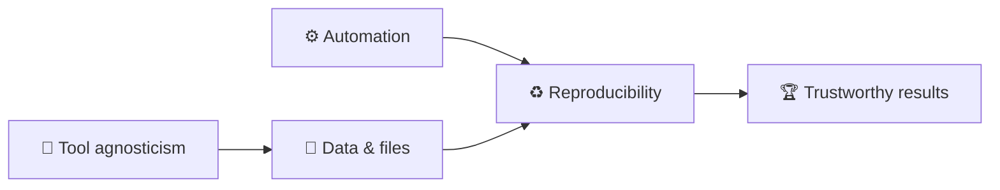
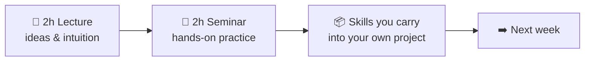
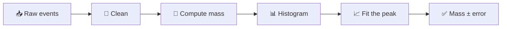

# Dr. Mindaugas Šarpis

# Best Research and Data Analysis Practices from CERN

## Orientation & Motivation

##### <span class="aims-badge">🔧 tool-agnostic · ♻️ reproducible · ⚙️ automation · 📁 data & files — the four aims</span>

<!--
Speaker: welcome them, introduce yourself briefly, and set the tone — this is a
practical course, not a lecture course. Everything is graded on one project that
of the student's own choosing; the seminars are where the skills get practised. Ask what fields are in the room. (~2 min)
-->

---
hideInToc: true
layout: fact
---

# Who am I talking to?

<!-- Speaker: quick show of hands — ask what fields/backgrounds are in the room, to calibrate later examples. -->
---
hideInToc: true
layout: quote
---

# The goal of this course is to build **intuition**, **competence**, and **confidence** in working with data — using the tools and practices of modern science

---
hideInToc: true
---

# **Course Structure**

<div class="grid-2 mt-md gap-md">

<div class="card card-primary card-glass pad-tight">

## 📖 **Lectures**

- **Theory / Overviews** — main goal is exposure
- **Discussion** — building intuition, interactivity is important

Some of the elements require deeper understanding in statistics, programming,
mathematics. The idea is to strike a balance of what to keep as a "black box"
and what needs to be understood in detail.

</div>

<div class="card card-secondary card-glass pad-tight">

## 🔬 **Seminars**

- **Demos** — live demonstrations
- **Hands-on Sessions** — *Inverted Classroom*
- **Case Studies** — real-world examples

It is very important to practice throughout the course. Using the tools and
concepts on your own projects is the best way to learn.
</div>

</div>

<div class="card card-info card-glass pad-tight mt-md">

<div class="stat-grid">
  <div class="stat">
    <span class="stat-num gradient-text">64</span><span class="stat-unit">h</span>
    <div class="stat-label">Contact hours</div>
  </div>
  <div class="stat">
    <span class="stat-num gradient-text energy">196</span><span class="stat-unit">h</span>
    <div class="stat-label">Self study</div>
  </div>
  <div class="stat">
    <span class="stat-num gradient-text">1</span>
    <div class="stat-label">Semester project</div>
  </div>
</div>

</div>

---
hideInToc: true
---

# <span class="gradient-text">Main Goals</span>

<div class="stack-tight mt-sm">

<div class="card card-primary card-glass pad-compact reveal-left">

🧠 Build intuition for **good practices**

</div>

<div class="card card-secondary card-glass pad-compact reveal-left">

🧰 Be aware of a **plethora of available free tools**

</div>

<div class="card card-accent card-glass pad-compact reveal-left">

💪 Build **competences** in relevant areas

</div>

<div class="card card-success card-glass pad-compact reveal-left glow">

🚀 Use what you learned for your **own projects**

</div>

<div class="card card-info card-glass pad-compact reveal-left">

🤝 Work together and practice **problem solving**

</div>

</div>

---
hideInToc: true
---

# The Four <span class="gradient-text">Aims</span>

<div class="card card-info card-glass pad-compact mt-sm">

Everything in this course serves four durable practices. They outlast any tool or language — and your project is graded on them.

</div>

<div class="grid-2 mt-md gap-md">

<div class="card card-primary card-glass pad-tight reveal-scale">

## 🔧 **Tool agnosticism**

Learn the *idea* first, then a tool. Concepts transfer; frameworks come and go.

</div>

<div class="card card-secondary card-glass pad-tight reveal-scale">

## ♻️ **Reproducibility**

If someone else — or future you — can't rebuild your result, it isn't a result.

</div>

<div class="card card-accent card-glass pad-tight reveal-scale">

## ⚙️ **Automation**

Do it once by hand, twice by script. Let the machine repeat the boring parts.

</div>

<div class="card card-success card-glass pad-tight reveal-scale">

## 📁 **Efficient work with data & files**

Organise, name, and format your data so it stays trustworthy and usable.

</div>

</div>

<div class="note-text mt-md">Watch for the 🔧 ♻️ ⚙️ 📁 icons throughout — every lecture advances at least one.</div>

---
hideInToc: true
---

# 📁 Before / After — **Data & Files**

<div class="grid-2 mt-md gap-md">

<div class="card card-warning card-glass pad-tight">

## ❌ **The Downloads folder**

- `data.csv`, `data(1).csv`, `data_final_v2_REAL.csv`
- Raw data, figures, and drafts all in one directory
- Which file fed the plot in the report? Nobody knows
- Deleting anything feels dangerous — so nothing is ever deleted

</div>

<div class="card card-success card-glass pad-tight">

## ✅ **A structured project**

- `data/raw/` is read-only; `data/processed/` is regenerable
- One folder per purpose: `scripts/`, `results/`, `docs/`
- Names carry meaning: `2026-03_temperature_vilnius.csv`
- "Where does this number come from?" answered in seconds

</div>

</div>

<div class="note-text mt-md">Lecture 4 (command line &amp; files) and Seminar 4 build exactly this structure on the seminar dataset — repeat it on your own project the same afternoon.</div>

<!--
Speaker: the next four slides are one before/after pair per aim, all drawn from real
projects — including mine. Don't rush them — they are the emotional core of week 1.
Ask for a show of hands at each "before": almost everyone recognises themselves. (~2 min)
-->

---
hideInToc: true
---

# ♻️ Before / After — **Reproducibility**

<div class="grid-2 mt-md gap-md">

<div class="card card-warning card-glass pad-tight">

## ❌ **"It worked on my laptop"**

- The result exists — as a screenshot in an old email
- Rebuilding it needs a specific person, machine, and mood
- Six months later even the author can't remake the plot
- Reviewer asks "what changed since draft one?" — silence

</div>

<div class="card card-success card-glass pad-tight">

## ✅ **Anyone can rerun it**

- Data, code, and environment are recorded together
- One documented command rebuilds every figure and number
- A new team member reproduces the result on day one
- "What changed?" has an exact, versioned answer

</div>

</div>

<div class="note-text mt-md">This is the single strongest predictor of a good project grade — and of trust in your science.</div>

---
hideInToc: true
---

# ⚙️ Before / After — **Automation**

<div class="grid-2 mt-md gap-md">

<div class="card card-warning card-glass pad-tight">

## ❌ **40 manual steps in a spreadsheet**

- Open file → copy column → paste → sort → delete rows → …
- Every rerun costs an afternoon and invites a fresh typo
- New data arrives → the whole ritual starts again
- The process lives only in one person's muscle memory

</div>

<div class="card card-success card-glass pad-tight">

## ✅ **One script**

- The same 40 steps written down once, executed in seconds
- New data arrives → rerun → done
- The script *is* the documentation of the method
- Boring parts are delegated; your attention goes to thinking

</div>

</div>

<div class="note-text mt-md">Rule of thumb from the aims slide: once by hand, twice by script.</div>

---
hideInToc: true
---

<MCQ
  question="You catch yourself repeating the same manual steps on your data every week. Writing a script to do it instead chiefly serves which of the Four Aims?"
  :options="[
    '🔧 Tool agnosticism',
    '♻️ Reproducibility',
    '⚙️ Automation',
    '📁 Efficient work with data & files'
  ]"
  :correct="2"
  explanation="Do it once by hand, twice by script — letting the machine repeat the boring parts is exactly what ⚙️ automation means. It often boosts ♻️ reproducibility too, but the direct target here is automation."
/>

---
hideInToc: true
---

# 🔧 Before / After — **Tool Agnosticism**

<div class="grid-2 mt-md gap-md">

<div class="card card-warning card-glass pad-tight">

## ❌ **Locked in**

- Data lives inside one proprietary tool's project file
- Analysis steps exist only as clicks nobody recorded
- Licence expires, company folds, format changes → work stranded
- Collaborators must buy the same tool just to *look*

</div>

<div class="card card-success card-glass pad-tight">

## ✅ **Open by default**

- Data in open formats: CSV, JSON, plain text
- Logic captured in code — portable across tools and decades
- Concepts learned once transfer to whatever comes next
- Anyone can inspect, verify, and build on your work

</div>

</div>

<div class="note-text mt-md">We still <em>use</em> specific tools (Python, VS Code, Git) — but every skill is chosen to transfer beyond them.</div>

---
hideInToc: true
---

# The Aims **Reinforce** Each Other



<div class="grid-2 mt-md gap-md">

<div class="card card-primary card-glass pad-compact">

## 🔗 **Not four separate boxes**

A scripted pipeline (⚙️) is automatically re-runnable (♻️). A clean file structure (📁) keeps scripts simple. Open formats (🔧) keep everything rebuildable anywhere.

</div>

<div class="card card-secondary card-glass pad-compact">

## 🧭 **Use them as a compass**

Unsure how to do something? Ask: *which choice serves more of the aims?* That one question resolves most practical dilemmas in this course — and in research.

</div>

</div>

---
hideInToc: true
---

<MCQ
  question="A colleague sends you a beautiful result: a PDF of the final plot. What is the minimum you would need for the result to count as reproducible?"
  :options="[
    'The plot again, in higher resolution',
    'The raw data, the code, and a description of the environment they ran in',
    'A video recording of them running the analysis',
    'Their word that it worked on their laptop'
  ]"
  :correct="1"
  explanation="♻️ Reproducibility means someone else can rebuild the result. That requires the inputs (data), the exact transformation (code), and the context it ran in (environment and versions). A prettier picture or a promise changes nothing."
/>

---
hideInToc: true
---

# **Course Content** — 16 lectures, 5 blocks

<div class="grid-3 mt-md gap-md">

<div class="card card-primary card-glass pad-compact reveal-scale">

**A · Foundations & Tooling** *(01–06)*
Orientation, data, computers, command line & files, Markdown & VS Code, Git

</div>

<div class="card card-secondary card-glass pad-compact reveal-scale">

**B · Programming** *(07–08)*
Python foundations, then Python for data & files

</div>

<div class="card card-info card-glass pad-compact reveal-scale">

**C · Data Analysis Core** *(09–12)*
Concepts, visualisation, probability & statistics, fitting

</div>

<div class="card card-success card-glass pad-compact reveal-scale">

**D · Practical Data Work** *(13–14)*
NumPy & Pandas, reproducible workflows & automation

</div>

<div class="card card-warning card-glass pad-compact reveal-scale">

**E · Advanced** *(optional, 15–16)*
Computing infrastructure & HPC, machine learning & AI

</div>

<div class="card card-accent card-glass pad-compact reveal-scale">

**🧪 Paired seminars**
Each lecture has a hands-on seminar — self-contained exercises on a shared open dataset; your own project is separate and graded

</div>

</div>

<div class="note-text mt-sm" style="text-align: center;">

Order and depth adapt to the group.

</div>

---
hideInToc: true
---

# **Grading Structure**

<div class="card card-success card-glass pad-tight mt-md glow">

## 🎯 **One course-long project — 100%**

The whole grade is a project you carry through the course — the natural place to *practise* everything we cover.

</div>

<div class="grid-2 mt-md gap-md">

<div class="card card-primary card-glass pad-tight reveal-left">

## 📋 **What it is**

- Related to **your** field of study or work
- Includes real **data analysis and/or automation**
- Built with Python and the good practices from this course

</div>

<div class="card card-secondary card-glass pad-tight reveal-left">

## ✅ **Graded on the four aims**

- 🔧 **Tool-agnostic**, reasoned choices
- ♻️ **Reproducible** — someone else can rebuild your results
- ⚙️ **Automated** where it counts
- 📁 **Well-organised** data & files, clearly documented

</div>

</div>

<div class="note-text mt-md">Assessed on a final presentation (graded on the spot) plus the project repository.</div>

---
hideInToc: true
---

# **Project Details**

<div class="grid-2 mt-md gap-md">

<div class="card card-primary card-glass pad-tight">

## 📋 **Requirements**

- Should be a well-developed project
- Graded relative to where you start — beginners and experienced coders are both welcome
- Can be functional (app, dashboard, website)
- Can be more educational (applying a specific method — e.g. a neural network — and explaining the concepts)
- Can use AI tools and components but must understand your code and be able to explain it

</div>

<div class="card card-secondary card-glass pad-tight">

## 📦 **Deliverables**

- Codebase available on course repository (info in eMokymai)
- Project written up in a **one-page report** (added to the repository)
- 10–30 second video showcasing the project (linked to the repository)
- Final **presentation** at the end of the course (graded on the spot)

</div>

</div>

---
hideInToc: true
---

# Two Things You'll **Build**

<div class="grid-2 mt-md gap-md">

<div class="card card-primary card-glass pad-tight">

## 🔬 **The seminars**

One hands-on brief per week, on a **real, open dataset** — LHCb collision data, or a dataset from your own field. Each brief stands on its own; where it helps, consecutive sessions build on each other.

</div>

<div class="card card-accent card-glass pad-tight">

## 🎯 **Your project**

**One project of your own** — topic, data, and form are entirely your call. It grows across the semester, and it is what you are graded on.

</div>

</div>

<div class="note-text mt-md">The seminars teach the moves; the project is where you make them yours. How much the two overlap is up to you — we shape that together as the term goes.</div>

---
hideInToc: true
---

# Your Project — **Your Call**

<div class="grid-2 mt-md gap-md">

<div class="card card-primary card-glass pad-tight">

## 🧭 **Any field, any form**

A data analysis, a working app or dashboard, an educational piece that explains a method — from physics, biology, economics, or a hobby. Pick something you actually want to exist.

</div>

<div class="card card-secondary card-glass pad-tight">

## 🏆 **Graded on the four aims**

Not on the topic: reasoned tool choices, a rebuildable result, automation where it counts, clean data & files — handed in as the four deliverables listed on *Project Details*.

</div>

</div>

<div class="note-text mt-md">Bring a first idea to an early seminar and talk it through — the sooner a project exists, the more of the course it can absorb.</div>

---
hideInToc: true
---

# **Schedule**

Every week: **2 h lecture** + **2 h seminar** — 16 weeks, one lecture per week.

| **Weeks** | **Block** |
| --- | --- |
| 1 – 6 | **A** · Foundations & Tooling |
| 7 – 8 | **B** · Programming |
| 9 – 12 | **C** · Data Analysis Core |
| 13 – 14 | **D** · Practical Data Work |
| 15 – 16 | **E** · Advanced *(optional)* |
| **Exam session** | **Final Project Presentations** |

<style scoped>
table {
  font-size: 0.95em;
}
table td, table th {
  padding-top: 0.45em;
  padding-bottom: 0.45em;
}
table thead th {
  border-bottom: 3px solid rgba(255, 255, 255, 0.5);
}
table td:nth-child(2),
table th:nth-child(2) {
  text-align: right;
}
</style>

---
hideInToc: true
---

# **Learning Outcomes**

<div class="grid-2 mt-md gap-md">

<div class="card card-primary card-glass pad-compact reveal-up">

🧠 Understand main concepts of **computing**

</div>

<div class="card card-info card-glass pad-compact reveal-up">

📐 Gain knowledge on **mathematics and statistics** for data analysis

</div>

<div class="card card-secondary card-glass pad-compact reveal-up">

🎯 Know which **tools** to choose for a specific task

</div>

<div class="card card-success card-glass pad-compact reveal-up">

🤖 Understand the basics of **machine learning and AI**

</div>

<div class="card card-accent card-glass pad-compact reveal-up">

⚡ Be able to implement simple **data analysis workflows** on the fly

</div>

<div class="card card-primary card-glass pad-compact reveal-up">

🔀 Become **platform and tool agnostic** in your work

</div>

<div class="card card-warning card-glass pad-compact reveal-up">

🛡️ Be safe from **common pitfalls** in working with computers

</div>

<div class="card card-secondary card-glass pad-compact reveal-up">

🚀 Be able to **adapt** to new tools and technologies quicker

</div>

</div>

<div class="note-text mt-md">Eight outcomes, one thread: by the end you can take a dataset you have never seen, in a tool you have never used, and produce a result someone else can rebuild.</div>

---
layout: section
hideInToc: true
---

# How This Course **Works**

---
hideInToc: true
---

# Two Halves of **One Week**



<div class="grid-2 mt-sm gap-md">

<div class="card card-primary card-glass pad-tight">

## 📖 **The lecture**

- Explains *why* a practice matters and *how* to think about it
- Shows the idea on real examples — including from CERN
- Interactive: questions, votes, and short reflections
- Goal is **exposure and intuition**, not memorising commands

</div>

<div class="card card-secondary card-glass pad-tight">

## 🔬 **The seminar**

- You do it yourself, on a real dataset, in your own repository
- Inverted classroom: you type, break things, and fix them
- The instructor circulates — help is closest when you are stuck
- Goal is a **working result** you commit before you leave

</div>

</div>

<div class="note-text mt-sm">Sixteen weeks, each the same shape — concepts first, muscle memory second. Miss the seminar and the lecture stays abstract; skip the lecture and the seminar feels like magic. <strong>They are one unit.</strong> Each seminar is a self-contained exercise on a shared, real dataset; every skill it teaches is meant to be carried straight into your own project.</div>

---
hideInToc: true
---

# What **"Done"** Looks Like Each Week

<div class="card card-success card-glass pad-tight mt-md">

## ✅ **A small, finished thing — committed**

Every seminar ends the same way: something new works, and you **commit it to your repository**. Not a perfect thing, not a whole project — one honest step, saved and dated.

</div>

<div class="grid-3 gap-md mt-md">

<div class="card card-primary card-glass pad-compact">

## 📦 **Saved**

The new work is in your repo, not in a stray file on the desktop.

</div>

<div class="card card-secondary card-glass pad-compact">

## 🔁 **Runs again**

You can re-run it in a fresh terminal and get the same result.

</div>

<div class="card card-accent card-glass pad-compact">

## 📝 **Explainable**

You can say, in one sentence, what it does and why.

</div>

</div>

---
hideInToc: true
---

# How to **Succeed** Here

<div class="grid-2 mt-md gap-md">

<div class="card card-success card-glass pad-tight">

## 🌱 **Do this**

- **Show up to the seminar** — the doing is where it sticks
- **Type it yourself**, even when copy-paste would be faster
- Keep one project and grow it; don't restart every week
- Ask early — a five-minute question saves a lost evening

</div>

<div class="card card-warning card-glass pad-tight">

## 🚧 **Avoid this**

- Bingeing every lecture the night before the presentation
- Collecting tools you never actually use on your data
- Hiding a broken step instead of asking about it
- Treating "it ran once" as the same as "it's reproducible"

</div>

</div>

<div class="note-text mt-md">You do not need to already be a programmer to do well. You need to be persistent and organised.</div>

---
hideInToc: true
---

# Honest **Expectations**

<div class="card card-info card-glass pad-tight mt-sm">

This course is practical, and practical means friction. Everyone in the room hits the same three walls — knowing they are normal is half the battle.

</div>

<div class="grid-3 gap-md mt-md">

<div class="card card-primary card-glass pad-compact">

## ⌨️ **You will type a lot**

Commands feel slow and error-prone at first. Two weeks in, they are faster than clicking.

</div>

<div class="card card-warning card-glass pad-compact">

## 💥 **You will break things**

Errors are the normal state of programming, not a sign of failing. Read them — they usually name the fix.

</div>

<div class="card card-success card-glass pad-compact">

## 🙋 **You will ask for help**

Stuck for fifteen minutes? Ask. Getting unstuck fast is a skill, not a defeat.

</div>

</div>

---
hideInToc: true
---

# What This Course **Is Not**

<div class="grid-2 mt-md gap-md">

<div class="card card-warning card-glass pad-tight">

## 🚫 **Not this**

- Not a deep programming course — we write *enough* code to get work done
- Not tied to one tool you must adopt forever
- Not a race to the fanciest machine-learning model
- Not graded on exams full of syntax to memorise

</div>

<div class="card card-success card-glass pad-tight">

## 🎯 **But this**

- A course in *practices* that survive any language or tool
- Enough hands-on fluency to be dangerous — and to keep learning
- One honest, reproducible project you understand end to end
- Judgement about **which** tool, and **why**

</div>

</div>

<div class="note-text mt-md">Already code well? The challenge just shifts from syntax to doing it <em>reproducibly</em>. There's a level here for everyone.</div>

---
hideInToc: true
---

# Where to Get **Help**

<div class="grid-2 mt-md gap-md">

<div class="card card-primary card-glass pad-tight">

## 🧑‍🏫 **In the room**

- The instructor, during every seminar — that is what the two hours are for
- Your neighbour: explaining a problem out loud often solves it

</div>

<div class="card card-secondary card-glass pad-tight">

## 🌐 **On your own**

- The error message itself — paste it into a search engine
- Official docs, the workbook, and yes, AI assistants — as long as you understand what they hand you

</div>

</div>

<div class="note-text mt-md">🔧 One aim in disguise: learning <em>how to find out</em> is more durable than memorising any single answer.</div>

---
hideInToc: true
---

<MCQ
  question="It's week 5. You attend every lecture but skip the seminars because you 'get the ideas already'. Why is this the riskiest habit in this course?"
  :options="[
    'Lectures are worth more marks than seminars',
    'The seminars are where an idea becomes a working skill — and your project is graded on skills, not on understanding',
    'You will miss the attendance sign-in sheet',
    'The ideas in the lectures are not important'
  ]"
  :correct="1"
  explanation="The seminars aren't graded, but the project is — on the four aims, which are practices you only acquire by doing. Understanding an idea in the lecture is not the same as having it run in a repository: the seminar is where 'done' happens, and your project is where you repeat it on your own data."
/>

---
layout: section
hideInToc: true
---

# Seminars & **Your Project**

---
hideInToc: true
---

# Why **Real, Open** Data

<div class="grid-2 mt-md gap-md">

<div class="card card-primary card-glass pad-tight">

## 🌍 **Open by principle**

CERN publishes its data so anyone can check the science. In the seminars you download the *same* events physicists used — no toy stand-in, no paywall.

</div>

<div class="card card-secondary card-glass pad-tight">

## 🔬 **Real means messy**

Real data carries noise, background, and quirks a clean textbook set never shows. Learning to handle that *is* the skill worth having.

</div>

</div>

<div class="card card-info card-glass pad-compact mt-md">

## ♻️ **It models the whole point**

Open data, recorded provenance, a rebuildable analysis — the seminar exercises are the four aims in miniature, on data the whole world can inspect.

</div>

---
hideInToc: true
---

# What the Seminars **Cover**

| **Seminars** | **Hands-on focus** |
| --- | --- |
| S1–S2 | Toolkit; repo skeleton + first commit; a dataset with provenance |
| S3–S5 | The raw file as bytes; clean structure; a real README |
| S6–S8 | Git — branch & merge; parse one line; read a whole file |
| S9–S11 | Data-quality audit; a first figure; a value ± its error |
| S12 | **The fit** — a peak → value ± error, with a χ² |
| S13–S14 | Tidy tables; one-command reproducible rebuild |
| S15–S16 *(optional)* | Batch-run a pipeline; an honest classifier |

<div class="note-text mt-sm">Every one of these transfers straight into your own project — that is the point.</div>

---
hideInToc: true
---

# From Raw Data to a **Result**



<div class="card card-info card-glass pad-compact mt-md">

This is the whole arc in one line — and every box is a seminar. The same shape fits any dataset: swap "compute mass" for "compute your variable" and the pipeline is your project's.

</div>

<div class="note-text mt-sm">By the end, one command walks the entire chain, raw to result, untouched by hand.</div>

---
hideInToc: true
---

# The Finished **Product**

<div class="grid-2 mt-md gap-md">

<div class="card card-primary card-glass pad-tight">

## 📦 **What you hand in**

A single versioned repository: raw data (if any), scripts, results, a pinned environment, and a `README`. The report, video, and presentation from *Project Details* all describe this one thing.

Every seminar practises one piece of this tree on the shared dataset; your project assembles the whole of it around your own question.

</div>

<div class="card card-secondary card-glass pad-tight">

```text
my-project/
├─ data/raw/        # inputs, untouched
│                   # (if your project has data)
├─ scripts/         # one per step
├─ results/         # all regenerable
├─ environment.yml  # pinned
├─ Makefile         # make all
└─ README.md        # how to rebuild
```

</div>

</div>

<div class="note-text mt-md">Clean, automated, documented — the four aims made concrete, in a form you can show a supervisor or an employer.</div>

---
hideInToc: true
---

# The Golden **Rule**

<div class="card card-success card-glass pad-tight mt-md glow">

## 🏆 **Delete everything but `data/raw/` and `scripts/` — then rebuild it all with one command.**

If that is true of your project, you've succeeded. Every practice in this course exists to make that one sentence true of your work.

</div>

<div class="note-text mt-md">Reproducibility isn't a chore you bolt on at the end — it's the property that makes everything else trustworthy.</div>

---
hideInToc: true
---

<MCQ
  question="The 'golden rule' of a reproducible project says you could delete everything except two folders and rebuild the whole analysis with one command. Which two folders?"
  :options="[
    'results/ and data/processed/',
    'data/raw/ and scripts/',
    'data/processed/ and Makefile',
    'README.md and results/'
  ]"
  :correct="1"
  explanation="Raw data can't be regenerated, and scripts encode every step that turns it into results. Keep those two and everything else — cleaned tables, figures, numbers — can be rebuilt automatically. (The Makefile and environment.yml stay too: they are part of the recipe, not results.) That's reproducibility and automation working together."
/>

---
hideInToc: true
layout: fact
---

# Breaks...

<!-- Speaker: signal a short break here — then lights down for CERN and the reel. -->

---
layout: section
hideInToc: true
---

# What is **CERN**?


<!--
Speaker: section break. Ask who has heard of CERN and what for — most will say
"the Higgs" or "the Web". Use that to preview the next few slides: the org, the
machine, and how a detector actually sees a collision. (~1 min)
-->

---
hideInToc: true
---

# CERN at a Glance

<div class="grid-2 mt-md gap-md">

<div class="card card-primary card-glass pad-tight">

## 🏛️ **The Organisation**

- **European Organization for Nuclear Research**
- Founded in **1954** by 12 European states
- Today: **24 member states**, thousands of visiting scientists
- Located at the **French-Swiss border** near Geneva

</div>

<div class="card card-secondary card-glass pad-tight">

## 🎯 **The Mission**

- Probe the **fundamental structure** of matter
- Build and operate the world's most powerful **particle accelerators**
- Push the boundaries of **technology and engineering**
- Train the **next generation** of scientists

</div>

</div>

<div class="card card-accent card-glass pad-tight mt-md">

## 🌍 **By the Numbers**

🔬 World's **largest** particle physics laboratory · 👩‍🔬 **17,000+** scientists from **110+ nations** · 🏗️ Operating since **1954** · 🧪 Home to the **Large Hadron Collider**

</div>

---
hideInToc: true
---

# The Large Hadron Collider (LHC)

<div class="card card-info card-glass pad-tight">

## ⚙️ **The Machine**

- A **27 km** circumference ring situated **100 m** underground
- Accelerates protons to **99.9999991%** the speed of light
- Collides particles **~1 billion times per second**
- Operating temperature: **1.9 K** (~ -271.3°C — colder than outer space)

</div>

<div class="grid-2 mt-md gap-md">

<div class="card card-primary card-glass pad-compact">

## 🔭 **Main Experiments**

- **ATLAS** — general-purpose detector
- **CMS** — general-purpose detector
- **ALICE** — heavy-ion collisions
- **LHCb** — matter-antimatter asymmetry

</div>

<div class="card card-warning card-glass pad-compact">

## 🏆 **Key Achievement**

Discovery of the **Higgs boson** in **2012** — confirmed the mechanism that gives particles their mass

Nobel Prize in Physics 2013

*Precisely: this gives mass to fundamental particles (**fermions**, **W/Z** bosons) — most of the mass around you (e.g. the proton's) is **QCD binding energy**, not the Higgs.*

</div>

</div>

---
hideInToc: true
---

# The Accelerator <span class="gradient-text">Chain</span>

<div class="card card-info card-glass pad-compact mt-sm">

🔗 No single machine takes protons from a hydrogen bottle to near light speed — the LHC is only the **last link in a chain**, each accelerator handing faster particles to the next.

</div>

<div class="stack-tight mt-md">

<div class="card card-primary card-glass pad-compact reveal-left">

1️⃣ **LINAC4** — a linear accelerator kicks things off: **160 MeV**

</div>

<div class="card card-secondary card-glass pad-compact reveal-left">

2️⃣ **PS Booster → Proton Synchrotron** — first rings: **2 GeV → 26 GeV**

</div>

<div class="card card-accent card-glass pad-compact reveal-left">

3️⃣ **Super Proton Synchrotron (SPS)** — 7 km ring: **450 GeV**

</div>

<div class="card card-success card-glass pad-compact reveal-left">

4️⃣ **LHC** — 27 km ring: **6.8 TeV per beam** *(Run 3)* — then the beams are made to cross inside the detectors

</div>

</div>

<div class="card card-warning card-glass pad-compact mt-md reveal-up">

💡 Each machine was once CERN's frontier — today's record-holder is tomorrow's injector.

</div>

---
hideInToc: true
---

# How a Detector <span class="gradient-text">Sees</span> a Collision

<div class="card card-info card-glass pad-compact mt-sm">

🧅 Detectors like ATLAS are built as **layers of an onion** around the collision point — each layer measures a different property of the particles flying out.

</div>

<div class="grid-2 mt-md gap-md">

<div class="card card-primary card-glass pad-compact reveal-scale">

## 🌀 **Tracker** *(innermost)*

Charged particles bend in a magnetic field — the curvature of each track gives its **momentum**

</div>

<div class="card card-secondary card-glass pad-compact reveal-scale">

## ⚡ **EM Calorimeter**

Stops **electrons and photons**, measuring the **energy** they deposit

</div>

<div class="card card-accent card-glass pad-compact reveal-scale">

## 🔨 **Hadronic Calorimeter**

Stops **hadrons** — particles made of quarks (protons, neutrons, pions) — again measuring **energy**

</div>

<div class="card card-success card-glass pad-compact reveal-scale">

## 🧲 **Muon System** *(outermost)*

**Muons** punch through everything else — dedicated outer chambers catch them

</div>

</div>

<div class="card card-warning card-glass pad-compact mt-md reveal-up">

💾 One collision → **millions of electronic signals** across these layers. Software reassembles them into particles — those are the "detector readings" every analysis starts from.

</div>

---
layout: section
hideInToc: true
---

# From the **Cosmos** to the **Quantum**

The next short films sweep across the scales of nature — from mountains and deep space down to individual atoms and particle tracks.

Watch for the **change in scale**: the same urge to observe, measure, and understand connects a telescope pointed at distant galaxies with a detector watching protons collide.

<!--
Speaker: dim the lights. Let the films run — don't narrate over them. The one cue
to plant beforehand: spot the instrument in every scene — camera, rover, telescope,
chamber — and ask what its output looks like once it is stored. The Half-time slide
turns that into a question; the closing section picks it up. (~1 min setup)

NOTE (reel pass 1): 17 of these 18 clips are HEVC — verify the venue browser decodes HEVC (Firefox and Linux Chrome do not: they show 'Video not available' or black video with sound). Pass 2 re-encodes to H.264.
-->

---
hideInToc: true
---

<VideoPlayer src="Drone_Climbing_Mountain.mp4" />

<!-- Reel · Act I · drone ascent — Earth at human scale (0:27). Slot 1 before this = vu_physics_faculty.mp4, maintainer-supplied, added in pass 2. -->

---
hideInToc: true
---

<VideoPlayer src="NASA_Mars_Mariner_4_Pan_Audio.mp4" />

<!-- Reel · Act I · Mariner 4, 1965 — the first data from another planet (0:20) -->

---
hideInToc: true
---

<VideoPlayer src="Perseverence_Rover_Landing_NASA.mp4" />

<!-- Reel · Act I · Perseverance landing on Mars (3:10; this is the 1080p asset under its misspelt release name — pass 2 replaces it with perseverance_rover_landing_nasa.mp4 trimmed to 1:30) -->

---
hideInToc: true
---

<VideoPlayer src="Cassini_Grand_Finale_NO_VO.mp4" />

<!-- Reel · Act I · Cassini at Saturn (3:41; trimmed to 1:30 in pass 2) -->

---
hideInToc: true
---

<VideoPlayer src="Stars_Pan_Audio.mp4" />

<!-- Reel · Act I · star field pan (0:20) -->

---
hideInToc: true
---

<VideoPlayer src="Telescope.mp4" />

<!-- Reel · Act I · observatory (0:40) -->

---
hideInToc: true
---

<VideoPlayer src="Hubble.mp4" />

<!-- Reel · Act I · Hubble imagery (0:33) -->

---
hideInToc: true
---

<VideoPlayer src="Webb_Reel.mp4" />

<!-- Reel · Act I · JWST reel (2:58; trimmed to 1:30 in pass 2) -->

---
hideInToc: true
---

<VideoPlayer src="Milky_Way_Sim_Audio.mp4" />

<!-- Reel · Act I · Milky Way simulation (1:01). Pass 2 adds sdss_universe_zoom.mp4 after this. -->

---
hideInToc: true
---

<VideoPlayer src="Expansion_Funnel_H264_1080p.webm" />

<!-- Reel · Act I · cosmic expansion funnel (0:30) -->

---
hideInToc: true
layout: fact
---

# Half-time

## Every scene so far ends as data someone must turn into understanding — which one would *you* analyse first?

---
hideInToc: true
---

<VideoPlayer src="QGP_Formation.mp4" />

<!-- Reel · Act II · quark-gluon plasma forms (0:33). Pass 2 adds the Standard Model animation after this. -->

---
hideInToc: true
---

<VideoPlayer src="Voyage_in_to_the_world_of_atoms.mp4" />

<!-- Reel · Act II · hair → cells → atom → nucleus → quarks (2:01) -->

---
hideInToc: true
---

<VideoPlayer src="Cloud_Chamber_Audio.mp4" />

<!-- Reel · Act II · cloud chamber — particles made visible (2:29; trimmed to 1:30 in pass 2) -->

---
layout: section
hideInToc: true
---

# Inside **CERN**

Now we descend from the universe at large into the laboratory itself — the accelerators, detectors, and people who turn these big questions into concrete measurements.

<!--
Speaker: shift from cosmos to lab. These clips show the real machines behind the
diagrams — ATLAS, LHCb, the tunnels. Point out the human scale next to the
detectors before rolling. (~1 min setup)
-->

---
hideInToc: true
---

<VideoPlayer src="CERN_Overview_Short.mp4" />

<!-- Reel · Act III · CERN aerial (0:11). Pass 2 adds the LHC tunnel travelling shot after this. -->

---
hideInToc: true
---

<VideoPlayer src="ATLAS-FOOTAGE-2022-004-002-1080p_Shaft.mp4" />

<!-- Reel · Act III · descending the ATLAS shaft (0:29) -->

---
hideInToc: true
---

<VideoPlayer src="ATLAS-VIDEO-2021-001-001-1080p.mp4" />

<!-- Reel · Act III · ATLAS overview — model, cavern, control room (0:49). Pass 2 adds CMS and the LHCb fly-in after this. -->

---
hideInToc: true
---

<VideoPlayer src="LHCb.mp4" />

<!-- Reel · Act III · LHCb — home of the seminar dataset (0:47). Pass 2 adds collision, event display, data centre, WLCG, exabyte chart, accelerator-complex animation after this. -->

---
hideInToc: true
---

<VideoPlayer src="CERN-FOOTAGE-2024-006-001.mp4" />

<!-- Reel · Act III · FCC map — the future (0:18) -->

---
hideInToc: true
---

# Why <span class="gradient-text">You</span> Need These Skills

CERN turns raw collisions into discoveries with exactly the toolkit this course builds:

<div class="grid-2 mt-md gap-md">

<div class="card card-primary card-glass pad-tight reveal-up">

## 📁 **Handling Massive Data**

Petabytes of detector output demand disciplined file handling, data formats, and organisation.

</div>

<div class="card card-secondary card-glass pad-tight reveal-up">

## 🔀 **Working Together**

Thousands of scientists share one codebase — impossible without version control.

</div>

<div class="card card-accent card-glass pad-tight reveal-up">

## 🐍 **Turning Signal into Insight**

Python and data-analysis tools transform readings into physics.

</div>

<div class="card card-warning card-glass pad-tight reveal-up">

## 🎲 **Real or a Fluke?**

Statistics decide whether a bump in the data is a discovery — or noise.

</div>

</div>

<div class="card card-info card-glass pad-compact mt-md" style="text-align: center;">

You don't need a particle accelerator to use any of this. **Next lecture: what data actually is — then we build the skills, from how a computer works to the command line.**

</div>

---
hideInToc: true
---

# **What You Need**

<div class="grid-2 mt-md gap-md">

<div class="card card-primary card-glass pad-tight">

## 🖥️ **Your Toolkit**

- A **laptop** with internet access
- A **web browser** (Chrome, Firefox, Edge)
- An **IDE** (VS Code)
- **Python 3.10+** installed ([python.org](https://python.org))

*🔧 Tool-agnostic: conda, PyCharm, or any equivalent works — the aim is the skill, not the tool.*

</div>

<div class="card card-secondary card-glass pad-tight">

## ⚡ **Quick Check**

Open a terminal and run:

```bash
python --version
```

You should see `Python 3.x.x`. If not, we'll fix it now.

*(On macOS/Linux the command may be `python3` — both are fine.)*

</div>

</div>

<div class="card card-info card-glass pad-compact mt-sm">

## 🔧 **Today's Task**

1. Install Python if needed
2. Install VS Code
3. Open a terminal and verify `python --version`
4. Create a folder: `mkdir analysis-project` (Seminar 1 fills it)

*Stuck on installation? Don't worry — Seminar 1, this week, walks through the whole setup together. Today the goal is simply to have your laptop ready.*

</div>
