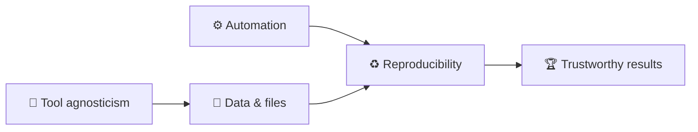
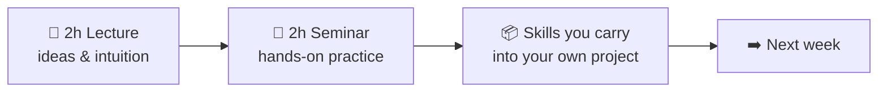
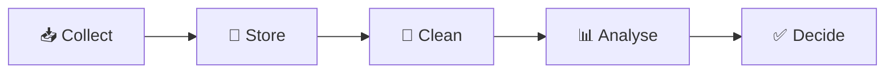
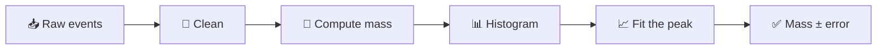

# Dr. Mindaugas Šarpis

# Best Research and Data Analysis Practices from CERN

## Course Orientation

##### <span class="aims-badge">🔧 tool-agnostic · ♻️ reproducible · ⚙️ automation · 📁 data & files — the four aims</span>

<!--
Speaker: welcome them, introduce yourself briefly, and set the tone — this is a
practical course, not a lecture course. Everything is graded on one project that
of the student's own choosing; the seminars are where the skills get practised. Ask what fields are in the room. (~2 min)
-->

---
hideInToc: true
layout: fact
---

# Who am I talking to?

<!-- Speaker: quick show of hands — ask what fields/backgrounds are in the room, to calibrate later examples. -->
---
hideInToc: true
layout: quote
---

# The goal of this course is to build **intuition**, **competence**, and **confidence** in working with data — using the tools and practices of modern science

---
hideInToc: true
---

# **Course Structure**

<div class="grid-2 mt-md gap-md">

<div class="card card-primary card-glass pad-tight">

## 📖 **Lectures**

- **Theory / Overviews** — main goal is exposure
- **Discussion** — building intuition, interactivity is important

Some of the elements require deeper understanding in statistics, programming,
mathematics. The idea is to strike a balance of what to keep as a "black box"
and what needs to be understood in detail.

</div>

<div class="card card-secondary card-glass pad-tight">

## 🔬 **Seminars**

- **Demos** — live demonstrations
- **Hands-on Sessions** — *Inverted Classroom*
- **Case Studies** — real-world examples

It is very important to practice throughout the course. Using the tools and
concepts on your own projects is the best way to learn.
</div>

</div>

<div class="card card-info card-glass pad-tight mt-md">

<div class="stat-grid">
  <div class="stat">
    <span class="stat-num gradient-text">64</span><span class="stat-unit">h</span>
    <div class="stat-label">Contact hours</div>
  </div>
  <div class="stat">
    <span class="stat-num gradient-text energy">196</span><span class="stat-unit">h</span>
    <div class="stat-label">Self study</div>
  </div>
  <div class="stat">
    <span class="stat-num gradient-text">1</span>
    <div class="stat-label">Semester project</div>
  </div>
</div>

</div>

---
hideInToc: true
---

# <span class="gradient-text">Main Goals</span>

<div class="stack-tight mt-sm">

<div class="card card-primary card-glass pad-compact reveal-left">

🧠 Build intuition for **good practices**

</div>

<div class="card card-secondary card-glass pad-compact reveal-left">

🧰 Be aware of a **plethora of available free tools**

</div>

<div class="card card-accent card-glass pad-compact reveal-left">

💪 Build **competences** in relevant areas

</div>

<div class="card card-success card-glass pad-compact reveal-left glow">

🚀 Use what you learned for your **own projects**

</div>

<div class="card card-info card-glass pad-compact reveal-left">

🤝 Work together and practice **problem solving**

</div>

</div>

---
hideInToc: true
---

# The Four <span class="gradient-text">Aims</span>

<div class="card card-info card-glass pad-compact mt-sm">

Everything in this course serves four durable practices. They outlast any tool or language — and your project is graded on them.

</div>

<div class="grid-2 mt-md gap-md">

<div class="card card-primary card-glass pad-tight reveal-scale">

## 🔧 **Tool agnosticism**

Learn the *idea* first, then a tool. Concepts transfer; frameworks come and go.

</div>

<div class="card card-secondary card-glass pad-tight reveal-scale">

## ♻️ **Reproducibility**

If someone else — or future you — can't rebuild your result, it isn't a result.

</div>

<div class="card card-accent card-glass pad-tight reveal-scale">

## ⚙️ **Automation**

Do it once by hand, twice by script. Let the machine repeat the boring parts.

</div>

<div class="card card-success card-glass pad-tight reveal-scale">

## 📁 **Efficient work with data & files**

Organise, name, and format your data so it stays trustworthy and usable.

</div>

</div>

<div class="note-text mt-md">Watch for the 🔧 ♻️ ⚙️ 📁 icons throughout — every lecture advances at least one.</div>

---
hideInToc: true
---

# 📁 Before / After — **Data & Files**

<div class="grid-2 mt-md gap-md">

<div class="card card-warning card-glass pad-tight">

## ❌ **The Downloads folder**

- `data.csv`, `data(1).csv`, `data_final_v2_REAL.csv`
- Raw data, figures, and drafts all in one directory
- Which file fed the plot in the report? Nobody knows
- Deleting anything feels dangerous — so nothing is ever deleted

</div>

<div class="card card-success card-glass pad-tight">

## ✅ **A structured project**

- `data/raw/` is read-only; `data/processed/` is regenerable
- One folder per purpose: `scripts/`, `results/`, `docs/`
- Names carry meaning: `2026-03_temperature_vilnius.csv`
- "Where does this number come from?" answered in seconds

</div>

</div>

<div class="note-text mt-md">Lecture 4 (command line &amp; files) and Seminar 4 build exactly this structure on the seminar dataset — repeat it on your own project the same afternoon.</div>

<!--
Speaker: the next four slides are one before/after pair per aim, all drawn from real
projects — including mine. Don't rush them — they are the emotional core of week 1.
Ask for a show of hands at each "before": almost everyone recognises themselves. (~2 min)
-->

---
hideInToc: true
---

# ♻️ Before / After — **Reproducibility**

<div class="grid-2 mt-md gap-md">

<div class="card card-warning card-glass pad-tight">

## ❌ **"It worked on my laptop"**

- The result exists — as a screenshot in an old email
- Rebuilding it needs a specific person, machine, and mood
- Six months later even the author can't remake the plot
- Reviewer asks "what changed since draft one?" — silence

</div>

<div class="card card-success card-glass pad-tight">

## ✅ **Anyone can rerun it**

- Data, code, and environment are recorded together
- One documented command rebuilds every figure and number
- A new team member reproduces the result on day one
- "What changed?" has an exact, versioned answer

</div>

</div>

<div class="note-text mt-md">This is the single strongest predictor of a good project grade — and of trust in your science.</div>

---
hideInToc: true
---

# ⚙️ Before / After — **Automation**

<div class="grid-2 mt-md gap-md">

<div class="card card-warning card-glass pad-tight">

## ❌ **40 manual steps in a spreadsheet**

- Open file → copy column → paste → sort → delete rows → …
- Every rerun costs an afternoon and invites a fresh typo
- New data arrives → the whole ritual starts again
- The process lives only in one person's muscle memory

</div>

<div class="card card-success card-glass pad-tight">

## ✅ **One script**

- The same 40 steps written down once, executed in seconds
- New data arrives → rerun → done
- The script *is* the documentation of the method
- Boring parts are delegated; your attention goes to thinking

</div>

</div>

<div class="note-text mt-md">Rule of thumb from the aims slide: once by hand, twice by script.</div>

---
hideInToc: true
---

<MCQ
  question="You catch yourself repeating the same manual steps on your data every week. Writing a script to do it instead chiefly serves which of the Four Aims?"
  :options="[
    '🔧 Tool agnosticism',
    '♻️ Reproducibility',
    '⚙️ Automation',
    '📁 Efficient work with data & files'
  ]"
  :correct="2"
  explanation="Do it once by hand, twice by script — letting the machine repeat the boring parts is exactly what ⚙️ automation means. It often boosts ♻️ reproducibility too, but the direct target here is automation."
/>

---
hideInToc: true
---

# 🔧 Before / After — **Tool Agnosticism**

<div class="grid-2 mt-md gap-md">

<div class="card card-warning card-glass pad-tight">

## ❌ **Locked in**

- Data lives inside one proprietary tool's project file
- Analysis steps exist only as clicks nobody recorded
- Licence expires, company folds, format changes → work stranded
- Collaborators must buy the same tool just to *look*

</div>

<div class="card card-success card-glass pad-tight">

## ✅ **Open by default**

- Data in open formats: CSV, JSON, plain text
- Logic captured in code — portable across tools and decades
- Concepts learned once transfer to whatever comes next
- Anyone can inspect, verify, and build on your work

</div>

</div>

<div class="note-text mt-md">We still <em>use</em> specific tools (Python, VS Code, Git) — but every skill is chosen to transfer beyond them.</div>

---
hideInToc: true
---

# The Aims **Reinforce** Each Other



<div class="grid-2 mt-md gap-md">

<div class="card card-primary card-glass pad-compact">

## 🔗 **Not four separate boxes**

A scripted pipeline (⚙️) is automatically re-runnable (♻️). A clean file structure (📁) keeps scripts simple. Open formats (🔧) keep everything rebuildable anywhere.

</div>

<div class="card card-secondary card-glass pad-compact">

## 🧭 **Use them as a compass**

Unsure how to do something? Ask: *which choice serves more of the aims?* That one question resolves most practical dilemmas in this course — and in research.

</div>

</div>

---
hideInToc: true
---

<MCQ
  question="A colleague sends you a beautiful result: a PDF of the final plot. What is the minimum you would need for the result to count as reproducible?"
  :options="[
    'The plot again, in higher resolution',
    'The raw data, the code, and a description of the environment they ran in',
    'A video recording of them running the analysis',
    'Their word that it worked on their laptop'
  ]"
  :correct="1"
  explanation="♻️ Reproducibility means someone else can rebuild the result. That requires the inputs (data), the exact transformation (code), and the context it ran in (environment and versions). A prettier picture or a promise changes nothing."
/>

---
hideInToc: true
---

# **Course Content** — 16 lectures, 5 blocks

<div class="grid-3 mt-md gap-md">

<div class="card card-primary card-glass pad-compact reveal-scale">

**A · Foundations & Tooling** *(01–06)*
Orientation, CERN, computers, command line & files, Markdown & VS Code, Git

</div>

<div class="card card-secondary card-glass pad-compact reveal-scale">

**B · Programming** *(07–08)*
Python foundations, then Python for data & files

</div>

<div class="card card-info card-glass pad-compact reveal-scale">

**C · Data Analysis Core** *(09–12)*
Concepts, visualisation, probability & statistics, fitting

</div>

<div class="card card-success card-glass pad-compact reveal-scale">

**D · Practical Data Work** *(13–14)*
NumPy & Pandas, reproducible workflows & automation

</div>

<div class="card card-warning card-glass pad-compact reveal-scale">

**E · Advanced** *(optional, 15–16)*
Computing infrastructure & HPC, machine learning & AI

</div>

<div class="card card-accent card-glass pad-compact reveal-scale">

**🧪 Paired seminars**
Each lecture has a hands-on seminar — self-contained exercises on a shared open dataset; your own project is separate and graded

</div>

</div>

<div class="note-text mt-sm" style="text-align: center;">

Order and depth adapt to the group; block E may be dropped if time runs short.

</div>

---
hideInToc: true
---

# **Grading Structure**

<div class="card card-success card-glass pad-tight mt-md glow">

## 🎯 **One course-long project — 100%**

The whole grade is a project you carry through the course — the natural place to *practise* everything we cover.

</div>

<div class="grid-2 mt-md gap-md">

<div class="card card-primary card-glass pad-tight reveal-left">

## 📋 **What it is**

- Related to **your** field of study or work
- Includes real **data analysis and/or automation**
- Built with Python and the good practices from this course

</div>

<div class="card card-secondary card-glass pad-tight reveal-left">

## ✅ **Graded on the four aims**

- 🔧 **Tool-agnostic**, reasoned choices
- ♻️ **Reproducible** — someone else can rebuild your results
- ⚙️ **Automated** where it counts
- 📁 **Well-organised** data & files, clearly documented

</div>

</div>

<div class="note-text mt-md">Assessed on a final presentation (graded on the spot) plus the project repository.</div>

---
hideInToc: true
---

# **Project Details**

<div class="grid-2 mt-md gap-md">

<div class="card card-primary card-glass pad-tight">

## 📋 **Requirements**

- Should be a well-developed project
- Graded relative to where you start — beginners and experienced coders are both welcome
- Can be functional (app, dashboard, website)
- Can be more educational (applying a specific method — e.g. a neural network — and explaining the concepts)
- Can use AI tools and components but must understand your code and be able to explain it

</div>

<div class="card card-secondary card-glass pad-tight">

## 📦 **Deliverables**

- Codebase available on course repository (info in eMokymai)
- Project written up in a **one-page report** (added to the repository)
- 10–30 second video showcasing the project (linked to the repository)
- Final **presentation** at the end of the course (graded on the spot)

</div>

</div>

---
hideInToc: true
---

# Two Things You'll **Build**

<div class="grid-2 mt-md gap-md">

<div class="card card-primary card-glass pad-tight">

## 🔬 **The seminars**

One hands-on brief per week, on a **real, open dataset** — LHCb collision data, or a dataset from your own field. Each brief stands on its own; where it helps, consecutive sessions build on each other.

</div>

<div class="card card-accent card-glass pad-tight">

## 🎯 **Your project**

**One project of your own** — topic, data, and form are entirely your call. It grows across the semester, and it is what you are graded on.

</div>

</div>

<div class="note-text mt-md">The seminars teach the moves; the project is where you make them yours. How much the two overlap is up to you — we shape that together as the term goes.</div>

---
hideInToc: true
---

# Your Project — **Your Call**

<div class="grid-2 mt-md gap-md">

<div class="card card-primary card-glass pad-tight">

## 🧭 **Any field, any form**

A data analysis, a working app or dashboard, an educational piece that explains a method — from physics, biology, economics, or a hobby. Pick something you actually want to exist.

</div>

<div class="card card-secondary card-glass pad-tight">

## 🏆 **Graded on the four aims**

Not on the topic: reasoned tool choices, a rebuildable result, automation where it counts, clean data & files — handed in as the four deliverables listed on *Project Details*.

</div>

</div>

<div class="note-text mt-md">Bring a first idea to an early seminar and talk it through — the sooner a project exists, the more of the course it can absorb.</div>

---
hideInToc: true
---

# **Schedule**

Every week: **2 h lecture** + **2 h seminar** — 16 weeks, one lecture per week.

| **Weeks** | **Block** |
| --- | --- |
| 1 – 6 | **A** · Foundations & Tooling |
| 7 – 8 | **B** · Programming |
| 9 – 12 | **C** · Data Analysis Core |
| 13 – 14 | **D** · Practical Data Work |
| 15 – 16 | **E** · Advanced *(optional)* |
| **Exam session** | **Final Project Presentations** |

<style scoped>
table {
  font-size: 0.95em;
}
table td, table th {
  padding-top: 0.45em;
  padding-bottom: 0.45em;
}
table thead th {
  border-bottom: 3px solid rgba(255, 255, 255, 0.5);
}
table td:nth-child(2),
table th:nth-child(2) {
  text-align: right;
}
</style>

---
hideInToc: true
---

# **Learning Outcomes**

<div class="grid-2 mt-md gap-md">

<div class="card card-primary card-glass pad-compact reveal-up">

🧠 Understand main concepts of **computing**

</div>

<div class="card card-info card-glass pad-compact reveal-up">

📐 Gain knowledge on **mathematics and statistics** for data analysis

</div>

<div class="card card-secondary card-glass pad-compact reveal-up">

🎯 Know which **tools** to choose for a specific task

</div>

<div class="card card-success card-glass pad-compact reveal-up">

🤖 Understand the basics of **machine learning and AI**

</div>

<div class="card card-accent card-glass pad-compact reveal-up">

⚡ Be able to implement simple **data analysis workflows** on the fly

</div>

<div class="card card-primary card-glass pad-compact reveal-up">

🔀 Become **platform and tool agnostic** in your work

</div>

<div class="card card-warning card-glass pad-compact reveal-up">

🛡️ Be safe from **common pitfalls** in working with computers

</div>

<div class="card card-secondary card-glass pad-compact reveal-up">

🚀 Be able to **adapt** to new tools and technologies quicker

</div>

</div>

<div class="note-text mt-md">Eight outcomes, one thread: by the end you can take a dataset you have never seen, in a tool you have never used, and produce a result someone else can rebuild.</div>

---
layout: section
hideInToc: true
---

# How This Course **Works**

---
hideInToc: true
---

# Two Halves of **One Week**



<div class="grid-2 mt-sm gap-md">

<div class="card card-primary card-glass pad-tight">

## 📖 **The lecture**

- Explains *why* a practice matters and *how* to think about it
- Shows the idea on real examples — including from CERN
- Interactive: questions, votes, and short reflections
- Goal is **exposure and intuition**, not memorising commands

</div>

<div class="card card-secondary card-glass pad-tight">

## 🔬 **The seminar**

- You do it yourself, on a real dataset, in your own repository
- Inverted classroom: you type, break things, and fix them
- The instructor circulates — help is closest when you are stuck
- Goal is a **working result** you commit before you leave

</div>

</div>

<div class="note-text mt-sm">Sixteen weeks, each the same shape — concepts first, muscle memory second. Miss the seminar and the lecture stays abstract; skip the lecture and the seminar feels like magic. <strong>They are one unit.</strong> Each seminar is a self-contained exercise on a shared, real dataset; every skill it teaches is meant to be carried straight into your own project.</div>

---
hideInToc: true
---

# What **"Done"** Looks Like Each Week

<div class="card card-success card-glass pad-tight mt-md">

## ✅ **A small, finished thing — committed**

Every seminar ends the same way: something new works, and you **commit it to your repository**. Not a perfect thing, not a whole project — one honest step, saved and dated.

</div>

<div class="grid-3 gap-md mt-md">

<div class="card card-primary card-glass pad-compact">

## 📦 **Saved**

The new work is in your repo, not in a stray file on the desktop.

</div>

<div class="card card-secondary card-glass pad-compact">

## 🔁 **Runs again**

You can re-run it in a fresh terminal and get the same result.

</div>

<div class="card card-accent card-glass pad-compact">

## 📝 **Explainable**

You can say, in one sentence, what it does and why.

</div>

</div>

---
hideInToc: true
---

# How to **Succeed** Here

<div class="grid-2 mt-md gap-md">

<div class="card card-success card-glass pad-tight">

## 🌱 **Do this**

- **Show up to the seminar** — the doing is where it sticks
- **Type it yourself**, even when copy-paste would be faster
- Keep one project and grow it; don't restart every week
- Ask early — a five-minute question saves a lost evening

</div>

<div class="card card-warning card-glass pad-tight">

## 🚧 **Avoid this**

- Bingeing every lecture the night before the presentation
- Collecting tools you never actually use on your data
- Hiding a broken step instead of asking about it
- Treating "it ran once" as the same as "it's reproducible"

</div>

</div>

<div class="note-text mt-md">You do not need to already be a programmer to do well. You need to be persistent and organised.</div>

---
hideInToc: true
---

# Honest **Expectations**

<div class="card card-info card-glass pad-tight mt-sm">

This course is practical, and practical means friction. Everyone in the room hits the same three walls — knowing they are normal is half the battle.

</div>

<div class="grid-3 gap-md mt-md">

<div class="card card-primary card-glass pad-compact">

## ⌨️ **You will type a lot**

Commands feel slow and error-prone at first. Two weeks in, they are faster than clicking.

</div>

<div class="card card-warning card-glass pad-compact">

## 💥 **You will break things**

Errors are the normal state of programming, not a sign of failing. Read them — they usually name the fix.

</div>

<div class="card card-success card-glass pad-compact">

## 🙋 **You will ask for help**

Stuck for fifteen minutes? Ask. Getting unstuck fast is a skill, not a defeat.

</div>

</div>

---
hideInToc: true
---

# What This Course **Is Not**

<div class="grid-2 mt-md gap-md">

<div class="card card-warning card-glass pad-tight">

## 🚫 **Not this**

- Not a deep programming course — we write *enough* code to get work done
- Not tied to one tool you must adopt forever
- Not a race to the fanciest machine-learning model
- Not graded on exams full of syntax to memorise

</div>

<div class="card card-success card-glass pad-tight">

## 🎯 **But this**

- A course in *practices* that survive any language or tool
- Enough hands-on fluency to be dangerous — and to keep learning
- One honest, reproducible project you understand end to end
- Judgement about **which** tool, and **why**

</div>

</div>

<div class="note-text mt-md">Already code well? The challenge just shifts from syntax to doing it <em>reproducibly</em>. There's a level here for everyone.</div>

---
hideInToc: true
---

# Where to Get **Help**

<div class="grid-2 mt-md gap-md">

<div class="card card-primary card-glass pad-tight">

## 🧑‍🏫 **In the room**

- The instructor, during every seminar — that is what the two hours are for
- Your neighbour: explaining a problem out loud often solves it

</div>

<div class="card card-secondary card-glass pad-tight">

## 🌐 **On your own**

- The error message itself — paste it into a search engine
- Official docs, the workbook, and yes, AI assistants — as long as you understand what they hand you

</div>

</div>

<div class="note-text mt-md">🔧 One aim in disguise: learning <em>how to find out</em> is more durable than memorising any single answer.</div>

---
hideInToc: true
---

<MCQ
  question="It's week 5. You attend every lecture but skip the seminars because you 'get the ideas already'. Why is this the riskiest habit in this course?"
  :options="[
    'Lectures are worth more marks than seminars',
    'The seminars are where an idea becomes a working skill — and your project is graded on skills, not on understanding',
    'You will miss the attendance sign-in sheet',
    'The ideas in the lectures are not important'
  ]"
  :correct="1"
  explanation="The seminars aren't graded, but the project is — on the four aims, which are practices you only acquire by doing. Understanding an idea in the lecture is not the same as having it run in a repository: the seminar is where 'done' happens, and your project is where you repeat it on your own data."
/>

---
hideInToc: true
layout: fact
---

# Breaks...

<!-- Speaker: signal a short break here before moving into introductions. -->

---
layout: section
hideInToc: true
---

# Data in **Your Life**

---
hideInToc: true
---

# A Day in Data — **Morning**

<div class="grid-2 mt-md gap-md">

<div class="card card-primary card-glass pad-tight">

## ⏰ **Before breakfast**

- Your phone logs the exact second the alarm went off
- A wearable scores how you slept — from heart rate and motion all night
- A weather app pushes a forecast computed from millions of sensor readings
- The battery graph already knows your charging habits better than you do

Ten minutes awake and you have already generated — and consumed — several datasets. None of it felt like "data".

</div>

<div class="card card-secondary card-glass pad-tight">

## 🚌 **The commute**

- A transit card taps in — a timestamp and a location, stored for years
- Maps reroutes you around traffic it inferred from other phones moving slowly
- Dozens of cameras log the same walk from different angles
- A playlist auto-queues songs a model predicts you'll keep

Each tap, ping, and skip is a row in someone's table — and the routing that helped you was itself built from yesterday's data.

</div>

</div>

---
hideInToc: true
---

# A Day in Data — **Afternoon to Lights-Out**

<div class="grid-2 mt-md gap-md">

<div class="card card-accent card-glass pad-tight">

## 💻 **Work & screens**

- Every click, scroll, and pause feeds product-analytics dashboards
- A shop's "customers also bought" is a live recommendation model
- Each card payment is scored for fraud in under a second
- Spam filters quietly classify every message before you see it

Most of this analysis runs automatically — ⚙️ automation and ♻️ reproducibility at planetary scale, invisible until it breaks.

</div>

<div class="card card-info card-glass pad-tight">

## 🌙 **Evening**

- A streaming service picks your thumbnail from thousands of quiet experiments
- A run is logged as a GPS track, then compared to last month's pace
- A smart meter reports the day's electricity in fine-grained slices
- The cycle closes as the wearable starts scoring tonight's sleep

From alarm to lights-out you moved through hundreds of small analyses — almost all of them made by someone else, about you.

</div>

</div>

---
hideInToc: true
---

# Every One of These Is a **Dataset**

<div class="card card-success card-glass pad-tight mt-sm">

Behind each convenience is the same loop you'll learn to run in this course: **collect → store → clean → analyse → decide**. The recommendation, the forecast, the fraud alert — all of it is somebody's pipeline running on somebody's table.

</div>

<div class="grid-2 mt-md gap-md">

<div class="card card-primary card-glass pad-compact">

## 🔎 **The shift this course asks of you**

Stop seeing finished apps. Start seeing the **data and the decisions** underneath — because soon you'll be the one building that loop.

</div>

<div class="card card-secondary card-glass pad-compact">

## 🎓 **The good news**

The same handful of skills — files, code, statistics, reproducibility — powers *all* of it. Learn them once; apply them anywhere.

</div>

</div>

---
hideInToc: true
---

# So — What Even **Is** Data?

<div class="card card-info card-glass pad-tight mt-sm">

A working definition for this course: **data is recorded observation** — facts captured in a form a machine can store and re-read. The moment something is written down consistently enough to count, sort, or compare, it becomes data.

</div>

<div class="grid-2 mt-md gap-md">

<div class="card card-primary card-glass pad-compact">

## 📏 **It starts as a measurement**

A temperature, a timestamp, a momentum, a yes/no. On its own, one value says little.

</div>

<div class="card card-secondary card-glass pad-compact">

## 📚 **It becomes useful in bulk**

Thousands of those values, organised, reveal patterns no single reading ever could — the whole game of analysis.

</div>

</div>

---
hideInToc: true
---

# Data Has a **Lifecycle**



<div class="card card-info card-glass pad-compact mt-md">

The loop from two slides ago, drawn out. Every project — yours, a bank's, a physics collaboration's — walks it, and each answer raises fresh questions that restart it. This course spends a lecture or two on **each stage**; the seminars walk a shared dataset through every stage of it.

</div>

<div class="note-text mt-sm">Most real-world pain comes from skipping a stage — analysing before cleaning, or deciding before storing where the data came from.</div>

---
hideInToc: true
---

<MCQ
  question="Across a whole day — alarm, transit card, recommendations, fraud checks — what makes all of it 'data analysis' rather than magic?"
  :options="[
    'Each one runs the same loop: collect, store, clean, analyse, then decide',
    'Collecting and storing the readings is itself the analysis — once data is saved, the work is done',
    'Behind each service, analysts review your raw activity streams and decide case by case',
    'Each device analyses its own data locally, so nothing needs to be stored or cleaned first'
  ]"
  :correct="0"
  explanation="However different the domains look, they share one pipeline — collect, store, clean, analyse, decide. Recognising that shared shape is the whole point of week 1: the skills transfer because the loop is always the same."
/>

---
hideInToc: true
---

# Structured vs **Unstructured**

<div class="grid-2 mt-md gap-md">

<div class="card card-primary card-glass pad-tight">

## 📊 **Structured**

Lives in neat rows and columns — a table, a spreadsheet, a database. Each column has a meaning and a type.

- Sensor logs, transaction records, survey answers
- Easy to sort, filter, and compute on directly
- **Most of this course lives here** — the tidy table

</div>

<div class="card card-secondary card-glass pad-tight">

## 🌀 **Unstructured**

Free-form — text, images, audio, video. Rich, but a computer can't average it until you extract structure first.

- Emails, photos, recordings, PDFs
- Needs a step to turn it into numbers or labels
- Where most modern machine learning earns its keep

</div>

</div>

<div class="note-text mt-md">The first real job of many projects is turning the second kind into the first.</div>

---
hideInToc: true
---

# Four Flavours You'll **Meet**

<div class="grid-2 mt-md gap-md">

<div class="card card-primary card-glass pad-compact">

## 🔢 **Numbers**

Measurements you can add, average, and plot. The core of statistics and fitting.

</div>

<div class="card card-secondary card-glass pad-compact">

## 🔤 **Text**

Labels, categories, free comments. Countable once you decide what to count.

</div>

<div class="card card-accent card-glass pad-compact">

## 🖼️ **Images**

Grids of pixels — secretly just numbers. The natural home of modern ML.

</div>

<div class="card card-info card-glass pad-compact">

## ⚡ **Events**

Timestamped things that happened — a click, a tap, a particle collision.

</div>

</div>

<div class="note-text mt-md">A particle-physics analysis is built from <strong>events</strong> (collisions) that we turn into <strong>numbers</strong> (a mass) — two flavours in one pipeline.</div>

---
hideInToc: true
---

# Measurement vs **Metadata**

<div class="grid-2 mt-md gap-md">

<div class="card card-primary card-glass pad-tight">

## 📐 **The measurement**

The number you care about — the temperature, the price, the particle's momentum. The reason the record exists at all.

</div>

<div class="card card-secondary card-glass pad-tight">

## 🏷️ **The metadata**

Data *about* the measurement — when, where, by which instrument, in what units, under what settings.

</div>

</div>

<div class="card card-warning card-glass pad-compact mt-md">

## ⚠️ **Metadata is not optional** 📁 ♻️

A momentum with no units, a reading with no timestamp, a file with no source — that's a number you can neither trust nor reproduce. Half of good data work is keeping the metadata attached.

</div>

---
hideInToc: true
---

# Where Each Kind Shows Up **Later**

| **Kind of data** | **What you learn to do with it** | **Where** |
| --- | --- | --- |
| Files & raw bytes | Read, name, and organise safely | L03–L05 · S3–S5 |
| Structured tables | Load, clean, and reshape | L08, L13 · S8, S13 |
| Numbers | Summarise, visualise, fit | L10–L12 · S10–S12 |
| Uncertainty | Report a value ± an error | L11–L12 · S11–S12 |
| Events → numbers | Turn one collision into a number (a mass) | L02, L09 · S7–S8, S12 |

<div class="note-text mt-md">Nothing here needs to make sense yet — it's a map. Each row is a week where this abstract taxonomy becomes something your own hands do.</div>

---
hideInToc: true
---

# Thought Exercise — Data in **Your Field**

<div class="grid-2 mt-md gap-md">

<div class="card card-primary card-glass pad-tight">

## 🤔 **Think** (2 min)

Pick a project, hobby, or job you know well.

- What data gets generated?
- Who collects it, and how?
- What decisions does it inform?

</div>

<div class="card card-secondary card-glass pad-tight">

## 💬 **Discuss** (3 min)

Share with a neighbour:

- What is one decision that could be improved if the data were better collected, stored, or analysed?
- What would "good enough" data analysis look like in your context?

</div>

</div>

<div class="card card-accent card-glass pad-tight mt-md">

## 🎯 **Takeaway**

Every field generates data. The tools and mindset you'll build in this course apply far beyond particle physics.

</div>

---
hideInToc: true
---

# Data at Work — **Life & Planet**

<div class="grid-2 mt-md gap-md">

<div class="card card-primary card-glass pad-tight">

## 🧬 **Biomedicine & genomics**

- Genome sequencing → identifying variants & gene expression patterns
- Clinical trials → monitoring safety, efficacy, adaptive designs
- Population health dashboards & personalised medicine
- Decisions: targeted therapies, drug discovery, diagnostics

🧪 <strong>23andMe</strong> / <strong>Ancestry</strong> compare you against <em>reference populations</em>. 23andMe went bankrupt in 2025 and its genetic database changed hands in the proceedings — consent outlives a company.

</div>

<div class="card card-accent card-glass pad-tight">

## 🌍 **Environmental sciences**

- Climate models integrating satellite, sensor, and historical data
- Pollution monitoring at city/block resolution
- Biodiversity studies combining field notes + remote sensing
- Supports policy making, disaster response, conservation funding

🔄 <strong>Living analysis</strong> — data feeds update the models continuously; the "result" is a pipeline that never stops running.

</div>

</div>

---
hideInToc: true
---

# Data at Work — **Sky & Subatomic**

<div class="grid-2 mt-md gap-md">

<div class="card card-primary card-glass pad-tight">

## 🔭 **Astronomy**

- Observational data from telescopes, satellites, detectors
- Gravitational wave detection via signal processing & ML
- Cataloguing millions of celestial objects, anomaly detection
- Requires high-throughput computing, reproducible pipelines

🤖 <strong>Galaxy Zoo</strong> crowdsourced classifications of ~1M galaxies from SDSS images — the labelled set that seeded today's CNN galaxy-morphology classifiers.

</div>

<div class="card card-accent card-glass pad-tight">

## ⚛️ **Particle physics (CERN)**

- Petabytes of collision data → reconstruct events, filter noise
- Multivariate analysis to isolate rare signals (e.g. Higgs boson)
- Collaboration across detectors, theory, computing teams
- Drives advances in distributed computing & open data practices

🔬 <strong>Your seminars live here</strong> — the same open LHCb collision data physicists publish, walked from raw events to a measured mass.

</div>

</div>

---
hideInToc: true
---

# Data at Work — **Money**

<div class="grid-2 mt-md gap-md">

<div class="card card-primary card-glass pad-tight">

## 💰 **Finance**

- Stock market analysis + algorithmic trading with latency constraints
- Risk management using stress tests, scenario analysis, VaR
- Fraud detection & compliance monitoring with streaming data
- Balances profitability with regulation and transparency

📉 The one field where every actor is <em>also</em> trying to out-predict every other actor's model — a reminder that data describes the past far better than it dictates the future.

</div>

<div class="card card-accent card-glass pad-tight" style="display: flex; flex-direction: column; justify-content: center; text-align: center;">

## 🎬 **…and the limits of prediction**

There are some things <em>no data model</em> can predict.

Play the reel live: <a href="https://www.facebook.com/reel/1963960414998958">facebook.com/reel/…</a>

</div>

</div>

---
hideInToc: true
---

# Common **Threads** Across Every Domain

<div class="grid-3 gap-md mt-md">

<div class="card card-primary card-glass pad-compact">

## 🎯 **Decisions drive design**

Genomics, finance, or particle physics — analysis starts from a decision someone must make.

</div>

<div class="card card-secondary card-glass pad-compact">

## 📐 **Uncertainty is first-class**

Every field reports ranges, intervals, or risks — not single numbers.

</div>

<div class="card card-accent card-glass pad-compact">

## 🔄 **Pipelines over one-offs**

Reproducible workflows beat ad-hoc analyses once data keeps arriving.

</div>

<div class="card card-info card-glass pad-compact">

## 🤝 **Teams, not heroes**

Domain + analyst + engineer + stakeholder — no single role sees the whole.

</div>

<div class="card card-success card-glass pad-compact">

## ⚖️ **Ethics follows impact**

The higher the stakes (health, policy, money), the stronger the governance.

</div>

<div class="card card-warning card-glass pad-compact">

## 📖 **Stories ship insight**

Numbers change nothing until they land as a narrative a decision-maker can act on.

</div>

</div>

<div class="note-text mt-md">🔍 Which example resonates with you — and where could similar data, similar decisions, and similar obstacles exist in your own context?</div>

---
layout: section
hideInToc: true
---

# Seminars & **Your Project**

---
hideInToc: true
---

# Why **Real, Open** Data

<div class="grid-2 mt-md gap-md">

<div class="card card-primary card-glass pad-tight">

## 🌍 **Open by principle**

CERN publishes its data so anyone can check the science. In the seminars you download the *same* events physicists used — no toy stand-in, no paywall.

</div>

<div class="card card-secondary card-glass pad-tight">

## 🔬 **Real means messy**

Real data carries noise, background, and quirks a clean textbook set never shows. Learning to handle that *is* the skill worth having.

</div>

</div>

<div class="card card-info card-glass pad-compact mt-md">

## ♻️ **It models the whole point**

Open data, recorded provenance, a rebuildable analysis — the seminar exercises are the four aims in miniature, on data the whole world can inspect.

</div>

---
hideInToc: true
---

# What the Seminars **Cover**

| **Seminars** | **Hands-on focus** |
| --- | --- |
| S1–S2 | Toolkit; repo skeleton + first commit; a dataset with provenance |
| S3–S5 | The raw file as bytes; clean structure; a real README |
| S6–S8 | Git — branch & merge; parse one line; read a whole file |
| S9–S11 | Data-quality audit; a first figure; a value ± its error |
| S12 | **The fit** — a peak → value ± error, with a χ² |
| S13–S14 | Tidy tables; one-command reproducible rebuild |
| S15–S16 *(optional)* | Batch-run a pipeline; an honest classifier |

<div class="note-text mt-sm">Every one of these transfers straight into your own project — that is the point.</div>

---
hideInToc: true
---

# From Raw Data to a **Result**



<div class="card card-info card-glass pad-compact mt-md">

This is the whole arc in one line — and every box is a seminar. The same shape fits any dataset: swap "compute mass" for "compute your variable" and the pipeline is your project's.

</div>

<div class="note-text mt-sm">By the end, one command walks the entire chain, raw to result, untouched by hand.</div>

---
hideInToc: true
---

# The Finished **Product**

<div class="grid-2 mt-md gap-md">

<div class="card card-primary card-glass pad-tight">

## 📦 **What you hand in**

A single versioned repository: raw data (if any), scripts, results, a pinned environment, and a `README`. The report, video, and presentation from *Project Details* all describe this one thing.

Every seminar practises one piece of this tree on the shared dataset; your project assembles the whole of it around your own question.

</div>

<div class="card card-secondary card-glass pad-tight">

```text
my-project/
├─ data/raw/        # inputs, untouched
│                   # (if your project has data)
├─ scripts/         # one per step
├─ results/         # all regenerable
├─ environment.yml  # pinned
├─ Makefile         # make all
└─ README.md        # how to rebuild
```

</div>

</div>

<div class="note-text mt-md">Clean, automated, documented — the four aims made concrete, in a form you can show a supervisor or an employer.</div>

---
hideInToc: true
---

# The Golden **Rule**

<div class="card card-success card-glass pad-tight mt-md glow">

## 🏆 **Delete everything but `data/raw/` and `scripts/` — then rebuild it all with one command.**

If that is true of your project, you've succeeded. Every practice in this course exists to make that one sentence true of your work.

</div>

<div class="note-text mt-md">Reproducibility isn't a chore you bolt on at the end — it's the property that makes everything else trustworthy.</div>

---
hideInToc: true
---

<MCQ
  question="The 'golden rule' of a reproducible project says you could delete everything except two folders and rebuild the whole analysis with one command. Which two folders?"
  :options="[
    'results/ and data/processed/',
    'data/raw/ and scripts/',
    'data/processed/ and Makefile',
    'README.md and results/'
  ]"
  :correct="1"
  explanation="Raw data can't be regenerated, and scripts encode every step that turns it into results. Keep those two and everything else — cleaned tables, figures, numbers — can be rebuilt automatically. (The Makefile and environment.yml stay too: they are part of the recipe, not results.) That's reproducibility and automation working together."
/>

---
hideInToc: true
---

# **What You Need**

<div class="grid-2 mt-md gap-md">

<div class="card card-primary card-glass pad-tight">

## 🖥️ **Your Toolkit**

- A **laptop** with internet access
- A **web browser** (Chrome, Firefox, Edge)
- An **IDE** (VS Code)
- **Python 3.10+** installed ([python.org](https://python.org))

*🔧 Tool-agnostic: conda, PyCharm, or any equivalent works — the aim is the skill, not the tool.*

</div>

<div class="card card-secondary card-glass pad-tight">

## ⚡ **Quick Check**

Open a terminal and run:

```bash
python --version
```

You should see `Python 3.x.x`. If not, we'll fix it now.

*(On macOS/Linux the command may be `python3` — both are fine.)*

</div>

</div>

<div class="card card-info card-glass pad-compact mt-sm">

## 🔧 **Today's Task**

1. Install Python if needed
2. Install VS Code
3. Open a terminal and verify `python --version`
4. Create a folder: `mkdir analysis-project` (Seminar 1 fills it)

*Stuck on installation? Don't worry — Seminar 1, this week, walks through the whole setup together. Today the goal is simply to have your laptop ready.*

</div>
