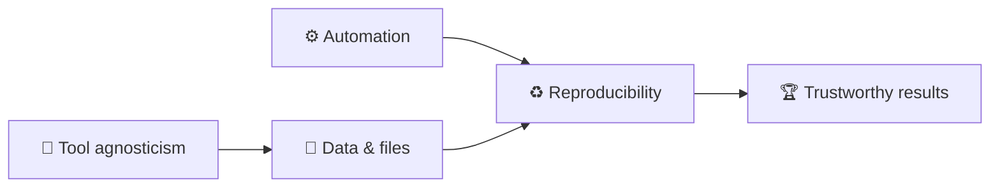

# Dr. Mindaugas Šarpis

# Best Research and Data Analysis Practices from CERN

## Orientation & Motivation

##### <span class="aims-badge">🔧 tool-agnostic · ♻️ reproducible · ⚙️ automation · 📁 data & files — the four aims</span>

<!--
Speaker: let the cold open on the next slide run first, then welcome them, introduce
yourself, and set the tone — this is a practical course, not a lecture course.
Everything is graded on one project of the student's own choosing; the seminars are
where the skills get practised. No seminar today: the first seminar is in the next
session and starts from zero — the slide before the films says what to bring. (~2 min)
-->

---
hideInToc: true
---

<VideoPlayer src="ff_zoom_master.mp4" :autoplay="false" hq />

<!-- Cold open (4:42): Google Earth pull-back — the Physics Faculty roof at Saulėtekis, Vilnius, Lithuania, Earth from orbit, the Sun, a star-streak run through the Milky Way, deep space, and it ends on the cosmic web. Release asset ff_zoom_master.mp4 (1080p60 H.264, plays on every browser; encoded from the maintainer's 2026-09-06 master). Does NOT auto-start — press play when the room is settled, then let it run before a word of admin. The ATLAS overview clip plays only in the CERN block after the course slides. -->

---
hideInToc: true
layout: fact
---

# Who am I talking to?


<!--
Speaker: three quick shows of hands. Fields calibrate the later examples; the OS split
(Windows / macOS / Linux) tells you what the first seminar's installation will meet; "coded
before" lets you seat an experienced student next to a beginner from week 2.
-->

---
hideInToc: true
layout: quote
---

# The goal of this course is to build **intuition**, **competence**, and **confidence** in working with data — using the tools and practices of modern science

---
hideInToc: true
---

# Nine Rows from a **Lab Partner**

<div class="grid-2 mt-md gap-md">

<div class="card card-primary card-glass pad-tight">

## 📄 **The file, as it arrived**

```text
nr;length_cm;t10_s
1;20;9,02
2;30;11,05
3;40;12,61
4;50;14,23
5;60;15,49
6;70;16,84
7;80;17,90
8;90;19,10
9;100;20,01
;mean;15,14
```

</div>

<div class="card card-secondary card-glass pad-tight">

## ⏱️ **What it holds**

- A weight on a string, swinging. For nine lengths, from 20 cm to 100 cm, a stopwatch timed **10 swings**
- The longer the string, the slower the swing: 9.02 s at 20 cm, 20.01 s at 100 cm
- How fast a pendulum swings depends on how hard the Earth pulls, *g*. So every row gives a value of *g*
- The file is **130 bytes**: 11 lines, `;` between the fields, `,` as the decimal sign, a numbering column `nr`, and a last line that holds a mean

</div>

</div>

<div class="card card-info card-glass pad-compact mt-md" style="text-align: center;">

❓ From these nine rows: **what is *g*?**

</div>

<!--
Speaker: this is the course's running example: the same small table comes back
almost every week. Read two rows aloud with the room. Then ask the question and
let two or three people say how they would start. No formula is needed today:
the next slide shows two people who both answered it. (~3 min)
-->

---
hideInToc: true
---

# Two People, **Two Answers**

<div class="grid-2 mt-md gap-md">

<div class="card card-primary card-glass pad-tight">

## 🧮 **Ada: one *g* per row, then the average**

Each row on its own gives a value of *g*, in m/s²:

9.705 · 9.700 · 9.931 · 9.748 · 9.872 · 9.745 · 9.857 · 9.739 · 9.860

The average of the nine is 9.795, so Ada reports **9.80**.

</div>

<div class="card card-secondary card-glass pad-tight">

## 📈 **Ben: one line through all nine**

Ben squares each swing time and plots it against the length. The nine points lie close to a straight line. He takes the line that passes closest to all of them and reads *g* from its steepness.

Ben reports **9.84**.

</div>

</div>

<div class="card card-warning card-glass pad-compact mt-md">

Same file, same nine rows, no mistake by either. **I send you only 9.84. How do you check it?**

</div>

<div class="note-text mt-sm">“The first principle is that you must not fool yourself, and you are the easiest person to fool.” Richard Feynman, Caltech, 1974</div>

<!--
Speaker: let the room answer for two or three minutes and write the answers
on the board. They usually come in this order: "send me the file", "which
rows did you use?", "how did you get the number?", "I can't open your file".
Sort them into four piles: the file as it was received; every step done to
it; the program that computed 9.84, with what it ran on; a form anyone can
open. The next slide names the four piles. Neither Ada nor Ben is wrong: the
two numbers differ by method, and only a written-down method says which one
you are holding. (~4 min)

The numbers, for questions: g = 4π²L/T², with T the time of one swing
(t10_s / 10). Ada's values are that formula row by row; their mean is
9.7952. Ben fits T² = a·L + b without weights: a = 4.0136 s²/m, so
g = 4π²/a = 9.836. All computed from pendulum.csv.
-->

---
hideInToc: true
---

# One File, **Seven Numbers**

<div class="grid-2 mt-md gap-md" style="grid-template-columns: 3fr 2fr;">

<div class="card card-primary card-glass pad-tight table-compact">

| **What was done to the nine rows** | ***g*, m/s²** |
| --- | --- |
| Ben's line through all nine | 9.84 |
| Ben's line, the 100 cm row left out | 9.79 |
| Ben's line, the 90 cm row left out | 9.88 |
| Ada's average of nine values | 9.80 |
| A line forced through zero | 9.81 |
| Lengths left in cm, not m | 983.61 |
| 10 swings read as one swing | 0.098 |

</div>

<div class="card card-secondary card-glass pad-tight">

## 🔍 **What 9.84 hides**

Every line is one honest-looking choice about the same file. Leaving out any one row moves Ben's answer anywhere from 9.79 to 9.88.

The last two are slips, easy to spot. The first five are not: each could be the number in your inbox.

</div>

</div>

<div class="card card-info card-glass pad-compact mt-md">

The number alone cannot tell you which of these it is. To check 9.84, you need what is behind it.

</div>

<!--
Speaker: every value was computed from pendulum.csv. Leaving out each row in
turn gives 9.83, 9.82, 9.86, 9.83, 9.84, 9.84, 9.82, 9.88 (90 cm out) and
9.79 (100 cm out). Lengths in cm make the slope 100 times smaller, so g
comes out 100 times larger; reading the time of 10 swings as one swing makes
each squared time 100 times larger, so g comes out 100 times smaller. Then
back to the question on the board. (~3 min)
-->

---
hideInToc: true
---

# The Four <span class="gradient-text">Aims</span>

<div class="card card-info card-glass pad-compact mt-sm">

Every answer to “how do you check 9.84?” lands in one of four piles. Each pile is one aim of this course, and your project is graded on them.

</div>

<div class="grid-2 mt-md gap-md">

<div class="card card-primary card-glass pad-tight reveal-scale">

## 🔧 **Tool agnosticism**

A file anyone can open: plain text, read by any editor and any language, not only by the program I happen to own.

</div>

<div class="card card-secondary card-glass pad-tight reveal-scale">

## ♻️ **Reproducibility**

The file exactly as received, the code that gave 9.84 and the versions it ran on. With those you get 9.84 too.

</div>

<div class="card card-accent card-glass pad-tight reveal-scale">

## ⚙️ **Automation**

Every step written as a program, not done by hand: the edits to the file and the line through the points. A program repeats them exactly.

</div>

<div class="card card-success card-glass pad-tight reveal-scale">

## 📁 **Efficient work with data & files**

Knowing which file is which: the one as received, never edited, kept apart from the cleaned copy that a program wrote.

</div>

</div>

<div class="note-text mt-md">Watch for the 🔧 ♻️ ⚙️ 📁 icons throughout: every lecture advances at least one.</div>

<!--
Speaker: point from each pile on the board to its card. The before/after
pairs that follow keep the same order, one per aim, each counted on the
pendulum file. (~2 min)
-->

---
hideInToc: true
---

# 🔧 Before / After — **Tool Agnosticism**

<div class="grid-2 mt-md gap-md">

<div class="card card-warning card-glass pad-tight">

## ❌ **pendulum.xlsx**

- The same nine rows saved as a spreadsheet (here by Python's `openpyxl`): about **5 000 bytes**
- An `.xlsx` is a zip archive, here of 9 files. A text editor shows `PK` and then noise
- Reading a number needs a program that knows the format

</div>

<div class="card card-success card-glass pad-tight">

## ✅ **pendulum.csv**

- The cleaned table as plain text: **97 bytes**, 10 lines, small enough to read on a slide
- Opens in Notepad, TextEdit, VS Code, a spreadsheet, Python or R
- Every number is readable by eye: `100,20.01`

</div>

</div>

<div class="note-text mt-md">We still <em>use</em> specific tools (Python, VS Code, Git), but every skill is chosen to transfer beyond them.</div>

<!--
Speaker: the next four slides are one before/after pair per aim, all on the
nine-row table. Ask for a show of hands at each "before": almost everyone
recognises themselves. The xlsx figures were measured by writing the
cleaned table with openpyxl 3.1.5: 4 993 to 5 007 bytes, depending on the
install and the sheet name, always a zip of 9 files. Excel writes a file of
the same kind, a zip of XML files, with a different byte count. (~2 min)
-->

---
hideInToc: true
---

# ♻️ Before / After — **Reproducibility**

<div class="grid-2 mt-md gap-md">

<div class="card card-warning card-glass pad-tight">

## ❌ **A screenshot of 9.84**

- The same 97 bytes gave seven different values of *g*
- The screenshot cannot say which choice it shows
- Nor which rows went into it
- Six months later even the author cannot say

</div>

<div class="card card-success card-glass pad-tight">

## ✅ **The folder that made it**

- The file as received, the code, the versions it ran on
- Run it, on any laptop: 9.84 again
- Change the method in one place: 9.81, and the difference is explained
- “What changed?” has an exact answer

</div>

</div>

<div class="note-text mt-md">If someone else, or future you, cannot rebuild your result, it is not yet a result.</div>

<!--
Speaker: the line forced through zero has no intercept: slope 4.024 s²/m,
g = 9.810. In the folder that choice is one setting, so switching it shows
where 9.81 and 9.84 part. (~2 min)
-->

---
hideInToc: true
---

# ⚙️ Before / After — **Automation**

<div class="grid-2 mt-md gap-md">

<div class="card card-warning card-glass pad-tight">

## ❌ **Four edits by hand**

- Delete the mean line; replace **9** decimal commas by points and **20** semicolons by commas; delete the `nr` column
- The order matters. Replace `;` first, and the first row becomes `1.20.9.02`: three numbers, no telling them apart
- The partner's next file needs all four again

</div>

<div class="card card-success card-glass pad-tight">

## ✅ **One script**

- The four edits written down once, in the right order
- Run on the next file of this shape: done
- The output is the same **97 bytes** on Windows, macOS and Linux
- The script is the method, written down: anyone can read what was done

</div>

</div>

<div class="note-text mt-md">Do it once by hand, twice by script. Let the machine repeat the boring parts.</div>

<!--
Speaker: count the edits with the room on the file from two slides back:
11 lines, 22 semicolons and 10 commas. The mean line goes first, which
leaves 20 semicolons and 9 commas. (~2 min)
-->

---
hideInToc: true
---

# The Same Edits in the **Wrong Order**

<div class="grid-2 mt-md gap-md">

<div class="card card-success card-glass pad-tight">

## ✅ **Decimal commas first**

Replace `,` by `.`, then `;` by `,`:

```text
nr,length_cm,t10_s
1,20,9.02
2,30,11.05
3,40,12.61
```

Every decimal comma is a point before the semicolons become commas. With the mean line gone and `nr` dropped: 97 bytes.

</div>

<div class="card card-warning card-glass pad-tight">

## ❌ **Semicolons first**

Replace `;` by `,`, then `,` by `.`:

```text
nr.length_cm.t10_s
1.20.9.02
2.30.11.05
3.40.12.61
```

After the first step, separators and decimal signs are the same character. The second step turns all of them into points.

</div>

</div>

<div class="card card-info card-glass pad-compact mt-md">

Two replacements, two orders, and only one of them is right. A person redoing it by hand for every new file has to remember the order every time. A script remembers it.

</div>

<!--
Speaker: ask the room first which replacement to do first, then show both
columns. Both are from the real file: the right order is the one written in
the seminar README ("Mean line deleted, , replaced by ., ; replaced by ,,
column nr deleted"). In the wrong order the mean line, if it were still
there, would turn into ".mean.15.14". (~2 min)
-->

---
hideInToc: true
---

# 📁 Before / After — **Data & Files**

<div class="grid-2 mt-md gap-md">

<div class="card card-warning card-glass pad-tight">

## ❌ **The Desktop**

- `pendulum.csv`, `pendulum(1).csv`, `pendulum_final_v2.csv`
- Which still has the mean line? Which has the commas? Only opening each one tells
- The file as received was edited in place: the original is gone

</div>

<div class="card card-success card-glass pad-tight">

## ✅ **Two folders**

- `data/raw/pendulum.csv`: **130 bytes**, as received, never edited
- `data/processed/pendulum.csv`: **97 bytes**, written by the script
- The size alone tells them apart
- The processed copy can be deleted at any time: the script writes it again

</div>

</div>

<div class="note-text mt-md">The same two folders work for any project: build them once and repeat them on your own data.</div>

---
hideInToc: true
---

# The Aims **Reinforce** Each Other


```mermaid {scale: 0.8}
graph LR
    A[⚙️ Automation] --> R[♻️ Reproducibility]
    F[📁 Data & files] --> R
    T[🔧 Tool agnosticism] --> F
    R --> S[🏆 Trustworthy results]
```

<div class="grid-2 mt-md gap-md">

<div class="card card-primary card-glass pad-compact">

## 🔗 **Not four separate boxes**

On the pendulum: the script (⚙️) is what lets anyone rebuild 9.84 (♻️). Two folders (📁) keep the script simple: it reads `data/raw`, writes `data/processed`. Plain CSV (🔧) keeps every step readable anywhere.

</div>

<div class="card card-secondary card-glass pad-compact">

## 🧭 **Use them as a compass**

Unsure how to do something? Ask: *which choice serves more of the aims?* That one question resolves most practical dilemmas in this course — and in research.

</div>

</div>

---
layout: section
hideInToc: true
---

# How This Course **Works**

The four aims answer the 9.84 question. Thirteen Tuesdays are built to practise them: a lecture for the idea, a seminar for the hands.

---
hideInToc: true
---

# Course **Structure**

<div class="grid-2 mt-md gap-md">

<div class="card card-primary card-glass pad-tight">

## 📖 **The lecture, 2 h**

- Why a practice matters and how to think about it, on real examples, including from CERN
- Interactive: questions, votes, short reflections
- Exposure and intuition, not memorising commands. Some parts stay a “black box”; others are worked out in detail

</div>

<div class="card card-secondary card-glass pad-tight">

## 🔬 **The seminar, 2 h, same day**

- You do it yourself, on real data, in your own project folder
- You type, break things and fix them; the instructor circulates
- The goal is a **working result**, saved before you leave

</div>

</div>

<div class="card card-info card-glass pad-tight mt-md">

<div class="stat-grid">
  <div class="stat">
    <span class="stat-num gradient-text">64</span><span class="stat-unit">h</span>
    <div class="stat-label">Contact hours</div>
  </div>
  <div class="stat">
    <span class="stat-num gradient-text energy">196</span><span class="stat-unit">h</span>
    <div class="stat-label">Self study</div>
  </div>
  <div class="stat">
    <span class="stat-num gradient-text">1</span>
    <div class="stat-label">Semester project</div>
  </div>
</div>

</div>

<!--
Speaker: the lecture and the seminar are one unit. Miss the seminar and the
lecture stays abstract; skip the lecture and the seminar feels like magic.
(~2 min)
-->

---
hideInToc: true
---

# **Schedule**

Every **Tuesday**: **2 h lecture** + **2 h seminar**, **8 Sep – 22 Dec 2026**. Week 1 is lecture only; seminars start with the second session. No session on 15 Sep, 22 Sep and 24 Nov.

<div class="grid-2 gap-sm mt-sm">

| | **Tue** | **Lecture** |
| --- | --- | --- |
| 1 | 8 Sep | **A** · Orientation & Motivation |
| 2 | 29 Sep | **A** · Introduction to Data |
| 3 | 6 Oct | **A** · How Computers Work |
| 4 | 13 Oct | **A** · Command Line & File Handling |
| 5 | 20 Oct | **A** · Version Control with Git |
| 6 | 27 Oct | **B** · Python Foundations |
| 7 | 3 Nov | **B** · Python for Data & NumPy |

| | **Tue** | **Lecture** |
| --- | --- | --- |
| 8 | 10 Nov | **C** · Data Visualisation |
| 9 | 17 Nov | **C** · Probability & Statistics |
| 10 | 1 Dec | **C** · Data Fitting from First Principles |
| 11 | 8 Dec | **C** · The Perceptron |
| 12 | 15 Dec | **D** · Pandas & Data Cleaning |
| 13 | 22 Dec | **D** · Reproducible Workflows & Automation |

</div>

<div class="note-text mt-sm">Blocks: <strong>A</strong> Foundations & Tooling · <strong>B</strong> Programming · <strong>C</strong> Data Analysis Core · <strong>D</strong> Practical Data Work. Block <strong>E</strong>, Further Topics (concepts of data analysis, computing infrastructure, machine learning), is extra material. <strong>Final project presentations</strong> are in the exam session.</div>

<style scoped>
table {
  font-size: 0.95em;
  width: 100%;
}
table td, table th {
  padding: 0.3em 0.5em;
}
table td:nth-child(1),
table th:nth-child(1) {
  text-align: right;
  white-space: nowrap;
}
table td:nth-child(2),
table th:nth-child(2),
table td:nth-child(3),
table th:nth-child(3) {
  white-space: nowrap;
}
</style>

---
hideInToc: true
---

# Learning **Outcomes**

<div class="grid-2 mt-md gap-md">

<div class="card card-primary card-glass pad-compact reveal-up">

🧠 Understand main concepts of **computing**

</div>

<div class="card card-info card-glass pad-compact reveal-up">

📐 Gain knowledge on **mathematics and statistics** for data analysis

</div>

<div class="card card-secondary card-glass pad-compact reveal-up">

🎯 Know which **tools** to choose for a specific task

</div>

<div class="card card-success card-glass pad-compact reveal-up">

🤖 Understand the basics of **machine learning and AI**

</div>

<div class="card card-accent card-glass pad-compact reveal-up">

⚡ Be able to implement simple **data analysis workflows** on the fly

</div>

<div class="card card-primary card-glass pad-compact reveal-up">

🔀 Become **platform and tool agnostic** in your work

</div>

<div class="card card-warning card-glass pad-compact reveal-up">

🛡️ Be safe from **common pitfalls** in working with computers

</div>

<div class="card card-secondary card-glass pad-compact reveal-up">

🚀 Be able to **adapt** to new tools and technologies quicker

</div>

</div>

<div class="note-text mt-md">Eight outcomes, one thread: by the end you can take a dataset you have never seen, in a tool you have never used, and produce a result someone else can rebuild.</div>

---
hideInToc: true
---

# What **“Done”** Looks Like Each Week

<div class="card card-success card-glass pad-tight mt-md">

## ✅ **A small, finished thing — saved**

Every seminar ends the same way: something new works, and it is **saved in your project folder**. Not a perfect thing, not a whole project — one honest step, saved and dated.

</div>

<div class="grid-3 gap-md mt-md">

<div class="card card-primary card-glass pad-compact">

## 📦 **Saved**

The new work is in your project folder, not in a stray file on the desktop.

</div>

<div class="card card-secondary card-glass pad-compact">

## 🔁 **Runs again**

You can re-run it in a fresh terminal and get the same result.

</div>

<div class="card card-accent card-glass pad-compact">

## 📝 **Explainable**

You can say, in one sentence, what it does and why.

</div>

</div>

<div class="note-text mt-md">The same three tests as for 9.84: it exists in the folder, it comes out again, and someone can say how it was made.</div>

---
hideInToc: true
---

# Habits That **Work**

<div class="grid-2 mt-md gap-md">

<div class="card card-success card-glass pad-compact">

## 🌱 **Do this**

- **Show up to the seminar** — the doing is where it sticks
- **Type it yourself**, even when copy-paste would be faster
- Keep one project and grow it; don't restart every week
- Ask early — a five-minute question saves a lost evening

</div>

<div class="card card-warning card-glass pad-compact">

## 🚧 **Avoid this**

- Bingeing every lecture the night before the presentation
- Collecting tools you never actually use on your data
- Hiding a broken step instead of asking about it
- Treating “it ran once” as the same as “it's reproducible”

</div>

</div>

<div class="grid-3 gap-md mt-md">

<div class="card card-primary card-glass pad-compact">

## ⌨️ **You will type a lot**

Commands feel slow at first. Two weeks in, they are faster than clicking.

</div>

<div class="card card-info card-glass pad-compact">

## 💥 **You will break things**

Errors are the normal state of programming. Read them — they usually name the fix.

</div>

<div class="card card-secondary card-glass pad-compact">

## 🙋 **Stuck for 15 minutes? Ask**

The instructor, your neighbour, the error message in a search engine, the docs — and AI assistants, as long as you understand what they hand you.

</div>

</div>

<!--
Speaker: this is not a deep programming course and not a race to the
fanciest model; it is a course in practices that survive any language.
Already code well? The challenge shifts from syntax to doing it
reproducibly. (~2 min)
-->

---
layout: section
hideInToc: true
---

# Seminars & **Your Project**

A seminar ends with one step saved in the folder. A project is those steps, grown around a question of your own, and graded on the four aims.

---
hideInToc: true
---

# The Grade: **One Project**

<div class="card card-success card-glass pad-tight mt-md glow">

## 🎯 **One course-long project — 100%**

The whole grade is a project you carry through the course. It is graded relative to where you start: beginners and experienced coders are both welcome.

</div>

<div class="grid-2 mt-md gap-md">

<div class="card card-primary card-glass pad-tight reveal-left">

## 🧭 **Any field, any form**

Topic, data and form are your call: a data analysis, an app or dashboard, or an educational piece that explains a method, from physics, biology, economics or a hobby. It includes real **data analysis and/or automation**, built with Python.

</div>

<div class="card card-secondary card-glass pad-tight reveal-left">

## ✅ **Graded on the four aims**

- 🔧 **Tool-agnostic**, reasoned choices
- ♻️ **Reproducible** — someone else can rebuild your results
- ⚙️ **Automated** where it counts
- 📁 **Well-organised** data & files, clearly documented

</div>

</div>

<div class="note-text mt-md">Graded on the four aims, not on the topic. The seminars work on two shared files, the pendulum table and a file from LHCb; your project is where the same moves meet your own data.</div>

---
hideInToc: true
---

# What You **Hand In**

<div class="grid-2 mt-md gap-md">

<div class="card card-primary card-glass pad-tight">

## 📋 **Requirements**

- Should be a well-developed project
- Can be functional (app, dashboard, website)
- Can be more educational (applying a specific method — e.g. a neural network — and explaining the concepts)
- Can use AI tools and components but must understand your code and be able to explain it

</div>

<div class="card card-secondary card-glass pad-tight">

## 📦 **Deliverables**

- Codebase available on course repository (info in eMokymai)
- Project written up in a **one-page report** (added to the repository)
- 10–30 second video showcasing the project (linked to the repository)
- Final **presentation** at the end of the course (graded on the spot)

</div>

</div>

<div class="note-text mt-md">Talk a first idea through at an early seminar: the sooner a project exists, the more of the course it can absorb.</div>

---
hideInToc: true
---

# Why **Real, Open** Data

<div class="grid-2 mt-md gap-md">

<div class="card card-primary card-glass pad-tight">

## 🌍 **Open by principle**

CERN publishes its data so anyone can check the science. In the seminars you download the *same* events physicists used — no toy stand-in, no paywall.

</div>

<div class="card card-secondary card-glass pad-tight">

## 🔬 **Real means messy**

Real data carries noise, background, and quirks a clean textbook set never shows. The nine-row table already has three: a mean line, decimal commas, a numbering column.

</div>

</div>

<div class="card card-info card-glass pad-compact mt-md">

## ♻️ **It models the whole point**

Open data, recorded provenance, a rebuildable analysis — the seminar exercises are the four aims in miniature, on data the whole world can inspect.

</div>

---
hideInToc: true
---

# One Table Through the **Course**

| **Block** | **Lectures** | **What happens to the pendulum table** |
| --- | --- | --- |
| A | 02–05 | Repaired by hand; read as bytes; cleaned by a script; kept under Git |
| B | 06–07 | Read line by line in Python, then as arrays |
| C | 08–10 | Plotted; *g* given an uncertainty; the line fitted: 9.84 |
| D | 12–13 | Cleaned with Pandas; the whole analysis rebuilt by one command |

<div class="card card-info card-glass pad-compact mt-md">

## ⚛️ **The second shared file**

`D0_KPi.csv`, a file recorded by the LHCb experiment at CERN. Lecture 2 opens it and asks what it holds.

</div>

<div class="note-text mt-md">Your project repeats each of these steps on data of your own.</div>

<!--
Speaker: this is the map of the course in terms of one file instead of a
list of topics. The 9.84 from the opening is the number the fit in block C
gives. (~2 min)
-->

---
hideInToc: true
---

# The Finished **Product**

<div class="grid-2 mt-md gap-md" style="grid-template-columns: 2fr 3fr;">

<div class="card card-primary card-glass pad-tight">

## 📦 **What you hand in**

One versioned repository. The report, video and presentation all describe this one thing.

This is the pendulum analysis at the end of the course. Your project has the same shape around your own question.

</div>

<div class="card card-secondary card-glass pad-tight">

```text
analysis-project/
├── data/raw/          as received, never edited
├── data/processed/    written by clean.py
├── scripts/           clean.py  plot.py  fit.py  report.py
├── results/           the plot, fit.json, report.md
├── tests/             checks of the scripts
├── config.json        the parameters
├── requirements.txt   the packages and versions
├── run_all.py         the one command
├── .gitignore         what Git leaves out
└── README.md          what it is, how to rebuild
```

</div>

</div>

<div class="note-text mt-md">Clean, automated, documented: the four aims made concrete, in a form you can show a supervisor or an employer.</div>

---
hideInToc: true
---

# Delete and **Rebuild**

<div class="card card-success card-glass pad-tight mt-md glow">

## 🏆 **Delete `data/processed/` and `results/`, then rebuild both with one command.**

If that works for your project, it is reproducible. Every practice in this course exists to make that one sentence true of your work.

</div>

<div class="grid-2 mt-md gap-md">

<div class="card card-warning card-glass pad-compact">

## 🗑️ **Safe to delete — it regenerates**

`data/processed/` and `results/`: the cleaned table, the plot, `fit.json`, the report. Outputs of the scripts, never edited by hand.

</div>

<div class="card card-primary card-glass pad-compact">

## 🔒 **The recipe — keep it**

`data/raw/` (it cannot be regenerated), `scripts/`, `tests/`, `config.json`, `requirements.txt`, `run_all.py` and `README.md`.

</div>

</div>

<div class="note-text mt-md">On the pendulum: delete the cleaned table, run the one command, and the same 97 bytes come back, and with them the same 9.84.</div>

---
hideInToc: true
---

# Why <span class="gradient-text">You</span> Need These Skills

CERN turns raw collisions into discoveries with exactly the toolkit this course builds:

<div class="grid-2 mt-md gap-md">

<div class="card card-primary card-glass pad-tight reveal-up">

## 📁 **Handling Massive Data**

Petabytes of detector output demand disciplined file handling, data formats, and organisation.

</div>

<div class="card card-secondary card-glass pad-tight reveal-up">

## 🔀 **Working Together**

Thousands of scientists share one codebase — impossible without version control.

</div>

<div class="card card-accent card-glass pad-tight reveal-up">

## 🐍 **Turning Signal into Insight**

Python and data-analysis tools transform readings into physics.

</div>

<div class="card card-warning card-glass pad-tight reveal-up">

## 🎲 **Real or a Fluke?**

Statistics decide whether a bump in the data is a discovery — or noise.

</div>

</div>

<div class="card card-info card-glass pad-compact mt-md" style="text-align: center;">

You don't need a particle accelerator to use any of this: nine rows from a lab partner need the same four aims as a petabyte.

</div>

---
hideInToc: true
---

# Numbers and a **Rule**

<div class="grid-2 mt-md gap-md">

<div class="card card-primary card-glass pad-tight">

## 📡 **What arrived**

Mariner 4 flew past Mars on 14–15 July 1965 and took 21 pictures, and part of a 22nd. Each picture came back to Earth as numbers: 200 × 200 = **40 000** brightness values, one per point.

The computer that turned the numbers into a picture was still at work.

</div>

<div class="card card-secondary card-glass pad-tight">

## 🖍️ **What the engineers did**

At JPL, Richard Grumm's team printed the numbers on paper strips, stapled the strips side by side on a wall, and coloured every number with pastels from an art shop, by a key that matched each number to a shade.

The first picture of Mars from a spacecraft was coloured by hand.

</div>

</div>

<div class="card card-info card-glass pad-compact mt-md">

Numbers plus a written rule give a picture. Anyone with the 40 000 numbers and the key gets the same picture, by hand or by computer. Nine rows plus a written method give 9.84 in the same way.

</div>

<!--
Speaker: the framed pastel picture was given to JPL's director, William
Pickering. The Mariner 4 clip in the reel pans across the pictures as the
computer later made them. Sources: NSSDC Mariner 4 page (21 pictures plus 21 lines of a 22nd,
14–15 July 1965); Scientific American, "First View of Mars Was a
Paint-by-Numbers" (Grumm, strips stapled to a wall, pastels); Caltech
magazine, "A Planet Painted by Hand" (colour key, the gift to Pickering).
Transmission times quoted for one picture disagree between sources (6, 8
or 10 hours), so the slide gives none. (~2 min)
-->

---
hideInToc: true
---

# What a Result **Needs**

<div class="card card-info card-glass pad-compact mt-sm">

The opening question: **I send you only 9.84. How do you check it?** One line per aim.

</div>

| | **I send you** | **You do** |
| --- | --- | --- |
| 🔧 | Plain text throughout: CSV, Python, a README | Read every step without my programs |
| ♻️ | The script, and the versions it ran on | Run it on your laptop: 9.84 |
| ⚙️ | The four edits and the fit, as code | See exactly what was done to which rows |
| 📁 | `data/raw/pendulum.csv`, 130 bytes, as received | Check it is the file I started from |

<div class="card card-success card-glass pad-tight mt-md">

## ✅ **9.84, checked**

With these four, 9.84 is a result: you get it again, and you can see why Ada got 9.80, an average of nine values instead of one line. Without them, it is a number in an e-mail.

</div>

<!--
Speaker: this answers the question of the "Two People, Two Answers" slide.
Read the four lines against the piles on the board. Do not cut this slide.
(~3 min)
-->

---
hideInToc: true
---

# Before the **Next Session**

<div class="grid-2 mt-md gap-md">

<div class="card card-primary card-glass pad-tight">

## 💻 **Bring a laptop**

- Windows, macOS or Linux, charged, with its charger
- You must be able to install programs on it. On a university or work laptop, check that now
- Nothing has to be installed beforehand

</div>

<div class="card card-secondary card-glass pad-tight">

## 🗂️ **Your own data, in class**

- In the seminar, the first file you write is a README for your project
- One line of it says what data you would like to look at: weather, sport, prices, health, astronomy, your lab
- One sentence is enough, written there and then

</div>

</div>

<div class="card card-info card-glass pad-compact mt-sm">

## 🔬 **The first seminar starts from zero**

It installs the editor, builds a project folder and writes its first file together, step by step. No programming experience is assumed.

</div>

---
layout: section
hideInToc: true
---

# Why do we need CERN

## and what can we learn from it

Mariner 4 sent numbers, and a key turned them into a picture. Every instrument in these films, camera, rover, telescope and detector, writes numbers too.

<!--
Speaker: dim the lights. Let the films run — don't narrate over them. The one cue
to plant beforehand: spot the instrument in every scene — camera, rover, telescope,
chamber — and ask what its output looks like once it is stored. Pick it up between
clips if the room is awake: which of these would *you* analyse first? (~1 min setup)
-->

---
hideInToc: true
---

<VideoPlayer src="Drone_Climbing_Mountain.mp4" />

<!-- Reel · Act I · drone ascent — Earth at human scale (0:27, silent). Back in slot 1 on 2026-09-08. -->

---
hideInToc: true
---

<VideoPlayer src="saturn_v_launch_nasa.mp4" />

<!-- Reel · Act I · NASA Saturn V launch, with sound (2:55). Added 2026-09-08; release asset is a capped H.264 encode of the Drive master. -->

---
hideInToc: true
---

<VideoPlayer src="blue_ghost_lunar_orbit.mp4" />

<!-- Reel · Act I · the Moon — Blue Ghost lander in lunar orbit, with sound (1:36). Added 2026-09-08; release asset blue_ghost_lunar_orbit.mp4 (remux of the Drive master). -->

---
hideInToc: true
---

<VideoPlayer src="NASA_Mars_Mariner_4_Pan_Audio.mp4" />

<!-- Reel · Act I · Mariner 4, 1965 — the first data from another planet (0:20) -->

---
hideInToc: true
---

<VideoPlayer src="Perseverence_Rover_Landing_NASA.mp4" />

<!-- Reel · Act I · Perseverance landing on Mars (3:10) -->

---
hideInToc: true
---

<VideoPlayer src="Cassini_Grand_Finale_NO_VO.mp4" />

<!-- Reel · Act I · Cassini at Saturn (3:41) -->

---
hideInToc: true
---

<VideoPlayer src="Stars_Pan_Audio.mp4" />

<!-- Reel · Act I · star field pan (0:20) -->


---
hideInToc: true
---

<VideoPlayer src="Hubble.mp4" />

<!-- Reel · Act I · Hubble imagery (0:33) -->


---
hideInToc: true
---

<VideoPlayer src="Telescope.mp4" />

<!-- Reel · Act I · observatory (0:40) -->

---
hideInToc: true
---

<VideoPlayer src="Webb_Reel.mp4" />

<!-- Reel · Act I · JWST reel (2:58) -->

---
hideInToc: true
---

<VideoPlayer src="Expansion_Funnel_H264_1080p.webm" />

<!-- Reel · Act I · cosmic expansion funnel (0:30) -->

---
hideInToc: true
---

<VideoPlayer src="QGP_Formation.mp4" />

<!-- Reel · Act II · quark-gluon plasma forms (0:33) -->

---
hideInToc: true
---

<VideoPlayer src="atoms.mp4" />

<!-- Reel · Act II · journey into the world of atoms — hair → cells → atom → nucleus → quarks, with sound (2:06). The same film as the old silent Voyage_in_to_the_world_of_atoms.mp4; release asset atoms.mp4 (H.264 web encode of the Drive master atoms.mov). -->

---
hideInToc: true
---

<VideoPlayer src="Cloud_Chamber_Audio.mp4" />

<!-- Reel · Act II · cloud chamber — particles made visible (2:29) -->

---
hideInToc: true
---

<VideoPlayer src="CERN_Overview_Short.mp4" />

<!-- Reel · Act III · CERN aerial (0:11) -->

---
hideInToc: true
---

<VideoPlayer src="cern_footage_2022_013_001_1080p_lhc.mp4" />

<!-- CERN block · CERN footage 2022-013-001 — the LHC, with sound (4:14). Added 2026-09-08; release asset is a remux of the Drive master. -->

---
hideInToc: true
---

<VideoPlayer src="cern_video_2019_050_008_1080ph265.mp4" />

<!-- CERN block · CERN video 2019-050-008 (1:35, silent). Added 2026-09-08. -->

---
hideInToc: true
---

<VideoPlayer src="LHCb.mp4" />

<!-- Reel · Act III · LHCb — home of the seminar dataset (0:47) -->

---
hideInToc: true
---

<VideoPlayer src="CERN-FOOTAGE-2024-006-001.mp4" />

<!-- Reel · Act III · FCC map — the future (0:18) -->

---
hideInToc: true
---

<VideoPlayer src="lhcb_thanks.mp4" />

<!-- Closing (2:28): LHCb detector fly-through — VELO, RICH, magnet, trackers, calorimeters, muon stations — ending on "Thanks for Your Attention". The detector behind the seminar dataset; let it run while the room packs up. Release asset lhcb_thanks.mp4 (H.264 web-h264 encode of the maintainer's Drive master, plays on every browser). -->
---
layout: section
hideInToc: true
---

# Extra Material — What is **CERN**?

The films ended inside LHCb. Behind them: the organisation, the machine, the chain of accelerators that feeds it, and how a detector sees a collision.


<!--
Not delivered live: the lecture ends on the LHCb fly-through. These four slides
stay in the deck for students who were not in the room (or want the background
behind the CERN clips): the org, the machine, the chain that feeds it, and how a
detector actually sees a collision.
-->

---
hideInToc: true
---

# CERN at a Glance

<div class="grid-2 mt-md gap-md">

<div class="card card-primary card-glass pad-tight">

## 🏛️ **The Organisation**

- **European Organization for Nuclear Research**
- Founded in **1954** by 12 European states
- Today: **24 member states**, thousands of visiting scientists
- Located at the **French-Swiss border** near Geneva

</div>

<div class="card card-secondary card-glass pad-tight">

## 🎯 **The Mission**

- Probe the **fundamental structure** of matter
- Build and operate the world's most powerful **particle accelerators**
- Push the boundaries of **technology and engineering**
- Train the **next generation** of scientists

</div>

</div>

<div class="card card-accent card-glass pad-tight mt-md">

## 🌍 **By the Numbers**

🔬 World's **largest** particle physics laboratory · 👥 **17,000+** scientists from **110+ nations** · 🏗️ Operating since **1954** · 🧪 Home to the **Large Hadron Collider**

</div>

---
hideInToc: true
---

# The Large Hadron Collider (LHC)

<div class="card card-info card-glass pad-tight">

## ⚙️ **The Machine**

- A **27 km** circumference ring situated **100 m** underground
- Accelerates protons to **99.9999991%** the speed of light
- Collides particles **~1 billion times per second**
- Operating temperature: **1.9 K** (~ -271.3°C — colder than outer space)

</div>

<div class="grid-2 mt-md gap-md">

<div class="card card-primary card-glass pad-compact">

## 🔭 **Main Experiments**

- **ATLAS** — general-purpose detector
- **CMS** — general-purpose detector
- **ALICE** — heavy-ion collisions
- **LHCb** — matter-antimatter asymmetry

</div>

<div class="card card-warning card-glass pad-compact">

## 🏆 **Key Achievement**

Discovery of the **Higgs boson** in **2012** — confirmed the mechanism that gives particles their mass

Nobel Prize in Physics 2013

*Precisely: this gives mass to fundamental particles (**fermions**, **W/Z** bosons) — most of the mass around you (e.g. the proton's) is **QCD binding energy**, not the Higgs.*

</div>

</div>

---
hideInToc: true
---

# The Accelerator <span class="gradient-text">Chain</span>

<div class="card card-info card-glass pad-compact mt-sm">

🔗 No single machine takes protons from a hydrogen bottle to near light speed — the LHC is only the **last link in a chain**, each accelerator handing faster particles to the next.

</div>

<div class="stack-tight mt-md">

<div class="card card-primary card-glass pad-compact reveal-left">

**1. LINAC4** — a linear accelerator kicks things off: **160 MeV**

</div>

<div class="card card-secondary card-glass pad-compact reveal-left">

**2. PS Booster → Proton Synchrotron** — first rings: **2 GeV → 26 GeV**

</div>

<div class="card card-accent card-glass pad-compact reveal-left">

**3. Super Proton Synchrotron (SPS)** — 7 km ring: **450 GeV**

</div>

<div class="card card-success card-glass pad-compact reveal-left">

**4. LHC** — 27 km ring: **6.8 TeV per beam** *(Run 3)* — then the beams are made to cross inside the detectors

</div>

</div>

<div class="card card-warning card-glass pad-compact mt-md reveal-up">

💡 Each machine was once CERN's frontier — today's record-holder is tomorrow's injector.

</div>

---
hideInToc: true
---

# How a Detector <span class="gradient-text">Sees</span> a Collision

<div class="card card-info card-glass pad-compact mt-sm">

🧅 Detectors like ATLAS are built as **layers of an onion** around the collision point — each layer measures a different property of the particles flying out.

</div>

<div class="grid-2 mt-md gap-md">

<div class="card card-primary card-glass pad-compact reveal-scale">

## 🌀 **Tracker** *(innermost)*

Charged particles bend in a magnetic field — the curvature of each track gives its **momentum**

</div>

<div class="card card-secondary card-glass pad-compact reveal-scale">

## ⚡ **EM Calorimeter**

Stops **electrons and photons**, measuring the **energy** they deposit

</div>

<div class="card card-accent card-glass pad-compact reveal-scale">

## 🔨 **Hadronic Calorimeter**

Stops **hadrons** — particles made of quarks (protons, neutrons, pions) — again measuring **energy**

</div>

<div class="card card-success card-glass pad-compact reveal-scale">

## 🧲 **Muon System** *(outermost)*

**Muons** punch through everything else — dedicated outer chambers catch them

</div>

</div>

<div class="card card-warning card-glass pad-compact mt-md reveal-up">

💾 One collision → **millions of electronic signals** across these layers. Software reassembles them into particles — those are the "detector readings" every analysis starts from.

</div>


---
layout: section
hideInToc: true
---

# Check **Yourself**

Questions on this lecture, for after it. They are not part of the lecture time.

---
hideInToc: true
---

<MCQ
  question="You catch yourself repeating the same manual steps on your data every week. Writing a script to do it instead chiefly serves which of the Four Aims?"
  :options="[
    '🔧 Tool agnosticism',
    '♻️ Reproducibility',
    '⚙️ Automation',
    '📁 Efficient work with data & files'
  ]"
  :correct="2"
  explanation="Do it once by hand, twice by script — letting the machine repeat the boring parts is exactly what ⚙️ automation means. It often boosts ♻️ reproducibility too, but the direct target here is automation."
/>

---
hideInToc: true
---

<MCQ
  question="A colleague sends you a beautiful result: a PDF of the final plot. What is the minimum you would need for the result to count as reproducible?"
  :options="[
    'The same plot exported again at a much higher resolution',
    'The raw data, the code, and a note of the environment it ran in',
    'A screen recording of them running the whole analysis end to end',
    'Their written assurance that it ran fine on their own laptop'
  ]"
  :correct="1"
  explanation="♻️ Reproducibility means someone else can rebuild the result. That requires the inputs (data), the exact transformation (code), and the context it ran in (environment and versions). A prettier picture or a promise changes nothing."
/>

---
hideInToc: true
---

<MCQ
  question="It's week 5. You attend every lecture but skip the seminars because you ‘get the ideas already’. Why is this the riskiest habit in this course?"
  :options="[
    'Lectures carry the marks, so the seminars are the part you can afford to miss',
    'The seminars are where an idea becomes a working skill, and the project is graded on skills',
    'Seminar attendance is recorded, and every missed session costs you marks directly',
    'The lectures only summarise the seminars, so skipping either half is the same'
  ]"
  :correct="1"
  explanation="The seminars aren't graded, but the project is — on the four aims, which are practices you only acquire by doing. Understanding an idea in the lecture is not the same as having it run in a repository: the seminar is where 'done' happens, and your project is where you repeat it on your own data."
/>

---
hideInToc: true
---

<MCQ
  question="In a reproducible project, two folders can be deleted at any time and rebuilt with one command. Which two?"
  :options="[
    'data/raw/ and scripts/',
    'data/processed/ and results/',
    'data/raw/ and results/',
    'scripts/ and data/processed/'
  ]"
  :correct="1"
  explanation="data/processed/ and results/ hold only what the scripts write: the cleaned table, the plot, the fit, the report. data/raw/ cannot be regenerated, and scripts/ (with run_all.py, config.json, requirements.txt and the README) is the recipe. Delete the outputs, run the one command, and the same 97 bytes and the same 9.84 come back."
/>
