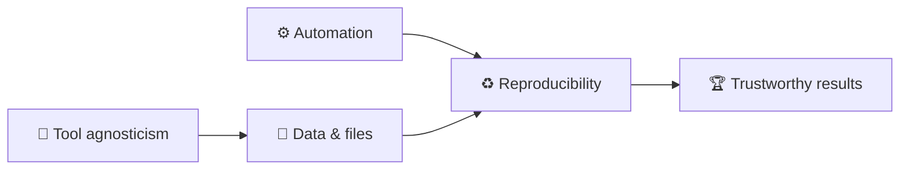
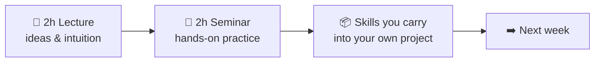

# Dr. Mindaugas Šarpis

# Best Research and Data Analysis Practices from CERN

## Orientation & Motivation

##### <span class="aims-badge">🔧 tool-agnostic · ♻️ reproducible · ⚙️ automation · 📁 data & files — the four aims</span>

<!--
Speaker: let the cold open on the next slide run first, then welcome them, introduce
yourself, and set the tone — this is a practical course, not a lecture course.
Everything is graded on one project of the student's own choosing; the seminars are
where the skills get practised. No seminar today: the first one is next session and
starts from zero — the last slide before the films says so. (~2 min)
-->

---
hideInToc: true
---

<VideoPlayer src="ff_zoom_master.mp4" :autoplay="false" hq />

<!-- Cold open (4:42): Google Earth pull-back — the Physics Faculty roof at Saulėtekis, Vilnius, Lithuania, Earth from orbit, the Sun, a star-streak run through the Milky Way, deep space, and it ends on the cosmic web. Release asset ff_zoom_master.mp4 (1080p60 H.264, plays on every browser; encoded from the maintainer's 2026-09-06 master). Does NOT auto-start — press play when the room is settled, then let it run before a word of admin. The ATLAS overview clip plays only in the CERN block after the course slides. -->

---
hideInToc: true
layout: fact
---

# Who am I talking to?


<!--
Speaker: three quick shows of hands. Fields calibrate the later examples; the OS split
(Windows / macOS / Linux) tells you what the first seminar's installation will hit; "coded
before" lets you seat an experienced student next to a beginner from week 2.
-->

---
hideInToc: true
layout: quote
---

# The goal of this course is to build **intuition**, **competence**, and **confidence** in working with data — using the tools and practices of modern science

---
hideInToc: true
---

# **Course Structure**

<div class="grid-2 mt-md gap-md">

<div class="card card-primary card-glass pad-tight">

## 📖 **Lectures**

- **Theory / Overviews** — main goal is exposure
- **Discussion** — building intuition, interactivity is important

Some of the elements require deeper understanding in statistics, programming,
mathematics. The idea is to strike a balance of what to keep as a "black box"
and what needs to be understood in detail.

</div>

<div class="card card-secondary card-glass pad-tight">

## 🔬 **Seminars**

- **Demos** — live demonstrations
- **Hands-on sessions** — you type, the instructor circulates
- **Case Studies** — real-world examples

It is very important to practice throughout the course. Using the tools and
concepts on your own projects is the best way to learn.
</div>

</div>

<div class="card card-info card-glass pad-tight mt-md">

<div class="stat-grid">
  <div class="stat">
    <span class="stat-num gradient-text">64</span><span class="stat-unit">h</span>
    <div class="stat-label">Contact hours</div>
  </div>
  <div class="stat">
    <span class="stat-num gradient-text energy">196</span><span class="stat-unit">h</span>
    <div class="stat-label">Self study</div>
  </div>
  <div class="stat">
    <span class="stat-num gradient-text">1</span>
    <div class="stat-label">Semester project</div>
  </div>
</div>

</div>

---
hideInToc: true
---

# **Course Content** — 16 lectures, 5 blocks

<div class="grid-3 mt-md gap-md">

<div class="card card-primary card-glass pad-compact reveal-scale">

**A · Foundations & Tooling** *(01–06)*
Orientation, data, command line & files, computers, Markdown & VS Code, Git

</div>

<div class="card card-secondary card-glass pad-compact reveal-scale">

**B · Programming** *(07–08)*
Python foundations, then Python for data & files

</div>

<div class="card card-info card-glass pad-compact reveal-scale">

**C · Data Analysis Core** *(09–12)*
Concepts, visualisation, probability & statistics, fitting

</div>

<div class="card card-success card-glass pad-compact reveal-scale">

**D · Practical Data Work** *(13–14)*
NumPy & Pandas, reproducible workflows & automation

</div>

<div class="card card-warning card-glass pad-compact reveal-scale">

**E · Advanced** *(optional, 15–16)*
Computing infrastructure & HPC, machine learning & AI

</div>

<div class="card card-accent card-glass pad-compact reveal-scale">

**🧪 Paired seminars**
Each lecture has a hands-on seminar — self-contained exercises on a shared open dataset; your own project is separate and graded

</div>

</div>

<div class="note-text mt-sm" style="text-align: center;">

Order and depth adapt to the group.

</div>

---
hideInToc: true
---

# **Schedule**

Every **Tuesday, 15:00–19:00**: lecture, break, seminar. **8 Sep – 22 Dec 2026**, no sessions on 15 Sep, 22 Sep and 24 Nov. Week 1 is lecture only.

<div class="grid-2 gap-sm mt-sm">

| **Wk** | **Tue** | **Lecture** |
| --- | --- | --- |
| 1 | 8 Sep | **A** · Orientation & Motivation *(lecture only)* |
| 2 | 29 Sep | **A** · Introduction to Data |
| 3 | 6 Oct | **A** · Command Line & File Handling |
| 4 | 13 Oct | **A** · How Computers Work |
| 5 | 20 Oct | **A** · Version Control with Git |
| 6 | 27 Oct | **B** · Python Foundations |
| 7 | 3 Nov | **B** · Python for Data Work |

| **Wk** | **Tue** | **Lecture** |
| --- | --- | --- |
| 8 | 10 Nov | **C** · Concepts of Data Analysis |
| 9 | 17 Nov | **C** · Data Visualisation |
| 10 | 1 Dec | **C** · Probability & Statistics |
| 11 | 8 Dec | **C** · Practical Data Fitting |
| 12 | 15 Dec | **D** · NumPy & Pandas |
| 13 | 22 Dec | **D** · Reproducible Workflows & Automation |
| | | *Markdown & VS Code: in the seminars* |

</div>

<style scoped>
table {
  font-size: 0.95em;
  width: 100%;
}
table td, table th {
  padding: 0.3em 0.5em;
}
table thead th {
  border-bottom: 3px solid rgba(255, 255, 255, 0.5);
}
table td:nth-child(1),
table th:nth-child(1) {
  text-align: right;
  white-space: nowrap;
}
table td:nth-child(2),
table th:nth-child(2),
table td:nth-child(3),
table th:nth-child(3) {
  white-space: nowrap;
}
</style>

---
hideInToc: true
---

# The Four <span class="gradient-text">Aims</span>

<div class="card card-info card-glass pad-compact mt-sm">

Everything in this course serves four durable practices. They outlast any tool or language — and your project is graded on them.

</div>

<div class="grid-2 mt-md gap-md">

<div class="card card-primary card-glass pad-tight reveal-scale">

## 🔧 **Tool agnosticism**

Learn the *idea* first, then a tool. Concepts transfer; frameworks come and go.

</div>

<div class="card card-secondary card-glass pad-tight reveal-scale">

## ♻️ **Reproducibility**

If someone else — or future you — can't rebuild your result, it isn't a result.

</div>

<div class="card card-accent card-glass pad-tight reveal-scale">

## ⚙️ **Automation**

Do it once by hand, twice by script. Let the machine repeat the boring parts.

</div>

<div class="card card-success card-glass pad-tight reveal-scale">

## 📁 **Efficient work with data & files**

Organise, name, and format your data so it stays trustworthy and usable.

</div>

</div>

<div class="note-text mt-md">Watch for the 🔧 ♻️ ⚙️ 📁 icons throughout — every lecture advances at least one.</div>

---
hideInToc: true
---

# 📁 Before / After — **Data & Files**

<div class="grid-2 mt-md gap-md">

<div class="card card-warning card-glass pad-tight">

## ❌ **The Downloads folder**

- `data.csv`, `data(1).csv`, `data_final_v2_REAL.csv`
- Raw data, figures, and drafts all in one directory
- Which file fed the plot in the report? Nobody knows
- Deleting anything feels dangerous — so nothing is ever deleted

</div>

<div class="card card-success card-glass pad-tight">

## ✅ **A structured project**

- `data/raw/` is read-only; `data/processed/` is regenerable
- One folder per purpose: `scripts/`, `results/`, `docs/`
- Names carry meaning: `2026-03_temperature_vilnius.csv`
- "Where does this number come from?" answered in seconds

</div>

</div>

<div class="note-text mt-md">Lecture 3 (command line &amp; files) and Seminar 2 build exactly this structure on the seminar dataset — repeat it on your own project the same afternoon.</div>

<!--
Speaker: the next four slides are one before/after pair per aim, all drawn from real
projects — including mine. Don't rush them — they are the emotional core of week 1.
Ask for a show of hands at each "before": almost everyone recognises themselves. (~2 min)
-->

---
hideInToc: true
---

# ♻️ Before / After — **Reproducibility**

<div class="grid-2 mt-md gap-md">

<div class="card card-warning card-glass pad-tight">

## ❌ **“It worked on my laptop”**

- The result exists — as a screenshot in an old email
- Rebuilding it needs a specific person, machine, and mood
- Six months later even the author can't remake the plot
- Reviewer asks "what changed since draft one?" — silence

</div>

<div class="card card-success card-glass pad-tight">

## ✅ **Anyone can rerun it**

- Data, code, and environment are recorded together
- One command rebuilds every figure and number
- A new team member reproduces the result on day one
- "What changed?" has an exact, versioned answer

</div>

</div>

<div class="note-text mt-md">This is the single strongest predictor of a good project grade — and of trust in your science.</div>

---
hideInToc: true
---

# ⚙️ Before / After — **Automation**

<div class="grid-2 mt-md gap-md">

<div class="card card-warning card-glass pad-tight">

## ❌ **40 manual steps in a spreadsheet**

- Open file → copy column → paste → sort → delete rows → …
- Every rerun costs an afternoon and invites a fresh typo
- New data arrives → the whole ritual starts again
- The process lives only in one person's muscle memory

</div>

<div class="card card-success card-glass pad-tight">

## ✅ **One script**

- The same 40 steps written down once, executed in seconds
- New data arrives → rerun → done
- The script *is* the documentation of the method
- Boring parts are delegated; your attention goes to thinking

</div>

</div>

<div class="note-text mt-md">Rule of thumb from the aims slide: once by hand, twice by script.</div>

---
hideInToc: true
---

<MCQ
  question="You catch yourself repeating the same manual steps on your data every week. Writing a script to do it instead chiefly serves which of the Four Aims?"
  :options="[
    '🔧 Tool agnosticism',
    '♻️ Reproducibility',
    '⚙️ Automation',
    '📁 Efficient work with data & files'
  ]"
  :correct="2"
  explanation="Do it once by hand, twice by script — letting the machine repeat the boring parts is exactly what ⚙️ automation means. It often boosts ♻️ reproducibility too, but the direct target here is automation."
/>

---
hideInToc: true
---

# 🔧 Before / After — **Tool Agnosticism**

<div class="grid-2 mt-md gap-md">

<div class="card card-warning card-glass pad-tight">

## ❌ **Locked in**

- Data lives inside one proprietary tool's project file
- Analysis steps exist only as clicks nobody recorded
- Licence expires, company folds, format changes → work stranded
- Collaborators must buy the same tool just to *look*

</div>

<div class="card card-success card-glass pad-tight">

## ✅ **Open by default**

- Data in open formats: CSV, JSON, plain text
- Logic captured in code — portable across tools and decades
- Concepts learned once transfer to whatever comes next
- Anyone can inspect, verify, and build on your work

</div>

</div>

<div class="note-text mt-md">We still <em>use</em> specific tools (Python, VS Code, Git) — but every skill is chosen to transfer beyond them.</div>

---
hideInToc: true
---

# The Aims **Reinforce** Each Other


```mermaid {scale: 0.8}
graph LR
    A[⚙️ Automation] --> R[♻️ Reproducibility]
    F[📁 Data & files] --> R
    T[🔧 Tool agnosticism] --> F
    R --> S[🏆 Trustworthy results]
```

<div class="grid-2 mt-md gap-md">

<div class="card card-primary card-glass pad-compact">

## 🔗 **Not four separate boxes**

A scripted pipeline (⚙️) is automatically re-runnable (♻️). A clean file structure (📁) keeps scripts simple. Open formats (🔧) keep everything rebuildable anywhere.

</div>

<div class="card card-secondary card-glass pad-compact">

## 🧭 **Use them as a compass**

Unsure how to do something? Ask: *which choice serves more of the aims?* That one question resolves most practical dilemmas in this course — and in research.

</div>

</div>

---
hideInToc: true
---

<MCQ
  question="A colleague sends you a beautiful result: a PDF of the final plot. What is the minimum you would need for the result to count as reproducible?"
  :options="[
    'The same plot exported again at a much higher resolution',
    'The raw data, the code, and a note of the environment it ran in',
    'A screen recording of them running the whole analysis end to end',
    'Their written assurance that it ran fine on their own laptop'
  ]"
  :correct="1"
  explanation="♻️ Reproducibility means someone else can rebuild the result. That requires the inputs (data), the exact transformation (code), and the context it ran in (environment and versions). A prettier picture or a promise changes nothing."
/>

---
hideInToc: true
---

# **Grading Structure**

<div class="card card-success card-glass pad-tight mt-md glow">

## 🎯 **One course-long project — 100%**

The whole grade is a project you carry through the course — the natural place to *practise* everything we cover.

</div>

<div class="grid-2 mt-md gap-md">

<div class="card card-primary card-glass pad-tight reveal-left">

## 📋 **What it is**

- Related to **your** field of study or work
- Includes real **data analysis and/or automation**
- Built with Python and the good practices from this course

</div>

<div class="card card-secondary card-glass pad-tight reveal-left">

## ✅ **Graded on the four aims**

- 🔧 **Tool-agnostic**, reasoned choices
- ♻️ **Reproducible** — someone else can rebuild your results
- ⚙️ **Automated** where it counts
- 📁 **Well-organised** data & files, clearly documented

</div>

</div>

<div class="note-text mt-md">Assessed on a final presentation (graded on the spot) plus the project repository.</div>

---
hideInToc: true
---

# **Project Details**

<div class="grid-2 mt-md gap-md">

<div class="card card-primary card-glass pad-tight">

## 📋 **Requirements**

- Should be a well-developed project
- Graded relative to where you start — beginners and experienced coders are both welcome
- Can be functional (app, dashboard, website)
- Can be more educational (applying a specific method — e.g. a neural network — and explaining the concepts)
- Can use AI tools and components but must understand your code and be able to explain it

</div>

<div class="card card-secondary card-glass pad-tight">

## 📦 **Deliverables**

- Codebase available on course repository (info in eMokymai)
- Project written up in a **one-page report** (added to the repository)
- 10–30 second video showcasing the project (linked to the repository)
- Final **presentation** at the end of the course (graded on the spot)

</div>

</div>

---
hideInToc: true
---

# Your Project — **Your Call**

<div class="grid-2 mt-md gap-md">

<div class="card card-primary card-glass pad-tight">

## 🧭 **Any field, any form**

**One project of your own** — topic, data, and form are entirely your call: a data analysis, a working app or dashboard, an educational piece that explains a method — from physics, biology, economics, or a hobby. Pick something you actually want to exist.

</div>

<div class="card card-accent card-glass pad-tight">

## 🔬 **The seminars feed it**

One hands-on brief per week on a **real, open dataset** — LHCb collision data, or a dataset from your own field. The seminars teach the moves; the project is where you make them yours. How much the two overlap is up to you.

</div>

</div>

<div class="note-text mt-md">Graded on the four aims, not on the topic. Bring a first idea to an early seminar and talk it through — the sooner a project exists, the more of the course it can absorb.</div>

---
hideInToc: true
---

# **Learning Outcomes**

<div class="grid-2 mt-md gap-md">

<div class="card card-primary card-glass pad-compact reveal-up">

🧠 Understand main concepts of **computing**

</div>

<div class="card card-info card-glass pad-compact reveal-up">

📐 Gain knowledge on **mathematics and statistics** for data analysis

</div>

<div class="card card-secondary card-glass pad-compact reveal-up">

🎯 Know which **tools** to choose for a specific task

</div>

<div class="card card-success card-glass pad-compact reveal-up">

🤖 Understand the basics of **machine learning and AI**

</div>

<div class="card card-accent card-glass pad-compact reveal-up">

⚡ Be able to implement simple **data analysis workflows** on the fly

</div>

<div class="card card-primary card-glass pad-compact reveal-up">

🔀 Become **platform and tool agnostic** in your work

</div>

<div class="card card-warning card-glass pad-compact reveal-up">

🛡️ Be safe from **common pitfalls** in working with computers

</div>

<div class="card card-secondary card-glass pad-compact reveal-up">

🚀 Be able to **adapt** to new tools and technologies quicker

</div>

</div>

<div class="note-text mt-md">Eight outcomes, one thread: by the end you can take a dataset you have never seen, in a tool you have never used, and produce a result someone else can rebuild.</div>

---
layout: section
hideInToc: true
---

# How This Course **Works**

---
hideInToc: true
---

# Two Halves of **One Week**


```mermaid {scale: 0.62}
graph LR
    L[📖 2h Lecture<br/>ideas & intuition] --> S[🔬 2h Seminar<br/>hands-on practice]
    S --> P[📦 Skills you carry<br/>into your own project]
    P --> N[➡️ Next week]
```

<div class="grid-2 mt-sm gap-md">

<div class="card card-primary card-glass pad-tight">

## 📖 **The lecture**

- Explains *why* a practice matters and *how* to think about it
- Shows the idea on real examples — including from CERN
- Interactive: questions, votes, and short reflections
- Goal is **exposure and intuition**, not memorising commands

</div>

<div class="card card-secondary card-glass pad-tight">

## 🔬 **The seminar**

- You do it yourself, on a real dataset, in your own repository
- Inverted classroom: you type, break things, and fix them
- The instructor circulates — help is closest when you are stuck
- Goal is a **working result** you commit before you leave

</div>

</div>

<div class="note-text mt-sm">From week 2, every week has this shape — concepts first, muscle memory second. Miss the seminar and the lecture stays abstract; skip the lecture and the seminar feels like magic. <strong>They are one unit.</strong> Each seminar is a self-contained exercise on a shared, real dataset; every skill it teaches is meant to be carried straight into your own project.</div>

---
hideInToc: true
---

# What **“Done”** Looks Like Each Week

<div class="card card-success card-glass pad-tight mt-md">

## ✅ **A small, finished thing — committed**

Every seminar ends the same way: something new works, and you **commit it to your repository**. Not a perfect thing, not a whole project — one honest step, saved and dated.

</div>

<div class="grid-3 gap-md mt-md">

<div class="card card-primary card-glass pad-compact">

## 📦 **Saved**

The new work is in your repo, not in a stray file on the desktop.

</div>

<div class="card card-secondary card-glass pad-compact">

## 🔁 **Runs again**

You can re-run it in a fresh terminal and get the same result.

</div>

<div class="card card-accent card-glass pad-compact">

## 📝 **Explainable**

You can say, in one sentence, what it does and why.

</div>

</div>

---
hideInToc: true
---

# How to **Succeed** Here

<div class="grid-2 mt-md gap-md">

<div class="card card-success card-glass pad-compact">

## 🌱 **Do this**

- **Show up to the seminar** — the doing is where it sticks
- **Type it yourself**, even when copy-paste would be faster
- Keep one project and grow it; don't restart every week
- Ask early — a five-minute question saves a lost evening

</div>

<div class="card card-warning card-glass pad-compact">

## 🚧 **Avoid this**

- Bingeing every lecture the night before the presentation
- Collecting tools you never actually use on your data
- Hiding a broken step instead of asking about it
- Treating "it ran once" as the same as "it's reproducible"

</div>

</div>

<div class="grid-3 gap-md mt-md">

<div class="card card-primary card-glass pad-compact">

## ⌨️ **You will type a lot**

Commands feel slow at first. Two weeks in, they are faster than clicking.

</div>

<div class="card card-info card-glass pad-compact">

## 💥 **You will break things**

Errors are the normal state of programming. Read them — they usually name the fix.

</div>

<div class="card card-secondary card-glass pad-compact">

## 🙋 **Stuck for 15 minutes? Ask**

The instructor, your neighbour, the error message in a search engine, the docs — and AI assistants, as long as you understand what they hand you.

</div>

</div>

---
hideInToc: true
---

# What This Course **Is Not**

<div class="grid-2 mt-md gap-md">

<div class="card card-warning card-glass pad-tight">

## 🚫 **Not this**

- Not a deep programming course — we write *enough* code to get work done
- Not tied to one tool you must adopt forever
- Not a race to the fanciest machine-learning model
- Not graded on exams full of syntax to memorise

</div>

<div class="card card-success card-glass pad-tight">

## 🎯 **But this**

- A course in *practices* that survive any language or tool
- Enough hands-on fluency to be dangerous — and to keep learning
- One honest, reproducible project you understand end to end
- Judgement about **which** tool, and **why**

</div>

</div>

<div class="note-text mt-md">Already code well? The challenge just shifts from syntax to doing it <em>reproducibly</em>. There's a level here for everyone.</div>

---
hideInToc: true
---

<MCQ
  question="It's week 5. You attend every lecture but skip the seminars because you ‘get the ideas already’. Why is this the riskiest habit in this course?"
  :options="[
    'Lectures carry the marks, so the seminars are the part you can afford to miss',
    'The seminars are where an idea becomes a working skill, and the project is graded on skills',
    'Seminar attendance is recorded, and every missed session costs you marks directly',
    'The lectures only summarise the seminars, so skipping either half is the same'
  ]"
  :correct="1"
  explanation="The seminars aren't graded, but the project is — on the four aims, which are practices you only acquire by doing. Understanding an idea in the lecture is not the same as having it run in a repository: the seminar is where 'done' happens, and your project is where you repeat it on your own data."
/>

---
layout: section
hideInToc: true
---

# Seminars & **Your Project**

---
hideInToc: true
---

# Why **Real, Open** Data

<div class="grid-2 mt-md gap-md">

<div class="card card-primary card-glass pad-tight">

## 🌍 **Open by principle**

CERN publishes its data so anyone can check the science. In the seminars you download the *same* events physicists used — no toy stand-in, no paywall.

</div>

<div class="card card-secondary card-glass pad-tight">

## 🔬 **Real means messy**

Real data carries noise, background, and quirks a clean textbook set never shows. Learning to handle that *is* the skill worth having.

</div>

</div>

<div class="card card-info card-glass pad-compact mt-md">

## ♻️ **It models the whole point**

Open data, recorded provenance, a rebuildable analysis — the seminar exercises are the four aims in miniature, on data the whole world can inspect.

</div>

---
hideInToc: true
---

# What the Seminars **Cover**

| **Seminars** | **Hands-on focus** |
| --- | --- |
| Seminar 1 | VS Code and Markdown; a project folder with a README; three slides made from text |
| Seminar 2 | The command line: six questions about a data file, answered with pipelines and saved as a script |
| Seminar 3 | The raw file as bytes: encoding, size, format |
| Then | Git: branch and merge. Python: parse one line, read a whole file |
| Then | Data-quality audit; a first figure; **the fit**: a value ± its error |
| Last | Tidy tables; a rebuild of everything in one command |

<div class="note-text mt-sm">Every one of these transfers straight into your own project — that is the point.</div>

---
hideInToc: true
---

# From Raw Data to a **Result**

<div class="grid-3 mt-sm gap-md">

<div class="card card-primary card-glass pad-compact">

## 📥 **The file**

```text
M,PT,TAU,IPCHI2
1880.649,3000.9534,...
1860.6599,2803.4126,...
1913.8755,2542.169,...
```

91 583 rows, recorded by LHCb at CERN, open to anyone.

</div>

<div class="card card-secondary card-glass pad-compact">

## 📊 **The fit**


</div>

<div class="card card-accent card-glass pad-compact">

## ✅ **The result**

Mass of the D⁰ meson:

**1864.48 ± 0.10 MeV/c²**

from 21 170 ± 270 decays.

</div>

</div>

<div class="card card-warning card-glass pad-compact mt-md">

🔎 The accepted value is **1864.84 ± 0.05 MeV/c²**. The two differ by 0.36, more than three times the uncertainty. The fit is correct and the data is real. What the uncertainty leaves out is a question for the statistics lectures.

</div>

<div class="note-text mt-sm">The same steps fit any dataset: read a file, plot a column, fit a model, report a value with its uncertainty. Replace the mass by your own variable.</div>

<!--
Speaker: a real result from the real file, made with the course's own figure
script (figures/src/example_file.py). The disagreement with the accepted value
is the hook: a statistical uncertainty is not the whole uncertainty. The
momentum scale of the detector, the shape chosen for the peak and the
background each move the value. Do not resolve it today. (~3 min)
-->

---
hideInToc: true
---

# The Finished **Product**

<div class="grid-2 mt-md gap-md">

<div class="card card-primary card-glass pad-tight">

## 📦 **What you hand in**

A single versioned repository: raw data (if any), scripts, results, a pinned environment, and a `README`. The report, video, and presentation from *Project Details* all describe this one thing.

Every seminar practises one piece of this tree on the shared dataset; your project assembles the whole of it around your own question.

</div>

<div class="card card-secondary card-glass pad-tight">

```text
my-project/
├─ data/raw/        # inputs, untouched
│                   # (if your project has data)
├─ scripts/         # one per step
├─ results/         # all regenerable
├─ environment.yml  # pinned
├─ Makefile         # make all
└─ README.md        # how to rebuild
```

</div>

</div>

<div class="note-text mt-md">Clean, automated, documented — the four aims made concrete, in a form you can show a supervisor or an employer.</div>

---
hideInToc: true
---

# The Golden **Rule**

<div class="card card-success card-glass pad-tight mt-md glow">

## 🏆 **Delete everything but `data/raw/` and `scripts/` — then rebuild it all with one command.**

If that is true of your project, you've succeeded. Every practice in this course exists to make that one sentence true of your work.

</div>

<div class="grid-2 mt-md gap-md">

<div class="card card-warning card-glass pad-compact">

## 🗑️ **Safe to delete — it regenerates**

`data/processed/`, `results/`, every figure, table and number in the report: outputs of the scripts, never edited by hand.

</div>

<div class="card card-primary card-glass pad-compact">

## 🔒 **The recipe — keep it**

`data/raw/` (cannot be regenerated), `scripts/` (every step), plus `environment.yml`, `Makefile` and `README.md` — the instructions for the rebuild.

</div>

</div>

<div class="note-text mt-md">Reproducibility isn't a chore you bolt on at the end — it's the property that makes everything else trustworthy.</div>

---
hideInToc: true
---

<MCQ
  question="The ‘golden rule’ of a reproducible project says you could delete everything except two folders and rebuild the whole analysis with one command. Which two folders?"
  :options="[
    'results/ and data/processed/',
    'data/raw/ and scripts/',
    'data/processed/ and Makefile',
    'README.md and results/'
  ]"
  :correct="1"
  explanation="Raw data can't be regenerated, and scripts encode every step that turns it into results. Keep those two and everything else — cleaned tables, figures, numbers — can be rebuilt automatically. (The Makefile, environment.yml and README stay too: they are part of the recipe, not results.) That's reproducibility and automation working together."
/>

---
hideInToc: true
---

# Why <span class="gradient-text">You</span> Need These Skills

CERN turns raw collisions into discoveries with exactly the toolkit this course builds:

<div class="grid-2 mt-md gap-md">

<div class="card card-primary card-glass pad-tight reveal-up">

## 📁 **Handling Massive Data**

Petabytes of detector output demand disciplined file handling, data formats, and organisation.

</div>

<div class="card card-secondary card-glass pad-tight reveal-up">

## 🔀 **Working Together**

Thousands of scientists share one codebase — impossible without version control.

</div>

<div class="card card-accent card-glass pad-tight reveal-up">

## 🐍 **Turning Signal into Insight**

Python and data-analysis tools transform readings into physics.

</div>

<div class="card card-warning card-glass pad-tight reveal-up">

## 🎲 **Real or a Fluke?**

Statistics decide whether a bump in the data is a discovery — or noise.

</div>

</div>

<div class="card card-info card-glass pad-compact mt-md" style="text-align: center;">

You don't need a particle accelerator to use any of this. **Next lecture: what data actually is — then we build the skills, from how a computer works to the command line.**

</div>

---
hideInToc: true
---

# Before **Next Tuesday**

<div class="grid-2 mt-md gap-md">

<div class="card card-primary card-glass pad-tight">

## 💻 **Bring a laptop**

- Windows, macOS or Linux, with a web browser
- Nothing has to be installed beforehand
- No programming experience is needed

*🔧 Tool-agnostic: the course uses VS Code, Python and Git. Another editor is fine.*

</div>

<div class="card card-secondary card-glass pad-tight">

## 🤔 **Think of a dataset**

A table from a field you care about: weather, sport, prices, health, your lab. You will be asked for it in the first seminar.

</div>

</div>

<div class="card card-info card-glass pad-compact mt-sm">

## 🔬 **No seminar today**

The first seminar is next session. It starts from zero: VS Code is installed in class, and Python and Git follow at home, with a step-by-step guide in the workbook.

</div>

---
layout: section
hideInToc: true
---

# Why do we need CERN

## and what can we learn from it

<!--
Speaker: dim the lights. Let the films run — don't narrate over them. The one cue
to plant beforehand: spot the instrument in every scene — camera, rover, telescope,
chamber — and ask what its output looks like once it is stored. Pick it up between
clips if the room is awake: which of these would *you* analyse first? (~1 min setup)

NOTE (reel pass 1): 17 of these 18 clips are HEVC — verify the venue browser decodes HEVC (Firefox and Linux Chrome do not: they show 'Video not available' or black video with sound). Pass 2 re-encodes to H.264.
-->

---
hideInToc: true
---

<VideoPlayer src="Drone_Climbing_Mountain.mp4" />

<!-- Reel · Act I · drone ascent — Earth at human scale (0:27, silent). Back in slot 1 on 2026-09-08. -->

---
hideInToc: true
---

<VideoPlayer src="saturn_v_launch_nasa.mp4" />

<!-- Reel · Act I · NASA Saturn V launch, with sound (2:55). Added 2026-09-08; release asset is a capped H.264 encode of the Drive master. -->

---
hideInToc: true
---

<VideoPlayer src="blue_ghost_lunar_orbit.mp4" />

<!-- Reel · Act I · the Moon — Blue Ghost lander in lunar orbit, with sound (1:36). Added 2026-09-08; release asset blue_ghost_lunar_orbit.mp4 (remux of the Drive master). -->

---
hideInToc: true
---

<VideoPlayer src="NASA_Mars_Mariner_4_Pan_Audio.mp4" />

<!-- Reel · Act I · Mariner 4, 1965 — the first data from another planet (0:20) -->

---
hideInToc: true
---

<VideoPlayer src="Perseverence_Rover_Landing_NASA.mp4" />

<!-- Reel · Act I · Perseverance landing on Mars (3:10; this is the 1080p asset under its misspelt release name — pass 2 replaces it with perseverance_rover_landing_nasa.mp4 trimmed to 1:30) -->

---
hideInToc: true
---

<VideoPlayer src="Cassini_Grand_Finale_NO_VO.mp4" />

<!-- Reel · Act I · Cassini at Saturn (3:41; trimmed to 1:30 in pass 2) -->

---
hideInToc: true
---

<VideoPlayer src="Stars_Pan_Audio.mp4" />

<!-- Reel · Act I · star field pan (0:20) -->


---
hideInToc: true
---

<VideoPlayer src="Hubble.mp4" />

<!-- Reel · Act I · Hubble imagery (0:33) -->


---
hideInToc: true
---

<VideoPlayer src="Telescope.mp4" />

<!-- Reel · Act I · observatory (0:40) -->

---
hideInToc: true
---

<VideoPlayer src="Webb_Reel.mp4" />

<!-- Reel · Act I · JWST reel (2:58; trimmed to 1:30 in pass 2) -->

---
hideInToc: true
---

<VideoPlayer src="Expansion_Funnel_H264_1080p.webm" />

<!-- Reel · Act I · cosmic expansion funnel (0:30) -->

---
hideInToc: true
---

<VideoPlayer src="QGP_Formation.mp4" />

<!-- Reel · Act II · quark-gluon plasma forms (0:33). Pass 2 adds the Standard Model animation after this. -->

---
hideInToc: true
---

<VideoPlayer src="atoms.mp4" />

<!-- Reel · Act II · journey into the world of atoms — hair → cells → atom → nucleus → quarks, with sound (2:06). The same film as the old silent Voyage_in_to_the_world_of_atoms.mp4; release asset atoms.mp4 (H.264 web encode of the Drive master atoms.mov). -->

---
hideInToc: true
---

<VideoPlayer src="Cloud_Chamber_Audio.mp4" />

<!-- Reel · Act II · cloud chamber — particles made visible (2:29; trimmed to 1:30 in pass 2) -->

---
hideInToc: true
---

<VideoPlayer src="CERN_Overview_Short.mp4" />

<!-- Reel · Act III · CERN aerial (0:11). Pass 2 adds the LHC tunnel travelling shot after this. -->

---
hideInToc: true
---

<VideoPlayer src="cern_footage_2022_013_001_1080p_lhc.mp4" />

<!-- CERN block · CERN footage 2022-013-001 — the LHC, with sound (4:14). Added 2026-09-08; release asset is a remux of the Drive master. -->

---
hideInToc: true
---

<VideoPlayer src="cern_video_2019_050_008_1080ph265.mp4" />

<!-- CERN block · CERN video 2019-050-008 (1:35, silent). Added 2026-09-08; release asset is an H.264 web encode of the HEVC Drive master. -->

---
hideInToc: true
---

<VideoPlayer src="LHCb.mp4" />

<!-- Reel · Act III · LHCb — home of the seminar dataset (0:47). Pass 2 adds collision, event display, data centre, WLCG, exabyte chart, accelerator-complex animation after this. -->

---
hideInToc: true
---

<VideoPlayer src="CERN-FOOTAGE-2024-006-001.mp4" />

<!-- Reel · Act III · FCC map — the future (0:18) -->

---
hideInToc: true
---

<VideoPlayer src="lhcb_thanks.mp4" />

<!-- Closing (2:28): LHCb detector fly-through — VELO, RICH, magnet, trackers, calorimeters, muon stations — ending on "Thanks for Your Attention". The detector behind the seminar dataset; let it run while the room packs up. Release asset lhcb_thanks.mp4 (H.264 web-h264 encode of the maintainer's Drive master, plays on every browser). -->
---
layout: section
hideInToc: true
extra: true
---

# Extra Material — What is **CERN**?


<!--
Not delivered live: the lecture ends on the LHCb fly-through. These four slides
stay in the deck for students who were not in the room (or want the background
behind the CERN clips): the org, the machine, the chain that feeds it, and how a
detector actually sees a collision.
-->

---
hideInToc: true
---

# CERN at a Glance

<div class="grid-2 mt-md gap-md">

<div class="card card-primary card-glass pad-tight">

## 🏛️ **The Organisation**

- **European Organization for Nuclear Research**
- Founded in **1954** by 12 European states
- Today: **24 member states**, thousands of visiting scientists
- Located at the **French-Swiss border** near Geneva

</div>

<div class="card card-secondary card-glass pad-tight">

## 🎯 **The Mission**

- Probe the **fundamental structure** of matter
- Build and operate the world's most powerful **particle accelerators**
- Push the boundaries of **technology and engineering**
- Train the **next generation** of scientists

</div>

</div>

<div class="card card-accent card-glass pad-tight mt-md">

## 🌍 **By the Numbers**

🔬 World's **largest** particle physics laboratory · 👥 **17,000+** scientists from **110+ nations** · 🏗️ Operating since **1954** · 🧪 Home to the **Large Hadron Collider**

</div>

---
hideInToc: true
---

# The Large Hadron Collider (LHC)

<div class="card card-info card-glass pad-tight">

## ⚙️ **The Machine**

- A **27 km** circumference ring situated **100 m** underground
- Accelerates protons to **99.9999991%** the speed of light
- Collides particles **~1 billion times per second**
- Operating temperature: **1.9 K** (~ -271.3°C — colder than outer space)

</div>

<div class="grid-2 mt-md gap-md">

<div class="card card-primary card-glass pad-compact">

## 🔭 **Main Experiments**

- **ATLAS** — general-purpose detector
- **CMS** — general-purpose detector
- **ALICE** — heavy-ion collisions
- **LHCb** — matter-antimatter asymmetry

</div>

<div class="card card-warning card-glass pad-compact">

## 🏆 **Key Achievement**

Discovery of the **Higgs boson** in **2012** — confirmed the mechanism that gives particles their mass

Nobel Prize in Physics 2013

*Precisely: this gives mass to fundamental particles (**fermions**, **W/Z** bosons) — most of the mass around you (e.g. the proton's) is **QCD binding energy**, not the Higgs.*

</div>

</div>

---
hideInToc: true
---

# The Accelerator <span class="gradient-text">Chain</span>

<div class="card card-info card-glass pad-compact mt-sm">

🔗 No single machine takes protons from a hydrogen bottle to near light speed — the LHC is only the **last link in a chain**, each accelerator handing faster particles to the next.

</div>

<div class="stack-tight mt-md">

<div class="card card-primary card-glass pad-compact reveal-left">

**1. LINAC4** — a linear accelerator kicks things off: **160 MeV**

</div>

<div class="card card-secondary card-glass pad-compact reveal-left">

**2. PS Booster → Proton Synchrotron** — first rings: **2 GeV → 26 GeV**

</div>

<div class="card card-accent card-glass pad-compact reveal-left">

**3. Super Proton Synchrotron (SPS)** — 7 km ring: **450 GeV**

</div>

<div class="card card-success card-glass pad-compact reveal-left">

**4. LHC** — 27 km ring: **6.8 TeV per beam** *(Run 3)* — then the beams are made to cross inside the detectors

</div>

</div>

<div class="card card-warning card-glass pad-compact mt-md reveal-up">

💡 Each machine was once CERN's frontier — today's record-holder is tomorrow's injector.

</div>

---
hideInToc: true
---

# How a Detector <span class="gradient-text">Sees</span> a Collision

<div class="card card-info card-glass pad-compact mt-sm">

🧅 Detectors like ATLAS are built as **layers of an onion** around the collision point — each layer measures a different property of the particles flying out.

</div>

<div class="grid-2 mt-md gap-md">

<div class="card card-primary card-glass pad-compact reveal-scale">

## 🌀 **Tracker** *(innermost)*

Charged particles bend in a magnetic field — the curvature of each track gives its **momentum**

</div>

<div class="card card-secondary card-glass pad-compact reveal-scale">

## ⚡ **EM Calorimeter**

Stops **electrons and photons**, measuring the **energy** they deposit

</div>

<div class="card card-accent card-glass pad-compact reveal-scale">

## 🔨 **Hadronic Calorimeter**

Stops **hadrons** — particles made of quarks (protons, neutrons, pions) — again measuring **energy**

</div>

<div class="card card-success card-glass pad-compact reveal-scale">

## 🧲 **Muon System** *(outermost)*

**Muons** punch through everything else — dedicated outer chambers catch them

</div>

</div>

<div class="card card-warning card-glass pad-compact mt-md reveal-up">

💾 One collision → **millions of electronic signals** across these layers. Software reassembles them into particles — those are the "detector readings" every analysis starts from.

</div>

---
hideInToc: true
---

# <span class="gradient-text">ATLAS</span> & <span class="gradient-text">CMS</span>

<div class="card card-info card-glass pad-compact mt-sm">

🔭 Two **general-purpose** detectors. Same physics programme: the Higgs boson, searches for new particles. **Different designs**.

</div>

<div class="grid-2 mt-md gap-md">

<div class="card card-primary card-glass pad-tight">

## 🏟️ **ATLAS**

- The **largest** collider detector ever built
- **46 m** long, **25 m** in diameter, 100 m underground
- ~**7,000 tonnes**, ~100 million readout channels

</div>

<div class="card card-secondary card-glass pad-tight">

## 🧲 **CMS**

- One superconducting **solenoid** magnet, **3.8 T**
- **21 m** long, **15 m** in diameter
- **14,000 tonnes**: half the size of ATLAS, twice the weight

</div>

</div>

<div class="card card-success card-glass pad-compact mt-md">

🤝 On **4 July 2012** both announced the Higgs **independently, on the same day**. The LHC was built with two general-purpose detectors so that each result can be checked by the other.

</div>

---
hideInToc: true
---

<VideoPlayer src="cern_footage_2022_042_003.mp4" />

<!-- ATLAS — 3D fly-in from the LHC ring to the detector (0:38, silent). -->

---
hideInToc: true
---

<VideoPlayer src="cern_footage_2022_042_002.mp4" />

<!-- CMS — 3D fly-in from the LHC ring to the detector (0:39, silent). -->

---
hideInToc: true
---

# <span class="gradient-text">ALICE</span> — Quark–Gluon Plasma

<div class="grid-2 mt-md gap-md">

<div class="card card-primary card-glass pad-tight">

## 💥 **The Question**

What was matter like in the first **millionths of a second** after the Big Bang, before protons and neutrons existed?

</div>

<div class="card card-secondary card-glass pad-tight">

## 🌡️ **The Method**

Collide **lead nuclei** instead of protons. For an instant the collision forms **quark–gluon plasma**, over **100,000×** hotter than the core of the Sun.

</div>

</div>

<div class="card card-accent card-glass pad-compact mt-md">

📈 One lead–lead collision can produce **tens of thousands** of particle tracks. Software has to reconstruct every one of them before any physics is done.

</div>

---
hideInToc: true
---

<VideoPlayer src="cern_footage_2022_042_004.mp4" />

<!-- ALICE — 3D fly-in from the LHC ring to the detector (1:10, silent). -->

---
hideInToc: true
---

<VideoPlayer src="cern_video_2015_024_001.mp4" />

<!-- The whole data flow in one clip (2:51, music): accelerator chain, detectors, trigger levels, data centre, the grid. -->

---
hideInToc: true
---

# CERN's Impact Beyond **Physics**

<div class="grid-2 mt-md gap-md">

<div class="card card-info card-glass pad-compact">

## 🌐 **The World Wide Web**

Invented at CERN by **Tim Berners-Lee** in **1989** to share data between scientists. Now used by **5+ billion** people.

</div>

<div class="card card-success card-glass pad-compact">

## 🖥️ **Computing Grid (WLCG)**

The **Worldwide LHC Computing Grid** connects **170+ centres** in **40+ countries** and stores **hundreds of petabytes** of new data every year

</div>

<div class="card card-warning card-glass pad-compact">

## 🏥 **Medical Applications**

Accelerator technology is used in **hadron therapy** for cancer, which is more precise than conventional radiotherapy

</div>

<div class="card card-accent card-glass pad-compact">

## 📂 **Open Science**

The CERN **Open Data Portal** publishes real collision data for teaching and independent research

</div>

</div>

<div class="card card-secondary card-glass pad-compact mt-md">

📖 **Open publishing:** CERN co-founded **SCOAP3**, which makes almost all particle-physics journal articles free to read. Preprints appear on **arXiv** before any journal sees them.

</div>

---
hideInToc: true
---

# The LHC Computing <span class="gradient-text">Grid</span>

<div class="card card-info card-glass pad-compact mt-sm">

🌍 No single data centre can process the LHC's output. The work is spread over a **tiered global grid** *(as of 2026: 170+ sites, 42 countries, ~1.4 million CPU cores)*.

</div>

<div class="stack-tight mt-md">

<div class="card card-primary card-glass pad-compact reveal-left">

🏛️ **Tier 0 — CERN** · the custodial copy of all raw data on tape, first-pass reconstruction

</div>

<div class="card card-secondary card-glass pad-compact reveal-left">

🏢 **Tier 1 — ~15 national labs** · second copies, large-scale reprocessing, round-the-clock links to CERN

</div>

<div class="card card-accent card-glass pad-compact reveal-left">

🏫 **Tier 2 — ~150 universities** · simulation and the everyday analyses of individual physicists

</div>

</div>

<div class="card card-success card-glass pad-compact mt-md reveal-up">

💡 A physicist who starts an analysis usually does not know **in which country** the jobs run. The same idea at your scale: compute where convenient, keep the data organised and portable.

🔭 What comes next: the **Future Circular Collider (FCC)** feasibility study, reported in **2025**, proposes a 91 km ring, more than three times the LHC's 27 km.

</div>
