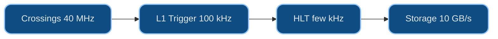

# Dr. Mindaugas Šarpis

# Best Research and Data Analysis Practices from CERN

## Introduction to CERN

##### 📁 data & files · ♻️ reproducibility

<!--
Speaker: welcome them to the course proper. Frame the hour — this is the "why":
what CERN is, why it drowns in data, and why that makes it the perfect backdrop
for the skills we build. Set an exploratory, big-picture tone. (~2 min)
-->

---
hideInToc: true
layout: quote
---

# Not only is the Universe stranger than we think, it is stranger than we **can** think. 
Werner Heisenberg

---
hideInToc: true
---

# Learning **Objectives**

By the end of this lecture, you will be able to:

🏛️ Describe **what CERN is** — the laboratory, the **LHC**, and its four main experiments

🔬 Trace how a collision becomes **data** — the accelerator chain, detector layers, and the **trigger**

📊 Explain why **data analysis** is central — petabytes per second and the needle-in-a-haystack problem

🌐 Recognise CERN's impact beyond physics — the **Web**, the computing **grid**, and **open data**

🎯 Connect these challenges to the **skills** this course builds

<!--
Speaker: read these as promises, not a syllabus. Stress that today is context and
motivation — the hands-on skills start next lecture with how computers work, then the command line in Lecture 4. The paired
Seminar 2 is where they go find the seminar dataset. (~1 min)
-->

---
layout: section
hideInToc: true
---

# What is **CERN**?

<!--
Speaker: section break. Ask who has heard of CERN and what for — most will say
"the Higgs" or "the Web". Use that to preview the next few slides: the org, the
machine, and how a detector actually sees a collision. (~1 min)
-->

---
hideInToc: true
---

# CERN at a Glance

## 🏛️ **The Organisation**

- **European Organization for Nuclear Research**
- Founded in **1954** by 12 European states
- Today: **24 member states**, thousands of visiting scientists
- Located at the **French-Swiss border** near Geneva

## 🎯 **The Mission**

- Probe the **fundamental structure** of matter
- Build and operate the world's most powerful **particle accelerators**
- Push the boundaries of **technology and engineering**
- Train the **next generation** of scientists

## 🌍 **By the Numbers**

🔬 World's **largest** particle physics laboratory · 👩‍🔬 **17,000+** scientists from **110+ nations** · 🏗️ Operating since **1954** · 🧪 Home to the **Large Hadron Collider**

---
hideInToc: true
---

# The Large Hadron Collider (LHC)

## ⚙️ **The Machine**

- A **27 km** circumference ring situated **100 m** underground
- Accelerates protons to **99.9999991%** the speed of light
- Collides particles **~1 billion times per second**
- Operating temperature: **1.9 K** (~ -271.3°C — colder than outer space)

## 🔭 **Main Experiments**

- **ATLAS** — general-purpose detector
- **CMS** — general-purpose detector
- **ALICE** — heavy-ion collisions
- **LHCb** — matter-antimatter asymmetry

## 🏆 **Key Achievement**

Discovery of the **Higgs boson** in **2012** — confirmed the mechanism that gives particles their mass

Nobel Prize in Physics 2013

*Precisely: this gives mass to fundamental particles (**fermions**, **W/Z** bosons) — most of the mass around you (e.g. the proton's) is **QCD binding energy**, not the Higgs.*

---
hideInToc: true
---

# The Accelerator Chain

🔗 No single machine takes protons from a hydrogen bottle to near light speed — the LHC is only the **last link in a chain**, each accelerator handing faster particles to the next.

1️⃣ **LINAC4** — a linear accelerator kicks things off: **160 MeV**

2️⃣ **PS Booster → Proton Synchrotron** — first rings: **2 GeV → 26 GeV**

3️⃣ **Super Proton Synchrotron (SPS)** — 7 km ring: **450 GeV**

4️⃣ **LHC** — 27 km ring: **6.8 TeV per beam** *(Run 3)* — then the beams are made to cross inside the detectors

💡 Each machine was once CERN's frontier — today's record-holder is tomorrow's injector.

---
hideInToc: true
---

# How a Detector Sees a Collision

🧅 Detectors like ATLAS are built as **layers of an onion** around the collision point — each layer measures a different property of the particles flying out.

## 🌀 **Tracker** *(innermost)*

Charged particles bend in a magnetic field — the curvature of each track gives its **momentum**

## ⚡ **EM Calorimeter**

Stops **electrons and photons**, measuring the **energy** they deposit

## 🔨 **Hadronic Calorimeter**

Stops **hadrons** — particles made of quarks (protons, neutrons, pions) — again measuring **energy**

## 🧲 **Muon System** *(outermost)*

**Muons** punch through everything else — dedicated outer chambers catch them

💾 One collision → **millions of electronic signals** across these layers. Software reassembles them into particles — those are the "detector readings" every analysis starts from.

---
layout: section
hideInToc: true
---

# Four **Eyes** on the Ring

The LHC is one machine — but four giant detectors watch its collisions, each built to ask a different question of the same beams.

<!--
Speaker: quick tour of the four experiments. The framing to plant: one accelerator,
four different questions — the machine is shared, the science is not. LHCb gets the
longest stop because the seminar dataset comes from it. (~1 min)
-->

---
hideInToc: true
---

# The Generalists: ATLAS & CMS

🔭 Two **general-purpose** detectors ask the broadest question — *what is matter made of, and what holds it together?* — with deliberately **different designs**, so neither can fool the other.

## 🏟️ **ATLAS**

- The **largest** collider detector ever built
- **46 m** long, **25 m** tall — half a cathedral, 100 m underground
- ~**7,000 tonnes**, ~100 million readout channels

## 🧲 **CMS**

- Built around one colossal superconducting **solenoid** magnet
- **14,000 tonnes** — heavier than the Eiffel Tower
- Same physics goals as ATLAS, opposite design philosophy

🤝 On **4 July 2012** both announced the Higgs **independently, on the same day** — replication was designed into the LHC from the start. Cross-checking isn't a courtesy; it's architecture.

---
hideInToc: true
---

# ALICE — Rewinding the Big Bang

## 💥 **The Question**

What was matter like in the first **millionths of a second** after the Big Bang — before protons and neutrons even existed?

## 🌡️ **The Method**

Collide **lead nuclei** instead of protons → a fleeting droplet of **quark–gluon plasma**, over **100,000×** hotter than the core of the Sun

📈 A single lead–lead collision can spray out **tens of thousands** of particle tracks — untangling them is a **data problem** before it is a physics problem.

---
hideInToc: true
---

# LHCb — Where Did the Antimatter Go?

## ⚖️ **The Question**

The Big Bang should have created matter and antimatter in **equal amounts** — yet everything you see is matter. LHCb hunts the tiny **asymmetries** (*CP violation*) that let matter win.

## 🔬 **The Method**

Precision-measure decays of **beauty** and **charm** quarks in a forward detector whose sensors sit **millimetres** from the beam

## 🏆 **A 2019 First**

LHCb discovered **CP violation in charm** — in decays of the **D⁰ meson**. Remember that name.

🧭 The asymmetries found so far are **far too small** to explain the surviving universe — one of the great open problems in physics.

---
hideInToc: true
---

# Meet the Particle You'll Analyse

## ⚛️ **The D⁰ meson**

- A **charm quark** bound to an up antiquark
- Lives **~0.4 trillionths of a second**, then decays — e.g. **D⁰ → K⁻π⁺**
- Compute the **invariant mass** of each K⁻π⁺ pair, and a peak rises near **1865 MeV**
- That peak is the particle's **fingerprint** in the data

## 📈 **Its fingerprint**

🔬 **Where you'll meet it:** real **LHCb open data** is the seminars' default dataset — you'll locate it in Seminar 2 (or bring a dataset from your own field) and, by Lecture 12 (Practical Data Fitting), produce and fit a peak like this yourself.

<!--
Speaker: the seed slide — this exact peak returns in the Python, visualisation, and
fitting lectures. Students should leave knowing one particle by name: the D0, mass
about 1865 MeV, seen as a bump in the K-pi invariant-mass spectrum. (~2 min)
-->

---
layout: section
hideInToc: true
---

# Why **Data**?

<!--
Speaker: pivot from hardware to the real subject of the course. The LHC is only
interesting because of what pours out of it — 1 PB/s, of which almost nothing is
signal. This is where the course's toolkit earns its keep. (~1 min)
-->

---
hideInToc: true
---

# Why Data Analysis Matters at CERN

## 📊 **The Data Challenge**

- The LHC produces **~1 PB per second** of raw detector output
- Only **~1 in a billion** collisions contains interesting physics
- Must filter, reconstruct, and analyse in near real-time
- Finding the Higgs required sifting through **trillions** of events

## 🔍 **Needle in a Haystack**

- Collision events produce **detector readings** (energy, momentum, position)
- Signal events look almost identical to background noise
- Statistical methods decide if a discovery is **real or a fluctuation**
- The 5-sigma standard: if there were **no new particle**, a background fluctuation this strong would appear in fewer than **1 in 3.5 million** experiments — *Lecture 11 (Probability & Statistics) makes this precise*

💾 **Data Pipeline:** Raw detector signals &#8594; Trigger selection (real-time filtering) &#8594; Event reconstruction &#8594; Physics analysis &#8594; Statistical inference &#8594; Publication

Don't worry about the details yet — every stage here is a skill you'll build over this course, from handling files to statistical inference.

---
hideInToc: true
---

# From Collision to Dataset

🚦 Storing 1 PB **every second** is impossible — the experiments decide **in real time** which collisions are worth keeping. This selection is the **trigger**, and its real job is **throwing almost everything away**, correctly, in microseconds.

💥 **~40 million bunch crossings** per second inside each detector — and a crossing is not a collision: each packs **dozens of overlapping proton–proton collisions**, the **~1 billion collisions per second** from the LHC slide

⚡ **Level-1 trigger** — custom electronics decide in **microseconds** → ~**100,000** events/s survive

🖥️ **High-Level Trigger** — a computing farm inspects the full event → a few **thousand** events/s written to storage

💾 Only these survivors become the **datasets** physicists analyse — about **one collision in a million** is ever stored

⚠️ A trigger decision is **final** — discarded collisions are gone forever. Deciding what to keep is itself a data-analysis problem.

---
hideInToc: true
---

# From Events to Petabytes

🧮 Put real units on the cascade you just saw — from a single **event** to a **year** of recorded data.

## 📦 **The Arithmetic**

**~1–2 MB** per event × a few **thousand** events/s ≈ **10 GB/s** to disk and tape; × ~**10⁷ s** of beam per year ≈ **100+ PB per year**. Any one physicist's analysis sample is a sliver of that sliver.

## 💻 **LHCb, Since Run 3**

No hardware trigger at all: every crossing — **30 million per second** — is read out in full and judged by a **software trigger** (its first stage on GPUs). That is the detector behind the seminar dataset.

---
hideInToc: true
---

# Why It Has to Be Real-Time

🎯 **So why not just build bigger disks and keep it all?** Because disks alone wouldn't help — nothing can *write* 1 PB every second, and the keep/discard decision has to be made in **microseconds**.

## 🔁 **No Do-Overs**

Bunches cross every **25 nanoseconds** — the next collision arrives long before software finishes judging the last one

## ⏳ **No Buffering, Later**

Unlike a slow video stream, there's no "buffering" option — the trigger commits **in microseconds**, or the data is gone

🔍 **What the trigger looks for:** a few high-energy leptons or jets, missing energy — or, at LHCb, tracks that **don't point back** to the collision, because a D⁰ flies a few millimetres before it decays. The selection is code, written before anyone sees the data.

---
hideInToc: true
---

<MCQ
  question="The detector electronics put out ~1 PB of raw signal per second, before any selection. Why can't the experiments simply record it all?"
  :options="[
    'There is no scientific reason to — only a handful of processes matter',
    'No real-time system can write ~1 PB/s to disk, even before counting the cost',
    'Data-protection rules cap how much CERN is legally allowed to store',
    'Only high-luminosity runs need a trigger — earlier runs recorded everything'
  ]"
  :correct="1"
  explanation="No storage system can sustain ~1 PB/s of writes. The trigger compresses that raw electronics firehose down to the few thousand events/s (~10 GB/s) that computing can actually absorb — before anyone judges what's interesting."
/>

---
hideInToc: true
---

*Check your reading of the previous slides — this one trips up professionals too.*

<MCQ
  question="The Higgs discovery met the '5-sigma' standard. What does that actually mean?"
  :options="[
    'There is less than a 1-in-3.5-million chance the discovery is wrong',
    'If there were no new particle, a background fluctuation this strong would occur in fewer than 1 in 3.5 million experiments',
    'The Higgs mass was measured to 5 decimal places',
    'Five independent experiments confirmed the signal'
  ]"
  :correct="1"
  explanation="5 sigma limits how often pure background fakes a signal this strong — not the chance the discovery is wrong (option one's misreading). Lecture 11 (Probability & Statistics) makes this precise."
/>

---
layout: section
hideInToc: true
---

# Beyond the **Ring**

Coping with its own data forced CERN to invent things the rest of the world now runs on — the Web, a planet-sized grid, open data and open publishing.

<!--
Speaker: section break. The pivot: everything so far was about the machine; this
section is about what the machine forced CERN to build for everyone else. Ask which
CERN invention they used today — the answer is the Web, every one of them. (~1 min)
-->

---
hideInToc: true
---

# CERN's Impact Beyond Physics

## 🌐 **The World Wide Web**

Invented at CERN by **Tim Berners-Lee** in **1989** to share data between scientists — now used by **5+ billion** people worldwide

## 🖥️ **Computing Grid (WLCG)**

The **Worldwide LHC Computing Grid** connects **170+ centres** in **40+ countries** — storing **hundreds of petabytes** of new data every year

## 🏥 **Medical Applications**

Particle accelerator technology enables **hadron therapy** for cancer treatment — more precise than conventional radiotherapy

## 📂 **Open Science**

CERN **Open Data Portal** makes real collision data publicly available — enabling education and independent research worldwide

📖 **Publishing, openly too:** CERN co-founded **SCOAP3**, making almost all particle-physics journal articles free to read worldwide — and preprints on **arXiv** circulate long before any journal sees them.

---
hideInToc: true
---

# A Planet-Sized Computer

🌍 No single data centre can process the LHC's output — the work is spread across a **tiered global grid** *(as of 2026: 170+ sites, 42 countries, ~1.4 million CPU cores)*.

🏛️ **Tier 0 — CERN** · the custodial copy of all raw data on tape, first-pass reconstruction

🏢 **Tier 1 — ~15 national labs** · second copies, large-scale reprocessing, round-the-clock links to CERN

🏫 **Tier 2 — ~150 universities** · simulation and the everyday analyses of individual physicists

💡 A physicist launching an analysis rarely knows — or cares — **which country** their jobs run in. You'll meet the same idea at your own scale: compute where convenient, keep data organised and portable. The grid itself — jobs, storage trade-offs, ~170 sites — is **Lecture 15 (Computing Infrastructure & HPC)** in full; today was just its shape.

🔭 The pattern repeats at the frontier: the **Future Circular Collider (FCC)** feasibility study, reported in **2025**, proposes a 91 km ring for which the LHC itself would be the injector.

---
hideInToc: true
---

# Open Data, Up Close

## 🎯 **The Portal**

The **Open Data Portal** from the impact slide isn't an abstraction for this course: the **LHCb D⁰ → K⁻π⁺** sample the seminars practise on lives there as **record 401** — downloadable by anyone, no CERN credentials required.

🔬 **Seminar 2** sends you to fetch it — or a dataset from your own field: locate the exact record and note its provenance before you ever open it in Python.

## 📌 **Provenance, Not Just Access**

"Open" only helps the next person if they can find the **exact version** you used — that's what a dataset's **DOI** and **licence** are for.

Every CERN Open Data record carries a **DOI**, a **licence** (CC0), file checksums and the software that produced it — the FAIR-data habits **Lecture 14 (Reproducible Workflows & Automation)** builds out in full.

📝 Whatever data your own project ends up using, the same four lines — title, DOI (or URL and access date), licence, and who produced it — are the first entries of its README.

---
layout: section
hideInToc: true
---

# From the **Cosmos** to the **Quantum**

The next short films sweep across the scales of nature — from mountains and deep space down to individual atoms and particle tracks.

Watch for the **change in scale**: the same urge to observe, measure, and understand connects a telescope pointed at distant galaxies with a detector watching protons collide.

<!--
Speaker: dim the lights. Let the films run — don't narrate over them. The one cue
to plant beforehand: spot the instrument in every scene — camera, rover, telescope,
chamber — and ask what its output looks like once it is stored. The Half-time slide
turns that into a question; the closing section picks it up. (~1 min setup)
-->

---

<VideoPlayer src="Skylapse.mp4" autoplay loop   />

---

<VideoPlayer src="Drone_Climbing_Mountain.mp4" autoplay   />

---

<VideoPlayer src="VU_VM.mp4" autoplay   />

---

<VideoPlayer src="NASA_Mars_Mariner_4_Pan_Audio.mp4" autoplay   />

---

<VideoPlayer src="Perseverance_Rover_Landing_NASA.mp4" autoplay   />

---

<VideoPlayer src="Cassini_Grand_Finale_NO_VO.mp4" autoplay   />

---

<VideoPlayer src="Stars_Pan_Audio.mp4" autoplay   />

---

<VideoPlayer src="Telescope.mp4" autoplay   />

---

<VideoPlayer src="Hubble.mp4" autoplay   />

---

<VideoPlayer src="Webb_Reel.mp4" autoplay   />

---

<VideoPlayer src="Milky_Way_Sim_Audio.mp4" autoplay   />

---

<VideoPlayer src="Expansion_Funnel_H264_1080p.webm" autoplay   />

---
hideInToc: true
layout: fact
---

# Half-time

## Every scene so far ends as data someone must turn into understanding — which one would *you* analyse first?

---

<VideoPlayer src="QGP_Formation.mp4" autoplay   />

---

<VideoPlayer src="Voyage_in_to_the_world_of_atoms.mp4" autoplay   />

---

<VideoPlayer src="Cloud_Chamber_Audio.mp4" autoplay   />

---
layout: section
hideInToc: true
---

# Inside **CERN**

Now we descend from the universe at large into the laboratory itself — the accelerators, detectors, and people who turn these big questions into concrete measurements.

<!--
Speaker: shift from cosmos to lab. These clips show the real machines behind the
diagrams — ATLAS, LHCb, the tunnels. Point out the human scale next to the
detectors before rolling. (~1 min setup)
-->

---

<VideoPlayer src="CERN_Overview_Short.mp4" autoplay   />

---

<VideoPlayer src="ATLAS-VIDEO-2021-001-001-1080p.mp4" autoplay   />

---

<VideoPlayer src="ATLAS-FOOTAGE-2022-004-002-1080p_Shaft.mp4" autoplay   />

---

<VideoPlayer src="LHCb.mp4" autoplay   />

---

<VideoPlayer src="CERN-FOOTAGE-2023-019-001-2160p.mp4" autoplay   />

---

<VideoPlayer src="CERN-VIDEO-2020-064-001-2160p.mp4" autoplay   />

---

<VideoPlayer src="CERN-FOOTAGE-2024-006-001.mp4" autoplay   />

---

<VideoPlayer src="CERN-FOOTAGE-2024-010-002.mp4" autoplay   />

---

<VideoPlayer src="GTC_2020_1080p.mp4" autoplay   />

---
layout: section
hideInToc: true
---

# From Films to **Skills**

Telescopes, rovers, cloud chambers, detectors — different instruments, one job: measure, record, and hand the numbers to someone who can read them. This course trains that someone.

---
hideInToc: true
---

# Careers at CERN

👥 CERN employs far more than physicists: of its few thousand **staff**, most are engineers and technicians, while the 17,000 scientists you saw earlier are mostly visiting **users** from institutes worldwide. A glimpse of who turns 40 million bunch crossings a second into discoveries:

## 🧑‍🔬 **Physicists**

Design analyses, hunt signals in noise — statistics and Python, at full scale.

## 🛠️ **Engineers**

Build and maintain accelerators, magnets, cryogenics, and detectors under extreme conditions.

## 💻 **Computing Specialists**

Keep 170+ grid sites, trigger farms, and petabyte storage running around the clock.

---
hideInToc: true
---

# A Day in the Data

## 🔎 **One Analyst's Morning**

Pull last night's triggered events, check the D⁰ peak hasn't drifted, flag anything strange for the shift crew, push a fix to the shared analysis code — before lunch, on a laptop, anywhere in the world.

## 🌙 **One Shift Crew's Night**

In the control room the same peak sits on a live monitoring plot: if a sub-detector or the trigger farm misbehaves, the histogram shows it before any alarm does — and the night's data is flagged good or bad for everyone downstream.

🌍 Neither job requires standing next to the detector — both require exactly the skills this course builds: files, code, version control, statistics.

---
hideInToc: true
---

# Why You Need These Skills

CERN turns raw collisions into discoveries with exactly the toolkit this course builds:

## 📁 **Handling Massive Data**

Petabytes of detector output demand disciplined file handling, data formats, and organisation.

## 🔀 **Working Together**

Thousands of scientists share one codebase — impossible without version control.

## 🐍 **Turning Signal into Insight**

Python and data-analysis tools transform readings into physics.

## 🎲 **Real or a Fluke?**

Statistics decide whether a bump in the data is a discovery — or noise.

You don't need a particle accelerator to use any of this. **Next, we start building these skills ourselves — first how a computer actually works, then the command line.**

---
hideInToc: true
---

# **Recap** — You Can Now…

✅ Describe **CERN**, the **LHC**, and its four main experiments

✅ Trace a collision from **beam** to stored **dataset** via the **trigger**

✅ Explain why **data analysis** is central — and what **5-sigma** means

✅ Recognise CERN's impact beyond physics — the **Web**, the **grid**, and **open data**

✅ Connect CERN's challenges to the **skills** this course builds

🔬 **Seminar 2 tie-in** — find and document a dataset: LHCb's D⁰ → K⁻π⁺ open data on the CERN Open Data Portal, or one from your own field — recording its provenance (title, DOI, licence).

<!--
Speaker: the "you can now" beat — have them nod along to each. The tie-in makes the
payoff concrete: in the seminar they hunt down the actual dataset the seminars
analyse, and practise recording its provenance. (~1 min)
-->

