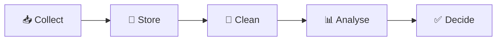
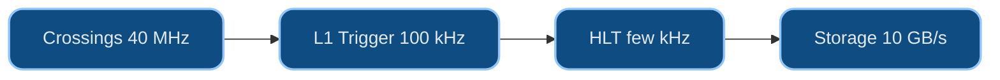

# Dr. Mindaugas Šarpis

# Best Research and Data Analysis Practices from CERN

## Introduction to Data

##### 📁 data & files · ♻️ reproducibility

<!--
Speaker: last time was the why — the films and CERN. Today is the what: data
itself. Start from their own day, then the lab's data, then how to find and
document a dataset — the skill Seminar 2 practises. (~2 min)
-->

---
hideInToc: true
layout: quote
---

# Not only is the Universe stranger than we think, it is stranger than we **can** think. 
Werner Heisenberg

---
hideInToc: true
---

# Learning **Objectives**

By the end of this lecture, you will be able to:

🗂️ Spot the **datasets** hiding in an ordinary day — and sort them into the **four flavours** you'll keep meeting

🔄 Walk a dataset through its **lifecycle** — capture, storage, processing, analysis, sharing — and say where it silently goes wrong

⚛️ Trace how a **collision becomes a dataset** — detector, trigger, storage — and meet the **D⁰** you'll analyse

🌐 Find an **open dataset** and document it — portal, record, **DOI**, licence, provenance (the job of Seminar 2)

📄 Read a real data file — **rows, columns, units, metadata** — before writing a line of code

<!--
Speaker: read these as promises. Today is still context, but of a practical kind:
by the end they should know what a dataset *is*, where to get one and how to
write down where it came from. The hands-on skills start next lecture with how
computers work, then the command line in Lecture 4. (~1 min)
-->

---
layout: section
hideInToc: true
---

# Data in **Your Life**

---
hideInToc: true
---

# A Day in Data — **Morning**

## ⏰ **Before breakfast**

- Your phone logs the exact second the alarm went off
- A wearable scores how you slept — from heart rate and motion all night
- A weather app pushes a forecast computed from millions of sensor readings
- The battery graph already knows your charging habits better than you do

Ten minutes awake and you have already generated — and consumed — several datasets. None of it felt like "data".

## 🚌 **The commute**

- A transit card taps in — a timestamp and a location, stored for years
- Maps reroutes you around traffic it inferred from other phones moving slowly
- Dozens of cameras log the same walk from different angles
- A playlist auto-queues songs a model predicts you'll keep

Each tap, ping, and skip is a row in someone's table — and the routing that helped you was itself built from yesterday's data.

---
hideInToc: true
---

# A Day in Data — **Afternoon to Lights-Out**

## 💻 **Work & screens**

- Every click, scroll, and pause feeds product-analytics dashboards
- A shop's "customers also bought" is a live recommendation model
- Each card payment is scored for fraud in under a second
- Spam filters quietly classify every message before you see it

Most of this analysis runs automatically — ⚙️ automation and ♻️ reproducibility at planetary scale, invisible until it breaks.

## 🌙 **Evening**

- A streaming service picks your thumbnail from thousands of quiet experiments
- A run is logged as a GPS track, then compared to last month's pace
- A smart meter reports the day's electricity in fine-grained slices
- The cycle closes as the wearable starts scoring tonight's sleep

From alarm to lights-out you moved through hundreds of small analyses — almost all of them made by someone else, about you.

---
hideInToc: true
---

# Every One of These Is a **Dataset**

Behind each convenience is the same loop you'll learn to run in this course: **collect → store → clean → analyse → decide**. The recommendation, the forecast, the fraud alert — all of it is somebody's pipeline running on somebody's table.

## 🔎 **The shift this course asks of you**

Stop seeing finished apps. Start seeing the **data and the decisions** underneath — because soon you'll be the one building that loop.

## 🎓 **The good news**

The same handful of skills — files, code, statistics, reproducibility — powers *all* of it. Learn them once; apply them anywhere.

---
hideInToc: true
---

# So — What Even **Is** Data?

A working definition for this course: **data is recorded observation** — facts captured in a form a machine can store and re-read. The moment something is written down consistently enough to count, sort, or compare, it becomes data.

## 📏 **It starts as a measurement**

A temperature, a timestamp, a momentum, a yes/no. On its own, one value says little.

## 📚 **It becomes useful in bulk**

Thousands of those values, organised, reveal patterns no single reading ever could — the whole game of analysis.

---
hideInToc: true
---

# Data Has a **Lifecycle**

The loop from two slides ago, drawn out. Every project — yours, a bank's, a physics collaboration's — walks it, and each answer raises fresh questions that restart it. This course spends a lecture or two on **each stage**; the seminars walk a shared dataset through every stage of it.

Most real-world pain comes from skipping a stage — analysing before cleaning, or deciding before storing where the data came from.

---
hideInToc: true
---

<MCQ
  question="Across a whole day — alarm, transit card, recommendations, fraud checks — what makes all of it 'data analysis' rather than magic?"
  :options="[
    'Each one runs the same loop: collect, store, clean, analyse, then decide',
    'Collecting and storing the readings is itself the analysis — once data is saved, the work is done',
    'Behind each service, analysts review your raw activity streams and decide case by case',
    'Each device analyses its own data locally, so nothing needs to be stored or cleaned first'
  ]"
  :correct="0"
  explanation="However different the domains look, they share one pipeline — collect, store, clean, analyse, decide. Recognising that shared shape is the whole point of week 1: the skills transfer because the loop is always the same."
/>

---
hideInToc: true
---

# Structured vs **Unstructured**

## 📊 **Structured**

Lives in neat rows and columns — a table, a spreadsheet, a database. Each column has a meaning and a type.

- Sensor logs, transaction records, survey answers
- Easy to sort, filter, and compute on directly
- **Most of this course lives here** — the tidy table

## 🌀 **Unstructured**

Free-form — text, images, audio, video. Rich, but a computer can't average it until you extract structure first.

- Emails, photos, recordings, PDFs
- Needs a step to turn it into numbers or labels
- Where most modern machine learning earns its keep

The first real job of many projects is turning the second kind into the first.

---
hideInToc: true
---

# Four Flavours You'll **Meet**

## 🔢 **Numbers**

Measurements you can add, average, and plot. The core of statistics and fitting.

## 🔤 **Text**

Labels, categories, free comments. Countable once you decide what to count.

## 🖼️ **Images**

Grids of pixels — secretly just numbers. The natural home of modern ML.

## ⚡ **Events**

Timestamped things that happened — a click, a tap, a particle collision.

A particle-physics analysis is built from <strong>events</strong> (collisions) that we turn into <strong>numbers</strong> (a mass) — two flavours in one pipeline.

---
hideInToc: true
---

# Measurement vs **Metadata**

## 📐 **The measurement**

The number you care about — the temperature, the price, the particle's momentum. The reason the record exists at all.

## 🏷️ **The metadata**

Data *about* the measurement — when, where, by which instrument, in what units, under what settings.

## ⚠️ **Metadata is not optional** 📁 ♻️

A momentum with no units, a reading with no timestamp, a file with no source — that's a number you can neither trust nor reproduce. Half of good data work is keeping the metadata attached.

---
hideInToc: true
---

# Where Each Kind Shows Up **Later**

| **Kind of data** | **What you learn to do with it** | **Where** |
| --- | --- | --- |
| Files & raw bytes | Read, name, and organise safely | L03–L05 · S3–S5 |
| Structured tables | Load, clean, and reshape | L08, L13 · S8, S13 |
| Numbers | Summarise, visualise, fit | L10–L12 · S10–S12 |
| Uncertainty | Report a value ± an error | L11–L12 · S11–S12 |
| Events → numbers | Turn one collision into a number (a mass) | L02, L09 · S7–S8, S12 |

Nothing here needs to make sense yet — it's a map. Each row is a week where this abstract taxonomy becomes something your own hands do.

---
hideInToc: true
---

# Thought Exercise — Data in **Your Field**

## 🤔 **Think** (2 min)

Pick a project, hobby, or job you know well.

- What data gets generated?
- Who collects it, and how?
- What decisions does it inform?

## 💬 **Discuss** (3 min)

Share with a neighbour:

- What is one decision that could be improved if the data were better collected, stored, or analysed?
- What would "good enough" data analysis look like in your context?

## 🎯 **Takeaway**

Every field generates data. The tools and mindset you'll build in this course apply far beyond particle physics.

---
hideInToc: true
---

# Data at Work — **Life & Planet**

## 🧬 **Biomedicine & genomics**

- Genome sequencing → identifying variants & gene expression patterns
- Clinical trials → monitoring safety, efficacy, adaptive designs
- Population health dashboards & personalised medicine
- Decisions: targeted therapies, drug discovery, diagnostics

🧪 <strong>23andMe</strong> / <strong>Ancestry</strong> compare you against <em>reference populations</em>. 23andMe went bankrupt in 2025 and its genetic database changed hands in the proceedings — consent outlives a company.

## 🌍 **Environmental sciences**

- Climate models integrating satellite, sensor, and historical data
- Pollution monitoring at city/block resolution
- Biodiversity studies combining field notes + remote sensing
- Supports policy making, disaster response, conservation funding

🔄 <strong>Living analysis</strong> — data feeds update the models continuously; the "result" is a pipeline that never stops running.

---
hideInToc: true
---

# Data at Work — **Sky & Subatomic**

## 🔭 **Astronomy**

- Observational data from telescopes, satellites, detectors
- Gravitational wave detection via signal processing & ML
- Cataloguing millions of celestial objects, anomaly detection
- Requires high-throughput computing, reproducible pipelines

🤖 <strong>Galaxy Zoo</strong> crowdsourced classifications of ~1M galaxies from SDSS images — the labelled set that seeded today's CNN galaxy-morphology classifiers.

## ⚛️ **Particle physics (CERN)**

- Petabytes of collision data → reconstruct events, filter noise
- Multivariate analysis to isolate rare signals (e.g. Higgs boson)
- Collaboration across detectors, theory, computing teams
- Drives advances in distributed computing & open data practices

🔬 <strong>Your seminars live here</strong> — the same open LHCb collision data physicists publish, walked from raw events to a measured mass.

---
hideInToc: true
---

# Data at Work — **Money**

## 💰 **Finance**

- Stock market analysis + algorithmic trading with latency constraints
- Risk management using stress tests, scenario analysis, VaR
- Fraud detection & compliance monitoring with streaming data
- Balances profitability with regulation and transparency

📉 The one field where every actor is <em>also</em> trying to out-predict every other actor's model — a reminder that data describes the past far better than it dictates the future.

## 🎬 **…and the limits of prediction**

There are some things <em>no data model</em> can predict.

Play the reel live: <a href="https://www.facebook.com/reel/1963960414998958">facebook.com/reel/…</a>

---
hideInToc: true
---

# Common **Threads** Across Every Domain

## 🎯 **Decisions drive design**

Genomics, finance, or particle physics — analysis starts from a decision someone must make.

## 📐 **Uncertainty is first-class**

Every field reports ranges, intervals, or risks — not single numbers.

## 🔄 **Pipelines over one-offs**

Reproducible workflows beat ad-hoc analyses once data keeps arriving.

## 🤝 **Teams, not heroes**

Domain + analyst + engineer + stakeholder — no single role sees the whole.

## ⚖️ **Ethics follows impact**

The higher the stakes (health, policy, money), the stronger the governance.

## 📖 **Stories ship insight**

Numbers change nothing until they land as a narrative a decision-maker can act on.

🔍 Which example resonates with you — and where could similar data, similar decisions, and similar obstacles exist in your own context?

---
layout: section
hideInToc: true
---

# Four **Eyes** on the Ring

The LHC is one machine — but four giant detectors watch its collisions, each built to ask a different question of the same beams.

<!--
Speaker: quick tour of the four experiments. The framing to plant: one accelerator,
four different questions — the machine is shared, the science is not. LHCb gets the
longest stop because the seminar dataset comes from it. (~1 min)
-->

---
hideInToc: true
---

# The Generalists: ATLAS & CMS

🔭 Two **general-purpose** detectors ask the broadest question — *what is matter made of, and what holds it together?* — with deliberately **different designs**, so neither can fool the other.

## 🏟️ **ATLAS**

- The **largest** collider detector ever built
- **46 m** long, **25 m** tall — half a cathedral, 100 m underground
- ~**7,000 tonnes**, ~100 million readout channels

## 🧲 **CMS**

- Built around one colossal superconducting **solenoid** magnet
- **14,000 tonnes** — heavier than the Eiffel Tower
- Same physics goals as ATLAS, opposite design philosophy

🤝 On **4 July 2012** both announced the Higgs **independently, on the same day** — replication was designed into the LHC from the start. Cross-checking isn't a courtesy; it's architecture.

---
hideInToc: true
---

# ALICE — Rewinding the Big Bang

## 💥 **The Question**

What was matter like in the first **millionths of a second** after the Big Bang — before protons and neutrons even existed?

## 🌡️ **The Method**

Collide **lead nuclei** instead of protons → a fleeting droplet of **quark–gluon plasma**, over **100,000×** hotter than the core of the Sun

📈 A single lead–lead collision can spray out **tens of thousands** of particle tracks — untangling them is a **data problem** before it is a physics problem.

---
hideInToc: true
---

# LHCb — Where Did the Antimatter Go?

## ⚖️ **The Question**

The Big Bang should have created matter and antimatter in **equal amounts** — yet everything you see is matter. LHCb hunts the tiny **asymmetries** (*CP violation*) that let matter win.

## 🔬 **The Method**

Precision-measure decays of **beauty** and **charm** quarks in a forward detector whose sensors sit **millimetres** from the beam

## 🏆 **A 2019 First**

LHCb discovered **CP violation in charm** — in decays of the **D⁰ meson**. Remember that name.

🧭 The asymmetries found so far are **far too small** to explain the surviving universe — one of the great open problems in physics.

---
hideInToc: true
---

# Meet the Particle You'll Analyse

## ⚛️ **The D⁰ meson**

- A **charm quark** bound to an up antiquark
- Lives **~0.4 trillionths of a second**, then decays — e.g. **D⁰ → K⁻π⁺**
- Compute the **invariant mass** of each K⁻π⁺ pair, and a peak rises near **1865 MeV**
- That peak is the particle's **fingerprint** in the data

## 📈 **Its fingerprint**

🔬 **Where you'll meet it:** real **LHCb open data** is the seminars' default dataset — you'll locate it in Seminar 2 (or bring a dataset from your own field) and, by Lecture 12 (Practical Data Fitting), produce and fit a peak like this yourself.

<!--
Speaker: the seed slide — this exact peak returns in the Python, visualisation, and
fitting lectures. Students should leave knowing one particle by name: the D0, mass
about 1865 MeV, seen as a bump in the K-pi invariant-mass spectrum. (~2 min)
-->

---
layout: section
hideInToc: true
---

# Why **Data**?

<!--
Speaker: pivot from hardware to the real subject of the course. The LHC is only
interesting because of what pours out of it — 1 PB/s, of which almost nothing is
signal. This is where the course's toolkit earns its keep. (~1 min)
-->

---
hideInToc: true
---

# Why Data Analysis Matters at CERN

## 📊 **The Data Challenge**

- The LHC produces **~1 PB per second** of raw detector output
- Only **~1 in a billion** collisions contains interesting physics
- Must filter, reconstruct, and analyse in near real-time
- Finding the Higgs required sifting through **trillions** of events

## 🔍 **Needle in a Haystack**

- Collision events produce **detector readings** (energy, momentum, position)
- Signal events look almost identical to background noise
- Statistical methods decide if a discovery is **real or a fluctuation**
- The 5-sigma standard: if there were **no new particle**, a background fluctuation this strong would appear in fewer than **1 in 3.5 million** experiments — *Lecture 11 (Probability & Statistics) makes this precise*

💾 **Data Pipeline:** Raw detector signals &#8594; Trigger selection (real-time filtering) &#8594; Event reconstruction &#8594; Physics analysis &#8594; Statistical inference &#8594; Publication

Don't worry about the details yet — every stage here is a skill you'll build over this course, from handling files to statistical inference.

---
hideInToc: true
---

# From Collision to Dataset

🚦 Storing 1 PB **every second** is impossible — the experiments decide **in real time** which collisions are worth keeping. This selection is the **trigger**, and its real job is **throwing almost everything away**, correctly, in microseconds.

💥 **~40 million bunch crossings** per second inside each detector — and a crossing is not a collision: each packs **dozens of overlapping proton–proton collisions**, the **~1 billion collisions per second** from the LHC slide

⚡ **Level-1 trigger** — custom electronics decide in **microseconds** → ~**100,000** events/s survive

🖥️ **High-Level Trigger** — a computing farm inspects the full event → a few **thousand** events/s written to storage

💾 Only these survivors become the **datasets** physicists analyse — about **one collision in a million** is ever stored

⚠️ A trigger decision is **final** — discarded collisions are gone forever. Deciding what to keep is itself a data-analysis problem.

---
hideInToc: true
---

# From Events to Petabytes

🧮 Put real units on the cascade you just saw — from a single **event** to a **year** of recorded data.

## 📦 **The Arithmetic**

**~1–2 MB** per event × a few **thousand** events/s ≈ **10 GB/s** to disk and tape; × ~**10⁷ s** of beam per year ≈ **100+ PB per year**. Any one physicist's analysis sample is a sliver of that sliver.

## 💻 **LHCb, Since Run 3**

No hardware trigger at all: every crossing — **30 million per second** — is read out in full and judged by a **software trigger** (its first stage on GPUs). That is the detector behind the seminar dataset.

---
hideInToc: true
---

# Why It Has to Be Real-Time

🎯 **So why not just build bigger disks and keep it all?** Because disks alone wouldn't help — nothing can *write* 1 PB every second, and the keep/discard decision has to be made in **microseconds**.

## 🔁 **No Do-Overs**

Bunches cross every **25 nanoseconds** — the next collision arrives long before software finishes judging the last one

## ⏳ **No Buffering, Later**

Unlike a slow video stream, there's no "buffering" option — the trigger commits **in microseconds**, or the data is gone

🔍 **What the trigger looks for:** a few high-energy leptons or jets, missing energy — or, at LHCb, tracks that **don't point back** to the collision, because a D⁰ flies a few millimetres before it decays. The selection is code, written before anyone sees the data.

---
hideInToc: true
---

<MCQ
  question="The detector electronics put out ~1 PB of raw signal per second, before any selection. Why can't the experiments simply record it all?"
  :options="[
    'There is no scientific reason to — only a handful of processes matter',
    'No real-time system can write ~1 PB/s to disk, even before counting the cost',
    'Data-protection rules cap how much CERN is legally allowed to store',
    'Only high-luminosity runs need a trigger — earlier runs recorded everything'
  ]"
  :correct="1"
  explanation="No storage system can sustain ~1 PB/s of writes. The trigger compresses that raw electronics firehose down to the few thousand events/s (~10 GB/s) that computing can actually absorb — before anyone judges what's interesting."
/>

---
hideInToc: true
---

*Check your reading of the previous slides — this one trips up professionals too.*

<MCQ
  question="The Higgs discovery met the '5-sigma' standard. What does that actually mean?"
  :options="[
    'There is less than a 1-in-3.5-million chance the discovery is wrong',
    'If there were no new particle, a background fluctuation this strong would occur in fewer than 1 in 3.5 million experiments',
    'The Higgs mass was measured to 5 decimal places',
    'Five independent experiments confirmed the signal'
  ]"
  :correct="1"
  explanation="5 sigma limits how often pure background fakes a signal this strong — not the chance the discovery is wrong (option one's misreading). Lecture 11 (Probability & Statistics) makes this precise."
/>

---
layout: section
hideInToc: true
---

# Open Data & **Provenance**

<!--
Speaker: shift gears — from *what data is* to *where you get it and how you prove
where it came from*. This is the skill Seminar 2 practises on the LHCb sample or
on their own dataset. (~1 min)
-->

---
hideInToc: true
---

# Where Data Lives — **Open-Data Portals**

## 🔬 **Physics & space**

- **CERN Open Data Portal** — LHC collision data, masterclass samples
- **NASA** open data & the Planetary Data System
- **ESA** archives — Gaia, Euclid, Webb

## 🌍 **Society & environment**

- **Eurostat** and national statistics offices
- **Copernicus / ECMWF** — weather and climate
- **World Bank, OECD, WHO** indicators

## 📚 **Any field**

- **Zenodo** — upload anything, get a DOI
- **Kaggle**, **Hugging Face** datasets
- Your university's research repository

🔗 A portal is a **catalogue**: every dataset on it is a **record** with a stable address. You cite the record, not the file you happened to download.

---
hideInToc: true
---

# Anatomy of a **Record**

## 🧾 **What every record carries**

- **Title** and authors / collaboration
- A **persistent identifier** — the DOI resolves forever, even if the portal moves
- **Licence** — what you may do with it
- **Files** with sizes and **checksums**
- **Description** — how the data was produced and selected
- **Version** and date

## ⚛️ **Record 401 — the seminar dataset**

- *LHCb event file for real measurement*
- DOI `10.7483/OPENDATA.LHCb.E7EJ.JUWR`
- Licence **CC0** — no conditions
- ~60 000 pre-selected D⁰ → K⁻π⁺ candidates
- Companion event-display files: record 400

✅ Reading the record *before* the data answers the questions you would otherwise ask the file: what is one row, which selection was applied, what am I allowed to publish.

---
hideInToc: true
---

# Licences — What "Open" **Actually Permits**

## 🆓 **CC0**

No conditions at all. Reuse, remix, republish. *CERN Open Data.*

## 🏷️ **CC BY**

Do anything, but **credit the source**. *Most ESA / ESO / NOIRLab material.*

## 🔁 **Share-alike (ODbL, CC BY-SA)**

Derived datasets must stay **equally open**. *OpenStreetMap.*

⚠️ **Open to read ≠ open to redistribute.** Some portals let you download but not re-host. Check the licence *before* the dataset lands in a public GitHub repository — and before you publish a table derived from it.

---
hideInToc: true
---

# Provenance — **Write Down Where It Came From**

## 📝 **The minimal provenance note**

- Portal + **record ID** and **DOI**
- **Licence**
- **Date** you fetched it (and record version)
- File names and their **checksums**
- What you did to it so far — *nothing* is a valid answer

## 📄 **As it looks in a README**

\`\`\`text
Source:   CERN Open Data Portal, record 401
DOI:      10.7483/OPENDATA.LHCb.E7EJ.JUWR
Licence:  CC0
Fetched:  2026-09-15
Files:    D0_KPi.csv  sha256 3f9a…c1e2
Changes:  none
\`\`\`

♻️ Reproducibility starts **before** the analysis: someone else — or you in six months — must be able to fetch the **same bytes**. The checksum is how you prove it.

---
hideInToc: true
---

# Data You **Bring Yourself**

## 🎒 **Same discipline, your dataset**

- Where it came from — URL, instrument, survey, colleague
- Under what terms you may use and publish it
- A **snapshot**: the file exactly as received, plus its checksum
- The date — web data changes under you

## 🔒 **Personal or sensitive data**

- Anonymise before it enters a repository
- Never commit raw personal data to git — public or private
- If in doubt: describe the data in the project, keep the file out of it

🎯 Your semester project is on data of **your** choice — this checklist is what makes that choice safe to build on.

---
hideInToc: true
---

# From Record to **Your Repo**

## 🧭 **The path Seminar 2 walks**

1. **Find** the record on the portal (or the source of your own data)
2. **Read** the record — title, DOI, licence, description
3. **Download** into `data/raw/` of the project skeleton from Seminar 1
4. **Checksum** the file — `sha256sum data/raw/*`
5. **Write** the provenance note into the README
6. **Commit the note** — and the data only if it is small *and* the licence allows it

📁 Large or restricted data stays out of git; the README says exactly how to fetch it again. That is the difference between "I have the data" and "the analysis is reproducible".

---
hideInToc: true
---

<MCQ
  question="You downloaded a CSV from a data portal six months ago and now want to cite it in your project so that a reader can get exactly the same data. What must you have recorded?"
  :options="[
    'The file name and its size',
    'The record\'s DOI (or stable URL), the version or date you fetched it, and the file checksum',
    'A screenshot of the download page',
    'The name of the person who told you about the dataset'
  ]"
  :correct="1"
  explanation="A DOI or stable record URL identifies the dataset independently of where the file sits today; the version or fetch date pins which release you used; the checksum proves the bytes are unchanged. Name and size can collide; a screenshot and a person cannot be resolved by a reader."
/>

---
layout: section
hideInToc: true
---

# Beyond the **Ring**

Coping with its own data forced CERN to invent things the rest of the world now runs on — the Web, a planet-sized grid, open data and open publishing.

<!--
Speaker: section break. The pivot: everything so far was about the machine; this
section is about what the machine forced CERN to build for everyone else. Ask which
CERN invention they used today — the answer is the Web, every one of them. (~1 min)
-->

---
hideInToc: true
---

# CERN's Impact Beyond Physics

## 🌐 **The World Wide Web**

Invented at CERN by **Tim Berners-Lee** in **1989** to share data between scientists — now used by **5+ billion** people worldwide

## 🖥️ **Computing Grid (WLCG)**

The **Worldwide LHC Computing Grid** connects **170+ centres** in **40+ countries** — storing **hundreds of petabytes** of new data every year

## 🏥 **Medical Applications**

Particle accelerator technology enables **hadron therapy** for cancer treatment — more precise than conventional radiotherapy

## 📂 **Open Science**

CERN **Open Data Portal** makes real collision data publicly available — enabling education and independent research worldwide

📖 **Publishing, openly too:** CERN co-founded **SCOAP3**, making almost all particle-physics journal articles free to read worldwide — and preprints on **arXiv** circulate long before any journal sees them.

---
hideInToc: true
---

# A Planet-Sized Computer

🌍 No single data centre can process the LHC's output — the work is spread across a **tiered global grid** *(as of 2026: 170+ sites, 42 countries, ~1.4 million CPU cores)*.

🏛️ **Tier 0 — CERN** · the custodial copy of all raw data on tape, first-pass reconstruction

🏢 **Tier 1 — ~15 national labs** · second copies, large-scale reprocessing, round-the-clock links to CERN

🏫 **Tier 2 — ~150 universities** · simulation and the everyday analyses of individual physicists

💡 A physicist launching an analysis rarely knows — or cares — **which country** their jobs run in. You'll meet the same idea at your own scale: compute where convenient, keep data organised and portable. The grid itself — jobs, storage trade-offs, ~170 sites — is **Lecture 15 (Computing Infrastructure & HPC)** in full; today was just its shape.

🔭 The pattern repeats at the frontier: the **Future Circular Collider (FCC)** feasibility study, reported in **2025**, proposes a 91 km ring for which the LHC itself would be the injector.

---
hideInToc: true
---

# Open Data, Up Close

## 🎯 **The Portal**

The **Open Data Portal** from the impact slide isn't an abstraction for this course: the **LHCb D⁰ → K⁻π⁺** sample the seminars practise on lives there as **record 401** — downloadable by anyone, no CERN credentials required.

🔬 **Seminar 2** sends you to fetch it — or a dataset from your own field: locate the exact record and note its provenance before you ever open it in Python.

## 📌 **Provenance, Not Just Access**

"Open" only helps the next person if they can find the **exact version** you used — that's what a dataset's **DOI** and **licence** are for.

Every CERN Open Data record carries a **DOI**, a **licence** (CC0), file checksums and the software that produced it — the FAIR-data habits **Lecture 14 (Reproducible Workflows & Automation)** builds out in full.

📝 Whatever data your own project ends up using, the same four lines — title, DOI (or URL and access date), licence, and who produced it — are the first entries of its README.

---
layout: section
hideInToc: true
---

# From Data to **Skills**

Portals, records, files, columns — every dataset you met today ends up in front of someone who has to read it, check it and turn it into a result. This course trains that someone.

---
hideInToc: true
---

# Careers at CERN

👥 CERN employs far more than physicists: of its few thousand **staff**, most are engineers and technicians, while the 17,000 scientists it hosts are mostly visiting **users** from institutes worldwide. A glimpse of who turns 40 million bunch crossings a second into discoveries:

## 🧑‍🔬 **Physicists**

Design analyses, hunt signals in noise — statistics and Python, at full scale.

## 🛠️ **Engineers**

Build and maintain accelerators, magnets, cryogenics, and detectors under extreme conditions.

## 💻 **Computing Specialists**

Keep 170+ grid sites, trigger farms, and petabyte storage running around the clock.

---
hideInToc: true
---

# A Day in the Data

## 🔎 **One Analyst's Morning**

Pull last night's triggered events, check the D⁰ peak hasn't drifted, flag anything strange for the shift crew, push a fix to the shared analysis code — before lunch, on a laptop, anywhere in the world.

## 🌙 **One Shift Crew's Night**

In the control room the same peak sits on a live monitoring plot: if a sub-detector or the trigger farm misbehaves, the histogram shows it before any alarm does — and the night's data is flagged good or bad for everyone downstream.

🌍 Neither job requires standing next to the detector — both require exactly the skills this course builds: files, code, version control, statistics.

---
hideInToc: true
---

# **Recap** — You Can Now…

✅ Spot the **datasets** in an ordinary day and sort them into the **four flavours**

✅ Walk a dataset through its **lifecycle** and name the step where reproducibility is won or lost

✅ Trace a **collision** from detector to stored dataset — and recognise the **D⁰ peak** near 1865 MeV

✅ Find an **open dataset**, read its **record** (title, DOI, licence) and write down its **provenance**

✅ Open a data file and read **rows, columns, units and metadata** before touching code

🔬 **Seminar 2 tie-in** — find and document a dataset: LHCb's D⁰ → K⁻π⁺ open data on the CERN Open Data Portal, or one from your own field — recording its provenance (title, DOI, licence, date, checksum).

<!--
Speaker: the "you can now" beat — have them nod along to each. The tie-in makes the
payoff concrete: in the seminar they hunt down the actual dataset the seminars
analyse, and practise recording its provenance. (~1 min)
-->