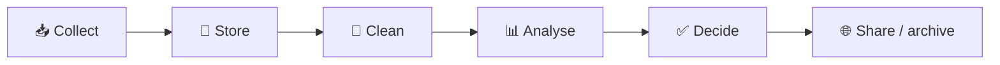
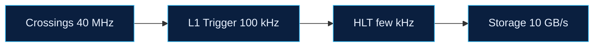

# Dr. Mindaugas Šarpis

# Best Research and Data Analysis Practices from CERN

## Introduction to Data

##### <span class="aims-badge">📁 data & files · ♻️ reproducibility</span>

<!--
Speaker: last time was the why — the films and CERN. Today is the what: data
itself. Start from their own day, then kinds of data, tables and files, then how
to find and document a dataset. CERN comes after that, as the case study, and
its example file closes the lecture and opens the seminar. (~2 min)
-->

---
hideInToc: true
layout: quote
---

# It is a capital mistake to theorize before one has **data**. Insensibly one begins to twist facts to suit theories, instead of theories to suit facts.
Sherlock Holmes — Arthur Conan Doyle, *A Scandal in Bohemia*

---
hideInToc: true
---

# Learning **Objectives**

<div class="note-text mt-sm">By the end of this lecture, you will be able to:</div>

<div class="stack-tight mt-sm">

<div class="card card-primary card-glass pad-compact">

🗂️ Spot the **datasets** in an ordinary day and sort them into the **four flavours**

</div>

<div class="card card-secondary card-glass pad-compact">

🔄 Walk a dataset through its **lifecycle** — collect, store, clean, analyse, decide, share — and say where it silently goes wrong

</div>

<div class="card card-accent card-glass pad-compact">

📋 Read a **table** — rows as observations, columns as variables — and say which **kind of variable** each column holds

</div>

<div class="card card-success card-glass pad-compact">

🌐 Find an **open dataset** and document it — portal, record, **DOI**, licence, provenance

</div>

<div class="card card-warning card-glass pad-compact">

⚛️ Trace how a **collision becomes a dataset** at CERN — detector, trigger, storage — and meet the **D⁰**

</div>

<div class="card card-info card-glass pad-compact">

📄 Read a real data file — **rows, columns, units, metadata** — before writing a line of code

</div>

</div>

<!--
Speaker: read these as promises. By the end they should know what a dataset
*is*, how a table is built, where to get one and how to write down where it came
from. The seminar right after this lecture puts the last two into practice. (~1 min)
-->

---
layout: section
hideInToc: true
---

# Data in **Your Life**

---
hideInToc: true
---

# A Day in Data — **Morning**

<div class="grid-2 mt-md gap-md">

<div class="card card-primary card-glass pad-tight">

## ⏰ **Before breakfast**

- Your phone logs the exact second the alarm went off
- A wearable scores how you slept — from heart rate and motion all night
- A weather app pushes a forecast computed from millions of sensor readings
- The battery graph has logged every charge and discharge of the past week

Ten minutes awake and you have already generated — and consumed — several datasets. None of it felt like "data".

</div>

<div class="card card-secondary card-glass pad-tight">

## 🚌 **The commute**

- A transit card taps in — a timestamp and a location, stored for years
- Maps reroutes you around traffic it inferred from other phones moving slowly
- Dozens of cameras log the same walk from different angles
- A playlist auto-queues songs a model predicts you'll keep

Each tap, ping, and skip is a row in someone's table — and the routing that helped you was itself built from yesterday's data.

</div>

</div>

---
hideInToc: true
---

# A Day in Data — **Afternoon to Lights-Out**

<div class="grid-2 mt-md gap-md">

<div class="card card-accent card-glass pad-tight">

## 💻 **Work & screens**

- Every click, scroll, and pause feeds product-analytics dashboards
- A shop's "customers also bought" is a live recommendation model
- Each card payment is scored for fraud in under a second
- Spam filters classify every message before you see it

Most of this analysis runs with no person in the loop: the ⚙️ automation and ♻️ reproducibility this course teaches. You notice it only when it fails.

</div>

<div class="card card-info card-glass pad-tight">

## 🌙 **Evening**

- A streaming service picks your thumbnail from thousands of A/B tests
- A run is logged as a GPS track, then compared to last month's pace
- A smart meter reports the day's electricity in fine-grained slices
- The cycle closes as the wearable starts scoring tonight's sleep

From alarm to lights-out you moved through hundreds of small analyses — almost all of them made by someone else, about you.

</div>

</div>

---
hideInToc: true
---

# Every One of These Is a **Dataset**

<div class="card card-success card-glass pad-tight mt-sm">

Behind each convenience is the same loop you'll learn to run in this course: **collect → store → clean → analyse → decide → share**. The recommendation, the forecast, the fraud alert — all of it is somebody's pipeline running on somebody's table.

</div>

<div class="grid-2 mt-md gap-md">

<div class="card card-primary card-glass pad-compact">

## 🔎 **Three questions for any app**

What does it **record**? In what **table** does that end up? Which **decision** does the result feed? Later today you ask the same of your own field.

</div>

<div class="card card-secondary card-glass pad-compact">

## 🎓 **What carries over**

The forecast, the playlist and the fraud check need the same four skills: organising files, writing code, statistics, reproducibility. Those are this course.

</div>

</div>

---
hideInToc: true
---

# What **Is** Data?

<div class="card card-info card-glass pad-tight mt-sm">

A working definition for this course: **data is recorded observation** — facts captured in a form a machine can store and re-read. The moment something is written down consistently enough to count, sort, or compare, it becomes data.

</div>

<div class="grid-2 mt-md gap-md">

<div class="card card-primary card-glass pad-compact">

## 📏 **It starts as a measurement**

A temperature, a timestamp, a momentum, a yes/no. On its own, one value says little.

</div>

<div class="card card-secondary card-glass pad-compact">

## 📚 **It becomes useful in bulk**

Thousands of those values, organised, show what one reading cannot: a trend, a spread, a peak.

</div>

</div>

---
hideInToc: true
---

# Data Has a **Lifecycle**


```mermaid {scale: 0.72}
graph LR
    C[📥 Collect] --> S[💾 Store]
    S --> K[🧹 Clean]
    K --> A[📊 Analyse]
    A --> D[✅ Decide]
    D --> H[🌐 Share / archive]
```

<div class="card card-info card-glass pad-compact mt-md">

The loop from two slides ago, drawn out. Every project — yours, a bank's, a physics collaboration's — walks it, and each answer raises fresh questions that restart it. This course spends a lecture or two on **each stage**; the seminars walk **your own dataset** through every stage of it.

</div>

<div class="note-text mt-sm">Most problems in practice come from skipping a stage: analysing before cleaning, or deciding before storing where the data came from.</div>

---
hideInToc: true
---

<MCQ
  question="Across a whole day — alarm, transit card, recommendations, fraud checks — what makes all of it 'data analysis' rather than magic?"
  :options="[
    'Each one runs the same loop: collect, store, clean, analyse, decide — then share or archive',
    'Collecting and storing the readings is itself the analysis — once data is saved, the work is done',
    'Behind each service, analysts review your raw activity streams and decide case by case',
    'Each device analyses its own data locally, so nothing needs to be stored or cleaned first'
  ]"
  :correct="0"
  explanation="However different the domains look, they share one pipeline — collect, store, clean, analyse, decide, share. Recognising that shared shape is the whole point of these opening lectures: the skills transfer because the loop is always the same."
/>

---
layout: section
hideInToc: true
---

# Kinds of **Data**

<!--
Speaker: from "data is everywhere" to telling one kind from another. Three new
ideas: the kind of variable, the shape of a table, the format of a file. (~1 min)
-->

---
hideInToc: true
---

# Structured vs **Unstructured**

<div class="grid-2 mt-md gap-md">

<div class="card card-primary card-glass pad-tight">

## 📊 **Structured**

Lives in neat rows and columns — a table, a spreadsheet, a database. Each column has a meaning and a type.

- Sensor logs, transaction records, survey answers
- Easy to sort, filter, and compute on directly
- **Most of this course lives here** — the tidy table

</div>

<div class="card card-secondary card-glass pad-tight">

## 🌀 **Unstructured**

Free-form — text, images, audio, video. Rich, but a computer can't average it until you extract structure first.

- Emails, photos, recordings, PDFs
- Needs a step to turn it into numbers or labels
- Most machine learning works on this kind of data

</div>

</div>

<div class="note-text mt-md">The first real job of many projects is turning the second kind into the first.</div>

---
hideInToc: true
---

# Four **Flavours** of Data

<div class="grid-2 mt-md gap-md">

<div class="card card-primary card-glass pad-compact">

## 🔢 **Numbers**

Measurements you can add, average, and plot. The core of statistics and fitting.

</div>

<div class="card card-secondary card-glass pad-compact">

## 🔤 **Text**

Labels, categories, free comments. Countable once you decide what to count.

</div>

<div class="card card-accent card-glass pad-compact">

## 🖼️ **Images**

Grids of pixels, each pixel a number. Most image analysis today is machine learning.

</div>

<div class="card card-info card-glass pad-compact">

## ⚡ **Events**

Timestamped things that happened — a click, a tap, a particle collision.

</div>

</div>

<div class="note-text mt-md">A particle-physics analysis is built from <strong>events</strong> (collisions) that we turn into <strong>numbers</strong> (a mass) — two flavours in one pipeline.</div>

---
hideInToc: true
---

# Kinds of **Variables**

<div class="grid-2 mt-md gap-md">

<div class="card card-primary card-glass pad-compact">

## 📏 **Quantitative — continuous**

Any value in a range: a temperature of 21.4 °C, a mass of 1864.8 MeV. You can average it.

</div>

<div class="card card-secondary card-glass pad-compact">

## 🧮 **Quantitative — discrete**

Counts: goals scored, tracks in a collision. Whole numbers; you can still average them.

</div>

<div class="card card-accent card-glass pad-compact">

## 🏷️ **Categorical — nominal**

Labels with no order: city, blood group, particle type. You can count them, not average them.

</div>

<div class="card card-info card-glass pad-compact">

## 📶 **Categorical — ordinal**

Labels with an order: exam grades, low / medium / high. You can rank them; the size of a step is not defined.

</div>

</div>

<div class="note-text mt-md">Dates, postcodes and ID numbers look like numbers and are not: the average of two postcodes means nothing. The kind of variable decides which plot and which statistic make sense.</div>

<!--
Speaker: ask the Excel users which kind each column of a spreadsheet they know is.
The kind of variable returns in Lecture 9 (which summary), Lecture 10 (which plot)
and Lecture 11 (which distribution). (~2 min)
-->

---
hideInToc: true
---

# Measurement vs **Metadata**

<div class="grid-2 mt-md gap-md">

<div class="card card-primary card-glass pad-tight">

## 📐 **The measurement**

The number you care about — the temperature, the price, the particle's momentum. The reason the record exists at all.

</div>

<div class="card card-secondary card-glass pad-tight">

## 🏷️ **The metadata**

Data *about* the measurement — when, where, by which instrument, in what units, under what settings.

</div>

</div>

<div class="card card-warning card-glass pad-compact mt-md">

## ⚠️ **Metadata is not optional** 📁 ♻️

A momentum with no units, a reading with no timestamp, a file with no source — that's a number you can neither trust nor reproduce. Much of data work is keeping the metadata attached to the numbers.

</div>

---
hideInToc: true
---

# Anatomy of a **Table**

| **station** | **time** | **temp_C** | **pressure_hPa** | **sky** |
| --- | --- | --- | --- | --- |
| Vilnius | 2026-09-29 08:00 | 11.2 | 1018.4 | cloudy |
| Vilnius | 2026-09-29 09:00 | 12.0 | 1018.1 | cloudy |
| Kaunas | 2026-09-29 08:00 | 11.9 | 1017.6 | rain |

<div class="grid-3 mt-md gap-md">

<div class="card card-primary card-glass pad-compact">

## ➡️ **A row**

One observation: one station at one hour. Everything in the row belongs to that observation.

</div>

<div class="card card-secondary card-glass pad-compact">

## ⬇️ **A column**

One variable, of one kind, in one unit. `temp_C` is continuous; `sky` is nominal.

</div>

<div class="card card-accent card-glass pad-compact">

## 🔲 **A cell**

One value. Not "11.2 °C (approx.)", not two readings, not a colour that carries meaning.

</div>

</div>

<div class="note-text mt-sm">Illustrative values. A table that keeps these three rules is called <strong>tidy</strong>, and every tool in this course expects it.</div>

<!--
Speaker: the table is made up for the slide. Point out that the unit sits in the
column name because a CSV file has nowhere else to put it. Ask: what is one row
in a spreadsheet you use? (~2 min)
-->

---
hideInToc: true
---

# One Table, Three **Files**

<div class="grid-3 mt-md gap-md">

<div class="card card-primary card-glass pad-compact">

## 📄 **CSV — plain text**

- One line per row, values separated by commas
- Opens in any program, on any system
- Stores no types and no units: `11.2` is just four characters

</div>

<div class="card card-secondary card-glass pad-compact">

## 📗 **Spreadsheet — .xlsx**

- The table plus formatting, formulas, several sheets
- The program decides how a value is shown and stored
- Excel turned gene names such as `SEPT2` into dates so often that geneticists renamed the genes in 2020

</div>

<div class="card card-accent card-glass pad-compact">

## 📦 **Binary — ROOT, HDF5, Parquet**

- Compact and fast, with a type for every column
- Readable only by a program that knows the format
- What large experiments and data services use

</div>

</div>

<div class="card card-warning card-glass pad-compact mt-md">

⚠️ **Decimal comma or decimal point?** `1,5` and `1.5` are the same number written in two countries. A CSV file does not say which one it uses. You will see what that does to a spreadsheet in the seminar after this lecture.

</div>

<!--
Speaker: this slide sets up the seminar's central comparison — the same CSV opened
in VS Code and in a spreadsheet. Lecture 3 goes into bytes and encodings. (~2 min)
-->

---
hideInToc: true
---

# Where Each Flavour Shows Up **Later**

| **Flavour** | **What you learn to do with it** | **Where** |
| --- | --- | --- |
| 🔢 Numbers | Summarise, visualise, fit, report ± an error | L10–L12 · S10–S12 |
| 🔤 Text | Parse a line; code and count categories | L07–L08 · S7–S8 |
| 🖼️ Images | Pixels as arrays, then a classifier | L13 · L16 |
| ⚡ Events | Turn one collision into a number (a mass) | here, L09–L12 |
| 📁 …and their files | Read, name, and organise safely | L03–L05 · S3–S5 |

<div class="note-text mt-md">Nothing to memorise: the last column says in which weeks you work with each flavour yourself.</div>

---
hideInToc: true
---

# Thought Exercise — Data in **Your Field**

<div class="grid-2 mt-md gap-md">

<div class="card card-primary card-glass pad-tight">

## 🤔 **Think** (2 min)

Pick a project, hobby, or job you know well.

- What data gets generated?
- Who collects it, and how?
- What decisions does it inform?

</div>

<div class="card card-secondary card-glass pad-tight">

## 💬 **Discuss** (3 min)

Share with a neighbour:

- What is one decision that could be improved if the data were better collected, stored, or analysed?
- What would "good enough" data analysis look like in your context?

</div>

</div>

<div class="card card-accent card-glass pad-tight mt-md">

## 🎯 **Takeaway**

Keep your answer. The data you just described is a candidate for Seminar 2 today, and for your semester project.

</div>

---
hideInToc: true
---

# Data at Work — **Biomedicine, Environment, Finance**

<div class="grid-3 mt-md gap-md">

<div class="card card-primary card-glass pad-compact">

## 🧬 **Biomedicine**

- Genome sequencing → variants, gene expression
- Clinical trials → safety, efficacy, adaptive designs
- Decisions: diagnostics, targeted therapies

🧪 <strong>23andMe</strong> went bankrupt in 2025 and its genetic database changed hands in the proceedings. The customers' consent went with it.

</div>

<div class="card card-accent card-glass pad-compact">

## 🌍 **Environment**

- Climate models fed by satellites, sensors, archives
- Pollution monitored at city-block resolution
- Decisions: policy, disaster response, conservation

🔄 Data feeds update the models continuously. The result is a pipeline that keeps running, not one final number.

</div>

<div class="card card-secondary card-glass pad-compact">

## 💰 **Finance**

- Algorithmic trading under latency constraints
- Risk: stress tests, scenario analysis, VaR
- Fraud detection on streaming transactions

📉 Every participant models the other participants. A pattern found in past data stops working once people trade on it.

</div>

</div>

---
hideInToc: true
---

# Data at Work — **Astronomy & Particle Physics**

<div class="grid-2 mt-md gap-md">

<div class="card card-primary card-glass pad-tight">

## 🔭 **Astronomy**

- Observational data from telescopes, satellites, detectors
- Gravitational wave detection via signal processing & ML
- Cataloguing millions of celestial objects, anomaly detection
- Requires high-throughput computing, reproducible pipelines

🤖 <strong>Galaxy Zoo</strong> crowdsourced classifications of ~1M galaxies from SDSS images — the labelled set that seeded today's CNN galaxy-morphology classifiers.

</div>

<div class="card card-accent card-glass pad-tight">

## ⚛️ **Particle physics (CERN)**

- Petabytes of collision data → reconstruct events, filter noise
- Multivariate analysis to isolate rare signals (e.g. Higgs boson)
- Collaboration across detectors, theory, computing teams
- Drives advances in distributed computing & open data practices

🔬 <strong>The lectures' example comes from here</strong>: open LHCb collision data, published by the collaboration itself.

</div>

</div>

---
hideInToc: true
---

# Common **Threads** Across Every Domain

<div class="grid-3 gap-md mt-md">

<div class="card card-primary card-glass pad-compact">

## 🎯 **A decision comes first**

Which therapy, which trade, which collision to keep: the analysis is built around a decision someone has to make.

</div>

<div class="card card-secondary card-glass pad-compact">

## 📐 **Uncertainty is stated**

A forecast gives a range, a risk model a probability, a mass measurement a ± error.

</div>

<div class="card card-accent card-glass pad-compact">

## 🔄 **The analysis gets rerun**

New data keeps arriving, so the work has to be a pipeline that runs again, not a calculation done once by hand.

</div>

<div class="card card-info card-glass pad-compact">

## 🤝 **The work is shared**

Domain expert, analyst, engineer, decision-maker: each sees one part of the problem.

</div>

<div class="card card-success card-glass pad-compact">

## ⚖️ **Rules grow with the stakes**

Data on health, policy and money comes with consent, audits and regulation.

</div>

<div class="card card-warning card-glass pad-compact">

## 📖 **It has to be explained**

A number changes a decision only once the person deciding understands what it says.

</div>

</div>

<div class="note-text mt-md">🔍 Which of these examples is closest to your own field?</div>

---
layout: section
hideInToc: true
---

# Open Data & **Provenance**

<!--
Speaker: shift gears — from *what data is* to *where you get it and how you prove
where it came from*. Seminar 2 practises this on the example file; at home they
repeat it on a dataset of their own choice. (~1 min)
-->

---
hideInToc: true
---

# Open-Data **Portals**

<div class="grid-3 mt-md gap-md">

<div class="card card-primary card-glass pad-compact">

## 🔬 **Physics & space**

- **CERN Open Data Portal** — LHC collision data, masterclass samples
- **NASA** open data & the Planetary Data System
- **ESA** archives — Gaia, Euclid, Webb

</div>

<div class="card card-secondary card-glass pad-compact">

## 🌍 **Society & environment**

- **Eurostat** and national statistics offices
- **Copernicus / ECMWF** — weather and climate
- **World Bank, OECD, WHO** indicators

</div>

<div class="card card-accent card-glass pad-compact">

## 📚 **Any field**

- **Zenodo** — upload anything, get a DOI
- **Kaggle**, **Hugging Face** datasets
- Your university's research repository

</div>

</div>

<div class="card card-info card-glass pad-compact mt-md">

🔗 A portal is a **catalogue**: every dataset on it is a **record** with a stable address. You cite the record, not the file you happened to download.

</div>

---
hideInToc: true
---

# Anatomy of a **Record**

<div class="grid-2 mt-md gap-md">

<div class="card card-primary card-glass pad-compact">

## 🧾 **What every record carries**

- **Title** and authors / collaboration
- A **persistent identifier** — the DOI resolves forever, even if the portal moves
- **Licence** — what you may do with it
- **Files** with sizes and **checksums**
- **Description** — how the data was produced and selected
- **Version** and date

</div>

<div class="card card-accent card-glass pad-compact">

## ⚛️ **Record 401 — today's example**

- *LHCb event file for real measurement*
- DOI `10.7483/OPENDATA.LHCb.E7EJ.JUWR`
- Licence **CC0** — no conditions
- One **ROOT** file, 1.3 MB — particle decays recorded by LHCb at CERN
- Downloadable by anyone — no CERN account needed
- The workbook keeps a **CSV converted from it** — a derived file, and documented as one

</div>

</div>

<div class="card card-success card-glass pad-compact mt-md">

✅ Reading the record *before* the data answers the questions you would otherwise ask the file: what is one row, which selection was applied, what am I allowed to publish.

</div>

---
hideInToc: true
---

# Licences — What "Open" **Actually Permits**

<div class="grid-3 mt-md gap-md">

<div class="card card-success card-glass pad-compact">

## 🆓 **CC0**

No conditions at all — reuse, remix, republish. *CERN Open Data; NASA imagery is public domain, which amounts to the same.*

</div>

<div class="card card-primary card-glass pad-compact">

## 🏷️ **CC BY**

Do anything, but **credit the source**. *ESO and NOIRLab material.*

</div>

<div class="card card-warning card-glass pad-compact">

## 🔁 **Share-alike (ODbL, CC BY-SA)**

Derived datasets must stay **equally open**. *OpenStreetMap; most ESA imagery (CC BY-SA IGO).*

</div>

</div>

<div class="card card-info card-glass pad-compact mt-md">

⚠️ **Open to read ≠ open to redistribute.** Some portals let you download but not re-host. Check the licence *before* the dataset lands in a public GitHub repository — and before you publish a table derived from it.

</div>

---
hideInToc: true
---

# Provenance — **Write Down Where It Came From**

<div class="grid-2 mt-md gap-md">

<div class="card card-primary card-glass pad-compact">

## 📝 **The minimal provenance note**

- Portal + **record ID** and **DOI**
- **Licence**
- **Date** you fetched it (and record version)
- File names and their **checksums**
- What you did to it so far — *nothing* is a valid answer

</div>

<div class="card card-secondary card-glass pad-compact">

## 📄 **As it looks in a README**

```text
Source:   CERN Open Data Portal, record 401
DOI:      10.7483/OPENDATA.LHCb.E7EJ.JUWR
Licence:  CC0
Fetched:  2026-09-29
Files:    MasterclassData.root  sha256 8694…039b
Changes:  none — D0_KPi.csv is a converted copy
```

</div>

</div>

<div class="card card-info card-glass pad-compact mt-md">

♻️ Reproducibility starts **before** the analysis: someone else — or you in six months — must be able to fetch the **same bytes**. The checksum is how you prove it.

</div>

---
hideInToc: true
---

# Data You **Bring Yourself**

<div class="grid-2 mt-md gap-md">

<div class="card card-accent card-glass pad-compact">

## 🎒 **Same discipline, your dataset**

- Where it came from — URL, instrument, survey, colleague
- Under what terms you may use and publish it
- A **snapshot**: the file exactly as received, plus its checksum
- The date — web data changes under you

</div>

<div class="card card-warning card-glass pad-compact">

## 🔒 **Personal or sensitive data**

- Anonymise before it enters a repository
- Never commit raw personal data to git — public or private
- If in doubt: describe the data in the project, keep the file out of it

</div>

</div>

<div class="card card-success card-glass pad-compact mt-md">

🎯 Your semester project is on data of **your** choice — this checklist is what makes that choice safe to build on.

</div>

---
hideInToc: true
---

# From Record to **Your Repo**

<div class="card card-primary card-glass pad-compact mt-sm">

## 🧭 **The path Seminar 2 starts**

1. **Find** your dataset's record on its portal (or the source, if there is no portal)
2. **Read** the record — title, DOI, licence, description
3. **Download** into `data/raw/` of your project folder, without renaming
4. **Write** the provenance note into the README
5. **Checksum** the file — a fingerprint of its bytes *(from week 4)*
6. **Commit the note** — and the data only if it is small *and* the licence allows it *(from week 6)*

</div>

<div class="card card-info card-glass pad-compact mt-md">

📁 Large or restricted data stays out of git; the README says exactly how to fetch it again. That is the difference between "I have the data" and "the analysis is reproducible".

</div>

---
hideInToc: true
---

<MCQ
  question="You downloaded a CSV from a data portal six months ago and now want to cite it in your project so that a reader can get exactly the same data. What must you have recorded?"
  :options="[
    'The record\'s DOI or stable URL, the version or fetch date, and the file\'s checksum',
    'The file name, its size in bytes, and the folder you saved it into on your laptop',
    'The portal\'s homepage URL, the dataset\'s title, and the name of the collaboration',
    'The name and e-mail of the colleague who first told you about the dataset'
  ]"
  :correct="0"
  explanation="A DOI or stable record URL identifies the dataset independently of where the file sits today; the version or fetch date pins which release you used; the checksum proves the bytes are unchanged. Name and size can collide; a homepage plus a title can move or change silently, and a person's memory cannot be resolved to exact bytes."
/>

---
layout: section
hideInToc: true
---

# The LHC **Experiments**

The case study. One accelerator, four detectors: ATLAS, CMS, ALICE, LHCb.

<!--
Speaker: the CERN case study starts here; everything before it was general. Each
experiment gets one slide and a silent 3D fly-in from the ring to its detector —
talk over the clips. LHCb gets the longest stop because today's example file
comes from it. (~1 min)
-->

---
hideInToc: true
---

# <span class="gradient-text">ATLAS</span> & <span class="gradient-text">CMS</span>

<div class="card card-info card-glass pad-compact mt-sm">

🔭 Two **general-purpose** detectors. Same physics programme: the Higgs boson, searches for new particles. **Different designs**.

</div>

<div class="grid-2 mt-md gap-md">

<div class="card card-primary card-glass pad-tight">

## 🏟️ **ATLAS**

- The **largest** collider detector ever built
- **46 m** long, **25 m** in diameter, 100 m underground
- ~**7,000 tonnes**, ~100 million readout channels

</div>

<div class="card card-secondary card-glass pad-tight">

## 🧲 **CMS**

- One superconducting **solenoid** magnet, **3.8 T**
- **21 m** long, **15 m** in diameter
- **14,000 tonnes**: half the size of ATLAS, twice the weight

</div>

</div>

<div class="card card-success card-glass pad-compact mt-md">

🤝 On **4 July 2012** both announced the Higgs **independently, on the same day**. The LHC was built with two general-purpose detectors so that each result can be checked by the other.

</div>

---
hideInToc: true
---

<VideoPlayer src="cern_footage_2022_042_003.mp4" />

<!-- ATLAS — 3D fly-in from the LHC ring to the detector (0:38, silent). -->

---
hideInToc: true
---

<VideoPlayer src="cern_footage_2022_042_002.mp4" />

<!-- CMS — 3D fly-in from the LHC ring to the detector (0:39, silent). -->

---
hideInToc: true
---

<VideoPlayer src="ATLAS-VIDEO-2021-001-001-1080p.mp4" />

<!-- ATLAS on film — model, cavern, control room (0:49). -->

---
hideInToc: true
---

# <span class="gradient-text">ALICE</span> — Quark–Gluon Plasma

<div class="grid-2 mt-md gap-md">

<div class="card card-primary card-glass pad-tight">

## 💥 **The Question**

What was matter like in the first **millionths of a second** after the Big Bang, before protons and neutrons existed?

</div>

<div class="card card-secondary card-glass pad-tight">

## 🌡️ **The Method**

Collide **lead nuclei** instead of protons. For an instant the collision forms **quark–gluon plasma**, over **100,000×** hotter than the core of the Sun.

</div>

</div>

<div class="card card-accent card-glass pad-compact mt-md">

📈 One lead–lead collision can produce **tens of thousands** of particle tracks. Software has to reconstruct every one of them before any physics is done.

</div>

---
hideInToc: true
---

<VideoPlayer src="QGP_Formation.mp4" />

<!-- Quark–gluon plasma forming (0:33) — ALICE's physics. -->

---
hideInToc: true
---

<VideoPlayer src="cern_footage_2022_042_004.mp4" />

<!-- ALICE — 3D fly-in from the LHC ring to the detector (1:10, silent). -->

---
hideInToc: true
---

# <span class="gradient-text">LHCb</span> — Matter and Antimatter

<div class="card card-primary card-glass pad-tight mt-sm">

## ⚖️ **The Question**

The Big Bang should have produced matter and antimatter in **equal amounts**, yet the universe is made of matter. LHCb measures the small **asymmetries** between the two (*CP violation*).

</div>

<div class="grid-2 mt-md gap-md">

<div class="card card-secondary card-glass pad-compact">

## 🔬 **The Method**

Precision measurements of **beauty** and **charm** quark decays, in a forward detector whose sensors sit **millimetres** from the beam

</div>

<div class="card card-warning card-glass pad-compact">

## 🏆 **A 2019 First**

LHCb observed **CP violation in charm**, in decays of the **D⁰ meson**: the particle in today's example file.

</div>

</div>

<div class="card card-info card-glass pad-compact mt-md">

🧭 The asymmetries measured so far are **far too small** to account for the matter in the universe. The question is open.

</div>

---
hideInToc: true
---

<VideoPlayer src="cern_footage_2022_042_001.mp4" />

<!-- LHCb — 3D fly-in from the LHC ring to the detector (0:56, silent). -->

---
hideInToc: true
---

<VideoPlayer src="LHCb.mp4" />

<!-- LHCb reel (0:47) — where the example file comes from. -->

---
layout: section
hideInToc: true
---

# Data at the **LHC**

<!--
Speaker: from the detectors to what they produce: 1 PB/s of raw output, of which
almost nothing is signal. The rest of the section is how that becomes a dataset
someone can analyse. (~1 min)
-->

---
hideInToc: true
---

# Why <span class="gradient-text">Data Analysis</span> Matters at CERN

<div class="grid-2 mt-md gap-md">

<div class="card card-primary card-glass pad-tight reveal-scale">

## 📊 **The Scale**

- The LHC produces **~1 PB per second** of raw detector output
- Only **~1 in a billion** collisions contains interesting physics
- Must filter, reconstruct, and analyse in near real-time
- Finding the Higgs required sifting through **trillions** of events

</div>

<div class="card card-secondary card-glass pad-tight reveal-scale">

## 🔍 **Signal vs Background**

- Collision events produce **detector readings** (energy, momentum, position)
- Signal events look almost identical to background noise
- Statistical methods decide if a discovery is **real or a fluctuation**
- The 5-sigma standard: if there were **no new particle**, a background fluctuation this strong would appear in fewer than **1 in 3.5 million** experiments — *Lecture 11 (Probability & Statistics) makes this precise*

</div>

</div>

<div class="card card-accent card-glass pad-compact mt-md glow">

💾 **Data Pipeline:** Raw detector signals &#8594; Trigger selection (real-time filtering) &#8594; Event reconstruction &#8594; Physics analysis &#8594; Statistical inference &#8594; Publication

<div class="mt-sm" style="font-size: 0.85em; opacity: 0.85;">

Each stage is a skill from this course, from handling files to statistical inference.

</div>

</div>

---
hideInToc: true
---

<div class="note-text">

*A check on the previous slide. Professionals get this one wrong too.*

</div>

<MCQ
  question="The Higgs discovery met the '5-sigma' standard. What does that actually mean?"
  :options="[
    'There is less than a one-in-3.5-million chance that the discovery itself is wrong',
    'With no new particle, a background fluke this strong shows up in fewer than 1 in 3.5 million experiments',
    'The Higgs mass was pinned down to five decimal places by combining ATLAS and CMS',
    'Five independent detectors each confirmed the signal at the same mass on the same day'
  ]"
  :correct="1"
  explanation="5 sigma limits how often pure background fakes a signal this strong — not the chance the discovery is wrong (option one's misreading). Lecture 11 (Probability & Statistics) makes this precise."
/>

<style>
.mcq-container { height: calc(100% - 3.5rem) !important; }
</style>

---
hideInToc: true
---

# From Collision to <span class="gradient-text">Dataset</span>

<div class="card card-info card-glass pad-compact mt-sm">

🚦 Nothing can store 1 PB **every second**, so the experiments decide **in real time** which collisions to keep. This selection is the **trigger**. It discards almost everything, within microseconds.

</div>

<div class="stack-tight mt-md">

<div class="card card-primary card-glass pad-compact reveal-left">

💥 **~40 million bunch crossings** per second inside each detector — and a crossing is not a collision: each packs **dozens of overlapping proton–proton collisions**, about **1 billion collisions per second** in all

</div>

<div class="card card-secondary card-glass pad-compact reveal-left">

⚡ **Level-1 trigger** — custom electronics decide in **microseconds** → ~**100,000** events/s survive

</div>

<div class="card card-accent card-glass pad-compact reveal-left">

🖥️ **High-Level Trigger** — a computing farm inspects the full event → a few **thousand** events/s written to storage

</div>

<div class="card card-success card-glass pad-compact reveal-left">

💾 Only these events become the **datasets** physicists analyse: fewer than **one collision in a hundred thousand** is stored

</div>

</div>

<div class="card card-warning card-glass pad-compact mt-md reveal-up">

⚠️ A trigger decision is **final**: a discarded collision cannot be recovered. Deciding what to keep is itself data analysis.

</div>

---
hideInToc: true
---

<VideoPlayer src="cern_video_2015_024_001.mp4" />

<!-- The whole data flow in one clip (2:51, music): accelerator chain, detectors, trigger levels, data centre, the grid. -->

---
hideInToc: true
---

# From Events to <span class="gradient-text">Petabytes</span>

<div class="card card-info card-glass pad-compact mt-sm">

🧮 The same chain in numbers, from one **event** to one **year** of data.

</div>

<div class="mt-md" style="text-align: center;">


```mermaid {scale: 0.85}
graph LR
    A[Crossings 40 MHz] --> B[L1 Trigger 100 kHz]
    B --> C[HLT few kHz]
    C --> D[Storage 10 GB/s]

    classDef stage fill:#0a1f3f,stroke:#38bdf8,color:#e8f1ff;
    class A,B,C,D stage;
```

</div>

<div class="grid-2 mt-md gap-md">

<div class="card card-accent card-glass pad-compact">

## 📦 **The Arithmetic**

**~1–2 MB** per event × a few **thousand** events/s ≈ **10 GB/s** to disk and tape; × ~**10⁷ s** of beam per year ≈ **100+ PB per year**. One analysis uses a tiny part of that: today's example file is 1.3 MB.

</div>

<div class="card card-secondary card-glass pad-compact">

## 💻 **LHCb, Since Run 3**

No hardware trigger at all: every crossing — **30 million per second** — is read out in full and judged by a **software trigger** (its first stage on GPUs). That is the detector behind today's example dataset.

</div>

</div>

---
hideInToc: true
---

# Why It Has to Be <span class="gradient-text">Real-Time</span>

<div class="card card-info card-glass pad-compact mt-sm">

🎯 **Why not store everything?** Nothing can *write* 1 PB every second, and the detector cannot wait: the keep/discard decision has to be made in **microseconds**.

</div>

<div class="grid-2 mt-md gap-md">

<div class="card card-primary card-glass pad-compact">

## ⏱️ **25 ns Between Crossings**

Bunches cross every **25 nanoseconds**. The next collisions arrive long before any software has finished judging the last ones.

</div>

<div class="card card-secondary card-glass pad-compact">

## 📦 **A Few Microseconds of Memory**

The detector electronics can hold an event for only a few **microseconds**. If the first trigger level has not said "keep" by then, it is overwritten.

</div>

</div>

<div class="card card-success card-glass pad-compact mt-md">

🔍 **What the trigger looks for:** a few high-energy leptons or jets, missing energy — or, at LHCb, tracks that **don't point back** to the collision, because a D⁰ flies a few millimetres before it decays. The selection is code, written before anyone sees the data.

</div>

---
hideInToc: true
---

<MCQ
  question="The detector electronics put out ~1 PB of raw signal per second, before any selection. Why can't the experiments simply record it all?"
  :options="[
    'There is no scientific reason to — only a handful of processes matter',
    'No real-time system can write ~1 PB/s to disk, even before counting the cost',
    'Data-protection rules cap how much CERN is legally allowed to store',
    'Only high-luminosity runs need a trigger — earlier runs recorded everything'
  ]"
  :correct="1"
  explanation="No storage system can sustain ~1 PB/s of writes. The trigger reduces the raw output to the few thousand events/s (~10 GB/s) that computing can absorb, before anyone judges what is interesting."
/>

---
hideInToc: true
---

# Careers at <span class="gradient-text">CERN</span>

<div class="card card-info card-glass pad-compact mt-sm">

👥 Of CERN's few thousand **staff**, most are engineers and technicians. The 17,000 scientists it hosts are mostly visiting **users** from institutes worldwide.

</div>

<div class="grid-3 mt-md gap-md">

<div class="card card-primary card-glass pad-tight">

## 🧑‍🔬 **Physicists**

Design analyses and separate signal from background. Day to day that is statistics and code, mostly Python and C++.

</div>

<div class="card card-secondary card-glass pad-tight">

## 🛠️ **Engineers**

Build and maintain the accelerators, magnets, cryogenics and detectors.

</div>

<div class="card card-accent card-glass pad-tight">

## 💻 **Computing Specialists**

Keep 170+ grid sites, trigger farms, and petabyte storage running around the clock.

</div>

</div>

---
hideInToc: true
---

# Working with the <span class="gradient-text">Data</span>

<div class="grid-2 mt-md gap-md">

<div class="card card-accent card-glass pad-tight">

## 🔎 **The Analyst**

Takes last night's events, checks that the D⁰ peak has not moved, reports anything odd to the shift crew, pushes a fix to the shared analysis code. All on a laptop, anywhere in the world.

</div>

<div class="card card-secondary card-glass pad-tight">

## 🌙 **The Shift Crew**

Watches the same peak on a live monitoring plot in the control room. If a sub-detector or the trigger farm fails, the histogram shows it, and the night's data is marked good or bad for everyone who uses it later.

</div>

</div>

<div class="card card-info card-glass pad-compact mt-md">

🌍 Neither job is done next to the detector. Both need the skills of this course: files, code, version control, statistics.

</div>

---
layout: section
hideInToc: true
---

# Beyond **Physics**

Built at CERN to handle its own data, now used everywhere: the Web, the computing grid, open data, open publishing.

<!--
Speaker: section break. Everything so far was about the experiments; this section
is about what CERN had to build to run them and that others now use. Ask which
CERN invention they used today — the answer is the Web, every one of them. (~1 min)
-->

---
hideInToc: true
---

# CERN's Impact Beyond Physics

<div class="grid-2 mt-md gap-md">

<div class="card card-info card-glass pad-compact">

## 🌐 **The World Wide Web**

Invented at CERN by **Tim Berners-Lee** in **1989** to share data between scientists. Now used by **5+ billion** people.

</div>

<div class="card card-success card-glass pad-compact">

## 🖥️ **Computing Grid (WLCG)**

The **Worldwide LHC Computing Grid** connects **170+ centres** in **40+ countries** and stores **hundreds of petabytes** of new data every year

</div>

<div class="card card-warning card-glass pad-compact">

## 🏥 **Medical Applications**

Accelerator technology is used in **hadron therapy** for cancer, which is more precise than conventional radiotherapy

</div>

<div class="card card-accent card-glass pad-compact">

## 📂 **Open Science**

The CERN **Open Data Portal** publishes real collision data for teaching and independent research

</div>

</div>

<div class="card card-secondary card-glass pad-compact mt-md">

📖 **Open publishing:** CERN co-founded **SCOAP3**, which makes almost all particle-physics journal articles free to read. Preprints appear on **arXiv** before any journal sees them.

</div>

---
hideInToc: true
---

# The LHC Computing <span class="gradient-text">Grid</span>

<div class="card card-info card-glass pad-compact mt-sm">

🌍 No single data centre can process the LHC's output. The work is spread over a **tiered global grid** *(as of 2026: 170+ sites, 42 countries, ~1.4 million CPU cores)*.

</div>

<div class="stack-tight mt-md">

<div class="card card-primary card-glass pad-compact reveal-left">

🏛️ **Tier 0 — CERN** · the custodial copy of all raw data on tape, first-pass reconstruction

</div>

<div class="card card-secondary card-glass pad-compact reveal-left">

🏢 **Tier 1 — ~15 national labs** · second copies, large-scale reprocessing, round-the-clock links to CERN

</div>

<div class="card card-accent card-glass pad-compact reveal-left">

🏫 **Tier 2 — ~150 universities** · simulation and the everyday analyses of individual physicists

</div>

</div>

<div class="card card-success card-glass pad-compact mt-md reveal-up">

💡 A physicist who starts an analysis usually does not know **in which country** the jobs run. The same idea at your scale: compute where convenient, keep the data organised and portable. **Lecture 15 (Computing Infrastructure & HPC)** covers the grid in full.

🔭 What comes next: the **Future Circular Collider (FCC)** feasibility study, reported in **2025**, proposes a 91 km ring, more than three times the LHC's 27 km.

</div>

---
hideInToc: true
---

<MCQ
  question="CERN publishes its collision data on the Open Data Portal years after recording it. Which stage of the data lifecycle is that, and what makes it possible?"
  :options="[
    'Collecting — the detector writes each stored event straight to the public portal',
    'Cleaning — the trigger decides at run time which events are fit for publication',
    'Sharing — the last stage, possible only because provenance, formats and software were kept',
    'Analysing — physicists publish their plots, and the plots are the open data'
  ]"
  :correct="2"
  explanation="Publication is the share stage at the end of the lifecycle. It only works because every earlier stage kept the metadata: how events were selected, which software version processed them, what the columns mean. Skip that in your own project and the last stage becomes impossible."
/>

---
layout: section
hideInToc: true
---

# A Dataset **Up Close**

<!--
Speaker: now open the example file, conceptually — no code yet. It is the file the
seminar starts with. Apply the table and variable slides from earlier to it. (Pass 2 of the reel adds a 2:28 LHCb
decay animation as the opener of this section.) (~1 min)
-->

---
hideInToc: true
---

# From File to **Table**

<div class="grid-2 mt-md gap-md">

<div class="card card-primary card-glass pad-compact">

## 📄 **The LHCb sample as a file**

- One **header line** naming the columns
- **91 583** lines after it — the record says "about 60k events"; count for yourself
- Each **row** = one **candidate**: a K⁻π⁺ pair from one collision that might be a D⁰
- Each **column** = one quantity computed for that pair — four in all

</div>

<div class="card card-accent card-glass pad-compact">

## 🧮 **What a row says**

"In this collision we found a kaon and a pion that may have come from one D⁰: their combined mass is *M*, the pair's transverse momentum *PT*, it flew for a time *TAU* before decaying, and *IPCHI2* says how well it points back to the collision."

</div>

</div>

<div class="card card-info card-glass pad-compact mt-md">

💾 The file is plain text. Lecture 3 looks at its bytes and Seminar 3 counts them. Today we read what it **means**.

</div>

---
hideInToc: true
---

# Columns, Units and **Meaning**

<div class="grid-3 mt-md gap-md">

<div class="card card-primary card-glass pad-compact">

## 📏 **Measured**

Track momenta, charges, particle-ID scores — what the detector recorded. The ROOT file names these columns but ships them **empty**.

</div>

<div class="card card-secondary card-glass pad-compact">

## 🧮 **Derived**

Computed from the tracks: invariant mass `M`, transverse momentum `PT`, decay time `TAU`, `IPCHI2` — the **four columns that are filled**.

</div>

<div class="card card-accent card-glass pad-compact">

## 🗂️ **Bookkeeping**

Event and run numbers — which collision, which data-taking period. Emptied here too; keep them in your own data.

</div>

</div>

<div class="card card-warning card-glass pad-compact mt-md">

⚠️ **Units are metadata.** A column named `M` means nothing until you know it is in MeV/c². Here neither the file nor the record says — you work it out (a D⁰ weighs 1865 MeV/c²) and write it into your README.

</div>

---
hideInToc: true
---

# Read Before You **Compute**

<div class="card card-primary card-glass pad-compact mt-sm">

## ❓ **Five questions for any data file**

1. How many **rows** and **columns** — and does the size make sense for that?
2. What is **one row** — an event, a person, an hour, a pixel?
3. Which columns are **measured**, which **derived**, which **bookkeeping**?
4. What are the **units** — and where is that written down?
5. How are **missing** or invalid values marked — blank, `NaN`, `-999`? *(This file: `TAU = -100`.)*

</div>

<div class="card card-success card-glass pad-compact mt-md">

✅ Answer these on paper before the first line of code; Seminar 2 asks you to do exactly this for your dataset.

</div>

---
hideInToc: true
---

# Same Questions, **Your** Dataset

<div class="grid-3 mt-md gap-md">

<div class="card card-primary card-glass pad-compact">

## 🌦️ **Weather station CSV**

Row = one hour · columns = temperature °C, pressure hPa, humidity % · derived: daily mean.

</div>

<div class="card card-secondary card-glass pad-compact">

## 📋 **Survey microdata**

Row = one respondent · columns = coded answers · the codebook *is* the units.

</div>

<div class="card card-accent card-glass pad-compact">

## 🖼️ **Image collection**

Row = one file · columns = size, timestamp, label · the pixels live elsewhere.

</div>

</div>

<div class="card card-info card-glass pad-compact mt-md">

🔁 Wherever a lecture shows the "invariant mass" or the "D⁰ peak", read *your numeric variable* and *the pattern you are looking for*.

</div>

---
hideInToc: true
---

<MCQ
  question="In the LHCb example sample, what does one row of the CSV file represent?"
  :options="[
    'One sub-detector of LHCb, with its readings for the run',
    'One column of momentum values, one per particle',
    'One reconstructed particle track through the detector',
    'One K⁻π⁺ candidate from one collision event'
  ]"
  :correct="3"
  explanation="Each row is one candidate pair found in one event: its invariant mass, transverse momentum, decay time and impact-parameter score. Columns are the quantities; rows are the things measured. Knowing what one row is comes before any statistics."
/>

---
hideInToc: true
---

# **Recap** — You Can Now…

<div class="stack-tight mt-sm">

<div class="card card-success card-glass pad-compact">

✅ Spot the **datasets** in an ordinary day and sort them into the **four flavours**

</div>

<div class="card card-success card-glass pad-compact">

✅ Walk a dataset through its **lifecycle** — collect to share — and name the step where it silently goes wrong

</div>

<div class="card card-success card-glass pad-compact">

✅ Read a **table** — observations in rows, variables in columns — and name the **kind of variable** in each column

</div>

<div class="card card-success card-glass pad-compact">

✅ Find an **open dataset**, read its **record** (title, DOI, licence) and write down its **provenance**

</div>

<div class="card card-success card-glass pad-compact">

✅ Trace a **collision** from detector to stored dataset

</div>

<div class="card card-success card-glass pad-compact">

✅ Open a data file and read **rows, columns, units and metadata** before touching code

</div>

</div>

<div class="card card-accent card-glass pad-compact mt-md">

🔬 **Seminar 2 tie-in** (today, from scratch: nothing to install beforehand) — set up VS Code and a project folder, put today's example file into it, and write its provenance into a README. At home you do the same for a dataset **from your own field**.

</div>

<!--
Speaker: the "you can now" beat — have them nod along to each. The tie-in makes the
payoff concrete: in the seminar they document the example file, and at home a
dataset of their own. (~1 min)
-->
