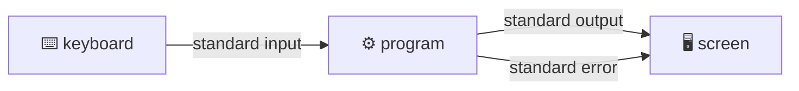

# Dr. Mindaugas Šarpis

# Best Research and Data Analysis Practices from CERN

## Command Line & File Handling

##### <span class="aims-badge">⚙️ automation · 📁 data & files · 🔧 tool-agnostic</span>

<!--
Speaker: this lecture is typed, not read. The slides name an idea, then the
terminal shows it on last week's file. Slides titled "Live" list what to type
and what comes back, so that the deck can be followed again at home. Keep VS
Code open next to the slides, with the terminal at a font size the last row can
read. Plan: 15:00 start, break at about 15:55 before "Looking Inside Files",
end by 16:50. (~1 min)
-->

---
hideInToc: true
layout: quote
---

# The command line is the universal interface to computing. Master it once, and you gain **speed**, **automation**, and the ability to work on any machine—from a laptop to a supercomputer cluster.

---
hideInToc: true
---

# Learning **Objectives**

<div class="note-text mt-sm">By the end of this lecture, you will be able to:</div>

<div class="stack-tight mt-sm">

<div class="card card-primary card-glass pad-compact">

🧭 Say **where you are** in the file tree, and move through it with `pwd`, `ls`, `cd`

</div>

<div class="card card-secondary card-glass pad-compact">

📁 Create, copy, move and delete files and folders, and leave the raw data untouched

</div>

<div class="card card-accent card-glass pad-compact">

🔎 Look inside a file of any size with `head`, `tail`, `less`, `wc`

</div>

<div class="card card-info card-glass pad-compact">

🔗 Join small programs with a **pipe** to answer a question about a data file

</div>

<div class="card card-warning card-glass pad-compact">

🔢 Explain why `sort`, `sort -n` and `sort -g` give **three different answers** on the same column

</div>

<div class="card card-success card-glass pad-compact">

📜 Save the commands as a **script** and run it again

</div>

</div>

---
hideInToc: true
---

# Last Week by Hand, Today in **One Line**

| **Question about `D0_KPi.csv`** | **Last week, in VS Code** | **Today** |
| --- | --- | --- |
| How many rows? | `Ctrl+End`, read the line number, subtract 2 | `wc -l` |
| How many rows are marked `-100`? | `Ctrl+F`, read the counter | `grep -c` |
| What is the smallest decay time? | Not possible by eye | `cut`, `sort`, `head` |
| Can I do all of it again next month? | Only if I remember the clicks | One script |

<div class="card card-info card-glass pad-compact mt-md">

⌨️ Each of these commands is a small program that does one thing. First half: moving around and handling files. Second half: asking the file questions.

</div>

<!--
Speaker: open with the last row. Nothing done by clicking last week left a
trace. Everything typed today can be saved and run again. (~2 min)
-->

---
hideInToc: true
---

# Terminal, Shell, **Command**

<div class="grid-3 mt-md gap-md">

<div class="card card-primary card-glass pad-compact">

## 🖥️ **Terminal**

The window. It shows text and passes on what you type. VS Code has one built in: **Terminal** > **New Terminal**.

</div>

<div class="card card-secondary card-glass pad-compact">

## 🐚 **Shell**

The program that reads the line you typed and decides what to run. Ours is **bash**, written in 1989.

</div>

<div class="card card-accent card-glass pad-compact">

## ⚙️ **Command**

A program the shell starts for you. `ls`, `wc` and `sort` are separate programs, each a file on your disk.

</div>

</div>

<div class="card card-info card-glass pad-compact mt-md">

📍 The shell prints a **prompt** and waits. The prompt ends in `$`. In this deck a line that begins with `$` is typed by you, without the `$`. Every other line is the answer.

</div>

---
hideInToc: true
---

# One Shell on **Every Laptop**

| **System** | **Shell** | **How to get it in VS Code** |
| --- | --- | --- |
| Windows | bash, as **Git Bash** | Installed with Git. Arrow next to **+** in the terminal panel > **Git Bash** |
| macOS | zsh | Opens by default |
| Linux | bash | Opens by default |

<div class="grid-2 mt-md gap-md">

<div class="card card-warning card-glass pad-compact">

## 🪟 **Not PowerShell**

Windows opens PowerShell by default. It is a good shell with different command names: `Get-ChildItem` for `ls`, `Get-Content` for `cat`. Today's commands are written for bash.

</div>

<div class="card card-success card-glass pad-compact">

## 🌍 **Why bash**

The same commands run on a laptop, on a university cluster and on the LHC computing grid. zsh on macOS understands all of today's commands.

</div>

</div>

<!--
Speaker: check the room now. Windows: Command Palette > "Terminal: Select
Default Profile" > Git Bash, then open a new terminal. Anyone without Git
installed shares a screen with a neighbour for the lecture and installs in the
break. (~3 min)
-->

---
hideInToc: true
demo: 4
---

# Live: **First Commands**

<div class="grid-2 mt-sm gap-md">

<div class="card card-primary card-glass pad-compact">

## ⌨️ **Type**

```text
$ whoami
you
$ date
Tue Oct  6 15:12:40 EEST 2026
$ echo hello
hello
$ pwd
/c/Users/you/Documents/analysis-project
$ ls
README.md  data  results  scripts
```

</div>

<div class="card card-info card-glass pad-compact">

## 👀 **Notice**

- Each command prints its answer and the prompt comes back
- `pwd` prints the folder you are in: the **working directory**
- `ls` lists what is in it, the same four names as the VS Code Side Bar
- A command with nothing to say prints nothing
- `↑` brings back the previous line

</div>

</div>

<!--
Speaker: VS Code opens the terminal in the project folder, so pwd ends in
analysis-project. macOS shows /Users/you/..., Linux /home/you/.... Type a wrong
command on purpose (pwdd) and read the error aloud: "command not found". (~5 min
typing)
-->

---
hideInToc: true
---

# Anatomy of a **Command**

```text
$ ls -l -h data/raw
```

<div class="grid-3 mt-md gap-md">

<div class="card card-primary card-glass pad-compact">

## ⚙️ **`ls`**

The **command**: which program to run. Always the first word.

</div>

<div class="card card-secondary card-glass pad-compact">

## 🎚️ **`-l -h`**

**Options**: how to run it. They begin with `-`. Short options can be joined: `-lh`.

</div>

<div class="card card-accent card-glass pad-compact">

## 🎯 **`data/raw`**

The **argument**: what to run it on. Here a folder.

</div>

</div>

<div class="card card-warning card-glass pad-compact mt-md">

⚠️ Spaces separate the parts, so `ls-l` is an unknown command and `my data.csv` is two arguments. Upper and lower case differ: `-r` and `-R` are two options.

</div>

<div class="note-text mt-sm">Help for any command: <code>ls --help</code>. On macOS and Linux also <code>man ls</code>, closed with <code>q</code>.</div>

---
hideInToc: true
---

# Two Errors You Will **See Today**

<div class="grid-2 mt-md gap-md">

<div class="card card-warning card-glass pad-compact">

## ❓ **`command not found`**

```text
$ pwdd
bash: pwdd: command not found
```

The shell found no program with that name. A typing error, or the program is not installed.

</div>

<div class="card card-warning card-glass pad-compact">

## 📂 **`No such file or directory`**

```text
$ ls data/row
ls: cannot access 'data/row': No such file or directory
```

The program ran, and the argument does not exist. A typing error, or you are in another folder than you think.

</div>

</div>

<div class="card card-success card-glass pad-compact mt-md">

🔎 An error message names the program that complains and the thing it complains about. Read it to the end before asking. Then run `pwd` and `ls`.

</div>

---
layout: section
hideInToc: true
---

# The File **Tree**

---
hideInToc: true
---

# Folders Inside **Folders**

<div class="grid-2 mt-sm gap-md">

<div class="card card-primary card-glass pad-compact">

## 🌳 **One tree per computer**

```text
/
├─ c/Users/you/          the home folder, ~
│  ├─ Downloads/
│  └─ Documents/
│     └─ analysis-project/
│        ├─ README.md
│        ├─ data/
│        │  ├─ raw/
│        │  └─ processed/
│        ├─ scripts/
│        └─ results/
```

</div>

<div class="card card-info card-glass pad-compact">

## 🗺️ **Reading it**

- The top is the **root**, written `/`
- A **path** names a place by listing the folders on the way, joined with `/`
- The home folder is `/c/Users/you` in Git Bash, `/Users/you` on macOS, `/home/you` on Linux
- `~` is short for the home folder on all three

</div>

</div>

<div class="note-text mt-sm">Windows itself writes the same place as <code>C:\Users\you</code>. Git Bash writes it with <code>/</code>, as macOS and Linux do.</div>

---
hideInToc: true
---

# Absolute and **Relative** Paths

<div class="grid-2 mt-md gap-md">

<div class="card card-primary card-glass pad-compact">

## 📍 **Absolute**

Begins at the root, with `/` or `~`. It names the same place from anywhere.

```text
~/Documents/analysis-project/data/raw
```

</div>

<div class="card card-secondary card-glass pad-compact">

## 📎 **Relative**

Begins at the working directory. Shorter, and its meaning depends on where you are.

```text
data/raw
```

</div>

</div>

| **Sign** | **Means** | **Example** |
| --- | --- | --- |
| `.` | The working directory | `ls .` |
| `..` | One folder up | `cd ..` |
| `~` | The home folder | `cd ~/Downloads` |
| `-` | The folder you were in before, for `cd` only | `cd -` |

<div class="note-text mt-sm">A script uses paths relative to the project folder. Then the project works on another computer, where the home folder has another name.</div>

---
hideInToc: true
demo: 7
---

# Live: **Moving Around**

<div class="grid-2 mt-sm gap-md">

<div class="card card-primary card-glass pad-compact">

## ⌨️ **Type**

```text
$ cd data/raw
$ pwd
/c/Users/you/Documents/analysis-project/data/raw
$ ls
D0_KPi.csv
$ cd ..
$ pwd
/c/Users/you/Documents/analysis-project/data
$ cd ~
$ cd -
$ cd ..
```

</div>

<div class="card card-info card-glass pad-compact">

## 👀 **Notice**

- `cd` prints nothing when it works
- After every `cd`, ask `pwd` until the tree is in your head
- Type `cd da` and press **Tab**: the shell completes the name. If it does not, the name is wrong or not unique
- Tab twice lists the candidates
- The last `cd ..` ends in the project folder. Stay there

</div>

</div>

<!--
Speaker: insist on Tab. It is faster, and it is a spelling check: a name that
does not complete does not exist. Let the room get lost once with cd ~ and find
the way back with cd -. (~8 min typing)
-->

---
hideInToc: true
---

# One Line of `ls -l`

```text
$ ls -l data/raw
total 3836
-rw-r--r-- 1 you you 3926142 Sep 29 20:51 D0_KPi.csv
```

| **Part** | **Meaning** |
| --- | --- |
| `-rw-r--r--` | A file, not a folder (`d`). The owner reads and writes, everyone else only reads |
| `3926142` | The size in **bytes**. With `-h`: `3.8M` |
| `Sep 29 20:51` | When the content last changed |
| `D0_KPi.csv` | The name |

<div class="card card-info card-glass pad-compact mt-md">

🧮 `3.8M` here, 3.9 MB in the macOS Finder: one file, 3 926 142 bytes. `ls -h` and Windows count in steps of 1024, the Finder in steps of 1000.

</div>

---
hideInToc: true
---

<MCQ
  question="You are in `analysis-project/data/raw`. Which command takes you to `analysis-project/scripts`?"
  :options="[
    'cd scripts',
    'cd ../scripts',
    'cd ../../scripts',
    'cd /scripts'
  ]"
  :correct="2"
  explanation="The first .. leads up to data, the second to analysis-project, and scripts is inside that. cd scripts looks inside raw, cd ../scripts looks inside data, and cd /scripts looks at the root of the whole tree."
/>

---
layout: section
hideInToc: true
---

# Files and **Folders**

---
hideInToc: true
---

# Create, Copy, Move, **Delete**

| **Command** | **Does** | **Example** |
| --- | --- | --- |
| `mkdir -p` | Makes a folder, and the folders above it | `mkdir -p data/processed/tmp` |
| `cp` | Copies a file | `cp data/raw/D0_KPi.csv data/processed/` |
| `mv` | Moves a file, or renames it | `mv notes.txt README_old.md` |
| `rm` | Deletes a file | `rm data/processed/copy.csv` |
| `rm -r` | Deletes a folder with its content | `rm -r data/processed/tmp` |

<div class="card card-warning card-glass pad-compact mt-md">

⚠️ The shell has **no recycle bin** and no undo. `rm` deletes at once. `cp` and `mv` replace a file of the same name without asking.

</div>

---
hideInToc: true
---

# Wildcards — Many Files at Once

<div class="card card-info card-glass pad-compact mt-sm glow">

## ✳️ **Patterns instead of names**

The shell expands a **pattern** into every matching filename *before* the command runs — the command just sees a list of files.

</div>

<div class="grid-2 mt-md gap-md">

<div class="card card-primary card-glass pad-tight">

## 🃏 **The patterns**

- `*` — any number of characters: `*.csv`
- `?` — exactly one character: `run_?.log`
- `[ab]` — one character from a set: `fig[12].png`

</div>

<div class="card card-secondary card-glass pad-tight">

## 🧪 **In action**

```bash
ls *.csv            # all CSV files here
cp data_2026_*.csv backup/
rm run_?.log        # run_1.log, run_A.log …
```

</div>

</div>

<div class="card card-warning card-glass pad-compact mt-md">

⚠️ Wildcards + `rm` is the classic foot-gun: run `ls <pattern>` first to **see** what will match.

</div>
---
hideInToc: true
demo: 7
---

# Live: **A Copy to Work On**

<div class="grid-2 mt-sm gap-md">

<div class="card card-primary card-glass pad-compact">

## ⌨️ **Type**

```text
$ mkdir -p data/processed/tmp
$ cp data/raw/D0_KPi.csv data/processed/tmp/
$ ls data/processed/tmp
D0_KPi.csv
$ cd data/processed/tmp
$ mv D0_KPi.csv copy.csv
$ cp copy.csv copy2.csv
$ ls *.csv
copy.csv  copy2.csv
$ rm copy2.csv
$ cd ../../..
$ rm -r data/processed/tmp
```

</div>

<div class="card card-info card-glass pad-compact">

## 👀 **Notice**

- `mv` with a new name in the same folder is a rename
- `ls *.csv` shows what the pattern matches. Run it before any `rm` with a pattern
- `rm -r` on a folder takes everything in it
- `data/raw` was only read, never written to
- Check in the VS Code Side Bar: it shows the same changes

</div>

</div>

<!--
Speaker: the Side Bar and the terminal are two views of one folder. Show both
after each step. Before the rm -r, ask the room for pwd. Break after this
slide, about 15:55. (~8 min typing)
-->

---
hideInToc: true
---

# Raw Data Is <span class="gradient-text">Read-Only</span>

<div class="card card-warning card-glass pad-tight mt-md glow">

## 🔒 **The one rule that saves projects**

**Never edit a raw data file.** Not to fix a typo, not to delete an obvious outlier, not "just this once."

</div>

<div class="grid-2 mt-md gap-md">

<div class="card card-primary card-glass pad-tight reveal-scale">

## 📥 **`data/raw/`**

- Exactly as collected or downloaded
- Treat as **untouchable** — your only link back to reality
- If it changes, every result becomes unverifiable

</div>

<div class="card card-success card-glass pad-tight reveal-scale">

## ⚙️ **`data/processed/`**

- Everything derived from raw — **by a script**
- Safe to delete at any time: rerun the script and it comes back
- Corrections live in **code**, where they are visible and repeatable

</div>

</div>

<div class="card card-info card-glass pad-compact mt-md reveal-up">

💡 Test yourself: could you delete everything *except* `data/raw/` and the scripts, and rebuild the project? If yes, your structure is right.

</div>
---
layout: section
hideInToc: true
---

# Looking **Inside** Files

<!--
Speaker: second half, after the break. From here on every command is pointed
at data/raw/D0_KPi.csv. (~1 min)
-->

---
hideInToc: true
---

# Four Ways to **Read** a File

| **Command** | **Shows** | **Use it when** |
| --- | --- | --- |
| `less file` | One screen at a time. Space for the next, `q` to leave | You want to read through it |
| `head -n 5 file` | The first 5 lines | You want the header and a few rows |
| `tail -n 5 file` | The last 5 lines | You want to see how the file ends |
| `wc -l file` | The number of lines | You want the size, in rows |

<div class="card card-success card-glass pad-compact mt-md">

⚡ `head` on a file of 10 GB answers at once. A spreadsheet loads the whole file first, and Excel stops at 1 048 576 rows. A command that does not stop is ended with `Ctrl+C`.

</div>

---
hideInToc: true
demo: 6
---

# Live: **First Look** at the File

<div class="grid-2 mt-sm gap-md">

<div class="card card-primary card-glass pad-compact">

## ⌨️ **Type**

```text
$ wc -l data/raw/D0_KPi.csv
91584 data/raw/D0_KPi.csv
$ wc -c data/raw/D0_KPi.csv
3926142 data/raw/D0_KPi.csv
$ head -n 3 data/raw/D0_KPi.csv
M,PT,TAU,IPCHI2
1880.649,3000.9534,0.00041271152,1299.1675
1860.6599,2803.4126,0.0001864154,0.34182164
$ tail -n 2 data/raw/D0_KPi.csv
1871.4323,2541.8845,0.0001756544,6.866581
1911.2631,2543.4617,0.00017650973,8.169813
```

</div>

<div class="card card-info card-glass pad-compact">

## 👀 **Notice**

- 91 584 lines: one header and **91 583 rows**, the number counted by hand last week
- `wc -c` counts bytes, the same 3 926 142 as in `ls -l`
- 3 926 142 / 91 584 is about **43 bytes per line**. Count the characters of one line: it fits
- The last line is a full row, so the file is not cut off
- Type the path once, then use `↑` and change the command

</div>

</div>

<!--
Speaker: the bytes-per-line check is the habit to plant: does the size make
sense for the number of rows? A file of 91 583 rows and 40 MB would hold
something we have not seen. (~7 min typing)
-->

---
layout: section
hideInToc: true
---

# Pipes and **Filters**

---
hideInToc: true
---

# Every Program Has Three **Streams**



<div class="grid-3 mt-md gap-md">

<div class="card card-primary card-glass pad-compact">

## 📥 **Input**

Where the program reads from. A file named as argument, or the keyboard.

</div>

<div class="card card-secondary card-glass pad-compact">

## 📤 **Output**

Where the answer goes. The screen, unless you say otherwise.

</div>

<div class="card card-warning card-glass pad-compact">

## 🚨 **Error**

Where complaints go. Kept apart, so that an error message never ends up inside a result.

</div>

</div>

<div class="note-text mt-sm">The shell can connect the output to a file, or to the input of another program. The program does not notice the difference.</div>

---
hideInToc: true
---

# To a File `>`, to a Program `|`

<div class="grid-2 mt-md gap-md">

<div class="card card-primary card-glass pad-compact">

## 💾 **Redirect**

```text
$ head -n 1001 data/raw/D0_KPi.csv > data/processed/sample_1000.csv
```

`>` writes the output into a file and **replaces** what was there. `>>` adds to the end.

</div>

<div class="card card-secondary card-glass pad-compact">

## 🔗 **Pipe**

```text
$ head -n 1001 data/raw/D0_KPi.csv | tail -n 3
```

`|` gives the output of the left program to the right one as input. Nothing is written to disk.

</div>

</div>

<div class="card card-warning card-glass pad-compact mt-md">

## ⚠️ **The command that empties a file**

`sort data.csv > data.csv` leaves `data.csv` with **0 bytes**. The shell empties the file for writing before `sort` starts to read it. Always write to a new name, and never into `data/raw`.

</div>

---
hideInToc: true
---

# Four **Filters**

| **Filter** | **Lets through** | **Example** |
| --- | --- | --- |
| `cut` | Chosen columns | `cut -d, -f3` is column 3, with `,` as separator |
| `grep` | Lines that contain a text | `grep ',-100'` |
| `sort` | All lines, in order | `sort -g` orders by number |
| `uniq -c` | One line per group of equal neighbours, with the count | Always after `sort` |

<div class="card card-info card-glass pad-compact mt-md">

🧱 A filter reads lines, writes lines and knows nothing about the others. That is why they can be joined in any order. `head`, `tail` and `wc` are filters too.

</div>

<div class="note-text mt-sm">Pipes came to Unix in 1973. Doug McIlroy at Bell Labs had asked in 1964 for a way to couple programs "like garden hose". It is still how data is processed on the LHC grid.</div>

---
hideInToc: true
demo: 9
---

# Live: The **Smallest** Decay Time

<div class="grid-2 mt-sm gap-md">

<div class="card card-primary card-glass pad-compact">

## ⌨️ **Type**

```text
$ cut -d, -f3 data/raw/D0_KPi.csv | head -n 3
TAU
0.00041271152
0.0001864154
$ cut -d, -f3 data/raw/D0_KPi.csv | sort -g | head -n 4
TAU
-100.0
-100.0
-100.0
$ grep -c ',-100' data/raw/D0_KPi.csv
49
$ grep -n ',-100' data/raw/D0_KPi.csv | head -n 2
343:1818.1002,2978.644,-100.0,9901.186
965:1902.8027,2740.8074,-100.0,45169.31
```

</div>

<div class="card card-info card-glass pad-compact">

## 👀 **Notice**

- Build the line one stage at a time, and look at the output after each
- The smallest value of a time is `-100`. That is a code for "not computed"
- `grep -c` counts the lines: **49**, as in last week's lecture
- `grep -n` adds the line number: row 343 can now be looked up in VS Code with `Ctrl+G`
- The header `TAU` travels through the pipe like any other line

</div>

</div>

<!--
Speaker: this is the finding of last week's slide "49 Rows Change the Mean",
now made by the room in two lines. Ask before running the sort: what is the
smallest decay time you expect? (~10 min typing)
-->

---
hideInToc: true
---

# Three Sorts, Three **Answers**

<div class="note-text mt-sm">The smallest value of column 4, <code>IPCHI2</code>, asked three ways:</div>

| **Command** | **Compares** | **First line after the header** |
| --- | --- | --- |
| `sort` | Character by character, as text | Depends on the language settings of the computer |
| `sort -n` | Numbers written with digits and a point | `0.0001540074` |
| `sort -g` | Numbers in any notation | `1.3600341e-05` |

<div class="grid-2 mt-md gap-md">

<div class="card card-warning card-glass pad-compact">

## 🔬 **Two rows in 91 583**

The file writes two values as `1.3600341e-05` and `9.40878e-05`. `sort -n` stops reading at the `e` and takes them for 1.36 and 9.4.

</div>

<div class="card card-success card-glass pad-compact">

## ✅ **The rule**

Text: `sort`. Counts and plain numbers: `sort -n`. Measured values: `sort -g`. Add `-r` to turn the order round.

</div>

</div>

<div class="note-text mt-sm">The true smallest value is 0.000013600341. <code>sort -n</code> reports one eleven times larger, and gives no warning.</div>

<!--
Speaker: computed on the real file. grep -c 'e-' data/raw/D0_KPi.csv gives 2.
The same trap waits in every program that reads numbers as text. (~3 min)
-->

---
hideInToc: true
demo: 7
---

# Live: A Histogram **Without a Plot**

<div class="grid-2 mt-sm gap-md">

<div class="card card-primary card-glass pad-compact">

## ⌨️ **Type**

```text
$ cut -d, -f1 data/raw/D0_KPi.csv | cut -c1-3 | sort | uniq -c
      1 176
      1 180
   3716 181
   7245 182
   7384 183
   7946 184
  12207 185
  17496 186
  11388 187
   7540 188
   6790 189
   6684 190
   3183 191
      1 192
      1 245
      1 M
```

</div>

<div class="card card-info card-glass pad-compact">

## 👀 **Notice**

- `cut -c1-3` keeps the first three characters: `1864.0781` becomes `186`, a bin of 10 MeV/c²
- `uniq -c` counts equal neighbours, so `sort` comes first
- The peak is in `186`: the D⁰ at 1865 MeV/c²
- Four rows lie outside 1810 to 1920. A plot with automatic axes would be stretched by them
- The last line is the header

</div>

</div>

<!--
Speaker: last week's histogram, made with four small programs and no plotting
library. Ask what the rows at 176 and 245 are: candidates outside the selection
window, four in 91 583. (~8 min typing)
-->

---
hideInToc: true
---

<MCQ
  question="runs.txt contains six lines: alpha, beta, alpha, gamma, alpha, beta. What does `sort runs.txt | uniq -c | sort -nr | head -1` print?"
  :options="[
    '3 alpha',
    'alpha 3',
    '1 gamma',
    '6 runs.txt'
  ]"
  :correct="0"
  explanation="sort groups the identical lines together, uniq -c rewrites each group as count-then-value (count first!), sort -nr puts the largest count on top, and head -1 keeps only that line. alpha appears three times, so the output is `3 alpha`."
/>
---
layout: section
hideInToc: true
---

# Keep the **Commands**

---
hideInToc: true
---

# From Pipeline to **Script**

<div class="grid-2 mt-sm gap-md">

<div class="card card-primary card-glass pad-compact">

## 📜 **`scripts/explore.sh`**

```bash
# First look at the example file.
# Run from the project folder:
#   bash scripts/explore.sh
FILE=data/raw/D0_KPi.csv

echo "Lines:"
wc -l $FILE
echo "Rows marked -100:"
grep -c ',-100' $FILE
echo "Rows per 10 MeV:"
cut -d, -f1 $FILE | cut -c1-3 | sort | uniq -c
```

</div>

<div class="card card-info card-glass pad-compact">

## 🧩 **What is new**

- A script is a text file with the commands, one per line
- A line that begins with `#` is a comment for the reader
- `FILE=...` gives the path a name. `$FILE` puts the path in. No spaces around `=`
- `bash scripts/explore.sh` runs the lines from top to bottom

</div>

</div>

<div class="card card-success card-glass pad-compact mt-md">

♻️ The script is the record of what was done to the file. When the data is replaced by a newer version, one line changes and everything is run again.

</div>

---
hideInToc: true
demo: 5
---

# Live: **Run It Twice**

<div class="grid-2 mt-sm gap-md">

<div class="card card-primary card-glass pad-compact">

## ⌨️ **Type**

```text
$ bash scripts/explore.sh
Lines:
91584 data/raw/D0_KPi.csv
Rows marked -100:
49
Rows per 10 MeV:
      1 176
...
$ bash scripts/explore.sh > results/explore.txt
$ ls results
explore.txt
```

</div>

<div class="card card-warning card-glass pad-compact">

## 🪟 **On Windows, first**

VS Code on Windows ends each line of a new file with two characters, `CRLF`. bash expects one, `LF`, and answers:

```text
$'\r': command not found
```

Select `CRLF` in the Status Bar, choose **LF**, save.

</div>

</div>

<!--
Speaker: write the script in the VS Code editor, not in the terminal. Show the
CRLF error on purpose if a Windows laptop is at hand; it is the most common
first error with scripts. (~6 min typing)
-->

---
hideInToc: true
---

# **Recap** — You Can Now…

<div class="grid-2 gap-md mt-sm">

<div class="card card-success card-glass pad-compact">

✅ Say where you are with `pwd`, and move with `cd`, `..`, `~` and Tab

</div>

<div class="card card-success card-glass pad-compact">

✅ Make, copy, move and delete with `mkdir`, `cp`, `mv`, `rm`, and check a pattern with `ls` first

</div>

<div class="card card-success card-glass pad-compact">

✅ Read a file of any size with `head`, `tail`, `less`, `wc`

</div>

<div class="card card-success card-glass pad-compact">

✅ Join `cut`, `grep`, `sort`, `uniq -c` with `|`, and write the result with `>`

</div>

<div class="card card-success card-glass pad-compact">

✅ Choose between `sort`, `sort -n` and `sort -g`

</div>

<div class="card card-success card-glass pad-compact">

✅ Save the commands in a script and run it again

</div>

</div>

<div class="card card-accent card-glass pad-compact mt-md">

📖 To read: *Research Software Engineering with Python*, chapters 2 and 3, free at third-bit.com/py-rse. To practise: Software Carpentry, *The Unix Shell*.

</div>

<!--
Speaker: break until 17:05, then the seminar. The room answers six questions
about the file with its own pipelines. (~1 min)
-->

---
layout: section
hideInToc: true
extra: true
---

# Extra **Material**

More of the shell and of file handling, for reading at home. Not part of the lecture.

---
hideInToc: true
---

# Finding Files

<div class="grid-2 mt-md gap-md">

<div class="card card-primary card-glass pad-tight">

## 🪟 **PowerShell**

```powershell
Get-ChildItem -Recurse -Filter *.csv
Get-ChildItem -Recurse |
  Where-Object Length -gt 100MB
```

</div>

<div class="card card-secondary card-glass pad-tight">

## 🐧 **macOS & Linux**

```bash
find . -name "*.csv"
find . -size +100M
find . -mtime -7     # changed last 7 days
```

</div>

</div>

<div class="card card-info card-glass pad-tight mt-md">

## 🔍 **`grep` finds text, `find` finds files**

- "Which file mentions `calibration`?" → `grep -r "calibration" .`
- "Where did that huge download go?" → `find ~ -size +1G`
- Both search **recursively** — the whole directory tree below you

</div>

---
hideInToc: true
---

# A Pipeline, Step by Step

<div class="card card-info card-glass pad-compact mt-sm">

🧪 **Question:** which detector reports the most errors? `log.txt` has one line per event: `sensor_A OK`, `sensor_B ERROR`, …

</div>

<div class="stack-tight mt-md">

<div class="card card-primary card-glass pad-compact reveal-left">

1️⃣ `grep "ERROR" log.txt` — keep only the error lines

</div>

<div class="card card-secondary card-glass pad-compact reveal-left">

2️⃣ `… | sort` — identical sensor names become neighbours

</div>

<div class="card card-accent card-glass pad-compact reveal-left">

3️⃣ `… | uniq -c` — collapse repeats into `count name`

</div>

<div class="card card-success card-glass pad-compact reveal-left">

4️⃣ `… | sort -nr | head -3` — numerically, biggest first, top three

</div>

</div>

<div class="card card-warning card-glass pad-compact mt-md reveal-up">

```bash
grep "ERROR" log.txt | sort | uniq -c | sort -nr | head -3
```

💡 Four small tools, one question answered — **no programming required.**

</div>

---
hideInToc: true
---

# Combining Commands

<div class="grid-2 mt-md gap-md">

<div class="card card-primary card-glass pad-compact">

## 🪟 **PowerShell Pipeline**

```powershell
Get-ChildItem *.csv |
  Where-Object { $_.Length -gt 1MB } |
  Sort-Object Length -Descending |
  Out-File large_files.txt
```

</div>

<div class="card card-secondary card-glass pad-compact">

## 🐧 **UNIX Pipeline**

```bash
find . -name "*.csv" -size +1M -exec du -h {} + \
  | sort -rh > large_files.txt
```

</div>

</div>

<div class="card card-info card-glass pad-compact mt-md">

💡 Pipelines let each tool focus on one job. Reuse the same pattern across projects with minimal edits.

*These examples show the power of pipelines — don't worry if the syntax looks unfamiliar; you'll pick up these tools as the course goes on.*

</div>

<!--
Speaker: if someone asks "why not just ls -l | awk?" — ls -l columns are not a
stable format to parse; filenames with spaces or locale settings silently break
naive awk/cut scripts. find … -exec du asks the filesystem directly. (~1 min)
-->

---
hideInToc: true
---

# Did It Work? Exit Codes & Chaining

<div class="card card-info card-glass pad-compact mt-sm">

🚦 Every command finishes with an invisible **exit code**: `0` = success, anything else = failure. The shell lets you build logic on top of it.

</div>

<div class="grid-2 mt-md gap-md">

<div class="card card-primary card-glass pad-tight">

## 🔗 **Chaining operators**

```bash
cmd1 && cmd2   # cmd2 only if cmd1 succeeded
cmd1 || cmd2   # cmd2 only if cmd1 FAILED
cmd1 ;  cmd2   # cmd2 regardless
```

</div>

<div class="card card-secondary card-glass pad-tight">

## 🧪 **In practice**

```bash
mkdir results && cd results
python analyse.py       # run it
echo $?                 # its exit code: 0 = ok, else failed
python analyse.py || echo "failed!"   # || = fallback on failure
```

`$LASTEXITCODE` in PowerShell.

</div>

</div>

<div class="card card-success card-glass pad-compact mt-md">

💡 `&&` is your safety belt: "only continue **if that worked**" — you'll see it in install instructions everywhere.

</div>

---
hideInToc: true
---

# Working with Processes

<div class="note-text">

*Optional power-user detour — skim it on first contact and return when you have a long-running analysis to babysit.*

</div>

<div class="grid-2 mt-sm gap-md">

<div class="card card-primary card-glass pad-tight">

## 🪟 **PowerShell**

```powershell
Get-Process firefox
Stop-Process -Name firefox
Start-Job -ScriptBlock { ./long_task.ps1 }
```

</div>

<div class="card card-secondary card-glass pad-tight">

## 🐧 **macOS & Linux**

```bash
ps aux | grep firefox
killall firefox
nohup ./long_task.sh &
```

</div>

</div>

<div class="card card-warning card-glass pad-tight mt-md">

## ⚙️ **Why It Matters**

- Monitor long-running analyses
- Run jobs in the background while continuing to work
- Integrate into schedulers or workflow engines

</div>

---
layout: section
hideInToc: true
---

# Searching the Data **Tree**

<!--
Speaker: they met find and grep as single commands. This section upgrades both
into questions you ask a whole directory tree — the daily bread of anyone
managing run data. (~1 min)
-->

---
hideInToc: true
---

# `grep` Beyond the First Match

<div class="card card-info card-glass pad-compact mt-sm">

You know `grep pattern file`. Four flags turn it from *show me matches* into *answer my question*.

</div>

<div class="grid-2 mt-md gap-md">

<div class="card card-primary card-glass pad-tight">

## 🚩 **The flags**

```bash
grep -i "error" run.log   # ignore case
grep -n "ERROR" run.log   # show line numbers
grep -c "ERROR" run.log   # just COUNT matches
grep -l "ERROR" *.log     # just LIST matching files
```

</div>

<div class="card card-secondary card-glass pad-tight">

## 🧪 **In practice**

```bash
grep -c "ERROR" *.log
```

```text
run_041.log:0
run_042.log:17
run_043.log:2
```

An error count **per file** — one command.

</div>

</div>

---
hideInToc: true
---

# Context: What Happened Around the Match?

<div class="card card-info card-glass pad-compact mt-sm">

🔎 An error line rarely explains itself — the cause is usually a few lines **earlier** in the log.

</div>

<div class="card card-primary card-glass pad-tight mt-md">

## 🩺 **`-B` before, `-A` after, `-C` both**

```bash
grep -B2 -A1 "ERROR" run_042.log
```

```text
09:14:55 sensor_3 temp 71C
09:14:56 sensor_3 temp 84C
09:14:57 sensor_3 ERROR overheat
09:14:58 sensor_3 shutdown
```

</div>

<div class="card card-success card-glass pad-compact mt-md">

💡 Two lines of context turn *there was an error* into *sensor 3 overheated over two seconds* — diagnosis without opening an editor.

</div>

---
hideInToc: true
---

# `find` Acts, Not Just Lists: `-exec`

<div class="grid-2 mt-md gap-md">

<div class="card card-primary card-glass pad-tight">

## ⚙️ **The pattern**

```bash
find data/ -name "*.log" -exec wc -l {} +
```

- `{}` — placeholder for the found files
- `+` — pass many files per call

</div>

<div class="card card-secondary card-glass pad-tight">

## 🧪 **Select, then act**

```bash
# line counts for CSVs changed this week
find data/ -name "*.csv" -mtime -7 \
  -exec wc -l {} +
```

</div>

</div>

<div class="card card-info card-glass pad-compact mt-md">

💡 The selection tests stack — `-name`, `-size`, `-mtime` combine into a **query language for your filesystem**, and `-exec` is its verb.

</div>

---
hideInToc: true
---

# Case Study: Audit a Season of Runs

<div class="card card-info card-glass pad-compact mt-sm">

📦 `data/raw/` holds hundreds of run logs. Your supervisor asks: **which of last week's runs had errors — and how many is that?**

</div>

<div class="stack-tight mt-md">

<div class="card card-primary card-glass pad-compact reveal-left">

1️⃣ `find data/raw -name "run_*.log" -mtime -7` — last week's runs

</div>

<div class="card card-secondary card-glass pad-compact reveal-left">

2️⃣ `… -exec grep -l "ERROR" {} +` — keep only those containing errors

</div>

<div class="card card-accent card-glass pad-compact reveal-left">

3️⃣ `… | wc -l` — count the survivors

</div>

</div>

<div class="card card-success card-glass pad-compact mt-md reveal-up">

```bash
find data/raw -name "run_*.log" -mtime -7 -exec grep -l "ERROR" {} + | wc -l
```

💡 A tree-wide audit in one line — 📁 this is what *efficient work with files* means.

</div>

---
layout: section
hideInToc: true
---

# Your First Shell **Script**

<!--
Speaker: the automation payoff, and the rule of the whole course in miniature.
If you typed it twice, script it. Ten minutes here saves them hours every month
for the rest of their careers. (~1 min)
-->

---
hideInToc: true
---

# If You Typed It Twice, Script It

<div class="card card-accent card-glass pad-compact mt-sm glow">

⚙️ A **script** is just your commands saved in a file — typed once, run forever. This is the automation aim in its smallest form.

</div>

<div class="grid-2 mt-md gap-md">

<div class="card card-primary card-glass pad-tight">

## 📝 **Anatomy**

```bash
#!/usr/bin/env bash
# count_events.sh — events per detector
cut -d, -f2 events.csv | sort | uniq -c
```

- line 1 is the **shebang** — which interpreter runs this file

</div>

<div class="card card-secondary card-glass pad-tight">

## ▶️ **Make it runnable**

```bash
chmod +x count_events.sh   # once: mark executable
./count_events.sh          # run it
```

- `./` means *the one right here*, not something on `$PATH`

</div>

</div>

---
hideInToc: true
---

# Script Building Block 1: Variables

<div class="grid-2 mt-md gap-md">

<div class="card card-primary card-glass pad-tight">

## 🏷️ **Define and use**

```bash
DATA_DIR="data/raw"
PATTERN="ERROR"
grep -c "$PATTERN" "$DATA_DIR"/run_042.log
```

- no spaces around `=`
- `$NAME` inserts the value

</div>

<div class="card card-warning card-glass pad-tight">

## 🛡️ **Quote your variables**

```bash
rm "$OLD_FILE"   # safe with spaces
rm $OLD_FILE     # "my data.csv" becomes TWO arguments!
```

Unquoted variables split on spaces — the classic script bug.

</div>

</div>

<div class="card card-info card-glass pad-compact mt-md">

💡 Variables gather everything you might change — paths, patterns, thresholds — at the **top** of the script, in one visible place.

</div>

---
hideInToc: true
---

# Script Building Block 2: The `for` Loop

<div class="card card-info card-glass pad-compact mt-sm">

🔁 Wildcards give you the file list; `for` runs the same body **once per file**.

</div>

<div class="card card-primary card-glass pad-tight mt-md">

## 🔂 **The shape**

```bash
for f in data/raw/run_*.log; do
  echo "== $f"
  grep -c "ERROR" "$f"
done
```

- `$f` holds the current filename on each pass

</div>

<div class="card card-success card-glass pad-compact mt-md">

💡 Ten files or ten thousand — the loop doesn't care. This is the moment the CLI stops being *typing fast* and becomes **automation**.

</div>

---
hideInToc: true
---

# Putting It Together: `error_report.sh`

<div class="card card-primary card-glass pad-tight mt-sm">

## 📜 **The whole script**

```bash
#!/usr/bin/env bash
# error_report.sh — ERROR count per run log
DATA_DIR="data/raw"
mkdir -p results

for f in "$DATA_DIR"/run_*.log; do
  n=$(grep -c "ERROR" "$f")
  echo "$f,$n"
done > results/error_report.csv
```

</div>

<div class="grid-2 mt-md gap-md">

<div class="card card-secondary card-glass pad-compact">

## 🆕 **One new trick**

`$( … )` — **command substitution**: run the command, keep its output in a variable

</div>

<div class="card card-success card-glass pad-compact">

## ♻️ **Why it matters**

Delete the report, rerun the script, get it back — ready for version control later in the course

</div>

</div>

---
hideInToc: true
---

# Teaser: `xargs` — the Loop You Don't Write

<div class="grid-2 mt-md gap-md">

<div class="card card-primary card-glass pad-tight">

## 🚀 **One-liner power**

```bash
find data/raw -name "*.csv" | xargs wc -l
# names with spaces: find -print0 | xargs -0
```

`xargs` reads names from the pipe and hands them to the command as **arguments** — a for-loop compressed into a word.

</div>

<div class="card card-secondary card-glass pad-tight">

## 🗺️ **Where this road leads**

- today — a script and a loop
- soon — your scripts under **version control**
- later in the course — whole **pipelines** rerun with one command

</div>

</div>

<div class="card card-accent card-glass pad-compact mt-md">

⚙️ You don't need `xargs` yet — recognise it in the wild, and remember the shell can always go one step further.

</div>

---
hideInToc: true
---

# Common CLI Mistakes

<div class="grid-2 mt-md gap-md">

<div class="card card-warning card-glass pad-tight">

## ⚠️ **Dangerous**

- `rm -rf` on the wrong directory — deleted **permanently**, no trash can *(modern `rm` refuses `/` itself, but `rm -rf ~` has no such guard)*
- Running commands in the **wrong directory**
- Overwriting files with `>` instead of appending with `>>`
- Copy-pasting commands from the internet without reading them

</div>

<div class="card card-success card-glass pad-tight">

## ✅ **Safe Habits**

- Always `pwd` before destructive operations
- Use `ls` to verify targets before `rm`
- Try `--dry-run` flags when available
- Read `--help` for unfamiliar commands

</div>

</div>

<div class="card card-info card-glass pad-compact mt-md">

💡 **Rule of thumb:** if a command can't be undone, double-check before pressing Enter.

</div>

---
hideInToc: true
---

<MCQ
  question="A folder contains: run_1.log, run_12.log, run_A.log, notes.txt. What does `rm run_?.log` delete?"
  :options="[
    'All four files',
    'run_1.log, run_12.log and run_A.log',
    'run_1.log and run_A.log',
    'Nothing — ? is not a valid wildcard'
  ]"
  :correct="2"
  explanation="? matches exactly one character, so run_1.log and run_A.log match but run_12.log (two characters) and notes.txt do not. This is why you run `ls run_?.log` first — see the match list before deleting it."
/>

---
hideInToc: true
---

# Two Ways to Lose Your **Work**

<div class="grid-2 mt-md gap-md">

<div class="card card-warning card-glass pad-tight reveal-scale">

## 😵 **File chaos**

- "I have no idea where I saved that file"
- "Which one is the right one?" — `final_final_v2.docx`, `asdfasdf.docx`, `final.docx`
- "I overwrote my file with the wrong version"

</div>

<div class="card card-warning card-glass pad-tight reveal-scale">

## 💥 **No backups**

- "I accidentally deleted my file"
- "My computer crashed and I lost everything"
- "I spilled tea on my laptop — now my thesis is gone"

</div>

</div>

<div class="card card-success card-glass pad-tight mt-md reveal-up">

## ✅ **How to avoid both**

- A consistent **folder structure** and descriptive, versioned **filenames** *(this lecture)*
- **Version control** (Git) for text files — revert to any older version *(later in the course)*
- Copies at three distances — **here, near, far** *(next slide)*

</div>

---
hideInToc: true
---

# Backup Strategy: <span class="gradient-text">Here — Near — Far</span>

<div class="grid-3 mt-md gap-md">

<div class="card card-primary card-glass pad-tight reveal-scale">

## 💻 **Here**

Your **local device** — the working copy you use every day

- Laptop or desktop hard drive
- Fast access, but vulnerable to hardware failure, theft, or accidents

</div>

<div class="card card-secondary card-glass pad-tight reveal-scale">

## 🔌 **Near**

A **local backup** in the same physical space

- External hard drive, USB stick, or NAS
- Protects against device failure
- Still at risk from fire, flood, or theft

</div>

<div class="card card-accent card-glass pad-tight reveal-scale">

## ☁️ **Far**

A **remote backup** in a different location

- Cloud storage (Google Drive, OneDrive, Dropbox)
- University-hosted storage or remote server
- Protects against site-level disasters

</div>

</div>

<div class="card card-info card-glass pad-compact mt-md reveal-up">

💡 A solid backup plan keeps copies at **all three distances**. If any one fails, the others still have you covered.

</div>

---
hideInToc: true
---

# Compatibility Issues

<div class="grid-2 mt-md gap-md">

<div class="card card-warning card-glass pad-tight">

## 🔌 **Common Issues**

- "I can't open this file"

- "This only works on my old laptop"

- "I have a Mac, so this probably won't work"

- "I opened this Word file but it's all broken"

- "The script was running ok but now I get errors"

</div>

<div class="card card-success card-glass pad-tight">

## ✅ **How to Avoid**

- Prefer **open-source** software and file formats

- Choose **cross-platform** tools (cloud-based or multi-OS)

- Later in the course you'll **pin versions** so it works everywhere

- Track changes with **version control** (Git)

- Agree on software and formats with **collaborators** upfront

</div>

</div>

---
layout: section
hideInToc: true
---

# File **Naming**

<!--
Speaker: pivot from commands to discipline. A good filename is sortable and
self-describing; bad ones cost hours later. Tie this back to the file-chaos
slide they just laughed at. (~1 min)
-->

---
hideInToc: true
---

# File Naming: Plan the **Metadata**

<div class="note-text">Comic: <a href="https://xkcd.com/1459/">xkcd 1459</a> · guidance in this section adapted from <a href="https://datamanagement.hms.harvard.edu/">Harvard Medical School's Research Data Management</a>.</div>

<div class="flex gap-md mt-sm items-start">

<div class="flex-1">

<div class="grid-2 gap-md">

<div class="card card-primary card-glass pad-compact">

## 🧠 **Think Ahead**

- Which group of files does this convention cover?
- Different file sets may use different conventions
- Check for established conventions in your discipline or group

</div>

<div class="card card-info card-glass pad-compact">

## 🏷️ **Identify the Metadata**

- Experiment conditions, type of data
- Researcher initials, lab or location
- Project or experiment acronym
- Date or date range
- Run number or sample ID

</div>

</div>

<div class="card card-secondary card-glass pad-compact mt-md">

## 🔤 **Abbreviate & Encode**

- Keep only what you sort or search by; encode categories as short codes (`raw`, `cal`)
- **Document the codes** — a code nobody can decode is noise

</div>

</div>


</div>

---
hideInToc: true
---

# File Naming: Versioning & **Ordering**

<div class="grid-2 mt-md gap-md">

<div class="card card-primary card-glass pad-tight">

## 🔢 **Use Versioning**

- Mark the current version at the **end** of the name: `report_v02.docx`
- Zero-pad numbers (`v01` … `v10`) so they sort correctly
- Or use the version date in ISO 8601: `YYYY-MM-DD`

</div>

<div class="card card-accent card-glass pad-tight">

## 🔍 **Make Files Sortable & Searchable**

- Decide how you will sort and search — that metadata goes **first** in the name
- Default ordering is alphabetical, numerical, or chronological
- Put the date **first** when chronology matters — ISO dates sort correctly in a plain listing

</div>

</div>

<div class="card card-success card-glass pad-tight mt-md">

## 🧪 **`ls` already shows them in order**

```text
2026-03-14_run042_calib_v01.csv
2026-03-14_run042_calib_v02.csv
2026-03-15_run043_calib_v01.csv
```

</div>

---
hideInToc: true
---

# File Naming: Separators & **Documentation**

<div class="grid-2 mt-md gap-md">

<div class="card card-info card-glass pad-tight">

## ✂️ **Separate the Elements**

- Dashes `file-name.xxx`, underscores `file_name.xxx`, or CamelCase `FileName.xxx`
- 🚫 No separation: `filename.xxx` — avoid
- No spaces, and no special characters: `~ ! @ # $ % ^ & * ( ) ; : < > ? , [ ] { } ' " |`

</div>

<div class="card card-secondary card-glass pad-tight">

## 📝 **Write the Convention Down**

- Documented conventions let anyone identify a moved or shared file from its name alone
- At most 40–50 characters; only alphanumerics, dashes, and underscores
- Encoding a lot of metadata? Move it to a master spreadsheet next to the data

</div>

</div>

<div class="card card-warning card-glass pad-compact mt-md">

⚠️ A space in a filename is a bug waiting to happen: `rm my data.csv` deletes `my` and `data.csv`, not `my data.csv`.

</div>

---
hideInToc: true
---

# When Names Aren't Enough: Sidecar Metadata

<div class="card card-info card-glass pad-compact mt-sm">

🏷️ A filename holds three or four facts at most. The rest — instrument settings, units, operator, conditions — belongs in a **metadata file that travels with the data**.

</div>

<div class="grid-2 mt-md gap-md">

<div class="card card-primary card-glass pad-tight">

## 📑 **The sidecar pattern**

```text
data/
├── 2026-03-14_run042.csv
├── 2026-03-14_run042_README.txt
└── samples_master.csv
```

One description file per dataset — or one master table describing every file.

</div>

<div class="card card-secondary card-glass pad-tight">

## ✍️ **What goes in it**

- **Units** for every column *(the classic silent killer)*
- Instrument + settings used
- Date, operator, location
- Known issues ("sensor 3 drifted after 14:00")

</div>

</div>

<div class="card card-success card-glass pad-compact mt-md">

💡 Rule of thumb: if a fact is needed to **interpret** the numbers, it must be stored **next to** the numbers — not in your memory or an old email.

</div>

---
hideInToc: true
---

# File Naming Cheatsheet

<div class="grid-2 mt-md gap-md">

<div class="card card-warning card-glass pad-compact">

## ❌ **Bad**

```
final_FINAL_v2 (1).docx
data.csv
Copy of analysis.py
Figure 1 (final).png
```

</div>

<div class="card card-success card-glass pad-compact">

## ✅ **Good**

```
thesis_draft_v03_2026-02-20.docx
experiment_alpha_raw_001.csv
analysis_v02.py
fig01_mass_spectrum.png
```

</div>

</div>

<div class="card card-info card-glass pad-compact mt-md glow">

💡 **Recipe:** `project_description_version.ext` — descriptive, no spaces or special characters — and put an ISO date **first** (`2026-02-20_thesis_draft_v03.docx`) when files must sort by time.

</div>

---
layout: section
hideInToc: true
---

# Directory **Structure**

---
hideInToc: true
---

# Organising Your Directories

<div class="grid-2 mt-md gap-md">

<div class="card card-primary card-glass pad-tight">

## 📁 **Organised by File Type**

```text
├── Data/
│   ├── Processed/
│   └── Raw/
└── Results/
    ├── Figure1.tif
    ├── Figure2.tif
    └── Models/
        └── Model1/
```

</div>

<div class="card card-secondary card-glass pad-tight">

## 📊 **Organised by Analysis**

```text
├── Figure1/
│   ├── Data/
│   └── Results/
│       └── Figure1.tif
└── Figure2/
    ├── Data/
    └── Results/
        └── Figure2.tif
```

</div>

</div>

<div class="note-text mt-sm">

Choose the structure that best fits your workflow — either is valid as long as it is consistent. Build either one with `mkdir`, and move through it with `ls` and `cd`.

</div>

---
hideInToc: true
---

# The README: Your Project's Front Page

<div class="card card-info card-glass pad-compact mt-sm">

📄 A `README` is a plain-text file at the project root that tells a stranger — including **you, six months from now** — what this project is and how to use it.

</div>

<div class="grid-2 mt-md gap-md">

<div class="card card-primary card-glass pad-tight">

## 📋 **A minimal README records**

- What the project is (one paragraph)
- Where the data **came from** (provenance, dates, units)
- How to **regenerate** the results, step by step
- Who to contact

</div>

<div class="card card-secondary card-glass pad-tight">

## 🧪 **Example skeleton**

```text
my_project/
├── README.md   <- you are here
├── data/
│   ├── raw/
│   └── processed/
├── scripts/
└── results/
```

</div>

</div>

<div class="card card-success card-glass pad-compact mt-md">

💡 Writing READMEs gets much nicer with **Markdown** — covered in its own lecture shortly.

</div>

---
hideInToc: true
---

# Try at Home: Build a Project **Skeleton**

<div class="card card-info card-glass pad-compact mt-md">

## 🏠 **Ten minutes, no file manager allowed**

Create this structure from the command line, then write your plan for a project of your choice into the README:

```bash
mkdir -p my_project/data/raw \
         my_project/data/processed \
         my_project/results
touch my_project/README.md
ls -R my_project
```

</div>

<div class="card card-success card-glass pad-compact mt-sm">

💡 `-p` creates parent directories automatically. Try `tree my_project` if you have `tree` installed.

💡 **Bonus:** drop a few `sensor_A OK` / `sensor_B ERROR` lines into `my_project/data/raw/run042.log`, then reuse the earlier pipeline: `grep ERROR my_project/data/raw/run042.log | sort | uniq -c | sort -nr`

🔗 **Keep the exact commands you used** — paste them into the README as its first "how to rebuild this" section.

</div>

---
hideInToc: true
---

<MCQ
  question="Why do shared projects usually prefer relative paths (data/raw/run42.csv) over absolute paths (/Users/alice/proj/data/raw/run42.csv)?"
  :options="[
    'Relative paths are faster for the OS to resolve',
    'Absolute paths are not supported on Linux',
    'Relative paths make the project portable — it still works when someone clones it elsewhere',
    'Relative paths automatically encrypt the file location'
  ]"
  :correct="2"
  explanation="Absolute paths tie a project to one machine and user; relative-to-project-root paths keep it self-contained and portable — a ♻️ reproducibility win."
/>

---
hideInToc: true
---

# Exercise: Fix This Mess (1/2)

<div class="card card-warning card-glass pad-tight mt-md">

## 😵 **The Problem**

A colleague shared their project with you. Here's what you received:

```
Desktop/
├── final_FINAL_v2.docx
├── data (1).csv
├── Copy of data.csv
├── analysis.py
├── analysis_old.py
├── analysis_NEW_USE_THIS.py
├── plot.png
├── plot2.png
├── Figure 1 (final).png
└── notes.txt
```

</div>

<div class="card card-info card-glass pad-compact mt-md" v-click>

💡 **Spot the issues:** spaces in filenames, duplicate data files, no versioning, no folder structure, unclear which script is current, vague figure names.

</div>

---
hideInToc: true
---

# Exercise: Fix This Mess (2/2)

<div class="card card-success card-glass pad-tight mt-md">

## ✅ **Your Task** (10 min, with a partner)

1. Design a proper **directory structure** using `mkdir -p`
2. **Rename** every file following the conventions we just covered
3. Draft a **README.md** describing the project and its contents
4. Decide which files belong in **version control** and which don't

</div>

<div class="card card-primary card-glass pad-tight mt-md">

## 💡 **Hints**

- Separate `data/`, `scripts/`, `results/`, and `docs/` folders
- Use ISO dates or version numbers: `analysis_v01.py`, `analysis_v02.py`
- Raw data files should never be modified — keep originals in `data/raw/`
- Figures need descriptive names: what does "plot2" actually show?

</div>

---
hideInToc: true
---

# Archiving: Freeze What You Publish

<div class="card card-info card-glass pad-compact mt-sm">

📦 When a thesis chapter, paper, or report goes out, **freeze the exact state** of the data and code that produced it.

</div>

<div class="stack-tight mt-md">

<div class="card card-primary card-glass pad-compact reveal-left">

🗜️ **Bundle** — one archive: data + scripts + README (`thesis_ch3_2026-07-03.zip`)

</div>

<div class="card card-secondary card-glass pad-compact reveal-left">

🔐 **Fingerprint** — store a checksum next to it, so corruption or tampering is detectable *(checksums and SHA-256: Lecture 4)*

</div>

<div class="card card-accent card-glass pad-compact reveal-left">

🏛️ **Deposit** — university repository or a service like Zenodo, which gives your archive a permanent citable identifier (a **DOI**)

</div>

</div>

<div class="card card-success card-glass pad-compact mt-md reveal-up">

💡 "Which exact version of the data made Figure 3?" — with an archive, that question has an answer years later.

</div>

---
hideInToc: true
---

# Putting It All Together: The Research Data <span class="gradient-text">Lifecycle</span>

<div class="grid" style="grid-template-columns: 1fr 1fr; gap: 1rem; align-items: center;">

[](https://datamanagement.hms.harvard.edu/)

<div>

<div class="card card-primary card-glass pad-compact reveal-left">

- **Plan** → naming conventions & directory structure
- **Collect & Process** → consistent names, separate raw from processed
- **Analyse** → version-controlled project folders
- **Preserve & Share** → open formats, README, metadata

</div>

<div class="card card-info card-glass pad-compact mt-sm reveal-left">

💡 Good file handling supports **every stage** of the research data lifecycle.

</div>

</div>

</div>

---
layout: quote
hideInToc: true
---

# The CLI is your multiplier—start small, automate often, and watch productivity compound.
