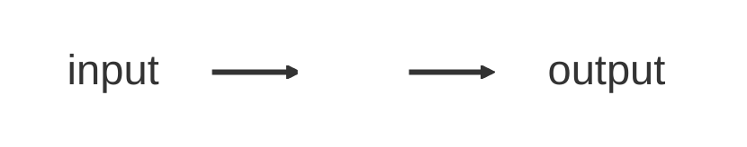

# Dr. Mindaugas Šarpis

# Best Research and Data Analysis Practices from CERN

## Crash Course on Computer Science

##### <span class="aims-badge">🔧 tool-agnostic · 📁 data & files</span>

<!--
Speaker: this lecture is the foundation layer — how a computer actually stores
the data you'll analyse. No coding today; it's the mental model everything else
rests on. Tool-agnostic and file-literate is the goal. (~1 min)
-->

---
layout: quote
hideInToc: true
---

# The main goal of this lecture is to promote **algorithmic thinking** and to provide a basic understanding of **computer science** concepts

---
hideInToc: true
---

# Learning **Objectives**

<div class="note-text mt-sm">By the end of this lecture, you will be able to:</div>

<div class="stack-tight mt-sm">

<div class="card card-primary card-glass pad-compact">

🧠 Trace how data is represented — **bits → bytes → numbers → text → files** — with a nod to how the CPU executes an **algorithm**

</div>

<div class="card card-secondary card-glass pad-compact">

🔢 Convert numbers between **binary**, **decimal**, and **hexadecimal**

</div>

<div class="card card-accent card-glass pad-compact">

🔤 Explain how text becomes bytes through **ASCII** and **UTF-8**

</div>

<div class="card card-success card-glass pad-compact">

📐 Predict **overflow** and **rounding** in fixed-width ints and floats

</div>

<div class="card card-warning card-glass pad-compact">

📁 See a file as a named sequence of **bytes** — format, size, encoding

</div>

</div>

<!--
Speaker: read these as promises, not a syllabus. Today is the mental model —
bits up to files — that everything later in the course sits on. The paired
Seminar 3 is where they inspect their own raw data as bytes. (~1 min)
-->

---
layout: center
hideInToc: true
---



---
hideInToc: true
---

# What is an <span class="gradient-text">Algorithm</span>?

<div class="card card-info card-glass pad-compact mt-sm glow">

An **algorithm** is a **finite sequence of well-defined instructions** to solve a problem — the recipe inside the "box."

</div>

<div class="grid-2 mt-md gap-md">

<div class="card card-primary card-glass pad-compact reveal-scale">

## 🍳 **Everyday Example**

1. Boil water → add pasta → wait 10 min
2. Drain → serve

**Input:** raw pasta → **Output:** cooked pasta

</div>

<div class="card card-secondary card-glass pad-compact reveal-scale">

## 📖 **Finding a Word in a Dictionary**

1. Open to the middle
2. Is your word before or after?
3. Go to the correct half, repeat

**Input:** "Python" → **Output:** page 742

</div>

</div>

---
hideInToc: true
---

# A Bit of Foresight

<div class="card card-info card-glass pad-tight mt-sm">

- Applicable to data analysis routines of **arbitrary complexity**
- You don't have to "see" your data (Excel, Origin, ...)
- You don't have to "see" your code (Python, R, C++, ...)
- You look at the **results** (or interim results: tests, plots, ...)
- Everything is managed from the top (workflow, pipeline, config files)

</div>

<div class="mt-md" style="text-align: center;">


</div>

---
layout: section
hideInToc: true
---

# Data **Representation**

Before we can write algorithms, we need to know what their inputs and outputs are made of — how data is actually stored inside the computer, from individual bits up to whole files.

<!--
Speaker: we build up from the smallest unit — bit → byte → number bases →
file sizes. Keep the pace brisk; the tally-marks and light-bulb slides land the
core idea that everything is just on/off switches. (~1 min)
-->

---
layout: fact
hideInToc: true
---

# Unary

## <v-click> **Base-1** </v-click>

<div class="note-text mt-md" style="opacity: 0.7;">

Already fluent in binary? Skim ahead to the hex slide — the payoff is how files decode.

</div>

---
layout: center
hideInToc: true
class: text-center
---

<div style="font-size: 5rem; letter-spacing: 0.15em;">
  <span v-click="1">|</span>
  <span v-click="2">|</span>
  <span v-click="3">|</span>
  <span v-click="4">|</span>
  <span v-click="5">|</span>
</div>

<div class="note-text mt-md">

Humans have always counted with tally marks — one mark per unit. It's the simplest possible number system, and a useful contrast before we meet the base computers actually use: binary.

</div>


---
layout: fact
hideInToc: true
---

# Binary

## <v-click> **Base-2** </v-click>

---
layout: center
hideInToc: true
class: text-center
---

# **0**


<style>
h1 {
  font-size: 6rem;
}
</style>


---
layout: center
hideInToc: true
class: text-center
---

# **1**


<style>
h1 {
  font-size: 6rem;
}
</style>

---
layout: fact
hideInToc: true
---

# Binary Digit

---
layout: fact
hideInToc: true
---

# Bi&nbsp;&nbsp;&nbsp;&nbsp;&nbsp;&nbsp;&nbsp;&nbsp;&nbsp;&nbsp;&nbsp;&nbsp;&nbsp;&nbsp;&nbsp;&nbsp;t

---
layout: fact
hideInToc: true
---

# Bit

---
hideInToc: true
layout: image
image: /figures/first_transistor.jpg
backgroundSize: contain
---

<div class="note-text" style="position: absolute; left: 0; right: 0; bottom: 1rem; text-align: center; text-shadow: 0 1px 6px rgba(0, 0, 0, 0.8);">
The first transistor (Bell Labs, 1947) — the physical switch behind every bit
</div>

---
hideInToc: true
---

<VideoPlayer src="Technology_Size_Comparison.mp4" autoplay   />

---
hideInToc: true
layout: fact
---

# Decimal

## <v-click> **Base-10** </v-click>

---
layout: center
hideInToc: true
class: text-center
---

<div class="powers">
<v-click at="3">
    <span>100</span> &nbsp;&nbsp;&nbsp;
</v-click>
<v-click at="2">
    <span>10</span> &nbsp;&nbsp;&nbsp;
</v-click>
<v-click at="1">
    <span>1</span>
    </v-click>
</div>

<div class="number"> 000</div>

<div class="expansion">

<v-click at="4">
    100 × 0 &nbsp; + &nbsp; 10 × 0 &nbsp; + &nbsp; 1 × 0
</v-click>
</div>

<style>
    .powers {
        font-size: 50px;
    }
    .number {
        font-size: 200px;
    }
    .expansion {
        font-size: 50px;
    }
</style>

---
layout: center
hideInToc: true
class: text-center
---

<div class="powers">
    <span>100</span> &nbsp;&nbsp;&nbsp;
    <span>10</span> &nbsp;&nbsp;&nbsp;
    <span>1</span>
</div>

<div class="number"> 004 </div>

<div class="expansion">
    100 × 0 &nbsp; + &nbsp; 10 × 0 &nbsp; + &nbsp; 1 × 4
</div>

<style>
    .powers {
        font-size: 50px;
    }
    .number {
        font-size: 200px;
    }
    .expansion {
        font-size: 50px;
    }
</style>

---
layout: center
hideInToc: true
class: text-center
---

<div class="powers">
    <span>100</span> &nbsp;&nbsp;&nbsp;
    <span>10</span> &nbsp;&nbsp;&nbsp;
    <span>1</span>
</div>

<div class="number"> 074 </div>

<div class="expansion">
    100 × 0 &nbsp; + &nbsp; 10 × 7 &nbsp; + &nbsp; 1 × 4
</div>

<style>
    .powers {
        font-size: 50px;
    }
    .number {
        font-size: 200px;
    }
    .expansion {
        font-size: 50px;
    }
</style>

---
layout: center
hideInToc: true
class: text-center
---

<div class="powers">
    <span>100</span> &nbsp;&nbsp;&nbsp;
    <span>10</span> &nbsp;&nbsp;&nbsp;
    <span>1</span>
</div>

<div class="number"> 974 </div>

<div class="expansion">
    100 × 9 &nbsp; + &nbsp; 10 × 7 &nbsp; + &nbsp; 1 × 4
</div>

<style>
    .powers {
        font-size: 50px;
    }
    .number {
        font-size: 200px;
    }
    .expansion {
        font-size: 50px;
    }
</style>

---
layout: center
hideInToc: true
class: text-center
---

<div class="powers">
    <span>2<sup>2</sup></span> &nbsp;&nbsp;&nbsp;
    <span>2<sup>1</sup></span> &nbsp;&nbsp;&nbsp;
    <span>2<sup>0</sup></span>
</div>

<div class="number"> 000</div>

<div class="expansion">
    4 × 0 &nbsp; + &nbsp; 2 × 0 &nbsp; + &nbsp; 1 × 0 = 0
</div>

<style>
    .powers {
        font-size: 50px;
    }
    .number {
        font-size: 200px;
    }
    .expansion {
        font-size: 50px;
    }
</style>

---
layout: center
hideInToc: true
class: text-center
---

<div class="powers">
    <span>2<sup>2</sup></span> &nbsp;&nbsp;&nbsp;
    <span>2<sup>1</sup></span> &nbsp;&nbsp;&nbsp;
    <span>2<sup>0</sup></span>
</div>
<div class="number"> 001</div>
<div class="expansion">
    4 × 0 &nbsp; + &nbsp; 2 × 0 &nbsp; + &nbsp; 1 × 1 = 1
</div>

<style>
    .powers {
        font-size: 50px;
    }
    .number {
        font-size: 200px;
    }
    .expansion {
        font-size: 50px;
    }
</style>

---
layout: center
hideInToc: true
class: text-center
---

<div class="powers">
    <span>2<sup>2</sup></span> &nbsp;&nbsp;&nbsp;
    <span>2<sup>1</sup></span> &nbsp;&nbsp;&nbsp;
    <span>2<sup>0</sup></span>
</div>
<div class="number"> 010</div>
<div class="expansion">
    4 × 0 &nbsp; + &nbsp; 2 × 1 &nbsp; + &nbsp; 1 × 0 = 2
</div>

<style>
    .powers {
        font-size: 50px;
    }
    .number {
        font-size: 200px;
    }
    .expansion {
        font-size: 50px;
    }
</style>

---
layout: center
hideInToc: true
class: text-center
---

<div class="powers">
    <span>2<sup>2</sup></span> &nbsp;&nbsp;&nbsp;
    <span>2<sup>1</sup></span> &nbsp;&nbsp;&nbsp;
    <span>2<sup>0</sup></span>
</div>
<div class="number"> 011</div>
<div class="expansion">
    4 × 0 &nbsp; + &nbsp; 2 × 1 &nbsp; + &nbsp; 1 × 1 = 3
</div>

<style>
    .powers {
        font-size: 50px;
    }
    .number {
        font-size: 200px;
    }
    .expansion {
        font-size: 50px;
    }
</style>

---
layout: center
hideInToc: true
class: text-center
---

<div class="powers">
    <span>2<sup>2</sup></span> &nbsp;&nbsp;&nbsp;
    <span>2<sup>1</sup></span> &nbsp;&nbsp;&nbsp;
    <span>2<sup>0</sup></span>
</div>
<div class="number"> 100</div>
<div class="expansion">
    4 × 1 &nbsp; + &nbsp; 2 × 0 &nbsp; + &nbsp; 1 × 0 = 4
</div>

<style>
    .powers {
        font-size: 50px;
    }
    .number {
        font-size: 200px;
    }
    .expansion {
        font-size: 50px;
    }
</style>

---
layout: fact
hideInToc: true
---

# Byte

---
layout: fact
hideInToc: true
---

# Byte = 8 bits

---
layout: fact
hideInToc: true
---

# 00000000

---
layout: fact
hideInToc: true
---

# 11111111

---
layout: fact
hideInToc: true
---

# 10011001

## <span>2<sup>8</sup></span> = 256 possible values

---
hideInToc: true
layout: fact
---

# Hexadecimal

## <v-click> **Base-16** </v-click>

---
layout: full
hideInToc: true
class: text-size-5.5
---

| **Decimal** | **Binary** | **Hex** | **Decimal** | **Binary** | **Hex** |
|-------------|------------|---------|-------------|------------|---------|
| 0           | 0000       | 0       | 8           | 1000       | 8       |
| 1           | 0001       | 1       | 9           | 1001       | 9       |
| 2           | 0010       | 2       | 10          | 1010       | A       |
| 3           | 0011       | 3       | 11          | 1011       | B       |
| 4           | 0100       | 4       | 12          | 1100       | C       |
| 5           | 0101       | 5       | 13          | 1101       | D       |
| 6           | 0110       | 6       | 14          | 1110       | E       |
| 7           | 0111       | 7       | 15          | 1111       | F       |

<style>
table {
  font-size: 0.9em;
}
td, th {
  padding-top: 0.3em;
  padding-bottom: 0.3em;
}
</style>

---
layout: center
hideInToc: true
class: text-center
---

# Hex Example: 0x2A

<div class="powers">
    <span>16<sup>1</sup></span> &nbsp;&nbsp;&nbsp;
    <span>16<sup>0</sup></span>
</div>

<div class="number"> 2A</div>

<div class="expansion">
    16 × 2 &nbsp; + &nbsp; 1 × 10 = 42
</div>

<style>
    .powers {
        font-size: 50px;
    }
    .number {
        font-size: 200px;
    }
    .expansion {
        font-size: 50px;
    }
</style>

---
hideInToc: true
---

# Why Hex in Computing?

<div class="stack-tight mt-sm">

<div class="card card-primary card-glass pad-compact">

🔢 **Compact** — 1 hex digit = 4 binary digits

</div>

<div class="card card-secondary card-glass pad-compact">

💾 **Memory addresses** — 0x1A2B3C4D

</div>

<div class="card card-accent card-glass pad-compact">

🎨 **Colors** — #FF5733 (red-green-blue)

</div>

<div class="card card-info card-glass pad-compact">

🐛 **Debugging** — Easier to read than long binary strings

</div>

</div>

---
hideInToc: true
---

# **Try It** — Think Like a CPU

<div class="card card-success card-glass pad-tight mt-sm">

## 🧮 **Find the Maximum, Step by Step**

Given a list, e.g. `[7, 2, 9, 4]` — work through it **one instruction at a time**, the way a processor would:

1. Set `max` = the first number
2. Look at the next number
3. Is it bigger than `max`? If yes, replace `max`
4. Repeat steps 2–3 until the list is exhausted
5. `max` now holds the answer

</div>

<div class="card card-info card-glass pad-compact mt-md">

💡 No shortcuts, no "just looking at it" — every step is explicit and repeatable. That's exactly what the CPU does later in this lecture, just with **fetch–decode–execute** instead of pen and paper.

</div>

---
hideInToc: true
---

# File Sizes: From Bits to Terabytes

<div class="card card-info card-glass pad-tight mt-sm">

| **Unit** | **Size** | **Everyday Reference** |
|----------|----------|------------------------|
| 1 Byte   | 8 bits   | A single character     |
| 1 KB     | ~1,000 bytes | A short email      |
| 1 MB     | ~1,000 KB | A photograph          |
| 1 GB     | ~1,000 MB | ~250 songs (MP3)      |
| 1 TB     | ~1,000 GB | ~500 hours of video   |

</div>

<div class="card card-warning card-glass pad-compact mt-md">

⚠️ Two conventions coexist: **decimal** kB/MB/GB (powers of 1,000 — SI, drive makers, this table) and **binary** KiB/MiB/GiB (powers of 1,024 — used internally by operating systems). A "1 TB" drive holds 10¹² bytes ≈ 931 GiB, which Windows then displays as "931 GB" — same bytes, different unit.

</div>

---
layout: section
hideInToc: true
---

# Binary **Operations**

Once numbers are bits, arithmetic and logic become operations on 0s and 1s — the building blocks of every computation.

<!--
Speaker: the payoff slide is fetch–decode–execute — an algorithm becomes numbers
that AND/OR/NOT circuits grind through. Tie the logic gates back to "software is
just data the CPU obeys." (~1 min)
-->

---
layout: center
hideInToc: true
class: text-size-10
---

$$
\phantom{111}  1011 \;\;(11 \text{ in decimal}) \\
+ \phantom{0.}  0110 \;\;(\phantom{0}6  \text{ in decimal}) \\
$$

$$
 \phantom{11} 10001 \;\;(17 \text{ in decimal})
$$

---
layout: center
hideInToc: true
class: text-center
---

# Logical Operations

<div class="grid grid-cols-3 gap-8 text-3xl">

<div>
<h3>AND (&)</h3>
<table class="mx-auto">
<thead>
<tr><th>A</th><th>B</th><th>A&B</th></tr>
</thead>
<tbody>
<tr><td>0</td><td>0</td><td>0</td></tr>
<tr><td>0</td><td>1</td><td>0</td></tr>
<tr><td>1</td><td>0</td><td>0</td></tr>
<tr><td>1</td><td>1</td><td>1</td></tr>
</tbody>
</table>
</div>

<div>
<h3>OR (|)</h3>
<table class="mx-auto">
<thead>
<tr><th>A</th><th>B</th><th>A|B</th></tr>
</thead>
<tbody>
<tr><td>0</td><td>0</td><td>0</td></tr>
<tr><td>0</td><td>1</td><td>1</td></tr>
<tr><td>1</td><td>0</td><td>1</td></tr>
<tr><td>1</td><td>1</td><td>1</td></tr>
</tbody>
</table>
</div>

<div>
<h3>NOT (~)</h3>
<table class="mx-auto">
<thead>
<tr><th>A</th><th>~A</th></tr>
</thead>
<tbody>
<tr><td>0</td><td>1</td></tr>
<tr><td>1</td><td>0</td></tr>
</tbody>
</table>
</div>

</div>

---
hideInToc: true
---

# Bitwise Operations Example

<div class="note-text">

*A preview in Python — the language itself is introduced later in the course.*

</div>

<div class="card card-primary card-glass pad-tight mt-sm">

**Used in:** data compression, cryptography, bit manipulation

```python
a = 0b1100  # 12 in decimal
b = 0b1010  # 10 in decimal

print(f"a & b = {a & b:04b}")  # 1000 (8)
print(f"a | b = {a | b:04b}")  # 1110 (14)
print(f"~a = {~a & 0b1111:04b}")  # 0011 (3)
```

</div>

---
hideInToc: true
---

# How the CPU Runs an Algorithm

<div class="card card-info card-glass pad-compact mt-sm glow">

🔄 A processor does one astonishingly simple thing, billions of times per second — the **fetch–decode–execute** cycle.

</div>

<div class="stack-tight mt-md">

<div class="card card-primary card-glass pad-compact reveal-left">

📥 **Fetch** — read the next instruction (itself just a binary number) from memory

</div>

<div class="card card-secondary card-glass pad-compact reveal-left">

🔎 **Decode** — work out what it says: "add these", "compare those", "jump there"

</div>

<div class="card card-accent card-glass pad-compact reveal-left">

⚡ **Execute** — run it through circuits built from exactly the logic gates you just saw

</div>

</div>

<div class="card card-success card-glass pad-compact mt-md reveal-up">

💡 That's the whole trick: an **algorithm** becomes a list of instructions, instructions become **numbers**, and AND/OR/NOT circuits grind through them. Software is just data the CPU knows how to obey.

</div>

---
hideInToc: true
---

# The Memory Hierarchy

<div class="card card-info card-glass pad-compact mt-sm">

⏱️ Not all storage is equal — each step away from the CPU is **bigger but dramatically slower**.

</div>

<div class="stack-tight mt-md">

<div class="card card-primary card-glass pad-compact reveal-left">

🏎️ **Registers** — inside the CPU · a few hundred bytes · < 1 ns

</div>

<div class="card card-secondary card-glass pad-compact reveal-left">

⚡ **Cache** — on the CPU chip · megabytes · a few ns

</div>

<div class="card card-accent card-glass pad-compact reveal-left">

🧠 **RAM** — main memory · gigabytes · ~100 ns · gone at power-off

</div>

<div class="card card-warning card-glass pad-compact reveal-left">

💽 **Disk (SSD/HDD)** — terabytes · ~0.1–10 ms · **a million times slower than registers**

</div>

</div>

<div class="card card-success card-glass pad-compact mt-md reveal-up">

💡 This is why "my dataset doesn't fit in memory" changes everything — and why the *format* and *size* of your files (this lecture!) directly set how fast your analysis can possibly run.

</div>

---
layout: fact
hideInToc: true
---

# ASCII

## American Standard Code for Information Interchange

### 7-bit

---
hideInToc: true
class: text-size-5
---

|  |  |  |  |  |  |  |  |  |  |  |  |  |  |  |  |
|---------|----------|---------|----------|---------|----------|---------|----------|---------|----------|---------|----------|---------|----------|---------|----------|
|   0     | **NUL**  |   16    | **DLE**  |   32    | **SP**   |   48    | **0**    |   64    | **@**    |   80    | **P**    |   96    | **`**    |  112    | **p**    |
|   1     | **SOH**  |   17    | **DC1**  |   33    | **!**    |   49    | **1**    |   65    | **A**    |   81    | **Q**    |   97    | **a**    |  113    | **q**    |
|   2     | **STX**  |   18    | **DC2**  |   34    | **"**    |   50    | **2**    |   66    | **B**    |   82    | **R**    |   98    | **b**    |  114    | **r**    |
|   3     | **ETX**  |   19    | **DC3**  |   35    | **#**    |   51    | **3**    |   67    | **C**    |   83    | **S**    |   99    | **c**    |  115    | **s**    |
|   4     | **EOT**  |   20    | **DC4**  |   36    | **$**    |   52    | **4**    |   68    | **D**    |   84    | **T**    |  100    | **d**    |  116    | **t**    |
|   5     | **ENQ**  |   21    | **NAK**  |   37    | **%**    |   53    | **5**    |   69    | **E**    |   85    | **U**    |  101    | **e**    |  117    | **u**    |
|   6     | **ACK**  |   22    | **SYN**  |   38    | **&**    |   54    | **6**    |   70    | **F**    |   86    | **V**    |  102    | **f**    |  118    | **v**    |
|   7     | **BEL**  |   23    | **ETB**  |   39    | **'**    |   55    | **7**    |   71    | **G**    |   87    | **W**    |  103    | **g**    |  119    | **w**    |

*(excerpt — first 8 rows of each block)*

---
hideInToc: true
layout: section
---

# Text Beyond **ASCII**

---
hideInToc: true
---

# Unicode and UTF-8

<div class="grid-2 mt-md gap-md">

<div class="card card-primary card-glass pad-tight">

## 🌐 **Unicode**

Universally encodes characters as code points

- U+0041 = 'A'
- U+03B1 = 'α'
- U+1F600 = '😀'

</div>

<div class="card card-secondary card-glass pad-tight">

## 📦 **UTF-8**

Stores code points in 1–4 bytes, backward-compatible with ASCII

**Pitfalls in data:** smart quotes, emojis, mixed encodings, BOM (a hidden byte-order marker at the start of a file that can break parsing)

</div>

</div>

---
hideInToc: true
---

# Python for Encoding Conversions

<div class="note-text">

*A preview — Python itself is introduced in the Crash Course on Python later in the course.*

</div>

<div class="card card-accent card-glass pad-tight mt-sm">

```python
# Python: bytes vs str and UTF-8
s = "Å and 😊"         # str = Unicode
b = s.encode("utf-8")  # bytes
len(s), len(b)         # chars vs bytes

b.decode("utf-8")      # back to str
```

</div>

---
hideInToc: true
---

# From Characters to Multi-Byte Values

<div class="card card-accent card-glass pad-tight mt-sm">

## 🧩 **So Far**

We've seen how individual characters are encoded — one byte for ASCII, up to four bytes for UTF-8.

But what happens when we need to store **numbers** that span multiple bytes — like a 32-bit integer or a floating-point value? The next question becomes: **in what order** do those bytes go?

</div>

---
hideInToc: true
---

# Endianness

<div class="card card-info card-glass pad-compact mt-sm">

## 🔄 **What is Endianness?**

The **order** in which bytes of a multibyte value are stored in memory.

</div>

<div class="grid-2 mt-md gap-md">

<div class="card card-primary card-glass pad-compact">

## 📦 **Big-Endian**

Most significant byte stored **first** (lowest address)

`0x12345678` → `12 34 56 78`

Used by: **network protocols** (TCP/IP)

</div>

<div class="card card-secondary card-glass pad-compact">

## 📦 **Little-Endian**

Least significant byte stored **first** (lowest address)

`0x12345678` → `78 56 34 12`

Used by: **x86/x64** and (typically) **ARM** — most PCs & phones

</div>

</div>

<div class="card card-warning card-glass pad-compact mt-sm">

⚠️ Mismatched endianness → garbage values. NumPy *(a Python library you'll meet later in the course)* lets you say which you mean: `dtype='>f4'` (big) or `dtype='<f4'` (little).

</div>

---
hideInToc: true
---

# File Formats (Extensions)

<div class="card card-info card-glass pad-tight mt-sm">

**The computer needs to know what a sequence of bits is supposed to mean**

| **Text/Data** | **Documents** | **Media/Archives/Exec** |
|--------------|---------------|----------------|
| .txt        | .pdf          | .mp3           |
| .csv        | .docx         | .mp4           |
| .json       | .pptx         | .zip           |
| .xml        | .xlsx         | .rar           |
| .yaml       | .rtf          | .exe           |
| .md         | .odt          | .apk           |

</div>

---
hideInToc: true
---

# Image Quality vs Bit Depth

<div class="card card-info card-glass pad-tight mt-sm">

Below are five versions of the same image, saved with **different bit depths**. Notice how fewer bits reduce both **image quality** and **file size**.

</div>

<div class="grid grid-cols-5 gap-4 mt-md">
  <figure>
    
    <figcaption class="text-center mt-2">24 bit</figcaption>
  </figure>
  <figure>
    
    <figcaption class="text-center mt-2">4 bit</figcaption>
  </figure>
  <figure>
    
    <figcaption class="text-center mt-2">3 bit</figcaption>
  </figure>
  <figure>
    
    <figcaption class="text-center mt-2">2 bit</figcaption>
  </figure>
  <figure>
    
    <figcaption class="text-center mt-2">1 bit</figcaption>
  </figure>
</div>

---
hideInToc: true
---

# From Pixels to Precision

<div class="card card-accent card-glass pad-tight mt-sm">

## 🔢 **The Same Trade-Off, Different Domain**

We just saw how **bit depth** affects image quality — more bits per pixel means more colors and finer gradients. The exact same principle applies to **numbers**: more bits per value means greater range and precision. Let's see how computers represent numbers and what happens when those bits run out.

</div>

---
layout: section
hideInToc: true
---

# Numbers in **Computers**

<!--
Speaker: the two big gotchas live here — fixed-width integer overflow (values
wrap silently) and floating-point rounding (0.1 + 0.2 ≠ 0.3). Both bite real
analyses; the MCQ checks the 16-bit case. (~1 min)
-->

---
hideInToc: true
---

# Integers: Fixed Width

<div class="card card-info card-glass pad-compact mt-sm">

🔢 Hardware stores whole numbers in a **fixed number of bits** — the width decides the range, and stepping past it **wraps around** (overflow).

</div>

<div class="grid-2 mt-md gap-md">

<div class="card card-primary card-glass pad-tight">

## 📏 **Common widths**

| bits | unsigned range |
|------|----------------|
| 8    | 0 … 255 |
| 16   | 0 … 65,535 |
| 32   | 0 … ~4.3 × 10⁹ |
| 64   | 0 … ~1.8 × 10¹⁹ |

</div>

<div class="card card-warning card-glass pad-tight">

## 💥 **Overflow**

At 8 bits: `255 + 1 = 0`

The famous **Y2K38 problem**: 32-bit Unix time runs out on 19 Jan 2038.

*(Python's own `int` grows as needed — but NumPy arrays and files use fixed widths.)*

</div>

</div>

<div class="card card-success card-glass pad-compact mt-md">

💡 Choosing a width is a **trade-off**: smaller = less memory per value, larger = more headroom. Data formats make you choose.

</div>

<style>
table { font-size: 0.85em; }
td, th { padding-top: 0.25em; padding-bottom: 0.25em; }
</style>

---
hideInToc: true
---

# Negative Numbers: Two's Complement

<div class="card card-info card-glass pad-compact mt-sm">

➖ There is no minus sign in hardware — negative integers are encoded by convention. The winner: **two's complement**.

</div>

<div class="grid-2 mt-md gap-md">

<div class="card card-primary card-glass pad-tight">

## 🧮 **The recipe** *(4-bit example)*

To get −5 from 5:

1. Start: `0101` (= 5)
2. Flip every bit: `1010`
3. Add one: `1011` (= −5)

Top bit set ⇒ negative.

</div>

<div class="card card-accent card-glass pad-tight">

## ✨ **Why it's clever**

Addition just works — no special subtraction circuit:

```text
  0101   (+5)
+ 1011   (−5)
------
 10000 → 0000 = 0 ✓
```

*(the carry falls off the fixed width)*

</div>

</div>

<div class="card card-warning card-glass pad-compact mt-md">

📏 Signed ranges are asymmetric: 8 bits → **−128 … +127** — one more negative than positive.

</div>

---
hideInToc: true
---

<MCQ
  question="Using the two's-complement recipe just shown, what decimal value does the 4-bit pattern 1011 represent?"
  :options="[
    '11',
    '−5',
    '5',
    '−3'
  ]"
  :correct="1"
  explanation="Flip 1011 → 0100, add one → 0101 = 5, so 1011 is −5 — exactly the worked example on the previous slide. The top bit signals negative; you still recover the magnitude by inverting and adding one."
/>

---
hideInToc: true
---

<MCQ
  question="A detector writes each reading as a 2-byte (16-bit) unsigned integer. How many distinct values can one reading take?"
  :options="[
    '256',
    '65,536',
    '32,768',
    '16'
  ]"
  :correct="1"
  explanation="16 bits give 2^16 = 65,536 distinct values (0 … 65,535). Each extra bit doubles the count — 2 bytes is 256 × 256. If your sensor can exceed that, you need a wider type or values silently wrap."
/>

---
hideInToc: true
---

# Floating-Point Basics (IEEE-754)

<div class="card card-info card-glass pad-tight mt-sm">

**Float** = sign + exponent + mantissa (binary scientific notation)

**Finite precision** — rounding error; some decimals not exact in binary

</div>

<div class="grid-3 mt-md gap-md">

<div class="card card-primary card-glass pad-compact">

**Sign bit** (1 bit) — positive / negative

</div>

<div class="card card-secondary card-glass pad-compact">

**Exponent** (8 bits in float32) — scale (power of 2)

</div>

<div class="card card-accent card-glass pad-compact">

**Mantissa** (23 bits in float32) — precision bits (significant figures)

</div>

</div>

---
hideInToc: true
---

# Scientific Notation in Decimal

<div class="text-center text-5xl my-8">

$N = s \times m \times 10^e$

</div>

<div class="grid-3 mt-md gap-md">

<div class="card card-primary card-glass pad-compact">

**s** = sign (+1 or -1)

</div>

<div class="card card-secondary card-glass pad-compact">

**m** = mantissa (significant digits, 1 $\leq$ m $<$ 10)

</div>

<div class="card card-accent card-glass pad-compact">

**e** = exponent (integer power of 10)

</div>

</div>

---
hideInToc: true
---

# Scientific Notation in Decimal

<div class="text-center text-5xl my-8">

$-6.022 \times 10^{23}$

</div>

<div class="grid-3 mt-md gap-md">

<div class="card card-warning card-glass pad-compact">

**Sign** = negative

</div>

<div class="card card-primary card-glass pad-compact">

**Mantissa** = 6.022

</div>

<div class="card card-secondary card-glass pad-compact">

**Exponent** = 23

</div>

</div>

---
hideInToc: true
---

# Binary Scientific Notation (float32)

<div class="text-center text-3xl my-8">

  $(-1)^{s} \times 1.m \times 2^{e - b}$

</div>

<div class="grid-2 mt-md gap-md">

<div class="card card-primary card-glass pad-compact">

**s** = sign bit (0 = positive, 1 = negative)

</div>

<div class="card card-secondary card-glass pad-compact">

**m** = mantissa (fraction bits; the significand 1.m satisfies 1 $\leq$ 1.m $<$ 2)

</div>

<div class="card card-accent card-glass pad-compact">

**e** = exponent (integer power of 2)

</div>

<div class="card card-info card-glass pad-compact">

**b** = exponent bias (127 for float32)

</div>

</div>

---
hideInToc: true
---

# Binary Scientific Notation (float32)

<div class="text-center text-3xl my-4">

  $(-1)^{0} \times 1.m \times 2^{e - b}$

</div>

<div class="card card-primary card-glass pad-tight mt-sm">

- 5.75 → 101.11₂
- In scientific notation: $1.0111_2 \times 2^2$
- **s** = 0 (positive)
- **m** = 01110000000000000000000
- **e** = 2, stored as e + bias = 2 + 127 = 129 = 10000001₂
- **b** = 127 (float32 exponent bias)

</div>

<div class="text-center text-3xl mt-md">

`0 10000001 01110000000000000000000`

</div>

---
hideInToc: true
---

# Floating-Point Gotchas

<div class="card card-warning card-glass pad-tight mt-md">

## ⚠️ **Not all decimals are exact in binary**

```python
print(0.1 + 0.2)            # 0.30000000000000004 (!)
print(0.1 + 0.2 == 0.3)     # False

# Use tolerance for comparisons
import math
math.isclose(0.1 + 0.2, 0.3)  # True
```

**Why?** 0.1 is a repeating fraction in binary (like 1/3 in decimal). Finite bits mean rounding.

</div>

<div class="grid-2 mt-md gap-md">

<div class="card card-primary card-glass pad-compact">

🔢 **float32** — ~7 significant digits

</div>

<div class="card card-secondary card-glass pad-compact">

🔢 **float64** — ~15 significant digits (Python default)

</div>

</div>

---
hideInToc: true
---

# Try It in Your Terminal!

<div class="card card-success card-glass pad-tight mt-md">

## 🧪 **Live Demo**

Open a terminal and type `python3` (or `python`), then try:

```python
>>> 0.1 + 0.2
>>> 0.1 + 0.2 == 0.3
>>> f"{0.1:.20f}"
```

</div>

<div class="card card-info card-glass pad-compact mt-md">

💡 These aren't bugs — it's how **all** computers store decimals. This will matter when we compare measurements in later lectures.

</div>

---
hideInToc: true
---

# Integers, Overflow, and Arrays

<div class="grid-2 mt-md gap-md">

<div class="stack-tight">

<div class="card card-primary card-glass pad-compact">

🐍 Python ints are **arbitrary precision** — no overflow possible

</div>

<div class="card card-secondary card-glass pad-compact">

📊 NumPy/C arrays use **fixed-width** ints (int8, int16, int32, int64)

</div>

<div class="card card-warning card-glass pad-compact">

⚠️ **Overflow** wraps silently in fixed-width types

</div>

</div>

<div class="card card-accent card-glass pad-tight">

## 🔢 **Overflow Example**

```python
import numpy as np

a = np.int8(127)   # max value for 8-bit signed
print(a + 1)       # -128 (wraps around!)

b = np.int8(-128)  # min value
print(b - 1)       # 127 (wraps around!)
```

This matters when choosing dtypes in NumPy — always use a wide enough type for your data range.

</div>

</div>

---
hideInToc: true
---

# Data Types in Practice

<div class="grid-2 mt-md gap-md">

<div class="card card-primary card-glass pad-compact reveal-scale">

🔢 **Integers** (`int`) — `42`, `-7`, `0` — fixed-width binary (arbitrary precision in Python)

</div>

<div class="card card-secondary card-glass pad-compact reveal-scale">

📐 **Floats** (`float`) — `3.14`, `6.022e23` — IEEE-754, watch for rounding!

</div>

<div class="card card-accent card-glass pad-compact reveal-scale">

🔤 **Strings** (`str`) — `"Hello"`, `"α"` — Unicode characters, encoded as UTF-8

</div>

<div class="card card-success card-glass pad-compact reveal-scale">

✅ **Booleans** (`bool`) — `True` / `False` — conceptually a single bit, the basis of all decisions

</div>

</div>

<div class="card card-info card-glass pad-compact mt-md">

💡 Every piece of data in your programs is one of these types. Choosing the right one matters for correctness, memory, and performance.

</div>

---
layout: section
hideInToc: true
---

# Compression & **Integrity**

The same bits can be reorganized to take up less space — and checked to make sure none of them were corrupted along the way.

<!--
Speaker: short section. Lossless vs lossy, then checksums and hashes for
integrity. Land the point that a SHA-256 hash is how you prove a file arrived
intact — directly relevant to trusting a downloaded dataset. (~1 min)
-->

---
hideInToc: true
---

# Compression Primer

<div class="grid-2 mt-md gap-md">

<div class="card card-success card-glass pad-tight">

## 🔒 **Lossless**

Algorithms (RLE, Huffman, DEFLATE — used inside PNG, ZIP, gzip) shrink data with **exact** recovery

*(Plain-text formats like CSV and JSON aren't compressed at all — every byte stored as-is. That's exactly why they zip so well.)*

</div>

<div class="card card-warning card-glass pad-tight">

## 📉 **Lossy**

JPEG, MP3 — small size, info loss acceptable for media

</div>

</div>

<div class="card card-info card-glass pad-tight mt-md">

💡 **Intuition:** remove redundancy (RLE, Huffman, dictionary coding)

</div>

<div class="card card-accent card-glass pad-compact mt-md">

🔤 **RLE example:** `AAABBBCC` → `3A3B2C` (8 chars → 6 chars)

</div>

---
hideInToc: true
---

# Error Detection & Hashing

<div class="grid-2 mt-md gap-md">

<div class="card card-primary card-glass pad-tight">

## 🔍 **Error Detection**

Parity, checksums, CRC detect transfer/storage errors

</div>

<div class="card card-secondary card-glass pad-tight">

## 🔐 **Hashing**

Cryptographic hashes (SHA-256) verify file integrity

</div>

</div>

---
hideInToc: true
---

<MCQ
  question="What is a file, at the simplest level?"
  :options="[
    'A window shown on the screen',
    'A named sequence of bytes stored by the operating system',
    'A running program in memory',
    'A network connection to another computer'
  ]"
  :correct="1"
  explanation="Everything on disk — text, images, programs — is ultimately a named blob of bytes the OS keeps track of. A file extension is only a convention for how to interpret those bytes."
/>

---
hideInToc: true
---

# Key <span class="gradient-text">Takeaways</span>

<div class="stack-tight mt-sm">

<div class="card card-primary card-glass pad-compact reveal-up">

💡 **Bits** — everything in a computer is 0s and 1s; a bit is the smallest unit of information

</div>

<div class="card card-secondary card-glass pad-compact reveal-up">

🔢 **Numbers** — place value (binary, hex) plus finite precision (fixed-width ints, IEEE-754 floats)

</div>

<div class="card card-accent card-glass pad-compact reveal-up">

🔤 **Text** — encodings (ASCII, Unicode/UTF-8) map characters to bytes

</div>

<div class="card card-info card-glass pad-compact reveal-up">

📁 **Files** — formats, byte order, and bit depth tell the computer what a sequence of bits means

</div>

<div class="card card-success card-glass pad-compact reveal-up">

🗜️ **Compression & integrity** — remove redundancy to shrink data; checksums and hashes catch corruption

</div>

</div>

<div class="card card-warning card-glass pad-compact mt-md reveal-up">

🧭 Back to the "box": before writing algorithms, you need to know what their **inputs** and **outputs** are made of.

</div>

---
hideInToc: true
---

# **Recap** — You Can Now…

<div class="grid-2 gap-md mt-sm">

<div class="card card-success card-glass pad-compact">

✅ Convert between **binary**, **decimal**, and **hexadecimal**

</div>

<div class="card card-success card-glass pad-compact">

✅ Reason about **bits**, **bytes**, and real file sizes

</div>

<div class="card card-success card-glass pad-compact">

✅ Explain how text and numbers are encoded as **bytes**

</div>

<div class="card card-success card-glass pad-compact">

✅ Spot **overflow** and **rounding** limits in ints and floats

</div>

</div>

<div class="card card-accent card-glass pad-tight mt-md">

## 🔬 **Seminar 3 tie-in**

inspect your raw data file as bytes — its character encoding, exact size, and format — before trusting a single number in it.

</div>

<!--
Speaker: the "you can now" beat — have them nod along to each. The tie-in makes
it concrete: in Seminar 3 they open their own dataset at the byte level and
verify its encoding, size, and format before trusting any number. (~1 min)
-->
