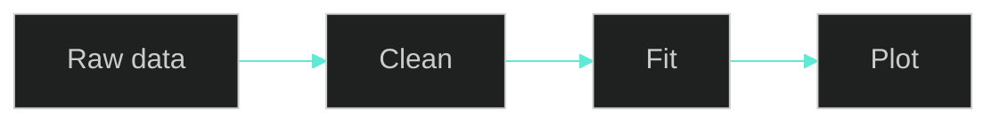
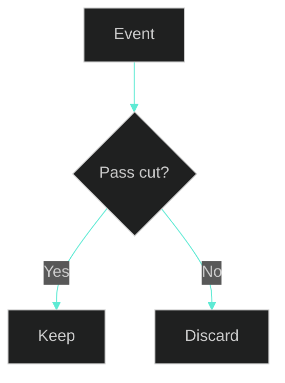
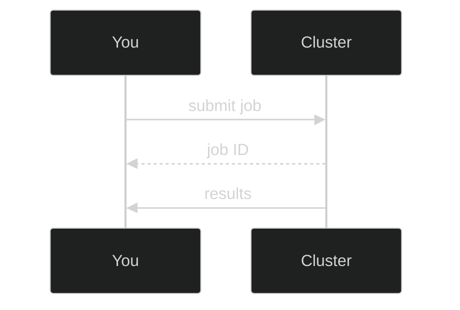
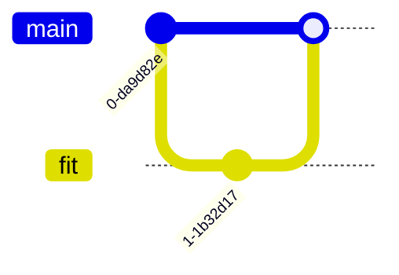

# Dr. Mindaugas Šarpis

# Best Research and Data Analysis Practices from CERN

## Markdown & VS Code

##### <span class="aims-badge">🔧 tool-agnostic · ♻️ reproducibility</span>

<!--
Speaker: two tools in one lecture — Markdown (what you write) and VS Code (the
workshop you write it in). Both are portable, tool-agnostic skills they'll use
for the rest of the course. (~1 min)
-->

---
hideInToc: true
layout: quote
---

# Markdown turns **plain text** into beautifully formatted documents. Learn the syntax once, and you can write READMEs, documentation, notebooks, presentations, and scientific reports — all from a simple text editor.

---
hideInToc: true
---

# Learning **Objectives**

<div class="note-text mt-sm">By the end of this lecture, you will be able to:</div>

<div class="grid-2 gap-md mt-sm">

<div class="card card-primary card-glass pad-compact">

📝 Write formatted documents in **Markdown** — headers, emphasis, lists

</div>

<div class="card card-secondary card-glass pad-compact">

📊 Add **tables**, **code blocks**, and **task lists** to your writing

</div>

<div class="card card-info card-glass pad-compact">

🧭 Describe workflows as **Mermaid diagrams** — pictures written as plain text

</div>

<div class="card card-accent card-glass pad-compact">

📄 Structure a project **README** and publish Markdown via **pandoc** & **MkDocs**

</div>

<div class="card card-success card-glass pad-compact">

🖥️ Navigate **VS Code** — the sidebar, editor, and integrated terminal

</div>

<div class="card card-warning card-glass pad-compact">

🎯 Drive the editor from the **Command Palette**, not menus

</div>

<div class="card card-primary card-glass pad-compact">

⚡ Edit at speed — **multi-cursor**, **regex find & replace**, snippets, diff view

</div>

<div class="card card-secondary card-glass pad-compact">

🧩 Extend VS Code with **extensions** for Python, Markdown, data files, and remote work

</div>

</div>

<!--
Speaker: read these as promises, not a syllabus. Markdown first, then the VS Code
workshop where they write it. Point at Seminar 5, where they document their own
project's README. (~1 min)
-->

---
hideInToc: true
---

# <span class="gradient-text">Markdown</span>

<div class="card card-info card-glass pad-tight reveal-left">

## 📝 **What is Markdown?**

- **Lightweight markup language** with plain text formatting syntax
- **Converts** plain text to **HTML**
- **Easy to read** and **write**
- **Simple** and **intuitive**

</div>

<div class="grid-2 mt-md gap-md">

<div class="card card-primary card-glass pad-tight reveal-up">

## 🎯 **Purpose**

📄 Documentation • 📓 Notebooks • 🖥️ Presentations • 🌐 Websites • 📊 Scientific reports

</div>

<div class="card card-secondary card-glass pad-tight reveal-up">

## 🔧 **Used In**

GitHub READMEs • Jupyter Notebooks • Slidev • Jekyll • Hugo • Obsidian • Notion

<div class="note-text mt-sm">Remember using <code>touch README.md</code> from the CLI? That file was Markdown!</div>

</div>

</div>

---
hideInToc: true
layout: section
---

# Markdown **Syntax**

<!--
Speaker: the whole language is a handful of symbols — #, *, -, [], `, |. By the
end of this section they will know ~90% of the Markdown they'll ever use. (~30 sec)
-->

---
hideInToc: true
---

# Markdown Syntax: Headers

<div class="grid-2 mt-md gap-md">

<div class="card card-primary card-glass pad-tight">

## ✏️ **Syntax**

```
# Header 1
## Header 2
### Header 3
#### Header 4
##### Header 5
###### Header 6
```

<div class="note-text mt-sm">Use <code>#</code> for different header levels — more <code>#</code> symbols mean smaller headers</div>

</div>

<div class="card card-secondary card-glass pad-compact">

## 👁️ **Rendered Output**

<p style="font-size: 1.6em; font-weight: bold; margin: 0.15em 0;"><code>#</code> Header 1 — largest</p>
<p style="font-size: 1.35em; font-weight: bold; margin: 0.15em 0;"><code>##</code> Header 2</p>
<p style="font-size: 1.15em; font-weight: bold; margin: 0.15em 0;"><code>###</code> Header 3</p>
<p style="font-size: 1.0em; font-weight: bold; margin: 0.15em 0;"><code>####</code> Header 4</p>
<p style="font-size: 0.9em; font-weight: bold; margin: 0.15em 0;"><code>#####</code> Header 5 — getting small</p>
<p style="font-size: 0.8em; font-weight: bold; margin: 0.15em 0;"><code>######</code> Header 6 — smallest</p>

</div>

</div>

---
hideInToc: true
---

# Markdown Syntax: Emphasis

<div class="grid-2 mt-md gap-md">

<div class="card card-primary card-glass pad-tight">

## ✏️ **Syntax**

```
*Italic* or _Italic_
**Bold** or __Bold__
~~Strikethrough~~
```

<div class="note-text mt-sm">Combine them: <code>***bold italic***</code> or <code>**~~bold strikethrough~~**</code></div>

</div>

<div class="card card-secondary card-glass pad-tight">

## 👁️ **Rendered Output**

<div class="mt-md">

## *Italic*

## **Bold**

## ~~Strikethrough~~

</div>

</div>

</div>

---
hideInToc: true
---

# Paragraphs & Line Breaks

<div class="grid-2 mt-md gap-md">

<div class="card card-primary card-glass pad-tight">

## ✏️ **Paragraphs**

```
This is the first paragraph.

This is the second paragraph.
(Separated by a blank line.)
```

</div>

<div class="card card-secondary card-glass pad-tight">

## ↩️ **Line Breaks**

```
First line with two spaces at the end.··
Second line appears below.
```

<div class="note-text mt-sm">Add <strong>two spaces</strong> at the end of a line (shown as <code>··</code> in the example), or use <code>&lt;br&gt;</code>, to force a line break <em>within</em> the same paragraph. Without them, adjacent lines merge into one.</div>

</div>

</div>

<div class="card card-warning card-glass pad-tight mt-md">

## ⚠️ **Common Beginner Mistake**

Pressing Enter once does **not** create a new line in the output — Markdown joins adjacent lines into a single paragraph. Use a **blank line** for a new paragraph, or **two trailing spaces** for a line break.

</div>

---
hideInToc: true
---

# Lists: Ordered & Unordered

<div class="grid-2 mt-md gap-md">

<div class="card card-primary card-glass pad-tight">

## ✏️ **Unordered List**

```
- Item 1
- Item 2
  - Subitem 1
  - Subitem 2
```

## ✏️ **Ordered List**

```
1. First
2. Second
3. Third
```

</div>

<div class="card card-secondary card-glass pad-tight">

## 👁️ **Rendered Output**

- Item 1
- Item 2
  - Subitem 1
  - Subitem 2

<div class="mt-sm">

1. First
2. Second
3. Third

</div>

<div class="note-text mt-sm">You can use <code>-</code>, <code>*</code>, or <code>+</code> for unordered lists. Indent with 2 or 4 spaces for nesting.</div>

</div>

</div>

---
hideInToc: true
---

# Lists: Task Lists

<div class="grid-2 mt-md gap-md">

<div class="card card-primary card-glass pad-tight">

## ✏️ **Task List Syntax**

```
- [x] Task 1 (completed)
- [ ] Task 2 (pending)
- [ ] Task 3 (pending)
```

<div class="note-text mt-sm"><code>[x]</code> marks a task as done, <code>[ ]</code> leaves it unchecked. Supported on GitHub, GitLab, and many editors.</div>

</div>

<div class="card card-secondary card-glass pad-tight">

## 👁️ **Rendered Output**

<div class="mt-md">

- [x] Task 1 (completed)
- [ ] Task 2 (pending)
- [ ] Task 3 (pending)

</div>

</div>

</div>

<div class="card card-info card-glass pad-tight mt-md">

## 💡 **Where Task Lists Shine**

Task lists are widely used in **GitHub Issues** and **Pull Requests** to track progress on work items, code review steps, and release checklists.

</div>

---
hideInToc: true
---

# Links & Images

<div class="grid-2 mt-md gap-md">

<div class="card card-primary card-glass pad-tight">

## 🔗 **Links**

```
[CERN](https://home.cern)
```

<div class="mt-sm">

## [CERN](https://home.cern)

</div>

<div class="note-text mt-sm">For a document with many links, <strong>reference style</strong> keeps prose readable: <code>[CERN][1]</code> in the text, <code>[1]: https://home.cern</code> at the bottom.</div>

</div>

<div class="card card-secondary card-glass pad-tight">

## 🖼️ **Images**

```

```

<div class="mt-sm">


</div>

</div>

</div>

---
hideInToc: true
---

# Code Blocks

<div class="card card-info card-glass pad-tight">

## 💻 **Inline Code**

```
Use `inline code` within a sentence.
```

</div>

<div class="grid-2 mt-md gap-md">

<div class="card card-primary card-glass pad-tight">

## 📦 **Code Block**

- Wrap code in triple backticks to create a code block

```
function hello() {
  console.log("Hello, world!");
}
```

</div>

<div class="card card-accent card-glass pad-tight">

## 🎨 **Syntax Highlighting**

- Add the language name after the first set of backticks
- For example, `python`

```python
def hello():
    print("Hello, world!")
```

</div>

</div>

---
hideInToc: true
---

# Blockquotes & Horizontal Rules

<div class="grid-2 mt-md gap-md">

<div class="card card-primary card-glass pad-tight">

## ✏️ **Blockquotes**

```
> This is a blockquote.
> It can span multiple lines.
```

## ✏️ **Horizontal Rule**

```
---
```

</div>

<div class="card card-secondary card-glass pad-tight">

## 👁️ **Rendered Output**

> This is a blockquote.
> It can span multiple lines.

<div class="mt-md">

***

</div>

<div class="note-text mt-sm">Blockquotes are great for highlighting quotations or important notes. Horizontal rules (<code>---</code>, <code>***</code>, or <code>___</code>) create visual separators between sections.</div>

</div>

</div>

---
hideInToc: true
---

# Tables

<div class="grid-2 mt-md gap-md">

<div class="card card-primary card-glass pad-tight">

## ✏️ **Table Syntax**

```
| Syntax    | Description |
|-----------|-------------|
| Header    | Title       |
| Cell      | Data        |
```

<div class="note-text mt-sm">Use <code>|</code> to separate columns and <code>---</code> for the header row separator. Colons control alignment: <code>:---</code> left, <code>:---:</code> center, <code>---:</code> right.</div>

</div>

<div class="card card-secondary card-glass pad-tight">

## 👁️ **Rendered Output**

<div class="mt-md">

| Syntax | Description |
|--------|------------|
| Header | Title      |
| Cell   | Data       |

</div>

## ✏️ **Aligned Columns**

```
| Left   | Center | Right |
|:-------|:------:|------:|
| data   | data   | data  |
```

</div>

</div>

---
hideInToc: true
---

# A Few **Extended** Goodies

<div class="grid-2 mt-md gap-md">

<div class="card card-primary card-glass pad-tight">

## ✏️ **Syntax**

```text
Footnote.[^1]
[^1]: The note text.

<details>
<summary>Click to expand</summary>
Hidden until opened.
</details>

Emoji shortcodes: :rocket:
```

</div>

<div class="card card-secondary card-glass pad-tight">

## 💡 **When to use them**

- **Footnotes** — asides and citations in reports
- **Collapsible `<details>`** — long logs or optional steps in a README
- **Emoji `:rocket:`** — GitHub renders shortcodes to 🚀

</div>

</div>

<div class="note-text mt-md">These are GitHub-Flavored extras — handy, but check that your renderer supports them.</div>

---
hideInToc: true
---

# Markdown Syntax: Math (LaTeX)

<div class="grid-2 mt-md gap-md">

<div class="card card-primary card-glass pad-tight">

## ✏️ **Syntax**

```
Inline: $E = mc^2$

Block:
$$
\chi^2 = \sum_i \frac{(O_i - E_i)^2}{E_i}
$$
```

</div>

<div class="card card-secondary card-glass pad-tight">

## 👁️ **Rendered Output**

Inline: $E = mc^2$

$$
\chi^2 = \sum_i \frac{(O_i - E_i)^2}{E_i}
$$

</div>

</div>

<div class="card card-info card-glass pad-compact mt-md">

💡 Rendered by **KaTeX** in Jupyter, MkDocs, GitHub, and these very slides — essential for writing physics reports and analysis notes.

</div>

---
hideInToc: true
---

# One Syntax, Many **Flavours**

<div class="card card-info card-glass pad-compact mt-sm">

Markdown has **dialects** — the same core, plus extras. Knowing which one you're writing avoids surprises.

</div>

<div class="grid-3 gap-md mt-md">

<div class="card card-primary card-glass pad-compact reveal-scale">

## 📐 **CommonMark**

The strict, portable core — the common denominator every tool understands.

</div>

<div class="card card-secondary card-glass pad-compact reveal-scale">

## 🐙 **GitHub-Flavored**

Adds tables, task lists, strikethrough, and `mermaid` blocks — what you saw today.

</div>

<div class="card card-accent card-glass pad-compact reveal-scale">

## 🔬 **MyST**

Science-focused; powers Jupyter Book with citations, cross-refs, and figures.

</div>

</div>

<div class="note-text mt-md">🔧 Tool-agnostic takeaway: write the **portable core**, and reach for a dialect's extras only when the target renderer supports them.</div>

---
layout: section
hideInToc: true
---

# Diagrams as **Text**

<!--
Speaker: Markdown handles prose and code. For pictures — a workflow, an analysis
pipeline — you don't want to open a drawing app and export a PNG nobody can edit.
You write the diagram as text and let the renderer draw it. (~30 sec)
-->

---
hideInToc: true
---

# What is <span class="gradient-text">Mermaid</span>?

<div class="card card-info card-glass pad-tight mt-sm">

## 🧭 **Diagrams written as plain text**

You describe the **nodes and arrows**; Mermaid draws the picture. No mouse, no export step — the diagram lives right inside your Markdown file.

</div>

<div class="grid-2 mt-md gap-md">

<div class="card card-primary card-glass pad-tight reveal-up">

## ♻️ **Why text beats drawing**

- Edit in any editor — no special app
- A one-line change is a **one-line diff**
- Renders inside GitHub, MkDocs, Jupyter

</div>

<div class="card card-secondary card-glass pad-tight reveal-up">

## 🎯 **Where you'll meet it**

- **GitHub READMEs** render `mermaid` code blocks automatically
- **These very slides** — every diagram is Mermaid
- Docs sites, issues, design notes

</div>

</div>

---
hideInToc: true
---

# Mermaid: **Flowchart** Basics

<div class="grid-2 mt-md gap-md">

<div class="card card-primary card-glass pad-tight">

## ✏️ **Source**

```text
flowchart LR
  A[Raw data] --> B[Clean]
  B --> C[Fit]
  C --> D[Plot]
```

<div class="note-text mt-sm"><code>flowchart LR</code> lays nodes left-to-right (<code>TD</code> = top-down); <code>--&gt;</code> draws an arrow.</div>

</div>

<div class="card card-secondary card-glass pad-tight">

## 👁️ **Rendered**



</div>

</div>

---
hideInToc: true
---

# Flowcharts with **Decisions**

<div class="grid-2 mt-md gap-md">

<div class="card card-primary card-glass pad-tight">

## ✏️ **Source**

```text
flowchart TD
  A[Event] --> B{Pass cut?}
  B -->|Yes| C[Keep]
  B -->|No| D[Discard]
```

<div class="note-text mt-sm">Curly braces <code>{ }</code> make a diamond decision; <code>|Yes|</code> labels the branch.</div>

</div>

<div class="card card-secondary card-glass pad-tight">

## 👁️ **Rendered**



</div>

</div>

---
hideInToc: true
---

# Beyond Flowcharts: **Sequence**

<div class="grid-2 mt-md gap-md">

<div class="card card-primary card-glass pad-tight">

## ✏️ **Source**

```text
sequenceDiagram
  You->>Cluster: submit job
  Cluster-->>You: job ID
  Cluster->>You: results
```

<div class="note-text mt-sm">Sequence diagrams show <strong>who talks to whom, in order</strong> — handy for a data pipeline or an API call.</div>

</div>

<div class="card card-secondary card-glass pad-tight">

## 👁️ **Rendered**



</div>

</div>

---
hideInToc: true
---

# One Diagram, **Rendered Everywhere**

<div class="grid-2 gap-md mt-sm">

<div class="card card-primary card-glass pad-tight">

## ✏️ **Source**

```text
gitGraph
  commit
  branch fit
  commit
  checkout main
  merge fit
```

<div class="note-text mt-sm">A <code>gitGraph</code> — you'll meet this exact diagram type in the <strong>Version Control</strong> lecture.</div>

</div>

<div class="card card-secondary card-glass pad-tight">

## 👁️ **Rendered**



</div>

</div>

<div class="card card-info card-glass pad-compact mt-md">

💡 The same six lines render on **GitHub**, in **MkDocs**, and on **this slide** — write once, display anywhere.

</div>

---
hideInToc: true
---

# Why **Diagrams-as-Text** Win

<div class="grid-2 mt-md gap-md">

<div class="card card-primary card-glass pad-tight reveal-left">

## ♻️ **Versionable**

A diagram is just lines in your `.md` file. Change one arrow → **git shows one changed line**, not a whole new binary image *(you'll see this in the Git lecture)*.

</div>

<div class="card card-secondary card-glass pad-tight reveal-left">

## 🤝 **Reviewable**

Teammates read and edit the diagram in a pull request — no "please re-export the PNG" round-trips.

</div>

</div>

<div class="card card-accent card-glass pad-compact mt-md reveal-up">

🧩 Beyond flowcharts, Mermaid draws **sequence**, **state**, **class**, **entity-relationship**, and **Git** graphs — all from plain text.

</div>

---
hideInToc: true
---

<MCQ
  question="Your teammate changes one box in a workflow diagram. Why does a Mermaid diagram beat an exported PNG here?"
  :options="[
    'PNGs render faster in the browser',
    'The change is a one-line text diff, easy to review in a pull request',
    'Mermaid diagrams are always more colourful',
    'PNGs cannot be shown on GitHub'
  ]"
  :correct="1"
  explanation="Because a Mermaid diagram is plain text, editing it produces a small, readable diff a reviewer can check line by line — a binary PNG changes wholesale and cannot be reviewed or merged sensibly."
/>

---
hideInToc: true
---

# Where You'll Meet Markdown Again

<div class="stack-tight mt-md">

<div class="card card-primary card-glass pad-compact reveal-left">

📄 **Project READMEs** — the front page of every repository *(you'll version-control one in the Git lecture)*

</div>

<div class="card card-secondary card-glass pad-compact reveal-left">

📓 **Jupyter notebooks** — every text cell between your Python code is Markdown

</div>

<div class="card card-accent card-glass pad-compact reveal-left">

🖥️ **These very slides** — written in Markdown (Slidev); their diagrams are **Mermaid**, plain-text diagrams-as-code *(the Git lecture renders a `gitGraph` this way)*

</div>

<div class="card card-success card-glass pad-compact reveal-left">

🌐 **Issues, wikis, chat** — GitHub/GitLab discussions, MkDocs sites, even Discord messages

</div>

</div>

<div class="card card-info card-glass pad-compact mt-md reveal-up">

💡 One hour of Markdown pays off for the rest of your career — it's the *lingua franca* of technical writing.

</div>

---
hideInToc: true
---

# Documentation & knowledge sharing

<div class="stack-tight mt-md">

<div class="card card-primary card-glass pad-tight">

## 📖 Analyst runbooks and playbooks

</div>

<div class="card card-secondary card-glass pad-tight">

## 📋 Data dictionaries & catalogs

</div>

<div class="card card-accent card-glass pad-tight">

## 📝 Decision logs capturing context and rationale

</div>

<div class="card card-info card-glass pad-tight">

## 🎤 Internal demos & show-and-tell sessions

</div>

<div class="card card-success card-glass pad-tight">

## 🤝 Mentoring to spread tooling fluency

</div>

</div>

---
layout: section
hideInToc: true
---

# The **README**

<!--
Speaker: everything in this half — Markdown, Mermaid — comes together in one file:
the README. It's the front page of every repository, and this week students write
a real one for their own project. (~30 sec)
-->

---
hideInToc: true
---

# The **Front Page** of Your Project

<div class="card card-info card-glass pad-tight mt-sm">

## 📄 **`README.md` — read me first**

The first file GitHub shows, the first thing a collaborator (or *future you*) opens. Without one, a newcomer has to **read your code to guess what it does**.

</div>

<div class="grid-2 mt-md gap-md">

<div class="card card-primary card-glass pad-tight reveal-up">

## ❓ **A good README answers**

- What is this? *(one line)*
- How do I install and run it?
- Where did the data come from?

</div>

<div class="card card-secondary card-glass pad-tight reveal-up">

## ⏱️ **The five-minute test**

Can a stranger clone your repo and **reproduce one result** in a few minutes, guided only by the README?

</div>

</div>

---
hideInToc: true
---

# Anatomy of a **Good README**

<div class="grid-3 gap-md mt-md">

<div class="card card-primary card-glass pad-compact reveal-scale">

## 🏷️ **Title + one-liner**

What it is, in a single sentence.

</div>

<div class="card card-secondary card-glass pad-compact reveal-scale">

## 🛠️ **Setup**

Dependencies and how to install them.

</div>

<div class="card card-accent card-glass pad-compact reveal-scale">

## ▶️ **How to run**

The exact commands to reproduce results.

</div>

<div class="card card-info card-glass pad-compact reveal-scale">

## 🗂️ **Data provenance**

Where the data came from, and its version.

</div>

<div class="card card-success card-glass pad-compact reveal-scale">

## 📊 **Outputs**

What the code produces, and where.

</div>

<div class="card card-warning card-glass pad-compact reveal-scale">

## ⚖️ **Licence**

How others may use your work.

</div>

</div>

<div class="note-text mt-md">Not every project needs all six — but an analysis repo almost always does.</div>

---
hideInToc: true
---

# A Real Analysis README

<div class="grid-2 gap-md mt-sm">

<div class="card card-primary card-glass pad-tight">

## 📄 **What it looks like**

```text
# D⁰ Mass Peak
Fit the LHCb K⁻π⁺ sample
near the 1865 MeV peak.

## Setup
conda env create -f env.yaml

## Run
python src/fit.py

## Data — Open Data #123, CC0
## Licence — MIT
```

</div>

<div class="card card-secondary card-glass pad-tight">

## 🔎 **Read it back**

- **Title + one-liner** — the goal is instantly clear
- **Setup** — one command builds the environment
- **Run** — one command reproduces the fit
- **Data** — dataset ID and licence
- **Licence** — reuse terms are explicit

</div>

</div>

---
hideInToc: true
---

# Provenance & **Licence** Matter

<div class="grid-2 mt-md gap-md">

<div class="card card-primary card-glass pad-tight reveal-left">

## 🗂️ **Provenance = reproducibility**

Record the **exact source, version, and date**. "The 2011 sample" is not enough — a dataset ID and a link let anyone fetch the *same* bytes you used.

</div>

<div class="card card-secondary card-glass pad-tight reveal-left">

## ⚖️ **Licence = permission**

No licence means **all rights reserved** — nobody may legally reuse your work. A one-line `LICENSE` file (MIT, Apache-2.0, CC0 for data) makes intent explicit.

</div>

</div>

<div class="card card-info card-glass pad-compact mt-md reveal-up">

💡 These two lines turn "code that ran once on my laptop" into **research others can build on** — the ♻️ reproducibility aim in one file.

</div>

---
hideInToc: true
---

<MCQ
  question="Which README section most directly supports reproducibility of an analysis?"
  :options="[
    'A badge showing the build status',
    'A list of contributors',
    'Data provenance: the exact dataset source, version, and how to fetch it',
    'A screenshot of the final plot'
  ]"
  :correct="2"
  explanation="Reproducibility hinges on someone obtaining the same inputs and running the same steps. Recording the dataset's exact source and version — its provenance — is what lets another person fetch the identical data and rebuild your result."
/>

---
hideInToc: true
---

# 🧪 Your Turn: **README Anatomy**

<div class="card card-success card-glass pad-tight mt-sm">

## 📝 **Dissect, then draft** (5 min)

1. Open any popular analysis repo on GitHub and find its `README.md`.
2. Label each part — **title**, **setup**, **run**, **data**, **licence** — which are present?
3. Now open **your own project's** `README.md` and add any section it's missing.

</div>

<div class="card card-accent card-glass pad-compact mt-md">

## 🔬 **Seminar 5 tie-in**

This is exactly the README you'll grow every week — documenting the data's **provenance**, its **columns & units**, and the **steps to rebuild** your D⁰ mass-peak result.

</div>

---
hideInToc: true
---

# Key Takeaways

<div class="card card-info card-glass pad-tight glow reveal-up">

## 📋 **Key Takeaways**

- Markdown is a **simple, readable** syntax that converts plain text to formatted HTML
- Master the basics: **headers**, **emphasis**, **lists**, **links**, **images**, **code blocks**, and **tables**
- Line breaks need **two trailing spaces** or a **blank line** — a common gotcha
- Markdown is used everywhere: GitHub, Jupyter, Slidev, documentation sites

</div>

---
hideInToc: true
---

# Practice Exercise

<div class="card card-success card-glass pad-compact mt-md">

## 🚀 **Practice Exercise**

From the CLI, run `touch about_me.md` and open it in VS Code. Include:

1. A **level-1 header** with your name
2. A short **paragraph** about yourself (use bold and italic)
3. An **unordered list** of your hobbies
4. A **link** to your favourite website
5. A **code block** with a "Hello, World!" snippet in any language

Then preview it: open VS Code's Markdown preview with `Ctrl+Shift+V` (or `Cmd+Shift+V` on Mac).

<div class="note-text mt-sm">We will version-control this file with <strong>git</strong> very soon!</div>

</div>

---
disabled: true
---

---
hideInToc: true
---

# What is VS Code?

<div class="card card-info card-glass pad-tight mt-sm">

## 💡 **Text Editor vs IDE**

- A **text editor** edits plain text files (Notepad, nano, vim)
- An **IDE** (Integrated Development Environment) adds tools: debugging, build automation, version control
- **VS Code** sits in between — a lightweight editor with IDE-level features through extensions

</div>

<div class="grid-2 mt-md gap-md">

<div class="card card-primary card-glass pad-compact reveal-scale">

🆓 **Free & open-source** — works on Windows, macOS, Linux

</div>

<div class="card card-secondary card-glass pad-compact reveal-scale">

🧩 **Extensible** — thousands of extensions for any language or workflow

</div>

</div>

---
hideInToc: true
---

# Installing VS Code

<div class="grid-2 mt-md gap-md">

<div class="card card-primary card-glass pad-tight">

## 💻 **Download & Install**

1. Go to [code.visualstudio.com](https://code.visualstudio.com)
2. Download for your OS
3. Run the installer

</div>

<div class="card card-secondary card-glass pad-tight">

## ⚡ **Verify from the CLI**

```bash
code --version
```

If this works, VS Code is ready and available from your terminal.

</div>

</div>

<div class="card card-accent card-glass pad-compact mt-md">

🐧 **Linux tip:** install via `snap`, or via `apt`/`dnf` after adding Microsoft's package repository — both give automatic updates.

</div>

---
layout: section
hideInToc: true
---

# The VS Code **Interface**

<!--
Speaker: switch from writing to the workshop. Orient them on the three regions
they'll live in daily — sidebar, editor, terminal. (~30 sec)
-->

---
hideInToc: true
---

# Interface Overview

<div class="grid-2 mt-md gap-md">

<div class="card card-primary card-glass pad-tight">

## 📂 **Sidebar** (left)

- **Explorer** — file tree of your project
- **Search** — find text across all files
- **Source Control** — Git integration
- **Extensions** — install add-ons
- **Run & Debug** — execute and debug code

Toggle with `Ctrl+B` / `Cmd+B`

</div>

<div class="card card-secondary card-glass pad-tight">

## ✏️ **Editor** (center)

- Tabs for open files
- Syntax highlighting for dozens of languages out of the box — 100+ with extensions
- Split view: drag a tab to the side
- Minimap on the right for quick navigation

</div>

</div>

<div class="card card-info card-glass pad-compact mt-md">

💡 **Open a folder, not a file.** `File → Open Folder` (or `code my_project/` from the CLI) gives VS Code full project context — search, Git, and extensions all work better.

</div>

---
hideInToc: true
---

# The Integrated Terminal

<div class="card card-primary card-glass pad-compact mt-md">

🖥️ Open with `` Ctrl+` `` (backtick) or `View → Terminal` — runs your system shell **inside** VS Code

</div>

<div class="grid-2 mt-md gap-md">

<div class="card card-secondary card-glass pad-compact">

📂 Automatically opens in your **project folder**

</div>

<div class="card card-accent card-glass pad-compact">

➕ Click `+` for multiple terminals, drag to **split** side-by-side

</div>

</div>

<div class="card card-success card-glass pad-tight mt-md">

## 🧪 **Try It**

1. Open VS Code and press `` Ctrl+` ``
2. Run `pwd` (or `Get-Location`) — you should see your project path
3. Run `ls` to see your files listed

</div>

---
hideInToc: true
---

# The <span class="gradient-text">Command Palette</span>

<div class="card card-accent card-glass pad-tight mt-sm glow">

## 🎯 **Your Most Powerful Tool**

Press `Ctrl+Shift+P` (or `Cmd+Shift+P` on Mac) to open the **Command Palette** — a searchable menu for every VS Code action.

</div>

<div class="grid-2 mt-md gap-md">

<div class="card card-primary card-glass pad-compact reveal-scale">

🔍 Type `theme` to change the colour theme

</div>

<div class="card card-secondary card-glass pad-compact reveal-scale">

🔍 Type `terminal` to open/close the terminal

</div>

<div class="card card-info card-glass pad-compact reveal-scale">

🔍 Type `markdown` to preview a `.md` file

</div>

<div class="card card-success card-glass pad-compact reveal-scale">

🔍 Type `settings` to customise VS Code

</div>

</div>

<div class="card card-warning card-glass pad-compact mt-md">

⚠️ Don't memorise menus — learn the Command Palette. If you can describe what you want, you can find it.

</div>

---
hideInToc: true
---

# Settings Worth Changing

<div class="card card-info card-glass pad-compact mt-sm">

Open settings: `Ctrl+,` (or `Cmd+,` on Mac), then search by name.

</div>

<div class="grid-2 mt-md gap-md">

<div class="card card-primary card-glass pad-tight">

## ⚙️ **Editor Settings**

- **Auto Save** → `afterDelay` (never lose work)
- **Word Wrap** → `on` (no horizontal scrolling)
- **Font Size** → `14`–`16` for comfort
- **Tab Size** → `4` (Python standard)
- **Settings Sync** → sign in once; settings & extensions then follow you to any machine (♻️ reproducibility)

</div>

<div class="card card-secondary card-glass pad-tight">

## 🎨 **Appearance**

- **Color Theme** → pick one you like (Dark Modern is the default)
- **Icon Theme** → Material Icon Theme *(marketplace extension — install from Extensions first)*
- **Minimap** → turn off if it distracts you

</div>

</div>

<div class="card card-accent card-glass pad-compact mt-md">

💡 Settings are stored as JSON — you can copy them between machines or share them with collaborators.

</div>

---
layout: section
hideInToc: true
---

# Essential **Features**

<!--
Speaker: these are the "why VS Code feels fast" tricks — multi-cursor, find &
replace, shortcuts. Demo multi-cursor live if you can; it always gets a reaction. (~30 sec)
-->

---
hideInToc: true
---

# Editing Superpowers

<div class="grid-2 mt-md gap-md">

<div class="card card-primary card-glass pad-tight">

## ⌨️ **Multi-Cursor Editing**

- `Alt+Click` — add cursors anywhere
- `Ctrl+D` — select next occurrence of word
- `Ctrl+Shift+L` — select all occurrences

Edit multiple lines simultaneously!

</div>

<div class="card card-secondary card-glass pad-tight">

## 🔎 **Find & Replace**

- `Ctrl+F` — find in current file
- `Ctrl+H` — find and replace
- `Ctrl+Shift+F` — search across all files

Supports regex for powerful pattern matching.

</div>

</div>

---
hideInToc: true
---

# Keyboard Shortcuts Cheat Sheet

<div class="grid-2 mt-sm gap-md">

<div class="card card-info card-glass pad-compact">

| **Action** | **Windows/Linux** | **macOS** |
|------------|-------------------|-----------|
| Command Palette | `Ctrl+Shift+P` | `Cmd+Shift+P` |
| Open terminal | `` Ctrl+` `` | `` Ctrl+` `` |
| Toggle sidebar | `Ctrl+B` | `Cmd+B` |
| Quick file open | `Ctrl+P` | `Cmd+P` |

</div>

<div class="card card-info card-glass pad-compact">

| **Action** | **Windows/Linux** | **macOS** |
|------------|-------------------|-----------|
| Find in file | `Ctrl+F` | `Cmd+F` |
| Find in project | `Ctrl+Shift+F` | `Cmd+Shift+F` |
| Save file | `Ctrl+S` | `Cmd+S` |
| Comment line | `Ctrl+/` | `Cmd+/` |

</div>

</div>

<div class="card card-warning card-glass pad-compact mt-md">

⚠️ You don't need to memorise all of these. Start with **Command Palette**, **terminal toggle**, and **save**. The rest will come with practice.

</div>

<style>
table { font-size: 0.82em; }
td, th { padding-top: 0.28em; padding-bottom: 0.28em; }
</style>

---
hideInToc: true
---

# Navigate Any **Project**

<div class="grid-2 mt-md gap-md">

<div class="card card-primary card-glass pad-tight">

## 🧭 **Jump anywhere**

- `Ctrl+P` — open any file by name
- `Ctrl+Shift+O` — jump to a symbol in the file
- `Ctrl+G` — go to a line number

</div>

<div class="card card-secondary card-glass pad-tight">

## 🔗 **Follow the code**

- `F12` — go to a function's definition
- `Alt+←` / `Alt+→` — jump back and forward
- **Breadcrumbs** (top bar) show where you are

</div>

</div>

<div class="card card-info card-glass pad-compact mt-md">

📁 In a real project of dozens of files, **finding** code fast matters as much as writing it — these moves keep you oriented without touching the mouse.

</div>

---
hideInToc: true
---

# Multi-Cursor: **One Edit, Many Lines**

<div class="grid-2 mt-md gap-md">

<div class="card card-primary card-glass pad-tight">

## 🎯 **The task**

Wrap every name in quotes — ten lines, one repetitive edit: the classic case for **multiple cursors**.

```text
Alice     "Alice",
Bob   →   "Bob",
Carol     "Carol",
```

</div>

<div class="card card-secondary card-glass pad-tight">

## ⌨️ **The moves**

- `Ctrl+D` repeatedly — grab each next match
- or `Ctrl+Shift+L` — select **all** matches at once
- `Home` / `End` — send every cursor to line start/end
- Type once → every line changes

</div>

</div>

<div class="card card-info card-glass pad-compact mt-md">

⚙️ This is **automation of editing** — describe the change once, apply it everywhere, with no risk of a hand-typed typo on line 7.

</div>

---
hideInToc: true
---

# Regex Find & Replace: **Messy Data**

<div class="card card-warning card-glass pad-compact mt-sm">

A collaborator sends a CSV with **European decimal commas** — `3,14` instead of `3.14`, thousands of rows. Do not fix them by hand.

</div>

<div class="grid-2 mt-md gap-md">

<div class="card card-primary card-glass pad-tight">

## 🔎 **Find** (regex on)

```text
(\d),(\d)
```

Match a digit, a comma, a digit — the comma *between two numbers*, not the ones separating columns.

</div>

<div class="card card-secondary card-glass pad-tight">

## 🔁 **Replace**

```text
$1.$2
```

`$1` and `$2` put the captured digits back with a dot between. `3,14` → `3.14`, columns untouched *on this file* — always check the match count first.

</div>

</div>

<div class="note-text mt-md">Turn on regex with the <code>.*</code> toggle (<code>Alt+R</code>) in the Find box before you start.</div>

---
hideInToc: true
---

# Regex **Capture Groups**

<div class="card card-info card-glass pad-compact mt-sm">

Capture groups `( )` remember pieces of a match so you can **rearrange** them in the replacement — reformatting, not just replacing.

</div>

<div class="grid-2 mt-md gap-md">

<div class="card card-primary card-glass pad-tight">

## 📅 **Reorder a date**

```text
Find:    (\d{4})-(\d{2})-(\d{2})
Replace: $3/$2/$1
```

`2026-07-07` → `07/07/2026`.

</div>

<div class="card card-secondary card-glass pad-tight">

## 🧹 **Squash whitespace**

```text
Find:    \s{2,}
Replace: ·(one space)
```

Collapses runs of spaces — tidies a pasted table in one pass.

</div>

</div>

<div class="card card-warning card-glass pad-compact mt-md">

⚠️ Preview before you commit: check the match count, and keep the file under **version control** so a bad replace is one `git restore` away *(you'll meet that command properly next week)*.

</div>

---
hideInToc: true
---

# Snippets: **Boilerplate on Demand**

<div class="grid-2 mt-md gap-md">

<div class="card card-primary card-glass pad-tight">

## ⌨️ **What they are**

Type a short **prefix**, press `Tab`, and VS Code expands it into a template with stops you `Tab` between.

- Built-in: type `for` in Python → a loop skeleton
- Emmet in HTML: `!` → a full page

</div>

<div class="card card-secondary card-glass pad-tight">

## 🛠️ **Make your own**

*Command Palette → "Configure User Snippets"*. Great for the boilerplate you retype:

- a plot's axis-label block
- a script header with your name & licence
- an analysis-notebook preamble

</div>

</div>

<div class="card card-info card-glass pad-compact mt-md">

⚙️ Snippets and multi-cursor share one goal: **let the editor do the repetitive typing** so your attention stays on the analysis.

</div>

---
hideInToc: true
---

# **Format on Save**

<div class="card card-info card-glass pad-compact mt-sm">

Turn on **Editor: Format On Save** and VS Code tidies indentation, spacing, and quotes every time you press `Ctrl+S` — consistent style for zero effort.

</div>

<div class="grid-2 mt-md gap-md">

<div class="card card-primary card-glass pad-tight reveal-up">

## 🧹 **Formatters do the fussing**

- **Black** / **Ruff** for Python
- **Prettier** for Markdown, JSON, web files
- One agreed style → no "spaces vs tabs" debates

</div>

<div class="card card-secondary card-glass pad-tight reveal-up">

## 🤝 **Share the rules**

An `.editorconfig` or a formatter config in the repo means **everyone's editor formats the same way** — diffs stay about content, not whitespace.

</div>

</div>

<div class="note-text mt-md">⚙️ Automation again: let the machine enforce style so review is about ideas, not commas.</div>

---
hideInToc: true
---

# The **Diff View**

<div class="card card-info card-glass pad-compact mt-sm">

A **diff** shows two versions of a file side by side, with additions and deletions highlighted line by line.

</div>

<div class="grid-2 mt-md gap-md">

<div class="card card-primary card-glass pad-tight reveal-up">

## 🔍 **When you'll see it**

- **Source Control** panel — click a changed file to see what you edited since the last save-point
- *Command Palette → "Compare Active File With..."* for any two files

</div>

<div class="card card-secondary card-glass pad-tight reveal-up">

## 👀 **Why it matters**

- Review your **own** changes before committing — catch a stray edit
- See *exactly* what a change did — the heart of the next lecture, **version control**

</div>

</div>

<div class="note-text mt-md">The diff view is your first taste of Git's mindset: <strong>every change is visible and reviewable</strong>.</div>

---
hideInToc: true
---

<MCQ
  question="A 5,000-row data file uses commas as decimal points (e.g. 3,14). What's the fastest safe fix in VS Code?"
  :options="[
    'Retype each number by hand',
    'Multi-cursor: click every comma and replace it',
    'Regex find & replace with a capture-group pattern',
    'Open it in a spreadsheet and hope for the best'
  ]"
  :correct="2"
  explanation="A regex like (\d),(\d) replaced by $1.$2 fixes only commas between digits, in one pass across all 5,000 rows, leaving column-separating commas alone. Multi-cursor shines for a handful of lines; a regex replace scales to thousands."
/>

---
layout: section
hideInToc: true
---

# **Extensions**

---
hideInToc: true
---

# Recommended Extensions

<div class="card card-info card-glass pad-compact mt-sm">

Open the Extensions panel with `Ctrl+Shift+X` and search by name. Click **Install**.

</div>

<div class="grid-2 mt-md gap-md">

<div class="card card-primary card-glass pad-tight">

## 🐍 **Python**

- Syntax highlighting, IntelliSense, linting
- Run scripts with a click or `Ctrl+F5`
- Notebooks via the companion **Jupyter** extension (one extra install)

Search: `ms-python.python`

</div>

<div class="card card-secondary card-glass pad-tight">

## 📝 **Markdown**

- Built-in preview: `Ctrl+Shift+V`
- Side-by-side editing + preview: `Ctrl+K V`
- Extensions: Markdown All in One, markdownlint

We used this earlier in the **Markdown** part of this lecture.

</div>

</div>

<div class="card card-accent card-glass pad-compact mt-md">

🧩 Other useful extensions: **GitLens** (Git blame/history), **Live Share** (real-time collaboration), **Remote - SSH** (edit files on a server)

</div>

---
hideInToc: true
---

# Extensions for **Working with Data**

<div class="grid-2 mt-md gap-md">

<div class="card card-primary card-glass pad-tight">

## 🌈 **Rainbow CSV**

Colours each CSV column a different hue so rows line up by eye — and lets you run SQL-like queries over the file. The single best quality-of-life add-on for data files.

</div>

<div class="card card-secondary card-glass pad-tight">

## 📑 **Table & sheet viewers**

- **Edit csv** — a grid editor for `.csv`
- **Excel Viewer** — preview `.xlsx` without Excel
- **Data Wrangler** — profile and clean tables visually

</div>

</div>

<div class="card card-accent card-glass pad-compact mt-md">

🐍 Pair these with the **Python** and **Jupyter** extensions and VS Code becomes a full data workbench — edit, run, and inspect a DataFrame without leaving the editor.

</div>

---
hideInToc: true
---

# How to **Choose** an Extension

<div class="card card-info card-glass pad-compact mt-sm">

## 🔧 **The capability matters, not the brand**

Ask "what do I need it to *do*?" — then pick whatever provides that capability. Tools are replaceable; the skill of choosing well is not.

</div>

<div class="grid-2 mt-md gap-md">

<div class="card card-primary card-glass pad-tight reveal-up">

## ✅ **Signs of a good one**

- Millions of installs, recent updates
- Clear docs and an open issue tracker
- Does **one** thing well

</div>

<div class="card card-warning card-glass pad-tight reveal-up">

## 🚩 **Think twice if**

- It's unmaintained (last update years ago)
- It asks for broad permissions it doesn't need
- A built-in feature already covers it

</div>

</div>

---
hideInToc: true
---

# Extensions as **Reproducibility**

<div class="grid-2 mt-md gap-md">

<div class="card card-primary card-glass pad-tight reveal-left">

## 📄 **Recommend them in the repo**

A tiny `.vscode/extensions.json` lists the extensions your project expects. Teammates who open the folder get a **one-click "Install recommended"** prompt.

</div>

<div class="card card-secondary card-glass pad-tight reveal-left">

## ☁️ **Settings Sync**

Sign in once and your extensions, keybindings, and settings follow you to **any machine** — a fresh laptop is productive in minutes.

</div>

</div>

<div class="card card-info card-glass pad-compact mt-md">

♻️ Same principle as a `requirements.txt` or `env.yaml`: **write down what your setup needs** so anyone — including future you — can rebuild it.

</div>

---
layout: section
hideInToc: true
---

# Hands-On **Practice**

<!--
Speaker: hands on keyboards now. Walk the room while they scaffold the demo
project and run it from the integrated terminal — this is where it clicks. (~30 sec)
-->

---
hideInToc: true
---

# Practice: Your First VS Code Project

<div class="card card-success card-glass pad-tight mt-md">

## 🧪 **Hands-On** (5 min)

1. Open your terminal and create a project:

```bash
mkdir -p vs_code_demo/src
touch vs_code_demo/README.md vs_code_demo/src/hello.py
```

*(PowerShell: `mkdir vs_code_demo\src`, then `ni vs_code_demo/README.md, vs_code_demo/src/hello.py`)*

2. Open it in VS Code:

```bash
code vs_code_demo/
```

3. In the Explorer sidebar, click `hello.py` and type:

```python
print("Hello from VS Code!")
```

4. Open the integrated terminal (`` Ctrl+` ``) and run:

```bash
python src/hello.py      # macOS/Linux: python3
```

</div>

---
hideInToc: true
---

# Key Takeaways

<div class="card card-primary card-glass pad-compact mt-md reveal-up">

📂 **Open a folder, not a file** — VS Code gets full project context: search, Git, and extensions all work better

</div>

<div class="card card-secondary card-glass pad-compact mt-md reveal-up">

🎯 **The Command Palette finds everything** — press `Ctrl+Shift+P` and describe what you want

</div>

<div class="card card-accent card-glass pad-compact mt-md reveal-up">

🖥️ **The integrated terminal** (`` Ctrl+` ``) opens directly in your project folder

</div>

<div class="card card-info card-glass pad-compact mt-md reveal-up">

🧩 **Extensions add language support** — Python, Markdown, and more

</div>

---
hideInToc: true
---

<MCQ
  question="In Markdown, how do you force a line break within the same paragraph?"
  :options="[
    'Press Enter once at the end of the line',
    'End the line with two trailing spaces',
    'Leave a blank line between the two lines',
    'Start the second line with a backslash'
  ]"
  :correct="1"
  explanation="A single Enter merges adjacent lines into one paragraph; two trailing spaces force a break within a paragraph, while a blank line starts a whole new paragraph."
/>

---
hideInToc: true
---

# **Recap** — You Can Now…

<div class="grid-2 gap-md mt-sm">

<div class="card card-success card-glass pad-compact">

✅ Write and preview **Markdown** — headers, lists, links, code

</div>

<div class="card card-success card-glass pad-compact">

✅ Format data with **tables** and **task lists**

</div>

<div class="card card-success card-glass pad-compact">

✅ Work in **VS Code** — sidebar, editor, and integrated terminal

</div>

<div class="card card-success card-glass pad-compact">

✅ Move faster with the **Command Palette** and **extensions**

</div>

</div>

<div class="card card-accent card-glass pad-tight mt-md">

## 🔬 **Seminar 5 tie-in**

Write a real `README.md` for your project — documenting the data's **provenance**, its **columns and units**, and the **steps to rebuild** your results.

</div>

<!--
Speaker: the "you can now" beat — have them nod at each card. The Seminar 5 tie-in
makes it concrete: their own project gets a real README, written in Markdown, this
week. (~1 min)
-->

---
layout: quote
hideInToc: true
---

# VS Code is your workshop — the more tools you discover in it, the faster you build.

---
disabled: true
---
