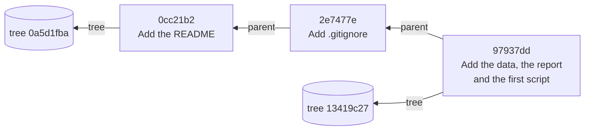
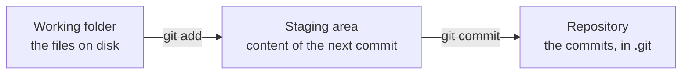
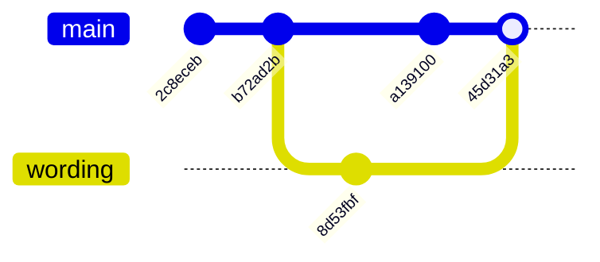
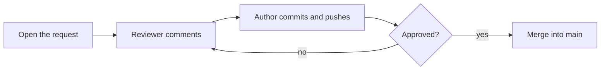
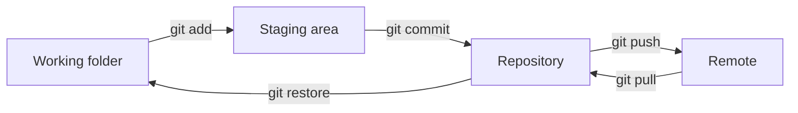

# Dr. Mindaugas Šarpis

# Best Research and Data Analysis Practices from CERN

## Version Control

##### <span class="aims-badge">♻️ reproducibility · 🔧 tool-agnostic</span>

---
hideInToc: true
layout: quote
---

# **Version control** keeps every state a project went through, with who changed what, when and why.

<!--
Speaker: everyone in the room has a folder with files named final, final_v2,
final_corrected. Ask for a show of hands, then go on. (~1 min)
-->

---
hideInToc: true
---

# Learning **Objectives**

<div class="note-text mt-sm">By the end of this lecture, you will be able to:</div>

<div class="stack-tight mt-sm">

<div class="card card-primary card-glass pad-compact">

🧱 Say what a **commit** is: a snapshot, a parent, and an identifier computed from the content

</div>

<div class="card card-secondary card-glass pad-compact">

✍️ Record changes as commits, in the **Source Control** view of VS Code and typed

</div>

<div class="card card-accent card-glass pad-compact">

📦 Decide which files of a data project go into the repository, and write a `.gitignore`

</div>

<div class="card card-success card-glass pad-compact">

🕰️ Read the **history** of a project and undo a change at each stage

</div>

<div class="card card-info card-glass pad-compact">

☁️ Keep a copy on a **remote** and move commits both ways

</div>

<div class="card card-warning card-glass pad-compact">

🌿 Work on a **branch**, **merge** it, and resolve a conflict

</div>

</div>

<!--
Speaker: the order of the lecture is the order of the cards. First what Git
stores, then the commands. (~1 min)
-->

---
hideInToc: true
---

# Copies Instead of **Versions**

<div class="grid-2 gap-md mt-md">

<div class="card card-warning card-glass pad-tight">

## ⚠️ **What goes wrong**

- A file that changes gets copied: `report_final.md`, `report_final_v2.md`, `report_final_v2_corrected.md`
- The names do not say what changed between two copies, or why
- Two copies edited on the same day have to be joined by hand
- The same happens to a script, a table and a README
- A change that turned out wrong can be taken back only if the older copy was kept

</div>

<div>


</div>

</div>

---
hideInToc: true
---

# A History of **Changes**

<div class="card card-info card-glass pad-tight mt-md">

## 🔍 **What a version control system records**

- Each state of the files, and what changed since the state before
- Who made the change, when, and a note that says why
- Any earlier state can be brought back, and any two states can be compared line by line
- **Git** is the version control system of nearly all research software. It is free, and it works on a folder of the laptop without any server

</div>


<!--
Speaker: Git was written in 2005 for the development of the Linux kernel. The
project folder of the course is the folder that goes under Git today. (~2 min)
-->

---
hideInToc: true
---

# Two Lines of Work, **Joined**

<div class="card card-primary card-glass pad-compact mt-sm">

Two people, or one person on two days, change the same starting state in different ways. The histories diverge. Git joins them: changes to different lines are combined without help, and changes to the same line are shown to a person who decides.

</div>

<div class="grid-2 gap-md mt-md">

<div class="text-center">


</div>

<div class="text-center">


</div>

</div>

---
hideInToc: true
---

# Git Is Installed: a **Check**

<div class="grid-2 gap-md mt-md">

<div class="card card-primary card-glass pad-compact">

## ⌨️ **In the terminal of VS Code**

```text
$ git --version
git version 2.54.0 (Apple Git-157)
$ git config --global user.name
Mindaugas Sarpis
$ git config --global user.email
mindaugas.sarpis@cern.ch
```

Your version number differs. On Windows it ends in `.windows.1`, and the terminal is **Git Bash**.

</div>

<div class="card card-secondary card-glass pad-compact">

## ➕ **Three more settings, today**

```text
$ git config --global init.defaultBranch main
$ git config --global pull.rebase false
$ git config --global core.autocrlf false
```

The first names the first branch of a new repository `main` instead of `master`. The second lets `git pull` join two histories by a merge. The third keeps Git for Windows from rewriting line endings, so every file keeps its bytes. None of them prints anything.

</div>

</div>

<div class="card card-warning card-glass pad-compact mt-md">

⚠️ An empty answer means the setting is missing. Set it with `git config --global user.name "Your Name"`, and the same for `user.email`. Both are written into every commit you make.

</div>

<!--
Speaker: installation and the two settings on the left were homework. Ask
for hands: who gets a version number, who gets a name. The three lines on the
right are typed now, on every laptop. Without the third, a clone on Windows
gets CRLF line endings: the data file grows by 91 584 bytes and its checksum
no longer matches. (~3 min)
-->

---
layout: section
hideInToc: true
---

# The **Model**

<!--
Speaker: before any command, what Git stores. Four ideas, each built on the
hash of Lecture 03: a blob, a tree, a commit, a branch. With the model the
commands need no memorising. (~30 sec)
-->

---
hideInToc: true
---

# What Has to Be **Kept**

<div class="grid-2 gap-md mt-md">

<div class="card card-primary card-glass pad-compact">

## 📁 **One version of the project**

- The bytes of every file
- The path of every file, such as `data/raw/D0_KPi.csv`
- Which version came before it
- Who made it, when, and why

</div>

<div class="card card-secondary card-glass pad-compact">

## 🗂️ **The obvious way: copy the folder**

```text
analysis-project_2026-10-13/
analysis-project_2026-10-20/
analysis-project_2026-10-20_fixed/
```

The project holds 3.95 MB in eight files. Twelve copies take 47 MB, and 3.93 MB of each copy are the same data file.

</div>

</div>

<div class="card card-info card-glass pad-compact mt-md">

Git keeps the same four things and stores each content once. The tool for it is the hash of Lecture 03: a short number computed from all the bytes of a content.

</div>

<!--
Speaker: a copied folder has the first two items and loses the last two. It
also cannot say what differs between two copies without a comparison of every
file. (~2 min)
-->

---
hideInToc: true
---

# A Name Made from the **Content**

<div class="grid-2 gap-md mt-md">

<div class="card card-primary card-glass pad-compact">

## 🔢 **`git hash-object`**

```text
$ echo "hello" | git hash-object --stdin
ce013625030ba8dba906f756967f9e9ca394464a
$ echo "hallo" | git hash-object --stdin
4cf5aa5f9a644263dbe3d6e78bcbef45487a802c
```

`echo` writes six bytes: five letters and a line break.

</div>

<div class="card card-secondary card-glass pad-compact">

## 📏 **What the number is**

- 40 hex digits are 160 bits. The hash function is **SHA-1**, an older relative of SHA-256
- The same six bytes give the same 40 digits on every computer
- One changed letter changes the whole number
- Git calls the number the **id** of the content, and stores the content under it

</div>

</div>

<div class="card card-info card-glass pad-compact mt-md">

A content that occurs twice has one id, so it is stored once. A store in which the name of a thing is computed from the thing is called **content-addressed**.

</div>

<!--
Speaker: type both lines live. The command needs no repository. Ask the room
to compare the first four digits with a neighbour. (~2 min)
-->

---
hideInToc: true
---

# Compute It **Yourself**

<div class="grid-2 gap-md mt-md">

<div class="card card-warning card-glass pad-compact">

## ❌ **The plain SHA-1 is another number**

```text
$ echo "hello" | shasum
f572d396fae9206628714fb2ce00f72e94f2258f  -
```

</div>

<div class="card card-success card-glass pad-compact">

## ✅ **Git hashes a header, then the bytes**

```text
$ printf 'blob 6\0hello\n' | shasum
ce013625030ba8dba906f756967f9e9ca394464a  -
```

</div>

</div>

<div class="card card-primary card-glass pad-compact mt-md">

```text
62 6c 6f 62 20 36 00 68 65 6c 6c 6f 0a
b  l  o  b     6     h  e  l  l  o         13 bytes are hashed
```

The header is the word `blob`, a space, the number of bytes as decimal text, and one zero byte. A **blob** is Git's word for the content of a file. `printf` writes exactly what it is given: `\0` is the zero byte and `\n` the line break.

</div>

<div class="note-text mt-sm">Git Bash and Linux: <code>sha1sum</code> in place of <code>shasum</code>.</div>

<!--
Speaker: the id is not secret knowledge of Git. It is a SHA-1 that anyone can
compute with the tools of Lecture 04. Read the 13 bytes with the ASCII table:
62 is b, 20 is the space, 36 is the digit 6. (~3 min)
-->

---
hideInToc: true
---

# The Data File Has an **Id**

<div class="card card-primary card-glass pad-compact mt-md">

```text
$ git hash-object data/raw/D0_KPi.csv
4a45f2be5e087d6b6dccd287fe1bfd36fe659aeb
$ (printf 'blob 3926142\0'; cat data/raw/D0_KPi.csv) | shasum
4a45f2be5e087d6b6dccd287fe1bfd36fe659aeb  -
```

</div>

<div class="grid-2 gap-md mt-md">

<div class="card card-secondary card-glass pad-compact">

## 💻 **The same on every laptop**

The file has 3 926 142 bytes on every laptop in the room, so every laptop prints these 40 digits. A copy under another name has the same id: the name and the date of a file are not hashed.

</div>

<div class="card card-success card-glass pad-compact">

## 🗜️ **Stored once, compressed**

Git keeps the blob in `.git/objects/4a/`, in a file named by the other 38 digits. That file has 1 906 370 bytes. Git compresses with DEFLATE, the method of zip.

</div>

</div>

<!--
Speaker: run the first command in the project folder and let the room read
the first six digits aloud. A laptop that prints another number has another
file: it was saved from a spreadsheet. (~2 min)
-->

---
hideInToc: true
---

# A Folder Is a **List**

<div class="card card-primary card-glass pad-compact mt-md">

```text
$ git cat-file -p 13419c27
100644 blob b6af2caae9c7036b94ecf06a89cab6672562c43c    .gitignore
100644 blob 42b2fadc2fa4a689102a57b8137a3a2dc681fdad    README.md
040000 tree 23affee8da0d5649f12054e3601ff1ad75ccee01    data
040000 tree 0ba5815945791155813636448a8fe4eac31909c8    results
040000 tree 3290e4281557f2189862baa360a4b499be499327    scripts
```

</div>

<div class="grid-2 gap-md mt-md">

<div class="card card-secondary card-glass pad-compact">

## 📋 **A tree**

One line per entry: its kind, its id, its name. A file is a `blob`, and a subfolder is another `tree`. The list itself is stored under its SHA-1, here `13419c27…`.

</div>

<div class="card card-accent card-glass pad-compact">

## 🔗 **One id for the whole project**

Change one byte of `D0_KPi.csv`. Its blob id changes, so the list of `raw` changes, then the list of `data`, then this list. The id of the top tree fixes every byte and every name in the project.

</div>

</div>

<!--
Speaker: git cat-file -p prints any object in readable form. This output and
the next ones come from the project of the lecture after three commits. An
empty folder has no entry: Git stores files, and a folder only as the list of
what is in it. (~2 min)
-->

---
hideInToc: true
---

# A **Commit**

<div class="card card-primary card-glass pad-compact mt-md">

```text
$ git cat-file -p 97937dd
tree 13419c27b7bd0e78b06c213f576d19f634c47fe5
parent 2e7477ecd00357677f781cd558c886e97a510c9c
author Mindaugas Sarpis <mindaugas.sarpis@cern.ch> 1792481100 +0300
committer Mindaugas Sarpis <mindaugas.sarpis@cern.ch> 1792481100 +0300

Add the data, the report and the first script
```

</div>

<div class="grid-2 gap-md mt-md">

<div class="card card-secondary card-glass pad-compact">

- `tree`: the snapshot, as the id of the top list
- `parent`: the commit that came before
- `author`: who, and when. 1 792 481 100 seconds after 1 January 1970 is 20 October 2026, 10:25, at UTC+3

</div>

<div class="card card-info card-glass pad-compact">

The last line is the message: why. A commit is these 280 bytes of text. It holds no file and no difference between files. It points to a complete snapshot.

</div>

</div>

<!--
Speaker: the four things of the slide "What Has to Be Kept" are all here:
bytes and paths through the tree, the version before through the parent, and
who, when and why in the text itself. (~2 min)
-->

---
hideInToc: true
---

# The Id of a **Commit**

<div class="card card-primary card-glass pad-compact mt-md">

```text
$ git cat-file -s 97937dd
280
$ (printf 'commit 280\0'; git cat-file commit 97937dd) | shasum
97937dde182cbd0da376b64588928ef3d4c7ae97  -
```

</div>

<div class="grid-2 gap-md mt-md">

<div class="card card-secondary card-glass pad-compact">

## 🔒 **What the id fixes**

The hashed text contains the id of the tree and the id of the parent. So one commit id fixes every file of this version and every version before it. Two computers that show the same commit id hold the same project with the same history.

</div>

<div class="card card-accent card-glass pad-compact">

## 📌 **What follows**

- An old version cannot be changed unnoticed: every later id would change
- The same files committed by two people give the same tree and two commit ids, because the name and the time differ
- The first seven digits are enough to name a commit: `97937dd`

</div>

</div>

<!--
Speaker: the same recipe as for the blob, with the word commit in the header.
The ids on these slides are those of the lecturer's project. Every student
gets other commit ids and the same blob id for the data file. (~3 min)
-->

---
hideInToc: true
---

# History Is a **Graph**

<div class="mt-md" style="display: flex; justify-content: center;">



</div>

<div class="grid-2 gap-md mt-md">

<div class="card card-primary card-glass pad-compact">

Every commit names its parent. The first commit has none, and a merge has two. The arrows point back in time: from one commit the whole past can be reached, and nothing that came after it.

</div>

<div class="card card-secondary card-glass pad-compact">

Each commit has its own tree, a complete snapshot. Two snapshots share every blob that did not change: `README.md` is blob `42b2fadc…` in all three commits here.

</div>

</div>

<!--
Speaker: draw the three circles on the board and keep them there. Branches,
merges and remotes are all drawn on this picture later. (~2 min)
-->

---
hideInToc: true
---

# A Branch Is a Name for a **Commit**

<div class="grid-2 gap-md mt-md">

<div class="card card-primary card-glass pad-compact">

## 🏷️ **A file of 41 bytes**

```text
$ cat .git/HEAD
ref: refs/heads/main
$ cat .git/refs/heads/main
97937dde182cbd0da376b64588928ef3d4c7ae97
```

The branch `main` is 40 hex digits and a line break. `HEAD` says which branch is in use.

</div>

<div class="card card-secondary card-glass pad-compact">

## ➡️ **A commit moves the name**

```text
$ git commit -m "Say how to fetch the ROOT file"
[main e5e7d3d] Say how to fetch the ROOT file
 1 file changed, 6 insertions(+)
$ cat .git/refs/heads/main
e5e7d3d13e6c765bcdb54fb49cd7f7dd0b87a9ff
```

</div>

</div>

<div class="card card-info card-glass pad-compact mt-md">

A second branch is a second file of 41 bytes. No file of the project is copied. A new commit takes the commit under `HEAD` as its parent and moves that one name forward.

</div>

<!--
Speaker: on the board, write "main" beside the newest circle and move it when
you draw a fourth circle. The word branch suggests a line of commits. What
Git stores is one name on one commit. (~2 min)
-->

---
hideInToc: true
---

# Three **Areas**

<div class="mt-sm" style="display: flex; justify-content: center;">



</div>

<div class="grid-3 gap-md mt-md">

<div class="card card-primary card-glass pad-compact">

## 📂 **Working folder**

The files as they are now. You edit here.

</div>

<div class="card card-secondary card-glass pad-compact">

## 📋 **Staging area**

`git add` copies the present content of a file into it. An edit made afterwards is not in it.

</div>

<div class="card card-success card-glass pad-compact">

## 🗄️ **Repository**

`git commit` turns the staging area into a tree and a commit.

</div>

</div>

<div class="card card-info card-glass pad-compact mt-md">

The staging area exists so that one commit has one purpose. Five files changed for two reasons become two commits, each with its own message.

</div>

<!--
Speaker: this closes the model. Blob, tree, commit, branch, and the three
areas a change passes through. Everything from here on is a command that
moves content between the areas or moves a name. (~2 min)
-->

---
layout: section
hideInToc: true
---

# First **Commits**

<!--
Speaker: now the project folder. Each step is done once in the Source Control
view and once typed, so the room sees that the button and the command are the
same thing. (~30 sec)
-->

---
hideInToc: true
---

# Source Control in **VS Code**

<div class="grid-2 gap-md mt-md" style="grid-template-columns: 2fr 3fr;">

<div class="text-center">


</div>

<div class="card card-primary card-glass pad-tight">

## 🧭 **Two ways to the same Git**

- The **Source Control** view is the third icon of the Activity Bar, or `Ctrl+Shift+G` on Windows and on macOS
- VS Code runs the Git that is installed. Every button of the view runs a Git command
- The same commands are typed in the terminal: **Terminal** > **New Terminal**
- In this lecture each step is shown in the view first, then typed
- Another editor has other buttons. The commands are the same everywhere 🔧

</div>

</div>

---
hideInToc: true
---

# Create the **Repository**

<div class="grid-2 gap-md mt-md" style="grid-template-columns: 2fr 3fr;">

<div class="card card-primary card-glass pad-compact">

## 🖱️ **In Source Control**

Select **Initialize Repository**. The view then lists every file of the folder under **Changes**.

</div>

<div class="card card-secondary card-glass pad-compact">

## ⌨️ **Typed**

```text
$ git init
Initialized empty Git repository in …/analysis-project/.git/
```

`ls -a` now shows one more folder, `.git`.

</div>

</div>

<div class="grid-2 gap-md mt-md">

<div class="card card-info card-glass pad-compact">

A **repository** is the project folder together with its `.git` folder. All commits are in `.git`. It is made once per project.

</div>

<div class="card card-warning card-glass pad-compact">

⚠️ Deleting `.git` deletes the history and leaves the files. Never make a repository inside another one, and never in the home folder.

</div>

</div>

<!--
Speaker: do it with the button. Then show ls -a in the terminal: the button
did nothing else than make this folder. (~2 min)
-->

---
hideInToc: true
---

# What Git **Sees**

<div class="grid-2 gap-md mt-md" style="grid-template-columns: 1fr 2fr;">

<div class="text-center">


</div>

<div class="card card-secondary card-glass pad-compact">

```text
$ git status
On branch main

No commits yet

Untracked files:
  (use "git add <file>..." to include in what will be committed)
        README.md
        data/
        results/
        scripts/

nothing added to commit but untracked files present (use "git add" to track)
```

</div>

</div>

<div class="card card-info card-glass pad-compact mt-md">

`U` in the view and *untracked* in the terminal say the same: Git sees the file and has no version of it. The terminal names a folder once when nothing in it is tracked. `git status` changes nothing and can be run at any time.

</div>

---
hideInToc: true
---

# Stage, Then **Commit**

<div class="grid-2 gap-md mt-md" style="grid-template-columns: 2fr 3fr;">

<div class="text-center">


</div>

<div class="card card-secondary card-glass pad-compact">

## ⌨️ **Typed**

```text
$ git add README.md
$ git commit -m "Add the README"
[main (root-commit) 0cc21b2] Add the README
 1 file changed, 48 insertions(+)
 create mode 100644 README.md
```

The answer names the branch, the first seven digits of the id, the message, and 48 new lines.

</div>

</div>

<div class="card card-primary card-glass pad-compact mt-md">

🖱️ In the view: **+** beside `README.md` moves it to **Staged Changes**, and its letter turns to `A`. Type the message into the box and select **Commit**, or press `Ctrl+Enter` (macOS `Cmd+Enter`).

</div>

<!--
Speaker: one file, one commit, done with the mouse. The other files stay
under Changes. The Graph at the bottom of the view shows the first commit.
(~3 min)
-->

---
hideInToc: true
---

# The Letters in **Source Control**

<div class="card card-primary card-glass pad-compact table-compact mt-md">

| Letter | The terminal says | Meaning |
| --- | --- | --- |
| `U` | `Untracked files` | Git sees the file and has no version of it |
| `A` | `new file` | Staged, and not in any commit yet |
| `M` | `modified` | Differs from the last commit |
| `D` | `deleted` | Is in the last commit and gone from the folder |
| `!` | `both modified` | A merge left a conflict in the file |

</div>

<div class="grid-2 gap-md mt-md">

<div class="card card-secondary card-glass pad-compact">

A file without a letter is as in the last commit. The number on the icon of the view counts the files that have a letter.

</div>

<div class="card card-info card-glass pad-compact">

The Status Bar shows the branch: `main*` with changes that are not staged, `main*+` with staged ones as well, `main!` during a conflict.

</div>

</div>

<!--
Speaker: edit a committed file and delete another one live, and let the room
predict the letters. Take both changes back afterwards. (~2 min)
-->

---
hideInToc: true
---

# The Commit **Message**

<div class="grid-2 gap-md mt-md">

<div class="card card-primary card-glass pad-tight">

## ✍️ **Rules**

- One commit has one purpose. If the message needs the word *and*, make two commits
- The first line has at most about 50 characters
- It says what the commit does, as an instruction: *Add*, *Fix*, *Remove*
- The reason goes below an empty line, when the first line does not give it

</div>

<div class="card card-secondary card-glass pad-tight">

## 🔎 **Examples**

❌ `update`

❌ `fixed stuff`

❌ `final version`

✅ `Add the README`

✅ `Fix the unit of the time column`

✅ `Mark TAU = -100 as missing in the README`

</div>

</div>

<div class="card card-info card-glass pad-compact mt-md">

The message is read months later, by someone who sees one line per commit and nothing else.

</div>

---
layout: section
hideInToc: true
---

# Data in a **Repository**

<!--
Speaker: the project has data files, and Git was made for text written by
people. Which files go in, which stay out, and what the README then has to
say. (~30 sec)
-->

---
hideInToc: true
---

# Which Files Go **In**

<div class="card card-primary card-glass pad-compact table-compact mt-md">

| File | In the repository | Reason |
| --- | --- | --- |
| `README.md`, the report, the scripts | Yes | Written by hand. Nothing can make them again |
| Small raw data: `D0_KPi.csv`, 3.9 MB | Yes | The project is complete in one piece |
| Large raw data: one file of 3 GB | No | Too large for Git and for the host |
| A file that a script makes from other files | No | The script is in the repository and makes it again |
| `.DS_Store`, `Thumbs.db` | No | Made by the operating system, of no use to anyone |
| Passwords and access keys | Never | A pushed commit stays readable for good |

</div>

<div class="card card-info card-glass pad-compact mt-md">

`data/processed/pendulum.csv` was cleaned by hand, so it goes in. `pendulum_script.csv` is written by `scripts/clean_pendulum.sh`: the script goes in, and the file it writes may stay out.

</div>

---
hideInToc: true
---

# 3.9 MB Fits, 3 GB Does **Not**

<div class="grid-2 gap-md mt-md">

<div class="card card-success card-glass pad-tight">

## ✅ **`D0_KPi.csv`, 3 926 142 bytes**

- Stored once, as 1 906 370 bytes
- After twelve commits `.git` takes 2.2 MB: the content of the data file never changed, so its blob was stored once
- Twelve copies of the folder would take 47 MB
- The first push sends the whole history in 1.68 MiB

</div>

<div class="card card-warning card-glass pad-tight">

## ❌ **One file of 3 GB**

- GitHub refuses a file above 100 MB and warns above 50 MB
- A changed line gives new content and a new id: a second blob
- Every copy of the repository carries every version of every file
- A commit cannot be removed later without changing every id after it. The file stays in the history

</div>

</div>

<div class="card card-info card-glass pad-compact mt-md">

A file that stays out of the repository is still in `data/raw` on the disk. Git is told to ignore it, and the README says where it comes from.

</div>

<!--
Speaker: the numbers on the left are measured on the project of the lecture.
The last point on the right follows from the model: the id of a commit depends
on everything before it. (~3 min)
-->

---
hideInToc: true
---

# The File **`.gitignore`**

<div class="grid-2 gap-md mt-md">

<div class="card card-primary card-glass pad-compact">

## 📄 **`.gitignore`, in the project folder**

```text
# made by the operating system
.DS_Store
Thumbs.db

# fetched, not stored: see README.md
data/raw/MasterclassData.root
```

One pattern per line, and `#` starts a comment. `*.tmp` is every file whose name ends in `.tmp`. `scratch/` is a whole folder.

</div>

<div class="card card-secondary card-glass pad-compact">

## 🖱️ **In Source Control**

Right-click a file under **Changes**, then **Add to .gitignore**. The file leaves the list, and `.gitignore` appears in it.

## ⌨️ **Typed**

```text
$ git add .gitignore
$ git commit -m "Add .gitignore"
[main 2e7477e] Add .gitignore
 1 file changed, 6 insertions(+)
 create mode 100644 .gitignore
```

</div>

</div>

<div class="note-text mt-sm"><code>MasterclassData.root</code> has 1.3 MB and would fit. It stands here for a file that is too large. <code>.gitignore</code> acts only on files that Git does not track yet.</div>

<!--
Speaker: .gitignore is itself a file of the project and is committed. The
ROOT file is the original of the record. The record keeps it, so the project
need not. (~3 min)
-->

---
hideInToc: true
---

# Commit the **Rest**

<div class="grid-2 gap-md mt-md">

<div class="card card-primary card-glass pad-compact">

```text
$ git add .
$ git status
On branch main
Changes to be committed:
        new file:   data/processed/pendulum.csv
        new file:   data/raw/D0_KPi.csv
        new file:   data/raw/pendulum.csv
        new file:   results/pendulum_plot.png
        new file:   results/report.md
        new file:   scripts/hello.py
```

</div>

<div class="card card-secondary card-glass pad-compact">

- `git add .` stages everything in the present folder that is not ignored. In the view it is the **+** on the **Changes** header
- Read the list before the commit. `MasterclassData.root` is not in it
- The commit reports `6 files changed, 91623 insertions(+)`. Insertions are lines, and 91 584 of them are the data file
- The picture is binary and counts as no lines

</div>

</div>

<div class="card card-info card-glass pad-compact mt-md">

```text
$ git commit -m "Add the data, the report and the first script"
[main 97937dd] Add the data, the report and the first script
```

</div>

<div class="note-text mt-sm">The hint line of <code>git status</code> and six <code>create mode</code> lines of the commit are left out here.</div>

<!--
Speaker: typed this time. Stop after git status and let the room check the
list against the Explorer. (~2 min)
-->

---
hideInToc: true
---

# The README Says How to **Fetch** It

<div class="card card-primary card-glass pad-compact mt-md">

## ✍️ **Added to `README.md`**

```md
## Data not stored here

- **File:** `data/raw/MasterclassData.root`, 1 289 541 bytes
- **Fetch from:** https://opendata.cern.ch/record/401
- **SHA-256:** `8694a2ed518472b02994629154de3077fdff4aef1065691fa13ae9f6b23b039b`
```

</div>

<div class="grid-2 gap-md mt-md">

<div class="card card-secondary card-glass pad-compact">

## 🧾 **Three facts**

Where the file comes from, how large it is, and its SHA-256. Whoever fetches it computes the checksum and knows that it is the same file: `shasum -a 256` on macOS, `sha256sum` in Git Bash and on Linux.

</div>

<div class="card card-info card-glass pad-compact">

## ♻️ **The same for 3 GB**

These three lines serve a file of any size. A repository with this README and a `.gitignore` can be rebuilt by a stranger: clone it, read the README, fetch the file, check the hash.

</div>

</div>

<!--
Speaker: this is the provenance note of Lecture 02 with one more job. Commit
it: "Say how to fetch the ROOT file". (~2 min)
-->

---
layout: section
hideInToc: true
---

# Changes & **History**

<!--
Speaker: four commits exist. Now a file changes, and the history is read.
(~30 sec)
-->

---
hideInToc: true
---

# A Change, Seen as a **Diff**

<div class="text-center mt-sm">


</div>

<div class="grid-2 gap-md mt-md">

<div class="card card-primary card-glass pad-compact">

## 🖱️ **In Source Control**

A changed file gets the letter `M`. Select it and the **diff view** opens. Red is the line as it is in the last commit, green the line as it is now.

</div>

<div class="card card-secondary card-glass pad-compact">

## 👀 **Read it before every commit**

The diff is what the commit will contain. It also shows an edit that was not meant: a deleted line, a stray character.

</div>

</div>

<!--
Speaker: change the first sentence of results/report.md live, save, and open
the diff. In a wide window VS Code shows the two versions side by side, in a
narrow one line under line as here. (~2 min)
-->

---
hideInToc: true
---

# The Same Diff, **Typed**

<div class="grid-2 gap-md mt-md" style="grid-template-columns: 3fr 2fr;">

<div class="card card-primary card-glass pad-compact">

```text
$ git diff
diff --git a/results/report.md b/results/report.md
index e5abf54..cd058bf 100644
--- a/results/report.md
+++ b/results/report.md
@@ -1,6 +1,6 @@
 # Pendulum
 
-Time of 10 swings for nine lengths.
+Time of 10 swings of a pendulum for nine lengths.
 
 | length_cm | t10_s |
 |--|--|
```

</div>

<div class="card card-secondary card-glass pad-compact">

## 🔎 **Reading it**

- `---` and `+++` name the old and the new file
- `e5abf54..cd058bf` are the blob ids of the two contents
- `@@ -1,6 +1,6 @@`: six lines from line 1 on, before and after
- `-` a line that went, `+` a line that came, a space before an unchanged line

</div>

</div>

<div class="card card-info card-glass pad-compact mt-md">

`git diff` compares the working folder with the staging area. `git diff --staged` compares the staging area with the last commit. After `git add` the first prints nothing and the second prints the change.

</div>

<!--
Speaker: stage and commit it: "Name the pendulum in the report". (~3 min)
-->

---
hideInToc: true
---

# Reading the History: **log**

<div class="grid-2 gap-md mt-md" style="grid-template-columns: 3fr 2fr;">

<div class="card card-primary card-glass pad-compact">

```text
$ git log --oneline
817fc99 (HEAD -> main) Name the pendulum in the report
e5e7d3d Say how to fetch the ROOT file
97937dd Add the data, the report and the first script
2e7477e Add .gitignore
0cc21b2 Add the README
$ git log -1 817fc99
commit 817fc99091e0024d77247e2febae05ad7fa901c0
Author: Mindaugas Sarpis <mindaugas.sarpis@cern.ch>
Date:   Tue Oct 20 10:40:00 2026 +0300

    Name the pendulum in the report
```

</div>

<div>


<div class="card card-secondary card-glass pad-compact mt-sm">

- The **Graph** in Source Control lists the same commits, newest first. Select a commit for its files, and a file for its diff
- **Timeline** in the Explorer lists the commits that changed the open file
- Typed: `git log --oneline -- results/report.md`

</div>

</div>

</div>

<!--
Speaker: (HEAD -> main) is the branch name of the model, printed beside the
commit it stands on. If the list is longer than the window, the terminal
shows a colon: the arrow keys scroll and q leaves. (~2 min)
-->

---
hideInToc: true
---

# One Commit, One Line: **show** and **blame**

<div class="card card-primary card-glass pad-compact mt-sm">

```text
$ git show --stat --oneline 817fc99
817fc99 Name the pendulum in the report
 results/report.md | 2 +-
 1 file changed, 1 insertion(+), 1 deletion(-)
```

</div>

<div class="card card-secondary card-glass pad-compact mt-sm">

```text
$ git blame -s results/report.md | head -5
97937dde  1) # Pendulum
97937dde  2) 
817fc990  3) Time of 10 swings of a pendulum for nine lengths.
97937dde  4) 
97937dde  5) | length_cm | t10_s |
```

</div>

<div class="card card-info card-glass pad-compact mt-sm">

`git show` prints one commit: its message and what it changed. Without `--stat` it prints the full diff. `git blame` names, for every line of a file, the commit that last changed it. In VS Code the Status Bar gives the author and the age of that commit for the line the cursor is in.

</div>

<!--
Speaker: blame answers "since when does this line read like this, and why":
take the id from blame and give it to git show. (~2 min)
-->

---
layout: section
hideInToc: true
---

# **Undoing**

<!--
Speaker: three cases, by how far the change got: an edit in the working
folder, the last commit, an older commit. (~30 sec)
-->

---
hideInToc: true
---

# Undo an Edit: **restore**

<div class="grid-2 gap-md mt-md">

<div class="card card-primary card-glass pad-compact">

## 🖱️ **In Source Control**

- The bent arrow beside a changed file is **Discard Changes**
- VS Code asks: *Are you sure you want to discard changes in 'report.md'?* **Discard File** puts back the content of the last commit
- **−** beside a staged file unstages it. The edit stays in the file

</div>

<div class="card card-secondary card-glass pad-compact">

## ⌨️ **Typed**

```text
$ git diff --stat
 results/report.md | 5 -----
 1 file changed, 5 deletions(-)
$ git restore results/report.md
$ git status
On branch main
nothing to commit, working tree clean
```

`git restore --staged README.md` unstages.

</div>

</div>

<div class="card card-warning card-glass pad-compact mt-md">

⚠️ An edit that was never committed and is discarded is gone. Git has no copy of it. Read the diff first.

</div>

<!--
Speaker: delete five rows of the table in the report by accident, save, and
bring them back. This is the undo that works after the editor was closed.
(~2 min)
-->

---
hideInToc: true
---

# Correct the Last Commit: **amend**

<div class="grid-2 gap-md mt-md" style="grid-template-columns: 3fr 2fr;">

<div class="card card-primary card-glass pad-compact">

```text
$ git commit -m "Remove teh plot"
[main c1b6b27] Remove teh plot
 1 file changed, 1 deletion(-)
$ git commit --amend -m "Remove the plot from the report"
[main fb457d5] Remove the plot from the report
 Date: Tue Oct 20 10:50:00 2026 +0300
 1 file changed, 1 deletion(-)
```

</div>

<div class="card card-secondary card-glass pad-compact">

## 🔁 **A new commit replaces the old**

The id went from `c1b6b27` to `fb457d5`. The message is part of the hashed text, so a corrected commit is another commit. The old one leaves the history.

In the view: the arrow on the **Commit** button, then **Commit (Amend)**.

</div>

</div>

<div class="card card-warning card-glass pad-compact mt-md">

⚠️ Amend only a commit that has not been pushed. A commit that others may already have is corrected by a new commit.

</div>

---
hideInToc: true
---

# Take Back a Commit: **revert**

<div class="grid-2 gap-md mt-md" style="grid-template-columns: 3fr 2fr;">

<div class="card card-primary card-glass pad-compact">

```text
$ git revert --no-edit fb457d5
[main 2c7e920] Revert "Remove the plot from the report"
 Date: Tue Oct 20 10:55:00 2026 +0300
 1 file changed, 1 insertion(+)
$ git log --oneline -3
2c7e920 (HEAD -> main) Revert "Remove the plot from the report"
fb457d5 Remove the plot from the report
817fc99 Name the pendulum in the report
```

</div>

<div class="card card-secondary card-glass pad-compact">

## ↩️ **A commit that does the opposite**

`revert` adds a commit with the reverse change. Nothing leaves the history, so it is safe for commits that are pushed. `--no-edit` keeps the proposed message.

One file as it was in an old commit: `git restore --source=0cc21b2 README.md`

</div>

</div>

<div class="card card-info card-glass pad-compact mt-md">

Many answers on the web use `git reset --hard`. It discards uncommitted work and moves the branch name. Nothing in this course needs it.

</div>

<!--
Speaker: the plot was removed from the report and that was a mistake. The
history keeps both the mistake and its correction. (~2 min)
-->

---
layout: section
hideInToc: true
---

# **Remotes**

<!--
Speaker: so far everything is in one .git folder on one laptop. A remote is
the same history on a server. (~30 sec)
-->

---
hideInToc: true
---

# A Remote Is a Second **Copy**

<div class="grid-2 gap-md mt-md">

<div class="card card-primary card-glass pad-tight">

## ☁️ **What it is**

- The same repository on another computer: the same objects under the same ids
- A hosting service keeps it reachable: GitHub, GitLab, Bitbucket. This lecture uses GitHub
- `origin` is the usual name of the first remote

</div>

<div class="card card-secondary card-glass pad-tight">

## 🎯 **What it is for**

- A copy of the project outside the laptop
- The same project on a second computer
- Work with other people on one history

</div>

</div>

<div class="card card-info card-glass pad-compact mt-md">

A **push** sends the objects the remote does not have yet, then moves the branch name on the remote. A **pull** does the same in the other direction. Ids are compared, not files: an object that is already there is not sent again.

</div>

---
hideInToc: true
---

# A GitHub **Account**

<div class="grid-2 gap-md mt-md">

<div class="card card-primary card-glass pad-tight">

## 🪪 **Create it once**

1. Open `github.com` and select **Sign up**
2. Enter an e-mail address, a password and a user name
3. Type in the code that GitHub sends to that address
4. Stay on the free plan. It allows private and public repositories without limit

</div>

<div class="card card-secondary card-glass pad-tight">

## 🤔 **Choose with care**

- The user name is public and part of every address: `github.com/<user>/<repository>`
- Use an e-mail address that you keep after your studies
- A **private** repository is seen by you and by those you invite. A **public** one is seen by everyone
- The e-mail of `git config` is in every commit, and in a public repository everyone can read it

</div>

</div>

<!--
Speaker: who has an account already? The others create one now. It takes
three minutes and needs access to the mailbox. (~2 min)
-->

---
hideInToc: true
---

# Publish from **VS Code**

<div class="grid-2 gap-md mt-md" style="grid-template-columns: 2fr 3fr;">

<div class="text-center">


</div>

<div class="card card-primary card-glass pad-compact">

## 🖱️ **In Source Control**

1. When everything is committed, the button reads **Publish Branch**. Select it
2. VS Code asks: *The extension 'GitHub' wants to sign in using GitHub.* Select **Allow**, sign in in the browser and return
3. Choose **Publish to GitHub private repository**
4. A note confirms it. **Open on GitHub** shows the project in the browser, with the README as its front page

</div>

</div>

<div class="card card-info card-glass pad-compact mt-md">

From now on the button reads **Sync Changes**, with the number of commits to fetch ↓ and to send ↑. **Sync** pulls, then pushes.

</div>

<!--
Speaker: do this live with your own account. Open the repository in the
browser and show three things: the files, the rendered README, the list of
commits with the same ids as in the terminal. (~3 min)
-->

---
hideInToc: true
---

# The Same, **Typed**

<div class="card card-secondary card-glass pad-compact mt-sm">

On `github.com`: **New repository**, the name `analysis-project`, **Private**, no README, **Create repository**. The page then shows the address of the empty repository.

</div>

<div class="card card-primary card-glass pad-compact mt-sm">

```text
$ git remote add origin https://github.com/mindaugassarpis/analysis-project.git
$ git remote -v
origin  https://github.com/mindaugassarpis/analysis-project.git (fetch)
origin  https://github.com/mindaugassarpis/analysis-project.git (push)
$ git push -u origin main
Enumerating objects: 31, done.
…
Writing objects: 100% (31/31), 1.68 MiB | 8.12 MiB/s, done.
To https://github.com/mindaugassarpis/analysis-project.git
 * [new branch]      main -> main
branch 'main' set up to track 'origin/main'.
```

</div>

<div class="card card-info card-glass pad-compact mt-sm">

`-u` ties `main` to `origin/main`. After that `git push` and `git pull` need no more words. The first push asks for the GitHub sign-in in the browser.

</div>

<!--
Speaker: use one of the two ways, not both: a repository published from VS
Code already has its remote. The seven commits and the data file travel as
1.68 MiB. (~2 min)
-->

---
hideInToc: true
---

# Clone and **Pull**

<div class="card card-primary card-glass pad-compact mt-sm">

## 📥 **Clone: on a second computer**

```text
$ git clone https://github.com/mindaugassarpis/analysis-project.git
Cloning into 'analysis-project'...
…
$ ls analysis-project/data/raw
D0_KPi.csv      pendulum.csv
```

The clone has every commit and every committed file. `MasterclassData.root` is not there. The README says how to fetch it.

</div>

<div class="grid-2 gap-md mt-sm">

<div class="card card-secondary card-glass pad-compact">

## ⬇️ **Pull: fetch what is new**

```text
$ git pull
…
Updating 2c7e920..2c8eceb
Fast-forward
 README.md | 1 +
 1 file changed, 1 insertion(+)
```

</div>

<div class="card card-info card-glass pad-compact">

A commit was made on the second computer and pushed. `git pull` on the first one fetches it and moves `main` forward.

Pull before you start to work, and push when you stop. Then two computers never hold different work.

</div>

</div>

<!--
Speaker: origin/main is a third name. It marks where main stood on the remote
at the last contact. (~3 min)
-->

---
hideInToc: true
---

# SSH: the **Alternative**

<div class="grid-2 gap-md mt-md">

<div class="card card-primary card-glass pad-compact">

## 🔑 **Two addresses for one repository**

```text
https://github.com/<user>/analysis-project.git
git@github.com:<user>/analysis-project.git
```

- The first asks for a sign-in. The second uses a pair of keys
- The private key stays on the computer. The public key is given to GitHub once
- Use SSH on a computer without a browser, such as a computing cluster

</div>

<div class="card card-secondary card-glass pad-compact">

## ⚙️ **Setup**

```text
ssh-keygen -t ed25519 -C "you@example.com"
cat ~/.ssh/id_ed25519.pub
```

Paste the printed line into GitHub: **Settings** > **SSH and GPG keys** > **New SSH key**.

An existing repository changes over with `git remote set-url`, the name `origin` and the second address.

</div>

</div>

---
layout: section
hideInToc: true
---

# Branches & **Merging**

<!--
Speaker: a branch is a name for a commit. Now two names, and how their
histories are joined. (~30 sec)
-->

---
hideInToc: true
---

# Create a **Branch**

<div class="grid-2 gap-md mt-md">

<div class="card card-primary card-glass pad-compact">

## 🖱️ **In Source Control**


Select the branch name at the left of the Status Bar, then **Create new branch...**, type `table-units` and press Enter. The Status Bar now reads `table-units`.

</div>

<div class="card card-secondary card-glass pad-compact">

## ⌨️ **Typed**

```text
$ git switch -c table-units
Switched to a new branch 'table-units'
$ git branch
  main
* table-units
$ cat .git/HEAD
ref: refs/heads/table-units
```

</div>

</div>

<div class="card card-info card-glass pad-compact mt-md">

Commits made now move `table-units`. `main` stays on its commit. Work that may fail is tried on a branch and reaches `main` when it is good.

</div>

---
hideInToc: true
---

# Work on the Branch, Then **Merge**

<div class="grid-2 gap-md mt-md" style="grid-template-columns: 3fr 2fr;">

<div class="card card-primary card-glass pad-compact">

```text
$ git commit -m "Write the units into the table header"
[table-units b72ad2b] Write the units into the table header
 1 file changed, 1 insertion(+), 1 deletion(-)
$ git switch main
Switched to branch 'main'
Your branch is up to date with 'origin/main'.
$ git merge table-units
Updating 2c8eceb..b72ad2b
Fast-forward
 results/report.md | 2 +-
 1 file changed, 1 insertion(+), 1 deletion(-)
```

</div>

<div class="card card-secondary card-glass pad-compact">

- `git switch main` puts the files of `main` into the working folder. The table header is the old one again
- `main` had no commit of its own, so the merge moves the name `main` forward to `b72ad2b`: a **fast-forward**
- In the view: **...** on the **Changes** header, **Branch**, **Merge...**
- `git branch -d table-units` deletes the name. The commit stays

</div>

</div>

<!--
Speaker: watch the file in the editor while you switch: the header line
changes back and forth. Nothing is lost. Each branch has its own snapshot.
(~3 min)
-->

---
hideInToc: true
---

# Two Branches, Both **Changed**

<div class="mt-sm" style="display: flex; justify-content: center;">



</div>

<div class="card card-primary card-glass pad-compact mt-sm">

```text
$ git log --oneline --graph --all -4
* a139100 (HEAD -> main) Give the range of lengths
| * 8d53fbf (wording) Reword the first sentence
|/  
* b72ad2b Write the units into the table header
* 2c8eceb (origin/main, origin/HEAD) Note when version control started
```

</div>

<div class="note-text mt-sm">The branch <code>wording</code> rewrites the first sentence of the report. Meanwhile <code>main</code> changes the same sentence. Neither history contains the other, so the merge needs a new commit with two parents.</div>

<!--
Speaker: the picture shows the history after the merge, the terminal shows it
before. If the two branches had changed different lines, Git would have made
the merge commit without a question. (~2 min)
-->

---
hideInToc: true
---

# A Merge **Conflict**

<div class="card card-warning card-glass pad-compact mt-md">

```text
$ git merge wording
Auto-merging results/report.md
CONFLICT (content): Merge conflict in results/report.md
Automatic merge failed; fix conflicts and then commit the result.
```

</div>

<div class="card card-secondary card-glass pad-compact mt-md">

## 📄 **`results/report.md` now**

<pre class="slidev-code conflict-block"><code># Pendulum

&lt;&lt;&lt;&lt;&lt;&lt;&lt; HEAD
Time of 10 swings of a pendulum for nine lengths from 20 cm to 100 cm.
=======
Ten swings of a pendulum, timed for nine lengths.
&gt;&gt;&gt;&gt;&gt;&gt;&gt; wording</code></pre>

Both branches changed line 3. Git writes both versions into the file, between markers. Above `=======` is the line of the branch in use, below it the line that comes in. Nothing is lost, and nothing is decided.

</div>

<!--
Speaker: a conflict is not an error. Git reports that two people, or one
person twice, changed the same line, and asks which text is meant. (~2 min)
-->

---
hideInToc: true
---

# Resolve It in the **Editor**

<div class="text-center mt-sm">


</div>

<div class="grid-3 gap-md mt-md">

<div class="card card-primary card-glass pad-compact">

**1.** The file stands under **Merge Changes** with the sign `!`. Select it.

</div>

<div class="card card-secondary card-glass pad-compact">

**2.** Above the block: **Accept Current Change**, **Accept Incoming Change**, **Accept Both Changes**. Or edit the lines. The markers must go.

</div>

<div class="card card-success card-glass pad-compact">

**3.** **+** stages the file. **Continue** makes the merge commit. Its message is already filled in.

</div>

</div>

<!--
Speaker: accept the incoming line and then add the range of lengths to it by
hand. The result has something of both. That is the usual case. (~2 min)
-->

---
hideInToc: true
---

# Resolve It, **Typed**

<div class="grid-2 gap-md mt-md">

<div class="card card-primary card-glass pad-compact">

```text
$ git add results/report.md
$ git commit -m "Merge branch 'wording'"
[main 45d31a3] Merge branch 'wording'
$ git cat-file -p 45d31a3
tree d04149463ec5238dd79870d84a0129ace9597c9d
parent a1391001035a4dfa81f9e7c572b4cce72a994027
parent 8d53fbf20e006a4025dca1c7be1531ffcdd766ae
…
```

</div>

<div class="card card-secondary card-glass pad-compact">

```text
$ git log --oneline --graph -4
*   45d31a3 (HEAD -> main) Merge branch 'wording'
|\  
| * 8d53fbf (wording) Reword the first sentence
* | a139100 Give the range of lengths
|/  
* b72ad2b Write the units into the table header
```

</div>

</div>

<div class="card card-info card-glass pad-compact mt-md">

Edit the file until it reads as it should, with no marker left. `git add` tells Git that the conflict is settled, and the commit closes the merge. A merge commit has two parents. `git merge --abort` leaves a merge and puts everything back as it was.

</div>

---
hideInToc: true
---

# Ahead and **Behind**

<div class="grid-2 gap-md mt-md" style="grid-template-columns: 2fr 3fr;">

<div class="text-center">


</div>

<div class="card card-primary card-glass pad-compact">

## ☁️ **Two names for `main`**

- `main` is where this computer is. `origin/main` is where the remote stood at the last contact
- The Graph shows both. Four commits lie between them, and the button reads **Sync Changes 4↑**

```text
$ git status
On branch main
Your branch is ahead of 'origin/main' by 4 commits.
  (use "git push" to publish your local commits)

nothing to commit, working tree clean
```

`git push` sends the four commits.

</div>

</div>

<!--
Speaker: the merge of a branch happens on the laptop. The remote learns of it
with the next push. (~2 min)
-->

---
layout: section
hideInToc: true
---

# Working with **Others**

<!--
Speaker: a branch and a remote together give the way teams work: nobody
commits to main directly, and every change is read by a second person.
(~30 sec)
-->

---
hideInToc: true
---

# A Pull **Request**

<div class="card card-primary card-glass pad-compact mt-md">

A pull request asks the owners of a repository to merge a branch. The branch is pushed with `git push -u origin fit-range`, the request is opened on the website, and others read the diff before it reaches `main`.

</div>

<div class="grid-3 gap-md mt-md">

<div class="card card-secondary card-glass pad-compact">

## 🔍 **What it shows**

- The diff of every changed file
- The commits of the branch
- A discussion, beside the lines it is about

</div>

<div class="card card-accent card-glass pad-compact">

## 📝 **Draft**

- Opened early, to ask whether the direction is right
- Marked **Ready for review** when the work is done

</div>

<div class="card card-success card-glass pad-compact">

## 🎯 **Small**

- One request, one purpose
- 50 changed lines are read with care
- 2000 changed lines are not read

</div>

</div>

<div class="note-text mt-sm">After the push of a new branch GitHub prints the address at which the pull request is opened.</div>

---
hideInToc: true
---

# The Review **Flow**

<div class="mt-md" style="display: flex; justify-content: center;">



</div>

<div class="card card-info card-glass pad-compact mt-md">

A comment leads to a commit on the same branch. The push adds it to the open request, and the reviewer reads the new diff. Only an approved change reaches `main`. At CERN no line of analysis code enters the shared software without this loop ♻️.

</div>

---
hideInToc: true
---

# Giving & Receiving **Review**

<div class="grid-2 gap-md mt-md">

<div class="card card-primary card-glass pad-tight">

## 🧑‍🏫 **As a reviewer**

- Review the change, not the person
- Ask before you demand: "why this cut on `PT`?"
- Check the method first, then the names and the comments
- Answer within a day. A waiting request blocks the author

</div>

<div class="card card-secondary card-glass pad-tight">

## ✍️ **As an author**

- Write what changed and why
- Answer every comment, if only with "done"
- Push corrections as new commits, so the reviewer sees what moved
- Disagree with reasons

</div>

</div>

<div class="card card-info card-glass pad-compact mt-md">

A program can check that code runs. Only a reader can ask whether the method is right for the question.

</div>

---
hideInToc: true
---

# Issues, Forks, **GitLab**

<div class="grid-3 gap-md mt-md">

<div class="card card-primary card-glass pad-compact">

## 🐛 **Issue**

A numbered note on the repository: a fault, a task, a question. `Fixes #12` in a commit message closes issue 12 when the commit reaches `main`. The closed issue keeps the record of what was wrong.

</div>

<div class="card card-secondary card-glass pad-compact">

## 🍴 **Fork**

Your own copy, on the host, of a repository that belongs to someone else. You push to the fork and open a pull request to the original. It is the way to contribute without the right to write.

</div>

<div class="card card-accent card-glass pad-compact">

## 🦊 **GitLab**

CERN runs its own GitLab at `gitlab.cern.ch`. Git is the same there. A pull request is called a **merge request**, and only the address of the remote differs 🔧.

</div>

</div>

<div class="card card-info card-glass pad-compact mt-md">

Inside a team everyone pushes branches to one repository. A fork is for a repository you may read and not write, such as the software of an experiment.

</div>

---
layout: section
hideInToc: true
---

# Tags & **Stash**

<!--
Speaker: two short tools. A tag marks the version behind a result. A stash
puts unfinished work aside. (~30 sec)
-->

---
hideInToc: true
---

# A Tag Names a **Version**

<div class="card card-primary card-glass pad-compact mt-md">

```text
$ git tag -a v1.0 -m "Report as shown on 20 October"
$ git log --oneline -2
45d31a3 (HEAD -> main, tag: v1.0, origin/main, origin/HEAD) Merge branch 'wording'
a139100 Give the range of lengths
$ git push origin v1.0
…
 * [new tag]         v1.0 -> v1.0
```

</div>

<div class="grid-2 gap-md mt-md">

<div class="card card-secondary card-glass pad-compact">

## 🏷️ **A name that does not move**

A branch name moves with every commit. The tag `v1.0` stays on `45d31a3`. `-a` stores who set it, when, and a message. A tag is pushed by its name.

</div>

<div class="card card-success card-glass pad-compact">

## ♻️ **Which files made this figure?**

Tag the commit behind every result that leaves the project: a report handed in, a figure in a thesis. Write the tag into the text. `git switch --detach v1.0` puts those files back into the working folder, and `git switch main` returns.

</div>

</div>

---
hideInToc: true
---

# Put Work Aside: **stash**

<div class="card card-primary card-glass pad-compact mt-md">

```text
$ git stash
Saved working directory and index state WIP on main: 45d31a3 Merge branch 'wording'
$ git status
On branch main
Your branch is up to date with 'origin/main'.

nothing to commit, working tree clean
```

</div>

<div class="grid-2 gap-md mt-md">

<div class="card card-secondary card-glass pad-compact">

## 🧰 **When**

An edit is half done, and another branch is needed now. The command stores the edit and puts the working folder back to the last commit.

</div>

<div class="card card-accent card-glass pad-compact">

## ⌨️ **The other half**

`git stash pop` brings the edit back. `git stash list` shows what is stored. In the view: **...** on the **Changes** header, then **Stash**.

</div>

</div>

---
hideInToc: true
---

# When Git Says **No**

<div class="grid-2 gap-md mt-md">

<div class="card card-warning card-glass pad-compact">

```text
fatal: not a git repository (or any of
the parent directories): .git
```

The terminal is not in the project folder. `pwd` says where it is, and `cd` goes to the project.

</div>

<div class="card card-warning card-glass pad-compact">

```text
 ! [rejected]        main -> main (fetch first)
error: failed to push some refs to '…'
```

The remote has a commit that this computer lacks. Fetch and merge it with <code style="white-space: nowrap;">git pull --no-edit</code>, then push again.

</div>

<div class="card card-warning card-glass pad-compact">

```text
Your branch and 'origin/main' have diverged,
and have 1 and 1 different commits each
```

`git status` after such a fetch. Both sides have a commit of their own. The same pull joins them.

</div>

<div class="card card-warning card-glass pad-compact">

A screen full of `~` signs after `git commit` or `git merge`: Git opened the editor Vim for a message. Type `:q!` and press Enter to leave it. Then give the message with `-m`, or use `--no-edit`.

</div>

</div>

<div class="note-text mt-sm">The first message is printed on one line. Read the last lines of a long answer first: Git usually names the command that helps.</div>

<!--
Speaker: these four cover most of what stops a beginner. None of them means
that anything is lost. (~2 min)
-->

---
hideInToc: true
---

# The Whole **Picture**

<div class="mt-md" style="display: flex; justify-content: center;">



</div>

<div class="grid-3 gap-md mt-md">

<div class="card card-primary card-glass pad-compact">

`git status` and `git diff` look and change nothing. Run them before every step.

</div>

<div class="card card-secondary card-glass pad-compact">

`git switch` exchanges the files of the working folder for the snapshot of another branch.

</div>

<div class="card card-success card-glass pad-compact">

`git merge` joins another branch into the one in use. A pull is a fetch and a merge.

</div>

</div>

---
hideInToc: true
---

# Source Control and **Commands**

<div class="card card-primary card-glass pad-compact table-compact mt-sm">

| Step | In Source Control | Typed |
| --- | --- | --- |
| Create the repository | **Initialize Repository** | `git init` |
| See what changed | The **Changes** list. Select a file for its diff | `git status`, `git diff` |
| Stage, unstage | **+**, **−** | `git add <file>`, `git restore --staged <file>` |
| Commit | Message, then **Commit** | `git commit -m "…"` |
| Discard an edit | **Discard Changes** | `git restore <file>` |
| Read the history | **Graph**, **Timeline** | `git log --oneline`, `git show <id>` |
| New branch | Branch name in the Status Bar | `git switch -c <name>` |
| Merge | **...** > **Branch** > **Merge...** | `git merge <name>` |
| Send and fetch | **Sync Changes** | `git push`, `git pull` |

</div>

<div class="note-text mt-sm">A working day: pull, edit, read the diff, stage, commit with a message that says why, push.</div>

---
hideInToc: true
---

# **Recap** — You Can Now…

<div class="grid-2 gap-md mt-sm">

<div class="card card-success card-glass pad-compact">

✅ Say what a blob, a tree, a commit and a branch are, and compute an **id** by hand

</div>

<div class="card card-success card-glass pad-compact">

✅ Stage and **commit**, in the Source Control view and typed

</div>

<div class="card card-success card-glass pad-compact">

✅ Keep large data out with `.gitignore` and say in the README how to **fetch** it

</div>

<div class="card card-success card-glass pad-compact">

✅ Read a **diff** and the history, and undo an edit or a commit

</div>

<div class="card card-success card-glass pad-compact">

✅ Push to a **remote**, clone and pull

</div>

<div class="card card-success card-glass pad-compact">

✅ **Branch**, **merge**, and resolve a conflict

</div>

</div>

<div class="card card-accent card-glass pad-tight mt-md">

## 🔬 **A result and its commit**

A number or a figure that leaves the project carries the id or the tag of the commit that made it. With the id, the files behind the result can be brought back exactly.

</div>

<!--
Speaker: go through the six cards and let the room nod or object. The last
card is the reason the lecture exists: a result that can be traced to its
files. (~1 min)
-->

---
layout: section
hideInToc: true
---

# Check **Yourself**

Questions on this lecture, for after it. They are not part of the lecture time.

---
hideInToc: true
---

<MCQ
  question="A student keeps `analysis.py`, `analysis_v2.py`, `analysis_final.py` and `analysis_final_REAL.py` side by side. What does Git give that these copies do not?"
  :options="[
    'Smaller files on the disk',
    'A faster program',
    'A conversion of the script into Markdown',
    'One file with its full history: what changed, when, and why'
  ]"
  :correct="3"
  explanation="Git keeps the present file apart from its history. Renamed copies mix the two, and none of them says what changed or why."
/>

---
hideInToc: true
---

<MCQ
  question="`echo &quot;hi&quot; | git hash-object --stdin` prints an id. Which bytes did Git hash?"
  :options="[
    'The two letters h and i',
    'The word blob, a space, the digit 3, a zero byte, then h, i and a line break',
    'The word blob, a space, the digit 2, a zero byte, then h and i',
    'The name of the file and its date, then the letters'
  ]"
  :correct="1"
  explanation="echo writes three bytes: h, i and a line break. Git puts the header blob 3 and a zero byte in front and hashes all nine bytes. The id is 45b983be36b73c0788dc9cbcb76cbb80fc7bb057 on every computer."
/>

---
hideInToc: true
---

<MCQ
  question="A repository has 40 commits. A data file of 3 926 142 bytes was added in the first commit and never changed. How often is its content stored in `.git`?"
  :options="[
    '40 times, once per commit',
    'Once',
    'Never: Git stores only differences',
    'Twice: in the first commit and in the newest'
  ]"
  :correct="1"
  explanation="The content has one SHA-1, so it is one blob. Each of the 40 trees names that blob by its id. Compressed it takes about 1.9 MB."
/>

---
hideInToc: true
---

<MCQ
  question="`git cat-file -p` of a commit prints two lines that begin with `parent`. What kind of commit is it?"
  :options="[
    'The first commit of the repository',
    'A commit that was amended',
    'A merge: it joins two histories',
    'A commit that exists on two computers'
  ]"
  :correct="2"
  explanation="An ordinary commit has one parent and the first commit has none. A merge commit names the two commits it joins, so both histories can be reached from it."
/>

---
hideInToc: true
---

<MCQ
  question="The message of your last commit has a typing error. The commit is not pushed. What is the clean correction?"
  :options="[
    'git commit --amend -m with the corrected message',
    'git revert of the commit, then the same commit again',
    'git reset --hard and all the work once more',
    'Nothing can change a commit message'
  ]"
  :correct="0"
  explanation="For a commit that exists on one computer only, --amend replaces it with a corrected one. The id changes, because the message is part of the hashed text. After a push the commit may be on other computers, and then a new commit is the correction."
/>

---
hideInToc: true
---

<MCQ
  question="On a new computer `git init` is followed by `git status`, and it says: On branch master. Why?"
  :options="[
    'Git found an old project and changed it',
    'init.defaultBranch is not set on this computer, so Git uses its old default name',
    'master is required as soon as there is more than one branch',
    'git status says master until the first commit exists'
  ]"
  :correct="1"
  explanation="A new repository gets the branch name main only when init.defaultBranch says so. One line sets it for all later repositories: git config --global init.defaultBranch main. The branch of an existing repository is renamed with git branch -m main."
/>

---
hideInToc: true
---

<MCQ
  question="Your branch corrects a plot, renames three functions and adds a new script. The three have nothing to do with each other. How do you open the pull request?"
  :options="[
    'One large request, to save clicks',
    'Three requests, one for each change',
    'No request: push to main',
    'One request, with the diff hidden'
  ]"
  :correct="1"
  explanation="A pull request holds one change that can be read and judged on its own. Three small requests are read with care, approved fast, and each can be taken back alone. One large request hides faults among unrelated lines."
/>

---
hideInToc: true
---

<MCQ
  question="You want to correct a fault in a large open-source package. You may read its repository and not write to it. Which way works?"
  :options="[
    'Fork it, commit on a branch of the fork, open a pull request to the original',
    'Wait until an owner grants the right to write',
    'Send the changed files by e-mail',
    'Clone it and push to its main branch'
  ]"
  :correct="0"
  explanation="Without the right to write, a push to the original is refused. A fork is your own copy on the host. You push there and open a pull request from the fork to the original, and the owners review it like any other."
/>

---
hideInToc: true
---

<MCQ
  question="An edit is half done when a fault on main has to be corrected at once. The edit is not ready for a commit. What do you do?"
  :options="[
    'git stash, correct the fault and commit it, then git stash pop',
    'Commit the half-done edit to be able to go on',
    'Copy the whole folder somewhere, then edit',
    'git reset --hard and the edit again later'
  ]"
  :correct="0"
  explanation="git stash stores the unfinished edit and puts the working folder back to the last commit. After the correction, git stash pop brings the edit back. A half-done commit spoils the history, a copied folder is what Git replaces, and reset --hard destroys the edit."
/>
