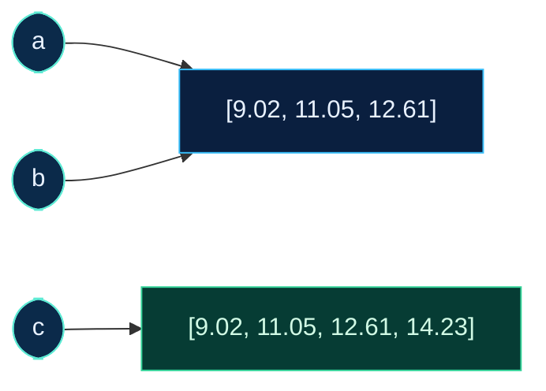

# Dr. Mindaugas Šarpis

# Best Research and Data Analysis Practices from CERN

## Python Foundations

##### <span class="aims-badge">🔧 tool-agnostic · ⚙️ automation</span>

<!--
Speaker: ask who has written Python before, and seat each of them next to
someone who has not. Python was installed in Seminar 4. The code blocks with a
play button run in the browser, so a laptop where the installation failed can
still follow. (~1 min)
-->

---
hideInToc: true
layout: quote
---

# The goal of this lecture is to **read and write a short Python program**: values and their types, names, decisions, loops, lists and dictionaries, and what to do when the program stops with an error.

<!--
Speaker: the three running examples are the pendulum table, the LHCb file
and the short script that cleaned the pendulum table in Seminar 4. One line
of each file is turned into numbers, a loop does it for every row, and every
line of the script is read. (~1 min)
-->

---
hideInToc: true
---

# Learning **Objectives**

<div class="note-text mt-sm">By the end of this lecture, you will be able to:</div>

<div class="grid-2 gap-md mt-sm">

<div class="card card-primary card-glass pad-compact">

🐍 **Run** Python at the prompt, as a script in the terminal, and from VS Code

</div>

<div class="card card-secondary card-glass pad-compact">

🔢 Name the **type** of a value, `int`, `float`, `str` or `bool`, and say what `+` and `/` do with it

</div>

<div class="card card-accent card-glass pad-compact">

🏷️ Say what a **name** is, and why two names can stand for one list

</div>

<div class="card card-warning card-glass pad-compact">

✂️ Turn one line of a CSV file into **numbers**: strip, split, convert

</div>

<div class="card card-success card-glass pad-compact">

🔁 Repeat a step for every row with **`for`**, decide with **`if`**, skip with **`continue`**

</div>

<div class="card card-info card-glass pad-compact">

📖 Keep a row as a **dictionary**, and count with one

</div>

<div class="card card-primary card-glass pad-compact">

🖨️ Print numbers with **f-strings**: decimals, widths, columns

</div>

<div class="card card-secondary card-glass pad-compact">

🧭 Read a **traceback** from the bottom, and find a bug with `print` and with the **debugger**

</div>

</div>

<!--
Speaker: eight abilities, in the order of the lecture. Functions are called
today and not written. (~1 min)
-->

---
hideInToc: true
---

# The Script from **Seminar 4**

<div class="card card-info card-glass pad-compact mt-sm">

```text
% python3 scripts/clean_pendulum.py data/raw/pendulum.csv data/processed/pendulum_script.csv
PS> python scripts/clean_pendulum.py data/raw/pendulum.csv data/processed/pendulum_script.csv
9 rows written to data/processed/pendulum_script.csv
```

</div>

<div class="grid-2 gap-md mt-sm" style="grid-template-columns: 3fr 2fr;">

<div class="card card-primary card-glass pad-compact">

## 📜 **`scripts/clean_pendulum.py`, lines 25–32**

```python {*}{lines:true,startLine:25}
def clean(lines):
    out = []
    for line in lines:
        if "mean" in line:
            continue
        line = line.replace(",", ".").replace(";", ",")
        out.append(line.split(",", 1)[1])
    return out
```

</div>

<div class="card card-success card-glass pad-compact">

## ✅ **What was checked**

The output has 97 bytes and the SHA-256 `be05af03…fff0870b` on every laptop: the size and checksum that Lecture 04 wrote into the README for the pendulum table.

</div>

</div>

<div class="card card-warning card-glass pad-compact mt-sm">

❓ The script was run and checked, and not read. What does each of these eight lines do?

</div>

<!--
Speaker: open scripts/clean_pendulum.py in VS Code. Seminar 4 ran it once
the installation worked; on a laptop where it failed, the run was on the
projector. Lecture 04 matched four of these lines to the four edits of the
README; nobody read the words. Leave the question on the screen. (~2 min)
-->

---
layout: section
hideInToc: true
---

# Running **Python**

The script was started by one line typed at the shell's prompt. The first word of that line is a program, and the program has a prompt of its own.

<!--
Speaker: everything in this section is done live in VS Code beside the slides.
(~1 min)
-->

---
hideInToc: true
---

# Python Is a **Program**

<div class="grid-2 gap-md mt-md">

<div class="card card-primary card-glass pad-compact">

## 🍎 **macOS · zsh**

```text
% python3 --version
Python 3.13.9
```

</div>

<div class="card card-secondary card-glass pad-compact">

## 🪟 **Windows · PowerShell**

```text
PS> python --version
Python 3.13.9
```

</div>

</div>

<div class="grid-2 gap-md mt-md">

<div class="card card-accent card-glass pad-compact">

## ⚙️ **What it does**

- `python3` or `python` is a program, the **interpreter**, started by the shell like `ls` in Lecture 04
- It reads Python text one statement at a time and carries each one out

</div>

<div class="card card-info card-glass pad-compact">

## 📄 **Two ways in**

Typed at its prompt, one line at a time, or written into a file. These slides write `python`; on macOS type `python3`. Every block here ran with Python 3.13.

</div>

</div>

<!--
Speaker: Seminar 4 checked the version once the installation was done; run
it again live. Another 3.x number is fine; an older version may word a
message slightly differently. Lecture 03 called a list of exact steps an algorithm: a Python
program is an algorithm in a form this program can read. If a laptop answers
"command not found", its owner follows in the browser today and shows the
message afterwards. (~2 min)
-->

---
hideInToc: true
---

# The `>>>` **Prompt**

<div class="grid-2 gap-md mt-sm">

<div class="card card-primary card-glass pad-compact">

## 🍎 **macOS · zsh**

```text
% python3
>>> 9.02 / 10
0.9019999999999999
>>> exit()
%
```

</div>

<div class="card card-secondary card-glass pad-compact">

## 🪟 **Windows · PowerShell**

```text
PS> python
>>> 9.02 / 10
0.9019999999999999
>>> exit()
PS>
```

</div>

</div>

<div class="card card-accent card-glass pad-compact table-compact mt-sm">

## 🔀 **The same line at another prompt**

| Typed at | `9.02 / 10` | `python3 scripts/period.py` |
| --- | --- | --- |
| `%`, zsh | `zsh: command not found: 9.02` | runs the script |
| `PS>`, PowerShell | `0.902` | runs it, typed with `python` |
| `>>>`, Python | `0.9019999999999999` | `SyntaxError: invalid syntax` |

</div>

<div class="note-text mt-sm">The mark says who reads the line: <code>%</code> and <code>PS&gt;</code> the shell, <code>&gt;&gt;&gt;</code> Python. PowerShell divides by itself and prints 15 digits; <code>(9.02 / 10) -eq 0.902</code> still answers False.</div>

<!--
Speaker: type it live in both shells. Lecture 04 read the prompt of the
shell; >>> is the third prompt, and exit() hands the line back to the shell.
Ask the room what the first slip will be: a shell command typed at >>>, or
Python typed at %. The long decimals of 0.902 are explained on the float
slide; say only that they are expected. The PowerShell 0.902 is the same
float shown with fewer digits. (~3 min)
-->

---
hideInToc: true
---

# The First **Script**

<div class="grid-2 gap-md mt-md">

<div class="card card-primary card-glass pad-compact">

## 📄 **A file: `scripts/period.py`**

```python
length_cm = 20
t10_s = 9.02
period_s = t10_s / 10
print(period_s)
```

</div>

<div class="card card-secondary card-glass pad-compact">

## ▶️ **Run from the project folder**

```text
% python3 scripts/period.py
0.9019999999999999

PS> python scripts/period.py
0.9019999999999999
```

</div>

</div>

<div class="card card-info card-glass pad-compact mt-md">

A script is a text file whose name ends in `.py`. It holds the lines that would be typed at `>>>`, and tomorrow it gives the same result. `scripts/period.py` is a relative path (Lecture 04): the line works where the prompt shows the project folder. The numbers are the first row of the pendulum table: 20 cm, 10 swings in 9.02 s.

</div>

<!--
Speaker: write the file live next to hello.py from Seminar 4 and run it.
This is the shape of the line that ran clean_pendulum.py. (~2 min)
-->

---
hideInToc: true
---

# A Script Runs **Top to Bottom**

<div class="card card-primary card-glass pad-compact table-compact mt-sm">

| Line of `period.py` | What Python does | Names after the line |
| --- | --- | --- |
| `length_cm = 20` | Makes the value 20 and gives it the name `length_cm` | `length_cm` |
| `t10_s = 9.02` | Makes the value 9.02 and gives it the name `t10_s` | `length_cm`, `t10_s` |
| `period_s = t10_s / 10` | Looks up `t10_s`, divides by 10, names the result | `length_cm`, `t10_s`, `period_s` |
| `print(period_s)` | Looks up `period_s` and writes it to the terminal | the same three |

</div>

<div class="grid-2 gap-md mt-md">

<div class="card card-secondary card-glass pad-compact">

## ⬇️ **One line after another**

A line can use only the names made above it. With `print(period_s)` moved to line 1 the script stops at once: `NameError: name 'period_s' is not defined`.

</div>

<div class="card card-accent card-glass pad-compact">

## 🖨️ **Only `print` shows something**

The prompt prints every value by itself. A script prints nothing unless it calls `print`. A `#` starts a comment: Python skips the rest of that line.

</div>

</div>

<!--
Speaker: read the table as the interpreter would, line by line. This picture,
a list of names that grows, is what the Variables panel of the debugger shows
later in the lecture. (~2 min)
-->

---
hideInToc: true
---

# Try It — The First **Script**

```py {monaco-run} {autorun:false}
# The first row of the pendulum table: 20 cm, 10 swings in 9.02 s
length_cm = 20
t10_s = 9.02
period_s = t10_s / 10
print(period_s)          # 0.9019999999999999
```

<div class="card card-info card-glass pad-compact mt-sm">

1. Run it with the play button.
2. Change `t10_s` to `11.05`, the row for 30 cm. It prints `1.105`.
3. Move the `print` line up to line 2 and run again. Read the last line of the message.

</div>

<!--
Speaker: step 3 is the first traceback of the course, made on purpose. The
last line names the problem: the name does not exist yet at that point. (~2 min)
-->

---
hideInToc: true
---

# Python in **VS Code**

<div class="grid-2 gap-md mt-md">

<div class="card card-primary card-glass pad-compact">

## 🧩 **The Python extension**

- Extensions view: `Ctrl+Shift+X` (macOS `Cmd+Shift+X`). Search `Python`, publisher Microsoft, **Install**
- Colours for the parts of the code, and a list of names to complete while typing
- A wavy line under a name that was never made, before the script runs
- The version of Python in the Status Bar. A click on it selects another one

</div>

<div class="card card-secondary card-glass pad-compact">

## ▶️ **Three ways to run**

- **In the terminal:** `python3 scripts/period.py` on macOS, `python scripts/period.py` on Windows. This is the form that goes into a README
- **Run Python File**, the ▶ at the top right of the Editor. VS Code types the same command, with absolute paths
- **`Shift+Enter`** on a line. That line is sent to a prompt in the terminal

</div>

</div>

<div class="card card-warning card-glass pad-compact mt-md">

⚠️ The extension contains no Python. It uses the Python that is installed on the laptop. The terminal runs the file as it is saved: a dot on the tab means that the last changes are not in the file yet.

</div>

<!--
Speaker: install the extension live and run period.py in all three ways. Point
at the command that the ▶ button types: the absolute paths of Lecture 04,
/Users/ada/... on a Mac and C:\Users\ada\... on Windows, so it runs from any
folder. The relative form is the one that works on every laptop. (~3 min)
-->

---
layout: section
hideInToc: true
---

# Values, Types & **Names**

The script printed 0.9019999999999999 for 9.02 / 10. Every value it makes has a type, and the type decides what an operation does with it.

<!--
Speaker: Lecture 03 built integers, floats and text from bits. This section
shows the same three in Python, and explains the long decimals. (~1 min)
-->

---
hideInToc: true
---

# Every Value Has a **Type**

<div class="grid-2 gap-md mt-md">

<div class="card card-primary card-glass pad-compact table-compact">

## 🧱 **Four types**

| Type | Example | Holds |
| --- | --- | --- |
| `int` | `20` | a whole number |
| `float` | `9.02` | a number with a fraction |
| `str` | `"9.02"` | text, between quotes |
| `bool` | `True` | `True` or `False` |

</div>

<div class="card card-secondary card-glass pad-compact">

## 🔎 **Ask with `type`**

```python
type(20)        # <class 'int'>
type(9.02)      # <class 'float'>
type("9.02")    # <class 'str'>
20 + 20         # 40
"20" + "20"     # '2020'
```

</div>

</div>

<div class="card card-info card-glass pad-compact mt-md">

The type decides what an operation does: `+` adds two numbers and joins two texts. Lecture 03 showed it for bytes: the same bits are different values under different types. `9.02` and `"9.02"` look alike on the screen. The first is a number, the second is four characters.

</div>

<!--
Speaker: type the five lines at the prompt. The quotes are the difference
between a number and its text, and most errors of a first data script come
from mixing the two. (~2 min)
-->

---
hideInToc: true
---

# `int`: No Fixed **Width**

<div class="card card-info card-glass pad-compact mt-sm">

In Lecture 03 an 8-bit integer held −128 to 127, and 127 + 1 wrapped round to −128. A Python `int` takes as many bits as the number needs. It does not overflow.

</div>

```py {monaco-run} {autorun:false}
print(127 + 1)                   # 128
print(2 ** 64)                   # 18446744073709551616
print((2 ** 64).bit_length())    # 65: one bit more than a 64-bit integer has
print(2 ** 200)                  # 61 digits, every one of them exact
```

<div class="note-text mt-sm">The price is memory and speed. Files and large tables of numbers keep fixed widths: the original of the data file stores each value in 4 bytes.</div>

<!--
Speaker: ** is the power operator. Ask what an int64 would do at 2 to the 64:
it would wrap to 0. Python counts on. (~2 min)
-->

---
hideInToc: true
---

# `float`: The float64 of **Lecture 03**

<div class="grid-2 gap-md mt-md">

<div class="card card-primary card-glass pad-compact">

## 🧮 **At the prompt**

```python
9.02 / 10           # 0.9019999999999999
0.1 + 0.2           # 0.30000000000000004
0.1 + 0.2 == 0.3    # False
1e16 + 1            # 1e+16
6.022e23            # 6.022e+23
```

</div>

<div class="card card-secondary card-glass pad-compact">

## 📐 **Why**

- A Python `float` has 64 bits: 53 binary digits, about 16 decimal digits
- 9.02 has no exact binary form, like 0.1. The stored number is its nearest neighbour, and the division shows the difference
- Near 10¹⁶ the step from one float to the next is 2. Adding 1 changes nothing
- `e` writes a power of ten

</div>

</div>

<div class="card card-warning card-glass pad-compact mt-md">

⚠️ Two floats are not compared with `==`. They are compared with a tolerance: `abs(a - b) < 1e-9`. The long decimals are not an error of the script. They are cut for the reader when the number is printed, and kept in the calculation.

</div>

<!--
Speaker: 0.9019999999999999 was on the screen since the >>> prompt. Now it
has a reason: the multiply-by-2 slide of Lecture 03. Nothing is wrong with the
measurement or with Python. PowerShell's 0.902 was this float cut to 15
digits for the reader, which is the last sentence of the bottom card. (~2 min)
-->

---
hideInToc: true
---

# **Arithmetic**

<div class="grid-2 gap-md mt-md">

<div class="card card-primary card-glass pad-compact table-compact">

## ➗ **Operators**

| Expression | Value | |
| --- | --- | --- |
| `20 + 9.02` | `29.02` | an `int` with a `float` gives a `float` |
| `20 / 100` | `0.2` | `/` always gives a `float` |
| `10 / 2` | `5.0` | also when it divides evenly |
| `7 // 2` | `3` | whole part of the division |
| `7 % 2` | `1` | remainder |
| `2 ** 10` | `1024` | power |

</div>

<div class="card card-secondary card-glass pad-compact">

## 🪜 **Order**

```python
2 + 3 * 4        # 14
(2 + 3) * 4      # 20
-2 ** 2          # -4
20 / 100 ** 2    # 0.002
```

`**` comes first, then `*`, `/`, `//` and `%`, then `+` and `-`. Brackets change the order, and they cost nothing when in doubt.

</div>

</div>

<div class="card card-info card-glass pad-compact mt-md">

`7 // 2` and `7 % 2` answer two questions about 7 swings counted in pairs: 3 full pairs, 1 swing left over. Together they give the 7 back: 3&nbsp;×&nbsp;2&nbsp;+&nbsp;1.

</div>

<!--
Speaker: the two surprises are / giving a float for 10 / 2, and the minus sign
binding less tightly than the power. (~2 min)
-->

---
hideInToc: true
---

# **Names**

<div class="grid-2 gap-md mt-md">

<div class="card card-primary card-glass pad-compact">

## 🏷️ **`name = value`**

```python
t10_s = 9.02
period_s = t10_s / 10
t10_s = 11.05
print(period_s)      # 0.9019999999999999
```

The right side is worked out first. Then the name is put on the result. Line 3 moves the name `t10_s` to a new value. `period_s` is not touched: it names a number, not a formula.

</div>

<div class="card card-secondary card-glass pad-compact">

## 📌 **After line 3**

```text
t10_s     ───▶  11.05
period_s  ───▶  0.9019999999999999
                9.02     no name left
```

- `=` is not the equals sign of mathematics. `n = n + 1` adds one to `n`
- A name has letters, digits and `_`, and no digit first. `T10_s` and `t10_s` are two names

</div>

</div>

<div class="card card-info card-glass pad-compact mt-md">

A name with its value is called a **variable**. The type belongs to the value: after `x = 20`, `x = "twenty"` is allowed.

</div>

<!--
Speaker: for the Excel users. A cell with =A1/10 follows A1. A Python name
does not follow anything: line 2 ran once, with the value t10_s had then. To
get the new period, line 2 has to run again. (~3 min)
-->

---
hideInToc: true
---

# Calling a **Function**

<div class="grid-2 gap-md mt-md">

<div class="card card-primary card-glass pad-compact">

## 📞 **Built in**

```python
len("M,PT,TAU,IPCHI2")          # 15
round(0.9019999999999999, 3)    # 0.902
abs(-100.0)                     # 100.0
max(9.02, 11.05)                # 11.05
"m,pt".upper()                  # 'M,PT'
```

A call is a name, brackets, and the **arguments** between them. The function hands back a value. `upper` is a **method**: a function that belongs to a value and is written after a dot.

</div>

<div class="card card-secondary card-glass pad-compact">

## 📦 **From a module**

```python
import math

math.sqrt(2)      # 1.4142135623730951
math.pi           # 3.141592653589793
```

`import math` makes the functions of the module `math` available under the prefix `math.`

</div>

</div>

<div class="card card-info card-glass pad-compact mt-md">

`round(9.02 / 10, 3)` is worked out from the inside: first the argument, 9.02 / 10 = 0.9019999999999999, then the call, which hands back `0.902`. `print` writes to the terminal and hands back nothing.

</div>

<!--
Speaker: a function is used here as a ready-made tool. Read the call aloud:
"round of 9.02 over 10, to 3 places". clean_pendulum.py calls replace,
split and append the same way, as methods after a dot. (~2 min)
-->

---
hideInToc: true
---

# `str`: Unicode **Text**

<div class="card card-info card-glass pad-compact mt-sm">

A `str` is a sequence of Unicode characters. `len` counts characters. The bytes of Lecture 03 appear when the text is encoded for a file.

</div>

```py {monaco-run} {autorun:false}
word = "ąžuolas"
print(len(word))                     # 7 characters
print(len(word.encode("utf-8")))     # 9 bytes: ą and ž take two bytes each
print(ord("ą"), hex(ord("ą")))       # 261 0x105: the code point U+0105
print("ą".encode("utf-8"))           # b'\xc4\x85': the two bytes C4 85
print(len("20,9.02\n"))              # 8: \n is one character, the line break
```

<div class="note-text mt-sm">Single and double quotes make the same string. Inside quotes, \n stands for the line break, byte 0A.</div>

<!--
Speaker: the same ą that was encoded by hand in Lecture 03: code point
U+0105, packed by UTF-8 into the two bytes C4 85, both on the slide. Python
keeps characters and bytes apart as two types, str and bytes. (~2 min)
-->

---
hideInToc: true
---

# `bool`: **Comparisons**

<div class="grid-2 gap-md mt-md">

<div class="card card-primary card-glass pad-compact">

## ⚖️ **Compare**

```python
t10_s = 9.02
t10_s > 9          # True
t10_s == 9.02      # True
t10_s != 9.02      # False
9 < t10_s < 10     # True
"20" == 20         # False
```

</div>

<div class="card card-secondary card-glass pad-compact">

## 🔗 **Combine**

```python
m = 1880.649
m > 1855 and m < 1875    # False
m < 1855 or m > 1875     # True
not m > 1855             # False
"TAU" in "M,PT,TAU"      # True
```

</div>

</div>

<div class="card card-info card-glass pad-compact mt-md">

`=` puts a name on a value. `==` asks whether two values are equal and answers with a `bool`.<br>A text is never equal to a number: `"20" == 20` is `False`, with no error and no warning.<br>`1880.649` is the mass in the first row of the LHCb file, 15.8&nbsp;MeV/c² above the D⁰ mass of 1864.84.

</div>

<!--
Speaker: = against == is the classic slip. The last comparison of the left
card is the dangerous one, because it fails silently. The `in` of the last
line on the right is line 28 of clean_pendulum.py: "mean" in line. (~2 min)
-->

---
hideInToc: true
---

# From Text to **Number**

<div class="grid-2 gap-md mt-md" style="grid-template-columns: 2fr 3fr;">

<div class="card card-primary card-glass pad-compact">

## 🔁 **The type name converts**

```python
float("9.02")     # 9.02
int("20")         # 20
str(20)           # '20'
int(9.99)         # 9, cut off
round(9.99)       # 10
"20" + "9.02"     # '209.02'
"20" * 3          # '202020'
```

</div>

<div class="card card-warning card-glass pad-compact">

## 💥 **What cannot be converted**

- `float("9,02")`<br>`ValueError: could not convert string to float: '9,02'`
- `int("9.02")`<br>`ValueError: invalid literal for int() with base 10: '9.02'`
- `"20" + 9.02`<br>`TypeError: can only concatenate str (not "float") to str`

</div>

</div>

<div class="card card-info card-glass pad-compact mt-md">

**A file holds text. A value becomes a number only by a step the script states, and a wrong step often gives no message.** `float` accepts a decimal point only, so `9,02` is repaired first: line 30 of `clean_pendulum.py` does that.

</div>

<!--
Speaker: the last two lines of the left card are the reason this slide exists.
Text plus text is longer text, with no error. The right card is three messages
the room will see within the hour. Read the bold sentence aloud: it is the
claim of this lecture. (~3 min)
-->

---
layout: section
hideInToc: true
---

# Strings & **Lists**

`float("9.02")` converts one value. A line of `D0_KPi.csv` holds four, as one string with commas between them; cut at the commas, it is a list.

<!--
Speaker: the section builds the central recipe of the lecture: one line of a
CSV file becomes four numbers. (~1 min)
-->

---
hideInToc: true
---

# Index and **Slice**

```python
line = "1880.649,3000.9534,0.00041271152,1299.1675"     # line 2 of D0_KPi.csv
```

<div class="grid-2 gap-md mt-sm">

<div class="card card-primary card-glass pad-compact">

## 👉 **One character**

```text
 1  8  8  0  .  6  4  9  ,  3  0  …
 0  1  2  3  4  5  6  7  8  9 10  …
```

```python
len(line)     # 42
line[0]       # '1'
line[8]       # ','
line[-1]      # '5', the last one
```

</div>

<div class="card card-secondary card-glass pad-compact">

## ✂️ **A piece**

```python
line[0:8]     # '1880.649'
line[:8]      # '1880.649'
line[9:18]    # '3000.9534'
line[-9:]     # '1299.1675'
```

`[start:stop]` takes the characters from `start` up to, and not including, `stop`. Its length is stop − start.

</div>

</div>

<div class="card card-info card-glass pad-compact mt-sm">

Positions count from 0, so the last of 42 characters has the index 41. In the file the line takes 43 bytes: 42 characters, one byte each, and the line break `0A`.<br>`line[42]` stops with `IndexError: string index out of range`. A string cannot be changed: `line[0] = "2"` is a `TypeError`.

</div>

<!--
Speaker: draw the positions between the characters on the board: a slice
cuts at two of them. The 43 bytes are digits, points and commas, all ASCII,
so characters and bytes count alike here; the ą of the str slide was the
case where they do not. (~3 min)
-->

---
hideInToc: true
---

# String **Methods**

<div class="grid-2 gap-md mt-md">

<div class="card card-primary card-glass pad-compact">

## 🧰 **Six of them**

```python
"20,9.02\n".strip()            # '20,9.02'
"20,9.02".split(",")           # ['20', '9.02']
"1,20,9.02".split(",", 1)      # ['1', '20,9.02']
"9,02".replace(",", ".")       # '9.02'
"t10_s".startswith("t10")      # True
";".join(["1", "20", "9,02"])  # '1;20;9,02'
```

</div>

<div class="card card-secondary card-glass pad-compact">

## 🔁 **Two replacements, in this order**

```python
raw = "1;20;9,02"
a = raw.replace(",", ".")     # '1;20;9.02'
b = a.replace(";", ",")       # '1,20,9.02'
```

In the other order the result is `'1.20.9.02'`. The decimal comma goes first, as in the Find and Replace of Lecture 02. Line 30 of `clean_pendulum.py` is these two lines in one.

</div>

</div>

<div class="card card-info card-glass pad-compact mt-md">

A method hands back a **new** string: `raw` is still `'1;20;9,02'`. `strip` removes spaces and line breaks at both ends. `split` cuts at the separator; with a second argument, `1`, it cuts once, which is how line 31 drops the column `nr`.

</div>

<!--
Speaker: the right card is the repair of the raw pendulum file as two lines of
code, and line 30 of the script writes them as one:
line.replace(",", ".").replace(";", ","), the second method called on the
result of the first. The order argument is the same as in the editor. (~3 min)
-->

---
hideInToc: true
---

# **Lists**

<div class="grid-2 gap-md mt-md">

<div class="card card-primary card-glass pad-compact">

## 📋 **Items in order**

```python
t10 = [9.02, 11.05, 12.61]
len(t10)             # 3
t10[0]               # 9.02
t10[1:]              # [11.05, 12.61]
t10.append(14.23)    # now 4 items
t10[0] = 9.03        # the first item replaced
sum(t10)             # 46.92
max(t10)             # 14.23
```

</div>

<div class="card card-secondary card-glass pad-compact">

## 🔀 **Two ways to sort**

```python
x = [12.61, 9.02, 11.05]
sorted(x)    # [9.02, 11.05, 12.61], a new list
x.sort()     # x itself is now sorted
```

`x.sort()` hands back `None`. Writing `x = x.sort()` loses the list.

</div>

</div>

<div class="card card-info card-glass pad-compact mt-md">

A list is indexed and sliced like a string. Unlike a string it **can be changed** in place: `append`, `sort` and `t10[0] = …` alter the list itself. Its items may have any type, and a list of lists is a table.

</div>

<!--
Speaker: square brackets make a list. The difference from a string that
matters is the last card: a list changes in place, and that has a consequence
on the slide Two Names, One List. out = [] and out.append(...) are lines 26
and 31 of clean_pendulum.py: an empty list, then one item per row. (~2 min)
-->

---
hideInToc: true
---

# One Line, **Four Numbers**

```python
line = "1880.649,3000.9534,0.00041271152,1299.1675\n"
clean = line.strip()          # '1880.649,3000.9534,0.00041271152,1299.1675'
parts = clean.split(",")      # ['1880.649', '3000.9534', '0.00041271152', '1299.1675']
m = float(parts[0])           # 1880.649
pt = float(parts[1])          # 3000.9534
tau = float(parts[2])         # 0.00041271152
ipchi2 = float(parts[3])      # 1299.1675
print(m - 1865)               # 15.648999999999887
```

<div class="grid-3 gap-md mt-sm">

<div class="card card-primary card-glass pad-compact">

## 1️⃣ **Strip**

The line break at the end goes. 43 characters become 42.

</div>

<div class="card card-secondary card-glass pad-compact">

## 2️⃣ **Split**

One string becomes a list of four strings. The commas are gone.

</div>

<div class="card card-accent card-glass pad-compact">

## 3️⃣ **Convert**

Each string becomes a `float`. Arithmetic works on it.

</div>

</div>

<div class="note-text mt-sm">Before the conversion, <code>parts[0] - 1865</code> stops with: TypeError: unsupported operand type(s) for -: 'str' and 'int'.</div>

<!--
Speaker: the centre of the lecture. Type it live in scripts/parse_line.py and
print after every line. The four names are the four columns of the header:
M, PT, TAU, IPCHI2. (~4 min)
-->

---
hideInToc: true
---

# Try It — Parse **Another Line**

```py {monaco-run} {autorun:false}
line = "1818.1002,2978.644,-100.0,9901.186\n"     # line 343 of D0_KPi.csv
parts = line.strip().split(",")
m = float(parts[0])
tau = float(parts[2])
print(parts)
print(m, tau)
print(tau == -100)        # True: this row has no decay time
```

<div class="card card-info card-glass pad-compact mt-sm">

1. Run it. Two methods are chained: `strip` first, then `split` on its result.
2. Change `parts[2]` to `parts[4]` and read the last line of the message.
3. Write the mass with a decimal comma, `1818,1002`, and run again. There is no error. Which number is now `tau`?

</div>

<!--
Speaker: step 3 is the decimal comma of Lecture 02 once more. The split makes
five parts, m is 1818.0 and tau is 2978.644: wrong numbers, no message, the
bold sentence of From Text to Number. (~3 min)
-->

---
hideInToc: true
---

# Two Names, One **List**

<div class="grid-2 gap-md mt-md">

<div class="card card-primary card-glass pad-compact">

## 👥 **`b = a` copies nothing**

```python
a = [9.02, 11.05]
b = a
b.append(12.61)
print(a)       # [9.02, 11.05, 12.61]

c = a.copy()
c.append(14.23)
print(a)       # [9.02, 11.05, 12.61]
```

</div>

<div class="card card-secondary card-glass pad-compact">

## 📌 **Names and objects**



</div>

</div>

<div class="card card-info card-glass pad-compact mt-md">

A value in memory is an **object**. `b = a` puts a second name on the same object. A change made through `b` is seen through `a`, because there is one list. `a.copy()` makes a second list. Numbers and strings cannot be changed, so two names on one of them never show.

</div>

<!--
Speaker: this is the Names slide again, with an object that can change. Ask
the room for the output of the first print before running it. (~3 min)
-->

---
layout: section
hideInToc: true
---

# Decisions & **Loops**

One line became four numbers. The pendulum table has nine rows and `D0_KPi.csv` 91 583, so the steps for one line have to run once for each line, and skip some.

<!--
Speaker: with for and if a script stops being a calculator. The section
computes the period of every row of the pendulum table, and ends with every
line of clean() read. (~1 min)
-->

---
hideInToc: true
---

# `if`: Run a Block or **Skip It**

<div class="grid-2 gap-md mt-md">

<div class="card card-primary card-glass pad-compact">

## 🔀 **One of three blocks**

```python
tau = -100.0
if tau == -100:
    print("decay time missing")
elif tau < 0:
    print("negative: check the file")
else:
    print("decay time", tau)
```

It prints `decay time missing`.

</div>

<div class="card card-secondary card-glass pad-compact">

## 📐 **The rules**

- The condition is a `bool`. The line ends with `:`
- The block is the lines below it that are indented by 4 spaces
- The conditions are tried from the top. The first true one runs its block, and the rest are skipped
- `elif` and `else` can be left out

</div>

</div>

<div class="card card-warning card-glass pad-compact mt-md">

⚠️ The indentation is part of the language. Without it Python stops before the first line runs:<br>`IndentationError: expected an indented block after 'if' statement on line 2`<br>VS Code indents by 4 spaces after a `:`, and when `Tab` is pressed.

</div>

<!--
Speaker: the LHCb file marks a missing decay time with -100. Lecture 04
counted 49 such rows, and Seminar 4 wrote data/processed/D0_valid.csv without
them. With tau = 0.00041271152 the same lines print
"decay time 0.00041271152". (~3 min)
-->

---
hideInToc: true
---

# `for`: Once for **Each Item**

<div class="grid-2 gap-md mt-md">

<div class="card card-primary card-glass pad-compact">

## 🔁 **The loop**

```python
texts = ["9.02", "11.05", "12.61"]
periods = []
for text in texts:
    period_s = float(text) / 10
    periods.append(period_s)
print(periods)
```

It prints `[0.9019999999999999, 1.105, 1.261]`.

</div>

<div class="card card-secondary card-glass pad-compact table-compact">

## 🧾 **Turn by turn**

| Turn | `text` | `period_s` | Items in `periods` |
| --- | --- | --- | --- |
| 1 | `'9.02'` | `0.9019999999999999` | 1 |
| 2 | `'11.05'` | `1.105` | 2 |
| 3 | `'12.61'` | `1.261` | 3 |

</div>

</div>

<div class="card card-info card-glass pad-compact mt-md">

`for text in texts:` puts the name `text` on each item in turn and runs the indented block once for each. The block is written for **one** item. After the last item the script goes on with the first line that is not indented.

</div>

<!--
Speaker: walk the table with a finger on the code. The loop variable is an
ordinary name, moved by the loop. `periods = []` is an empty list. The same
shape is lines 26, 27 and 31 of clean_pendulum.py: out = [], for line in
lines:, out.append(...). (~3 min)
-->

---
hideInToc: true
---

# The Table as **Lines**

<div class="grid-2 gap-md mt-md">

<div class="card card-primary card-glass pad-compact">

## 📥 **The file, pasted**

```python
table = """length_cm,t10_s
20,9.02
30,11.05
40,12.61
50,14.23
60,15.49
70,16.84
80,17.90
90,19.10
100,20.01"""
lines = table.splitlines()
```

</div>

<div class="card card-secondary card-glass pad-compact">

## 📋 **A list of strings**

```python
len(lines)     # 10
lines[0]       # 'length_cm,t10_s'
lines[1]       # '20,9.02'
lines[-1]      # '100,20.01'
lines[1:3]     # ['20,9.02', '30,11.05']
```

- Three quotes open a string that runs over several lines
- `splitlines` cuts it at the line breaks
- `lines[1:]` is every line but the header

</div>

</div>

<div class="note-text mt-sm">The text between the quotes is data/processed/pendulum_script.csv, the file clean_pendulum.py wrote in Seminar 4, copied from the editor.</div>

<!--
Speaker: the table repaired on the projector at the end of Lecture 02 and by
the script in Seminar 4, now inside a script. Ten lines: one header and nine
rows. (~2 min)
-->

---
hideInToc: true
---

# The Period for **Every Row**

<div class="grid-2 gap-md mt-md">

<div class="card card-primary card-glass pad-compact">

## 🔁 **Five lines**

```python
for line in lines[1:]:
    parts = line.split(",")
    length_cm = float(parts[0])
    period_s = float(parts[1]) / 10
    print(length_cm, period_s)
```

The block is the recipe of the last section, for one line: split, convert, compute. The loop applies it to each of the nine rows.

</div>

<div class="card card-secondary card-glass pad-compact">

## 🖥️ **It prints**

```text
20.0 0.9019999999999999
30.0 1.105
40.0 1.261
50.0 1.423
60.0 1.549
70.0 1.684
80.0 1.7899999999999998
90.0 1.9100000000000001
100.0 2.0010000000000003
```

</div>

</div>

<div class="card card-success card-glass pad-compact mt-md">

⚙️ The same five lines handle 9 rows and 91 583 rows. Four of the nine periods show their float64 digits. The section on output prints them with three decimals.

</div>

<!--
Speaker: run it live in scripts/periods.py. A pendulum of 1 m has a period of
about 2 s: the last row is a check that the numbers are sensible. (~3 min)
-->

---
hideInToc: true
---

# A Sum in a **Loop**

```py {monaco-run} {autorun:false}
t10 = [9.02, 11.05, 12.61, 14.23, 15.49, 16.84, 17.90, 19.10, 20.01]

total = 0.0
for t in t10:
    total = total + t / 10       # the period of this row, added to the sum
mean = total / len(t10)

print(total)      # 13.625
print(mean)       # 1.5138888888888888
```

<div class="grid-2 gap-md mt-sm">

<div class="card card-primary card-glass pad-compact">

**The pattern:** a start value before the loop, an update inside it, the result after it. `total += t / 10` is the short form of the update.

</div>

<div class="card card-success card-glass pad-compact">

**The check:** the raw file has the line `;mean;15,14`, the one `clean()` skips: 15.14 s for 10 swings, so one swing is 1.514 s.

</div>

</div>

<!--
Speaker: Python has sum() for this. The loop is written out because the same
three places, before, inside and after, carry every count, sum, minimum and
maximum over a file. (~3 min)
-->

---
hideInToc: true
---

# `while` and `range`

<div class="grid-2 gap-md mt-md">

<div class="card card-primary card-glass pad-compact">

## 🔄 **`while`: as long as**

```python
n = 0
while 2 ** n < 91583:
    n = n + 1
print(n)       # 17
```

How many bits number the 91 583 rows of the file? 2¹⁶ = 65 536 is too few. 2¹⁷ = 131 072 is enough.

</div>

<div class="card card-secondary card-glass pad-compact">

## 🔢 **`range`: counting**

```python
list(range(5))
# [0, 1, 2, 3, 4]
list(range(20, 101, 10))
# [20, 30, 40, 50, 60, 70, 80, 90, 100]
for i in range(1, 4):
    print(i, lines[i])
# 1 20,9.02
# 2 30,11.05
# 3 40,12.61
```

</div>

</div>

<div class="card card-warning card-glass pad-compact mt-md">

⚠️ `range(start, stop, step)` leaves out the stop, like a slice. A `while` whose condition never turns false runs without end: `Ctrl+C` in the terminal stops the script.

</div>

<!--
Speaker: for is for "each item", while is for "until". The while example is
the bit count of Lecture 03, found by trying. range(20, 101, 10) gives the
nine lengths of the pendulum table. (~2 min)
-->

---
hideInToc: true
---

# A List in **One Line**

<div class="grid-2 gap-md mt-md">

<div class="card card-primary card-glass pad-compact">

## 🔁 **The loop**

```python
periods = []
for t in t10:
    periods.append(t / 10)
```

</div>

<div class="card card-accent card-glass pad-compact">

## ⚡ **The comprehension**

```python
periods = [t / 10 for t in t10]
```

Read it as: the list of `t / 10` for each `t` in `t10`.

</div>

</div>

<div class="card card-secondary card-glass pad-compact mt-md">

## 🎯 **With a condition, and on the parts of a line**

```python
slow = [t / 10 for t in t10 if t > 18]     # [1.9100000000000001, 2.0010000000000003]
values = [float(p) for p in parts]         # ['20', '9.02'] becomes [20.0, 9.02]
```

</div>

<div class="note-text mt-sm">A comprehension is for one short expression per item. A block of several steps stays a loop.</div>

<!--
Speaker: the last line is the convert step of the recipe for a line with any
number of columns. (~2 min)
-->

---
hideInToc: true
---

# Try It — Skip the **Missing Value**

```py {monaco-run} {autorun:false}
rows = """1880.649,3000.9534,0.00041271152,1299.1675
1860.6599,2803.4126,0.0001864154,0.34182164
1818.1002,2978.644,-100.0,9901.186
1913.8755,2542.169,0.00018464602,17.386473"""

n_ok = 0
total = 0.0
for line in rows.splitlines():
    tau = float(line.split(",")[2])
    if tau == -100:
        print("missing:", line)
        continue                 # the rest of the block is skipped for this line
    n_ok += 1
    total += tau
print(n_ok, total / n_ok)        # 3 0.00026125764666666665
```

<div class="note-text mt-sm">Averaged without the <code>if</code>, the four rows give −24.9998: −100 counted as a number, with no message. Lecture 04 saw the same on the whole file, −0.0525 against 0.00098 ns. <code>continue</code> is line 29 of clean_pendulum.py.</div>

<!--
Speaker: a loop, a decision inside it, and two running values. continue ends
this turn of the loop at once and goes on with the next line, so the two
updates below it are skipped for the -100 row. Without the if the mean decay
time is negative, which no time can be. A marker such as -100 has to be
handled before any arithmetic. (~3 min)
-->

---
hideInToc: true
---

# `clean()`, Line by **Line**

<div class="card card-primary card-glass pad-compact table-compact mt-sm">

| Line | Code | What it does |
| --- | --- | --- |
| 25 | `def clean(lines):` | Gives the block below a name, `clean`, and its input a name, `lines` |
| 26 | `out = []` | An empty list for the lines that are kept |
| 27 | `for line in lines:` | Runs lines 28–31 once for each line of the file |
| 28 | `if "mean" in line:` | A `bool`: does the text `mean` occur in this line? |
| 29 | `continue` | If it does, lines 30–31 are skipped for this line |
| 30 | `line = line.replace(",", ".").replace(";", ",")` | Decimal comma to point first, then `;` to `,` |
| 31 | `out.append(line.split(",", 1)[1])` | One cut at the first comma; item `[1]`, the part after it, is kept |
| 32 | `return out` | Hands the list of kept lines back to whoever called `clean` |

</div>

<div class="card card-success card-glass pad-compact mt-sm">

Row 1 of the raw file: `1;20;9,02` → line 30 → `1,20,9.02` → `split(",", 1)` → `['1', '20,9.02']` → item `[1]` → `20,9.02`. The column `nr` is gone, and the line `;mean;15,14` never reaches line 30.

</div>

<!--
Speaker: this answers the question of the opening slide. Let the room read
each line aloud before the right column is shown, and name the slide that
taught it: Lists (26), for (27), bool and if (28), Skip the Missing Value
(29), String Methods (30, 31), Index and Slice for [1] (31). Lines 25 and 32
make clean a function of its own; the slides called functions and did not
write one. main(), which opens the files, is the rest of the script. (~3 min)
-->

---
hideInToc: true
---

# The 97 Bytes, **Rebuilt**

```py {monaco-run} {autorun:false}
import hashlib                  # a module of Python: its sha256 is called, not read
raw = ("nr;length_cm;t10_s\n1;20;9,02\n2;30;11,05\n3;40;12,61\n4;50;14,23\n5;60;15,49\n"
       "6;70;16,84\n7;80;17,90\n8;90;19,10\n9;100;20,01\n;mean;15,14\n")   # data/raw/pendulum.csv
out = []
for line in raw.splitlines():
    if "mean" in line:
        continue
    line = line.replace(",", ".").replace(";", ",")
    out.append(line.split(",", 1)[1])
data = ("\n".join(out) + "\n").encode("utf-8")
print(len(out), out[0], out[1])                          # 10 length_cm,t10_s 20,9.02
print(len(data), hashlib.sha256(data).hexdigest()[:8])   # 97 be05af03
```

<div class="grid-2 gap-md mt-sm">

<div class="card card-primary card-glass pad-compact">

Lines 4–9 are the body of `clean()`, run on the 130 bytes of the raw file pasted as text. Two strings side by side in brackets are joined into one.

</div>

<div class="card card-success card-glass pad-compact">

97 bytes and `be05af03`: the size and the start of the checksum from Seminar 4 and the README. `hashlib` comes with Python and is used as given, like `math.sqrt`.

</div>

</div>

<!--
Speaker: run it. Ten lines kept, the header and nine rows, joined with a line
break after each: 97 bytes, and the checksum starts be05af03 as in Seminar 4.
The script was read line by line and gives the same bytes in the browser.
Change "mean" to "means" and run again: 11 lines, 108 bytes, checksum
74e1a2a7, because the line mean,15.14 is kept. One wrong word, no message:
only the known size and checksum show it. (~3 min)
-->

---
layout: section
hideInToc: true
---

# Dictionaries & **Tuples**

The loops found each value by its position: `parts[2]` is the decay time only because the header says so. A dictionary finds a value by a name.

<!--
Speaker: parts[2] says nothing about what the third value is. A dictionary
keeps the column name with the value. (~1 min)
-->

---
hideInToc: true
---

# A Row with **Names**: `dict`

<div class="grid-2 gap-md mt-md">

<div class="card card-primary card-glass pad-compact">

## 📖 **Key and value**

```python
row = {"M": 1880.649, "PT": 3000.9534}
row["M"]                    # 1880.649
row["TAU"] = 0.00041271152  # a third pair
len(row)                    # 3
"IPCHI2" in row             # False
row.get("IPCHI2", 0.0)      # 0.0
```

</div>

<div class="card card-secondary card-glass pad-compact">

## 📐 **The rules**

- Curly brackets, and `key: value` pairs with commas between them
- `row["M"]` looks a value up by its key. Keys are mostly strings
- `row[key] = value` adds a pair, or replaces the value of a key that exists
- A key that is not there stops the script with a `KeyError`. `get` hands back a default instead

</div>

</div>

<div class="card card-info card-glass pad-compact mt-md">

`parts[2]` and `row["TAU"]` hold the same number. The second says what it is. A dictionary keeps its pairs in the order in which they were added.

</div>

<!--
Speaker: a dictionary is a small table with two columns, key and value. The
keys here are the column names of the header line. (~2 min)
-->

---
hideInToc: true
---

# Try It — Header and Line into a **dict**

```py {monaco-run} {autorun:false}
names = "M,PT,TAU,IPCHI2".split(",")
parts = "1880.649,3000.9534,0.00041271152,1299.1675".split(",")

row = {}                               # an empty dictionary
for i in range(len(names)):            # i = 0, 1, 2, 3
    row[names[i]] = float(parts[i])

print(row)
for name, value in row.items():        # each pair in turn
    print(name, value)
```

<div class="card card-info card-glass pad-compact mt-sm">

Line 1 of the file gives the keys, line 2 the values. `range(len(names))` counts the positions, and the same `i` picks the name and its value. `items()` hands over each pair, and `name, value` puts one name on each half.

</div>

<!--
Speaker: the output is {'M': 1880.649, 'PT': 3000.9534, 'TAU': 0.00041271152,
'IPCHI2': 1299.1675} and then one pair per line. Add print(row["M"] - 1865)
at the end. (~3 min)
-->

---
hideInToc: true
---

# Counting with a **dict**

```py {monaco-run} {autorun:false}
masses = [1880.649, 1860.6599, 1913.8755, 1888.7571, 1862.51, 1826.5465,
          1871.8599, 1911.6691, 1898.9976, 1827.2965, 1856.4816]

counts = {}
for m in masses:
    low = int(m // 25) * 25                # 1880.649 belongs to the bin that starts at 1875
    counts[low] = counts.get(low, 0) + 1   # one more in that bin

for low in sorted(counts):
    print(low, "#" * counts[low])
```

<div class="grid-2 gap-md mt-sm">

<div class="card card-primary card-glass pad-compact">

`m // 25` is 75.0 for 1880.649: the mass lies in bin number 75 of width 25. `counts.get(low, 0)` is the count so far, or 0 for a bin seen for the first time.

</div>

<div class="card card-success card-glass pad-compact">

The masses of the first 11 rows of the file, counted in bins of 25&nbsp;MeV/c²: 2, 4, 3 and 2. A table of counts per bin is a histogram.

</div>

</div>

<!--
Speaker: the output is four lines, 1825 ##, 1850 ####, 1875 ###, 1900 ##.
Every tool used so far is in these lines: a list, a loop, //, int, a
dictionary, sorted, and a string times a number. (~3 min)
-->

---
hideInToc: true
---

# Four **Containers**

<div class="card card-primary card-glass pad-compact table-compact mt-sm">

| Container | Written as | Found by | Can be changed | Use |
| --- | --- | --- | --- | --- |
| `list` | `[9.02, 11.05]` | position | yes | the values of one column, the lines of a file |
| `tuple` | `(20, 9.02)` | position | no | a few values that belong together |
| `dict` | `{"M": 1880.649}` | key | yes | one row with named values, counts |
| `set` | `{20, 30}` | | yes | which different values occur |

</div>

<div class="grid-2 gap-md mt-md">

<div class="card card-secondary card-glass pad-compact">

## 📦 **Unpacking a tuple**

```python
pair = (20, 9.02)
length_cm, t10_s = pair     # two names at once
```

`for name, value in row.items()` does this on every turn: each item is a tuple of a key and a value.

</div>

<div class="card card-accent card-glass pad-compact">

## 🧮 **A set drops repeats**

```python
lengths = [20, 30, 20, 40, 30]
len(set(lengths))     # 3 different lengths
```

`pair[0] = 30` is a `TypeError`: a tuple cannot be changed.

</div>

</div>

<!--
Speaker: lists and dictionaries carry almost all of a data script. Tuples
appear without being asked for, in items() and wherever two values travel
together. (~2 min)
-->

---
layout: section
hideInToc: true
---

# Readable **Output**

The loop printed 1.7899999999999998 s for a time read to 0.01 s over ten swings. A number printed for a person shows the digits the measurement has.

<!--
Speaker: the pendulum loop printed 0.9019999999999999. This section prints
0.902 without changing the stored value. (~1 min)
-->

---
hideInToc: true
---

# **f-strings**

<div class="grid-2 gap-md mt-md">

<div class="card card-warning card-glass pad-compact">

## 🖨️ **`print` with commas**

```python
length_cm = 20.0
period_s = 0.9019999999999999
print("T =", period_s, "s")
# T = 0.9019999999999999 s
```

The values are written in full, with a space between them.

</div>

<div class="card card-success card-glass pad-compact">

## ✨ **An f-string**

```python
print(f"T = {period_s:.3f} s")
# T = 0.902 s
print(f"{length_cm:.0f} cm: T = {period_s:.3f} s")
# 20 cm: T = 0.902 s
```

An `f` before the quote makes a template.

</div>

</div>

<div class="card card-info card-glass pad-compact mt-md">

`{period_s}` is replaced by the value. `{period_s:.3f}` is replaced by the value with three decimals: after the colon stands the **format**. The name still holds all 16 digits. Compute with the full value, and round only what is printed.

</div>

<!--
Speaker: the f-string makes a new string. Nothing happens to period_s. Three
decimals suit a time read to a hundredth of a second over ten swings. (~2 min)
-->

---
hideInToc: true
---

# The **Format** After the Colon

<div class="grid-2 gap-md mt-sm">

<div class="card card-primary card-glass pad-compact">

## 🔢 **Numbers**

```python
f"{0.9019999999999999:.3f}"   # '0.902'
f"{91583:,}"                  # '91,583'
f"{49 / 91583:.2%}"           # '0.05%'
f"{0.00041271152:.2e}"        # '4.13e-04'
```

</div>

<div class="card card-accent card-glass pad-compact">

## 📏 **Width**

```python
f"{20:>6}"       # '    20'  to the right
f"{'cm':<6}"     # 'cm    '  to the left
f"{7:03d}"       # '007'     filled with zeros
```

</div>

</div>

```py {monaco-run} {autorun:false}
lengths = [20, 30, 40]
t10 = [9.02, 11.05, 12.61]

print(f"{'length_cm':>10}{'T_s':>8}")
for i in range(3):
    print(f"{lengths[i]:>10}{t10[i] / 10:>8.3f}")     # width 10, then width 8 with 3 decimals
```

<!--
Speaker: a fixed width for every column lines the numbers up. The output is a
header line and three rows: 20 0.902, 30 1.105, 40 1.261. 49 of 91 583 is the
share of rows without a decay time. (~3 min)
-->

---
layout: section
hideInToc: true
---

# Errors & **Debugging**

Every error so far was made on purpose, and Python named each one in its last line. The lines above it say where, and a wrong result has no line at all.

<!--
Speaker: every script fails many times before it works. Reading the message
is a skill of its own, and it is quick to learn. (~1 min)
-->

---
hideInToc: true
---

# Three Kinds of **Error**

<div class="card card-primary card-glass pad-compact table-compact mt-sm">

| Kind | When | What appears | Example |
| --- | --- | --- | --- |
| **Syntax error**: the text is not valid Python | Before the first line runs | `SyntaxError` with the line. No output at all | `if t10_s > 0` without the `:` |
| **Exception**: one line cannot be carried out | While running | The output so far, then a traceback | `float("9,02")` |
| **Wrong result** | Never | Output that looks fine | a sum divided by 10 instead of 9 |

</div>

<div class="grid-2 gap-md mt-md">

<div class="card card-secondary card-glass pad-compact">

## 🛑 **An exception stops the script there**

```python
print("start")
print(9.02 / 0)
print("end")
```

It prints `start`, then a traceback that ends with<br>`ZeroDivisionError: float division by zero`.<br>The third line never runs.

</div>

<div class="card card-warning card-glass pad-compact">

## 🔇 **The third kind has no message**

Python finds the first two and names the line. The third is found only by a value known in advance: 1.514 s for the mean period, 97 bytes and `be05af03` for the cleaned table.

</div>

</div>

<!--
Speaker: the first two kinds are the friendly ones. The mean of the pendulum
periods had an expected value, 1.514 s, before any code was written. (~3 min)
-->

---
hideInToc: true
---

# Anatomy of a **Traceback**

<div class="grid-2 gap-md mt-sm" style="grid-template-columns: 2fr 3fr;">

<div class="card card-primary card-glass pad-compact">

## 📄 **`scripts/period.py`**

```python {*}{lines:true}
line = "20,9.02"
parts = line.split(",")
t10_s = parts[1]
period_s = t10_s / 10
print(period_s)
```

</div>

<div class="card card-warning card-glass pad-compact">

## 💥 **The terminal shows**

<pre class="slidev-code"><code>Traceback (most recent call last):
  File "…/scripts/period.py", line 4, in &lt;module&gt;
    period_s = t10_s / 10
               &#126;~~~~~^~~~
TypeError: unsupported operand type(s) for /: 'str' and 'int'</code></pre>

</div>

</div>

<div class="grid-3 gap-md mt-sm">

<div class="card card-secondary card-glass pad-compact">

**1. The last line: what.** The kind of error and the reason. Here `/` was given a `str` and an `int`.

</div>

<div class="card card-accent card-glass pad-compact">

**2. Above it: where.** The file by its absolute path (on Windows `C:\Users\ada\…`), line 4, the line itself, marks under the part that failed.

</div>

<div class="card card-success card-glass pad-compact">

**3. Then upwards in the script.** `t10_s` was made on line 3 from `parts[1]`, a string. The repair is `float(parts[1])`.

</div>

</div>

<!--
Speaker: read from the bottom. The line that fails is often not the line that
is wrong: line 4 is correct, line 3 forgot the conversion. The path before
scripts/ is the absolute path of the project on each laptop:
/Users/ada/.../scripts/period.py on a Mac,
C:\Users\ada\...\scripts\period.py on Windows. (~4 min)
-->

---
hideInToc: true
---

# Six **Messages**

<div class="card card-primary card-glass pad-compact table-compact mt-sm">

| The last line of the traceback | The usual cause |
| --- | --- |
| `NameError: name 'perid_s' is not defined. Did you mean: 'period_s'?` | A typing mistake, or a name used too early |
| `TypeError: unsupported operand type(s) for /: 'str' and 'int'` | A text that was never converted to a number |
| `ValueError: could not convert string to float: '9,02'` | The right type with a value that cannot be used |
| `IndexError: list index out of range` | `parts[4]` in a list of four items |
| `KeyError: 'TAU'` | A key that is not in the dictionary |
| `SyntaxError: '(' was never closed` | A bracket or a quote without its partner |

</div>

<div class="card card-info card-glass pad-compact mt-md">

The message is exact. `'9,02'` in the third line is the text that `float` was given, in quotes, so a space or a comma in it can be seen. Copy the last line as it stands when searching for it or asking someone.

</div>

<!--
Speaker: all six are real messages of Python 3.13. Let the room guess the
cause from the message before showing the right column. (~3 min)
-->

---
hideInToc: true
---

# Fix It — **NameError**

<div class="card card-warning card-glass pad-compact mt-sm">

Run it, read the last line of the message, then repair the script.

</div>

```py {monaco-run} {autorun:false}
t10_s = 9.02
period_s = t10_s / 10
print(f"T = {perid_s:.3f} s")
```

<div class="card card-info card-glass pad-compact mt-sm">

Python names the nearest name it knows: `Did you mean: 'period_s'?` In VS Code the extension underlines `perid_s` before the script is run, and completing a name from the list avoids the mistake. Repaired, the script prints `T = 0.902 s`.

</div>

<!--
Speaker: let the room read the message aloud before anyone repairs it. The
loop is run, read, repair. (~2 min)
-->

---
hideInToc: true
---

# Fix It — **ValueError**

<div class="card card-warning card-glass pad-compact mt-sm">

A row of the raw pendulum file of Lecture 02: `;` between the values and a decimal comma.

</div>

```py {monaco-run} {autorun:false}
line = "1;20;9,02"
parts = line.split(";")
length_cm = float(parts[1])
t10_s = float(parts[2])
print(length_cm, t10_s / 10)
```

<div class="card card-info card-glass pad-compact mt-sm">

The message names the text that failed: `'9,02'`. One repair is `float(parts[2].replace(",", "."))`.<br>The script then prints `20.0 0.9019999999999999`.

</div>

<!--
Speaker: line 3 works, line 4 fails: the traceback says which. The repair is
made in the script and the raw file stays as it is. (~2 min)
-->

---
hideInToc: true
---

# Find a Bug with **print**

```py {monaco-run} {autorun:false}
lines = ["length_cm,t10_s", "20,9.02", "30,11.05", "40,12.61"]

total = 0.0
for line in lines[1:]:
    parts = line.split(",")
    total = total + float(parts[1]) / 10
mean = total / len(lines)
print(mean)       # 0.817
```

<div class="grid-2 gap-md mt-sm">

<div class="card card-warning card-glass pad-compact">

No message, and a wrong number. The three periods are 0.902, 1.105 and 1.261 s. Their mean cannot lie below the smallest of them.

</div>

<div class="card card-success card-glass pad-compact">

Put `print(f"{total=} {len(lines)=}")` above the division. It prints `total=3.268 len(lines)=4`. In an f-string, `{name=}` writes the name and the value.

</div>

</div>

<!--
Speaker: the sum is right and the count is wrong: four lines, three rows. The
header is counted. The repair is len(lines) - 1, and the mean is 1.089. Take
the print out again afterwards. (~3 min)
-->

---
hideInToc: true
---

# The Debugger: Stop at a **Line**


<div class="grid-2 gap-md mt-sm">

<div class="card card-primary card-glass pad-compact">

1. Click to the left of line number 16. A red dot appears: a **breakpoint**
2. Press `F5`. Choose **Python Debugger**, then **Python File**

</div>

<div class="card card-secondary card-glass pad-compact">

3. The script runs and stops **before** line 16, which is marked
4. **Variables** lists every name with its value at this moment

</div>

</div>

<!--
Speaker: this is the same script on the full table, scripts/mean_period.py,
shown live. The Variables panel is the "names after the line" column of the
slide A Script Runs Top to Bottom, kept up to date by VS Code. (~3 min)
-->

---
hideInToc: true
---

# Step, Continue, **Inspect**

<div class="grid-2 gap-md mt-md">

<div class="card card-primary card-glass pad-compact table-compact">

## ⏯️ **While the script is stopped**

| Key | Name | What it does |
| --- | --- | --- |
| `F10` | Step Over | Runs the marked line and stops at the next |
| `F5` | Continue | Runs on to the next breakpoint |
| `Shift+F5` | Stop | Ends the run |
| | Hover | The mouse on a name shows its value |
| | Debug Console | Type an expression, such as `total / 9` |

</div>

<div class="card card-secondary card-glass pad-compact table-compact">

## 👀 **`total` at each stop on line 16**

| Turn | `line` | `total` before the line |
| --- | --- | --- |
| 1 | `'20,9.02'` | `0.0` |
| 2 | `'30,11.05'` | `0.9019999999999999` |
| 3 | `'40,12.61'` | `2.0069999999999997` |

</div>

</div>

<div class="card card-success card-glass pad-compact mt-md">

✅ After the loop `total` is 13.625, and `lines` opens to ten items with `len(): 10`. Ten lines and nine rows: the script prints 13.625 / 10 = 1.3625, the header counted as a row. In the Debug Console, `total / 9` gives 1.5138888888888888, the 1.514 s expected.

</div>

<!--
Speaker: press F5 three times and let the room read total each time. Then
move the breakpoint to line 17, the division, and open `lines` in Variables.
print asks one question per run. The debugger answers every question in one
run. On a Mac the function keys may need the Fn key. (~4 min)
-->

---
hideInToc: true
---

# When a Script **Fails**

<div class="grid-2 gap-md mt-md">

<div class="card card-primary card-glass pad-compact">

## 1️⃣ **Read the last line**

The kind of error and the reason, in the words of Python. Read all of it before changing anything.

</div>

<div class="card card-secondary card-glass pad-compact">

## 2️⃣ **Go to the line**

The traceback names the file and the line. Then follow the values on that line upwards to where they were made.

</div>

<div class="card card-accent card-glass pad-compact">

## 3️⃣ **Look at the values**

A `print(f"{name=}")` above the line, or a breakpoint on it. Compare what is there with what was expected.

</div>

<div class="card card-success card-glass pad-compact">

## 4️⃣ **Change one thing and run again**

One change per run. Two changes at once leave it open which of them helped.

</div>

</div>

<div class="card card-info card-glass pad-compact mt-md">

For a wrong result without a message the steps begin at 3, with a value that is known in advance: one row worked out by hand, or a number from the source of the data.

</div>

<!--
Speaker: the four steps are the same for every error, whatever the script
does. (~2 min)
-->

---
layout: section
hideInToc: true
---

# Code That Can Be **Read**

The wrong mean was found by comparing what each name held with what it should hold. That is quick when the name says what it holds, and in which unit.

<!--
Speaker: Python accepts any name and almost any layout. The reader does not,
and the reader is most often the author, some months later. (~1 min)
-->

---
hideInToc: true
---

# Names with **Units**, Numbers with Names

<div class="grid-2 gap-md mt-md">

<div class="card card-warning card-glass pad-compact">

## 🚫 **It runs**

```python
a = 9.02
b = a / 10
c = 20 / 100
print(b, c)
```

It prints `0.9019999999999999 0.2`. What is `a`? Why 10, and why 100?

</div>

<div class="card card-success card-glass pad-compact">

## ✅ **It can be read**

```python
N_SWINGS = 10
CM_PER_M = 100

t10_s = 9.02
length_cm = 20
period_s = t10_s / N_SWINGS
length_m = length_cm / CM_PER_M
print(period_s, length_m)
```

</div>

</div>

<div class="grid-2 gap-md mt-md">

<div class="card card-info card-glass pad-compact">

🏷️ **The unit goes into the name:** `t10_s`, `length_cm`, `length_m`. A sum of `length_cm` and `length_m` then looks wrong on the page.

</div>

<div class="card card-accent card-glass pad-compact">

🔢 **A number with a meaning gets a name**, once, in capitals, at the top of the script: `N_SWINGS = 10`, `MISSING = -100`. A change is then made in one place.

</div>

</div>

<!--
Speaker: the column names of the pendulum table already follow this rule,
length_cm and t10_s. The script continues what the file started. (~2 min)
-->

---
hideInToc: true
---

# PEP 8: One **Style** for Everyone

<div class="grid-2 gap-md mt-md">

<div class="card card-primary card-glass pad-compact">

## 📏 **Names**

- `lower_case_with_underscores` for names: `period_s`, `n_missing`
- `CAPITALS` for values that never change: `N_SWINGS`
- A script file is named like a data file: `mean_period.py`, with no spaces

</div>

<div class="card card-accent card-glass pad-compact">

## 🧱 **Layout**

- 4 spaces for each level of indentation, no tabs
- A space on both sides of `=`, `+`, `/`, `==`, and after a comma
- One statement on a line. Lines up to 79 characters
- An empty line between the parts of a script

</div>

</div>

<div class="card card-info card-glass pad-compact mt-md">

PEP 8 is the style guide of the Python project. Python runs code that ignores it, but people read code faster when every script looks alike. In VS Code the extension **Black Formatter** with **Editor: Format On Save** applies the layout at every save.

</div>

<!--
Speaker: nobody learns PEP 8 by heart. The layout half of it is applied by a
program: show it on a line typed without spaces, x=9.02/10, which becomes
x = 9.02 / 10 at the save. The names half is up to the author. In Git, a file
kept in one layout shows what was changed and not how it was spaced. (~2 min)
-->

---
hideInToc: true
---

# **Recap**

<div class="grid-2 gap-md mt-sm">

<div class="card card-primary card-glass pad-compact">

## 📜 **The script from Seminar 4, read**

`clean()` keeps an empty list, loops over the lines, skips the one with `mean` by `continue`, makes two replacements in order, cuts once at the first comma and keeps the rest. Run in the browser, its lines gave the same 97 bytes and `be05af03`.

</div>

<div class="card card-success card-glass pad-compact">

## ✅ **Two values known in advance**

1.514 s, from the `;mean;15,14` of the raw file, showed that a mean of 1.3625 s had counted the header as a row. 97 bytes and `be05af03` showed that the lines read today are the lines that ran.

</div>

</div>

<div class="card card-warning card-glass pad-compact mt-md">

**A file holds text. A value becomes a number only by a step the script states, and a wrong step often gives no message:** text joined to text, a decimal comma split into five parts, −100 in a mean, a header counted as a row.

</div>

<div class="card card-info card-glass pad-compact mt-md">

<div class="grid-2 gap-md">

<div>

📝 `period.py`, `parse_line.py` and `periods.py` go into Git like the README. The two lines are the same in zsh and in PowerShell.

</div>

```text
git add scripts
git commit -m "First scripts"
```

</div>

</div>

<!--
Speaker: this slide answers the opening slide, do not cut it. Ask the room to
read clean() aloud once more, line by line, from the script open in VS Code.
The two known values are the habit to take away: decide on a number before
the script runs. Commit the scripts live. (~2 min)
-->

---
layout: section
hideInToc: true
---

# Check **Yourself**

Questions on this lecture, for after it. They are not part of the lecture time.

---
hideInToc: true
---

<MCQ
  question="A script has `x = '30'` and `y = '11.05'`. What is `x + y`?"
  :options="[
    'The number 41.05',
    'The text 3011.05',
    'A TypeError, because text cannot be added',
    'The text 30 + 11.05'
  ]"
  :correct="1"
  explanation="Both values are strings, and + joins two strings. No error is reported. To add the numbers, convert first: float(x) + float(y) gives 41.05. A TypeError appears only when a string meets a number, as in '30' + 11.05."
/>

---
hideInToc: true
---

<MCQ
  question="After `a = [1, 2, 3]`, then `b = a`, then `b.append(4)`: what is `a`?"
  :options="[
    '[1, 2, 3], because b is a copy',
    '[1, 2, 3, 4], because a and b name the same list',
    'An error: a list cannot have two names',
    '[4], because b replaces the content of a'
  ]"
  :correct="1"
  explanation="b = a puts a second name on the same list. It copies nothing. A change made through either name is seen through both. An independent list is made with b = a.copy() or b = list(a)."
/>

---
hideInToc: true
---

<MCQ
  question="`masses = [1866, 1810, 1871]`, then `result = masses.sort()`. What are `result` and `masses` now?"
  :options="[
    'result is [1810, 1866, 1871] and masses is unchanged',
    'result is None and masses is unchanged',
    'result is None and masses is [1810, 1866, 1871]',
    'Both are [1810, 1866, 1871]'
  ]"
  :correct="2"
  explanation="sort() changes the list in place and hands back None. sorted(masses) leaves the list as it is and hands back a new, sorted list. Use sort() when the original order is not needed again."
/>

---
hideInToc: true
---

<MCQ
  question="`lines` is a list of 250 strings: one header line and 249 rows. How many times does the block of `for line in lines[2:]:` run?"
  :options="[
    '250 times',
    '249 times',
    '248 times',
    '2 times'
  ]"
  :correct="2"
  explanation="lines[2:] starts at index 2, the third item, and runs to the end: 250 - 2 = 248 items. The slice that skips only the header is lines[1:], with 249 items. A loop that silently drops the first row gives a result that looks right and is not."
/>

---
hideInToc: true
---

<MCQ
  question="A script prints `rows read: 6`, then a traceback that names line 12 and ends with `ValueError: could not convert string to float: '12,61'`. What do you know?"
  :options="[
    'Nothing ran: Python checks the whole file first',
    'Lines above line 12 ran, and on line 12 float() was given a text with a decimal comma',
    'The number 12.61 is too large for a float',
    'The script file itself is damaged at line 12'
  ]"
  :correct="1"
  explanation="An exception stops the script at one line. Everything before it has run, which is why there is output. The last line of the traceback gives the kind of error and the exact text that failed: '12,61' has a comma where float() needs a point. Replace it first, or repair the file."
/>

---
hideInToc: true
---

<MCQ
  question="`period_s` holds 1.7899999999999998. What does `print(f'{period_s:.2f} s')` write, and what does `period_s` hold afterwards?"
  :options="[
    '1.78 s, and period_s is now 1.78',
    '1.79 s, and period_s is now 1.79',
    '1.79 s, and period_s is unchanged',
    '1.7899999999999998 s, and period_s is unchanged'
  ]"
  :correct="2"
  explanation="The format .2f writes the value rounded to two decimals: 1.79. The f-string builds a new string. The name period_s still holds the full float64 value, so later calculations lose nothing."
/>
