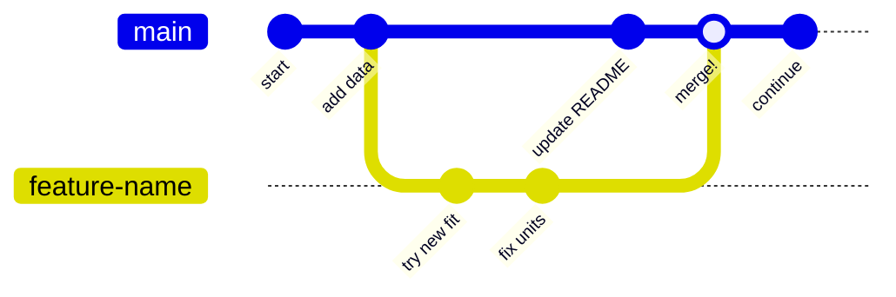

# Dr. Mindaugas Šarpis

# Best Research and Data Analysis Practices from CERN

## Version Control

##### <span class="aims-badge">♻️ reproducibility · 🔧 tool-agnostic</span>

---
hideInToc: true
layout: quote
---

# Every file has a history. **Version control** lets you navigate that history, collaborate without conflict, and never lose work again.

<!--
Speaker: open on the pain everyone has felt — `report_final_FINAL_v3.docx`. VC is
the cure. Keep this to ~1 min, then move to what they'll be able to do. (~1 min)
-->

---
hideInToc: true
---

# Learning **Objectives**

<div class="note-text mt-sm">By the end of this lecture, you will be able to:</div>

<div class="stack-tight mt-sm">

<div class="card card-primary card-glass pad-compact">

🕰️ Track a file's full **history** and recover any past version

</div>

<div class="card card-secondary card-glass pad-compact">

✍️ Record changes as small, meaningful **commits**

</div>

<div class="card card-accent card-glass pad-compact">

🌿 Work in **branches** and **merge** them — resolving conflicts

</div>

<div class="card card-success card-glass pad-compact">

🤝 Collaborate through **remotes** and **pull requests**

</div>

<div class="card card-warning card-glass pad-compact">

♻️ See version control as a pillar of **reproducibility**

</div>

</div>

<!--
Speaker: read these as promises, not a syllabus. Tell them the paired Seminar 6
is where they put THEIR project under Git — today is the "why" and the mental
model. Set the expectation. (~1 min)
-->

---
hideInToc: true
---

# The Importance of Version Control

<div class="grid-2 gap-md mt-md">

<div class="card card-warning card-glass pad-tight">

## ⚠️ **The Problem**

- Even if working alone, many different versions of the same file will exist
- Some overwritten changes might be needed later
- A "versioned" file might be needed when implementing comments from your supervisor or reviewers
- This holds true for written work, code and other files
- Remember `about_me.md` from the Markdown exercise? Let's track it properly!

</div>

<div>


</div>

</div>

---
hideInToc: true
---

# Tracking Changes (Differences)

<div class="card card-info card-glass pad-tight mt-md">

## 🔍 **Why Track Changes?**

- Rather than saving multiple copies of the same file, we can track changes
- Word processors do track changes and even co-edit — what they lack is **line-level diffs**, **branching and merging**, and a **complete offline history** of every version
- `git` is an open-source version control system that is used to track changes in files

</div>


---
hideInToc: true
---

# Different Versions

<div class="grid-2 gap-md mt-md">

<div class="card card-primary card-glass pad-tight">

## 🔀 **Diverging Histories**

- An edit to a file might overwrite some of the content in the previous version
- Such *divergence* may arise while working alone, but it is really common when multiple people are working on the same file

</div>

<div>


</div>

</div>

---
hideInToc: true
---

# Merging

<div class="grid-2 gap-md mt-md">

<div class="card card-success card-glass pad-tight">

## 🔗 **Combining Changes**

- `git` has great functionality for merging different versions of the same file
- If the previous content is not overwritten or deleted, a merge just combines the changes into one file
- If both branches change the same lines, a **merge conflict** arises

</div>

<div>


</div>

</div>

---
hideInToc: true
---

# Installing `git`

<div class="grid-2 gap-md mt-md">

<div class="card card-primary card-glass pad-tight">

## 🍎 **macOS**

```bash
# Check if already installed
git --version

# Install via Homebrew
brew install git

# Or install Xcode Command Line Tools (includes git)
xcode-select --install
```

</div>

<div class="card card-secondary card-glass pad-tight">

## 🪟 **Windows**

Download from [git-scm.com](https://git-scm.com/download/win) and run the installer.

Use **Git Bash** (included) or the VS Code terminal.

```bash
# Verify installation
git --version
```

</div>

</div>

<div class="card card-info card-glass pad-tight mt-md">

## 🐧 **Linux**

```bash
sudo apt install git    # Debian/Ubuntu
sudo dnf install git    # Fedora
```

</div>

---
hideInToc: true
---

# Using `git` for the first time

<div class="grid-2 gap-md mt-md">

<div class="card card-primary card-glass pad-tight">

## ⚙️ **Configuration**

- Set your identity, and the default branch name, once per machine:

```bash
git config --global user.name "Mindaugas Sarpis"
git config --global user.email "mindaugas.sarpis@cern.ch"
git config --global init.defaultBranch main
```

*(vanilla Git still names a fresh repo's branch `master` — this line is why yours will say `main`)*

- Edit the config file, or get help for any command:

```bash
git config --global --edit
git config -h
```

</div>

<div class="card card-info card-glass pad-tight">

## 🔍 **Checking Your Config**

- View all current settings with:

```bash
git config --list
```

- Example output:

```bash
user.name=Mindaugas Sarpis
user.email=mindaugas.sarpis@cern.ch
core.editor=vim
init.defaultbranch=main
color.ui=auto
pull.rebase=false
```

</div>

</div>

---
hideInToc: true
---

# Creating a New Repository

<div class="grid-2 gap-md mt-md">

<div class="card card-primary card-glass pad-tight">

## 📂 **Initializing**

```bash
git init
```

- Creates a hidden `.git` directory that tracks all changes
- Run this once in your project folder

```bash
git status
```

- Shows the current state of your repository

</div>

<div>


</div>

</div>

---
hideInToc: true
---

# Repository Status

<div class="card card-secondary card-glass pad-tight mt-md">

## 🔍 **Initial Status Output**

The repository is empty — git tells you what to do next:

```bash
On branch main

No commits yet

nothing to commit (create/copy files and use "git add" to track)
```

</div>

<div class="card card-info card-glass pad-compact mt-md">

You will see `git status` a lot — it is the most useful command for understanding where you are.

</div>

---
hideInToc: true
---

# Staging Area — Adding Files

<div class="grid-2 gap-md mt-md">

<div class="card card-primary card-glass pad-tight">

## 📋 **Adding Files to the Stage**

- `git` has a staging area where files are placed to track the changes made to them.

- To move a file to the staging area use:

```bash
git add <file>
```

- To move all files to the staging area use:

```bash
git add --all
```

</div>

<div>


<div class="card card-info card-glass pad-compact mt-sm">

When staged files are present, `git status` shows them under **"Changes to be committed"**:

```bash
On branch main

No commits yet

Changes to be committed:
  (use "git rm --cached <file>..." to unstage)
        new file:   <file>
```

*(Before your first commit git suggests `git rm --cached`; after a commit exists it becomes `git restore --staged` — both unstage.)*

</div>

</div>

</div>

---
hideInToc: true
---

# Staging Area — Unstaging & Diffing

<div class="grid-2 gap-md mt-md">

<div class="card card-primary card-glass pad-tight">

## 🔄 **Unstaging Files**

- To unstage a file use:

```bash
git restore --staged <file>
```

- This moves the file back to the working directory without discarding your changes.

</div>

<div class="card card-secondary card-glass pad-tight">

## 🔍 **Viewing Differences**

- Changes to files can be viewed with:

```bash
git diff
```

- To see differences of staged files:

```bash
git diff --staged
```

- To compare with a specific commit:

```bash
git diff <hash>
```

</div>

</div>

---
hideInToc: true
---

# Committing Changes

<div class="grid-2 gap-md mt-md">

<div class="card card-primary card-glass pad-tight">

## 📸 **Creating Snapshots**

- Files are committed to the repository from the staging area with:

```bash
git commit -m "A message describing the changes"
```

- Commit is a snapshot of the repository at a given time

- Only changes to files are tracked, not the directories themselves

- It's best to keep the commits small and focused on a single change

- The commit message should be descriptive and concise

- The commit message should be written in the imperative mood ("Add…", not "Added…")

</div>

<div>


</div>

</div>

---
hideInToc: true
---

# Viewing History

<div class="grid-2 gap-md mt-md">

<div class="card card-primary card-glass pad-tight">

## 📜 **Git Log**

```bash
# Full history
git log

# Compact view (one line per commit)
git log --oneline

# Visual branch graph
git log --oneline --graph --all
```

</div>

<div class="card card-secondary card-glass pad-tight">

## ✍️ **Commit Message Best Practices**

<div class="grid-2 mt-sm gap-md" style="grid-template-columns: 2fr 3fr;">

<div>

❌ "fixed stuff"

❌ "update"

❌ "asdf"

</div>

<div>

✅ "Add data validation for input CSV"

✅ "Fix off-by-one error in histogram bins"

✅ "Remove unused plot function"

</div>

</div>

</div>

</div>

<div class="card card-info card-glass pad-compact mt-md">

💡 Need to mark **exactly which commit** produced a result — "this is the commit behind Figure 3"? `git tag fig3-final` pins it permanently; see Lecture 04's archiving section for the full story.

</div>

---
hideInToc: true
---

# Restoring Files

<div class="grid-2 gap-md mt-md">

<div class="card card-primary card-glass pad-tight">

## ↩️ **Undo Working Directory Changes**

- Restore a file to the last committed version (discard uncommitted edits):

```bash
git restore <file>
```

- Unstage a file while keeping your edits:

```bash
git restore --staged <file>
```

</div>

<div>


<div class="card card-info card-glass pad-compact mt-sm">

## 💡 **When to Use**

- `git restore <file>` — discard local edits
- `git restore --staged <file>` — unstage without losing changes

</div>

</div>

</div>

---
hideInToc: true
---

# Reset & Revert

<div class="grid-2 gap-md mt-md">

<div class="card card-primary card-glass pad-tight">

## 🔙 **Restore from History**

- Restore a file from a previous commit using its *hash*:

```bash
git restore --source=<hash> <file>
```

- Create a **new commit** that undoes a previous one:

```bash
git revert <hash>
```

`git revert` is safe because it adds history rather than deleting it.

</div>

<div class="card card-warning card-glass pad-tight">

## ⚠️ **Dangerous: Hard Reset**

`reset --hard` permanently deletes **all uncommitted changes** — those are gone for good.

```bash
git reset --hard <hash>
```

- Use only when you truly want to throw away work
- Prefer `git revert` for undoing commits already shared with others
- *Escape hatch:* **committed** states stay recoverable for a while — `git reflog` lists them

</div>

</div>

---
hideInToc: true
---

# Fixing the Last Commit

<div class="grid-2 gap-md mt-md">

<div class="card card-primary card-glass pad-tight">

## ✏️ **`--amend`: a do-over**

Typo in the message, or forgot to stage a file? **Replace** the last commit:

```bash
# Fix just the message
git commit --amend -m "Better message"

# Include a forgotten file
git add forgotten_file.md
git commit --amend --no-edit
```

</div>

<div class="card card-warning card-glass pad-tight">

## 🚫 **One rule**

Amending **rewrites history** — the old commit is replaced by a new one.

- ✅ Fine while the commit is only on **your machine**
- ❌ Never amend a commit you have already **pushed/shared** — use `git revert` instead

</div>

</div>

<div class="card card-info card-glass pad-compact mt-md">

💡 Your undo toolbox: `restore` (working files) · `restore --staged` (unstage) · `--amend` (last local commit) · `revert` (anything shared).

</div>

---
hideInToc: true
---

<MCQ
  question="You notice a typo in the message of your last commit — you haven't pushed it anywhere yet. What is the cleanest fix?"
  :options="[
    'git commit --amend -m with the corrected message',
    'git revert the commit, then commit again',
    'git reset --hard and redo all the work',
    'Nothing can change a commit message'
  ]"
  :correct="0"
  explanation="For a local-only commit, --amend simply replaces it — clean history, nothing lost. revert would leave two extra commits for a typo, and reset --hard would discard your work entirely. Once a commit is pushed and shared, however, amend is no longer safe: then revert is the right tool."
/>

---
hideInToc: true
layout: image
image: /figures/git_flow.svg
backgroundSize: contain
---

---
hideInToc: true
---

# Ignoring Files and Directories

<div class="grid-2 gap-md mt-md">

<div class="card card-warning card-glass pad-tight">

## 🚫 **What to Ignore**

- There might be files that you don't want to track with `git`

  - Temporary files

  - Output files

  - Files with sensitive information

  - Large files

- These files can be ignored by creating a `.gitignore` file in the repository

</div>

<div>

<div class="card card-info card-glass pad-compact mt-sm">

**Note:** the example below is for a Python project. The specific patterns (`__pycache__`, `.venv/`) will make sense once you start Python in the next lecture — for now, focus on the general idea: ignore temporary, build, and machine-specific files.

</div>

```bash {*}{maxHeight:'300px'}
# Byte-compiled / optimized files
__pycache__/
*.py[cod]
*.so

# Distribution / packaging
build/
dist/
*.egg-info/
*.egg

# Jupyter Notebook
.ipynb_checkpoints

# Virtual environments
.env
.venv
env/
venv/

# Unit test / coverage reports
.pytest_cache/
.coverage
htmlcov/

# OS files
.DS_Store
Thumbs.db

# IDE / editor files
.vscode/
.idea/
*.swp

# Data / output files
*.csv
*.hdf5
*.root
output/
```

</div>

</div>

---
hideInToc: true
---

# Git and Large Files Don't Mix

<div class="card card-warning card-glass pad-tight mt-md">

## 📦 **Git Is Not a Data Store**

Git keeps every version of every tracked file **forever** — great for text, painful for multi-GB ROOT files: the repo balloons and every clone gets slower. The `.gitignore` on the previous slide already keeps `*.root` out entirely.

</div>

<div class="grid-2 mt-md gap-md">

<div class="card card-primary card-glass pad-compact">

## 🗄️ **Keep raw data outside the repo**

Store big files in `data/raw/` on shared storage or a data catalogue; the repo holds only **code** and a **README** pointing to where the data lives (📁 aim)

</div>

<div class="card card-secondary card-glass pad-compact">

## 🧩 **Or: Git LFS**

**Git Large File Storage** swaps big files for lightweight pointers in the repo, storing the real bytes on a separate server

</div>

</div>

---
layout: image-right
image: /figures/git-freshly-made-github-repo.svg
backgroundSize: contain
hideInToc: true
---

# Git Remotes

- ### One of the most powerful features of `git` is the ability to work with remote repositories.
- ### Remote repositories are copies of the repository that are stored on a server.
- ### Using one of the remote providers (GitHub, GitLab, Bitbucket, etc.) you can store your repository in the cloud.
- ### This enables collaboration with other people and provides a backup of your work.

---
layout: image-right
image: /figures/git-freshly-made-github-repo.svg
backgroundSize: contain
hideInToc: true
---

# Git Remotes

- ### The remote is created via the remote provider (GitHub, GitLab, Bitbucket, etc.).
- ### A remote URL needs to be added to the local repository with:

```bash
git remote add origin git@github.com:mygithub/myremote.git
```

- ### To check which remotes are added:

```bash
git remote -v
```

---
hideInToc: true
---

# SSH Key Setup

<div class="grid-2 gap-md mt-md">

<div class="card card-primary card-glass pad-tight">

## 🔑 **Why SSH?**

- `git@github.com:` remotes use SSH for authentication
- SSH keys let you push/pull without entering a password every time
- More secure than HTTPS with stored passwords

</div>

<div class="card card-secondary card-glass pad-tight">

## ⚙️ **Quick Setup**

```bash
# Generate a new SSH key
ssh-keygen -t ed25519 -C "your.email@example.com"

# Start the SSH agent
eval "$(ssh-agent -s)"

# Add the key to the agent
ssh-add ~/.ssh/id_ed25519

# Copy the public key
cat ~/.ssh/id_ed25519.pub
```

Then add the public key to **GitHub > Settings > SSH and GPG keys**.

</div>

</div>

---
layout: image-right
image: /figures/github-repo-after-first-push.svg
backgroundSize: contain
hideInToc: true
---

# Push / Pull Operations

- ### Changes to the local repository can be pushed to the remote repository with:

```bash
git push origin main
```

- ### Changes to the remote repository can be pulled to the local repository with:

```bash
git pull
```

---
layout: image-right
image: /figures/github-collaboration.svg
backgroundSize: contain
hideInToc: true
---

# Cloning Repositories

- ### A repository can be cloned from a remote repository with:

```bash
git clone <URL>
```

---
hideInToc: true
---

<MCQ
  question="A student keeps analysis.py, analysis_v2.py, analysis_final.py, analysis_final_REAL.py side by side. What does Git give that this scheme does not?"
  :options="[
    'Smaller file sizes on disk',
    'A faster Python interpreter',
    'Automatic conversion of Python to Markdown',
    'One canonical file with a full, navigable history, plus branches for alternatives'
  ]"
  :correct="3"
  explanation="Git separates the current file from the history of the file — a pile of manually-renamed copies conflates the two and loses the why behind each change."
/>

---
hideInToc: true
---

# Branches

<div class="card card-info card-glass pad-tight mt-md">

## 🌿 **Parallel Development**

- `git` has a powerful branching system that allows for multiple versions of the repository to be worked on simultaneously.
- Vanilla Git names the first branch `master`; the `init.defaultBranch main` setting from earlier is why yours is called `main` instead.

</div>

<div class="grid-2 gap-md mt-md">

<div class="card card-primary card-glass pad-tight">

## ➕ **Create & Switch**

```bash
# Create and switch in one command
git switch -c feature-name

# Or separately
git branch feature-name
git switch feature-name
```

</div>

<div class="card card-secondary card-glass pad-tight">

## 🔀 **Merge & Clean Up**

```bash
# Switch back to main
git switch main

# Merge the feature branch
git merge feature-name

# Delete merged branch
git branch -d feature-name
```

</div>

</div>

---
hideInToc: true
---

<MCQ
  question="Fresh install, `git init`, and `git status` says 'On branch master' — why?"
  :options="[
    'Git detected an old-style project and downgraded it automatically',
    'This machine has not set init.defaultBranch, so vanilla Git falls back to its historical default',
    'master is required whenever a repository has more than one branch',
    'git status always shows master until the first commit exists'
  ]"
  :correct="1"
  explanation="Git only creates main by default when init.defaultBranch is configured (see the Configuration slide) — an unconfigured install still names the first branch master. Set it once with git config --global init.defaultBranch main and every future git init will say main instead."
/>

---
hideInToc: true
---

# Branching, Pictured

<div class="mt-md" style="display: flex; justify-content: center;">



</div>

<div class="grid-2 mt-md gap-md">

<div class="card card-primary card-glass pad-compact">

🌿 Work on `feature-name` never disturbs `main` — experiment freely

</div>

<div class="card card-success card-glass pad-compact">

🔀 The **merge** brings both histories together — nothing is lost

</div>

</div>

---
hideInToc: true
---

# Merge Conflicts — What They Look Like

<div class="card card-warning card-glass pad-tight mt-md">

## ⚠️ **When two branches change the same lines**

- If changes overwrite each other, a **merge conflict** arises
- `git` marks the conflict in the file so you can decide which version to keep

</div>

<div class="card card-secondary card-glass pad-tight mt-md">

## 🔍 **Conflict Markers**

```text {*}{lines:false}
{{'<<<<<<< HEAD'}}
My favourite tool so far is the command line.
{{'======='}}
My favourite tool so far is VS Code.
{{'>>>>>>> feature-branch'}}
```

*(two edits to the same line of `about_me.md` — the file you created in the Markdown lecture)*

- Everything between `<<<<<<< HEAD` and `=======` is **your** version
- Everything between `=======` and `>>>>>>> feature-branch` is the **incoming** version

</div>

---
hideInToc: true
---

# Resolving Merge Conflicts

<div class="grid-2 gap-md mt-md">

<div class="card card-primary card-glass pad-tight">

## 🔧 **How to resolve**

1. Open the file and choose the correct version
2. Remove the conflict markers (`<<<<`, `====`, `>>>>`)
3. Stage and commit the resolved file

```bash
git add about_me.md
git commit -m "Resolve merge conflict"
```

</div>

<div class="card card-info card-glass pad-compact">

## 💡 **Tips**

- Conflicts are **normal** in collaborative work
- Pull frequently to minimize conflicts
- Communicate with teammates about shared files
- VS Code highlights conflicts with clickable options

</div>

</div>

---
hideInToc: true
---

# A Typical Day with Git

<div class="grid-2 gap-md mt-md" style="grid-template-columns: 1fr 1fr;">

<div class="card card-info card-glass pad-compact">

## 🖥️ **Local work**

- **1.** `git pull` — sync with remote
- **2.** `git switch -c my-feature` — branch off for your task
- **3.** *edit files*
- **4.** `git add` · `git commit -m "..."` — save progress

</div>

<div class="card card-success card-glass pad-compact">

## ☁️ **Share & review**

- **5.** `git push origin my-feature` — publish the branch
- **6.** Open a **Pull Request** on GitHub
- **7.** Address review comments, push again
- **8.** Merge once approved ✅

</div>

</div>

<div class="card card-warning card-glass pad-compact mt-md">

💡 Small, focused commits + frequent pulls = fewer conflicts and easier reviews.

</div>

---
layout: center
hideInToc: true
---

# [An interactive git playground](https://learngitbranching.js.org/)

---
hideInToc: true
---

# **Recap** — You Can Now…

<div class="grid-2 gap-md mt-sm">

<div class="card card-success card-glass pad-compact">

✅ Initialise a repo and build a clean commit **history**

</div>

<div class="card card-success card-glass pad-compact">

✅ **Branch**, **merge**, and resolve a conflict

</div>

<div class="card card-success card-glass pad-compact">

✅ Push to a **remote** and open a **pull request**

</div>

<div class="card card-success card-glass pad-compact">

✅ Use Git as a pillar of **reproducible research**

</div>

</div>

<div class="card card-accent card-glass pad-tight mt-md">

## 🔬 **Seminar 6 tie-in**

Put your analysis project **under Git** — create a feature branch, commit your work in small steps, and merge it back with a pull request.

</div>

<!--
Speaker: this is the "you can now" beat — have them physically nod along to each.
The seminar tie-in makes the payoff concrete: they leave the lecture, and in the
seminar their own project goes under version control. (~1 min)
-->

---
hideInToc: true
---

# Looking Ahead

<div class="card card-info card-glass pad-tight mt-md">

## 🔗 **Git in the Bigger Picture**

Version control is one pillar of **reproducible research**. It works together with:

- **Virtual environments** — isolate dependencies
- **Automated scripts** — one command runs the full analysis
- **CI/CD** — run tests and checks on every push

Together, these practices ensure that anyone can reproduce your results — from raw data to final figures.

</div>
