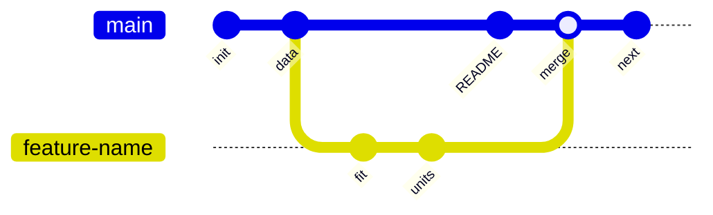
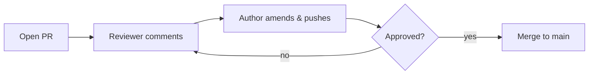

# Dr. Mindaugas Šarpis

# Best Research and Data Analysis Practices from CERN

## Version Control

##### <span class="aims-badge">♻️ reproducibility · 🔧 tool-agnostic</span>

---
hideInToc: true
layout: quote
---

# Every file has a history. **Version control** lets you navigate that history, collaborate without conflict, and never lose work again.

<!--
Speaker: open on the pain everyone has felt — `report_final_FINAL_v3.docx`. VC is
the cure. Keep this to ~1 min, then move to what they'll be able to do. (~1 min)
-->

---
hideInToc: true
---

# Learning **Objectives**

<div class="note-text mt-sm">By the end of this lecture, you will be able to:</div>

<div class="stack-tight mt-sm">

<div class="card card-primary card-glass pad-compact">

🕰️ Track a file's full **history** and recover any past version

</div>

<div class="card card-secondary card-glass pad-compact">

✍️ Record changes as small, meaningful **commits**

</div>

<div class="card card-accent card-glass pad-compact">

🌿 Work in **branches** and **merge** them — resolving conflicts

</div>

<div class="card card-success card-glass pad-compact">

🤝 Collaborate through **remotes** and **pull requests**

</div>

<div class="card card-info card-glass pad-compact">

🏷️ Pin the exact code behind a result with **tags**

</div>

<div class="card card-warning card-glass pad-compact">

♻️ See version control as a pillar of **reproducibility**

</div>

</div>

<!--
Speaker: read these as promises, not a syllabus. Tell them the paired Seminar 6
is where they branch, break and merge for real, including a conflict — today is the "why" and the mental
model. Set the expectation. (~1 min)
-->

---
hideInToc: true
---

# The Importance of Version Control

<div class="grid-2 gap-md mt-md">

<div class="card card-warning card-glass pad-tight">

## ⚠️ **The Problem**

- Even if working alone, many different versions of the same file will exist
- Some overwritten changes might be needed later
- A "versioned" file might be needed when implementing comments from your supervisor or reviewers
- This holds true for written work, code and other files
- Remember `about_me.md` from the Markdown exercise? Let's track it properly!

</div>

<div>


</div>

</div>

---
hideInToc: true
---

# Tracking Changes (Differences)

<div class="card card-info card-glass pad-tight mt-md">

## 🔍 **Why Track Changes?**

- Rather than saving multiple copies of the same file, we can track changes
- Word processors do track changes and even co-edit — what they lack is **line-level diffs**, **branching and merging**, and a **complete offline history** of every version
- `git` is an open-source version control system that is used to track changes in files

</div>


---
hideInToc: true
---

# Different Versions

<div class="grid-2 gap-md mt-md">

<div class="card card-primary card-glass pad-tight">

## 🔀 **Diverging Histories**

- An edit to a file might overwrite some of the content in the previous version
- Such *divergence* may arise while working alone, but it is really common when multiple people are working on the same file

</div>

<div>


</div>

</div>

---
hideInToc: true
---

# Merging

<div class="grid-2 gap-md mt-md">

<div class="card card-success card-glass pad-tight">

## 🔗 **Combining Changes**

- `git` has great functionality for merging different versions of the same file
- If the previous content is not overwritten or deleted, a merge just combines the changes into one file
- If both branches change the same lines, a **merge conflict** arises

</div>

<div>


</div>

</div>

---
hideInToc: true
---

# Installing `git`

<div class="grid-2 gap-md mt-md">

<div class="card card-primary card-glass pad-tight">

## 🍎 **macOS**

```bash
# Check if already installed
git --version

# Install via Homebrew
brew install git

# Or install Xcode Command Line Tools (includes git)
xcode-select --install
```

</div>

<div class="card card-secondary card-glass pad-tight">

## 🪟 **Windows**

Download from [git-scm.com](https://git-scm.com/download/win) and run the installer.

Use **Git Bash** (included) or the VS Code terminal.

```bash
# Verify installation
git --version
```

</div>

</div>

<div class="card card-info card-glass pad-tight mt-md">

## 🐧 **Linux**

```bash
sudo apt install git    # Debian/Ubuntu
sudo dnf install git    # Fedora
```

</div>

---
hideInToc: true
---

# Using `git` for the first time

<div class="grid-2 gap-md mt-md">

<div class="card card-primary card-glass pad-tight">

## ⚙️ **Configuration**

- Set your identity, and the default branch name, once per machine:

```bash
git config --global user.name "Mindaugas Sarpis"
git config --global user.email "mindaugas.sarpis@cern.ch"
git config --global init.defaultBranch main
```

*(vanilla Git still names a fresh repo's branch `master` — this line is why yours will say `main`)*

- Edit the config file, or get help for any command:

```bash
git config --global --edit
git config -h
```

</div>

<div class="card card-info card-glass pad-tight">

## 🔍 **Checking Your Config**

- View all current settings with:

```bash
git config --list
```

- Example output:

```bash
user.name=Mindaugas Sarpis
user.email=mindaugas.sarpis@cern.ch
core.editor=vim
init.defaultbranch=main
color.ui=auto
pull.rebase=false
```

</div>

</div>

---
layout: section
hideInToc: true
---

# Local **Git**

<!--
Speaker: git is installed and knows who you are. Now the core loop, entirely on
your own machine — no server, no internet: init, stage, commit, look back, undo.
Everything else in the lecture is built on these five moves. (~30 sec)
-->

---
hideInToc: true
---

# Creating a New Repository

<div class="grid-2 gap-md mt-md">

<div class="card card-primary card-glass pad-tight">

## 📂 **Initializing**

```bash
git init
```

- Creates a hidden `.git` directory that tracks all changes — run it **once** in your project folder

## 🔍 **The first `git status`**

```bash
On branch main

No commits yet

nothing to commit (create/copy files and use "git add" to track)
```

</div>

<div>


<div class="card card-info card-glass pad-compact mt-sm">

The repository is empty — git tells you what to do next. You will see `git status` a lot: it is the most useful command for understanding **where you are**.

</div>

</div>

</div>

---
hideInToc: true
---

# Staging Area — Adding Files

<div class="grid-2 gap-md mt-md">

<div class="card card-primary card-glass pad-tight">

## 📋 **Adding Files to the Stage**

- `git` has a staging area where files are placed to track the changes made to them.

- To move a file to the staging area use:

```bash
git add <file>
```

- To move all files to the staging area use:

```bash
git add -A
```

</div>

<div>


<div class="card card-info card-glass pad-compact mt-sm">

When staged files are present, `git status` shows them under **"Changes to be committed"**:

```bash
On branch main

No commits yet

Changes to be committed:
  (use "git rm --cached <file>..." to unstage)
        new file:   <file>
```

*(Before your first commit git suggests `git rm --cached`; after a commit exists it becomes `git restore --staged` — both unstage.)*

</div>

</div>

</div>

---
hideInToc: true
---

# Staging Area — Unstaging & Diffing

<div class="grid-2 gap-md mt-md">

<div class="card card-primary card-glass pad-tight">

## 🔄 **Unstaging Files**

- To unstage a file use:

```bash
git restore --staged <file>
```

- This moves the file back to the working directory without discarding your changes.

</div>

<div class="card card-secondary card-glass pad-tight">

## 🔍 **Viewing Differences**

- Changes to files can be viewed with:

```bash
git diff
```

- To see differences of staged files:

```bash
git diff --staged
```

- To compare with a specific commit:

```bash
git diff <hash>
```

</div>

</div>

---
hideInToc: true
---

# Committing Changes

<div class="grid-2 gap-md mt-md">

<div class="card card-primary card-glass pad-tight">

## 📸 **Creating Snapshots**

- Files are committed to the repository from the staging area with:

```bash
git commit -m "A message describing the changes"
```

- Commit is a snapshot of the repository at a given time

- Only changes to files are tracked, not the directories themselves

- It's best to keep the commits small and focused on a single change

- The commit message should be descriptive and concise

- The commit message should be written in the imperative mood ("Add…", not "Added…")

</div>

<div>


</div>

</div>

---
hideInToc: true
---

<MCQ
  question="A student keeps analysis.py, analysis_v2.py, analysis_final.py, analysis_final_REAL.py side by side. What does Git give that this scheme does not?"
  :options="[
    'Smaller file sizes on disk',
    'A faster Python interpreter',
    'Automatic conversion of Python to Markdown',
    'One canonical file with a full, navigable history, plus branches for alternatives'
  ]"
  :correct="3"
  explanation="Git separates the current file from the history of the file — a pile of manually-renamed copies conflates the two and loses the why behind each change."
/>

---
hideInToc: true
---

# Viewing History

<div class="grid-2 gap-md mt-md">

<div class="card card-primary card-glass pad-tight">

## 📜 **Git Log**

```bash
# Full history
git log

# Compact view (one line per commit)
git log --oneline

# Visual branch graph
git log --oneline --graph --all
```

</div>

<div class="card card-secondary card-glass pad-tight">

## ✍️ **Commit Message Best Practices**

<div class="grid-2 mt-sm gap-md" style="grid-template-columns: 2fr 3fr;">

<div>

❌ "fixed stuff"

❌ "update"

❌ "asdf"

</div>

<div>

✅ "Add data validation for input CSV"

✅ "Fix off-by-one error in histogram bins"

✅ "Remove unused plot function"

</div>

</div>

</div>

</div>

<div class="card card-info card-glass pad-compact mt-md">

💡 Need to mark **exactly which commit** produced a result — "this is the commit behind Figure 3"? `git tag fig3-final` pins it permanently — the Tags section later in this lecture shows how.

</div>

---
hideInToc: true
---

# Restoring Files

<div class="grid-2 gap-md mt-md">

<div class="card card-primary card-glass pad-tight">

## ↩️ **Undo Working Directory Changes**

- Restore a file to the last committed version (discard uncommitted edits):

```bash
git restore <file>
```

- Unstage a file while keeping your edits:

```bash
git restore --staged <file>
```

- Bring back one file as it was in an **older commit**:

```bash
git restore --source=<hash> <file>
```

</div>

<div>


<div class="card card-info card-glass pad-compact mt-sm">

💡 Check `git diff` first — `restore` is **irreversible** for uncommitted edits.

</div>

</div>

</div>

---
hideInToc: true
---

# Reset & Revert

<div class="grid-2 gap-md mt-md">

<div class="card card-primary card-glass pad-tight">

## 🔙 **Undo a Whole Commit**

- `restore --source` brings back one file; to undo an entire commit, create a **new commit** that reverses it:

```bash
git log --oneline    # find the hash
git revert <hash>
```

- `git revert` is safe because it adds history rather than deleting it

</div>

<div class="card card-warning card-glass pad-tight">

## ⚠️ **Dangerous: Hard Reset**

`reset --hard` permanently deletes **all uncommitted changes** — those are gone for good.

```bash
git reset --hard <hash>
```

- Use only when you truly want to throw away work
- Prefer `git revert` for undoing commits already shared with others
- *Escape hatch:* **committed** states stay recoverable for a while — `git reflog` lists them

</div>

</div>

---
hideInToc: true
---

# Fixing the Last Commit

<div class="grid-2 gap-md mt-md">

<div class="card card-primary card-glass pad-tight">

## ✏️ **`--amend`: a do-over**

Typo in the message, or forgot to stage a file? **Replace** the last commit:

```bash
# Fix just the message
git commit --amend -m "Better message"

# Include a forgotten file
git add forgotten_file.md
git commit --amend --no-edit
```

</div>

<div class="card card-warning card-glass pad-tight">

## 🚫 **One rule**

Amending **rewrites history** — the old commit is replaced by a new one.

- ✅ Fine while the commit is only on **your machine**
- ❌ Never amend a commit you have already **pushed/shared** — use `git revert` instead

</div>

</div>

<div class="card card-info card-glass pad-compact mt-md">

💡 Your undo toolbox: `restore` (working files) · `restore --staged` (unstage) · `--amend` (last local commit) · `revert` (anything shared).

</div>

---
hideInToc: true
---

<MCQ
  question="You notice a typo in the message of your last commit — you haven't pushed it anywhere yet. What is the cleanest fix?"
  :options="[
    'git commit --amend -m with the corrected message',
    'git revert the commit, then commit again',
    'git reset --hard and redo all the work',
    'Nothing can change a commit message'
  ]"
  :correct="0"
  explanation="For a local-only commit, --amend simply replaces it — clean history, nothing lost. revert would leave two extra commits for a typo, and reset --hard would discard your work entirely. Once a commit is pushed and shared, however, amend is no longer safe: then revert is the right tool."
/>

---
hideInToc: true
---

# Ignoring Files and Directories

<div class="grid-2 gap-md mt-md">

<div class="card card-warning card-glass pad-tight">

## 🚫 **What to Ignore**

- There might be files that you don't want to track with `git`

  - Temporary files

  - Output files

  - Files with sensitive information

  - Large files

- These files can be ignored by creating a `.gitignore` file in the repository

</div>

<div>

<div class="card card-info card-glass pad-compact mt-sm">

**Note:** the example below is for a Python project. The specific patterns (`__pycache__`, `.venv/`) will make sense once you start Python in the next lecture — for now, focus on the general idea: ignore temporary, build, and machine-specific files.

</div>

```bash
# Python
__pycache__/
*.py[cod]
.venv/
.ipynb_checkpoints

# Editors & OS
.vscode/
.DS_Store

# Data & results (regenerable or too large)
*.csv
*.root
output/
```

</div>

</div>

---
hideInToc: true
---

# Git and Large Files Don't Mix

<div class="card card-warning card-glass pad-tight mt-md">

## 📦 **Git Is Not a Data Store**

Git keeps every version of every tracked file **forever** — great for text, painful for multi-GB ROOT files: the repo balloons and every clone gets slower. The `.gitignore` on the previous slide already keeps `*.root` out entirely.

</div>

<div class="grid-2 mt-md gap-md">

<div class="card card-primary card-glass pad-compact">

## 🗄️ **Keep raw data outside the repo**

Store big files in `data/raw/` on shared storage or a data catalogue; the repo holds only **code** and a **README** pointing to where the data lives (📁 aim)

</div>

<div class="card card-secondary card-glass pad-compact">

## 🧩 **Or: Git LFS**

**Git Large File Storage** swaps big files for lightweight pointers in the repo, storing the real bytes on a separate server

</div>

</div>

---
layout: section
hideInToc: true
---

# **Remotes**

<!--
Speaker: everything so far lived in one `.git` folder on one laptop. A remote is
the same history on a server — a backup first, a meeting point for collaborators
second. Same commands, one extra hop. (~30 sec)
-->

---
hideInToc: true
---

# Remotes

<div class="grid-2 gap-md mt-md">

<div class="card card-primary card-glass pad-tight">

## ☁️ **A copy on a server**

- A **remote** is a copy of your repository stored on a server — GitHub, GitLab, Bitbucket…
- It gives you a **backup** of your work and a place where **others** can collaborate
- Create the empty repository on the provider's website, then connect your local one to it:

```bash
git remote add origin git@github.com:you/repo.git
git remote -v        # list remotes and their URLs
```

- `origin` is just the conventional name for your main remote

</div>

<div>


</div>

</div>

---
hideInToc: true
---

# SSH Key Setup

<div class="grid-2 gap-md mt-md">

<div class="card card-primary card-glass pad-tight">

## 🔑 **Why SSH?**

- `git@github.com:` remotes use SSH for authentication
- SSH keys let you push/pull without entering a password every time
- More secure than HTTPS with stored passwords

</div>

<div class="card card-secondary card-glass pad-tight">

## ⚙️ **Quick Setup**

```bash
# Generate a new SSH key
ssh-keygen -t ed25519 -C "your.email@example.com"

# Start the SSH agent
eval "$(ssh-agent -s)"

# Add the key to the agent
ssh-add ~/.ssh/id_ed25519

# Copy the public key
cat ~/.ssh/id_ed25519.pub
```

Then add the public key to **GitHub > Settings > SSH and GPG keys**.

</div>

</div>

---
hideInToc: true
---

# Push, Pull, Clone

<div class="grid-2 gap-md mt-md">

<div class="stack-tight">

<div class="card card-primary card-glass pad-compact">

## ⬆️ **Push**

Send your local commits to the remote:

```bash
git push origin main
```

</div>

<div class="card card-secondary card-glass pad-compact">

## ⬇️ **Pull**

Fetch and merge what others pushed (`pull` = `fetch` + `merge`):

```bash
git pull
```

</div>

<div class="card card-accent card-glass pad-compact">

## 📥 **Clone**

Copy a whole remote repository, history included — same `git@…` URL:

```bash
git clone git@github.com:you/repo.git
```

</div>

</div>

<div>


</div>

</div>

---
hideInToc: true
---

# The **Whole** Picture

<div class="mt-sm" style="display: flex; justify-content: center;">


</div>

<!--
Speaker: one map of everything so far. Three local zones — working directory,
staging area (index), HEAD — and the remote on the right. Walk the arrows:
add and commit go right, restore and merge come back left, push/fetch/pull cross
to the remote. `git diff --staged` (older docs say `--cached`, same thing)
compares index to HEAD. If they can place each command on this picture they
own the mental model. (~2 min)
-->

---
layout: section
hideInToc: true
---

# Branches & **Merging**

<!--
Speaker: the feature that makes git more than a backup — parallel lines of work
that meet again. This is where the seminar spends most of its time, conflict
included. (~30 sec)
-->

---
hideInToc: true
---

# Branches

<div class="card card-info card-glass pad-tight mt-md">

## 🌿 **Parallel Development**

- `git` has a powerful branching system that allows for multiple versions of the repository to be worked on simultaneously.

</div>

<div class="grid-2 gap-md mt-md">

<div class="card card-primary card-glass pad-tight">

## ➕ **Create & Switch**

```bash
# Create and switch in one command
git switch -c feature-name

# Or separately
git branch feature-name
git switch feature-name
```

</div>

<div class="card card-secondary card-glass pad-tight">

## 🔀 **Merge & Clean Up**

```bash
# Switch back to main
git switch main

# Merge the feature branch
git merge feature-name

# Delete merged branch
git branch -d feature-name
```

</div>

</div>

---
hideInToc: true
---

<MCQ
  question="Fresh install, `git init`, and `git status` says 'On branch master' — why?"
  :options="[
    'Git detected an old-style project and downgraded it automatically',
    'This machine has not set init.defaultBranch, so vanilla Git falls back to its historical default',
    'master is required whenever a repository has more than one branch',
    'git status always shows master until the first commit exists'
  ]"
  :correct="1"
  explanation="Git only creates main by default when init.defaultBranch is configured (see the Configuration slide) — an unconfigured install still names the first branch master. Set it once with git config --global init.defaultBranch main and every future git init will say main instead."
/>

---
hideInToc: true
---

# Branching, Pictured

<div class="mt-md" style="display: flex; justify-content: center;">



</div>

<div class="grid-2 mt-md gap-md">

<div class="card card-primary card-glass pad-compact">

🌿 Work on `feature-name` never disturbs `main` — experiment freely

</div>

<div class="card card-success card-glass pad-compact">

🔀 The **merge** brings both histories together — nothing is lost

</div>

</div>

---
hideInToc: true
---

# Merge Conflicts — What They Look Like

<div class="card card-warning card-glass pad-tight mt-md">

## ⚠️ **When two branches change the same lines**

- If changes overwrite each other, a **merge conflict** arises
- `git` marks the conflict in the file so you can decide which version to keep

</div>

<div class="card card-secondary card-glass pad-tight mt-md">

## 🔍 **Conflict Markers**

<pre class="slidev-code conflict-block"><code>&lt;&lt;&lt;&lt;&lt;&lt;&lt; HEAD
My favourite tool so far is the command line.
=======
My favourite tool so far is VS Code.
&gt;&gt;&gt;&gt;&gt;&gt;&gt; feature-branch</code></pre>

*(two edits to the same line of `about_me.md` — the file you created in the Markdown lecture)*

- Everything between `<<<<<<< HEAD` and `=======` is **your** version
- Everything between `=======` and `>>>>>>> feature-branch` is the **incoming** version

</div>

---
hideInToc: true
---

# Resolving Merge Conflicts

<div class="grid-2 gap-md mt-md">

<div class="card card-primary card-glass pad-tight">

## 🔧 **How to resolve**

1. Open the file and choose the correct version
2. Remove the conflict markers (`<<<<`, `====`, `>>>>`)
3. Stage and commit the resolved file

```bash
git add about_me.md
git commit -m "Resolve merge conflict"
```

</div>

<div class="card card-info card-glass pad-compact">

## 💡 **Tips**

- Conflicts are **normal** in collaborative work
- Pull frequently to minimize conflicts
- Communicate with teammates about shared files
- VS Code highlights conflicts with clickable options

</div>

</div>

---
layout: section
hideInToc: true
---

# Git in **VS Code**

<!--
Speaker: same git, a friendlier window. Everything they just typed by hand
has a button here — but the commands underneath are identical. Show, don't
just tell. (~30 sec)
-->

---
hideInToc: true
---

# The Source Control Panel

<div class="grid-2 gap-md mt-md">

<div class="card card-primary card-glass pad-tight">

## 🔧 **Same git, different interface**

- The **Source Control** panel (the branch icon in the sidebar) is a visual front-end to the exact commands you just typed — you *see* every changed file instead of parsing `git status`
- Click a changed file to open the **diff view** — `git diff` rendered side by side; scan it before every commit to catch stray edits
- Select a few lines → right-click → **Stage Selected Ranges** to commit one logical change out of a busy file (*staging hunks*) 📁
- The status bar shows your current **branch** and a sync arrow for push/pull

</div>

<div class="card card-info card-glass pad-tight">

## 🖱️ **A commit in four clicks**

1. Open **Source Control** (icon in the sidebar, or `Ctrl/⌘ + Shift + G`)
2. **＋** beside a file → stages it (`git add`)
3. Type a message → **✓ Commit** (`git commit -m`)
4. **Sync Changes** → `git pull` then `git push`

💡 The terminal is one panel away — mix and match freely 🔧

</div>

</div>

---
hideInToc: true
---

# Resolving a Conflict in the Editor

<div class="grid-2 gap-md mt-md">

<div class="card card-primary card-glass pad-tight">

## 🖱️ **Clickable choices**

- On a conflict, VS Code highlights the block and shows buttons above it: **Accept Current**, **Accept Incoming**, **Accept Both**, **Compare**
- One click writes the chosen lines and removes the `<<<<`, `====`, `>>>>` markers for you

</div>

<div class="card card-info card-glass pad-tight">

## ✅ **Then finish as usual**

- The three-way **Merge Editor** shows *yours*, *theirs*, and the *result* side by side for the tricky cases
- Buttons are convenience only — you still `git add` and `git commit` to record the resolution

</div>

</div>

---
layout: section
hideInToc: true
---

# Collaborating on **GitHub**

<!--
Speaker: push and pull moved bytes; now the *social* layer — how a team turns
those bytes into reviewed, trusted changes. This is where Git stops being a
backup and becomes a collaboration tool. (~30 sec)
-->

---
hideInToc: true
---

# From Remotes to a Shared Workflow

<div class="card card-info card-glass pad-tight mt-md">

## 🤝 **The remote is a meeting point**

A remote on GitHub is more than a backup — it is where a team *coordinates*. On top of plain push and pull, GitHub adds three social tools that turn a shared repository into a reviewed, auditable workflow:

</div>

<div class="grid-3 gap-md mt-md">

<div class="card card-primary card-glass pad-compact">

## 🐛 **Issues**

Track problems and ideas

</div>

<div class="card card-secondary card-glass pad-compact">

## 🔀 **Pull Requests**

Propose and review changes

</div>

<div class="card card-accent card-glass pad-compact">

## 👀 **Review**

Catch errors before merge

</div>

</div>

---
hideInToc: true
---

# Issues — the Lab Notebook of Problems

<div class="grid-2 gap-md mt-md">

<div class="card card-primary card-glass pad-tight">

## 🐛 **What an issue is**

- A numbered, discussable entry for a **bug**, a **task**, or an **idea** — the project's shared to-do list
- Anyone can open one; comments, labels, and assignees keep it organised
- Closing one leaves a record of *what* went wrong and *how* it was fixed

</div>

<div class="card card-info card-glass pad-tight">

## 🔗 **Linked to the code**

- Write `Fixes #42` in a commit or pull request and GitHub **closes issue 42** automatically when it merges
- The thread becomes a searchable history — future-you will thank present-you ♻️

</div>

</div>

---
hideInToc: true
---

# Pull Requests — Reviewable Units of Change

<div class="card card-primary card-glass pad-tight mt-md">

## 🔀 **A PR is a proposal, not a push**

Instead of pushing straight to `main`, you push a **branch** and open a **pull request**: "please review these commits and merge them." The PR bundles a diff, a description, and a conversation into one reviewable unit.

</div>

<div class="grid-3 gap-md mt-md">

<div class="card card-secondary card-glass pad-compact">

## ✅ **What a PR shows**

- The full **diff** of every change
- Commit-by-commit history
- Automated **checks** — tests, linters — rerun on every push; green tick = safe to review ⚙️

</div>

<div class="card card-accent card-glass pad-compact">

## 📝 **Draft PRs**

- Open as a **draft** to share work early — "am I on the right track?"
- Reviewers know not to merge yet; mark it **Ready for review** when it is

</div>

<div class="card card-success card-glass pad-compact">

## 🎯 **Keep it small**

- One PR = one focused change
- Easy to review = fast to merge
- Huge PRs hide bugs in the noise

</div>

</div>

---
hideInToc: true
---

# The Review Flow

<div class="mt-md" style="display: flex; justify-content: center;">



</div>

<div class="card card-info card-glass pad-compact mt-md">

The loop is the point: a pull request is a **conversation**, not a gate. Comments become commits, commits get re-reviewed, and only an approved change reaches `main` ♻️.

</div>

---
hideInToc: true
---

# Giving & Receiving Review

<div class="grid-2 gap-md mt-md">

<div class="card card-primary card-glass pad-tight">

## 🧑‍🏫 **As a reviewer**

- Review the **change**, not the person
- Ask questions before demanding edits; suggest, don't dictate
- Approve small things quickly — a fast review keeps work flowing
- Praise good ideas; review teaches both ways

</div>

<div class="card card-secondary card-glass pad-tight">

## ✍️ **As an author**

- Write a description: *what* changed and *why*
- Respond to every comment, even just "done"
- Push fixes as new commits so reviewers see what moved
- Disagree with reasons, not silence

</div>

</div>

---
hideInToc: true
---

# Why Review Catches What Tests Miss

<div class="card card-info card-glass pad-tight mt-md">

## 👀 **A second pair of eyes ♻️**

Tests check that code does what you *told* it to. Review checks that you told it the *right* thing — the gap where most real bugs live.

</div>

<div class="grid-2 gap-md mt-md">

<div class="card card-primary card-glass pad-compact">

## ✅ **Tests catch**

- Broken logic you thought of
- Regressions in old features
- Wrong numbers vs known cases

</div>

<div class="card card-warning card-glass pad-compact">

## 👤 **Only a human catches**

- A flawed *assumption* in the method
- An unclear name or missing comment
- "Is this even the right approach?"

</div>

</div>

---
hideInToc: true
---

# Forks vs Branches

<div class="grid-2 gap-md mt-md">

<div class="card card-primary card-glass pad-tight">

## 🌿 **Branch**

- A parallel line **inside one repository**
- Everyone with write access shares it
- The default for a **team** on the same project
- When you pair up in a seminar, this is how you'll work

</div>

<div class="card card-secondary card-glass pad-tight">

## 🍴 **Fork**

- Your **own full copy** of someone else's repo
- Needs no write access to the original
- The default for contributing to **open source** — like LHCb software you don't own
- Send changes back with a PR from your fork

</div>

</div>

<div class="card card-info card-glass pad-compact mt-md">

💡 Same review flow either way — a fork just means the PR crosses from your copy to theirs 🔧.

</div>

---
hideInToc: true
---

<MCQ
  question="Your feature branch fixes a plotting bug, renames three functions, and adds a new fitter — all unrelated. How should you open the pull request(s)?"
  :options="[
    'One giant PR — fewer clicks for everyone',
    'Three focused PRs, each one self-contained change',
    'Push straight to main and skip review to save time',
    'One PR, but hide the diff so reviewers are not overwhelmed'
  ]"
  :correct="1"
  explanation="A pull request should be one reviewable idea. Splitting unrelated work into focused PRs makes each diff easy to understand, quick to approve, and safe to revert on its own. Bundling everything hides bugs in the noise, and pushing to main skips the review that catches them."
/>

---
hideInToc: true
---

<MCQ
  question="You want to contribute a fix to a large open-source physics package you have no write access to. What is the right model?"
  :options="[
    'Fork the repo, commit on a branch in your fork, open a PR back to the original',
    'Ask an admin for write access before you can do anything',
    'Email your changed files to the maintainers as attachments',
    'Clone it and push directly to their main branch'
  ]"
  :correct="0"
  explanation="Without write access you cannot push to their repo — so you fork it (your own full copy), do the work on a branch there, and open a pull request from your fork back to theirs. That is exactly how outside contributions to projects like the LHCb software flow. You cannot push to their main, and email attachments throw away all of Git's history and review."
/>

---
hideInToc: true
---

# GitLab at CERN — Same Concepts, Different Host

<div class="grid-2 gap-md mt-md">

<div class="card card-primary card-glass pad-tight">

## 🔧 **The skills transfer 1:1**

- CERN runs its own **GitLab** server at `gitlab.cern.ch`, not GitHub
- Everything today still applies: clone, branch, commit, push, pull
- GitLab calls a pull request a **Merge Request** (MR) — same idea, different name
- Issues, review, and CI all work the same way

</div>

<div class="card card-info card-glass pad-tight">

## 🌐 **Why it does not matter**

- Git itself is identical everywhere — the *host* is just a remote
- GitHub, GitLab, Bitbucket: learn one, use them all 🔧
- Many labs self-host GitLab for privacy and access control
- Your `git@...` remote URL is the only thing that changes

</div>

</div>

---
layout: section
hideInToc: true
---

# Stash & **Tags**

<!--
Speaker: two everyday power tools. Stash rescues a messy tree when you must
switch context; tags pin the exact version behind a result. (~30 sec)
-->

---
hideInToc: true
---

# `git stash` — a Clean Tree, Now

<div class="grid-2 gap-md mt-md">

<div class="card card-primary card-glass pad-tight">

## 🧰 **The problem it solves**

- You are mid-edit when an urgent fix lands elsewhere — but `git switch` refuses while you have uncommitted changes
- `git stash` tucks your work-in-progress away and hands you a **clean working tree**, without a half-baked commit

</div>

<div class="card card-secondary card-glass pad-tight">

## ⌨️ **The commands**

```bash
git stash          # shelve current changes
git switch hotfix  # go fix the urgent thing
git switch -       # back to your branch
git stash pop      # bring your work back
git stash list     # see all stashes
```

</div>

</div>

---
hideInToc: true
---

# `git tag` — Name a Version

<div class="grid-2 gap-md mt-md">

<div class="card card-primary card-glass pad-tight">

## 🏷️ **Annotated tags**

- A **tag** is a permanent, readable name for one exact commit — `v1.0`, `paper-submission`, `thesis-final`
- Prefer **annotated** tags: they store who, when, and a message, like a mini-commit

```bash
git tag -a v1.0 -m "Results in the paper"
git push origin v1.0
git tag                     # list tags
git show v1.0               # what it points to
git switch --detach v1.0    # the code exactly as tagged
```

</div>

<div class="card card-success card-glass pad-tight">

## ♻️ **"Which code made Figure 3?"**

- The single most valuable thing a tag does: anyone — a reviewer, a collaborator, future-you — can check out the **exact** code behind a published result
- **Tag every milestone**: the commit behind each figure, every submission and revision, any result you might have to defend
- **Cite the tag** in your methods — a reader reruns the *tagged* code, not today's; reproducibility becomes one command

</div>

</div>

---
hideInToc: true
---

<MCQ
  question="You are halfway through an experiment when a collaborator asks you to urgently fix a bug on main. Your changes are not ready to commit. What is the clean move?"
  :options="[
    'git stash, switch to main, fix the bug, then return and git stash pop',
    'Commit the half-finished work so you can switch branches',
    'Copy the whole folder somewhere as a backup, then edit',
    'Discard your changes with git reset --hard and start over later'
  ]"
  :correct="0"
  explanation="git stash shelves work-in-progress and gives you a clean tree to switch branches, then pop restores it exactly. A throwaway commit pollutes history, a manual folder copy is the very habit Git replaces, and reset --hard would destroy the work you were not finished with."
/>

---
layout: section
hideInToc: true
---

# Hands-On — **Branch to Merge**

<!--
Speaker: a replayable walkthrough — the whole collaborative loop in the
terminal. They will run exactly this on their own project in Seminar 6.
(~30 sec)
-->

---
hideInToc: true
---

# Walkthrough — Branch, Commit, Push, Open a PR

<div class="card card-primary card-glass pad-tight mt-md">

## 1️⃣ **Start a feature branch and record work**

```bash
git switch -c add-intro      # new branch off main
# ... edit about_me.md in your editor ...
git status                   # see what changed
git add about_me.md
git commit -m "Add a short intro paragraph"
```

</div>

<div class="card card-secondary card-glass pad-tight mt-md">

## 2️⃣ **Publish the branch and propose the change**

```bash
git push -u origin add-intro   # publish the branch; -u sets the upstream
# GitHub prints a link — open it: "Compare & pull request" -> title -> Create
```

</div>

<div class="card card-info card-glass pad-compact mt-md">

After step 1 you are one commit ahead of `main`, safely on your own branch. After step 2 the branch is on GitHub, your PR is open for review, and a bare `git push` knows where to go.

</div>

---
hideInToc: true
---

# Walkthrough — Review, Merge, Tag

<div class="card card-primary card-glass pad-tight mt-md">

## 3️⃣ **Approve, merge, and pin the result**

```bash
# On GitHub: reviewer comments -> you push fixes -> Approve -> Merge
git switch main
git pull                       # bring the merged change home
git tag -a v0.1 -m "First intro merged"
git push origin v0.1
git branch -d add-intro        # tidy up the merged branch
```

</div>

<div class="card card-info card-glass pad-compact mt-md">

That is the full collaborative loop — branch -> PR -> review -> merge -> tag — the loop you'll run whenever you collaborate — and the stretch goal of Seminar 6 ♻️.

</div>

---
hideInToc: true
---

# Collaboration Cheat-Sheet

<div class="grid-2 gap-md mt-md">

<div class="card card-primary card-glass pad-compact">

## 🌿 **Branch & share**

```bash
git switch -c my-feature
git add -A && git commit -m "..."
git push -u origin my-feature
```

</div>

<div class="card card-secondary card-glass pad-compact">

## 🔀 **Review & finish**

```bash
# open PR on the host, review, merge
git switch main && git pull
git tag -a v1.0 -m "..."
git branch -d my-feature
```

</div>

</div>

<div class="card card-info card-glass pad-compact mt-md">

Pin it above your desk for Seminar 6 — the whole loop is these eight commands plus a conversation on the web 📁.

</div>

---
layout: center
hideInToc: true
---

# [An interactive git playground](https://learngitbranching.js.org/)

<div class="note-text mt-md">Try the first four levels of <em>Main → Introduction Sequence</em> before the seminar.</div>

---
hideInToc: true
---

# **Recap** — You Can Now…

<div class="grid-2 gap-md mt-sm">

<div class="card card-success card-glass pad-compact">

✅ Initialise a repo and build a clean commit **history**

</div>

<div class="card card-success card-glass pad-compact">

✅ **Branch**, **merge**, and resolve a conflict

</div>

<div class="card card-success card-glass pad-compact">

✅ Push to a **remote** and open a **pull request**

</div>

<div class="card card-success card-glass pad-compact">

✅ Use Git as a pillar of **reproducible research** — and **tag** the code behind every result

</div>

</div>

<div class="card card-info card-glass pad-compact mt-md">

🔗 Version control is one pillar of reproducibility; **virtual environments**, **automated scripts** and **CI/CD** are the others — all three in **Lecture 14, Reproducible Workflows & Automation**.

</div>

<div class="card card-accent card-glass pad-tight mt-md">

## 🔬 **Seminar 6 tie-in**

Branch, break, and merge — provoke a real **merge conflict** and resolve it, then practise `restore` / `--amend` / `revert` on deliberate mistakes. Stretch: pair up, push to GitHub, and review each other's pull request.

</div>

<!--
Speaker: this is the "you can now" beat — have them physically nod along to each.
The bigger-picture line is a one-sentence pointer to Lecture 14, not a new topic.
The seminar tie-in makes the payoff concrete: they leave the lecture, and in the
seminar their own project goes under version control. (~1 min)
-->
