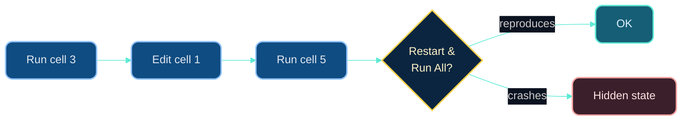

# Dr. Mindaugas Šarpis

# Best Research and Data Analysis Practices from CERN

## Python Foundations

##### <span class="aims-badge">🔧 tool-agnostic</span>

<!--
Speaker: gauge the room — who has written Python before? Reassure absolute
beginners: the live editor on these slides means no setup needed to follow
along. Everything runs in the browser. (~1 min)
-->

---
hideInToc: true
layout: quote
---

# Python is the **Swiss Army knife** of programming — simple enough for beginners, powerful enough for CERN. Learn the basics, and an entire ecosystem of scientific tools opens up.

<!--
Speaker: this is the tool-agnostic aim in action — the ideas transfer, Python is
just today's vehicle. Frame the next ~2 hours as the vocabulary they'll reuse in
every seminar. (~1 min)
-->

---
hideInToc: true
---

# Learning **Objectives**

<div class="note-text mt-sm">By the end of this lecture, you will be able to:</div>

<div class="grid-2 gap-md mt-sm">

<div class="card card-primary card-glass pad-compact">

🐍 Run Python and read its core **syntax** — indentation, dynamic typing, comments

</div>

<div class="card card-secondary card-glass pad-compact">

🔢 Work with built-in **types** and operators — numbers, strings, booleans

</div>

<div class="card card-accent card-glass pad-compact">

📋 Pick the right **data structure** — lists, tuples, sets, dictionaries

</div>

<div class="card card-warning card-glass pad-compact">

🔀 Steer a program with **conditionals** and **loops**

</div>

<div class="card card-success card-glass pad-compact">

⚡ Transform data with **comprehensions** and string methods

</div>

<div class="card card-info card-glass pad-compact">

🖨️ Format output with **f-strings** — logs you can read, grep and diff

</div>

<div class="card card-primary card-glass pad-compact">

🧭 Read a **traceback** calmly and fix the classic beginner errors

</div>

<div class="card card-secondary card-glass pad-compact">

🧹 Name things clearly per **PEP 8** and choose **script vs notebook** deliberately

</div>

</div>

<!--
Speaker: read these as promises, not a syllabus. Point out that the paired
Seminar 7 is where they write their first parser — today gives them the building
blocks. (~1 min)
-->

---
hideInToc: true
---

# Why **Python** — the CERN case

<div class="grid-2 gap-md mt-md">

<div class="card card-primary card-glass pad-tight">

## 🔬 **Python runs the analysis layer**

At all four big LHC experiments, physicists select, fit and plot in Python — **PyROOT**, **uproot** and **awkward** sit on top of the C++ ROOT core. LHCb's analysis productions are configured in Python, too.

</div>

<div class="card card-secondary card-glass pad-tight">

## 🗺️ **…inside a wider landscape**

- **SQL** for structured data · **R** for statistics and reports
- **C++, Julia, Rust** where raw speed decides
- **ROOT, MATLAB, Excel, Origin** — domain and GUI tools

Each is the right tool somewhere; the practices in this course transfer to all of them.

</div>

</div>

<div class="grid-2 gap-md mt-md">

<div class="card card-warning card-glass pad-compact">

🏢 **GUI tools** (Excel, Origin, Tableau) — quick to start and great for a first look, but the click history is lost, the scope is fixed, and the licence is not free.

</div>

<div class="card card-success card-glass pad-compact">

💻 **A language** (Python, R, Julia) — free, open source, scales from a five-line check to a full pipeline, and the script *is* the record: re-run, version, share ♻️.

</div>

</div>

<div class="card card-info card-glass pad-compact mt-md">

💡 That is why this course teaches a **language**, not a product — the steeper start pays back the first time you have to redo an analysis.

</div>

<!--
Speaker: one slide, two messages. First the hook — Python is not "the teaching
language", it is what the analysis layer at ATLAS, CMS, ALICE and LHCb is
actually written in. Then the landscape, so "why Python" reads as an informed
choice: each of these is the right tool somewhere, and a free open language
scales with you where a GUI product stops. Now we start learning it. (~2 min)
-->

---
hideInToc: true
---

# Do You Have Python?

<div class="card card-info card-glass pad-compact mt-md">

## 🔍 **Check Your Installation**

Open your terminal (VS Code: `` Ctrl+` ``) and run:

```bash
python --version      # or python3 --version
```

You should see `Python 3.x.x`.

</div>

<div class="grid-2 gap-md mt-sm">

<div class="card card-primary card-glass pad-compact">

## 🍎 **macOS / Linux**

```bash
brew install python        # macOS (Homebrew)
sudo apt install python3   # Ubuntu/Debian
```

</div>

<div class="card card-secondary card-glass pad-compact">

## 🪟 **Windows**

Download from [python.org](https://www.python.org/downloads/) — check **"Add Python to PATH"** during install.

</div>

</div>

<div class="card card-warning card-glass pad-compact mt-sm">

We will use the **in-browser editor** on these slides for learning, but you will need a local Python install for your projects. *Isolated environments (`venv`, `conda`) that keep each project's packages separate exist too — properly covered in Lecture 14.*

</div>

---
layout: section
hideInToc: true
---

# The **Basics**

<!--
Speaker: the vocabulary block — how to run Python, what a value is, how strings
and lists behave. Keep it brisk; the live runners do the teaching, so get to the
first print() fast. (~1 min)
-->

---
hideInToc: true
---

# Running **Python**

<div class="grid-2 gap-md mt-md">

<div>

<div class="card card-primary card-glass pad-tight">

#### 🚀 **Running Python**

- Interactive mode: `python` or `ipython` in the terminal
- Script mode: `python my_script.py`

</div>

<div class="card card-info card-glass pad-tight mt-sm">

#### 🔑 **Main Points**

- Indentation is crucial in Python
- Python uses dynamic typing *(you don't declare types — Python infers them from the value)*
- Python has a rich standard library and many third-party libraries
- Many built-in functions, e.g. `print()`, `len()`, `type()`, `int()`, `str()`, `list()`, `dict()`

</div>

</div>

<div>

<div class="card card-secondary card-glass pad-tight">

#### 💬 **Comments**

```python
# This function does ...
```

```python
"""Strictly speaking this is a
string literal, not a comment —
but an unassigned one works
like a multi-line comment."""
```

`#` is Python's only true comment. Triple-quoted strings become **docstrings** when placed first in a function — you'll meet those in Lecture 08.

</div>

<div class="card card-accent card-glass pad-tight mt-sm">

#### ⌨️ **Shortcuts & Tips**

- **Ctrl + /** to comment/uncomment selected lines in many editors
- Use comments for quick debugging / prototyping

</div>

</div>

</div>

---
hideInToc: true
---

# Try It — Live Python

```py {monaco-run} {autorun:false}
print("Hello from Python! 🐍", 2 + 2)
```

---
hideInToc: true
---

# Try It — Variables & Types

```py {monaco-run} {autorun:false}
# Experiment with variables and types
name = "CERN"
energy = 13.6  # TeV
num_detectors = 4
is_running = True

# f"..." is a formatted string: {name} drops the value in — more later
print(f"Name: {name} (type: {type(name).__name__})")
print(f"Energy: {energy} TeV (type: {type(energy).__name__})")
print(f"Detectors: {num_detectors} (type: {type(num_detectors).__name__})")
print(f"Running: {is_running} (type: {type(is_running).__name__})")

# Try changing the values and re-running!
```

---
hideInToc: true
---

# Operators & Variables

<div class="grid-2 gap-md mt-md">

<div>

<div class="card card-primary card-glass pad-compact">

#### 🔢 **Basic Operators**

```python
2 + 3   # Addition       → 5
3 * 4   # Multiplication → 12
6 / 2   # Division       → 3.0 (always float!)
7 // 2  # Floor division → 3
5 % 2   # Modulus        → 1
2 ** 10 # Exponentiation → 1024
```

```python
3 > 2 and 4 == 4  # True
not False          # True
"a" in "abc"       # True
```

</div>

</div>

<div>

<div class="card card-secondary card-glass pad-compact">

#### 📝 **Variables and Data Types**

```python
n_events = 10        # Integer
mass_mev = 1865.8    # Float
particle = "K-"      # String
is_valid = True      # Boolean
```

</div>

<div class="card card-info card-glass pad-compact mt-sm">

#### 🔁 **Type Conversion**

- Text from a file is always `str` until you convert it
- `int("42")` → `42` · `float("-1204.5")` → `-1204.5`
- `str(3.0)` → `"3.0"` · `int(3.9)` → `3` *(truncates)*
- `float("N/A")` → **ValueError** — the trap Seminar 7 sets for you

</div>

</div>

</div>

---
hideInToc: true
---

# Strings & Lists

<div class="grid-2 gap-md mt-md">

<div>

<div class="card card-primary card-glass pad-tight">

#### 🔤 **Strings**

```python
s = "Hello, World!"
print(s[0])      # H (indexing)
print(s[-1])     # ! (negative indexing)
print(s[0:5])    # Hello (slicing)
print(len(s))    # Length of string
print(s.lower()) # Convert to lowercase
print(s.upper()) # Convert to uppercase
print(s.replace("World", "Python")) # Replace
```

</div>

</div>

<div>

<div class="card card-accent card-glass pad-tight">

#### 📋 **Lists**

```python
numbers = [1, 2, 3, 4, 5]
print(numbers[0])   # First element
numbers.append(6)   # Add element
numbers.remove(3)   # Remove element
print(len(numbers)) # Length of list
numbers.sort()      # Sort list
```

- Lists are mutable and can hold mixed data types

```python
# name, charge, px / MeV, passed the cuts?
track = ["K-", -1, -1204.5, True]
```

</div>

</div>

</div>

---
layout: section
hideInToc: true
---

# Control **Flow**

<!--
Speaker: deciding and repeating. Stress that indentation, not braces, defines a
block; a stray space is a real bug in Python. Loops over lists are where the
basics pay off — and a comprehension is just a loop that builds a list in one
line. (~1 min)
-->

---
hideInToc: true
---

# Conditionals & Loops

<div class="grid-2 gap-md mt-md">

<div>

<div class="card card-primary card-glass pad-tight">

#### 🔀 **Conditional Statements**

```python
x = 10
if x > 5:
    print("x is greater than 5")
elif x == 5:
    print("x is 5")
else:
    print("x is less than 5")
```

</div>

</div>

<div>

<div class="card card-secondary card-glass pad-tight">

#### 🔁 **Loops**

```python
# For loop
for i in range(5):
    print(i)  # Prints 0 to 4

# While loop
x = 0
while x < 5:
    print(x)
    x += 1
```

</div>

</div>

</div>

<div class="card card-info card-glass pad-compact mt-md">

#### 💡 **Remember**

- Indentation defines blocks — no curly braces needed
- `range(start, stop, step)` generates sequences of integers

</div>

---
hideInToc: true
---

# Try It — Loops and Logic

```py {monaco-run} {autorun:false}
# Classify K-pi invariant masses against the D0 peak (~1865 MeV)
masses_MeV = [1810.2, 1863.5, 1866.9, 1870.1, 1920.4]

for m in masses_MeV:
    if 1855 <= m <= 1875:
        label = "near D0 peak"
    elif m < 1855:
        label = "below peak"
    else:
        label = "above peak"
    print(f"  {m:7.1f} MeV → {label}")

# Count per category
near_peak = sum(1 for m in masses_MeV if 1855 <= m <= 1875)
print(f"\nEvents near the D0 peak: {near_peak}/{len(masses_MeV)}")
```

---
hideInToc: true
---

# Try It — Lists in Action

```py {monaco-run} {autorun:false}
# Working with lists
measurements = [23.1, 25.4, 22.8, 24.5, 26.1, 23.9]

print(f"Measurements: {measurements}")
print(f"Count: {len(measurements)}")
print(f"First: {measurements[0]}, Last: {measurements[-1]}")
print(f"Sorted: {sorted(measurements)}")

# Add a new measurement
measurements.append(24.2)
print(f"After append: {measurements}")

# Filter: only values above 24
# List comprehension — explained on the next slide
above_24 = [m for m in measurements if m > 24]
print(f"Above 24: {above_24}")
```

---
hideInToc: true
---

# List Comprehensions

<div class="grid-2 gap-md mt-md">

<div class="card card-primary card-glass pad-tight">

#### 🔄 **Traditional Loop**

```python
squares = []
for x in range(5):
    squares.append(x**2)
# [0, 1, 4, 9, 16]
```

</div>

<div class="card card-accent card-glass pad-tight">

#### ⚡ **Comprehension (Pythonic)**

```python
squares = [x**2 for x in range(5)]
# [0, 1, 4, 9, 16]

# With condition
evens = [x for x in range(10) if x % 2 == 0]
# [0, 2, 4, 6, 8]
```

</div>

</div>

<div class="card card-info card-glass pad-tight mt-md">

#### 💡 **When to use**

- Simple transformations and filters → comprehension
- Complex logic with side effects → traditional loop

</div>

---
hideInToc: true
---

<MCQ
  question="After running:  a = [1, 2, 3]   then   b = a   then   b.append(4) — what is `a`?"
  :options="[
    '[1, 2, 3] — b is a copy, so a is unchanged',
    '[1, 2, 3, 4] — a and b are the same list',
    'An error — lists cannot be assigned to two names',
    '[4] — b replaces the contents of a'
  ]"
  :correct="1"
  explanation="Assignment never copies in Python — b = a just gives the same list a second name, so changes through either name are visible through both. To get an independent copy, use b = a.copy() or b = list(a). This aliasing surprise is one of the most common beginner bugs."
/>

---
hideInToc: true
---

<MCQ
  question="masses = [1866, 1810, 1871]   then   result = masses.sort() — what is `result`, and what is `masses` now?"
  :options="[
    'result is [1810, 1866, 1871]; masses is unchanged — sort() returns a new sorted list and leaves the original alone',
    'result is None; masses is unchanged — sort() only previews the order',
    'result is None; masses is now [1810, 1866, 1871] — sort() works in place',
    'Both result and masses are [1810, 1866, 1871] — they always match'
  ]"
  :correct="2"
  explanation="list.sort() sorts in place and returns None — printing result would show 'None', a classic beginner trap. sorted(masses) is the alternative: it leaves the original list untouched and returns a new sorted list. Use .sort() when mutating is fine; use sorted() when you need the original preserved too."
/>

---
layout: section
hideInToc: true
---

# From Text to **Numbers**

<!--
Speaker: the seminar's spine — one raw line of a data file becomes a list of
floats. Two slides: the recipe, then the recipe with a name. Everything in
Seminar 7 is a variation on these. (~1 min)
-->

---
hideInToc: true
---

# Strings for Data Wrangling

<div class="card card-info card-glass pad-compact mt-sm">

🧵 Three string methods do most of the work when reading real data files:

</div>

<div class="grid-2 mt-md gap-md">

<div class="card card-primary card-glass pad-tight">

#### ✂️ **`.strip()` and `.split()`**

```python
line = "1049,-1204.5,873.2,15320.7,980.1,-650.4,9210.3\n"
clean = line.strip()        # no newline
parts = clean.split(",")    # list of pieces
# event ID, then kaon (H1) & pion (H2) momentum components
values = [float(p) for p in parts[1:]]
```

</div>

<div class="card card-accent card-glass pad-tight">

#### 🔗 **`.join()` — the reverse**

```python
names = ["run1", "run2", "run3"]
print(", ".join(names))
# run1, run2, run3
```

Build output lines and filenames from lists.

</div>

</div>

<div class="card card-success card-glass pad-compact mt-md">

💡 `strip → split → convert` is the classic recipe for parsing a line of a data file — it is exactly what Seminar 7 asks of you, and Lecture 08 applies it to whole files.

</div>

<!--
Speaker: slow down here — this is exactly what Seminar 7 asks for. Walk the
recipe on the raw line live: strip the newline, split on the comma, float() each
piece. Everything else is variation on this. (~2 min)
-->

---
hideInToc: true
---

# A Peek Ahead — Wrapping the Recipe in a **Function**

<div class="card card-info card-glass pad-compact mt-sm">

Seminar 7 asks you to keep the recipe in a **function** so it can be reused. Lecture 08 covers functions properly — for now: `def name(inputs):`, indent the body, `return` the result.

</div>

```python {monaco-run} {autorun:false}
def parse_line(line):
    parts = line.strip().split(",")
    return [float(p) for p in parts[1:]]

print(parse_line("1049,-1204.5,873.2,15320.7,980.1,-650.4,9210.3\n"))
```

<!--
Speaker: don't teach functions here — just show that the recipe from the previous slide can be given a name and called. (~2 min)
-->

---
layout: section
hideInToc: true
---

# Data **Structures**

<!--
Speaker: lists you have already used; now the other three containers. Frame the
choice — a tuple for things that belong together, a set for distinctness, a dict
for lookup by name. Real analysis code is mostly moving data between these
four. (~1 min)
-->

---
hideInToc: true
---

# Tuples, Sets & Unpacking

<div class="grid-2 mt-md gap-md">

<div class="card card-primary card-glass pad-tight">

#### 📌 **Tuples — frozen lists**

```python
point = (3, 4)          # can't be modified
x, y = point            # unpacking!
x, y = y, x             # the classic swap
```

Ideal for things that belong together: coordinates, (name, value) pairs.

</div>

<div class="card card-secondary card-glass pad-tight">

#### 🎯 **Sets — no duplicates**

```python
hits = [3, 7, 3, 2, 7, 7]
set(hits)         # {2, 3, 7}
len(set(hits))    # 3 distinct sensors
7 in set(hits)    # fast membership test
```

</div>

</div>

<div class="card card-info card-glass pad-compact mt-md">

💡 You'll soon use tuple unpacking without noticing: `for key, value in data.items()` unpacks a tuple on every loop turn.

</div>

---
hideInToc: true
---

# Dictionary Basics

<div class="grid-2 gap-md mt-md">

<div>

<div class="card card-primary card-glass pad-tight">

#### 📖 **Overview**

- Dictionaries map immutable keys (strings, numbers) to values
- Membership checks are fast: `"year" in detector`
- Loop over pairs with `.items()`, keys with `.keys()`, values with `.values()`

</div>

<div class="card card-secondary card-glass pad-tight mt-sm">

#### 💡 **Tips**

- Use `.get()` for optional keys; avoid `KeyError`s from direct indexing
- Nest dictionaries (e.g., parsed JSON) to represent hierarchical structures

</div>

</div>

<div>

<div class="card card-info card-glass pad-tight">

#### 🛠️ **Everyday Operations**

```python
detector = {"name": "LHCb", "year": 2008, "n_runs": 3}
detector["site"] = "Point 8"      # Add key-value pair
detector["n_runs"] += 1           # Update in place

# Safe lookup with default (returns "N/A" if missing)
print(detector.get("magnet", "N/A"))

# Direct lookup (raises KeyError if missing!)
# print(detector["magnet"])  # KeyError: 'magnet'

for key, value in detector.items():
    print(f"{key}: {value}")
```

</div>

</div>

</div>

<!--
Speaker: two details for the curious, not the slide — `.setdefault(key, default)`
both reads and inserts the default if the key is missing (handy for building
dict-of-lists); and `.keys()`/`.values()`/`.items()` are *view* objects that
reflect the live dictionary — add a key and an existing view sees it. (~2 min)
-->

---
hideInToc: true
---

# Dictionary Patterns

<div class="grid-2 gap-md mt-md">

<div>

<div class="card card-primary card-glass pad-tight">

#### 🔄 **Dictionary Comprehension**

```python
squares = {n: n**2 for n in range(5)}
# {0: 0, 1: 1, 2: 4, 3: 9, 4: 16}
```

</div>

<div class="card card-info card-glass pad-tight mt-sm">

#### 🔑 **Merging Dictionaries**

```python
defaults = {"window_mev": 10, "bins": 50}
custom = {"bins": 100, "log_y": True}
merged = {**defaults, **custom}
# {"window_mev": 10, "bins": 100, "log_y": True}
```

</div>

</div>

<div>

<div class="card card-accent card-glass pad-tight">

#### 📊 **Counting Occurrences**

```python
labels = "K- pi+ K- pi+ K- mu-".split()

counts = {}  # empty dictionary

for label in labels:
    counts[label] = counts.get(label, 0) + 1

print(counts)
# {'K-': 3, 'pi+': 2, 'mu-': 1}
```

</div>

</div>

</div>

---
hideInToc: true
---

# Try It — Dictionaries for Data

```py {monaco-run} {autorun:false}
# Storing one D0 -> K- pi+ candidate
event = {
    "event_id": 1049,
    "run": 98213,
    "decay": "D0 -> K- pi+",
    "H1_charge": -1,  # the kaon
    "H2_charge": 1,   # the pion
}

# Access and display
for key, value in event.items():
    print(f"  {key}: {value}")

# Add new data
event["dataset"] = "LHCb Open Data record 401"
event["momentum_cols"] = ["H1_PX", "H1_PY", "H1_PZ", "H2_PX", "H2_PY", "H2_PZ"]
print(f"\nUpdated: event {event['event_id']} tracks {len(event['momentum_cols'])} momentum components")
```

---
layout: section
hideInToc: true
---

# Readable **Output**

<!--
Speaker: everything so far computed values; now we make them legible. Formatted
output is not cosmetic — a run's printout is a log 📁 you and others read, grep,
and paste into reports. f-strings are the tool. (~1 min)
-->

---
hideInToc: true
---

# From `print()` to **f-strings**

<div class="note-text mt-sm">You've been writing f-strings all lecture — here is what the colon does:</div>

<div class="grid-2 gap-md mt-md">

<div class="card card-warning card-glass pad-tight">

#### 😐 **Plain `print()`**

```python
mass = 1865.84
print("mass is", mass, "MeV")
# mass is 1865.84 MeV
```

Values glued with spaces — no control over how they look.

</div>

<div class="card card-success card-glass pad-tight">

#### ✨ **f-string** (formatted)

```python
mass = 1865.84
print(f"mass = {mass:.1f} MeV")
# mass = 1865.8 MeV
```

Put an `f` before the quote; drop variables inside `{ }`.

</div>

</div>

<div class="card card-info card-glass pad-compact mt-md">

💡 The `:` inside the braces starts a **format spec** — `{mass:.1f}` means "this float, one decimal place." That colon is where readable analysis logs begin.

</div>

---
hideInToc: true
---

# Try It — f-strings, **Properly**

```py {monaco-run} {autorun:false}
name = "D0"
mass_mev = 1865.84
n_events = 40129

# {var} drops the value in; {var:spec} formats it
print(f"{name} candidate mass = {mass_mev:.2f} MeV")
print(f"collected {n_events:,} events")   # ',' → thousands separators

# Try: add a line printing the mass in GeV (divide by 1000)
```

---
hideInToc: true
---

# The Format **Spec** Mini-Language

<div class="note-text mt-sm">Inside <code>{value:spec}</code>, the part after the colon controls how the value is rendered — then try it on a table:</div>

<div class="grid-2 gap-md mt-sm">

<div class="card card-primary card-glass pad-compact">

#### 🔢 **Numbers**

```python
f"{3.14159:.2f}"   # '3.14'  fixed decimals
f"{1865:,}"        # '1,865' thousands
f"{0.0473:.1%}"    # '4.7%'  percent
f"{42:04d}"        # '0042'  zero-pad
```

</div>

<div class="card card-accent card-glass pad-compact">

#### 📐 **Width & alignment**

```python
f"{'K':>6}"   # '     K'  right
f"{'K':<6}"   # 'K     '  left
f"{'K':^6}"   # '  K   '  centre
```

Fixed widths line numbers up into readable columns.

</div>

</div>

```py {monaco-run} {autorun:false}
results = [("K-", 493.7), ("pi+", 139.6), ("D0", 1865.8)]

print(f"{'particle':<10}{'mass / MeV':>12}")
print("-" * 22)
for particle, mass in results:
    print(f"{particle:<10}{mass:>12.2f}")   # aligned columns → a log you can scan
```

---
hideInToc: true
---

# Why Formatting **Matters**

<div class="grid-2 gap-md mt-md">

<div class="card card-primary card-glass pad-tight">

## 📁 **Logs are data too**

A run that prints `mass = 1865.8 MeV` and `events = 40,129` is a log you can read at a glance — then grep, diff, and paste into a report.

</div>

<div class="card card-secondary card-glass pad-tight">

## ♻️ **Reproducible reporting**

Rounding to a fixed number of decimals means the same analysis prints the same numbers every run — no 15-digit float noise cluttering the output.

</div>

</div>

<div class="card card-success card-glass pad-compact mt-md">

💡 Write for the reader of the log — the person deciding whether to trust the result is often the one squinting at your printout.

</div>

<!--
Speaker: tie back to the four aims — formatted, rounded output is reproducibility
♻️ and file-friendliness 📁 in miniature. A log you can diff between two runs is
a log that catches a regression. (~1 min)
-->

---
layout: section
hideInToc: true
---

# Reading **Tracebacks**

<!--
Speaker: reframe errors from failure to feedback. Everyone crashes code; the
skill that separates beginners from the fluent is reading the traceback instead
of panicking. The error message is data 📁 — read it. (~1 min)
-->

---
hideInToc: true
---

# Anatomy of a **Traceback**

<div class="card card-info card-glass pad-compact mt-sm">

🧭 Python prints a traceback when code crashes. Read it **bottom-up** — the last line is what actually went wrong.

</div>

```text {*}{lines:false}
Traceback (most recent call last):
  File "parse.py", line 12, in <module>
    mass = mass_of(parts)
  File "parse.py", line 5, in mass_of
    return momentum / energy
TypeError: unsupported operand type(s) for /: 'str' and 'float'
```

<div class="grid-2 gap-md mt-sm">

<div class="card card-primary card-glass pad-compact">

#### 👇 **Last line = the diagnosis**

`TypeError: ...` — the exception type plus a plain-English reason.

</div>

<div class="card card-accent card-glass pad-compact">

#### 📍 **Above it = the call chain**

Each `File ... line ...` is a **frame**: line 12 called the function `mass_of`, line 5 inside it raised. Frames stack outermost → innermost — the deepest one is the crash site.

</div>

</div>

---
hideInToc: true
---

# The Error Message Is **Data**

<div class="stack-tight mt-md">

<div class="card card-primary card-glass pad-tight">

## 🔎 **Read the type first**

`NameError`, `TypeError`, `IndexError` — each names a distinct kind of mistake. Learn the common three and you diagnose most beginner crashes on sight.

</div>

<div class="card card-secondary card-glass pad-tight">

## 📍 **Then jump to the line number**

The traceback names the file and line. Open it there — don't guess where the bug is.

</div>

<div class="card card-success card-glass pad-tight">

## 🗣️ **The message is a hint, not a scold**

Treat it as data 📁: paste the exact text into a search engine or the docs. A traceback is the single most useful debugging clue Python hands you.

</div>

</div>

---
hideInToc: true
---

# Fix It — **NameError**

<div class="card card-warning card-glass pad-compact mt-sm">

⚠️ `NameError: name 'X' is not defined` — you used a name Python has never seen. Usually a typo, or a variable used before it is created.

</div>

```py {monaco-run} {autorun:false}
# BROKEN: run it, read the traceback, then fix the typo
energy_gev = 13.6
print(f"beam energy: {enrgy_gev} GeV")

# Fix: correct the misspelled name on the last line
```

<!--
Speaker: have them run it first and read the NameError aloud before fixing.
The point is the loop: run → read → fix, not memorising the answer. (~1 min)
-->

---
hideInToc: true
---

# Fix It — **TypeError**

<div class="card card-warning card-glass pad-compact mt-sm">

⚠️ `TypeError` — an operation met the wrong type. Classic case: a number read from a file is still a **string**, and Python refuses to add a string to a float.

</div>

```py {monaco-run} {autorun:false}
# BROKEN: k_px came from a text file, so it is still a string
k_px = "-1204.5"
k_py = 873.2
print("total =", k_px + k_py)   # str + float → TypeError

# Fix: wrap k_px in float() before adding
```

---
hideInToc: true
---

# A Peek Ahead — Skipping Junk Lines **Safely**

<div class="card card-warning card-glass pad-compact mt-sm">

⚠️ `float()` has the same complaint as `+` — on non-numeric text it raises a `ValueError`. Real data files have junk lines too — a header, a blank line, a corrupted row — and one of them crashes your script.

</div>

```py {monaco-run} {autorun:false}
lines = ["1049,-1204.5,980.1", "event,K_px,pi_px", "1050,988.1,-650.4"]

for line in lines:
    try:
        event_id, k_px, pi_px = line.split(",")
        print(f"event {event_id}: K px={float(k_px)}, pi px={float(pi_px)}")
    except ValueError:
        # !r shows the quotes so you can see stray spaces
        print(f"skipped junk line: {line!r}")
```

<div class="card card-info card-glass pad-compact mt-sm">

💡 The full `try` / `except` / `finally` toolkit — with multiple exception types — comes in Lecture 08. For now: wrap the risky conversion, catch `ValueError`, move on.

</div>

<!--
Speaker: this is a preview only — Seminar 7 needs it before L08 formally teaches
exceptions. Don't dwell on syntax; the message is "some lines are junk, skip
them safely." (~1 min)
-->

---
hideInToc: true
---

# Fix It — **IndexError**

<div class="card card-warning card-glass pad-compact mt-sm">

⚠️ `IndexError: list index out of range` — you asked for a position that isn't there. A 3-item list has indices `0`, `1`, `2` — not `3`.

</div>

```py {monaco-run} {autorun:false}
# BROKEN: off-by-one — the last valid index is len(parts) - 1
parts = "1049,-1204.5,873.2".split(",")
print("first :", parts[0])
print("last  :", parts[3])

# Fix: use parts[-1] (or parts[2]) for the last element
```

---
hideInToc: true
---

<MCQ
  question="A script crashes with: 'Traceback (most recent call last)' / 'File run.py, line 3' / 'File run.py, line 8' / 'IndexError: list index out of range'. Which line should you inspect first?"
  :options="[
    'Line 3 — it appears first, so it must have failed first',
    'Line 8 — the last frame before the exception is where it actually raised',
    'The Traceback header line — it holds the real error',
    'None — an IndexError never points to a real code line'
  ]"
  :correct="1"
  explanation="Read tracebacks bottom-up. Frames are listed outermost-first (line 3 called into line 8); the deepest frame — line 8, just above the exception — is where the bad index was used. The header even says so: 'most recent call last' means the last frame listed is the most recent, and it is the one that raised."
/>

---
hideInToc: true
---

# A Calm Traceback **Checklist**

<div class="grid-2 gap-md mt-sm">

<div class="card card-primary card-glass pad-compact">

## 1️⃣ **Don't panic — read the last line**

The exception type and message name the problem in plain words.

</div>

<div class="card card-secondary card-glass pad-compact">

## 2️⃣ **Go to the line number**

Open the named file at that line; the bug is there, or just above it.

</div>

<div class="card card-accent card-glass pad-compact">

## 3️⃣ **Print the suspect values**

Add `print(f"{x=}")` before the crash to see what the data actually is — try it below.

</div>

<div class="card card-success card-glass pad-compact">

## 4️⃣ **Search the exact message**

Paste the error text verbatim — someone has hit it before you.

</div>

</div>

```py {monaco-run} {autorun:false}
k_px, k_py, k_pz = -1204.5, 873.2, 15320.7
momentum = (k_px**2 + k_py**2 + k_pz**2) ** 0.5
print(f"{k_px=}")            # '=' inside the braces prints the NAME and the VALUE
print(f"{momentum=:.1f}")    # a format spec still works after '='
```

---
layout: section
hideInToc: true
---

# Naming & **Style**

<!--
Speaker: pivot from "does it run" to "can a human read it". Style is a
reproducibility ♻️ courtesy to future-you, not bureaucracy. Frame the next few
slides as cheap habits that pay off every time you reopen a file. (~1 min)
-->

---
hideInToc: true
---

# Names That State **Meaning**

<div class="grid-2 gap-md mt-md">

<div class="card card-warning card-glass pad-tight">

#### 🚫 **Cryptic**

```python
m2 = 1865.8
x = m2 / 1000
d = [a for a in q if a > x]
```

What is `m2`? What units? Future-you has no idea.

</div>

<div class="card card-success card-glass pad-tight">

#### ✅ **Self-describing**

```python
mass_mev = 1865.8
mass_gev = mass_mev / 1000
peak = [m for m in masses_mev if m > mass_mev]
```

The name carries the **quantity and its unit**.

</div>

</div>

<div class="grid-2 gap-md mt-md">

<div class="card card-info card-glass pad-compact">

🏷️ **Put the unit in the name** — `mass_mev`, `time_ns`, `energy_gev`. It is the cheapest bug-prevention there is in physics code.

</div>

<div class="card card-accent card-glass pad-compact">

🔮 **Future-you is a stranger** ♻️ — in three months you won't remember what `q` or `m2` meant. Write for the reader, not the interpreter.

</div>

</div>

<!--
Speaker: the second row is the "why". The computer accepts anything that parses;
humans do not — and the human most often reading this file is a forgetful
version of the author. (~1 min)
-->

---
hideInToc: true
---

# PEP 8 — The Shared **Style**

<div class="note-text mt-sm">PEP 8 is Python's community style guide — consistency over cleverness, so any teammate can read any file. A handful of conventions cover most of it:</div>

<div class="grid-2 gap-md mt-md">

<div class="card card-primary card-glass pad-tight">

#### 📏 **Names**

- `snake_case` for variables & functions
- `UPPER_CASE` for constants
- `CapWords` for class names
- short, but never cryptic

</div>

<div class="card card-accent card-glass pad-tight">

#### 🧱 **Layout**

- 4 spaces per indent, never tabs
- spaces around `=` and operators (but don't pad to align)
- one statement per line
- a blank line between logical blocks

</div>

</div>

<div class="card card-success card-glass pad-compact mt-md">

💡 You don't memorise PEP 8 — a **formatter** (`black`, `ruff`) applies it for you on save. That automation ⚙️ arrives in Lecture 14.

</div>

---
hideInToc: true
---

# No **Magic** Numbers

<div class="grid-2 gap-md mt-md">

<div class="card card-warning card-glass pad-tight">

#### 🎩 **Magic number**

```python
if 1855 <= m <= 1875:
    keep.append(m)
```

Why 1855? Why 1875? A reader has to guess the intent.

</div>

<div class="card card-success card-glass pad-tight">

#### 🏷️ **Named constant**

```python
D0_MASS_MEV = 1865.0
WINDOW_MEV = 10.0

if abs(m - D0_MASS_MEV) <= WINDOW_MEV:
    keep.append(m)
```

The window is now documented **and** tweakable in one place.

</div>

</div>

<div class="card card-info card-glass pad-compact mt-md">

💡 Constants named once, near the top of the file, are a reproducibility ♻️ win: change the cut in one line, re-run, done.

</div>

---
hideInToc: true
---

# Try It — **Rename** for Clarity

```py {monaco-run} {autorun:false}
# This runs, but it is write-only code. Rename the variables
# (and the magic number) so a stranger could read it at a glance.
a = [1810.2, 1863.5, 1866.9, 1870.1, 1920.4]
b = [x for x in a if abs(x - 1865) <= 10]
print(f"{len(b)} of {len(a)} in window")

# Suggested names: masses_mev, D0_MASS_MEV, WINDOW_MEV, in_window
```

---
layout: section
hideInToc: true
---

# Scripts vs **Notebooks**

<!--
Speaker: the last habit — where code lives. Notebooks are wonderful for
exploration and treacherous for reproducibility. Set up the course's stance:
scripts for the pipeline, notebooks for play. Forward pointer to L14. (~1 min)
-->

---
hideInToc: true
---

# Notebook or **Script**?

<div class="grid-2 gap-md mt-md">

<div class="card card-primary card-glass pad-tight">

## 📓 **Notebook** (Jupyter)

Cells you run in any order, with output and plots inline. Reach for it when…

- you're still figuring out what to do
- the output is a chart to eyeball
- the work is one-off and disposable
- ⚠️ but: cells run out of order → confusion

</div>

<div class="card card-success card-glass pad-tight">

## 📜 **Script** (`.py`)

A plain file run top to bottom: `python analysis.py`. Reach for it when…

- someone will run it again
- it feeds another step
- correctness must survive a restart
- ✅ same order every run; version-controllable, automatable

</div>

</div>

<div class="card card-info card-glass pad-compact mt-md">

💡 Not rivals — a workflow: explore in a notebook, then **harden the keeper steps into a script**. In doubt, script it: a script opens in a notebook for free; a tangled notebook rarely becomes a clean script.

</div>

---
hideInToc: true
---

# The Notebook **Hidden-State** Hazard

<div class="note-text mt-sm">A notebook remembers every variable from every cell you ran — in whatever order you ran them:</div>



<div class="card card-info card-glass pad-compact mt-sm">

💡 The honest test — **Restart & Run All**. If it doesn't reproduce top-to-bottom, the result only lived in your session, not in the notebook.

</div>

---
hideInToc: true
---

# The Course's **Stance**

<div class="stack-tight mt-md">

<div class="card card-primary card-glass pad-tight">

## 🔬 **Explore in notebooks**

Prototype a fit, eyeball a histogram, try a cut. Fast, visual, disposable.

</div>

<div class="card card-success card-glass pad-tight">

## 📜 **Ship the pipeline as scripts**

Anything another person — or future-you — must re-run belongs in a `.py` file under version control.

</div>

<div class="card card-accent card-glass pad-tight">

## ⚙️ **Automate the scripts**

Scripts chain into a reproducible workflow — the whole story of **Lecture 14**.

</div>

</div>

---
hideInToc: true
---

<MCQ
  question="When is a notebook the wrong tool?"
  :options="[
    'Eyeballing a histogram while you decide where to put the mass window — the plot is the point',
    'A one-off sanity check of a single file that you will throw away afterwards',
    'A selection step a teammate must re-run next month',
    'Trying three fit models to see which one converges before committing to one'
  ]"
  :correct="2"
  explanation="Three of these are exploration — disposable, visual, still-deciding work — and that is exactly what notebooks are for. The selection step is different: someone else will re-run it, it feeds the next step, and it must give the same answer without your session's hidden state. That is a script under version control. Rule of thumb: if it must be re-run by anyone (including future-you), script it."
/>

---
hideInToc: true
---

# **Recap** — You Can Now…

<div class="grid-2 gap-md mt-sm">

<div class="card card-success card-glass pad-compact">

✅ Run Python and use its core **syntax** and built-in types

</div>

<div class="card card-success card-glass pad-compact">

✅ Build and manipulate **lists, dicts, tuples, and sets**

</div>

<div class="card card-success card-glass pad-compact">

✅ Write **comprehensions** and parse text with string methods

</div>

<div class="card card-success card-glass pad-compact">

✅ Direct program flow with **conditionals** and **loops**

</div>

<div class="card card-success card-glass pad-compact">

✅ Format output with **f-strings** and read a **traceback** calmly

</div>

<div class="card card-success card-glass pad-compact">

✅ Name things clearly per **PEP 8** and pick **script vs notebook** wisely

</div>

</div>

<div class="card card-accent card-glass pad-tight mt-md">

## 🔬 **Seminar 7 tie-in**

Write your first parser — turn one raw event line from the dataset into usable numbers.

</div>

<!--
Speaker: the "you can now" beat — have them mentally tick each box. The seminar
tie-in makes it concrete: they leave with the strip → split → convert recipe and
apply it to a real line of the seminar dataset (LHCb D0 -> K-pi+). (~1 min)
-->

---
hideInToc: true
---

# Where to Go **Next**

<div class="grid-2 gap-md mt-md">

<div>

<div class="card card-primary card-glass pad-tight">

## 📖 **Official Documentation**

- [Python Official Documentation](https://docs.python.org/)
- [Python Tutorial](https://docs.python.org/3/tutorial/index.html)

</div>

<div class="card card-secondary card-glass pad-tight mt-sm">

## 📊 **Data Science**

- [Python for Data Science Handbook](https://jakevdp.github.io/PythonDataScienceHandbook/)

</div>

</div>

<div class="card card-info card-glass pad-tight">

## 🎓 **Free Introductory Courses**

- **The official Python tutorial** — docs.python.org, fully free
- **Coursera / edX** — university courses, free to audit
- **freeCodeCamp & Kaggle Learn** — fully free, hands-on
- **Codecademy / Udemy** — polished, but the good parts are usually paid

<div class="note-text mt-sm">

Free coverage varies by platform — the fully-free options above are more than enough for this course.

</div>

</div>

</div>

<!--
Speaker: a closer, not a homework list — the official tutorial alone covers
everything this lecture touched. Point at it for anyone who wants a second pass
before Seminar 7. (~1 min)
-->
