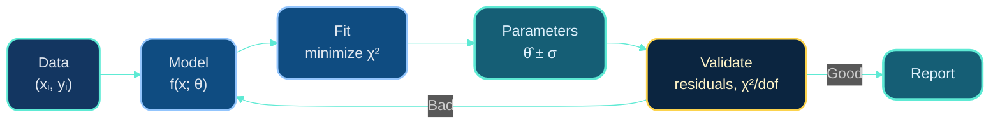

# Dr. Mindaugas Šarpis

# Best Research and Data Analysis Practices from CERN

## Data Fitting

##### <span class="aims-badge">⚙️ automation · 🔧 tool-agnostic</span>

<!--
Speaker: open on the promise — turning noisy points into a number ± an error.
Every field in the room does this; today we make it principled. (~1 min)
-->

---
hideInToc: true
layout: quote
---

# Data fitting is how we extract quantitative knowledge from measurements---turning noisy observations into precise parameter estimates with well-understood uncertainties.

---
hideInToc: true
---

# Learning **Objectives**

<div class="note-text mt-sm">By the end of this lecture, you will be able to:</div>

<div class="stack-tight mt-sm">

<div class="card card-primary card-glass pad-compact">

🎯 Frame fitting as choosing parameters that best describe your **data**

</div>

<div class="card card-secondary card-glass pad-compact">

⚖️ Weight points by their errors with the **chi-squared** statistic

</div>

<div class="card card-accent card-glass pad-compact">

🐍 Run nonlinear fits with **`scipy.optimize.curve_fit`**

</div>

<div class="card card-success card-glass pad-compact">

🔍 Judge fit quality with **residuals** and reduced **χ²** (χ²/dof ≈ 1)

</div>

<div class="card card-warning card-glass pad-compact">

♻️ Report every result as **value ± uncertainty**

</div>

</div>

<!--
Speaker: read these as promises, not a syllabus. Point out Seminar 12 is where
they fit a real LHCb peak and report a mass with error — today builds the
mental model. (~1 min)
-->

---
hideInToc: true
---

# Why Data **Fitting**?

<div class="card card-info card-glass pad-tight mt-md">

## **Motivation**

Every quantitative science depends on extracting numbers from noisy measurements. Data fitting provides a principled framework for doing this.

</div>

<div class="grid-2 mt-md gap-md">

<div class="card card-primary card-glass pad-tight">

## **In the Lab**

- **Calibrating instruments** --- relating raw sensor readings to physical units
- **Extracting physical constants** --- measuring particle masses, lifetimes, cross-sections
- **Characterizing signals** --- finding peak positions, widths, amplitudes

</div>

<div class="card card-secondary card-glass pad-tight">

## **In Research**

- **Testing hypotheses** --- does the data support a new theory?
- **Quantifying uncertainties** --- how precisely do we know a result?
- **Separating signal from background** --- finding rare processes in noisy data

</div>

</div>

---
layout: section
hideInToc: true
---

# What is **Data Fitting?**

<!--
Speaker: section shift — from "why" to "what". Define it cleanly:
data + model → parameters ± uncertainties, checked and iterated. (~30 sec)
-->

---
hideInToc: true
---

# The Fundamental **Problem**

<div class="card card-info card-glass pad-tight mt-md">

## **Definition**

**Data fitting** is the process of finding parameter values $\theta$ such that a model $f(x; \theta)$ best describes observed data $(x_i, y_i)$.

$$\text{Data} \xrightarrow{\text{fitting}} \text{Parameter estimates } \hat{\theta} \pm \text{uncertainties}$$

</div>

<div class="grid-2 mt-md gap-md">

<div class="card card-primary card-glass pad-tight">

## **What we have**

- Measurements $(x_i, y_i)$ with uncertainties
- A theoretical model $f(x; \theta)$
- Prior knowledge about subject

</div>

<div class="card card-secondary card-glass pad-tight">

## **What we want**

- Best-fit parameter values $\hat{\theta}$
- Uncertainties on parameters
- Assessment of fit quality
- Confidence in our model

</div>

</div>

---
hideInToc: true
---

# The Data Fitting **Workflow**



<div class="card card-accent card-glass pad-compact mt-md">

🔁 **Key insight**: Fitting is iterative. If diagnostics reveal problems, refine the model and repeat.

</div>

<!--
Speaker: walk the loop once: data + model → minimize χ² → θ̂ ± σ → validate.
The "Bad" arrow back to Model is the whole lecture in one edge. (~1 min)
-->

---
layout: section
hideInToc: true
---

# Mathematical **Models**

<!--
Speaker: a model is a function with knobs. Three flavours, then what the knobs
(parameters) actually mean in a signal-plus-background fit. (~30 sec)
-->

---
hideInToc: true
---

# What Is a **Model**?

<div class="card card-info card-glass pad-tight mt-md">

## **Definition**

A **mathematical model** is a function $f(x; \theta)$ that describes the relationship between independent variable(s) $x$ and dependent variable $y$:

$$y = f(x; \theta) + \varepsilon$$

where $\varepsilon$ represents random measurement errors.

</div>

<div class="grid-2 mt-md gap-md">

<div class="card card-primary card-glass pad-tight">

## **Components**

- **Functional form**: theory-motivated shape
- **Parameters $\theta$**: unknown quantities to estimate
- **Error term $\varepsilon$**: accounts for noise/uncertainty

</div>

<div class="card card-secondary card-glass pad-tight">

## **Examples**

- Linear: $y = mx + b$
- Exponential decay: $y = A e^{-\lambda t}$
- Gaussian peak: $y = A e^{-(x-\mu)^2/2\sigma^2}$
- Polynomial: $y = \sum a_n x^n$

</div>

</div>

---
hideInToc: true
---

# Three Kinds of **Model**

<div class="grid-3 mt-md gap-md">

<div class="card card-primary card-glass pad-tight">

### 📐 **Mechanistic**

Based on physical principles

- First-principles derivation
- Parameters have physical meaning
- Preferred in physics

**Example**: Decay rate from quantum mechanics

</div>

<div class="card card-secondary card-glass pad-tight">

### 📈 **Empirical**

Based on observed patterns

- Data-driven functional form
- May lack physical interpretation
- Useful for interpolation

**Example**: Polynomial fit to calibration data

</div>

<div class="card card-info card-glass pad-tight">

### 🔀 **Hybrid**

Combines both approaches

- Physical model + corrections
- Systematic effects modeled empirically
- Common in practice

**Example**: Signal (Gaussian) + background (empirical)

</div>

</div>

<div class="card card-warning card-glass pad-tight mt-md">

**Important**: The choice of model should be guided by knowledge of the subject, not just by what fits best. A good fit with a wrong model gives wrong answers!

</div>

---
hideInToc: true
---

# Parameters **Example**: Gaussian + Exponential

<div class="grid-2 mt-md gap-md" style="margin-top: 0;">

<div class="stack-tight">

<div class="card card-primary card-glass pad-tight">

## **Types of Parameters**

Parameters $\theta$ are the unknowns we want to determine:

- **Physical quantities**: mass, lifetime, cross-section
- **Shape descriptors**: width, amplitude, position
- **Nuisance parameters**: background level, resolution

</div>

<div class="card card-secondary card-glass pad-tight">

## **Each parameter has**

- A true (unknown) value
- An estimated value $\hat{\theta}$
- An uncertainty $\sigma_{\hat{\theta}}$

</div>

</div>

<div class="stack-tight">

<div class="card card-accent card-glass pad-compact">

## **Model**

$$f(x) = A \cdot e^{-\frac{(x-\mu)^2}{2\sigma^2}} + N \cdot e^{-x/\lambda}$$

</div>

<div class="card card-info card-glass pad-compact">

## **Parameters**

- $A$ — signal amplitude
- $\mu$ — signal position (mass)
- $\sigma$ — signal width (resolution)
- $N$ — background normalization
- $\lambda$ — background decay scale

</div>

</div>

</div>

<!--
Speaker: point at the table — A, μ, σ are the physics; N, λ are nuisance
parameters we must fit but don't care about. The seminar's D⁰ fit has exactly
this shape (Gaussian + linear or exponential background). (~1.5 min)
-->

---
layout: section
hideInToc: true
---

# Parameter **Estimation**

<!--
Speaker: the mathematical heart — least squares, its link to maximum likelihood,
and where the covariance matrix (the errors) comes from. (~1 min)
-->

---
hideInToc: true
---

# The Estimation **Problem**

<div class="card card-info card-glass pad-tight mt-md">

## **Goal**

Given data and a model, find the parameter values $\hat{\theta}$ that make the model best describe the data.

"Best" means: **maximize agreement** between model predictions and observations.

</div>

<div class="grid-2 mt-md gap-md">

<div class="card card-primary card-glass pad-tight">

## **The Challenge**

- Data contains random noise
- Multiple parameter combinations might seem plausible
- Need principled way to choose "best"
- Must quantify uncertainty in our estimates

</div>

<div class="card card-secondary card-glass pad-tight">

## **Solution: Optimization**

Define a **cost function** measuring disagreement:

$$\text{Cost}(\theta) = \text{how bad is this } \theta?$$

Then minimize it:

$$\hat{\theta} = \arg\min_\theta \text{Cost}(\theta)$$

</div>

</div>

---
hideInToc: true
---

# Least **Squares**

<div class="card card-info card-glass pad-tight mt-md">

## **Sum of Squared Residuals**

The most common approach: minimize the sum of squared differences between data and model:

$$S(\theta) = \sum_{i=1}^{n} \left[ y_i - f(x_i; \theta) \right]^2$$

</div>

<div class="grid-2 mt-md gap-md">

<div class="card card-primary card-glass pad-tight">

## **Intuition**

- Residual $r_i = y_i - f(x_i; \theta)$
- Squaring removes sign (positive/negative equally bad)
- Large errors penalized more heavily
- Leads to smooth optimization landscape

</div>

<div class="card card-accent card-glass pad-tight">

## **Connection to MLE**

If errors are Gaussian:
$$\varepsilon_i \sim N(0, \sigma^2)$$

Then **least squares = maximum likelihood**

This is why least squares is so widely used.

</div>

</div>

---
hideInToc: true
---

# Weighted Least Squares = **χ²**

<div class="card card-info card-glass pad-tight mt-md">

## **Weighted Least Squares**

If data points have different uncertainties $\sigma_i$, weight them accordingly:

$$\chi^2(\theta) = \sum_{i=1}^{n} \frac{\left[ y_i - f(x_i; \theta) \right]^2}{\sigma_i^2}$$

Points with smaller uncertainties contribute more to the fit.

</div>

<div class="grid-2 mt-md gap-md">

<div class="card card-primary card-glass pad-tight">

## **Physical interpretation**

- $\sigma_i$ = uncertainty on point $i$
- Precise measurements ($\sigma_i$ small) → large weight
- Imprecise measurements → small weight
- This is the **chi-squared statistic**

</div>

<div class="card card-warning card-glass pad-tight">

## **Common case: Poisson data**

For histogram bin counts $n_i$: $\sigma_i = \sqrt{n_i}$

Fine for $n_i \gtrsim 10$. **Sparse bins**: $\sqrt{n_i}$ under-weights fluctuations and biases yields low → use $\sigma_i = \sqrt{f(x_i)}$ from the model, or a Poisson likelihood fit.

</div>

</div>

<!--
Speaker: the √n trick is what everyone does and it is fine for well-populated
bins. In the tails a bin with 1 count gets σ = 1 and a bin with 0 counts gets
σ = 0 — that is where fits go wrong; the model-σ or a likelihood fit fixes it. (~1.5 min)
-->

---
hideInToc: true
---

# The **Covariance** Matrix

<div class="card card-info card-glass pad-tight mt-md">

## **The Covariance Matrix**

The fit produces not just $\hat{\theta}$ but also the **covariance matrix** $\mathbf{C}$:

$$C_{ij} = \text{Cov}(\hat{\theta}_i, \hat{\theta}_j)$$

</div>

<div class="grid-2 mt-md gap-md">

<div class="card card-primary card-glass pad-tight">

## **Diagonal elements**

$$C_{ii} = \text{Var}(\hat{\theta}_i) = \sigma_{\hat\theta_i}^2$$

**Parameter uncertainties:**

$$\sigma_{\hat\theta_i} = \sqrt{C_{ii}}$$

Report results as: $\hat{\theta}_i \pm \sigma_{\hat\theta_i}$

</div>

<div class="card card-secondary card-glass pad-tight">

## **Off-diagonal elements**

$$C_{ij} = \text{Cov}(\hat{\theta}_i, \hat{\theta}_j)$$

**Correlations between parameters:**

$$\rho_{ij} = \frac{C_{ij}}{\sigma_{\hat\theta_i}\, \sigma_{\hat\theta_j}}$$

Important for error propagation!

</div>

</div>

<!--
Speaker: distinguish the two sigmas explicitly — σᵢ is the error on a DATA
point, σ_θ̂ is the error on a fitted PARAMETER. Students mix them up all the
time. (~1 min)
-->

---
hideInToc: true
---

# The **Covariance** Matrix, Pictured

<div class="note-text mt-sm">

Same fit as the Gaussian runner you are about to run --- four parameters $(A, \mu, \sigma, b)$, one 4×4 matrix. The **tilted ellipse** on the right *is* the off-diagonal entry $\rho(A, \sigma) = -0.57$ on the left.

</div>


<!--
Speaker: left — read the matrix like a table: A and σ anti-correlated (wider
peak, lower amplitude, same area); μ decouples because the peak is symmetric on
a flat background. Right — the Δχ² = 1 ellipse projects to exactly ±1σ on each
axis (dashed lines); the Δχ² = 2.3 ellipse is the 68 % JOINT region, which is
bigger. The tilt is the correlation. Come back here when we talk about
correlated parameters. (~2 min)
-->

---
hideInToc: true
---

<MCQ
  question="In the pictured fit, ρ(A, σ) = −0.57. Which reading is correct?"
  :options="[
    'The width σ is poorly measured because of the correlation',
    'A wider fitted peak comes with a lower amplitude — the data pin down the area, not A and σ separately',
    'μ and σ must also be strongly correlated',
    'The single-parameter errors on A and σ already include the joint uncertainty'
  ]"
  :correct="1"
  explanation="A negative ρ(A, σ) means the χ² valley runs diagonally: making the peak wider and lower leaves the area (yield) almost unchanged, so the data constrain A·σ better than either alone. μ decouples for a symmetric peak on a flat background, and single-parameter errors (Δχ² = 1 projections) understate the joint region."
/>

---
hideInToc: true
---

# Initial **Guesses** Matter

<div class="card card-warning card-glass pad-tight mt-md">

## **The Local Minimum Problem**

Nonlinear fitting is an optimization problem. Poor initial guesses can lead to:

- Convergence to **local** (not global) minimum
- Fit failure or nonsensical results
- Very slow convergence

</div>

<div class="grid-2 mt-md gap-md">

<div class="card card-primary card-glass pad-tight">

## **Good practice**

1. **Visualize data first**
2. Estimate parameters by eye
3. Use physical constraints
4. Try multiple starting points

</div>

<div class="card card-info card-glass pad-tight">

## **For a Gaussian peak**

- `mean` ≈ position of maximum
- `sigma` ≈ FWHM / 2.35 (or HWHM / 1.18)
- `amplitude` ≈ peak height

</div>

</div>

<!--
Speaker: this comes BEFORE the runners on purpose — every p0 in the next three
slides was read off a plot exactly this way. FWHM/2.35 is the one number to
memorise. (~1.5 min)
-->

---
hideInToc: true
---

# `curve_fit` in **One Line**

<div class="card card-info card-glass pad-tight mt-md">

`scipy.optimize.curve_fit` performs nonlinear least squares fitting:

```python
popt, pcov = curve_fit(model, x_data, y_data, p0=initial_guess, sigma=errors, absolute_sigma=True)
```

</div>

<div class="grid-2 mt-md gap-md">

<div class="card card-primary card-glass pad-tight">

## **Inputs**

- `model`: function $f(x, \theta_1, \theta_2, ...)$
- `x_data`, `y_data`: your measurements
- `p0`: initial parameter guess
- `sigma`: per-point uncertainties $\sigma_i$
- `absolute_sigma=True`: treat σ as real errors — the default `False` rescales `pcov` by χ²/dof, hiding a bad χ²
- `bounds`: parameter limits (optional)

</div>

<div class="card card-secondary card-glass pad-tight">

## **Outputs**

- `popt`: optimal parameters $\hat{\theta}$
- `pcov`: covariance matrix

**Uncertainties:**
```python
errors = np.sqrt(np.diag(pcov))
```

Under the hood: no bounds → Levenberg-Marquardt (gradient descent + Gauss-Newton hybrid); with bounds → a trust-region method.

</div>

</div>

<!--
Speaker: absolute_sigma is the gotcha of the day. With the default, curve_fit
silently multiplies pcov by χ²/dof — a terrible fit then gets inflated errors
that look "honest", and a suspiciously good fit gets shrunk ones. Always pass
True when your σᵢ are real. (~1.5 min)
-->

---
hideInToc: true
---

# Interactive: **Linear** Fit

<div class="note-text mt-sm">

Fit a straight line $y = mx + b$ to noisy data and extract the slope and intercept with uncertainties. ⚙️ *Do it once by hand, then let the fitter do it every time.*

</div>

```python {monaco-run} {autorun:false}
np.random.seed(42)
x = np.linspace(0, 10, 20)
y = 2.5 * x + 1.0 + np.random.normal(0, 2.0, 20)
sigma = np.full_like(x, 2.0)

def linear(x, m, b):
    return m * x + b

popt, pcov = curve_fit(linear, x, y, sigma=sigma, absolute_sigma=True)
m, b = popt; dm, db = np.sqrt(np.diag(pcov))
chi2 = np.sum(((y - linear(x, *popt)) / sigma) ** 2)

plt.figure(figsize=(7, 3.1))
plt.errorbar(x, y, yerr=sigma, fmt='o', ms=4, label='Data')
plt.plot(x, linear(x, *popt), 'r-',
         label=f'm={m:.2f}±{dm:.2f}, b={b:.2f}±{db:.2f}')
plt.title(f'chi2/dof = {chi2:.1f}/{len(x)-2} = {chi2/(len(x)-2):.2f}')
plt.legend(); plt.xlabel('x'); plt.ylabel('y'); plt.tight_layout(); plt.show()
```

<!--
Speaker: output — m = 2.12 ± 0.15, b = 2.55 ± 0.86, χ²/dof = 10.9/18 = 0.61
(p ≈ 0.90). Truth was m = 2.5, b = 1.0: the slope reads 2.5σ low and the
intercept 1.8σ high — but ρ(m, b) ≈ −0.85 for a line over x ∈ [0, 10], so this
is ONE joint ~2σ wobble (Δχ² ≈ 7 for 2 dof), not two independent ones. χ²/dof
of 0.61 just says this sample scattered less than σ = 2 — nothing to fix.
Change the seed and watch both move together. (~2 min)
-->

---
hideInToc: true
---

# Interactive: **Gaussian** Fit

<div class="note-text mt-sm">

Fit a Gaussian peak $A \cdot e^{-(x-\mu)^2/2\sigma^2}$ to simulated histogram data --- a common task in particle physics.

</div>

```python {monaco-run} {autorun:false}
np.random.seed(7); data = np.concatenate([np.random.normal(5, 0.8, 500),
                                          np.random.uniform(0, 10, 200)])
counts, edges = np.histogram(data, bins=40, range=(0, 10))
x = 0.5 * (edges[:-1] + edges[1:])
y = counts.astype(float); yerr = np.sqrt(np.maximum(counts, 1))

def gauss_bg(x, A, mu, sig, bg):
    return A * np.exp(-(x - mu) ** 2 / (2 * sig ** 2)) + bg

popt, pcov = curve_fit(gauss_bg, x, y, p0=[40, 5, 1, 5], sigma=yerr, absolute_sigma=True)
err = np.sqrt(np.diag(pcov))
chi2 = np.sum(((y - gauss_bg(x, *popt)) / yerr) ** 2)

plt.figure(figsize=(7, 3.1)); xf = np.linspace(0, 10, 200)
plt.errorbar(x, y, yerr=yerr, fmt='o', ms=3, label='Data')
plt.plot(xf, gauss_bg(xf, *popt), 'r-',
         label=f'mu={popt[1]:.2f}±{err[1]:.2f}, sig={popt[2]:.2f}±{err[2]:.2f}')
plt.title(f'chi2/dof = {chi2:.1f}/{len(x)-4} = {chi2/(len(x)-4):.2f}')
plt.legend(); plt.xlabel('x'); plt.ylabel('Counts'); plt.tight_layout(); plt.show()
```

<!--
Speaker: output — μ = 4.95 ± 0.04, σ = 0.81 ± 0.04 (truth 5, 0.8),
χ²/dof = 40.2/36 = 1.12 (p ≈ 0.29) — textbook. This is the very fit whose
covariance matrix we just pictured: A = 63.7 ± 3.7 with ρ(A, σ) = −0.57.
Print `pcov / np.outer(err, err)` live to show the matrix. (~2 min)
-->

---
hideInToc: true
---

# Interactive: **Exponential** Decay Fit

<div class="note-text mt-sm">

Fit an exponential decay $N_0 \cdot e^{-t/\tau}$ to extract the lifetime $\tau$ --- a key measurement in nuclear and particle physics.

</div>

```python {monaco-run} {autorun:false}
np.random.seed(13)
t = np.linspace(0.5, 8, 25)
N = np.random.poisson(200 * np.exp(-t / 2.5)).astype(float)
sigma_N = np.sqrt(np.maximum(N, 1))

def decay(t, N0, tau):
    return N0 * np.exp(-t / tau)

popt, pcov = curve_fit(decay, t, N, p0=[150, 2], sigma=sigma_N, absolute_sigma=True)
N0, tau = popt; err = np.sqrt(np.diag(pcov))
chi2 = np.sum(((N - decay(t, *popt)) / sigma_N) ** 2)

plt.figure(figsize=(7, 3.1))
plt.errorbar(t, N, yerr=sigma_N, fmt='o', ms=4, label='Data')
tf = np.linspace(0.5, 8, 200)
plt.plot(tf, decay(tf, *popt), 'r-',
         label=f'N0={N0:.0f}±{err[0]:.0f}, tau={tau:.2f}±{err[1]:.2f}')
plt.title(f'chi2/dof = {chi2:.1f}/{len(t)-2} = {chi2/(len(t)-2):.2f}')
plt.legend(); plt.xlabel('Time'); plt.ylabel('Counts'); plt.tight_layout(); plt.show()
```

<!--
Speaker: output — N₀ = 206 ± 10, τ = 2.41 ± 0.09 (truth 200, 2.5),
χ²/dof = 31.0/23 = 1.35. Talking point: 1.35 with 23 dof is p ≈ 0.12 — not
alarming; χ²/dof has its own spread (≈ √(2/dof) ≈ 0.3 here). Also note the
last bins have ~8 counts — √n is getting marginal there. (~2 min)
-->

---
hideInToc: true
---

# Constraining **Parameters**

<div class="card card-info card-glass pad-tight mt-md">

## **Physical Constraints**

Real parameters often have physical bounds (e.g., $\sigma > 0$, mass positive):

```python
bounds = (
    [0, 0, 0.01, 0, 0.1],      # Lower bounds
    [np.inf, 15, 5, np.inf, 10]  # Upper bounds
)
popt, pcov = curve_fit(model, x, y, p0=p0, bounds=bounds)
```

</div>

<div class="grid-2 mt-md gap-md">

<div class="card card-primary card-glass pad-tight">

## **Benefits**

- Prevents unphysical solutions
- Can speed up convergence
- Incorporates prior knowledge

</div>

<div class="card card-warning card-glass pad-tight">

## **Caution**

- If optimal is at boundary → may indicate model problems
- Very tight bounds can bias results
- Check if bounds are affecting your fit

</div>

</div>

---
layout: section
hideInToc: true
---

# Uncertainties & **Diagnostics**

<!--
Speaker: we already read errors off the covariance matrix — now the intuition:
where they come from, when they shrink, how to cross-check them without
trusting any formula, and how residuals tell you the model is wrong. (~30 sec)
-->

---
hideInToc: true
---

# Where Parameter **Errors** Come From

<div class="card card-info card-glass pad-tight mt-md">

## **The Δχ² = 1 Rule**

Near its minimum, $\chi^2(\theta)$ is approximately a parabola. The **1σ uncertainty** on a parameter is the shift that raises $\chi^2$ by exactly **1**.

</div>

<div class="grid-2 mt-md gap-md">

<div class="card card-primary card-glass pad-tight">

## 📉 **Sharp minimum**

- $\chi^2$ rises steeply as $\theta$ moves
- Data strongly constrain the parameter
- **Small** uncertainty

</div>

<div class="card card-warning card-glass pad-tight">

## 🥣 **Shallow minimum**

- $\chi^2$ barely changes near $\hat{\theta}$
- Many values describe the data almost equally well
- **Large** uncertainty

</div>

</div>

---
hideInToc: true
---

# More Data, **Smaller** Errors

<div class="card card-info card-glass pad-tight mt-md">

## **The 1/√N Law**

Statistical uncertainties on fitted parameters shrink as $1/\sqrt{N}$ — to **halve** an error you need **four times** the data.

</div>

<div class="grid-2 mt-md gap-md">

<div class="card card-primary card-glass pad-tight">

## 📊 **Planning a measurement**

- Estimate the precision you need **before** collecting data
- Doubling the run time buys only a √2 improvement
- Diminishing returns are built in

</div>

<div class="card card-accent card-glass pad-tight">

## 🧱 **The systematic floor**

- At some $N$, systematic uncertainties dominate
- More data then stops helping
- Effort shifts to calibration and model choice

</div>

</div>

---
hideInToc: true
---

# Correlated **Parameters**: Width and Yield

<div class="card card-info card-glass pad-tight mt-md">

## **Parameters Move Together**

With a background under a peak, the fitted amplitude, width, and yield are **not independent** — the tilted confidence ellipse we pictured ($\rho(A, \sigma) = -0.57$) is exactly this.

</div>

<div class="grid-2 mt-md gap-md">

<div class="card card-primary card-glass pad-tight">

## 🔍 **How it shows up**

- Widening $\sigma$ is compensated by lowering $A$ — the data pin down the **area**
- Single-parameter errors understate the joint uncertainty
- $\mu$ decouples for a symmetric peak on a flat background; a sloped background couples it too

</div>

<div class="card card-warning card-glass pad-tight">

## ⚠️ **Why you must care**

- Error propagation without $C_{ij}$ is simply wrong
- $|\rho| \approx 1$ → consider reparameterizing the model
- Report strong correlations alongside the result

</div>

</div>

<!--
Speaker: flip back to the ellipse figure if needed. Concrete reparameterisation:
fit the yield N = A·σ·√(2π) instead of A — the correlation with σ mostly
disappears. (~1.5 min)
-->

---
hideInToc: true
---

# Bootstrap: Errors **Without** Formulas

<div class="note-text mt-sm">

Don't want to trust the covariance matrix blindly? **Refluctuate the data around the fitted model, refit, repeat** — the spread of the refitted values *is* the uncertainty. ♻️ *A cross-check you can run anywhere.*

</div>

```python {monaco-run} {autorun:false}
rng = np.random.default_rng(1)
x = np.linspace(0, 10, 40)
def gauss_bg(x, A, mu, sig, b):
    return A * np.exp(-0.5 * ((x - mu) / sig) ** 2) + b
y = rng.poisson(gauss_bg(x, 40, 5, 0.8, 5)).astype(float)
popt, pcov = curve_fit(gauss_bg, x, y, p0=[40, 5, 1, 5], sigma=np.sqrt(np.maximum(y, 1)), absolute_sigma=True)
mus = []
for _ in range(500):                          # parametric bootstrap ("toy MC"): refluctuate + refit
    yb = rng.poisson(gauss_bg(x, *popt)).astype(float)
    p, _ = curve_fit(gauss_bg, x, yb, p0=popt, sigma=np.sqrt(np.maximum(yb, 1)), absolute_sigma=True)
    mus.append(p[1])
print(f"covariance error on mu: {np.sqrt(pcov[1, 1]):.4f}")
print(f"bootstrap spread of mu: {np.std(mus):.4f}")
```

<!--
Speaker: run it — covariance 0.052 vs bootstrap 0.052 (0.0524 vs 0.0523).
This is a PARAMETRIC bootstrap, a.k.a. toy Monte Carlo: each toy is a fresh
Poisson draw around the fitted model, refit with the same recipe. It works for
ANY estimator, however complicated, as long as you can refit. (~2 min)
-->

---
hideInToc: true
---

# Residual **Analysis**

<div class="card card-info card-glass pad-tight mt-md">

## **Definition**

**Residual** = observed − predicted: $r_i = y_i - f(x_i; \hat{\theta})$

Residuals reveal how well the model captures the data structure.

</div>

<div class="grid-2 mt-md gap-md">

<div class="card card-success card-glass pad-tight">

## ✅ **Good Fit**

- Randomly scattered around zero
- No visible patterns or trends
- Approximately Gaussian distributed
- Size consistent with uncertainties

</div>

<div class="card card-warning card-glass pad-tight">

## ⚠️ **Problems Indicated**

- **Trends**: model missing structure
- **Outliers**: bad data or wrong model
- **Heteroscedasticity**: uncertainty varies
- **Periodicity**: missing periodic component

</div>

</div>

---
hideInToc: true
---

# Standardized **Residuals**

<div class="card card-info card-glass pad-tight mt-md">

## **Pull Distribution**

Standardize residuals by their uncertainties:

$$\text{pull}_i = \frac{y_i - f(x_i; \hat{\theta})}{\sigma_i}$$

If model is correct and uncertainties accurate: pulls ~ $N(0, 1)$

</div>

<div class="grid-3 mt-md gap-md">

<div class="card card-primary card-glass pad-tight">

### **Mean**

Should be ≈ 0

Non-zero → systematic bias

</div>

<div class="card card-secondary card-glass pad-tight">

### **Width**

Should be ≈ 1

- $\sigma_{\text{pull}} > 1$ → errors underestimated
- $\sigma_{\text{pull}} < 1$ → errors overestimated

</div>

<div class="card card-accent card-glass pad-tight">

### **Shape**

Should be Gaussian

Non-Gaussian → model problems

</div>

</div>

---
hideInToc: true
---

# Visualizing Fit **Quality**

<div class="card card-info card-glass pad-tight mt-md">

## **Standard Plot Structure**

A complete fit visualization includes:

1. **Upper panel**: Data with error bars + fitted model + components
2. **Lower panel**: Residuals or pulls

</div>

<div class="grid-2 mt-md gap-md">

<div class="card card-primary card-glass pad-tight">

## **What to include**

- Data points with error bars
- Total fit (solid line)
- Individual components (dashed)
- Clear legend and labels
- Axis labels with units

</div>

<div class="card card-secondary card-glass pad-tight">

## **Residual panel**

- Same x-axis as main plot
- Zero line clearly marked
- Error bars on residuals
- Smaller height (ratio ~3:1)

**Alternative**: Show pulls instead

</div>

</div>

---
layout: section
hideInToc: true
---

# Goodness-of-Fit: **chi-squared**

<!--
Speaker: the single most useful diagnostic. Anchor χ²/dof ≈ 1 = good, but stress
it never replaces looking at the residuals. (~1 min)
-->

---
hideInToc: true
---

# The Chi-Squared **Statistic**

<div class="card card-info card-glass pad-tight mt-md">

## **Definition**

$$\chi^2 = \sum_{i=1}^{n} \frac{(y_i - f(x_i; \hat{\theta}))^2}{\sigma_i^2}$$

Sum of squared standardized residuals---measures total disagreement weighted by uncertainties.

</div>

<div class="grid-2 mt-md gap-md">

<div class="card card-primary card-glass pad-tight">

## **Properties**

- $\chi^2 \geq 0$ always
- Smaller = better fit
- Expectation: $E[\chi^2] \approx \text{dof}$
- Distribution is known (for testing)

</div>

<div class="card card-secondary card-glass pad-tight">

## **Degrees of Freedom**

$$\text{dof} = n - p$$

- $n$ = number of data points
- $p$ = number of fitted parameters

Accounts for "freedom used up" by fitting.

</div>

</div>

---
hideInToc: true
---

# Reduced **Chi-Squared**

<div class="card card-info card-glass pad-tight mt-md">

## **The Key Diagnostic**

$$\chi^2_\nu = \frac{\chi^2}{\text{dof}} = \frac{\chi^2}{n - p}$$

The reduced chi-squared should be **approximately 1** for a good fit.

</div>

<div class="grid-3 mt-md gap-md">

<div class="card card-success card-glass pad-tight">

### ✅ **chi2/dof ≈ 1**

Good fit

Model describes data well, uncertainties are correct

</div>

<div class="card card-warning card-glass pad-tight">

### ⚠️ **chi2/dof >> 1**

Poor fit

Model missing structure, or uncertainties underestimated

</div>

<div class="card card-accent card-glass pad-tight">

### 🔍 **chi2/dof << 1**

Suspicious

Uncertainties overestimated, or too many parameters

</div>

</div>

---
hideInToc: true
---

# What Does the Number **Feel** Like?

<div class="grid-2 mt-md gap-md">

<div class="card card-warning card-glass pad-tight">

## 🔴 **chi2/dof = 5.0**

40 data points, and the fitted curve visibly misses a shoulder in the histogram --- a bump the model doesn't have a term for.

**Read**: something real is being missed. Go straight to the residual plot --- the shape of the misfit tells you what term to add.

</div>

<div class="card card-accent card-glass pad-tight">

## 🟡 **chi2/dof = 0.2**

Same 40 points, but the curve runs almost exactly through every error bar --- suspiciously perfect, not just "good".

**Read**: uncertainties likely overestimated, or too many free parameters are soaking up the noise.

</div>

</div>

---
hideInToc: true
---

# Reading **χ²/dof**

<div class="grid-2 mt-md gap-md">

<div class="card card-primary card-glass pad-tight">

## **When chi2/dof is large**

Possible causes:
1. Wrong model (missing terms)
2. Systematic effects not included
3. Uncertainties too small
4. Outliers in data

**Action**: Check residuals for patterns, reconsider model

</div>

<div class="card card-secondary card-glass pad-tight">

## **When chi2/dof is small**

Possible causes:
1. Uncertainties overestimated
2. Too many free parameters
3. Fitting noise (overfitting)

**Action**: Review uncertainty estimation, simplify model

</div>

</div>

<div class="card card-warning card-glass pad-tight mt-md">

**Important**: chi-squared alone doesn't tell you the model is correct---only that residuals are consistent with assumed uncertainties. Always combine with visual inspection!

</div>

---
hideInToc: true
---

# p-value from **chi-squared**

<div class="card card-info card-glass pad-tight mt-md">

## **Statistical Test**

The p-value answers: "If the model is correct, what's the probability of getting a chi-squared this large or larger?"

$$p = P(\chi^2 > \chi^2_{\text{obs}} \mid H_0)$$

</div>

<div class="grid-2 mt-md gap-md">

<div class="card card-primary card-glass pad-tight">

## **Interpretation**

Use it as a **fit-quality diagnostic**, not a significance verdict: a very small p means the model likely doesn't describe the data — the same message as a large chi2/dof, expressed as a probability.

**Careful**: formal "significant / not significant" claims from p-values are a topic of their own — beyond this course. Here, always read the p-value alongside chi2/dof and the residuals.

</div>

<div class="card card-accent card-glass pad-tight">

## **Calculation**

```python
from scipy.stats import chi2 as chi2_dist

p_value = 1 - chi2_dist.cdf(chi_squared, dof)
# or equivalently:
p_value = chi2_dist.sf(chi_squared, dof)
```

</div>

</div>

<!--
Speaker: the alias matters — `chi2` is already the NAME of the number in every
runner today; importing scipy's distribution as `chi2` would shadow it. The
decay fit: chi2_dist.sf(31.0, 23) ≈ 0.12. (~1 min)
-->

---
hideInToc: true
---

# Model **Comparison**

<div class="card card-info card-glass pad-tight mt-md">

## **Which Model is Better?**

When comparing nested models (e.g., with/without a component), use:

</div>

<div class="grid-2 mt-md gap-md">

<div class="card card-primary card-glass pad-tight">

## **Likelihood Ratio Test**

$$\Delta \chi^2 = \chi^2_{\text{simple}} - \chi^2_{\text{complex}}$$

Compare to chi-squared distribution with delta-dof degrees of freedom.

Large $\Delta \chi^2$ → complex model significantly better

</div>

<div class="card card-secondary card-glass pad-tight">

## **Information Criteria**

**AIC**: $2p - 2\ln(L)$ · **BIC**: $p\ln(n) - 2\ln(L)$

For Gaussian errors $-2\ln L = \chi^2 + \text{const}$, so **AIC = χ² + 2p**

Lower is better. Automatically penalize complexity.

</div>

</div>

<div class="card card-accent card-glass pad-tight mt-md">

**Occam's razor**: Prefer simpler models unless data strongly favor complexity.

</div>

---
layout: section
hideInToc: true
---

# Common **Issues**

<!--
Speaker: the failure modes, then a gallery of quiet failures to diagnose. (~30 sec)
-->

---
hideInToc: true
---

# When Fits Go **Wrong**

<div class="grid-2 mt-md gap-md">

<div class="card card-warning card-glass pad-tight">

## **Convergence Failure**

Fit doesn't converge or gives errors

**Causes:**
- Model incompatible with data (or with `p0`)
- Numerical issues (overflow, divide by zero)
- Empty bins with $\sigma_i = 0$

**Solutions:**
- Plot the model at `p0` before fitting
- Add parameter bounds
- Rescale variables (GeV not eV, $t/\tau$ not $t$)

</div>

<div class="card card-warning card-glass pad-tight">

## **Unreasonable Results**

Parameters have wrong sign or magnitude

**Causes:**
- Local minimum
- Correlated parameters
- Wrong model functional form

**Solutions:**
- Reparameterize model
- Simplify or change model
- Check `pcov` and the bounds, not just the return status

</div>

</div>

---
hideInToc: true
---

# Common **Pitfalls**

<div class="grid-2 mt-md gap-md" style="margin-top: 0;">

<div class="stack-tight">

<div class="card card-warning card-glass pad-tight">

## ⚠️ **Empty Bins**

**Problem**: $\sigma_i = \sqrt{0}$ → division by zero

**Solution**: Exclude, or use the model's $\sigma_i = \sqrt{f(x_i)}$ (not $\sigma_i = 1$)

</div>

<div class="card card-warning card-glass pad-tight">

## ⚠️ **Overfitting**

**Problem**: Model fits noise, not signal

**Solution**: Use simplest model that explains data

</div>

</div>

<div class="stack-tight">

<div class="card card-warning card-glass pad-tight">

## ⚠️ **Ignoring Correlations**

**Problem**: Parameters often correlated

**Solution**: Use full covariance for error propagation

</div>

<div class="card card-warning card-glass pad-tight">

## ⚠️ **Extrapolation**

**Problem**: Model unreliable outside data range

**Solution**: Only predict within fitted domain

</div>

</div>

</div>

---
hideInToc: true
---

# Pitfalls **Gallery**: What Went Wrong Here?

<div class="note-text mt-sm">

Three fits that broke quietly, each in its own way. Diagnose the symptom before reading the fix, then try the MCQ. 🔍 *Same detective work you'll do on the D⁰ peak in Seminar 12.*

</div>

<div class="grid-3 mt-md gap-md">

<div class="card card-warning card-glass pad-tight">

## 🎯 **Bad Starting Values**

**Symptom**: the fit "succeeds" with no error, but the curve barely moves off `p0` --- it never gets near the data.

**Fix**: plot the model at `p0` before fitting. A starting curve visibly close to the data beats any clever algorithm.

</div>

<div class="card card-warning card-glass pad-tight">

## ⚖️ **Ignoring Uncertainties**

**Symptom**: fit without `sigma` and three noisy, large-$y$ points dominate the result, while ten precise points near zero are outvoted.

**Fix**: always pass real per-point $\sigma_i$. Unweighted least squares silently assumes every point is equally trustworthy.

</div>

<div class="card card-warning card-glass pad-tight">

## 🕳️ **Converged to Garbage**

**Symptom**: `curve_fit` raises nothing, but a parameter sits exactly on its bound and `pcov` has a huge or ill-defined diagonal entry.

**Fix**: check `pcov` and the bounds every time --- "no exception" is not the same as "correct answer."

</div>

</div>

---
hideInToc: true
---

<MCQ
  question="A fit reports success. The width parameter sits exactly on the lower bound you supplied, and its reported uncertainty is enormous. Which pitfall is this?"
  :options="[
    'Bad starting values',
    'Fitting noise with too many parameters',
    'Ignoring uncertainties',
    'Silently converged to garbage'
  ]"
  :correct="3"
  explanation="A parameter pinned at its bound with a huge or ill-defined uncertainty is the signature of a fit that 'succeeded' numerically while landing somewhere unphysical --- always inspect pcov and the bounds, not just the fit's return status."
/>

---
layout: section
hideInToc: true
---

# Best **Practices**

<!--
Speaker: distil the workflow — visualize before fitting, report uncertainties,
always check χ²/dof and residuals. These habits are the reproducibility payoff. (~1 min)
-->

---
hideInToc: true
---

# The Complete **Workflow**

<div class="grid-2 mt-md gap-md">

<div class="card card-primary card-glass pad-tight">

## **Before Fitting**

1. **Visualize data** - look for patterns, outliers
2. **Choose model** - based on physics, not convenience
3. **Estimate parameters** - reasonable starting point
4. **Define uncertainties** - how precise are measurements?

</div>

<div class="card card-secondary card-glass pad-tight">

## **After Fitting**

1. **Check convergence** - did fit succeed?
2. **Examine residuals** - patterns = problems
3. **Calculate chi2/dof** - is fit quality acceptable?
4. **Report results** - parameters with uncertainties
5. **Document** - make it reproducible

</div>

</div>

---
hideInToc: true
---

# Do's and **Don'ts**

<div class="grid-2 mt-md gap-md">

<div class="card card-success card-glass pad-tight">

## ✅ **Do**

- Visualize data **before** fitting
- Use physically motivated models
- Report uncertainties with results
- Check residuals for patterns
- Calculate and report chi2/dof
- Document your analysis fully
- Consider systematic uncertainties

</div>

<div class="card card-warning card-glass pad-tight">

## ❌ **Don't**

- Fit without looking at data
- Use arbitrary functional forms
- Report parameters without uncertainties
- Skip residual analysis
- Cherry-pick "good" fits
- Overfit with too many parameters
- Extrapolate far beyond data range
- Ignore the covariance matrix

</div>

</div>

---
layout: section
hideInToc: true
---

# Real-World **Applications**

<!--
Speaker: quick tour — the same recipe found the Higgs, and the same recipe is
what a neural network does with a million knobs. (~30 sec)
-->

---
hideInToc: true
---

# Example: Higgs Boson **Discovery**

<div class="card card-accent card-glass pad-tight mt-md">

## **CERN 2012: Same Techniques!**

The Higgs boson was discovered using exactly these fitting methods.

</div>

<div class="grid-2 mt-md gap-md">

<div class="card card-primary card-glass pad-tight">

## **The Analysis**

- Signal model: Gaussian peak at ~125 GeV
- Background: smooth polynomial
- Fit extracts mass and signal yield
- Result: 5 sigma significance

</div>

<div class="card card-info card-glass pad-tight">

## **What They Did**

The same ideas, done as a **likelihood fit** rather than χ²:

- Maximum-likelihood fits (profile-likelihood ratio for significance)
- Background-only hypothesis tests
- Systematic uncertainty estimation

</div>

</div>

---
hideInToc: true
---

# Beyond **Physics**

<div class="grid-3 mt-md gap-md">

<div class="card card-primary card-glass pad-tight">

### 🧬 **Biology**

- Growth curves
- Enzyme kinetics
- Population dynamics

</div>

<div class="card card-secondary card-glass pad-tight">

### 💊 **Medicine**

- Dose-response
- Pharmacokinetics
- Survival analysis

</div>

<div class="card card-info card-glass pad-tight">

### 🌍 **Climate**

- Temperature trends
- CO2 models
- Sea level rise

</div>

<div class="card card-success card-glass pad-tight">

### 💰 **Economics**

- Regression models
- Time series
- Demand forecasting

</div>

<div class="card card-accent card-glass pad-tight">

### 🏭 **Engineering**

- Calibration
- Signal processing
- Quality control

</div>

<div class="card card-warning card-glass pad-tight">

### 🤖 **Machine Learning**

Same principles!
- Cost function = chi2
- Parameters = weights
- Optimization = training

</div>

</div>

---
hideInToc: true
---

# Fitting vs **Machine Learning**

<div class="grid-2 mt-md gap-md">

<div class="card card-primary card-glass pad-tight">

## **Traditional Fitting**

- Explicit model: $y = f(x; \theta)$
- Physics-based form
- Few parameters (5-10)
- Interpretable
- Requires domain knowledge

</div>

<div class="card card-secondary card-glass pad-tight">

## **Machine Learning**

- Flexible model (neural network)
- Data-driven form
- Many parameters (millions)
- Less interpretable
- Requires lots of data

</div>

</div>

<div class="card card-accent card-glass pad-tight mt-md">

**Both are parameter estimation problems.** ML is fitting with very complex, flexible models. Understanding fitting makes you better at ML.

</div>

---
hideInToc: true
---

# Seminar 12 — Fit a **Real Peak**

<div class="note-text mt-sm">

🎯 **Seminar 12:** fit the **D⁰** peak of the LHCb K⁻π⁺ spectrum (Gaussian + linear or exponential background) → **m ≈ 1865 MeV** with error, width ± error, χ²/dof, and a pull check. *Same recipe for any peak in any field.*

</div>


<!--
Speaker: this is the real thing they will fit — the sample is shared across all
seminars, and a starter script plus an initial mass estimate are provided. (~1 min)
-->

---
hideInToc: true
---

# Try It — Fit a **Simulated** D⁰ Peak 🔬

<div class="note-text">

Click ▶ to fit a simulated D⁰-like peak live and see its pull panel — then shrink the sample or drop the background term and re-run. *In Seminar 12 you do this on the real LHCb spectrum.*

</div>

```python {monaco-run} {autorun:false}
rng = np.random.default_rng(0)
mass = np.concatenate([rng.normal(1.865, 0.009, 4000),    # D0-like peak
                       rng.uniform(1.78, 1.96, 8000)])    # flat background
y, edges = np.histogram(mass, bins=60, range=(1.78, 1.96))
x, err = 0.5 * (edges[:-1] + edges[1:]), np.sqrt(np.maximum(y, 1))

def model(x, A, mu, sig, b):                      # Gaussian peak + flat background
    return A * np.exp(-0.5 * ((x - mu) / sig) ** 2) + b   # try b + c*x for the seminar's linear background

popt, pcov = curve_fit(model, x, y, p0=[y.max(), 1.86, 0.01, np.median(y)], sigma=err, absolute_sigma=True)
pull = (y - model(x, *popt)) / err; perr = np.sqrt(np.diag(pcov)); chi2 = np.sum(pull ** 2)   # pulls

fig, (a1, a2) = plt.subplots(2, 1, figsize=(7, 3.2), sharex=True, gridspec_kw={'height_ratios': [3, 1]})
a1.errorbar(x, y, yerr=err, fmt='o', ms=3); a1.plot(edges, model(edges, *popt), 'r-')
a1.set_title(f'mu = {popt[1]*1e3:.2f} ± {perr[1]*1e3:.2f} MeV, chi2/dof = {chi2:.1f}/{len(x)-4}')
a2.axhline(0, color='gray', lw=1); a2.scatter(x, pull, s=8, color='#D55E00')
a1.set_ylabel('Events'); a2.set(xlabel='M (GeV)', ylabel='pull')
plt.tight_layout(); plt.show()
```

<!--
Speaker: output — μ = 1864.82 ± 0.20 MeV, σ = 9.04 ± 0.19 MeV (truth 1865, 9),
χ²/dof = 64.3/56 = 1.15; the pulls have mean 0.04 and spread 1.03. Then break
it on purpose: shrink N and watch the errors grow as 1/√N, or drop the
background term and watch the pulls drift away from zero. (~3 min)
-->

---
hideInToc: true
---

<MCQ
  question="After a fit you get χ²/dof ≈ 5. What does this most likely indicate?"
  :options="[
    'The fit is excellent — the model perfectly captures the data',
    'The model is missing structure, or the uncertainties are underestimated',
    'The uncertainties were overestimated',
    'There are simply too many free parameters'
  ]"
  :correct="1"
  explanation="χ²/dof well above 1 means the residuals are larger than the assumed errors — the model misfits or the σᵢ are too small; χ²/dof well below 1 is the overestimated-error / overfitting case."
/>

---
hideInToc: true
---

# **Recap** — You Can Now…

<div class="grid-2 gap-md mt-sm">

<div class="card card-success card-glass pad-compact">

✅ Fit a model by **least squares** — chosen from physics, not from what fits best

</div>

<div class="card card-success card-glass pad-compact">

✅ Read errors and correlations from the **covariance matrix** (with `absolute_sigma=True`)

</div>

<div class="card card-success card-glass pad-compact">

✅ Judge a fit with **residuals**, **pulls** and **χ²/dof** — a good χ² still has to make physical sense

</div>

<div class="card card-success card-glass pad-compact">

✅ Run real fits in **`curve_fit`** and report **value ± error**

</div>

</div>

<div class="grid-2 gap-md mt-md">

<div class="card card-accent card-glass pad-tight">

## 🔬 **Seminar 12 tie-in**

Fit the LHCb D⁰ peak (Gaussian + linear/exponential background) with `curve_fit`, report mass **and width** ± error, χ²/dof, and check the **pull** distribution — all wrapped in one re-runnable script.

</div>

<div class="card card-info card-glass pad-tight">

## 🌌 **The Big Picture**

Fitting connects theory to data. It's how we extract quantitative knowledge from measurements---used everywhere from particle physics to machine learning.

</div>

</div>

<!--
Speaker: the "you can now" beat — have them nod along to each. The seminar makes
it concrete: they fit a real D⁰ peak and report m ≈ 1865 MeV with χ²/dof. (~1 min)
-->

---
hideInToc: true
---

# Further **Reading**

<div class="card card-info card-glass pad-compact mt-sm">

📚 The go-to references for fitting and uncertainties:

</div>

<div class="grid-2 mt-md gap-md">

<div class="card card-primary card-glass pad-compact">

📗 **Hughes & Hase** — *Measurements and their Uncertainties* — practical and clear

</div>

<div class="card card-secondary card-glass pad-compact">

📘 **Bevington & Robinson** — *Data Reduction and Error Analysis for the Physical Sciences*

</div>

<div class="card card-accent card-glass pad-compact">

🔬 **James** — *Statistical Methods in Experimental Physics*

</div>

<div class="card card-info card-glass pad-compact">

🐍 **SciPy docs** — `scipy.optimize.curve_fit` and `lmfit` for real-world fitting

</div>

</div>
