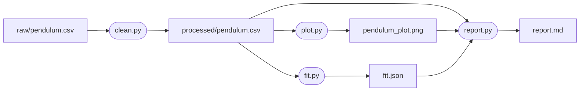
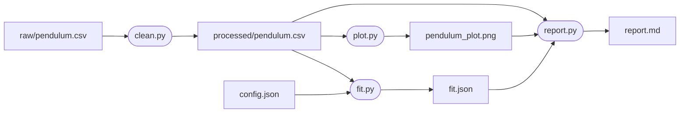

# Dr. Mindaugas Šarpis

# Best Research and Data Analysis Practices from CERN

## Reproducible Workflows & Automation

##### <span class="aims-badge">♻️ reproducibility · ⚙️ automation · 🔧 tool-agnostic · 📁 data & files</span>

<!--
Speaker: the project folder holds scripts that clean, plot and fit the pendulum
table. They were run by hand. Today they become one pipeline that anyone can
rebuild with one command. (~1 min)
-->

---
hideInToc: true
layout: quote
---

# An article about computational science in a scientific publication is not the scholarship itself, it is merely **advertising** of the scholarship. The actual scholarship is the complete software development environment and the complete set of instructions which generated the figures.

<div class="note-text" style="text-align: right; margin-top: 1.5rem;">— J. Buckheit and D. Donoho (1995), after Jon Claerbout</div>

---
hideInToc: true
---

# Learning **Objectives**

<div class="note-text mt-sm">By the end of this lecture, you will be able to:</div>

<div class="grid-2 gap-md mt-sm">

<div class="card card-primary card-glass pad-compact">

⌨️ Give a script a **command line** with `argparse` and keep its parameters in a **config file**

</div>

<div class="card card-secondary card-glass pad-compact">

📦 Build an **environment** for a project and write its versions into `requirements.txt`

</div>

<div class="card card-success card-glass pad-compact">

⚙️ Rebuild every result with **one command** that reruns only what is out of date

</div>

<div class="card card-warning card-glass pad-compact">

🧪 Write a **test** with `pytest` and read what a failed test says

</div>

<div class="card card-accent card-glass pad-compact">

🧭 Draw the pipeline as a **diagram written as text**

</div>

<div class="card card-info card-glass pad-compact">

🌍 Say what continuous integration, containers and **FAIR** add when a project leaves your laptop

</div>

</div>

<!--
Speaker: six abilities, one example. Every command and every output on the
slides comes from the pendulum table of the project folder. (~1 min)
-->

---
layout: section
hideInToc: true
---

# From Steps by Hand to a **Pipeline**

<!--
Speaker: first the state of the project as it is, then what goes wrong with it,
then a picture of what it should become. (~1 min)
-->

---
hideInToc: true
---

# The Analysis **So Far**

<div class="grid-2 mt-md gap-md">

<div class="card card-primary card-glass pad-compact">

## 📁 **The project folder**

```text
analysis-project/
├── data/
│   ├── raw/pendulum.csv
│   └── processed/pendulum.csv
├── scripts/
│   ├── clean.py
│   ├── plot.py
│   └── fit.py
├── results/
│   ├── pendulum_plot.png
│   └── report.md
└── README.md
```

</div>

<div class="card card-secondary card-glass pad-compact">

## ⌨️ **How a result is made**

```text
$ python scripts/clean.py
$ python scripts/plot.py
$ python scripts/fit.py
g = 9.84 +- 0.06 m/s^2
```

Then `results/report.md` is opened in the editor and the number is typed in.

Each script names its files in the code. The order of the three commands is in nobody's files.

</div>

</div>

<div class="card card-info card-glass pad-compact mt-md">

Every step works. What is missing is written nowhere: which commands, in which order, with which packages, and how anyone knows the number is right.

</div>

<!--
Speaker: this is the folder of the first weeks with three scripts in it. Run the
three commands live. Then ask the room: if this folder is sent to a colleague,
what does the colleague have to be told? (~2 min)
-->

---
hideInToc: true
---

# What Breaks When It Is Done **by Hand**

| **What happens** | **Cause** | **Remedy** |
| --- | --- | --- |
| A second data file arrives: three scripts are edited | File names are typed into the code | A command line |
| `No module named 'scipy'` on another laptop | The packages are written down nowhere | An environment file |
| The report shows the *g* from before a change | A step was not rerun | One command that knows the order |
| 9.84 is typed into the report as 9.48 | A number is copied by hand | A script writes the report |
| The plot looks right and is wrong | Nothing checks the result | Tests |

<div class="note-text mt-sm">Each remedy is one section of this lecture. The scripts stay. What surrounds them is written down.</div>

<!--
Speaker: ask who has met each row. The third row is the dangerous one: nothing
fails, and the report is wrong. (~2 min)
-->

---
hideInToc: true
---

# What **Reproducible** Means

<div class="card card-info card-glass pad-compact mt-sm">

A result is **reproducible** when another person, on another computer, at a later time, gets the same result from the same data with the same analysis.

</div>

<div class="grid-2 mt-md gap-md">

<div class="card card-primary card-glass pad-compact table-compact">

## 🧾 **What has to be the same**

| It must be the same | Written down in |
| --- | --- |
| The data | `data/raw/`, source and checksum in the README |
| The code and its parameters | `scripts/`, `config.json`, under Git |
| Python and the packages | `requirements.txt` |
| The order of the steps | `run_all.py` |

</div>

<div class="card card-secondary card-glass pad-compact">

## 🔎 **Two words, two claims**

- **Reproducible**: the same data and the same analysis give the same result
- **Replicable**: new data, taken independently, lead to the same conclusion

The first is a property of a project folder. It can be reached in an afternoon. The second is a property of the physics.

</div>

</div>

<div class="note-text mt-sm">The first two rows of the table exist in the project. The last two are made today, and tests add the evidence that the result is right.</div>

<!--
Speaker: "another person, another computer, a later time" are the three tests.
The later time is the hardest: the other person is you in a year, with a new
laptop. (~2 min)
-->

---
hideInToc: true
---

# The Pipeline as a **Diagram**



<div class="grid-2 mt-md gap-md">

<div class="card card-primary card-glass pad-compact">

## 📄 **Boxes and arrows**

A box is a file. A rounded box is a script. An arrow into a script means *is read by*. An arrow out of a script means *writes*.

</div>

<div class="card card-secondary card-glass pad-compact">

## 🧱 **Four stages**

Clean, plot, fit, report. A stage reads files and writes one file. If a file at the tail of an arrow changes, everything downstream of it is out of date.

</div>

</div>

<!--
Speaker: follow one path with the finger: raw file, clean.py, the table, fit.py,
fit.json, report.py, the report. Then ask: plot.py is edited, which files are
out of date? The picture and the report. Not the fit. (~2 min)
-->

---
hideInToc: true
---

# Diagrams as **Text**

<div class="grid-2 mt-md gap-md" style="grid-template-columns: 3fr 2fr;">

<div class="card card-primary card-glass pad-compact">

## ✏️ **The source of that diagram**

```text
flowchart LR
    raw[raw/pendulum.csv] --> clean([clean.py])
    clean --> table[processed/pendulum.csv]
    table --> plot([plot.py]) --> png[pendulum_plot.png]
    table --> fit([fit.py]) --> json[fit.json]
    table --> report([report.py])
    png --> report
    json --> report
    report --> md[report.md]
```

</div>

<div class="card card-secondary card-glass pad-compact">

## 🔤 **The signs**

- `flowchart LR`: left to right. `TD` is top down
- `name[text]` is a box, `name([text])` a rounded box, `name{text}` a diamond
- `-->` is an arrow
- A name is given once and used again: `table`, `report`

</div>

</div>

<div class="card card-info card-glass pad-compact mt-md">

The language is **Mermaid**. In a Markdown file the lines go into a code block marked `mermaid`. GitHub draws the diagram in the README. The preview of VS Code draws it once the extension *Markdown Preview Mermaid Support* is installed. The diagrams of these slides are written this way.

</div>

<!--
Speaker: nine lines of text against a drawing program. The text lives in the
README, next to the sentence that explains it. Type the first three lines live
in the README and open the preview. (~3 min)
-->

---
hideInToc: true
---

# The Project Folder, **Extended**

<div class="grid-2 mt-md gap-md" style="grid-template-columns: 3fr 2fr;">

<div class="card card-primary card-glass pad-compact">

## 📁 **The same folders, five new entries**

```text
analysis-project/
├── data/raw/            as received, never edited
├── data/processed/      written by clean.py
├── scripts/             clean.py  plot.py  fit.py  report.py
├── results/             the plot, fit.json, report.md
├── tests/               new: checks of the scripts
├── config.json          new: the parameters
├── requirements.txt     new: the packages and versions
├── run_all.py           new: the one command
├── .gitignore           what Git leaves out
└── README.md            gains a section: how to rebuild
```

</div>

<div class="card card-secondary card-glass pad-compact">

## 🧭 **What stays as it was**

- `data/raw` is read and never written
- Scripts write only into `data/processed` and `results`
- The names say what is inside

## ➕ **What is added**

Everything new is plain text and small. Together the new entries hold what was in the head of the person who ran the scripts.

</div>

</div>

<!--
Speaker: the layout is the one built in the first seminar. Nothing moves and
nothing is renamed. Point at the five new lines: by the end of the lecture each
of them exists. (~2 min)
-->

---
layout: section
hideInToc: true
---

# A Script with a **Command Line**

<!--
Speaker: first remedy. The file names leave the code and become arguments, the
way cp takes the two names it works on. (~1 min)
-->

---
hideInToc: true
---

# File Names Typed into the **Code**

<div class="card card-warning card-glass pad-compact mt-md">

## 📄 **`scripts/clean.py`, as it is**

```python
import pandas as pd

raw = pd.read_csv("data/raw/pendulum.csv", sep=";", decimal=",")
rows = raw[raw["nr"].notna()]
table = rows[["length_cm", "t10_s"]].astype({"length_cm": int})
table.to_csv("data/processed/pendulum.csv", index=False)
```

</div>

<div class="grid-2 mt-md gap-md">

<div class="card card-primary card-glass pad-compact">

## 🔁 **A second file arrives**

To clean `pendulum_run2.csv`, two lines of the script are edited. To go back to the first file, they are edited again. Git records each edit as a change of the code, although the method did not change.

</div>

<div class="card card-secondary card-glass pad-compact">

## 🔌 **Nobody else can call it**

A program that wants this cleaning for another file cannot ask for it. The script knows one input and one output.

</div>

</div>

<div class="note-text mt-sm">The file names are not part of the method. They are <strong>arguments</strong>: given when the script is run, as in <code>cp old.csv new.csv</code>.</div>

<!--
Speaker: the script is correct and it is the one the room wrote. The only
complaint is lines 3 and 6. (~2 min)
-->

---
hideInToc: true
---

# The Words of a **Command**

<div class="grid-2 mt-md gap-md">

<div class="card card-primary card-glass pad-compact">

## 📄 **`show_args.py`**

```python
import sys

print(sys.argv)
```

## ▶️ **Run with four more words**

```text
$ python show_args.py raw.csv out.csv --dpi 300
['show_args.py', 'raw.csv', 'out.csv', '--dpi', '300']
```

</div>

<div class="card card-secondary card-glass pad-compact">

## 🔍 **What Python receives**

- The shell cuts the line at the spaces
- Python gets the words as a list of strings, `sys.argv`
- `sys.argv[0]` is the name of the script
- `'300'` is a string, not a number
- Nothing says which word is the input and which the output
- A word that is missing shows up later, as an `IndexError`

</div>

</div>

<div class="card card-info card-glass pad-compact mt-md">

A script could read `sys.argv[1]` and `sys.argv[2]` itself. The module `argparse`, which comes with Python, does that and adds what is missing: names, types, defaults, a help text and error messages.

</div>

<!--
Speaker: run it live with other words. The room has typed commands with
arguments since the shell lecture: cp, grep, git commit -m. This is the other
side of it. (~2 min)
-->

---
hideInToc: true
---

# **argparse**: Arguments with Names

<div class="grid-2 mt-sm gap-md" style="grid-template-columns: 3fr 2fr;">

<div class="card card-primary card-glass pad-compact">

## 📄 **`scripts/clean.py`, its `main()`**

```python
def main():
    parser = argparse.ArgumentParser(description=__doc__)
    parser.add_argument("raw", help="file as received")
    parser.add_argument("out", help="cleaned CSV file to write")
    args = parser.parse_args()

    table = clean(args.raw)
    table.to_csv(args.out, index=False, float_format="%.2f",
                 lineterminator="\n")
    print(f"{args.out}: {len(table)} rows")
```

</div>

<div class="card card-secondary card-glass pad-compact">

## 🔍 **Line by line**

- `ArgumentParser` describes the command
- `add_argument("raw")`: the first word after the script name
- `parse_args()` reads `sys.argv` and returns `args.raw` and `args.out`
- The cleaning itself is the function `clean()`

</div>

</div>

<div class="card card-success card-glass pad-compact mt-sm">

```text
$ python scripts/clean.py data/raw/pendulum.csv data/processed/pendulum.csv
data/processed/pendulum.csv: 9 rows
```

</div>

<div class="note-text mt-sm">macOS: <code>python3</code> in place of <code>python</code>. With <code>float_format</code> the file keeps <code>17.90</code>, and <code>lineterminator</code> sets the line ending to LF on every system. The result has 97 bytes: the same bytes as the copy cleaned by hand in the editor and saved with LF.</div>

<!--
Speaker: the two file names of the old script are now args.raw and args.out.
Nothing else changed. Run the command, then run it with another output name.
The 97 bytes are those measured in the seminar on files as bytes. (~3 min)
-->

---
hideInToc: true
---

# The Script **Explains Itself**

<div class="card card-primary card-glass pad-compact mt-sm">

## ❓ **`--help` is written by argparse**

```text
$ python scripts/clean.py --help
usage: clean.py [-h] raw out

Clean the raw pendulum file: write a plain CSV table.

positional arguments:
  raw         file as received
  out         cleaned CSV file to write

options:
  -h, --help  show this help message and exit
```

</div>

<div class="card card-warning card-glass pad-compact mt-sm">

## ⚠️ **A missing argument gets a message, not a traceback**

```text
$ python scripts/clean.py data/raw/pendulum.csv
usage: clean.py [-h] raw out
clean.py: error: the following arguments are required: out
```

</div>

<!--
Speaker: nobody wrote this help text. It is put together from the three help
strings and from the first line of the file. In six months it is the first
thing to type. (~2 min)
-->

---
hideInToc: true
---

# **Options**: a Name, a Type, a Default

<div class="card card-primary card-glass pad-compact mt-sm">

## 📄 **`scripts/plot.py`**

```python
    parser.add_argument("table", help="cleaned CSV file")
    parser.add_argument("out", help="PNG file to write")
    parser.add_argument("--dpi", type=int, default=150,
                        help="dots per inch (default: 150)")
```

```text
$ python scripts/plot.py data/processed/pendulum.csv poster.png --dpi 300
poster.png: 9 points
$ python scripts/plot.py data/processed/pendulum.csv poster.png --dpi high
usage: plot.py [-h] [--dpi DPI] table out
plot.py: error: argument --dpi: invalid int value: 'high'
```

</div>

<div class="card card-secondary card-glass pad-compact mt-sm table-compact">

| Kind | Written as | Must be given | Used for |
| --- | --- | --- | --- |
| Positional argument | `raw`, `out` | yes | the files a stage reads and writes |
| Option | `--dpi 300` | no, it has a default | a setting that is rarely changed |
| Help | `-h`, `--help` | no | added by argparse |

</div>

<!--
Speaker: type=int turns the string '300' into the number 300 and refuses
'high'. Without --dpi the value is 150: the picture is 720 by 480 pixels, with
300 it is 1440 by 960. (~2 min)
-->

---
hideInToc: true
---

# One Function Does the **Cleaning**

<div class="grid-2 mt-md gap-md" style="grid-template-columns: 3fr 2fr;">

<div class="card card-primary card-glass pad-compact">

## 📄 **`scripts/clean.py`, its top**

```python
"""Clean the raw pendulum file: write a plain CSV table."""
import argparse

import pandas as pd


def clean(path):
    """Return the measurements in the raw file as a table."""
    raw = pd.read_csv(path, sep=";", decimal=",")
    rows = raw[raw["nr"].notna()]      # the mean line has no number
    table = rows[["length_cm", "t10_s"]]
    return table.astype({"length_cm": int})   # was text: "mean"
```

</div>

<div class="card card-secondary card-glass pad-compact">

## 🧹 **The hand edits, as four lines**

- `sep=";"` and `decimal=","`: the two replacements
- `notna()`: the line with the mean goes
- Two columns kept: `nr` goes
- `astype`: the word `mean` made pandas read `length_cm` as text

</div>

</div>

<div class="card card-info card-glass pad-compact mt-md">

The function takes a path and returns a table. It does not print and it does not write a file. `main()` does those. A function that only computes can be called from anywhere: from `main()`, from the Python prompt, from a test.

</div>

<!--
Speaker: the four edits made with Find and Replace and many cursors are now
four lines that can be run again on the next file. Show raw.dtypes live: nr is
float64, length_cm is text, t10_s is float64. (~3 min)
-->

---
hideInToc: true
---

# A Command **and a Module**

<div class="grid-2 mt-md gap-md">

<div class="card card-primary card-glass pad-compact">

## 📄 **The last two lines of `clean.py`**

```python
if __name__ == "__main__":
    main()
```

- Run as `python scripts/clean.py …`: Python sets `__name__` to `"__main__"`, and `main()` runs
- Imported from another file: `__name__` is `"scripts.clean"`, and `main()` does not run

</div>

<div class="card card-secondary card-glass pad-compact">

## 🐍 **Imported at the Python prompt**

```text
>>> from scripts.clean import clean
>>> clean("data/raw/pendulum.csv").head(3)
   length_cm  t10_s
0         20   9.02
1         30  11.05
2         40  12.61
```

`scripts.clean` is the file `scripts/clean.py`. The dot stands for the folder.

</div>

</div>

<div class="card card-warning card-glass pad-compact mt-md">

⚠️ Without the two lines the import itself would run `main()`. It stops with `error: the following arguments are required: raw, out`, because the importing program was started with other words.

</div>

<div class="note-text mt-sm">A file that can be imported is a <strong>module</strong>. <code>import math</code> and <code>import pandas</code> work the same way on files that others wrote.</div>

<!--
Speaker: start python in the project folder and type the two lines. The prompt
must be started in the project folder, because the import looks for scripts/
there. (~2 min)
-->

---
hideInToc: true
---

# **Docstrings**

<div class="card card-primary card-glass pad-compact mt-sm">

## 📄 **`scripts/fit.py`**

```python
def g_from_slope(slope):
    """Return g in m/s^2 from the slope of T^2 against L in s^2/m."""
    return 4 * math.pi**2 / slope
```

</div>

<div class="grid-2 mt-sm gap-md" style="grid-template-columns: 3fr 2fr;">

<div class="card card-secondary card-glass pad-compact">

## 📖 **`help()` shows it**

```text
>>> from scripts.fit import g_from_slope
>>> help(g_from_slope)
Help on function g_from_slope in module scripts.fit:

g_from_slope(slope)
    Return g in m/s^2 from the slope of T^2 against L in s^2/m.

>>> g_from_slope(4.0)
9.869604401089358
```

</div>

<div class="card card-info card-glass pad-compact">

## ✍️ **One sentence**

- The first statement of a function or a file, in triple quotes
- It says what is returned, from what, in which units
- The docstring of the file is the text of `--help`: `description=__doc__`

</div>

</div>

<div class="note-text mt-sm">T = 2π√(L/g) gives T² = (4π²/g)·L. The slope of T² against L is 4π²/g, so g = 4π²/slope. A slope of 4 s²/m gives g = π² = 9.8696 m/s².</div>

<!--
Speaker: the units are the part that is forgotten. Is the length in cm or in m?
The docstring says s^2/m, so metres. A wrong unit here is a factor of 100 in
g. (~2 min)
-->

---
hideInToc: true
---

# **Exit Codes**

<div class="grid-2 mt-md gap-md" style="grid-template-columns: 3fr 2fr;">

<div class="card card-primary card-glass pad-compact">

## 🚦 **The number a program hands back**

```text
$ python scripts/clean.py data/raw/pendulum.csv out.csv
out.csv: 9 rows
$ echo $?
0
$ python scripts/clean.py data/raw/pendulum.csv
usage: clean.py [-h] raw out
clean.py: error: the following arguments are required: out
$ echo $?
2
```

</div>

<div class="card card-secondary card-glass pad-compact table-compact">

## 🔢 **What the numbers mean**

| What happened | Code |
| --- | --- |
| The script ran to its end | 0 |
| An exception stopped it, for example `FileNotFoundError` | 1 |
| argparse refused the command line | 2 |

</div>

</div>

<div class="card card-info card-glass pad-compact mt-md">

Every program ends with an exit code. 0 means success, anything else means failure. In the shell `$?` holds the code of the last command. A program that starts other programs reads the code to decide whether to go on. In your own script, `sys.exit("no data")` prints the message and ends with code 1.

</div>

<!--
Speaker: the exit code is how programs talk to each other without a person
reading the screen. A script that prints "error" and ends with 0 has told the
next program that all is well. (~2 min)
-->

---
hideInToc: true
---

# Parameters in a **Config File**

<div class="grid-2 mt-md gap-md" style="grid-template-columns: 2fr 3fr;">

<div class="card card-primary card-glass pad-compact">

## 📄 **`config.json`**

```json
{
  "swings": 10,
  "through_origin": false
}
```

JSON writes a dict as text: names in double quotes, numbers, strings, `true` and `false`, lists in `[ ]`. The module `json` comes with Python.

</div>

<div class="card card-secondary card-glass pad-compact">

## 📄 **`scripts/fit.py` reads it**

```python
    with open(args.config) as f:
        config = json.load(f)

    g, g_error = fit_g(table["length_cm"] / 100,
                       table["t10_s"] / config["swings"],
                       config["through_origin"])
```

`json.load` returns the dict `{'swings': 10, 'through_origin': False}`.

</div>

</div>

<div class="card card-success card-glass pad-compact mt-md">

```text
$ python scripts/fit.py data/processed/pendulum.csv config.json results/fit.json
results/fit.json: g = 9.84 +- 0.06 m/s^2
```

</div>

<div class="note-text mt-sm">The 10 was a bare number inside the script. Now it has a name, and it stands in a file that Git tracks.</div>

<!--
Speaker: the config file is one more input of the stage, so it is one more
positional argument. The period is the time of 10 swings divided by 10, and the
length in metres is the length in cm divided by 100. (~2 min)
-->

---
hideInToc: true
---

# One Parameter, **Two Results**

<div class="card card-primary card-glass pad-compact mt-sm table-compact">

| `through_origin` | Model fitted | Slope in s²/m | *g* in m/s² |
| --- | --- | --- | --- |
| `false` | T² = slope · L + intercept | 4.014 ± 0.025 | **9.84 ± 0.06** |
| `true` | T² = slope · L | 4.024 ± 0.009 | **9.81 ± 0.02** |

</div>

<div class="grid-2 mt-md gap-md">

<div class="card card-secondary card-glass pad-compact">

## ⚖️ **Both can be defended**

The theory has no intercept. A free intercept allows for a length measured to the wrong point. The fitted intercept is 0.008 ± 0.016 s², which agrees with zero. The reported number depends on the choice, so the choice is written into a file and not kept in memory.

</div>

<div class="card card-info card-glass pad-compact table-compact">

## 🗂️ **What goes where**

| A value that is | Goes into |
| --- | --- |
| a file to read or write | a positional argument |
| a setting of one script | an option, `--dpi` |
| a choice that changes the result | `config.json` |
| a constant of the method, 4π² | the code |

</div>

</div>

<div class="note-text mt-sm">Both fits are unweighted: the uncertainty comes from the scatter of the nine points. With 0.1 s assumed on every timing, as in Lecture 10, the same data give 9.84 ± 0.09. YAML and TOML are other formats for such a file; JSON needs no installed package.</div>

<!--
Speaker: change false to true in config.json, run the fit again, and read the
new number. Nothing in the code was touched, and git diff shows one changed
line in config.json. (~3 min)
-->

---
hideInToc: true
---

# A Diagram Git Can **Compare**

<div class="grid-2 mt-md gap-md" style="grid-template-columns: 3fr 2fr;">

<div class="card card-primary card-glass pad-compact">

## ➕ **`config.json` joins the diagram in the README**

```diff
$ git diff
--- a/README.md
+++ b/README.md
@@ -10,6 +10,7 @@ flowchart LR
     clean --> table[processed/pendulum.csv]
     table --> plot([plot.py]) --> png[pendulum_plot.png]
     table --> fit([fit.py]) --> json[fit.json]
+    config[config.json] --> fit
     table --> report([report.py])
     png --> report
     json --> report
```

</div>

<div class="card card-secondary card-glass pad-compact">

## 🔍 **One arrow, one line**

- The change can be read in the diff, reviewed and undone, like a change of code
- A picture exported from a drawing program changes as a whole. Git can only say that the file differs
- The diagram is changed in the same commit as the script it describes

</div>

</div>

<div class="note-text mt-sm">The output of <code>git diff</code> is shown without its first two lines.</div>

<!--
Speaker: this is the reason for writing diagrams as text. The picture has a
history, and the history is readable. (~1 min)
-->

---
hideInToc: true
---

# Results as **Data**

<div class="grid-2 mt-sm gap-md" style="grid-template-columns: 2fr 3fr;">

<div class="card card-primary card-glass pad-compact">

## 🤖 **For programs: `results/fit.json`**

```json
{
  "g": 9.836,
  "g_error": 0.062,
  "points": 9,
  "through_origin": false
}
```

The fit writes its numbers into a file. Whoever needs them reads the file.

</div>

<div class="card card-secondary card-glass pad-compact">

## 👤 **For people: the end of `results/report.md`**

```md
| 90 | 19.10 |
| 100 | 20.01 |


A straight-line fit of T² against L gives g = 9.84 ± 0.06 m/s².
```

</div>

</div>

<div class="card card-info card-glass pad-compact mt-sm">

## 📄 **`scripts/report.py` writes the table and the sentence**

```python
    g = f"{fit['g']:.2f} ± {fit['g_error']:.2f} m/s²"
```

```python
    for row in table.itertuples():
        lines.append(f"| {row.length_cm} | {row.t10_s:.2f} |")
```

</div>

<div class="note-text mt-sm">No number is typed twice. The table that was built with a cursor on every line is now built by a loop of two lines.</div>

<!--
Speaker: open results/report.md with the preview. It is the report of the
first seminar, with one more sentence. Nobody typed 9.84. (~2 min)
-->

---
layout: section
hideInToc: true
---

# **Environments**

<!--
Speaker: second remedy. The scripts are in the folder. The packages they need
are somewhere on the laptop, in versions nobody wrote down. (~1 min)
-->

---
hideInToc: true
---

# One Program, **Two Answers**

<div class="grid-2 mt-md gap-md" style="grid-template-columns: 3fr 2fr;">

<div class="card card-primary card-glass pad-compact">

## 📄 **Five lines**

```python
import pandas as pd

table = pd.DataFrame({"t10_s": [9.02, 11.05]})
table["t10_s"][0] = 9.20
print(pd.__version__, table["t10_s"][0])
```

</div>

<div class="card card-warning card-glass pad-compact">

## 💻 **Two laptops**

```text
2.3.3 9.2
```

```text
3.0.6 9.02
```

Both print a warning as well. The number is what differs.

</div>

</div>

<div class="grid-2 mt-md gap-md">

<div class="card card-secondary card-glass pad-compact">

## 🔍 **What changed**

In pandas 3 line 4 writes into a temporary copy, and the table keeps 9.02. In pandas 2 it wrote into the table. The code is the same.

</div>

<div class="card card-info card-glass pad-compact">

## 📅 **And code that stops working**

`to_csv(..., line_terminator="\n")` runs in pandas 1.4. In pandas 2.3 and 3.0 it ends with `TypeError: … unexpected keyword argument 'line_terminator'`.

</div>

</div>

<div class="note-text mt-sm">A result depends on the data, the code and the versions of the packages. The first two are in the project folder.</div>

<!--
Speaker: both outputs were produced on one laptop, in two environments. "It
works on my laptop" is a statement about three things, and only two of them are
in the folder so far. (~3 min)
-->

---
hideInToc: true
---

# What Do the Scripts **Need**?

<div class="grid-2 mt-md gap-md" style="grid-template-columns: 3fr 2fr;">

<div class="card card-primary card-glass pad-compact">

## 🔎 **Ask the scripts**

```text
$ grep -hE "^(import|from)" scripts/*.py | sort -u
from pathlib import Path
from scipy.optimize import curve_fit
import argparse
import json
import math
import matplotlib.pyplot as plt
import pandas as pd
```

</div>

<div class="card card-secondary card-glass pad-compact">

## 📦 **Two kinds**

- **Come with Python**, the standard library: `argparse`, `json`, `math`, `pathlib`
- **Installed with pip**: `pandas`, `matplotlib`, `scipy`
- Each of those needs further packages: pandas needs NumPy

</div>

</div>

<div class="card card-info card-glass pad-compact mt-md">

`grep -h` leaves out the file names, `-E` reads the pattern as a regular expression: lines that start with `import` or `from`. `sort -u` sorts and drops repeated lines. A laptop has many more packages than these, installed over a semester. An empty environment shows which ones the project needs.

</div>

<!--
Speaker: three installed packages for four scripts. On your laptop pip list
shows dozens. The question is which of them this project uses, and in which
version. (~2 min)
-->

---
hideInToc: true
---

# A Virtual **Environment**

<div class="card card-info card-glass pad-compact mt-sm">

A **virtual environment** is a folder with its own `python` and its own packages. What is installed while it is active goes into that folder and nowhere else. Each project gets its own, named `.venv`, inside the project folder.

</div>

<div class="card card-primary card-glass pad-compact mt-sm table-compact">

| | Windows, in Git Bash | macOS, Linux |
| --- | --- | --- |
| Create it, once | `python -m venv .venv` | `python3 -m venv .venv` |
| Activate it, in every new terminal | `source .venv/Scripts/activate` | `source .venv/bin/activate` |
| Leave it | `deactivate` | `deactivate` |

</div>

<div class="grid-2 mt-sm gap-md">

<div class="card card-secondary card-glass pad-compact">

## ✅ **Is it active?**

```text
(.venv) $ which python
…/analysis-project/.venv/bin/python
```

The prompt starts with `(.venv)`. On Windows the path ends in `.venv/Scripts/python`.

</div>

<div class="card card-accent card-glass pad-compact">

## 🖥️ **In VS Code**

**Python: Select Interpreter** in the Command Palette, then the entry with `.venv`. New terminals then activate it as a rule. If the prompt does not show `(.venv)`, activate by hand. From here on the command is `python` on every system.

</div>

</div>

<!--
Speaker: venv comes with Python, nothing is installed for it. Create and
activate live. which is the shell command that prints where a program is found.
(~3 min)
-->

---
hideInToc: true
---

# An Empty Environment Is a **Test**

<div class="card card-primary card-glass pad-compact mt-sm">

```text
(.venv) $ pip list
Package Version
------- -------
pip     25.2
(.venv) $ python scripts/clean.py data/raw/pendulum.csv data/processed/pendulum.csv
Traceback (most recent call last):
  File "…/analysis-project/scripts/clean.py", line 4, in <module>
    import pandas as pd
ModuleNotFoundError: No module named 'pandas'
(.venv) $ pip install pandas matplotlib scipy pytest
…
Successfully installed contourpy-1.4.0 cycler-0.12.1 … scipy-1.18.1 six-1.17.0
```

</div>

<div class="grid-2 mt-sm gap-md">

<div class="card card-secondary card-glass pad-compact">

## 🧪 **What the error shows**

The script never said that it needs pandas. On the old laptop pandas was there, so nobody noticed. The empty environment is the other laptop, tried out at home.

</div>

<div class="card card-info card-glass pad-compact">

## 🔢 **Four asked for, 17 installed**

Each package names the packages it needs, and pip fetches those as well: NumPy for pandas, Pillow for Matplotlib. `pytest` is for the tests.

</div>

</div>

<!--
Speaker: the traceback is the same one a colleague would send by e-mail. Here
it appears before the folder is sent. The line of pip install is shortened: it
lists all 17 packages. (~2 min)
-->

---
hideInToc: true
---

# **requirements.txt**: the Versions, Written Down

<div class="grid-2 mt-sm gap-md">

<div class="card card-primary card-glass pad-compact">

## 📄 **`pip freeze > requirements.txt`**

```text
contourpy==1.4.0
cycler==0.12.1
fonttools==4.66.1
iniconfig==2.3.0
kiwisolver==1.5.1
matplotlib==3.11.2
numpy==2.5.3
packaging==26.3
pandas==3.0.6
pillow==12.3.0
pluggy==1.6.0
Pygments==2.21.0
pyparsing==3.3.3
pytest==9.1.1
python-dateutil==2.9.0.post0
scipy==1.18.1
six==1.17.0
```

</div>

<div class="card card-secondary card-glass pad-compact">

## 📌 **Pinned versions**

- `pip freeze` prints every installed package with `==` and its exact version
- `>` writes that list into a file
- The versions are those of the day of the installation

## 🔁 **On another laptop**

```text
$ pip install -r requirements.txt
```

In a new, active environment this installs the same 17 versions. It took 12 s here.

## 📁 **In Git, and not in Git**

`requirements.txt`, 17 lines, goes into Git. `.venv/`, 300 MB, does not: it is rebuilt from the file.

</div>

</div>

<!--
Speaker: the file is the environment written as text. The folder .venv can be
deleted at any time. Show du -sh .venv and wc -l requirements.txt. (~3 min)
-->

---
hideInToc: true
---

# What the File Fixes, and What It **Does Not**

<div class="card card-primary card-glass pad-compact mt-sm table-compact">

## 🧪 **The four scripts, run with two sets of versions**

| | Older versions | The versions of `requirements.txt` |
| --- | --- | --- |
| pandas, NumPy, Matplotlib, SciPy | 2.3.3, 2.3.5, 3.10.7, 1.16.2 | 3.0.6, 2.5.3, 3.11.2, 1.18.1 |
| `pendulum.csv`, `fit.json`, `report.md` | the same bytes | the same bytes |
| `pendulum_plot.png` | 20 868 bytes | 21 965 bytes |

</div>

<div class="grid-2 mt-md gap-md">

<div class="card card-success card-glass pad-compact">

## ✅ **Fixed by the file**

The versions of all 17 packages. With them the picture is the same file as well: 21 965 bytes on every run. Without them the two pictures look alike, and 1.8 % of their pixel values differ.

</div>

<div class="card card-warning card-glass pad-compact">

## ⚠️ **Not fixed by the file**

- Python itself: write the version into the README, here 3.13
- The operating system: on Windows pandas and pytest ask for two packages more, `tzdata` and `colorama`
- Libraries that are not Python packages

</div>

</div>

<div class="note-text mt-sm">The numbers of this analysis did not depend on the versions. The five lines at the start of this section did. Which case a project is in is not known until it is tried.</div>

<!--
Speaker: the honest result: here the numbers survived a change of every
version, and the picture did not. Pinning is cheap, and finding out later which
version made a difference is not. (~2 min)
-->

---
hideInToc: true
---

# **conda**, **uv** and the Same Idea

<div class="card card-primary card-glass pad-compact mt-sm table-compact">

| Tool | The packages are installed by | The file in Git | It also fixes |
| --- | --- | --- | --- |
| venv&nbsp;+&nbsp;pip | `pip install -r requirements.txt` | `requirements.txt` | nothing more |
| conda | `conda env create -f environment.yml` | `environment.yml` | Python, other libraries |
| uv | `uv pip install -r requirements.txt` | `requirements.txt` | nothing more. It is faster |

</div>

<div class="grid-2 mt-md gap-md">

<div class="card card-secondary card-glass pad-compact">

## 📄 **`environment.yml` for this project**

```yaml
name: pendulum
channels:
  - conda-forge
dependencies:
  - python=3.13
  - pip
  - pip:
      - -r requirements.txt
```

</div>

<div class="card card-info card-glass pad-compact">

## ⏱️ **Tried on one laptop**

- conda built this environment in 26 s, Python included
- uv installed the 17 packages in 2 s, pip in 12 s
- All three give the same versions of the packages

One tool per project. venv and pip come with Python, so `requirements.txt` is the form every laptop can use. conda and uv are installed separately.

</div>

</div>

<!--
Speaker: the idea is one: an empty place, a file with versions, a command that
fills the place from the file. The tools differ in speed and in how much they
fix. (~2 min)
-->

---
hideInToc: true
---

# The Editor Has **Requirements Too**

<div class="grid-2 mt-md gap-md">

<div class="card card-primary card-glass pad-compact">

## 📄 **`.vscode/extensions.json`**

```json
{
  "recommendations": [
    "ms-python.python",
    "bierner.markdown-mermaid"
  ]
}
```

Each entry is the identifier of an extension. It is shown on the page of the extension in the Extensions view.

</div>

<div class="card card-secondary card-glass pad-compact">

## 🖥️ **What VS Code does with it**

- Whoever opens the folder is asked whether to install the recommended extensions
- The command **Extensions: Show Recommended Extensions** lists them
- Nothing is installed without a click

## 📁 **Where it lives**

In the folder `.vscode` of the project, under Git, next to the scripts it serves.

</div>

</div>

<div class="card card-info card-glass pad-compact mt-md">

♻️ It is `requirements.txt` for the editor: what the setup needs, written in a file inside the project. The two extensions here run Python files and draw the diagram of the README. The project works without them, in any editor.

</div>

<!--
Speaker: the project does not depend on VS Code. This file only saves the next
person the search for the two extensions. (~1 min)
-->

---
layout: section
hideInToc: true
---

# One **Command**

<!--
Speaker: third remedy. The four commands and their order go into a file, and
the file decides what has to run. (~1 min)
-->

---
hideInToc: true
---

# Four Commands, in **Order**



<div class="card card-primary card-glass pad-compact mt-sm">

```text
$ python scripts/clean.py data/raw/pendulum.csv data/processed/pendulum.csv
data/processed/pendulum.csv: 9 rows
$ python scripts/plot.py data/processed/pendulum.csv results/pendulum_plot.png
results/pendulum_plot.png: 9 points
$ python scripts/fit.py data/processed/pendulum.csv config.json results/fit.json
results/fit.json: g = 9.84 +- 0.06 m/s^2
$ python scripts/report.py data/processed/pendulum.csv results/fit.json \
      results/pendulum_plot.png results/report.md
results/report.md: 19 lines
```

</div>

<div class="note-text mt-sm">A shell script with these four commands reruns everything, every time. Here that takes 2 s. When one stage takes an hour, it should run only when its result is out of date.</div>

<!--
Speaker: the commands are long, and that is fine, because nobody will type them
again. Ask: plot.py was edited, which of the four have to run? The room answers
from the diagram. The computer needs a rule. (~2 min)
-->

---
hideInToc: true
---

# When Is a File **Out of Date**?

<div class="grid-2 mt-md gap-md">

<div class="card card-primary card-glass pad-compact">

## 📐 **The rule**

A file that is made from other files is **out of date** when

1. it does not exist, or
2. one of the files it is made from was changed after it was written.

The files it is made from are its inputs **and the script** that writes it.

</div>

<div class="card card-secondary card-glass pad-compact">

## 🕒 **The time is already stored**

```text
$ ls -l results
… 10:03 fit.json
… 10:02 pendulum_plot.png
… 10:04 report.md
```

Every file carries the time of its last change. `ls -l` prints it. Nothing has to be recorded by hand.

</div>

</div>

<div class="card card-info card-glass pad-compact mt-md">

The rule needs only what the diagram says: which files each stage reads and which file it writes. Applied to the stages in order, it reruns a stage exactly when something upstream of it has changed.

</div>

<div class="note-text mt-sm">The listing is shortened: <code>ls -l</code> also prints the permissions, the owner, the size and the date.</div>

<!--
Speaker: the script counts as an input. A changed script gives another result
even when the data did not change. This is the point most hand-made procedures
miss. (~2 min)
-->

---
hideInToc: true
---

# The Rule, **Worked**

<div class="grid-2 mt-sm gap-md" style="grid-template-columns: 2fr 3fr;">

<div class="card card-primary card-glass pad-compact table-compact">

## 🕒 **Last changed**

| File | Time |
| --- | --- |
| `data/raw/pendulum.csv` | 09:40 |
| `config.json` | 09:50 |
| `scripts/clean.py` | 09:55 |
| `scripts/fit.py` | 09:58 |
| `scripts/report.py` | 10:00 |
| `data/processed/pendulum.csv` | 10:01 |
| `results/pendulum_plot.png` | 10:02 |
| `results/fit.json` | 10:03 |
| `results/report.md` | 10:04 |
| `scripts/plot.py` | **10:15** |

</div>

<div class="card card-secondary card-glass pad-compact table-compact">

## 🧮 **Stage by stage**

| Output | Newest thing it is made from | Verdict |
| --- | --- | --- |
| the table, 10:01 | `clean.py`, 09:55 | up to date |
| the plot, 10:02 | `plot.py`, 10:15 | **rerun** |
| `fit.json`, 10:03 | the table, 10:01 | up to date |
| `report.md`, 10:04 | the plot, just rewritten | **rerun** |

The plot was not out of date when the report was written. It became newer than the report in step 2. The order of the stages carries a change downstream.

</div>

</div>

<div class="note-text mt-sm">Two stages run and two are skipped. The fit is not repeated, because nothing it reads has changed.</div>

<!--
Speaker: do the four comparisons with the room before showing the right-hand
card. The files were given exactly these times and the rule was run: it reran
the plot and the report. (~3 min)
-->

---
hideInToc: true
---

# run_all.py: the **Stages** as a Table

<div class="card card-primary card-glass pad-compact mt-sm">

```python
"""Rebuild every result that is out of date: python run_all.py"""
import os
import subprocess
import sys

RAW = "data/raw/pendulum.csv"
TABLE = "data/processed/pendulum.csv"
PLOT = "results/pendulum_plot.png"
FIT = "results/fit.json"
REPORT = "results/report.md"

# One line per stage: the script, what it reads, what it writes.
STAGES = [
    ("scripts/clean.py", [RAW], TABLE),
    ("scripts/plot.py", [TABLE], PLOT),
    ("scripts/fit.py", [TABLE, "config.json"], FIT),
    ("scripts/report.py", [TABLE, FIT, PLOT], REPORT),
]
```

</div>

<div class="note-text mt-sm">The list is the diagram once more: four stages, each with its arrows in and its arrow out. Every stage script takes its inputs first and its output last, so one line of the table is enough to build its command.</div>

<!--
Speaker: this file sits at the top of the project folder, next to the README.
Compare the four lines with the four commands two slides back: the same words,
in a table. (~2 min)
-->

---
hideInToc: true
---

# run_all.py: the **Rule** as a Function

<div class="grid-2 mt-md gap-md" style="grid-template-columns: 3fr 2fr;">

<div class="card card-primary card-glass pad-compact">

```python
def out_of_date(output, sources):
    """True if output is missing or older than a source."""
    if not os.path.exists(output):
        return True
    built = os.path.getmtime(output)
    for source in sources:
        if os.path.getmtime(source) > built:
            return True
    return False
```

</div>

<div class="card card-secondary card-glass pad-compact">

## 🔍 **The two cases of the rule**

- Lines 3 and 4: the output does not exist
- Lines 5 to 8: a source is newer than the output
- Otherwise the output is up to date

</div>

</div>

<div class="card card-info card-glass pad-compact mt-md">

## 🕒 **`os.path.getmtime` is the time of the last change**

```text
>>> os.path.getmtime("results/fit.json")
1791126899.169393
```

The number is the seconds since 1 January 1970: here 4 October 2026, 18:14:59. Two such numbers are compared with `>`. A larger number is a later time.

</div>

<!--
Speaker: nine lines, and every one of them is Python from the first weeks: a
function, an if, a for loop, a comparison of two floats. (~2 min)
-->

---
hideInToc: true
---

# run_all.py: the **Loop**

<div class="card card-primary card-glass pad-compact mt-sm">

```python
for script, inputs, output in STAGES:
    if out_of_date(output, [script] + inputs):
        os.makedirs(os.path.dirname(output), exist_ok=True)
        command = [sys.executable, script] + inputs + [output]
        done = subprocess.run(command)
        if done.returncode != 0:
            sys.exit(f"{script} failed, stopped")
    else:
        print(f"{output}: up to date", flush=True)
```

</div>

<div class="grid-2 mt-sm gap-md">

<div class="card card-secondary card-glass pad-compact">

## 🔍 **The new pieces**

- `[script] + inputs`: the script is a source too
- `os.makedirs` creates `results/` if it is missing
- `sys.executable` is the Python that runs this file: the one of the active environment
- `subprocess.run` starts a command, given as a list of words, and waits for it

</div>

<div class="card card-warning card-glass pad-compact">

## 🚦 **The exit code decides**

`done.returncode` is the exit code of the stage. If it is not 0, the loop stops: a stage that failed must not be followed by stages that read its output.

`flush=True` prints the line at once, so the lines appear in the order of the stages.

</div>

</div>

<!--
Speaker: the command list is exactly sys.argv of the stage. For the fit it is
python, scripts/fit.py, the table, config.json, fit.json. The whole file has 40
lines. (~3 min)
-->

---
hideInToc: true
---

# One Command, **Four Cases**

<div class="grid-2 mt-sm gap-md">

<div class="card card-primary card-glass pad-compact">

## 1️⃣ **Nothing is built yet**

```text
$ python run_all.py
data/processed/pendulum.csv: 9 rows
results/pendulum_plot.png: 9 points
results/fit.json: g = 9.84 +- 0.06 m/s^2
results/report.md: 19 lines
```

</div>

<div class="card card-secondary card-glass pad-compact">

## 2️⃣ **Run again at once**

```text
$ python run_all.py
data/processed/pendulum.csv: up to date
results/pendulum_plot.png: up to date
results/fit.json: up to date
results/report.md: up to date
```

</div>

<div class="card card-accent card-glass pad-compact">

## 3️⃣ **After an edit of `plot.py`**

```text
$ python run_all.py
data/processed/pendulum.csv: up to date
results/pendulum_plot.png: 9 points
results/fit.json: up to date
results/report.md: 19 lines
```

</div>

<div class="card card-success card-glass pad-compact">

## 4️⃣ **After `through_origin` is set to `true`**

```text
$ python run_all.py
data/processed/pendulum.csv: up to date
results/pendulum_plot.png: up to date
results/fit.json: g = 9.81 +- 0.02 m/s^2
results/report.md: 19 lines
```

</div>

</div>

<div class="note-text mt-sm">In case 4 the report now reads g = 9.81 ± 0.02 m/s². One line of <code>config.json</code> was edited and one command was typed.</div>

<!--
Speaker: run all four live. In case 4 open the report afterwards: the sentence
has the new number, and nobody typed it. Set the parameter back and run once
more. (~3 min)
-->

---
hideInToc: true
---

# The Proof: Delete and **Rebuild**

<div class="grid-2 mt-sm gap-md" style="grid-template-columns: 3fr 2fr;">

<div class="card card-primary card-glass pad-compact">

## 🗑️ **Everything that was made, deleted**

```text
$ rm -r data/processed results
$ git status --short
 D results/fit.json
 D results/pendulum_plot.png
 D results/report.md
$ python run_all.py
data/processed/pendulum.csv: 9 rows
results/pendulum_plot.png: 9 points
results/fit.json: g = 9.84 +- 0.06 m/s^2
results/report.md: 19 lines
$ git status
On branch main
nothing to commit, working tree clean
```

</div>

<div class="card card-secondary card-glass pad-compact">

## 🔍 **What Git has just checked**

- The three results were committed before
- After the rebuild Git finds no difference: every file has the same bytes as before
- The picture too, because the versions are pinned

## 🔢 **The same check by checksum**

`sha256sum results/report.md` gives `1bf0d728…fb3f` before and after.

</div>

</div>

<div class="card card-info card-glass pad-compact mt-sm">

Anything in `data/processed` and `results` can be deleted at any time. Nothing in `data/raw`, `scripts` or `config.json` can. That line between the two kinds of files is what the project folder was built for.

</div>

<!--
Speaker: this is the acceptance test of the whole lecture. Do it live. On macOS
the checksum command is shasum -a 256. (~3 min)
-->

---
hideInToc: true
---

# **Make**: the Same Table Since 1976

<div class="grid-2 mt-sm gap-md" style="grid-template-columns: 3fr 2fr;">

<div class="card card-primary card-glass pad-compact">

## 📄 **`Makefile`**

```makefile
TABLE  = data/processed/pendulum.csv
PLOT   = results/pendulum_plot.png
FIT    = results/fit.json
REPORT = results/report.md

$(REPORT): $(TABLE) $(FIT) $(PLOT) scripts/report.py
	python scripts/report.py $(TABLE) $(FIT) $(PLOT) $(REPORT)

$(TABLE): data/raw/pendulum.csv scripts/clean.py
	python scripts/clean.py data/raw/pendulum.csv $(TABLE)

$(PLOT): $(TABLE) scripts/plot.py
	python scripts/plot.py $(TABLE) $(PLOT)

$(FIT): $(TABLE) config.json scripts/fit.py
	python scripts/fit.py $(TABLE) config.json $(FIT)
```

</div>

<div class="card card-secondary card-glass pad-compact">

## 🔍 **One rule per file**

- Before the colon: the file to make
- After it: the files it is made from
- Below, after a **Tab**: the command
- `make` builds the first rule and whatever it needs, by the rule of the file times

```text
$ touch scripts/plot.py
$ make -n
python scripts/plot.py …
python scripts/report.py …
```

`make -n` prints the commands without running them.

</div>

</div>

<div class="note-text mt-sm">Make was written at Bell Labs in 1976 to rebuild programs from their source files. A file with data is rebuilt by the same rule. Spaces in place of the Tab give <code>*** missing separator.  Stop.</code></div>

<!--
Speaker: the Makefile and run_all.py say the same thing. Run on the same
project, make produced the same four files with the same checksums. touch sets
the time of a file to now without changing it. (~3 min)
-->

---
hideInToc: true
---

# Make on **Windows**, and Larger Pipelines

<div class="grid-2 mt-md gap-md">

<div class="card card-warning card-glass pad-compact">

## 🪟 **Where `make` is**

- Linux: installed, or one package away
- macOS: comes with the developer tools that also bring Git
- Windows: not there. Git Bash does not include it

On Windows it has to be installed separately. `run_all.py` needs nothing but the Python the project uses anyway. That is why it is the form used here.

</div>

<div class="card card-secondary card-glass pad-compact">

## 📈 **When the pipeline grows**

- **Snakemake**: rules like those of Make, written in a Python dialect. One rule serves a hundred input files, and stages can be sent to a cluster
- Some tools, DVC among them, compare the **content** of files, by a checksum, and not their times

## ⚠️ **The limit of file times**

A freshly cloned folder has new times on every file. They no longer say what was built from what. Here that does no harm: the cleaned table is not in Git, so a fresh copy runs all four stages.

</div>

</div>

<div class="card card-info card-glass pad-compact mt-md">

🔧 The idea is the same in all of them: write down what each file is made from, and let a program work out what to run. The tool is a detail that can be exchanged.

</div>

<!--
Speaker: nobody in this room needs Snakemake for the project. The name is for
the day a pipeline has fifty inputs. (~2 min)
-->

---
layout: section
hideInToc: true
---

# **Tests**

<!--
Speaker: fourth remedy. The pipeline now gives the same result every time. That
says nothing about whether the result is right. (~1 min)
-->

---
hideInToc: true
---

# It Ran, and the Plot Looked **Fine**

<div class="grid-2 mt-sm gap-md">

<div class="card card-success card-glass pad-compact">

## ✅ **`clean.py` as it is**


</div>

<div class="card card-warning card-glass pad-compact">

## ❌ **`decimal=","` left out**


</div>

</div>

<div class="grid-2 mt-sm gap-md">

<div class="card card-primary card-glass pad-compact">

## 🔍 **What happened**

Without `decimal=","` pandas reads `9,02` as text. `clean.py` ends with exit code 0 and writes `20,"9,02"`. `plot.py` ends with exit code 0 too: Matplotlib places texts at equal steps, in the order they come.

</div>

<div class="card card-secondary card-glass pad-compact">

## 💥 **Where it is noticed**

Two stages later, in `fit.py`: `TypeError: unsupported operand type(s) for /: 'str' and 'int'`. The message names neither the comma nor `clean.py`. With a plot as the last stage, nothing would have been noticed.

</div>

</div>

<!--
Speaker: let the room look at the right-hand picture first and ask what is
wrong. The points lie on a straight line, and T grows as the square root of L.
The labels of the y axis give it away: 9,02 and 11,05 are texts. (~3 min)
-->

---
hideInToc: true
---

# A Test States a Fact with **assert**

<div class="grid-2 mt-md gap-md">

<div class="card card-primary card-glass pad-compact">

## ✔️ **`assert`**

```text
>>> assert 2 + 2 == 4
>>> assert 2 + 2 == 5
Traceback (most recent call last):
  …
AssertionError
```

`assert` is followed by an expression. If it is true, nothing happens. If it is false, the program stops with an `AssertionError`.

</div>

<div class="card card-secondary card-glass pad-compact">

## 📓 **Facts known without the script**

From the lab notebook and from the raw file opened in the editor:

- There are nine measurements. The line with the mean is not one
- The cleaned table has the columns `length_cm` and `t10_s`
- The first time is 9.02 s, a number

</div>

</div>

<div class="card card-info card-glass pad-compact mt-md">

A **test** is a small function that calls a piece of the analysis and asserts one such fact about what comes back. It is written once and run by the computer every time. The fact comes from outside the code: from the notebook, from the theory, or from a case worked by hand.

</div>

<!--
Speaker: looking at the output is also a test, done once, by a person, on a
good day. An assert is the same look, written down. (~2 min)
-->

---
hideInToc: true
---

# The First **Test File**

<div class="grid-2 mt-sm gap-md" style="grid-template-columns: 3fr 2fr;">

<div class="card card-primary card-glass pad-compact">

## 📄 **`tests/test_clean.py`**

```python
from scripts.clean import clean

RAW = "data/raw/pendulum.csv"


def test_nine_measurements():
    assert len(clean(RAW)) == 9


def test_two_columns():
    table = clean(RAW)
    assert list(table.columns) == ["length_cm", "t10_s"]


def test_decimal_comma_is_read():
    table = clean(RAW)
    assert table["t10_s"].iloc[0] == 9.02
```

</div>

<div class="card card-secondary card-glass pad-compact">

## 🔍 **How it is built**

- Line 1 imports the function under test. This is why `clean.py` is a module
- Each test is a function without arguments. It calls `clean` and asserts one fact
- The name of the test says which fact
- `.iloc[0]` is the first value of the column

## 🏷️ **Two rules for names**

The file is named `test_….py`, and each function `test_…`. That is how the tests are found.

</div>

</div>

<!--
Speaker: three facts from the previous slide, three functions. The folder tests
sits at the top of the project, next to scripts. (~2 min)
-->

---
hideInToc: true
---

# Running **pytest**

<div class="card card-primary card-glass pad-compact mt-sm">

```text
(.venv) $ python -m pytest
============================= test session starts ==============================
platform darwin -- Python 3.13.9, pytest-9.1.1, pluggy-1.6.0
rootdir: …/analysis-project
collected 3 items

tests/test_clean.py ...                                                  [100%]

============================== 3 passed in 0.21s ===============================
```

</div>

<div class="grid-2 mt-md gap-md">

<div class="card card-secondary card-glass pad-compact">

## 🔍 **What pytest does**

- It looks through the project for files named `test_*.py`
- It runs every function named `test_*`
- One dot per test that passed
- It ends with exit code 0 if all passed, and 1 if a test failed

</div>

<div class="card card-info card-glass pad-compact">

## ⌨️ **`python -m pytest`, from the project folder**

`pytest` was installed with pip into the environment. `python -m pytest` runs it with the project folder on the search path of `import`, so `from scripts.clean import …` is found. The bare command `pytest` ends here with `No module named 'scripts'`.

</div>

</div>

<!--
Speaker: run it. Three dots, 0.21 seconds. From now on this is typed after
every change of clean.py. VS Code shows the same tests under the flask icon of
the Activity Bar. (~2 min)
-->

---
hideInToc: true
---

# Reading a **Failure**

<div class="card card-warning card-glass pad-compact mt-sm">

## ❌ **`decimal=","` taken out of `clean.py`**

```text
tests/test_clean.py ..F                                                  [100%]

=================================== FAILURES ===================================
__________________________ test_decimal_comma_is_read __________________________

    def test_decimal_comma_is_read():
        table = clean(RAW)
>       assert table["t10_s"].iloc[0] == 9.02
E       AssertionError: assert '9,02' == 9.02

tests/test_clean.py:17: AssertionError
========================= 1 failed, 2 passed in 0.24s ==========================
```

</div>

<div class="grid-3 mt-sm gap-md">

<div class="card card-primary card-glass pad-compact">

## 1️⃣ **Which test**

`..F`: the third. Its name is in the line of underscores: the decimal comma is not read.

</div>

<div class="card card-secondary card-glass pad-compact">

## 2️⃣ **Which line**

The line marked `>`, line 17 of the test file.

</div>

<div class="card card-accent card-glass pad-compact">

## 3️⃣ **Which values**

The line marked `E`: the text `'9,02'` on the left, the number 9.02 on the right.

</div>

</div>

<div class="note-text mt-sm">Found in a quarter of a second, at the stage where the mistake was made.</div>

<!--
Speaker: break clean.py live, run pytest, read the three parts aloud, put the
argument back, run again. The other two tests still pass: nine rows and two
columns are right even with the comma unread. One test per fact. (~3 min)
-->

---
hideInToc: true
---

# Floats in a **Test**

<div class="grid-2 mt-md gap-md">

<div class="card card-warning card-glass pad-compact">

## ❌ **Compared with `==`**

```python
    period = table["t10_s"].iloc[0] / 10
    assert period == 0.902
```

```text
E   assert np.float64(0.9019999999999999) == 0.902
```

9.02 has no exact float, and neither has 0.902. The division gives the float next to the one that `0.902` is stored as.

</div>

<div class="card card-success card-glass pad-compact">

## ✅ **Compared with a tolerance**

```python
    period = table["t10_s"].iloc[0] / 10
    assert period == pytest.approx(0.902)
```

`pytest.approx(0.902)` stands for 0.902 ± 9.0 × 10⁻⁷: one part in a million. The test passes. The file needs `import pytest` at its top.

</div>

</div>

<div class="card card-info card-glass pad-compact mt-md">

A number that was **computed** is compared with a tolerance. The 9.02 of the first test was only read from the file: for all nine times of the table the float that was read equals the float that is typed, and `==` holds. A wider tolerance is written as `pytest.approx(9.81, abs=0.06)`.

</div>

<!--
Speaker: this is 0.1 + 0.2 from the lecture on how computers work, met in the
room's own data. The first period of the table is the example. (~2 min)
-->

---
hideInToc: true
---

# A Test with a **Known Answer**

<div class="grid-2 mt-sm gap-md" style="grid-template-columns: 3fr 2fr;">

<div class="card card-primary card-glass pad-compact">

## 📄 **`tests/test_fit.py`**

```python
import math

import numpy as np
import pytest

from scripts.fit import fit_g, g_from_slope


def test_g_from_slope():
    # T^2 = (4 pi^2 / g) L: the slope 4 s^2/m belongs to g = pi^2
    assert g_from_slope(4.0) == pytest.approx(math.pi**2)


def test_fit_recovers_known_g():
    length = np.array([0.2, 0.4, 0.6, 0.8, 1.0])     # m
    period = 2 * math.pi * np.sqrt(length / 9.81)     # s, no noise
    g, g_error = fit_g(length, period)
    assert g == pytest.approx(9.81)
```

</div>

<div class="card card-secondary card-glass pad-compact">

## 🎯 **Data made from the answer**

- The second test builds five periods from the formula, with g = 9.81 put in
- The fit must give 9.81 back
- It gives 9.809999983527122, and `approx` accepts it

## 🔍 **What this shows**

`fit_g` returns the g that was put into the data. A mistake in that function would show here. The division by 100 and by the number of swings is in `main()`, which this test does not call.

</div>

</div>

<div class="note-text mt-sm">Both files together: <code>5 passed in 0.49s</code>.</div>

<!--
Speaker: this is how fits are checked in particle physics as well: simulated
events with a known mass go through the same code as the data, and the code
must return that mass. (~3 min)
-->

---
hideInToc: true
---

# What to **Test** in an Analysis

<div class="grid-2 mt-md gap-md">

<div class="card card-success card-glass pad-compact">

## ✅ **Worth a test**

- The cleaning: the number of rows, the columns, that numbers are numbers
- Values that cannot be: a time below zero, a length of 0
- A formula, on an input with a known answer
- A fit, on data made from a known answer
- Every mistake that was found once: first the test that fails, then the repair

</div>

<div class="card card-warning card-glass pad-compact">

## ❌ **Not worth a test**

- The colours and the fonts of a plot
- The wording of a label
- That pandas reads a CSV file: pandas has its own tests
- A number that changes on every run by design

</div>

</div>

<div class="card card-info card-glass pad-compact mt-md">

A test checks logic that has a right answer. It does not check taste. Five tests of this kind took one page of code, and they run in half a second. They are run before every commit and before every result that leaves the laptop.

</div>

<!--
Speaker: the fifth line on the left is the habit that matters most. A mistake
that was found by accident gets a test, so that it cannot come back unseen.
(~2 min)
-->

---
hideInToc: true
---

# The Tests Join the **One Command**

<div class="grid-2 mt-md gap-md" style="grid-template-columns: 3fr 2fr;">

<div class="card card-primary card-glass pad-compact">

## 📄 **Three lines more in `run_all.py`, before the loop**

```python
tests = subprocess.run([sys.executable, "-m", "pytest", "-q"])
if tests.returncode != 0:
    sys.exit("tests failed, nothing rebuilt")
```

```text
$ python run_all.py
.....                                              [100%]
5 passed in 0.45s
data/processed/pendulum.csv: up to date
results/pendulum_plot.png: up to date
results/fit.json: up to date
results/report.md: up to date
```

</div>

<div class="card card-secondary card-glass pad-compact">

## 🚦 **Again the exit code**

- pytest ends with 0 only if every test passed
- With the comma mistake in `clean.py` the command ends with `1 failed, 4 passed` and `tests failed, nothing rebuilt`
- No result is written by code that fails its tests

`-q` is the short output: one line of dots.

</div>

</div>

<div class="card card-success card-glass pad-compact mt-md">

⚙️ One command now does what took a person a list: check the code, find what is out of date, run those stages in order, stop at the first failure.

</div>

<!--
Speaker: run it with the broken clean.py once more. Nothing in results/ is
touched. (~2 min)
-->

---
layout: section
hideInToc: true
---

# Beyond **One Laptop**

<!--
Speaker: the project now rebuilds on this laptop. The last section is about the
other computer and the other person: what goes into Git, what a server can do
with it, and what makes data usable by strangers. (~1 min)
-->

---
hideInToc: true
---

# What Goes into **Git**

<div class="grid-2 mt-md gap-md" style="grid-template-columns: 3fr 2fr;">

<div class="card card-primary card-glass pad-compact table-compact">

## 📁 **Each kind of file**

| Files | In Git | Reason |
| --- | --- | --- |
| `scripts/`, `tests/`, `run_all.py`, `config.json` | yes | written by hand |
| `requirements.txt`, `README.md`, `.vscode/extensions.json` | yes | by hand, or by `pip freeze` |
| `data/raw/pendulum.csv` | yes | 130 bytes, and ours to share |
| `results/` | yes, when small | `git status` checks a rebuild |
| `data/processed/` | no | rebuilt by one command |
| `.venv/`, `__pycache__/`, `.pytest_cache/` | no | 300 MB, tied to one folder |

</div>

<div class="card card-secondary card-glass pad-compact">

## 📄 **`.gitignore`**

```text
.venv/
__pycache__/
.pytest_cache/
data/processed/
```

One pattern per line. Git does not list these files as untracked and does not add them.

A raw file that is large, or not yours to pass on, stays out as well. The README then says where to fetch it and gives its checksum.

</div>

</div>

<!--
Speaker: the rule is short: what a person wrote goes in, what a command can
make again stays out. The small results are the exception, kept as the record
to compare a rebuild with. (~2 min)
-->

---
hideInToc: true
---

# The README Gains **How to Rebuild**

<div class="grid-2 mt-md gap-md" style="grid-template-columns: 3fr 2fr;">

<div class="card card-primary card-glass pad-compact">

## 📄 **The new section of `README.md`**

````md
## How to rebuild

Needs Python 3.13. On Windows, use Git Bash.

```text
python -m venv .venv
source .venv/Scripts/activate
pip install -r requirements.txt
python run_all.py
```

On macOS and Linux the first two lines are
`python3 -m venv .venv` and `source .venv/bin/activate`.
````

</div>

<div class="card card-secondary card-glass pad-compact">

## 🧪 **Tried on a fresh copy**

A new folder made with `git clone`, then the four commands in their macOS form and nothing else:

```text
5 passed in 5.06s
…
results/report.md: 19 lines
$ git status
…
nothing to commit, working tree clean
```

The tests took 5 s on this first run and 0.5 s on the next one.

</div>

</div>

<div class="card card-info card-glass pad-compact mt-md">

The README already says what the project is, where the data came from and what was changed by hand. This section is the only new part. Its test is a person: someone else follows it on another laptop without asking a question.

</div>

<!--
Speaker: four lines replace the paragraph that used to explain which script to
run first. The fresh clone is the "other computer" of the definition, tried
before anyone else has to. (~2 min)
-->

---
hideInToc: true
---

# **Continuous Integration**

<div class="grid-2 mt-md gap-md" style="grid-template-columns: 3fr 2fr;">

<div class="card card-primary card-glass pad-compact">

## 📄 **`.github/workflows/rebuild.yml`**

```yaml
name: rebuild
on: [push]

jobs:
  rebuild:
    runs-on: ubuntu-latest
    steps:
      - uses: actions/checkout@v4
      - uses: actions/setup-python@v5
        with:
          python-version: "3.13"
      - run: pip install -r requirements.txt
      - run: python run_all.py
```

</div>

<div class="card card-secondary card-glass pad-compact">

## 🤖 **A server follows the README**

- After every `git push`, GitHub starts a fresh Linux machine
- It takes a copy of the project, installs Python 3.13, and runs the two commands of the last two lines
- If a command ends with an exit code other than 0, the commit is marked with a red cross

## 🎯 **What it is for**

The fresh-copy test of the previous slide, done by a machine after every push, without anyone remembering to do it.

</div>

</div>

<div class="note-text mt-sm">This is <strong>GitHub Actions</strong>. It needs the project on GitHub. GitLab has the same service with a file named <code>.gitlab-ci.yml</code>. The slides of this course are checked and published this way after every push.</div>

<!--
Speaker: the name says it: every change is integrated and checked at once, not
at the end. The file is YAML, a format like JSON with indentation in place of
braces. (~2 min)
-->

---
hideInToc: true
---

# **pre-commit**: Checks Before a Commit

<div class="card card-primary card-glass pad-compact mt-sm">

## 🚫 **A commit that is refused**

```text
$ git add data/raw/D0_KPi.csv
$ git commit -m "Add the LHCb file"
check for added large files..............................................Failed
- hook id: check-added-large-files
- exit code: 1

data/raw/D0_KPi.csv (3835 KB) exceeds 500 KB.

fix end of files.........................................................Passed
trim trailing whitespace.................................................Passed
```

</div>

<div class="grid-2 mt-sm gap-md">

<div class="card card-secondary card-glass pad-compact">

## 🔍 **What it is**

A program, installed with `pip install pre-commit`, that runs small checks each time `git commit` is typed. The checks are listed in `.pre-commit-config.yaml`. If one fails, the commit does not happen.

</div>

<div class="card card-info card-glass pad-compact">

## 🎯 **What it is for**

Mistakes that are cheap to catch and tedious to undo: a data file of 3.9 MB in the history, spaces at line ends. It checks the form of what is committed. It does not run the analysis.

</div>

</div>

<!--
Speaker: the three checks shown are from the standard set that comes with the
tool. A file that got into the Git history stays there, in every copy, so the
first check pays for itself on the first day. (~2 min)
-->

---
hideInToc: true
---

# **Docker**: the Operating System Too

<div class="grid-2 mt-md gap-md">

<div class="card card-primary card-glass pad-compact">

## 📄 **`Dockerfile`**

```dockerfile
FROM python:3.13-slim
WORKDIR /project
COPY . .
RUN pip install -r requirements.txt
CMD ["python", "run_all.py"]
```

A **container image** is a file with a small Linux system, Python, the packages and the project in it. `docker build` makes it from these five lines, and `docker run` starts it on any computer that has Docker.

</div>

<div class="card card-secondary card-glass pad-compact">

## 🎯 **What it is for**

- Software that pip cannot install: compiled libraries, the analysis frameworks of the experiments
- The same system on a laptop, on a cluster and in continuous integration
- An analysis that must still run in ten years

## ⚖️ **What it costs**

Docker has to be installed first. An image holds a whole system: the packages of this project alone are 300 MB. For four Python scripts, `requirements.txt` is enough.

</div>

</div>

<div class="card card-info card-glass pad-compact mt-md">

The layers so far: the code in Git, the packages in `requirements.txt`, Python itself in the README or in `environment.yml`. A container fixes the layer below them, the operating system.

</div>

<!--
Speaker: named so that the word is known when it comes up. Nobody needs it for
a project of four scripts. This Dockerfile is shown as an example and was not
built for the slides. (~2 min)
-->

---
hideInToc: true
---

# Large Data: a **Pointer** in Git

<div class="grid-2 mt-md gap-md">

<div class="card card-warning card-glass pad-compact">

## ⚠️ **Why not the file itself**

Git keeps every version of every file, in every copy of the project. `D0_KPi.csv` has 3 926 142 bytes. Each changed version adds to the history, and every `git clone` downloads all of it. A detector dataset has gigabytes.

</div>

<div class="card card-primary card-glass pad-compact">

## 📄 **What Git LFS commits in its place**

```text
version https://git-lfs.github.com/spec/v1
oid sha256:25c3c97299ea844f27308fde…c1505136
size 3926142
```

Three lines: the format, the SHA-256 of the file, its size. The file itself is kept on a separate server and fetched by its hash.

</div>

</div>

<div class="grid-2 mt-md gap-md">

<div class="card card-secondary card-glass pad-compact">

## 🧰 **Two tools, one idea**

**Git LFS** is an extension of Git, and GitHub supports it. **DVC** does the same with storage of your choice and can also record pipelines. Both replace the file by its checksum.

</div>

<div class="card card-info card-glass pad-compact">

## 📌 **For data that is already published**

No tool is needed. The README gives the address and the DOI of the record and the checksum of the file. The hash is the identity of the file.

</div>

</div>

<!--
Speaker: the three lines are what git lfs pointer prints for this file. The
hash is its SHA-256: 25c3c972 at the start, c1505136 at the end. (~2 min)
-->

---
hideInToc: true
---

# **FAIR**: Data That Others Can Use

<div class="grid-2 gap-md mt-md">

<div class="card card-primary card-glass pad-compact">

## 🔍 **Findable**

- A persistent identifier: a DOI
- A description that search engines can read
- An entry in a catalogue

</div>

<div class="card card-secondary card-glass pad-compact">

## 🌐 **Accessible**

- Fetched by its identifier over an open protocol such as HTTPS
- The description stays online even when the data is withdrawn

</div>

<div class="card card-accent card-glass pad-compact">

## 🔗 **Interoperable**

- Open formats: CSV, JSON, Markdown, PNG, ROOT
- Columns with names and units
- Common vocabularies: ISO 8601 dates, SI units

</div>

<div class="card card-success card-glass pad-compact">

## ♻️ **Reusable**

- A licence that says what is allowed
- Provenance: where the data came from and what was done to it
- The conventions of the field

</div>

</div>

<div class="note-text mt-sm">Wilkinson et al., <em>The FAIR Guiding Principles for scientific data management and stewardship</em>, Scientific Data 3, 160018 (2016). The principles were written for data. The same four questions can be asked of code.</div>

<!--
Speaker: FAIR is the standard that funders and journals now ask for. It does
not say "open": data can be FAIR and need a login. It says that a stranger, or
a program, can find out what the data is and how to get it. (~2 min)
-->

---
hideInToc: true
---

# FAIR, Checked on **Two Cases**

<div class="grid-2 mt-md gap-md">

<div class="card card-primary card-glass pad-compact">

## 🏛️ **The LHCb file, record 401**

- **F**: the DOI 10.7483/OPENDATA.LHCb.E7EJ.JUWR and a page on the CERN Open Data portal
- **A**: one file of 1 289 541 bytes, over HTTPS, without a login
- **I**: a ROOT file, read by free software
- **R**: the licence CC0, a sentence on how the events were selected, a pointer to the analysis code

</div>

<div class="card card-secondary card-glass pad-compact">

## 📁 **The pendulum project, today**

- **F**: a README. Missing: a DOI and a public address
- **A**: nothing yet. Missing: a public repository
- **I**: CSV, JSON and Markdown, with units in the column names
- **R**: provenance, pinned versions, one command, tests. Missing: a licence file

</div>

</div>

<div class="card card-info card-glass pad-compact mt-md">

The project folder already serves I and R. The other two need a public place: a repository on GitHub or GitLab, and for a finished version an archive such as **Zenodo**, which stores a copy and gives it a DOI.

</div>

<!--
Speaker: the room has been on the receiving end of FAIR since the first
seminar: the DOI and the licence of record 401 are in every README. The right
card is the same check on their own work. (~3 min)
-->

---
hideInToc: true
---

# The Four **Aims**, in One Folder

<div class="grid-2 mt-md gap-md">

<div class="card card-primary card-glass pad-compact">

## 🔧 **Tool-agnostic**

Every file is plain text or an open format: CSV, Markdown, JSON, Python. The pipeline runs from any terminal, with or without VS Code. `run_all.py` and a Makefile say the same thing, and either can replace the other.

</div>

<div class="card card-secondary card-glass pad-compact">

## ♻️ **Reproducible**

The raw data is untouched, with its source in the README. The code and its parameters are under Git. The versions are in `requirements.txt`. A fresh copy with those versions rebuilds to the same bytes.

</div>

<div class="card card-success card-glass pad-compact">

## ⚙️ **Automated**

No step is done by hand: not the cleaning, not the table in the report, not the number in its last sentence. One command tests, decides what is out of date, and runs it.

</div>

<div class="card card-accent card-glass pad-compact">

## 📁 **Data and files in order**

`data/raw`, `data/processed`, `scripts`, `results`, `README.md`. The folder built in the first seminar holds the whole analysis, and whatever can be deleted is known.

</div>

</div>

<div class="card card-info card-glass pad-compact mt-md">

These are the four aims the course started with. The pendulum table has nine rows. Nothing in the folder or in `run_all.py` depends on that number: a file of 91 583 rows goes through stages of the same form.

</div>

<!--
Speaker: this is the last scheduled lecture, so this slide closes the course.
Go through the four cards with the project open in VS Code and point at the
file that stands for each sentence. (~3 min)
-->

---
hideInToc: true
---

# **Recap** — You Can Now…

<div class="stack-tight mt-sm">

<div class="card card-success card-glass pad-compact">

✅ Turn a script with file names in its code into a command with **arguments, options and a help text**

</div>

<div class="card card-success card-glass pad-compact">

✅ Keep the parameters of an analysis in a **config file** and its numbers in a result file

</div>

<div class="card card-success card-glass pad-compact">

✅ Build a **virtual environment**, pin its versions in `requirements.txt` and rebuild it elsewhere

</div>

<div class="card card-success card-glass pad-compact">

✅ State when a file is **out of date** and rebuild a pipeline with **one command**

</div>

<div class="card card-success card-glass pad-compact">

✅ Write a **test** from a fact you know, run pytest and read a failure

</div>

<div class="card card-success card-glass pad-compact">

✅ Draw a pipeline in **Mermaid** and say what CI, Docker, Git LFS and **FAIR** are for

</div>

</div>

<!--
Speaker: the "you can now" beat. Ask which of the six the room would add to its
own project first. (~1 min)
-->

---
layout: section
hideInToc: true
---

# Check **Yourself**

Questions on this lecture, for after it. They are not part of the lecture time.

---
hideInToc: true
---

<MCQ
  question="The four stages of the lecture. The files were last changed at: raw data 08:10, `clean.py` 08:20, `plot.py` 08:25, the table 08:30, the plot 08:31, `fit.json` 08:32, the report 08:33, `fit.py` 08:50. `config.json` and `report.py` are from 08:00. Which stages does `run_all.py` run?"
  :options="[
    'All four, because a script was edited',
    'Only the fit, because only <code>fit.json</code> is older than its script',
    'The fit and the report',
    'None, because every output exists'
  ]"
  :correct="2"
  explanation="The table (08:30) is newer than the raw data and clean.py. The plot (08:31) is newer than the table and plot.py. fit.json (08:32) is older than fit.py (08:50), so the fit runs. Its new output is then newer than the report, so the report runs as well."
/>

---
hideInToc: true
---

<MCQ
  question="A script is started as `python scale.py data.csv --factor 2.5`. Inside, without argparse, what is `sys.argv[3]`?"
  :options="[
    'The number 2.5',
    'The string <code>2.5</code>',
    'The string <code>--factor</code>',
    'Nothing: the list has only three entries'
  ]"
  :correct="1"
  explanation="sys.argv is the list of words: scale.py, data.csv, --factor, 2.5. Counting starts at 0, so entry 3 is the last word, and every entry is a string. With argparse, type=float would turn it into the number 2.5."
/>

---
hideInToc: true
---

<MCQ
  question="A test contains `assert 0.1 * 3 == 0.3` and fails. Which line is the right repair?"
  :options="[
    '<code>assert 0.1 * 3 == pytest.approx(0.3)</code>',
    '<code>assert round(0.1 * 3) == 0.3</code>',
    '<code>assert 0.1 * 3 = 0.3</code>',
    'Remove the test: floats cannot be tested'
  ]"
  :correct="0"
  explanation="0.1 * 3 is 0.30000000000000004, because 0.1 has no exact float. pytest.approx(0.3) accepts values within one part in a million of 0.3. round(0.1 * 3) is 0, and a single = is not a comparison."
/>

---
hideInToc: true
---

<MCQ
  question="`pip install requests` in an empty environment installs 5 packages. `pip freeze > requirements.txt` then writes how many lines, and why?"
  :options="[
    '1, the package that was asked for',
    '5, each with <code>==</code> and its version',
    '6, because pip itself is listed',
    '0, until the file is added to Git'
  ]"
  :correct="1"
  explanation="pip freeze lists every installed package with its exact version, whether it was asked for or came as a dependency. pip itself is left out. In the lecture four packages were asked for and the file had 17 lines."
/>

---
hideInToc: true
---

<MCQ
  question="After `rm -r data/processed results` and `python run_all.py`, `git status` reports that `results/pendulum_plot.png` is modified, and nothing else. What is the most likely cause?"
  :options="[
    'The raw data file was changed',
    'The fit gave another value of g',
    'A package, for example Matplotlib, has another version than at the last commit',
    'Git cannot compare pictures, so it always reports them as modified'
  ]"
  :correct="2"
  explanation="The text results have the same bytes, so the data and the numbers are unchanged. A picture drawn by another version of Matplotlib differs in some pixels. Git compares bytes and reports any difference, for pictures as for text. Installing from requirements.txt gives the old picture back."
/>

---
hideInToc: true
---

<MCQ
  question="Which of these is most worth a test?"
  :options="[
    'The shade of blue of the points in the plot',
    'That the cleaned table has as many rows as there are measurements in the lab notebook',
    'The resolution of the saved picture',
    'The wording of the axis label'
  ]"
  :correct="1"
  explanation="A test is for logic with a right answer that comes from outside the code: a count, a formula on a known input, a value that cannot be. The look of a plot is a choice, not a correctness question."
/>

---
hideInToc: true
---

<MCQ
  question="What makes an analysis scriptable?"
  :options="[
    'It is written down by hand in a lab notebook',
    'Every step is code or a command, and all of it can be run again from the raw data',
    'It is done through the menus of a program with a graphical interface',
    'It is run once and its outputs are kept'
  ]"
  :correct="1"
  explanation="Steps that are code can be repeated, compared by Git and run by another person or a server. Steps that are clicks leave no record that a computer can replay."
/>
