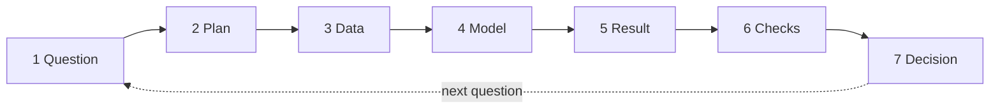
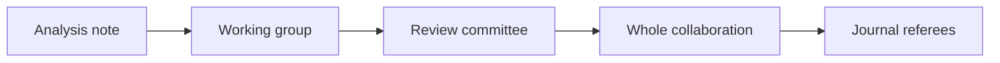

# Dr. Mindaugas Šarpis

# Best Research and Data Analysis Practices from CERN

## Concepts of Data Analysis

##### <span class="aims-badge">♻️ reproducibility · 📁 data & files</span>

<!--
Speaker: the course so far taught tools. This lecture looks back at two results
the room has produced, g from the pendulum and the mass peak in the LHCb file,
and asks what they are worth. Then what stands around an analysis: other
people, rules, plans, personal data, AI tools. (~1 min)
-->

---
hideInToc: true
layout: quote
---

# The first principle is that you must not fool yourself — and you are the **easiest person to fool**.
Richard Feynman — *Cargo Cult Science*, Caltech commencement address, 1974

---
hideInToc: true
---

# Learning **Objectives**

<div class="note-text mt-sm">By the end of this lecture, you will be able to:</div>

<div class="stack-tight mt-sm">

<div class="card card-primary card-glass pad-compact">

🎯 State an analysis as a **question**, **evidence with its uncertainty** and a **decision**

</div>

<div class="card card-secondary card-glass pad-compact">

🔁 Walk the **loop** from question to decision, on the pendulum and on the D⁰ peak

</div>

<div class="card card-warning card-glass pad-compact">

⚠️ Name three ways an analysis goes wrong **without a bug**, and the defence against each

</div>

<div class="card card-accent card-glass pad-compact">

👓 **Review** another person's analysis with a checklist, and say who is an **author**

</div>

<div class="card card-info card-glass pad-compact">

📋 Write a one-page **data management plan**

</div>

<div class="card card-success card-glass pad-compact">

🔒 Tell **personal data** from other data, and name the duties that come with it

</div>

<div class="card card-primary card-glass pad-compact">

🤖 Use an **AI tool** in an analysis: what to verify, what to disclose, what never to paste

</div>

</div>

---
layout: section
hideInToc: true
---

# What an Analysis **Is**

<!--
Speaker: start from the two numbers the room already has. Nothing new is
computed in this section. The question is what makes a number a result. (~1 min)
-->

---
hideInToc: true
---

# Two Results of **This Course**


<div class="card card-info card-glass pad-compact mt-md">

Nine rows gave **g = 9.84 ± 0.09 m/s²**. 91&nbsp;583 rows gave a peak at **1864.47 ± 0.10 MeV/c²**. Both came from files in the project folder, by scripts that can be run again. This lecture asks what such a number is worth, and what stands around it: other people, rules, plans.

</div>

<!--
Speaker: both fits are the ones of Lecture 10. Left: T squared against the length,
the slope is 4 pi squared over g. Right: the mass column in 2 MeV bins, a Gaussian
on a straight line. Ask who still has both numbers in their own report. (~2 min)
-->

---
hideInToc: true
---

# An Analysis Has **Three Parts**

<div class="grid-3 mt-md gap-md">

<div class="card card-primary card-glass pad-compact">

## ❓ **A question**

Fixed before the data is looked at, and answerable with a number.

- *Is g in this room the textbook 9.81 m/s²?*
- *At what mass does the K⁻π⁺ spectrum peak?*

</div>

<div class="card card-secondary card-glass pad-compact">

## 📏 **Evidence**

A number from data, with its uncertainty, by a method that someone else can repeat.

- 9.84 ± 0.09 m/s²
- 1864.47 ± 0.10 MeV/c²

</div>

<div class="card card-accent card-glass pad-compact">

## ✅ **A decision**

What follows from the answer, and for whom.

- The setup measures g to 0.9 %
- The peak is the D⁰. The file is fit for exercises in fitting

</div>

</div>

<div class="card card-warning card-glass pad-compact mt-md">

A plot without a question is a picture. A number without an uncertainty cannot be compared with anything. A result that nobody can check or act on changes nothing.

</div>

---
hideInToc: true
---

# The Uncertainty **Decides**


<div class="grid-2 mt-md gap-md">

<div class="card card-primary card-glass pad-compact">

## 📐 **The distance in units of σ**

$$z = \frac{g - 9.81}{\sigma}$$

One value, 9.845, with three different uncertainties.

</div>

<div class="card card-secondary card-glass pad-compact">

## 🎯 **Three verdicts**

- ± 0.005: 6.9σ. A discrepancy that has to be explained
- ± 0.09: 0.4σ. Agreement
- ± 0.3: agreement with everything from 9.5 to 10.1. The measurement tests nothing

</div>

</div>

<div class="note-text mt-sm">The digits follow the uncertainty: 9.845 ± 0.005, 9.84 ± 0.09, 9.8 ± 0.3.</div>

<!--
Speaker: cover the right-hand side and ask for the verdict in each row. The
value never changes. Only the middle row is what the nine rows give. (~2 min)
-->

---
hideInToc: true
---

# Comparing **Two Numbers**

<div class="grid-2 mt-md gap-md">

<div class="card card-primary card-glass pad-compact table-compact">

## 📐 **Both uncertainties count**

$$z = \frac{|a - b|}{\sqrt{\sigma_a^2 + \sigma_b^2}}$$

| A distance beyond | happens by chance in |
| --- | --- |
| 1σ | 32 % of cases, 1 in 3 |
| 2σ | 4.6 %, 1 in 22 |
| 3σ | 0.27 %, 1 in 370 |

</div>

<div class="card card-secondary card-glass pad-compact">

## ⚛️ **The peak and the world average**

- This course: 1864.47 ± 0.10 MeV/c²
- Particle Data Group, D⁰ mass: 1864.84 ± 0.05 MeV/c²
- Difference: 0.37
- Combined uncertainty: √(0.096² + 0.05²) = 0.108
- z = 3.4

</div>

</div>

<div class="card card-warning card-glass pad-compact mt-md">

A distance of 3.4σ happens by chance less than once in 1000 cases. Has this course found that the D⁰ mass is wrong?

</div>

<!--
Speaker: the table is the Gaussian of Lecture 09. Let the question stand for a
moment before the next slide. Most rooms split between "yes" and "we made a
mistake". Both miss the third reading. (~2 min)
-->

---
hideInToc: true
---

# Two Kinds of **Uncertainty**

<div class="grid-2 mt-sm gap-md">

<div class="card card-primary card-glass pad-compact">

## 🎲 **Statistical**

Scatter from one reading to the next. It falls as 1/√N: four times the data, half the uncertainty. The ± 0.09 of g and the ± 0.10 of the peak are statistical.

</div>

<div class="card card-secondary card-glass pad-compact">

## 🧲 **Systematic**

An error that moves all readings the same way. More data does not reduce it. A swing of amplitude θ₀ has the period T₀(1 + θ₀²/16). At 10° every period is 0.19 % too long, and g comes out 0.037 m/s² low.

</div>

</div>


<div class="note-text mt-sm">With nine rows the statistical part is the larger one. From about 50 rows on the swing angle is, and no number of rows brings the total below 0.037.</div>

<!--
Speaker: the formula with theta squared over 16 is the first correction to the
small-angle period. It is stated, not derived. The point is the shape of the
figure: one line falls, the other does not. (~3 min)
-->

---
hideInToc: true
---

# 3.4σ and **No Discovery**

<div class="grid-2 mt-md gap-md">

<div class="card card-primary card-glass pad-compact">

## 🔍 **What the ± 0.10 covers**

How well 84&nbsp;680 candidates fix the centre of the peak. Nothing else.

The mass is computed from measured momenta. If the detector reads every momentum 0.02 % too low, the peak moves down by 0.37 MeV/c²: the whole difference.

</div>

<div class="card card-secondary card-glass pad-compact">

## 📄 **What the file says about the scale**

Nothing. Neither the file nor record 401 gives the uncertainty of the momentum scale.

So the 3.4σ counts the statistical part only. The systematic part is unknown, and may be larger.

</div>

</div>

<div class="card card-success card-glass pad-compact mt-md">

The honest statement: *the peak lies 0.37 MeV/c² (0.02 %) below the world average; the systematic uncertainty of the mass scale is not known.* A result is value ± statistical ± systematic.

</div>

<!--
Speaker: the 0.02 % is arithmetic, not a statement about LHCb: for fast decay
products the mass shifts by the scale error times about 1724 MeV. Published
mass measurements spend most of their pages on exactly this number. (~2 min)
-->

---
hideInToc: true
---

# Four Kinds of **Question**

| | **Asks** | **Pendulum** | **LHCb file** |
| --- | --- | --- | --- |
| **Describe** | What is in the data? | T grows from 0.90 s to 2.00 s | A peak near 1865 on a flat background |
| **Explain** | Why? | T² is proportional to ℓ | The peak is a particle, the D⁰ |
| **Predict** | What will new data show? | ℓ = 1.5 m gives T = 2.45 s | Four times the rows: ± 0.05 |
| **Decide** | What should be done? | Keep the swing under 5° | Which rows to keep |

<div class="card card-info card-glass pad-compact mt-md">

Each row needs more than the one above it: an honest summary, then the other explanations ruled out, then a test on data not used before, then the cost of being wrong. An analysis goes wrong when it answers one kind of question and claims another.

</div>

---
layout: section
hideInToc: true
---

# From Question to **Decision**

<!--
Speaker: seven steps, each taken for the pendulum and for the LHCb file. Every
number on these slides has been on the room's own screens before. (~1 min)
-->

---
hideInToc: true
---

# The **Loop**



<div class="grid-2 mt-md gap-md">

<div class="card card-primary card-glass pad-compact">

## 🔁 **It follows the question**

Lecture 02 followed the data, from collecting to sharing. This loop follows the question. The data is one of its seven stations.

</div>

<div class="card card-secondary card-glass pad-compact">

## ⏱️ **The order is the method**

The plan is written before the data is looked at. The checks are done before the decision is taken.

</div>

</div>

---
hideInToc: true
---

# 1 · The **Question**

<div class="grid-2 mt-md gap-md">

<div class="card card-primary card-glass pad-compact">

## 🧵 **Pendulum**

Vague: *Does the pendulum work?*

Sharp: *What is g from the periods of nine lengths, and does it lie within 2σ of 9.81 m/s²?*

</div>

<div class="card card-secondary card-glass pad-compact">

## ⚛️ **LHCb file**

Vague: *What is in the file?*

Sharp: *At what mass is the peak of the column M, how wide is it, and how many candidates does it hold?*

</div>

</div>

<div class="card card-info card-glass pad-compact mt-md">

A question is ready when it names the quantity, the comparison, and what will count as an answer. It goes into `README.md` before the first plot. A commit records the date (Lecture 05).

</div>

---
hideInToc: true
---

# 2 · The **Plan**

<div class="grid-2 mt-md gap-md">

<div class="card card-primary card-glass pad-compact">

## 📐 **How precise can one row be?**

From g = 4π²ℓ/T² and the propagation rule of Lecture 09:

$$\frac{\sigma_g}{g} = \sqrt{\left(\frac{\sigma_\ell}{\ell}\right)^2 + \left(\frac{2\,\sigma_T}{T}\right)^2}$$

With 0.5 cm on the length and 0.1 s on the stopwatch.

</div>

<div class="card card-secondary card-glass pad-compact table-compact">

## 🧮 **Three ways to take one row**

| | Length | Timing | g |
| --- | --- | --- | --- |
| 20 cm, 10 swings | 2.5 % | 2.2 % | 3.3 % |
| 100 cm, 10 swings | 0.5 % | 1.0 % | 1.1 % |
| 100 cm, 1 swing | 0.5 % | 10 % | 10 % |

</div>

</div>

<div class="card card-info card-glass pad-compact mt-md">

Decided before anything is measured: time ten swings and not one, prefer long strings, take several lengths. For the file the plan is the window (1820 to 1910 MeV/c²), the bin width (2 MeV/c²) and the model.

</div>

<!--
Speaker: ten swings divide the stopwatch error by ten. That is the whole reason
the table has a column t10 and not T. A plan is an analysis done on paper with
the numbers one expects. (~3 min)
-->

---
hideInToc: true
---

# 3 · The **Data**

<div class="grid-2 mt-md gap-md">

<div class="card card-primary card-glass pad-compact">

## 🧵 **Pendulum**

- `pendulum_raw.csv`, from a lab partner: semicolons, decimal commas, a row number, a line with the mean
- Cleaned by hand in Lecture 02 and by script in Lecture 12
- Nine rows. None was removed for its value

</div>

<div class="card card-secondary card-glass pad-compact">

## ⚛️ **LHCb file**

- Record 401 of the CERN Open Data Portal, licence CC0
- 91&nbsp;583 rows. 49 carry `TAU = -100`, the mark for a missing value
- 84&nbsp;680 rows fall into the fit window

</div>

</div>

<div class="card card-warning card-glass pad-compact mt-md">

What was done to the data is part of the result: Lecture 12 showed how a table is audited and cleaned. One thing no cleaning shows: the experiment chose these rows before the file was made.

</div>

---
hideInToc: true
---

# 4 · The **Model**

<div class="grid-2 mt-md gap-md">

<div class="card card-primary card-glass pad-compact">

## 🧵 **Pendulum**

$$T^2 = \frac{4\pi^2}{g}\,\ell + b$$

The intercept b allows for a length measured to the wrong point of the bob. The fit gives b = 0.009 ± 0.019 s², an offset of 0.2 ± 0.5 cm: none is seen. Without b the result would be 9.81 ± 0.04. The smaller uncertainty would rest on an assumption.

</div>

<div class="card card-secondary card-glass pad-compact">

## ⚛️ **LHCb file**

A Gaussian on a straight line, five parameters.

Gaussian, because the detector smears a sharp mass. The width of 7.65 MeV/c² belongs to the detector, not to the particle.

χ² = 53.4 for 40 degrees of freedom: acceptable, not perfect.

</div>

</div>

<div class="card card-info card-glass pad-compact mt-md">

A model is a choice. It is stated with its reason, and it is chosen before the result is known.

</div>

---
hideInToc: true
---

# 5 · The **Result**

```md
g = 9.84 ± 0.09 m/s² (statistical), from a straight-line fit of T² against ℓ
for nine lengths, with 0.1 s on each time of ten swings.

The K⁻π⁺ mass peak is at 1864.47 ± 0.10 MeV/c² (statistical), with a width
of 7.65 ± 0.10 MeV/c² and 20 990 ± 280 candidates.
```

<div class="grid-2 mt-md gap-md">

<div class="card card-success card-glass pad-compact">

## ✅ **A result carries**

- value, uncertainty and unit
- what kind of uncertainty it is
- the method, in one line
- digits that follow the uncertainty

</div>

<div class="card card-warning card-glass pad-compact">

## ❌ **Not a result**

- `g = 9.844546787796224`: digits without meaning
- `g = 9.84`: no uncertainty
- `g ≈ 9.8, as expected`: a verdict in place of a number

</div>

</div>

---
hideInToc: true
---

# 6 · The **Checks**


<div class="grid-2 mt-md gap-md">

<div class="card card-primary card-glass pad-compact">

## 🧵 **The pendulum, five ways**

With and without the intercept, row by row, the short strings alone, the long ones alone. All five agree within their uncertainties.

</div>

<div class="card card-secondary card-glass pad-compact">

## ⚛️ **The peak**

First half of the file: 1864.51 ± 0.14. Second half: 1864.43 ± 0.14. Bins of 1 and 3 MeV/c², a wider and a narrower window: the peak moves by less than 0.03.

</div>

</div>

<div class="note-text mt-sm">A check is another way to the same number that could have failed. The list of checks is written before the result is known.</div>

---
hideInToc: true
---

# 7 · The **Decision**

<div class="grid-2 mt-md gap-md">

<div class="card card-primary card-glass pad-compact">

## 🧵 **Pendulum**

9.84 ± 0.09 agrees with 9.81, at 0.4σ. The setup measures g to 0.9 %. It cannot tell the pole (9.83) from the equator (9.78).

**Next question:** what would reach ± 0.01? The same setup needs 730 lengths, and a 10° swing leaves 0.037 whatever their number. So: swings under 5°, and an electronic timer.

</div>

<div class="card card-secondary card-glass pad-compact">

## ⚛️ **LHCb file**

The peak sits 0.02 % below the world average of the D⁰ mass. It is the D⁰. The file is fit for exercises in fitting and selection. It is not fit for a measurement of the mass: the systematic uncertainty is unknown.

**Next question:** how well is the momentum scale of the detector known?

</div>

</div>

<div class="card card-success card-glass pad-compact mt-md">

Each decision raises the next question, and the loop starts again.

</div>

<!--
Speaker: 730 is 9 times (0.09 / 0.01) squared. Under 5 degrees the swing
contributes 0.009. Both numbers come from the two slides on uncertainty. (~2 min)
-->

---
layout: section
hideInToc: true
---

# How Analyses Go **Wrong**

<!--
Speaker: three ways, each shown on the room's own files. None of them needs a
programming error or bad intent. (~1 min)
-->

---
hideInToc: true
---

# No Bug **Needed**

<div class="card card-info card-glass pad-compact mt-sm">

In every case of this section the data is real, the code is correct and the analyst is honest. The result is wrong all the same. What went wrong is the order in which things were done.

</div>

<div class="grid-3 mt-md gap-md">

<div class="card card-primary card-glass pad-compact">

## 👀 **Looking until something shows**

Many looks at noise, and a report on the one look that stood out.

</div>

<div class="card card-secondary card-glass pad-compact">

## ✂️ **Choosing the data after the result**

Rows or thresholds picked once it is known what they do to the answer.

</div>

<div class="card card-accent card-glass pad-compact">

## 🔗 **Reading a correlation as a cause**

Two columns move together, and one is declared the reason for the other.

</div>

</div>

---
hideInToc: true
---

# One Look, **Twenty Looks**

<div class="grid-2 mt-md gap-md">

<div>

<div class="card card-primary card-glass pad-compact">

## 🎲 **Suppose nothing is there**

- One look: a result beyond 2σ with probability 0.05
- $k$ independent looks all stay quiet: $0.95^k$
- At least one alarm: $1 - 0.95^k$
- Twenty looks: $1 - 0.95^{20} = 0.64$

</div>

<div class="card card-secondary card-glass pad-compact mt-md">

## 🖥️ **Checked by simulation**

10&nbsp;000 runs of 20 looks at pure noise: 64.5 % of the runs had an alarm.

</div>

</div>

<div>


</div>

</div>

<div class="note-text mt-sm">A look is anything that could have produced a finding: another column, another subgroup, another threshold, another bin width, another week of data.</div>

<!--
Speaker: derive it on the board. The room knows from Lecture 09 that 95 % of a
Gaussian lies within 1.96 sigma, called 2 sigma here. The only new step is
multiplying 0.95 by itself. (~3 min)
-->

---
hideInToc: true
---

# Twenty Groups, **Drawn by Lot**


<div class="grid-2 mt-md gap-md">

<div class="card card-primary card-glass pad-compact">

## ⚛️ **The LHCb file, split at random**

Every row gets a number from 1 to 20 from a random generator. The peak is fitted in each group. Group 8 lies 2.6σ below the rest, group 3 lies 2.0σ above. Nothing sets these rows apart. The lot did it.

</div>

<div class="card card-secondary card-glass pad-compact">

## 💊 **The same in a hospital**

ISIS-2 (1988): aspirin after a heart attack, 17&nbsp;187 patients. It worked. Split by star sign, it did not work for Gemini and Libra. The authors printed this as a warning against subgroup findings.

</div>

</div>

<!--
Speaker: seed 14, chosen before the figure was made. With twenty groups one
expects one beyond 2 sigma. A report on "group 8" would be a report on the
random generator. (~2 min)
-->

---
hideInToc: true
---

# Stopping When It **Looks Good**


<div class="card card-primary card-glass pad-compact mt-md">

The true g is 9.81. Each timing gives one value. An analyst tests after every timing, from the 5th to the 100th, and stops at the first result beyond 2σ. Of 10&nbsp;000 simulated analysts, **30.9 %** stop with a discrepancy. Of those who test once, at the 100th timing, **4.7 %** find one.

</div>

<div class="note-text mt-sm">The number of measurements is fixed before the first one. So is the moment of the test.</div>

<!--
Speaker: the red lines are three analysts who stopped. The faint continuation
shows where each would have gone: two of the three come back inside. The grey
ones never crossed. (~2 min)
-->

---
hideInToc: true
---

# A Bump at **750 GeV**

<div class="grid-2 mt-md gap-md">

<div class="card card-primary card-glass pad-compact">

## 📈 **December 2015**

ATLAS and CMS show their first data at 13 TeV. Both see more pairs of photons than expected near a mass of 750 GeV.

ATLAS: 3.9σ at that mass. Counting every mass and width at which a bump could have appeared: 2.1σ.

</div>

<div class="card card-secondary card-glass pad-compact">

## 📉 **August 2016**

Several hundred theory papers have explained the new particle.

Both experiments show about four times more data. The excess is gone.

</div>

</div>

<div class="card card-info card-glass pad-compact mt-md">

The 3.9σ is the **local** significance: one look. The 2.1σ is the **global** one: all the looks that were taken. Particle physics reports both, and asks for 5σ before it writes *observed*.

</div>

<!--
Speaker: nobody did anything wrong here. Both collaborations reported the
global number from the first day. The lesson is why the threshold is 5 sigma
and why there are two experiments. (~2 min)
-->

---
hideInToc: true
---

# Dropping **Two Rows**


<div class="card card-primary card-glass pad-compact mt-md">

All nine rows give 9.84 ± 0.09. Suppose two rows "look wrong" and are dropped. There are 36 ways to drop two of nine, and g then lies between 9.76 and 9.91. An analyst who expects 9.81 drops 20 and 80 cm and writes *in excellent agreement*. Their pulls were 0.1 and −0.4: nothing was wrong with them.

</div>

<div class="note-text mt-sm">A row is removed for a reason that was written down before the result was known.</div>

---
hideInToc: true
---

# 120 Ways to **Select Rows**


<div class="card card-primary card-glass pad-compact mt-md">

Three thresholds on the LHCb file, each one reasonable: PT above a value, IPCHI2 below, TAU above. 6 × 5 × 4 = 120 selections. The peak moves from 1864.22 to 1864.65. Against the world average that is anything from 5.3σ, *a discrepancy*, to 1.2σ, *agreement*. Each of the 120 can be defended afterwards.

</div>

<div class="note-text mt-sm">The spread of 0.44 is four times the statistical uncertainty: a systematic effect to be understood, not a menu.</div>

<!--
Speaker: a threshold is a mask, as in Lecture 07. The trend is real: a higher
PT threshold lowers the peak. That is physics of the detector, and exactly the
kind of thing a selection chosen after the fact hides. (~3 min)
-->

---
hideInToc: true
---

# Decide Before You **Look**

<div class="grid-2 mt-md gap-md">

<div class="card card-primary card-glass pad-compact">

## 📝 **Write it down first**

Question, rows, model, number of measurements, checks: in the README, committed before the data is opened. The commit carries the date.

</div>

<div class="card card-secondary card-glass pad-compact">

## 🙈 **Blind analysis**

LHC experiments hide the region where the signal would be until the selection and the fit are fixed and reviewed. Only then is it opened.

</div>

<div class="card card-accent card-glass pad-compact">

## 🔢 **Count the looks**

Report how many selections, groups and columns were tried, not only the one that stood out. With many looks, 2σ is expected.

</div>

<div class="card card-warning card-glass pad-compact">

## ⚖️ **Check both ways**

A surprising result is checked until an error turns up. A welcome one is not checked. Both habits pull the result towards what was expected.

</div>

</div>

<div class="note-text mt-sm">Medicine has the same rule: a clinical trial is registered, with what it will measure, before the first patient. Leading journals have required this since 2005.</div>

<!--
Speaker: Feynman's example for "check both ways", from the address quoted at
the start: after Millikan, measured values of the electron charge crept towards
the right one over years. Each group checked harder when its number was far
from Millikan's. (~3 min)
-->

---
hideInToc: true
---

# Two Columns That **Move Together**

<div class="grid-2 mt-md gap-md">

<div>


</div>

<div>

<div class="card card-primary card-glass pad-compact">

## ⚛️ **In the LHCb file**

A longer decay time goes with a larger IPCHI2: the candidate points back to the collision less well. The rank correlation is 0.40 over 91&nbsp;534 rows.

</div>

<div class="card card-secondary card-glass pad-compact mt-md">

## 🤔 **Two readings**

1. A long flight spoils the pointing
2. Something else produces both. Here something does: a D⁰ born in the decay of a heavier particle starts away from the collision. Its decay time, counted from the collision, comes out too long, and it does not point back

</div>

</div>

</div>

<div class="note-text mt-sm">The two columns cannot tell the readings apart. Knowledge of how the data came to be can.</div>

<!--
Speaker: rank correlation is the correlation of Lecture 09 computed on the
positions of the rows when sorted by each column. It is used here because both
columns have long tails. (~2 min)
-->

---
hideInToc: true
---

# The Table That **Reverses**

| **Success** | **A** · open surgery | **B** · through the skin |
| --- | --- | --- |
| Small stones | 81 of 87 · **93 %** | 234 of 270 · 87 % |
| Large stones | 192 of 263 · **73 %** | 55 of 80 · 69 % |
| All patients | 273 of 350 · 78 % | 289 of 350 · **83 %** |

<div class="card card-primary card-glass pad-compact mt-md">

Two treatments for kidney stones (Charig and colleagues, *BMJ*, 1986). A is better for small stones and better for large stones. B is better overall. Doctors gave A to the hard cases: 263 of its 350 patients had large stones, against 80 of 350 for B. The size of the stone drives both the choice of treatment and the outcome.

</div>

<div class="note-text mt-sm">A third quantity that drives both columns is a <strong>common cause</strong>. The reversal is known as Simpson's paradox.</div>

<!--
Speaker: let the room check one row of percentages by hand. Then ask which
treatment they would choose. (~3 min)
-->

---
hideInToc: true
---

# What Allows the Word **Cause**

<div class="grid-2 mt-md gap-md">

<div class="card card-success card-glass pad-compact">

## 🔧 **An experiment**

With the pendulum the length was set by hand, and nothing else was changed. The period followed. *The length determines the period* is allowed.

</div>

<div class="card card-warning card-glass pad-compact">

## 👁️ **An observation**

In the LHCb file and in the hospital records nobody set anything. The rows are what happened, and what was kept.

</div>

</div>

<div class="card card-primary card-glass pad-compact mt-md">

Before a correlation is read as a cause, three other readings are ruled out:

- **Chance**: how many pairs of columns were tried?
- **A common cause**: the size of the stone, the origin of the D⁰
- **Selection**: the rows were kept in a way that depends on both columns

</div>

<div class="note-text mt-sm">Where an experiment is possible, a coin decides who gets which treatment. Then nothing can drive both the choice and the outcome.</div>

---
layout: section
hideInToc: true
---

# Working with **Others**

<!--
Speaker: everything in the last section is easier to see in someone else's
work than in one's own. That is the reason for review. (~1 min)
-->

---
hideInToc: true
---

# What the Author **Cannot See**

<div class="grid-2 mt-md gap-md">

<div class="card card-primary card-glass pad-compact">

## ✍️ **The author**

- knows what the script was meant to do
- has every file in the right place, on one laptop
- has read the report ten times, and reads what was meant

</div>

<div class="card card-secondary card-glass pad-compact">

## 👓 **A second person finds**

- a step that exists only in the author's head: the README does not rebuild the result
- an assumption that was never written down
- a sentence that claims more than the number supports
- a choice made after the result was known

</div>

</div>

<div class="card card-info card-glass pad-compact mt-md">

A review is not an examination of the author. It tests whether the work stands without the author in the room.

</div>

---
hideInToc: true
---

# A Result at an **LHC Experiment**



<div class="grid-3 mt-md gap-md">

<div class="card card-primary card-glass pad-compact">

## 📄 **The note**

Every selection, fit, check and number, written down, with the code.

</div>

<div class="card card-secondary card-glass pad-compact">

## 👥 **Three rounds inside**

The working group. A few appointed members who did not do the analysis. Then every member of the collaboration may comment.

</div>

<div class="card card-accent card-glass pad-compact">

## 📰 **Then outside**

The referees of the journal come last. From the first note to the paper: many months, often more than a year.

</div>

</div>

<div class="note-text mt-sm">The names of the stages differ between ATLAS, CMS, LHCb and ALICE. The order does not. In a blind analysis the signal region is opened only after the method has passed review.</div>

---
hideInToc: true
---

# Review and **Repetition**

<div class="grid-2 mt-md gap-md">

<div class="card card-primary card-glass pad-compact">

## 🔍 **Review**

Someone reads the analysis and runs it again. It finds what is wrong in the work as it stands.

</div>

<div class="card card-secondary card-glass pad-compact">

## 🔁 **Independent analysis**

Someone does it again from the raw data, with other code. It finds what no reader can: an error that sits in the script itself. ATLAS and CMS exist as a pair for this reason (Lecture 02).

</div>

</div>

<div class="card card-accent card-glass pad-compact mt-md">

## 🧵 **OPERA, 2011**

Neutrinos sent from CERN to Gran Sasso, 730 km away, arrived 60 ns earlier than light would. The collaboration published the number and asked others to check it. In 2012 a loose fibre-optic connector was found in the timing system.

</div>

---
hideInToc: true
---

# A Review **Checklist**

<div class="grid-2 mt-md gap-md">

<div class="card card-primary card-glass pad-compact">

## 🔨 **Rebuild**

1. Does the README say where the data came from?
2. Does one command rebuild every number and figure on my laptop?
3. Do the rebuilt numbers equal those in the report?

</div>

<div class="card card-secondary card-glass pad-compact">

## 🗂️ **Data**

4. Is `data/raw` untouched?
5. Is every removed or changed row listed, with a reason?
6. Are the columns and their units written down?

</div>

<div class="card card-accent card-glass pad-compact">

## 📐 **Method**

7. Is the question stated, and was it fixed before the result?
8. Does every result have an uncertainty, and is its kind named?
9. Is there a check that could have failed?

</div>

<div class="card card-info card-glass pad-compact">

## 📄 **Report**

10. Do the figures have axis labels with units?
11. Does the conclusion claim no more than the numbers support?
12. Are sources, data and tools named?

</div>

</div>

<!--
Speaker: twelve questions, each answered with yes, no or "could not tell".
Questions 2 and 3 take the most time and find the most. (~2 min)
-->

---
hideInToc: true
---

# A Report, **Reviewed**

<div class="grid-2 mt-md gap-md">

<div class="card card-warning card-glass pad-compact">

## 📄 **`results/report.md`**

```md
## Result

The rows at 20 cm and 80 cm were
outliers and were removed.

g = 9.81 m/s², in excellent
agreement with the expected value.
```

</div>

<div class="card card-primary card-glass pad-compact">

## 👓 **The review**

1. **Must fix.** I ran `scripts/fit_g.py`: 9.84 ± 0.09, from all nine rows. The script removes no row. The 9.81 cannot be rebuilt
2. **Must fix.** The pulls of the two rows are 0.1 and −0.4. The largest in the table is −0.9. Why are they outliers?
3. **Must fix.** No uncertainty. With seven rows I get ± 0.12
4. **Question.** *Excellent agreement*, at ± 0.12?

</div>

</div>

<div class="card card-info card-glass pad-compact mt-md">

Four comments. Each says what was run and what came out, and the author can act on every one of them.

</div>

---
hideInToc: true
---

# Writing a Review, **Answering One**

<div class="grid-2 mt-md gap-md">

<div class="card card-primary card-glass pad-compact">

## ✏️ **The reviewer**

- says what was run, on which system, and what came out
- points to the place: file, line, figure
- marks each comment: must fix, suggestion, question
- writes about the work, never about the person

</div>

<div class="card card-secondary card-glass pad-compact">

## 💬 **The author**

- answers every comment: changed, with the commit, or not changed, with the reason
- does not answer with rank or experience
- thanks the reviewer. The time was a gift

</div>

</div>

<div class="card card-info card-glass pad-compact mt-md">

Where: as comments on a pull request, or in a file `review.md` next to the report. Either way the review stays with the project.

</div>

---
hideInToc: true
---

# A **Decision Log**

<div class="grid-2 mt-md gap-md">

<div class="card card-primary card-glass pad-compact">

## 📓 **`DECISIONS.md`**

```text
2026-11-24  Line with intercept.
  Why: length to the bob uncertain.
  Through the origin: 9.81 ± 0.04.
2026-11-24  All nine rows kept.
2026-12-02  Mass fit: 1820 to 1910,
  2 MeV bins. Bins of 1 and 3 MeV
  move the peak by < 0.03.
```

</div>

<div class="card card-secondary card-glass pad-compact">

## 🧭 **Why keep one**

The code records what was done. Nothing records why, or what else was tried, unless someone writes it down.

One line per decision: the date, the decision, the reason, what the alternative gave.

With several people: one name for each dataset and each script.

</div>

</div>

<div class="card card-info card-glass pad-compact mt-md">

The log makes *decide before you look* checkable: the entry is older than the result.

</div>

---
layout: section
hideInToc: true
---

# Research **Integrity**

<!--
Speaker: from good practice to rules. The rules are short. Most of the section
is about the wide space between a mistake and a lie. (~1 min)
-->

---
hideInToc: true
---

# Four **Principles**

<div class="card card-info card-glass pad-compact mt-sm">

The *European Code of Conduct for Research Integrity* (ALLEA, revised 2023) rests on four principles. Horizon Europe grants bind their holders to it. Universities have codes of their own: read yours.

</div>

<div class="grid-2 mt-md gap-md">

<div class="card card-primary card-glass pad-compact">

## 🧱 **Reliability**

Quality in design, method and analysis. *Someone else can rebuild the result.*

</div>

<div class="card card-secondary card-glass pad-compact">

## 🪞 **Honesty**

In doing, reviewing and reporting research. *All rows, all looks and all checks are reported.*

</div>

<div class="card card-accent card-glass pad-compact">

## 🤝 **Respect**

For colleagues, participants, society and the environment. *Credit is given. Personal data is protected.*

</div>

<div class="card card-success card-glass pad-compact">

## 🖊️ **Accountability**

From the idea to the publication. *Your name stands for every number.*

</div>

</div>

---
hideInToc: true
---

# Three Kinds of **Misconduct**

<div class="grid-3 mt-md gap-md">

<div class="card card-warning card-glass pad-compact">

## 🧪 **Fabrication**

Making up data or results.

*A tenth row typed into `pendulum.csv` that was never measured.*

</div>

<div class="card card-warning card-glass pad-compact">

## ✂️ **Falsification**

Changing or leaving out data or results without saying so.

*Two rows dropped, and a report that speaks of nine.*

</div>

<div class="card card-warning card-glass pad-compact">

## 📋 **Plagiarism**

Another person's work, words, code or data used without credit.

*A neighbour's script handed in under your name.*

</div>

</div>

<div class="card card-info card-glass pad-compact mt-md">

An honest mistake is not misconduct. Hiding one is. Between the two lie the practices of the last section: nobody lied, and the result is still wrong.

</div>

---
hideInToc: true
---

# When a Mistake Is **Found**

<div class="card card-accent card-glass pad-compact mt-sm">

## 🧬 **Five papers, one sign**

In 2006 the group of Geoffrey Chang found that a home-written program had flipped a sign in their data. The protein structures built on it were wrong. Within months the group retracted five papers, three of them in *Science*. The error came to light when another group's structure disagreed.

</div>

<div class="grid-2 mt-md gap-md">

<div class="card card-primary card-glass pad-compact">

## 📝 **Before publication**

Fix it, note it in the decision log, and run everything again with one command (Lecture 13).

</div>

<div class="card card-secondary card-glass pad-compact">

## 📰 **After publication**

Correct the record. An *erratum* when the conclusion stands. A *retraction* when it does not.

</div>

</div>

<div class="note-text mt-sm">An analysis that is used long enough turns out to contain a mistake. What is judged is what happens next.</div>

---
hideInToc: true
---

# Who Is an **Author**

<div class="grid-2 mt-md gap-md">

<div class="card card-primary card-glass pad-compact">

## ✅ **Four conditions, all of them**

1. A substantial contribution to the design of the work, or to obtaining, analysing or interpreting the data
2. Writing the text, or revising it critically
3. Approval of the final version
4. Agreement to answer for all of it

</div>

<div class="card card-secondary card-glass pad-compact">

## 🙏 **Everyone else is thanked**

Lending the stopwatch, paying for the string, reading the draft: these go into the acknowledgements.

</div>

</div>

<div class="card card-info card-glass pad-compact mt-md">

These are the conditions of the medical journal editors (ICMJE). Many other journals follow them. Fields differ: in particle physics every member of a collaboration signs, in alphabetical order. The 2015 paper of ATLAS and CMS on the Higgs mass has 5&nbsp;154 authors.

</div>

---
hideInToc: true
---

# Authorship: **Roles and Problems**

<div class="grid-2 mt-md gap-md">

<div class="card card-primary card-glass pad-compact">

## 🧩 **Say who did what**

Many journals print a contribution statement. The CRediT list names 14 roles, among them data curation, formal analysis, software, validation and writing.

*A. B.: measurement, data curation. C. D.: software, formal analysis, figures. Both: writing.*

</div>

<div class="card card-warning card-glass pad-compact">

## ⚠️ **Three problems**

- **Gift authorship**: a name without a contribution
- **Ghost authorship**: a contribution without a name
- **Order**: in some fields the first author did the work and the last one led the group. In others the order is alphabetical

</div>

</div>

<div class="card card-info card-glass pad-compact mt-md">

Agree on the authors and their order when the work starts, not when the paper is written. An AI tool cannot be an author: it cannot answer for the work.

</div>

---
layout: section
hideInToc: true
---

# The Data Management **Plan**

<!--
Speaker: a short section on a short document. The room already keeps most of
what a plan asks for: a README, a raw folder, a backup. (~1 min)
-->

---
hideInToc: true
---

# What It Is and **Who Asks**

<div class="card card-info card-glass pad-compact mt-sm">

A **data management plan** is a short document, written at the start of a project and updated on the way. It says what data there will be and what happens to it, during the project and after.

</div>

<div class="grid-3 mt-md gap-md">

<div class="card card-primary card-glass pad-compact">

## 🇪🇺 **Funders**

Horizon Europe: every project that produces or reuses data, normally within six months. The US National Institutes of Health: with every application since 2023. National funders: read the call.

</div>

<div class="card card-secondary card-glass pad-compact">

## 🎓 **Universities**

Many ask doctoral students for one. The rule differs from place to place.

</div>

<div class="card card-accent card-glass pad-compact">

## 📰 **Journals**

They ask for the outcome: a statement of where the data is.

</div>

</div>

<div class="card card-warning card-glass pad-compact mt-md">

And when nobody asks? Vines and colleagues (2014) requested the data behind 516 papers. For every year since publication, the odds that the data still existed fell by 17 %.

</div>

---
hideInToc: true
---

# Six **Headings**

| | **Heading** | **It answers** |
| --- | --- | --- |
| 1 | Data description | Which data, in which format, how much? New or reused? |
| 2 | Documentation and quality | What does a stranger need in order to understand it? |
| 3 | Storage and backup | Where does it live during the project? Who can reach it? |
| 4 | Legal and ethical questions | Whose data is it? Can a person be identified? Which licence? |
| 5 | Sharing and preservation | What is published, where and when? How long is it kept? |
| 6 | Responsibilities and resources | Who does all this, and what does it cost? |

<div class="note-text mt-md">The core requirements of Science Europe, used by many European funders. A funder's own template may order them differently. The FAIR principles of Lecture 13 say what the data should be at the end. The plan says how it gets there.</div>

---
hideInToc: true
---

# A Plan on **One Page**

```text
1 Data       pendulum.csv: 9 rows, own measurement, 97 bytes
             D0_KPi.csv: 91 583 rows, 3.9 MB, reused from CERN record 401
2 Documents  README.md: source, DOI, columns, units, every change made
3 Storage    laptop, private remote repository, external disk (weekly)
4 Legal      no personal data. Record 401: CC0. Own measurement: CC BY 4.0
5 Sharing    at the end: code and pendulum.csv to Zenodo, with a DOI
             D0_KPi.csv is not uploaded again: the README says how to fetch it
6 Who        the author. No cost
```

<div class="card card-info card-glass pad-compact mt-md">

The plan for the project folder of this course: six headings, eight lines. A plan for a thesis has the same headings and is longer under 4 and 5.

</div>

---
hideInToc: true
---

# After the **Project**

<div class="grid-2 mt-md gap-md">

<div class="card card-success card-glass pad-compact">

## 📦 **Deposit**

A repository gives the dataset a DOI, a licence and a fixed version (Lecture 02). Zenodo, run by CERN, takes data from any field. The paper cites the dataset.

</div>

<div class="card card-warning card-glass pad-compact">

## 🚫 **"Available on request"**

This is not a plan. People change jobs, addresses expire, laptops are replaced.

</div>

<div class="card card-primary card-glass pad-compact">

## ✂️ **Not everything**

Data that can be fetched again is referenced, not copied. Personal data is not published as it is.

</div>

<div class="card card-secondary card-glass pad-compact">

## ⏳ **How long**

Funders and institutions set a period, often several years after the project ends. The number differs: look it up.

</div>

</div>

---
layout: section
hideInToc: true
---

# Ethics & **Personal Data**

<!--
Speaker: the two course files contain no person. Most data in most fields
does. One slide of definitions, one of cases, one of duties, one on what the
law does not cover. (~1 min)
-->

---
hideInToc: true
---

# What Counts as **Personal Data**

<div class="card card-info card-glass pad-compact mt-sm">

*Any information relating to an identified or identifiable natural person.* General Data Protection Regulation (GDPR), Article 4

</div>

<div class="card card-primary card-glass pad-compact table-compact mt-md">

| **Data** | **Personal?** | **Why** |
| --- | --- | --- |
| `pendulum.csv`, `D0_KPi.csv` | No | No person in it |
| Exam grades with names | Yes | The person is identified |
| Grades with student numbers | Yes | The university can link the number to a person |
| A survey with age, postcode and sex | Usually | The combination can single out one person |
| A photo with people, a voice recording, a GPS track | Yes | The person can be identified |
| The mean grade of 200 students | No | Nobody can be singled out |

</div>

<div class="note-text mt-sm">Stronger protection for <strong>special categories</strong>: health, ethnic origin, political opinions, religion, trade-union membership, genetic and biometric data, sex life and sexual orientation.</div>

---
hideInToc: true
---

# Removing Names Is **Not Enough**

<div class="grid-2 mt-md gap-md">

<div class="card card-primary card-glass pad-compact">

## 📮 **Three columns**

Sweeney (2000): 87 % of the people in the United States are the only one with their postcode, date of birth and sex.

</div>

<div class="card card-secondary card-glass pad-compact">

## 🎬 **Film ratings**

In 2006 Netflix published 100 million ratings by 480&nbsp;000 subscribers, names removed. Two researchers matched them against public reviews on another site and identified subscribers (2008).

</div>

<div class="card card-warning card-glass pad-compact">

## 🏷️ **Pseudonymised**

Names replaced by a code. A key exists, or the rows can be matched with other data. Still personal data.

</div>

<div class="card card-success card-glass pad-compact">

## 🌫️ **Anonymous**

No reasonable means links a row to a person. No longer personal data. With detailed rows this is hard to reach.

</div>

</div>

---
hideInToc: true
---

# GDPR for a **Researcher**

<div class="note-text mt-sm">Regulation (EU) 2016/679, applied since 25 May 2018. It covers every use of personal data: collecting, storing, analysing, sharing.</div>

<div class="card card-primary card-glass pad-compact mt-sm">

1. **A legal basis before collecting**: consent, or a task in the public interest. Which one applies to research differs between countries and institutions
2. **Tell the people** what is collected, why, for how long, and who receives it
3. **Collect only** what the question needs
4. **Pseudonymise early**, and keep the key apart from the data
5. **Store it safely**: an encrypted disk, access for named people. Not in a public repository, not by e-mail
6. **Delete or anonymise** when it is no longer needed
7. **Ask first**: the data protection officer of your institution, and the ethics committee where one is required

</div>

<div class="card card-warning card-glass pad-compact mt-sm">

This slide is not legal advice. The officer's answer is. If you are unsure whether the rules apply, assume that they do.

</div>

---
hideInToc: true
---

# Beyond the **Law**

<div class="note-text mt-sm">Legal is not the same as right. Four questions before data about people is used:</div>

<div class="grid-2 mt-sm gap-md">

<div class="card card-primary card-glass pad-compact">

## 🙋 **Did they agree to this use?**

Texts and photos on the web were published. They were not given to research.

</div>

<div class="card card-secondary card-glass pad-compact">

## ⚠️ **Can the result hurt someone?**

A person in the table, or a group that it describes.

</div>

<div class="card card-accent card-glass pad-compact">

## 👥 **Who is missing?**

A model built on one group works worse for the others.

</div>

<div class="card card-success card-glass pad-compact">

## 🗣️ **Could you explain it to them?**

If the analysis cannot be explained to the people in the table, think again.

</div>

</div>

<div class="card card-info card-glass pad-compact mt-md">

Research with human participants needs the approval of an ethics committee at most institutions. The procedure differs between them. The grade files of this course are kept out of its public repository.

</div>

---
layout: section
hideInToc: true
---

# AI Tools in an **Analysis**

<!--
Speaker: everything said so far applies to work done with an AI tool. This
section adds what is specific: what to verify, what never to paste, what to
disclose. (~1 min)
-->

---
hideInToc: true
---

# What the Tool **Is**

<div class="card card-info card-glass pad-compact mt-sm">

A language model (ChatGPT, Claude, Gemini, Copilot) continues a text with the words most likely to follow. It was built from a very large amount of text and code.

</div>

<div class="grid-2 mt-md gap-md">

<div class="card card-primary card-glass pad-compact">

## 🗣️ **Fluent either way**

A wrong answer reads as well as a right one.

</div>

<div class="card card-secondary card-glass pad-compact">

## 📂 **It has not seen your data**

Unless you gave it. What it says about your file is a guess.

</div>

<div class="card card-accent card-glass pad-compact">

## 🎲 **Not repeatable**

The same question gives different answers on different days.

</div>

<div class="card card-warning card-glass pad-compact">

## 🖊️ **Not accountable**

It cannot answer for a result. You do.

</div>

</div>

---
hideInToc: true
---

# Along the **Loop**

| **Step** | **Reasonable use** | **Risk** |
| --- | --- | --- |
| Question, plan | A list of what could be measured | It does not know what you need to decide |
| Code | Explaining a traceback. A first version of a function. A test | Code that runs and computes the wrong thing |
| Checks | Checks you did not think of | Twenty variants in a minute: the section on looks, at higher speed |
| Writing | Language and structure of your own text | Claims and references that are not in your results |

<div class="card card-info card-glass pad-compact mt-md">

The tool speeds up the steps. It does not change their order: the plan is still written first, and the checks still come before the decision.

</div>

---
hideInToc: true
---

# Verify Code: A **Known Answer**

<div class="grid-2 mt-md gap-md">

<div>

```python
import numpy as np

def g_from_table(length_m, period_s):
    slope, intercept = np.polyfit(
        length_m, period_s**2, 1)
    return 4 * np.pi**2 / slope

length = np.array([0.2, 0.4, 0.6, 0.8, 1.0])
T = 2 * np.pi * np.sqrt(length / 9.81)

print(g_from_table(length, T))
print(g_from_table(100 * length, T))
print(g_from_table(length, 10 * T))
```

</div>

<div>

```text
9.81
981.0
0.09809999999999999
```

<div class="card card-primary card-glass pad-compact mt-md">

Data with a known answer: exact periods for g = 9.81. A correct function returns 9.81. Lengths in cm give 981. The time of ten swings in place of the period gives 0.0981. Neither mistake raises an error.

</div>

</div>

</div>

<div class="card card-info card-glass pad-compact mt-md">

The test does not ask who wrote the function: you, a colleague or a tool. It stays in the project and is run by `pytest` (Lecture 13).

</div>

<!--
Speaker: np.polyfit with degree 1 is the straight-line fit of Lecture 10. The
last digits of the third line are the float of Lecture 03. (~3 min)
-->

---
hideInToc: true
---

# Verify Text: **References and Numbers**

<div class="grid-2 mt-md gap-md">

<div class="card card-warning card-glass pad-compact">

## 📚 **References**

A language model writes references that look right: authors, journal, year, DOI. Some of them do not exist.

*Mata v. Avianca*, New York, 2023: a court filing cited six decisions produced by ChatGPT. None existed. The lawyers were fined 5&nbsp;000 dollars.

</div>

<div class="card card-primary card-glass pad-compact">

## 🔢 **Numbers and claims**

- Open every DOI, and read what you cite
- Every number in the text comes from your script, not from the chat
- A statement about your data is checked against your data
- Units and orders of magnitude are checked by hand

</div>

</div>

<div class="card card-info card-glass pad-compact mt-md">

Nothing enters the report that you have not checked yourself. Then it does not matter where the first draft came from.

</div>

---
hideInToc: true
---

# Never **Paste**

<div class="card card-info card-glass pad-compact mt-sm">

A tool that runs on someone else's computers receives everything you type. What is kept, and whether it is used to train later models, depends on the tool, the subscription and the contract of your institution.

</div>

<div class="grid-2 mt-md gap-md">

<div class="card card-warning card-glass pad-compact">

## 🔒 **Personal data**

Names, grades, health, addresses. Passing them on needs a legal basis.

</div>

<div class="card card-warning card-glass pad-compact">

## 📄 **Work that is not yours alone**

A paper you were asked to referee. A collaborator's unpublished results.

</div>

<div class="card card-warning card-glass pad-compact">

## 🔑 **Secrets**

Passwords, access tokens, private keys.

</div>

<div class="card card-warning card-glass pad-compact">

## 📜 **Restricted material**

Data or text under a licence or agreement that forbids passing it on.

</div>

</div>

<div class="note-text mt-sm">Fine to paste: your own code, an error message, public data. If you do not know what happens to the text, treat the tool as public.</div>

<!--
Speaker: one firm example for the second card: the US National Institutes of
Health forbid their reviewers to put grant applications into generative AI
tools (2023). (~2 min)
-->

---
hideInToc: true
---

# **Disclose**

<div class="note-text mt-sm">The rules of journals, funders and universities agree on three points.</div>

<div class="grid-3 mt-sm gap-md">

<div class="card card-primary card-glass pad-compact">

## 1️⃣ **Not an author**

A tool cannot answer for the work.

</div>

<div class="card card-secondary card-glass pad-compact">

## 2️⃣ **The authors answer**

For every sentence, number and line of code, whoever drafted it.

</div>

<div class="card card-accent card-glass pad-compact">

## 3️⃣ **Use is stated**

Which tool, which version, when, for what, and what was checked.

</div>

</div>

```text
The fitting script was drafted with <tool, version, month and year> and tested
on data with a known answer. The text was written by the authors. The same tool
was used to check the English.
```

<div class="card card-warning card-glass pad-compact mt-md">

They differ on the rest: where the statement goes, what is allowed in a thesis, what is allowed in graded work. Ask before you hand something in.

</div>

---
hideInToc: true
---

# **Sources**

<div class="grid-2 mt-md gap-md">

<div class="card card-primary card-glass pad-compact">

## 📚 **Cases**

- Feynman, *Cargo Cult Science* (1974)
- ISIS-2 Collaborative Group, *Lancet* (1988)
- Charig et al., *BMJ* 292 (1986)
- ATLAS Collaboration, *JHEP* 09 (2016) 001
- OPERA Collaboration, *JHEP* (2012)
- Miller, *Science* 314 (2006), on the five retractions
- Sweeney (2000). Narayanan and Shmatikov (2008)
- Vines et al., *Current Biology* 24 (2014)

</div>

<div class="card card-secondary card-glass pad-compact">

## 📜 **Rules**

- ALLEA, *European Code of Conduct for Research Integrity* (2023)
- ICMJE, *Recommendations*: authorship, AI tools
- CRediT, the contributor roles taxonomy
- Science Europe, *Practical Guide to Research Data Management* (2021)
- Regulation (EU) 2016/679, the GDPR
- European Commission, *Living guidelines on the responsible use of generative AI in research* (2024)

</div>

</div>

<div class="note-text mt-sm">The D⁰ mass is from the Particle Data Group, <em>Review of Particle Physics</em>. Every other number on these slides was computed from the two course files.</div>

---
hideInToc: true
---

# **Recap** — You Can Now…

<div class="stack-tight mt-sm">

<div class="card card-success card-glass pad-compact">

✅ State an analysis as a **question**, **evidence with its uncertainty** and a **decision**

</div>

<div class="card card-success card-glass pad-compact">

✅ Walk the **loop** from question to decision, and say why the plan comes before the data

</div>

<div class="card card-success card-glass pad-compact">

✅ Recognise **many looks**, **selection after the result** and **correlation read as cause**

</div>

<div class="card card-success card-glass pad-compact">

✅ **Review** an analysis with twelve questions, and say who is an **author**

</div>

<div class="card card-success card-glass pad-compact">

✅ Write a **data management plan** under six headings

</div>

<div class="card card-success card-glass pad-compact">

✅ Tell **personal data** from other data, and name what a researcher must do with it

</div>

<div class="card card-success card-glass pad-compact">

✅ **Verify** and **disclose** what an AI tool contributed, and keep out of it what must not go in

</div>

</div>

---
layout: section
hideInToc: true
---

# Check **Yourself**

Questions on this lecture, for after it. They are not part of the lecture time.

---
hideInToc: true
---

<MCQ
  question="An analyst tests 14 columns of pure noise and calls any result beyond 2σ a finding. How likely is at least one finding?"
  :options="[
    'About 5 %, the chance of each single test',
    'About 70 %, which is 14 times 5 %',
    'About 51 %, which is 1 − 0.95¹⁴',
    'Close to 0 %, because noise holds no signal'
  ]"
  :correct="2"
  explanation="All 14 tests stay quiet with probability 0.95¹⁴ = 0.49, so at least one alarm has probability 0.51. Adding 5 % fourteen times overcounts: at 20 tests the sum would reach 100 %."
/>

---
hideInToc: true
---

<MCQ
  question="A group reports g = 9.90 ± 0.04 m/s². The reference value is 9.81 m/s². Which reading is right?"
  :options="[
    'Agreement: the two numbers differ by less than 1 %',
    '2.25σ: no claim yet. Look for a systematic effect and measure again',
    'A discovery: the result lies more than 2σ away',
    'Nothing can be said without the number of measurements'
  ]"
  :correct="1"
  explanation="(9.90 − 9.81) / 0.04 = 2.25. A distance of 2.25σ or more happens by chance about once in 40 cases. A systematic effect, such as a length measured to the wrong point, is far more likely than a new value of g."
/>

---
hideInToc: true
---

<MCQ
  question="Method A succeeds in 60 of 150 hard cases and in 45 of 50 easy ones. Method B succeeds in 15 of 50 hard cases and in 120 of 150 easy ones. Which statement holds?"
  :options="[
    'B is better: 67.5 % overall against 52.5 %',
    'The methods are equal: the groups and the totals contradict each other',
    'Nothing follows, because the groups differ in size',
    'A is better in hard cases and in easy ones. B leads overall because it got more easy cases'
  ]"
  :correct="3"
  explanation="A: 40 % and 90 %. B: 30 % and 80 %. A wins in both kinds of case. The overall rates compare a mix of mostly hard cases with a mix of mostly easy ones: the kind of case drives both the choice of method and the outcome."
/>

---
hideInToc: true
---

<MCQ
  question="Who meets the conditions for authorship of a report on the pendulum measurement?"
  :options="[
    'The colleague who lent the stopwatch',
    'The head of the department, who has not read the report',
    'The student who took the data, revised the text, approved it and answers for it',
    'The language model that drafted the fitting script'
  ]"
  :correct="2"
  explanation="Authorship needs all four: a substantial contribution, work on the text, approval of the final version, and accountability. Lending equipment earns an acknowledgement. A name without a contribution is gift authorship. A tool cannot be accountable."
/>

---
hideInToc: true
---

<MCQ
  question="A table holds student number, year of birth and exam grade. The names were removed. Under the GDPR this table is"
  :options="[
    'anonymous, because it holds no names',
    'personal data: the university can link a student number to a person',
    'personal data only once it is published',
    'outside the regulation, because grades are not a special category'
  ]"
  :correct="1"
  explanation="Replacing names by a number is pseudonymisation. As long as someone can link the number to a person, the rows are personal data, wherever they are kept. Special categories get stronger protection. Ordinary personal data is protected too."
/>

---
hideInToc: true
---

<MCQ
  question="Which of these can go into a public AI chat tool without a second thought?"
  :options="[
    'A traceback from your own script that reads the public LHCb file',
    'A table of exam grades with student numbers',
    'The manuscript a journal sent you to referee',
    'A script that contains your access token'
  ]"
  :correct="0"
  explanation="Your own code, an error message and public data are fine. Grades with student numbers are personal data. A manuscript under review is confidential and not yours. A token is a key: once pasted, it has to be replaced."
/>
