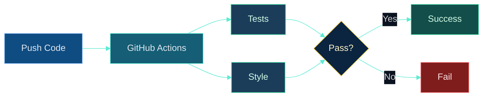

# Dr. Mindaugas Šarpis

# Best Research and Data Analysis Practices from CERN

## Reproducible Workflows & Automation

##### <span class="aims-badge">♻️ reproducibility · ⚙️ automation</span>

<!--
Speaker: open on the pain — an analysis you cannot rerun six months later. Today
turns ad-hoc scripts into a pipeline anyone can rebuild. Serves the ♻️ + ⚙️
aims. (~1 min)
-->

---
hideInToc: true
layout: quote
---

# Science requires **reproducibility**. Good computing practices transform ad-hoc analysis scripts into professional, automated workflows that others (and future you) can understand, verify, and extend.

---
hideInToc: true
---

# Learning **Objectives**

<div class="note-text mt-sm">By the end of this lecture, you will be able to:</div>

<div class="grid-2 gap-md mt-sm">

<div class="card card-primary card-glass pad-compact">

📁 Structure an analysis project — separate **data, code, and config**

</div>

<div class="card card-secondary card-glass pad-compact">

⌨️ Parameterise scripts with **argparse** and readable **YAML config files**

</div>

<div class="card card-success card-glass pad-compact">

📦 Isolate dependencies in **virtual environments** with pinned versions

</div>

<div class="card card-warning card-glass pad-compact">

⚙️ Automate the pipeline with a **Makefile** so `make all` rebuilds everything

</div>

<div class="card card-accent card-glass pad-compact">

🧪 Test analysis logic with **pytest** — selection cuts, edge cases

</div>

<div class="card card-info card-glass pad-compact">

🔄 Let **CI and pre-commit hooks** run those checks on every push, automatically

</div>

<div class="card card-primary card-glass pad-compact">

🗃️ Version **data**, not just code — content hashes and pointer files

</div>

<div class="card card-secondary card-glass pad-compact">

🌍 Publish data that is **FAIR** — findable, accessible, interoperable, reusable

</div>

</div>

<!--
Speaker: frame these as promises, not a syllabus. Today is the "why + how" of
reproducible workflows. Seminar 14 is where the D⁰ seminar pipeline gets a
pinned environment and a Makefile — a pattern they carry into their own
semester project. (~1 min)
-->

---
hideInToc: true
---

# Motivation

<div class="grid-2 mt-md gap-md">

<div class="card card-warning card-glass pad-tight">

## 🚨 **The Reproducibility Crisis**

Results cannot be reproduced because:
- Code is lost or undocumented
- Dependencies are unclear
- Analysis steps are manual
- Data processing is not tracked

</div>

<div class="card card-success card-glass pad-tight">

## 🌱 **Benefits of Good Practices**

- Faster iteration & collaboration
- Reliable, verifiable results
- Publication-ready code
- Career-ready skills

**Goal**: Reproducible in 5 years (or 5 hours!)

</div>

</div>

---
layout: section
hideInToc: true
---

# From **Scripts** to **Workflows**

<!--
Speaker: the arc of the whole lecture — notebook to script to modular code to an
automated pipeline. Everything that follows moves one step along this path.
Arc check: we start at 📓 Notebook — Notebook → Script → Modules → Pipeline →
Production is the map for the next two hours. (~1 min)
-->

---
hideInToc: true
---

# The **Evolution** of Your Analysis

<div style="display: flex; justify-content: center; align-items: center; margin-top: 0.5rem;">


</div>

<div class="mt-md" style="display: grid; grid-template-columns: repeat(5, minmax(0, 1fr)); gap: 0.6rem;">

<div class="card card-primary card-glass pad-compact">

📓 **Notebook** — explore freely; nothing is repeatable yet

</div>

<div class="card card-secondary card-glass pad-compact">

📜 **Script** — runs top to bottom, paths still hardcoded

</div>

<div class="card card-success card-glass pad-compact">

📦 **Modules** — functions in `src/`, parameters in config

</div>

<div class="card card-warning card-glass pad-compact">

⚙️ **Pipeline** — `make all` rebuilds only what changed

</div>

<div class="card card-accent card-glass pad-compact">

🚀 **Production** — tests, CI, pinned env: anyone can rerun

</div>

</div>

---
hideInToc: true
---

# Anatomy of a **Well-Structured** Project

<div class="grid-2 gap-md mt-md">

<div class="card card-primary card-glass pad-tight" style="font-family: monospace; font-size: 0.7em; line-height: 1.5;">

```text
my_analysis/
├── README.md
├── requirements.txt
├── config/
│   └── analysis_config.yaml
├── data/
│   ├── raw/
│   └── processed/
├── src/
│   ├── data_loader.py
│   ├── preprocessing.py
│   ├── fitting.py
│   └── plotting.py
├── scripts/
│   ├── 1_preprocess.py
│   ├── 2_fit_model.py
│   └── 3_make_plots.py
├── notebooks/
├── tests/
├── results/
└── .gitignore
```

</div>

<div style="display: flex; flex-direction: column; gap: 0.5rem;">

<div class="card card-info card-glass pad-compact">

📄 **Root** — README, requirements, config

</div>

<div class="card card-secondary card-glass pad-compact">

📁 **data/** — raw (immutable) → processed

</div>

<div class="card card-success card-glass pad-compact">

📁 **src/** — reusable modules & functions

</div>

<div class="card card-warning card-glass pad-compact">

📁 **scripts/** — numbered execution steps

</div>

<div class="card card-accent card-glass pad-compact">

📁 **notebooks/** — exploration only

</div>

<div class="card card-info card-glass pad-compact">

📁 **tests/** + **results/** — tests & outputs

</div>

</div>

</div>

---
hideInToc: true
---

# Key **Principles**

<div class="grid-2 mt-md gap-md">

<div class="card card-primary card-glass pad-tight">

## 🧩 **1. Separation of Concerns**

- **Data**: raw vs processed (never modify raw!)
- **Code**: reusable functions vs scripts
- **Config**: parameters separate from code

</div>

<div class="card card-secondary card-glass pad-tight">

## 📦 **2. Clear Dependencies**

- Document required packages with versions
- Use virtual environments
- Pin critical dependencies

</div>

<div class="card card-info card-glass pad-tight">

## 📝 **3. Self-Documentation**

- README explains what & how
- Code comments explain why
- Docstrings for functions

</div>

<div class="card card-accent card-glass pad-tight">

## ⚙️ **4. Automation**

- Scripts run without intervention
- Results are reproducible
- Tests validate correctness

</div>

</div>

---
layout: section
hideInToc: true
---

# Parameters: **CLI & Config**

<!--
Speaker: the first concrete move — get every number and path OUT of the code
and into arguments or a config file. Two tools, one habit. Arc: 📜 Script →
📦 Modules; parameters leave the code. (~1 min)
-->

---
hideInToc: true
---

# Why **Command-Line** Arguments?

<div class="card card-warning card-glass pad-tight mt-md">

## ❌ **Problem: Hardcoded Values**

```python
# Bad: hardcoded file paths and parameters
df = pd.read_csv('data.csv')
model_fit(df, n_bins=50, range_min=1800, range_max=1930)
```

**Issues**: can't easily change parameters, not reusable, manual editing required

</div>

<div class="card card-success card-glass pad-tight mt-md">

## ✅ **Solution: Command-Line Arguments**

```bash
python fit_model.py --input data.csv --bins 50 --range 1800 1930
python fit_model.py --input new_data.csv --bins 100 --range 1750 2000
```

**Benefits**: flexible, scriptable, no code changes needed

</div>

---
hideInToc: true
---

# **argparse**: Python's Standard Tool

<div class="grid-2 mt-md gap-md">

<div class="card card-primary card-glass pad-tight">

## 🔑 **Key Features**

- `required=True` for mandatory args
- `default=value` for optional args
- `type=int/float/str` for type conversion
- `nargs=2` for multiple values
- `action='store_true'` for flags
- `help='...'` for documentation

</div>

<div class="card card-secondary card-glass pad-tight">

## 🧾 **Common Argument Types**

```python
--input file.csv      # required string
--output results.csv  # optional with default
--bins 50             # integer
--range 1800 1930     # two floats
--verbose             # boolean flag
```

</div>

</div>

---
hideInToc: true
---

# Script **Structure** with argparse

<div class="card card-info card-glass pad-tight mt-md">

## 🧱 **Typical Script Pattern**

```python
import argparse

parser = argparse.ArgumentParser(description='...')
parser.add_argument('--input', required=True, help='...')
# ... more arguments ...
args = parser.parse_args()

data = load_data(args.input)
```

</div>

<div class="grid-2 mt-md gap-md">

<div class="card card-primary card-glass pad-tight">

### 🌱 **Benefits**

- Flexible parameters
- Self-documenting (`--help`)
- Scriptable (batch processing)
- No code changes needed

</div>

<div class="card card-secondary card-glass pad-tight">

### 💡 **Tips**

- Use meaningful names
- Provide defaults
- Add help messages
- Validate inputs

</div>

</div>

---
hideInToc: true
---

# When CLI Args Get **Unwieldy**

<div class="card card-info card-glass pad-tight mt-md">

## 📚 **Dozens of parameters?**

Move them into a configuration file — one versioned, commented file instead of a mile-long command.

</div>

<div class="grid-2 mt-md gap-md">

<div class="card card-warning card-glass pad-tight">

### ❌ **Too Many Arguments**

```bash
python analyze.py \
  --input data.csv --bins 50 \
  --signal-mean 1865 --bg-scale 2.0 \
  --fit-method mle --output results.png \
  --verbose --save-params params.json
```

Unreadable, error-prone!

</div>

<div class="card card-success card-glass pad-tight">

### ✅ **Config File**

```bash
python analyze.py --config analysis_config.yaml
```

```yaml
input: data.csv
bins: 50
signal: { mean: 1865, sigma: 8 }
background: { scale: 2.0 }
fit_method: mle
output: results.png
```

</div>

</div>

---
hideInToc: true
---

# **YAML** Configuration Files

<div class="grid-2 gap-md mt-sm">

<div class="card card-primary card-glass pad-tight">

## 📄 **YAML: Human-Readable Config**

- Easy to read and write
- Hierarchical structure
- Comments with `#`
- Standard for config files

**Basic syntax:**

```yaml
key: value          # string
count: 42           # number
enabled: true       # boolean
items: [1, 2, 3]    # list
```

</div>

<div class="card card-secondary card-glass pad-tight" style="font-size: 0.7em;">

```yaml
# config.yaml
data:
  input_file: "data/raw/sample.csv"
  output_dir: "results/"

histogram:
  bins: 50
  range: [1800, 1930]   # MeV

model:
  signal: { mean: 1865, sigma: 8 }
  background: { scale: 2.0 }

fitting:
  method: "mle"
  tolerance: 1.0e-6   # decimal point → parsed as a float, not a string
```

</div>

</div>

---
hideInToc: true
---

# Loading **Config** in Python

<div class="grid-2 mt-md gap-md">

<div class="card card-primary card-glass pad-tight">

## 📥 **Basic Loading**

```python
import yaml

with open('config.yaml', 'r') as f:
    config = yaml.safe_load(f)

# Access nested values
n_bins = config['histogram']['bins']
```

</div>

<div class="card card-secondary card-glass pad-tight">

## ✅ **Best Practices**

- Use `yaml.safe_load()` (not `load()`)
- Validate required fields exist
- Check value types and ranges
- Provide sensible defaults
- Handle missing files gracefully

</div>

</div>

<div class="card card-warning card-glass pad-tight mt-md" style="display: flex; gap: 2rem; align-items: center;">

<div>

**Why `safe_load()`?** — `yaml.load()` can execute arbitrary code (e.g., `!!python/object/apply:os.system`)

</div>

<div>

`safe_load()` only parses: `str` | `int` | `float` | `bool` | `list` | `dict` | `None`

</div>

</div>

---
hideInToc: true
---

# Combining **argparse + Config** Files

<div class="card card-info card-glass pad-compact mt-sm">

## 🔀 **The Pattern**

Config file provides defaults; command-line arguments can override specific values.

```bash
# Use config defaults
python analyze.py --config analysis.yaml

# Override specific values
python analyze.py --config analysis.yaml --input new_data.csv
```

</div>

<div class="grid-2 mt-md gap-md">

<div class="card card-primary card-glass pad-tight">

### 📄 **Config File For**

- Default values
- Complex nested settings
- Documentation (comments)
- Experiment configurations

</div>

<div class="card card-secondary card-glass pad-tight">

### ⌨️ **CLI Args For**

- Required inputs/outputs
- Quick overrides
- Batch processing
- Scripting workflows

</div>

</div>

<div class="note-text mt-sm">

💡 **Groundwork**: Seminar 14 practises the environment + Makefile half; Seminar 15 needs every input to come from config/args — so build the CLI/config habit now.

</div>

---
layout: section
hideInToc: true
---

# Virtual Environments & **Dependencies**

<!--
Speaker: "it works on my machine" is a reproducibility bug. Isolated, pinned
environments are the fix — this is the ♻️ aim in practice. Arc: still at
📦 Modules — now the environment AROUND the code. (~1 min)
-->

---
hideInToc: true
---

# The **Dependency** Problem

<div class="grid-2 mt-md gap-md">

<div class="card card-warning card-glass pad-tight">

## 😩 **"It Works on My Machine!"**

- You develop with NumPy 1.24, Matplotlib 3.7
- Collaborator has different versions
- Code breaks with mysterious errors
- 6 months later: can't reproduce your own results

**Root cause**: unmanaged dependencies

</div>

<div class="card card-success card-glass pad-tight">

## 💡 **Solution: Virtual Environments**

Isolated Python environments with pinned versions

- Each project has its own environment
- Document exact versions
- No conflicts between projects

</div>

</div>

---
hideInToc: true
---

# venv vs **conda**

<div class="grid-2 mt-md gap-md">

<div class="card card-primary card-glass pad-tight">

## 🐍 **Option 1: venv (built-in)**

```bash
# Create environment
python -m venv myenv

# Activate (Linux/Mac)
source myenv/bin/activate

# Activate (Windows)
myenv\Scripts\activate

# Install packages
pip install numpy pandas matplotlib

# Deactivate
deactivate
```

**Pros**: built into Python, simple

**Cons**: only Python packages

</div>

<div class="card card-secondary card-glass pad-tight">

## 📦 **Option 2: conda**

```bash
# Create environment
conda create -n myenv python=3.11

# Activate
conda activate myenv

# Install packages
conda install numpy pandas matplotlib
# or: pip install ...

# Deactivate
conda deactivate
```

**Pros**: handles non-Python deps (C libs, etc.), popular in science

**Cons**: heavier, slower — use `mamba` if too slow

</div>

</div>

---
hideInToc: true
---

# **requirements.txt**

<div class="grid-2 mt-sm gap-md">

<div style="display: flex; flex-direction: column; gap: 0.8rem;">

<div class="card card-info card-glass pad-compact">

## 📋 **The Package List**

A plain text file listing required packages with version constraints

</div>

<div class="card card-primary card-glass pad-compact">

## 🔢 **Version syntax**

- `==2.0.3` — exact version
- `>=1.24.0` — minimum version
- `>=1.24,<2.0` — version range

</div>

<div class="card card-warning card-glass pad-compact">

## 🧾 **Two files, two jobs**

`requirements.txt` / `pyproject.toml` lists *direct* deps with loose bounds (what you need); a lockfile (`uv.lock`, `pip freeze` output, `conda env export`) records *exact* versions (what you tested). Ship both.

</div>

</div>

<div>

```bash
# requirements.txt — direct deps, loose bounds
numpy>=1.24,<2.0
pandas>=2.0
matplotlib>=3.7
scipy>=1.11
pyyaml>=6.0
```

```bash
# Install the direct list
pip install -r requirements.txt

# Freeze what you tested into a lockfile
pip freeze > requirements.lock
```

</div>

</div>

---
hideInToc: true
---

# Modern Tooling: **uv** & pyproject.toml

<div class="grid-2 mt-sm gap-md">

<div class="card card-primary card-glass pad-compact">

## ⚡ **uv — fast, lockfile-based**

One Rust-based tool for **environments *and* dependencies**, resolving in seconds, not minutes — the emerging 2026 standard for scientific Python.

```bash
uv init my_analysis        # project + pyproject.toml
cd my_analysis
uv add numpy pandas        # resolve, install, lock
uv run python analysis.py  # run inside the env
```

`uv.lock` pins exact versions for a byte-identical rebuild. **pixi** plays the same role in the conda world.

</div>

<div class="card card-secondary card-glass pad-compact">

## 📄 **pyproject.toml (PEP 621)**

One declarative file for project metadata *and* dependencies — the modern replacement for a scattered `requirements.txt` + `setup.py`.

```toml
[project]
name = "my_analysis"
requires-python = ">=3.11"
dependencies = [
  "numpy>=1.24",
  "pandas>=2.0",
]
```

Read by `uv`, `pip`, and build tools alike. ♻️

</div>

</div>

---
hideInToc: true
---

# **environment.yml**

<div class="grid-2 mt-sm gap-md">

<div style="display: flex; flex-direction: column; gap: 0.8rem;">

<div class="card card-info card-glass pad-compact">

## 🐍 **Conda Alternative**

Env name, channels, Python version, mix conda + pip

</div>

<div class="card card-success card-glass pad-compact">

## ⌨️ **Commands**

- `conda env create -f environment.yml`
- `conda env update -f environment.yml --prune`
- `conda env export --from-history > environment.yml`

</div>

</div>

<div>

```yaml
name: my_analysis
channels:
  - conda-forge
dependencies:
  - python=3.11
  - numpy>=1.24
  - pandas>=2.0
  - matplotlib>=3.7
  - pip:
      - some-pip-package
```

</div>

</div>

---
hideInToc: true
---

# Best Practices: **Dependencies**

<div class="grid-2 mt-sm gap-md">

<div class="card card-success card-glass pad-compact">

## ✅ **Do**

- Use virtual environments for every project
- Document dependencies with version constraints
- Test on a fresh environment before sharing
- Add `venv/`, `.conda/` to `.gitignore`

</div>

<div class="card card-warning card-glass pad-compact">

## ❌ **Don't**

- Install packages globally
- Use `pip freeze` output blindly
- Hand-edit exact pins into `requirements.txt` — let a lockfile do that
- Commit the virtual environment to git

</div>

</div>

---
layout: section
hideInToc: true
---

# Automation with **Makefiles**

<!--
Speaker: this is the payoff — one command runs the whole pipeline and only
rebuilds what changed. Make is the ⚙️ aim made concrete. Arc: 📦 Modules →
⚙️ Pipeline. (~1 min)
-->

---
hideInToc: true
---

# Why **Makefiles**?

<div class="grid-2 mt-sm gap-md">

<div>

<div class="card card-primary card-glass pad-compact">

## ⚙️ **Automate Your Workflow**

Instead of running multiple commands manually, run: `make all`

</div>

<div class="card card-info card-glass pad-compact mt-sm">

## 🌱 **Benefits**

One-command execution, tracks dependencies, only reruns what changed, documents the workflow

</div>

</div>

<div class="card card-secondary card-glass pad-compact">

## 🧰 **Common Uses**

- Run analysis pipeline
- Run tests
- Generate figures
- Build documentation
- Clean temporary files

</div>

</div>

---
hideInToc: true
---

# Basic **Makefile** Syntax

<div class="grid-2 mt-sm gap-md">

<div style="font-size: 0.82em;">

```makefile
# Makefile for the D0 analysis pipeline
all: results/plot.png results/fit.json

results/plot.png: data/clean.csv scripts/plot.py
	python scripts/plot.py

results/fit.json: data/clean.csv scripts/fit.py
	python scripts/fit.py

data/clean.csv: data/raw.csv scripts/clean.py
	python scripts/clean.py

# Utility targets (don't create files)
.PHONY: all clean test

test:
	python -m pytest tests/

clean:
	rm -rf results/* data/clean.csv
```

</div>

<div>

<div class="card card-info card-glass pad-compact">

## 🔑 **Key Concepts**

- **Target**: file to create
- **Dependencies**: files it needs
- **Command**: how to build (TAB!)
- **Phony**: non-file targets

</div>

<div class="card card-success card-glass pad-compact mt-sm">

## ⌨️ **Usage**

- `make all` — run pipeline
- `make test` — run the tests
- `make clean` — remove outputs

</div>

</div>

</div>

<!--
Speaker: walk one rule top-down: target, then its inputs, then the TAB-indented
command. Point at the TAB — the number-one Makefile bug. (~3 min)
-->

---
hideInToc: true
---

# **Using** the Makefile

```bash
make all               # run the entire pipeline
make clean; make all   # wipe and rebuild
make test              # run the unit tests
```

**Smart rebuilding**:
```bash
# First run: builds everything
make all

# Edit only the plotting script
vim scripts/plot.py

# Second run: only regenerates plot (skips cleaning and fitting!)
make all
```

<div class="card card-accent card-glass pad-tight mt-sm">

Make checks file timestamps. If dependencies are newer than the target, it rebuilds. Otherwise, it skips!

</div>

---
hideInToc: true
---

# Make vs **Snakemake** vs a Plain Script

<div class="grid-3 gap-md mt-md">

<div class="card card-primary card-glass pad-compact">

## 📜 **Plain script**

One `run_all.sh` calling every step in order.

**Good for**: a linear 2–3 step pipeline, one contributor.

**Weak on**: always reruns everything — no dependency tracking.

</div>

<div class="card card-secondary card-glass pad-compact">

## 🔧 **Make**

Tracks file timestamps; reruns only stale targets.

**Good for**: most single-analysis pipelines — portable, `make` is everywhere.

**Weak on**: branching workflows, parameter sweeps.

</div>

<div class="card card-accent card-glass pad-compact">

## 🐍 **Snakemake**

Python-native rules, wildcards, cluster & conda support.

**Good for**: many samples/parameters, HPC submission.

**Weak on**: overkill for one small analysis.

</div>

</div>

<div class="note-text mt-sm">

💡 What matters: **dependency tracking**, **partial re-runs**, and **portability** 🔧. Start with a script; add Make when reruns waste time; add Snakemake when parameters multiply.

</div>

---
layout: section
hideInToc: true
---

# Testing your **Analysis**

<!--
Speaker: "the plot looked fine" is not evidence. A test is a known number
checked automatically, every time. Arc: ⚙️ Pipeline → 🚀 Production — the
first production habit is tests. (~1 min)
-->

---
hideInToc: true
---

# Five **layers** of testing

<div class="stack-tight mt-md">

<div class="card card-primary card-glass pad-tight">

## 🧪 Unit tests for data transforms & calculations

</div>

<div class="card card-secondary card-glass pad-tight">

## ✅ Data validation (great expectations, pydantic, pandera)

</div>

<div class="card card-accent card-glass pad-tight">

## 📊 Statistical tests to confirm assumptions

</div>

<div class="card card-info card-glass pad-tight">

## 📂 Golden datasets & regression tests for dashboards

</div>

<div class="card card-success card-glass pad-tight">

## 👁️ Peer review before results leave the team

</div>

</div>

---
hideInToc: true
---

# From "It Looked Fine" to a **Test**

<div class="card card-warning card-glass pad-tight mt-md">

## 😬 **"I ran it and the plot looked fine"**

That is not evidence — a silent off-by-one in a selection cut can shift a peak by 10 MeV and still "look fine" on a busy histogram. A **test** checks a known number, every time, automatically.

</div>

<div class="card card-info card-glass pad-tight mt-sm">

## 🎯 **What we test**

A small, pure analysis function — not a plot, not a whole script. Something with one clear right answer for a known input.

</div>

---
hideInToc: true
---

# Your First **pytest** Test

<div class="grid-2 mt-sm gap-md">

<div class="card card-primary card-glass pad-tight">

## 🔧 **The function**

```python
# src/selection.py
def is_signal_region(mass):
    """True if mass (MeV) sits in the D0 window."""
    return 1800 < mass < 1930
```

</div>

<div class="card card-secondary card-glass pad-tight">

## 🧪 **The test**

```python
# tests/test_selection.py
from src.selection import is_signal_region

def test_accepts_known_peak():
    assert is_signal_region(1865)

def test_rejects_sideband():
    assert not is_signal_region(2500)
```

</div>

</div>

<div class="note-text mt-sm">

One `assert` per fact you know must hold. Name the test after the behaviour it checks, not the function.

</div>

<!--
Speaker: the whole idea in one screen — a pure function, two facts about it.
1865 is the D⁰ mass, 2500 is nowhere near it. (~2 min)
-->

---
hideInToc: true
---

# Testing **Edge Cases**

<div class="card card-info card-glass pad-tight mt-md">

## 🧪 **Beyond the happy path**

Real data is messy — a good test suite checks the cases that break code silently.

</div>

<div class="grid-2 mt-sm gap-md">

<div class="card card-warning card-glass pad-compact">

### 📭 **Empty input**

```python
# src/selection.py
def select(masses):
    return masses[(masses > 1800) & (masses < 1930)]

# tests/test_selection.py
def test_empty_returns_empty():
    assert len(select(np.array([]))) == 0
```

</div>

<div class="card card-accent card-glass pad-compact">

### 🕳️ **NaN values**

Append to `tests/test_selection.py` (add `import numpy as np` at the top):

```python
def test_nan_is_rejected():
    assert not is_signal_region(np.nan)
```

</div>

</div>

<div class="note-text mt-sm">

If a function silently returns `True` for `NaN` or crashes on an empty array, you want to know **before** it corrupts a fit — not after.

</div>

<!--
Speaker: the array version `select()` is what the seminar pipeline actually
uses; empty and NaN are the two edge cases that bite real ntuples. (~2 min)
-->

---
hideInToc: true
---

# Running pytest & Reading the **Output**

<span class="def-sub">A collaborator "tidies up" the cut to `return not (mass < 1800 or mass > 1930)` — identical to the original for every real number. Run the tests:</span>

<div class="card card-primary card-glass pad-tight mt-sm">

```bash
$ python -m pytest tests/ -v
tests/test_selection.py::test_accepts_known_peak PASSED
tests/test_selection.py::test_rejects_sideband PASSED
tests/test_selection.py::test_nan_is_rejected FAILED

=============== FAILURES ===============
    def test_nan_is_rejected():
>       assert not is_signal_region(np.nan)
E       assert not True
E        +  where True = is_signal_region(nan)
tests/test_selection.py:12: AssertionError
====== 1 failed, 2 passed in 0.05s ======
```

</div>

<div class="note-text mt-sm">

For `NaN`, **both** comparisons are `False`, so the rewrite returns `True`. Each line is one test; the traceback names the exact failing `assert`. `python -m pytest` puts the project root on the import path — or put `pythonpath = ["."]` under `[tool.pytest.ini_options]` in `pyproject.toml`.

</div>

<!--
Speaker: let them predict the result BEFORE revealing the FAILED line — the
NaN trap surprises most of the room. (~3 min)
-->

---
hideInToc: true
---

# What (Not) to **Test** in an Analysis

<div class="grid-2 mt-sm gap-md">

<div class="card card-success card-glass pad-tight">

## ✅ **Worth testing**

- Selection cuts (mass windows, quality flags)
- Unit conversions & physical constants
- Data-loading edge cases (empty file, missing column)
- Fit-result sanity (parameter in a physical range)

</div>

<div class="card card-warning card-glass pad-tight">

## ❌ **Not worth testing**

- Exact pixel colours or figure DPI
- Wording of axis labels or titles
- Anything that changes every run by design (timestamps)

</div>

</div>

<div class="note-text mt-sm">

Rule of thumb: test **logic with a right answer**, not **appearance with a taste**.

</div>

---
hideInToc: true
---

<MCQ
  question="Which of these is most worth writing a unit test for?"
  :options="[
    'The exact shade of blue used in a histogram',
    'A signal-region selection cut that must accept 1865 MeV and reject 2500 MeV',
    'The DPI setting used when saving a PNG',
    'The wording of an axis label'
  ]"
  :correct="1"
  explanation="Tests are for logic with a right answer — selection cuts, unit conversions, edge cases. Plot styling is a visual choice, not a correctness question."
/>

---
layout: section
hideInToc: true
---

# Continuous Integration with **GitHub Actions**

<!--
Speaker: CI runs your tests and pipeline automatically on every push — the
machine enforces reproducibility so you do not have to remember. Arc:
🚀 Production — the machine, not you, runs the tests. (~1 min)
-->

---
hideInToc: true
---

# What is **CI/CD**?

<div class="card card-info card-glass pad-compact">

## 🔄 **Continuous Integration / Deployment**

Automatically run tasks when you push code: tests, style checks, build docs, run the pipeline. **Benefits:** catch errors early, ensure reproducibility.

</div>



---
hideInToc: true
---

# GitHub Actions: **Basic** Workflow

<div class="grid-2 mt-sm gap-md">

<div style="font-size: 0.78em;">

```yaml
# .github/workflows/test.yml
name: Run Tests
on: [push, pull_request]

jobs:
  test:
    runs-on: ubuntu-latest
    steps:
    - uses: actions/checkout@v4
    - uses: actions/setup-python@v5
      with:
        python-version: '3.11'
    - run: pip install -r requirements.txt
    - run: python -m pytest tests/ -v
```

</div>

<div>

<div class="card card-info card-glass pad-compact">

## 🔑 **Key Parts**

- **on:** when to trigger (push, PR)
- **runs-on:** VM type (ubuntu)
- **steps:** sequential actions
- **uses:** pre-built actions
- **run:** shell commands

</div>

<div class="card card-success card-glass pad-compact mt-sm">

Every push/PR now automatically runs your tests!

</div>

</div>

</div>

---
hideInToc: true
---

# Advanced: **Analysis Pipeline**

<div class="grid-2 mt-sm gap-md">

<div style="font-size: 0.75em;">

```yaml
name: Analysis Pipeline
on:
  push:
    branches: [main]

jobs:
  analyze:
    runs-on: ubuntu-latest
    steps:
    - uses: actions/checkout@v4
    - uses: actions/setup-python@v5
      with:
        python-version: '3.11'
    - run: pip install -r requirements.txt
    - run: make all
    - uses: actions/upload-artifact@v4
      with:
        name: results
        path: results/
```

</div>

<div>

<div class="card card-info card-glass pad-compact">

## 🧱 **Pipeline Steps**

1. Checkout code
2. Setup Python
3. Install dependencies
4. Run analysis (`make all`)
5. Upload results as artifact

</div>

<div class="card card-accent card-glass pad-compact mt-sm">

**Optional:** auto-commit results back to repo, send notifications, deploy to web

</div>

</div>

</div>

---
layout: section
hideInToc: true
---

# Pre-commit **Hooks**

<!--
Speaker: the seatbelt you stop noticing — checks run locally, before a commit
lands, so bad formatting or an accidental notebook output never even reaches
CI. Arc: 🚀 Production, but on your own laptop — checks before the commit.
(~1 min)
-->

---
hideInToc: true
---

# What Runs **Before** You Even Push

<div class="stack-tight mt-md">

<div class="card card-primary card-glass pad-tight">

## 🎨 **Formatter** (black, ruff format) — rewrites code to one house style, no debate

</div>

<div class="card card-secondary card-glass pad-tight">

## 🔍 **Linter** (ruff, flake8) — flags unused imports, undefined names, obvious bugs

</div>

<div class="card card-accent card-glass pad-tight">

## 📓 **Notebook-output stripper** (nbstripout) — clears cell outputs so diffs stay readable

</div>

<div class="card card-info card-glass pad-tight">

## 🚫 **Big-file / secret guards** — block an accidental `data.root` or `.env` commit

</div>

</div>

---
hideInToc: true
---

# A Minimal **`.pre-commit-config.yaml`**

<div class="grid-2 mt-sm gap-md">

<div class="card card-primary card-glass pad-compact">

```yaml
repos:
  - repo: https://github.com/astral-sh/ruff-pre-commit
    rev: v0.6.9
    hooks:
      - id: ruff
      - id: ruff-format
  - repo: https://github.com/kynan/nbstripout
    rev: 0.7.1
    hooks:
      - id: nbstripout
```

</div>

<div class="stack-tight">

<div class="card card-info card-glass pad-compact">

**Install once**: `pre-commit install`

</div>

<div class="card card-success card-glass pad-compact">

**Every commit**: hooks run automatically — a failing hook blocks the commit until you fix it

</div>

</div>

</div>

<div class="note-text mt-sm">

The formatter Lecture 07 promised, plus a notebook-output stripper — now enforced automatically, so conventions hold even under deadline pressure. ⚙️ The `rev:` pin (required!) is the reproducibility guarantee: every collaborator runs exactly the same hook version. ♻️

</div>

---
layout: section
hideInToc: true
---

# Versioning **Data**

<!--
Speaker: git is for code. Data needs a different trick — the on-ramp to the
FAIR discussion that follows. Arc: the ⚙️ Pipeline's INPUTS — data is the one
thing git cannot carry. (~1 min)
-->

---
hideInToc: true
---

# Why Git **Chokes** on Data

<div class="grid-2 mt-md gap-md">

<div class="card card-warning card-glass pad-tight">

## ⚠️ **The problem**

Git stores every version of every file, forever. A 2 GB ROOT file changed 10 times means **20 GB** in `.git/` — clones become huge and slow.

</div>

<div class="card card-success card-glass pad-tight">

## 💡 **The idea**

Store the data **once**, content-addressed by its hash. Git tracks a tiny **pointer file** instead — the data itself lives outside the repo.

</div>

</div>

---
hideInToc: true
---

# A **Pointer File**, Not the Data

<div class="grid-2 mt-sm gap-md">

<div class="card card-primary card-glass pad-compact">

## 📄 **What git actually stores** — `sample.csv.dvc`

```yaml
outs:
  - md5: 8f14e45fceea167a5a36dedd4bea2543
    path: sample.csv
    size: 2147483648
```

</div>

<div class="card card-secondary card-glass pad-compact">

## ⬇️ **What happens**

`dvc pull` fetches the real file from remote storage using that hash — the repo stays small, the data stays exact.

</div>

</div>

<div class="note-text mt-sm">

Same principle behind Git LFS and content-addressed storage generally: **the hash *is* the identity** — change one byte and everyone notices. 📁

</div>

---
hideInToc: true
---

# Data Versioning: The **Toolbox**

<div class="grid-3 gap-md mt-md">

<div class="card card-primary card-glass pad-compact">

## 🗃️ **DVC**

Git-native; pairs a pointer file with any remote (S3, GDrive, SSH).

</div>

<div class="card card-secondary card-glass pad-compact">

## 📦 **Git LFS**

Simpler, GitHub-integrated; swaps large files for pointers transparently.

</div>

<div class="card card-accent card-glass pad-compact">

## 🏛️ **Zenodo DOIs**

For a **finished** dataset: upload once, get a permanent, citable identifier.

</div>

</div>

<div class="note-text mt-sm">

Teaser only — pick one when a project's data actually outgrows git. The DOI idea reappears next: it's the **F** in FAIR.

</div>

---
layout: section
hideInToc: true
---

# **FAIR** Principles

<!--
Speaker: FAIR = Findable, Accessible, Interoperable, Reusable. Frame it as the
standard that lets a stranger reuse your data a decade later — then show CERN
Open Data as living proof it works at petabyte scale. Arc: 🚀 Production for
DATA — publishing outputs others can reuse. (~1 min)
-->

---
hideInToc: true
---

# The four **FAIR** principles

<div class="grid-2 gap-md mt-md">

<div class="card card-primary card-glass pad-compact">

## 🔍 **Findable**

- A globally unique, persistent identifier (a DOI)
- Rich metadata that includes that identifier
- Registered in a searchable index or catalogue

</div>

<div class="card card-secondary card-glass pad-compact">

## 🌐 **Accessible**

- Retrievable by its identifier over an open protocol (HTTPS)
- Authentication where needed — the protocol stays open
- Metadata stays online even when the data is retired

</div>

<div class="card card-accent card-glass pad-compact">

## 🔗 **Interoperable**

- Open, typed formats (CSV, Parquet, HDF5, ROOT)
- Shared vocabularies & units (PDG names, ISO 8601 dates)
- Qualified links to related records (detector, simulation)

</div>

<div class="card card-success card-glass pad-compact">

## ♻️ **Reusable**

- A clear, accessible licence (CC0, CC-BY)
- Provenance: software version, run conditions, steps
- Domain community standards for structure & description

</div>

</div>

<div class="note-text mt-sm">

After Wilkinson et al. (2016), *Scientific Data* — the standard that lets a stranger reuse your data a decade later.

</div>

---
hideInToc: true
---

# Interoperability · **what breaks it vs. what fixes it**

<span class="def-sub">"I just shared the CSV" is not interoperability. The machine — and the next analyst — still needs to know what every column means and in what units.</span>

<div class="grid-2 gap-md mt-md tidy-cards">

<div class="card card-warning card-glass pad-compact">

## ❌ **Proprietary format**

`.xlsx` with merged cells, macros, embedded plots. Only opens cleanly in one tool, parses poorly everywhere else.

**Fix:** CSV / Parquet / HDF5 — open, typed, streamable.

</div>

<div class="card card-warning card-glass pad-compact">

## ❌ **Missing units**

A column `mass` with values `[1865, 1871, 1859]`. MeV? GeV? Per event? No one can tell.

**Fix:** units in the column name (`mass_mev`) or a sidecar schema file.

</div>

<div class="card card-warning card-glass pad-compact">

## ❌ **Undocumented codes**

`status` column with values `{1, 2, 3, 9}` and no legend. The meaning lives in someone's head.

**Fix:** a README mapping each code + a controlled vocabulary (ICD, MeSH, PDG, …).

</div>

<div class="card card-warning card-glass pad-compact">

## ❌ **Opaque timestamps**

`ts = 1712937600` — seconds? milliseconds? Which timezone? From when?

**Fix:** ISO 8601 strings with explicit offset (`2024-04-12T14:00:00+02:00`).

</div>

</div>

<div class="card card-success card-glass pad-compact mt-md">

## 💡 **Rule of thumb**

A dataset is interoperable when a stranger, with no access to you, can correctly merge it with their own data **without guessing.**

</div>

<!--
Speaker: pick the "missing units" card and ask the room which unit — nobody can
know, that's the point. One minute per card at most. (~4 min)
-->

---
hideInToc: true
---

# FAIR worked example — a **CERN Open Data** record

<div class="card card-info card-glass pad-compact mt-sm">

<div class="note-text">

An LHCb research-grade dataset on opendata.cern.ch — annotated against each FAIR pillar.

</div>

</div>

<div class="grid-2 gap-md mt-md">

<div class="stack-tight">

<div class="card card-primary card-glass pad-tight">

## 🔍 **Findable**

DOI `10.7483/OPENDATA.LHCB.…`, title, keywords, indexed on Google Dataset Search

</div>

<div class="card card-secondary card-glass pad-tight">

## 🌐 **Accessible**

HTTPS download + XRootD streaming, free, no login required; metadata stays online if files are retired

</div>

</div>

<div class="stack-tight">

<div class="card card-accent card-glass pad-tight">

## 🔗 **Interoperable**

ROOT (DST / ntuple) files with published schema, HEP-specific vocabularies, links to detector & simulation records

</div>

<div class="card card-success card-glass pad-tight">

## ♻️ **Reusable**

CC0 licence, full provenance (run conditions, software version), validated example analyses in containers

</div>

</div>

</div>

<div class="card card-warning card-glass pad-compact mt-md">

<div class="note-text">

#### 🎯 Every FAIR principle is concretely visible — that's why CERN data can be reanalysed a decade later

</div>

</div>

<!--
Speaker: this is the same portal the seminar D⁰ sample comes from — the
students have already been on the receiving end of FAIR. (~3 min)
-->

---
layout: quote
hideInToc: true
---

## The first step in **(re)using data** is to find them. **Metadata** and data should be easy to find for both humans and computers. Machine-readable metadata are essential for automatic discovery of datasets and services — a core component of the FAIRification process.

<div class="note-text" style="text-align: right; margin-top: 1.5rem;">— GO FAIR, after Wilkinson et al. (2016), <em>Scientific Data</em></div>

---
layout: section
hideInToc: true
---

# Docker: **Containerization** (Optional/Advanced)

<!--
Speaker: optional block — skip if short on time. Arc: beyond 🚀 Production —
freezing the whole machine, not just the Python packages. (~1 min)
-->

---
hideInToc: true
---

# Why **Docker**?

<div class="grid-2 gap-md mt-md">

<div class="card card-info card-glass pad-tight">

## 🏁 **Ultimate Reproducibility**

**Virtual environments** handle Python packages. **Docker containers** handle *everything*:
- Operating system
- System libraries
- Python + packages
- Your code

**Result**: "It works on my machine" → "It works everywhere"

</div>

<div>

<div class="card card-primary card-glass pad-tight">

## 🧰 **Use Cases**

- Share analysis with exact environment
- Run on HPC clusters
- Deploy to production
- Archive for long-term reproducibility

</div>

<div class="card card-secondary card-glass pad-tight mt-sm">

## ⏱️ **When to Use**

- Complex dependencies (ROOT, GEANT4)
- Collaboration with diverse systems
- Production deployment
- Long-term preservation

</div>

</div>

</div>

---
hideInToc: true
---

# Basic **Dockerfile**

<div class="grid-2 gap-md mt-md">

<div>

```dockerfile
# Dockerfile - Analysis environment
FROM python:3.11-slim
WORKDIR /app

# Copy requirements and install
COPY requirements.txt .
RUN pip install --no-cache-dir -r requirements.txt

# Copy project files
COPY . .

# Default command
CMD ["make", "all"]
```

</div>

<div>

```bash
# Build container
docker build -t my-analysis .

# Run analysis in container
docker run my-analysis

# Interactive session
docker run -it my-analysis /bin/bash

# Mount local data
docker run -v $(pwd)/data:/app/data my-analysis
```

<div class="card card-accent card-glass pad-tight mt-sm">

**Note**: start with virtual environments, add Docker when needed.

</div>

</div>

</div>

---
layout: section
hideInToc: true
---

# Real-World **Example**

<!--
Speaker: everything from today applied to one small project — before and after.
Arc: the full path 📓 → 🚀 in one project. (~1 min)
-->

---
hideInToc: true
---

# Putting It All Together: From **Chaos** to Order

<div class="grid-2 gap-md mt-md">

<div class="card card-warning card-glass pad-tight">

## 😱 **Before**

```text
analysis_final_FINAL_v3.ipynb
data.csv
fit_attempt2_working.py
plot_results_old.py
results_oct22_updated.png
untitled.py
```

- Unclear what to run
- Can't reproduce results

</div>

<div class="card card-success card-glass pad-tight">

## ✅ **After**

```text
d0_mass_peak/
├── README.md
├── requirements.txt
├── Makefile
├── config/analysis.yaml
├── src/selection.py
├── scripts/
│   ├── 1_preprocess.py
│   ├── 2_fit.py
│   └── 3_plot.py
└── tests/test_selection.py
```

- Clear workflow (`make all`)
- Reproducible & tested

</div>

</div>

---
hideInToc: true
---

# Workflow **Execution**

<div class="grid-2 gap-md mt-md">

<div>

```bash
# First-time setup (once)
git clone https://github.com/username/d0_mass_peak.git
cd d0_mass_peak
python -m venv venv
source venv/bin/activate
pip install -r requirements.txt

# Run analysis (any time)
make all

# Run tests
make test

# Clean and rerun
make clean && make all
```

</div>

<div>

```bash
# Output:
# Step 1/3: Preprocessing data...
# Step 2/3: Fitting model...
#   Fitted mean: 1865.2 ± 0.4 MeV
#   Chi-squared/dof: 1.03
# Step 3/3: Generating plots...
# ✅ Analysis complete! Results in results/

# Results are regenerated, not committed —
# commit code + config only
git tag -a v1.0-pipeline -m "One-command rebuild"
```

<div class="card card-accent card-glass pad-tight mt-sm">

**One command** runs everything. **Anyone** can reproduce your results!

</div>

</div>

</div>

---
hideInToc: true
---

# Benefits in **Practice**

<div class="grid-3 gap-md mt-md">

<div class="card card-primary card-glass pad-tight">

## 🙋 **For You**

- Faster iteration
- Easier to modify
- Less debugging
- Confidence in results
- Easy to revisit old work

</div>

<div class="card card-secondary card-glass pad-tight">

## 🤝 **For Collaborators**

- Easy onboarding
- Clear workflow
- Reproducible results
- Parallel work (no conflicts)
- Review-friendly code

</div>

<div class="card card-info card-glass pad-tight">

## 🔬 **For Science**

- Reproducible research
- Transparent methods
- Easier peer review
- Reusable by others
- Career-ready skills

</div>

</div>

---
layout: section
hideInToc: true
---

# Best Practices **Summary**

<!--
Speaker: checklists to take home. Arc: look back along the whole
Notebook → Script → Modules → Pipeline → Production arc — ask them which step
their own project is at right now. (~1 min)
-->

---
hideInToc: true
---

# Reproducible Analysis **Checklist** (1/2)

<div class="card card-success card-glass pad-tight mt-md">

## ✅ **Essential Practices**

<div class="grid-2 mt-sm gap-md">

<div>

- [ ]  Use version control (Git)
- [ ]  Document dependencies (requirements.txt)
- [ ]  Use virtual environments
- [ ]  Write README with setup instructions
- [ ]  Separate raw and processed data

</div>

<div>

- [ ]  Use config files for parameters
- [ ]  Never commit generated files
- [ ]  Add .gitignore
- [ ]  Test on clean environment

</div>

</div>

</div>

---
hideInToc: true
---

# Reproducible Analysis **Checklist** (2/2)

<div class="card card-info card-glass pad-tight mt-md">

## 🚀 **Advanced Practices**

<div class="grid-2 mt-sm gap-md">

<div>

- [ ]  Modular code (functions/classes)
- [ ]  Command-line arguments (argparse)
- [ ]  Automated pipeline (Make/Snakemake)
- [ ]  Unit tests (pytest)
- [ ]  CI/CD (GitHub Actions)

</div>

<div>

- [ ]  Docker container (optional)
- [ ]  Logging instead of print()
- [ ]  Code style checking (black, ruff)
- [ ]  Documentation (Sphinx)

</div>

</div>

</div>

---
hideInToc: true
---

# Example **README.md**

<div class="grid-2 mt-sm gap-md">

<div class="card card-info card-glass pad-compact">

## 📄 **README Essentials**

- Title & description
- Setup instructions
- How to run analysis
- Project structure
- Input/output files
- Dependencies
- Citation & license

</div>

<div style="font-size: 0.75em;">

```markdown
# D0 Mass Peak Analysis
LHCb Open Data: D0 → K-π+ decay.

## Setup
    git clone ... && cd d0_mass_peak
    python -m venv venv
    source venv/bin/activate
    pip install -r requirements.txt

## Usage
    make all    # Full analysis pipeline
    make test   # Run unit tests
    make clean  # Remove outputs

## Structure
    data/       # Input ROOT files
    src/        # Reusable functions
    scripts/    # Pipeline steps
    tests/      # pytest suite
    results/    # Plots and fits
```

</div>

</div>

---
hideInToc: true
---

# Version Control: **.gitignore**

<div class="grid-2 gap-md mt-md">

<div>

<div class="card card-warning card-glass pad-tight">

## 🚫 **Never commit**

- Large data files (use DVC / Git LFS or external storage)
- Generated results (they should be reproducible!)
- Virtual environments
- Credentials / secrets
- Caches and checkpoints

</div>

</div>

<div>

```bash
# .gitignore for a data-analysis project

# Data (too large, or stored elsewhere)
data/raw/*.root
data/processed/

# Generated results
results/

# Virtual environments
venv/
.conda/

# Secrets
.env
*.key

# Caches & notebook checkpoints
__pycache__/
.ipynb_checkpoints/
```

</div>

</div>

---
hideInToc: true
---

<MCQ
  question="What makes a data-analysis workflow 'scriptable' rather than 'non-scriptable'?"
  :options="[
    'It is written by hand in a lab notebook',
    'Every step is code or a command and can be re-run from scratch',
    'It relies on clicking through menus in a graphical application',
    'It can only be run once, then discarded'
  ]"
  :correct="1"
  explanation="Scriptable workflows are reproducible and shareable; GUI point-and-click ones leave no reliable record and are hard to replay or verify — the ♻️ and ⚙️ aims in one idea."
/>

---
hideInToc: true
---

# **Recap** — You Can Now…

<div class="grid-2 gap-md mt-sm">

<div class="card card-success card-glass pad-compact">

✅ Structure a project and separate **raw data, code, and config**

</div>

<div class="card card-success card-glass pad-compact">

✅ Parameterise runs with **argparse** and **YAML config files**

</div>

<div class="card card-success card-glass pad-compact">

✅ Pin dependencies in a reproducible **virtual environment**

</div>

<div class="card card-success card-glass pad-compact">

✅ Automate the pipeline so **`make all`** rebuilds every result

</div>

<div class="card card-success card-glass pad-compact">

✅ Write a pytest for a selection cut and let **CI + pre-commit** run it

</div>

<div class="card card-success card-glass pad-compact">

✅ Keep big data **out of git** and describe it FAIR-ly

</div>

</div>

<div class="card card-accent card-glass pad-compact mt-sm">

## 🔬 **Seminar 14 tie-in**

Make the D⁰ seminar pipeline rebuild with one command — a pinned environment plus a Makefile. The acceptance test: delete everything but `raw/` and `scripts/`, run one command, get every result back.

</div>

<div class="note-text mt-sm">

Everything today — config files, environments, Make, CI — is the **♻️ + ⚙️ aims made concrete**: an analysis anyone can rebuild with one command.

</div>

<!--
Speaker: the "you can now" beat — have them nod along to each card. Seminar 14
is where the D⁰ seminar pipeline gets a pinned environment and a Makefile — a
pattern they carry into their own semester project. (~1 min)
-->

---
hideInToc: true
layout: quote
---

# Start small. Don't try to implement everything at once. Add one improvement per project: argparse this week, Makefile next week, tests the following. Incrementally build good habits.
