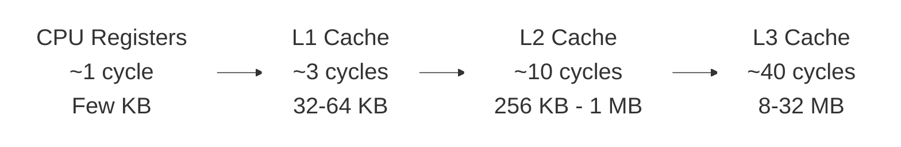
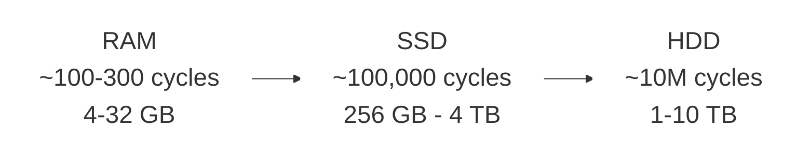

# Dr. Mindaugas Šarpis

# Best Research and Data Analysis Practices from CERN

## Computing Infrastructure

##### <span class="aims-badge">🔧 tool-agnostic · ⚙️ automation</span>

<!--
Speaker: set the frame — this is an advanced, optional lecture on the machines
under every analysis. Promise it demystifies the vocabulary they meet in job ads
and cloud consoles. (~1 min)
-->

---
hideInToc: true
layout: quote
---

# Every data analysis depends on the hardware beneath it. Understanding **CPUs**, **memory**, **storage**, and **accelerators** helps you write faster code, choose the right tools, and make the most of the machines you work with.

---
hideInToc: true
---

# Learning **Objectives**

<div class="note-text mt-sm">By the end of this lecture, you will be able to:</div>

<div class="stack-tight mt-sm">

<div class="card card-primary card-glass pad-compact">

🧠 Read a **CPU** spec — cores, clock, and cache — and know what each buys you

</div>

<div class="card card-secondary card-glass pad-compact">

💾 Navigate the **memory hierarchy** and why data locality drives speed

</div>

<div class="card card-accent card-glass pad-compact">

🚀 Compare **storage** — HDD, SSD, NVMe — by speed and latency

</div>

<div class="card card-success card-glass pad-compact">

🎮 Recognize when a **GPU** or accelerator wins — parallel workloads

</div>

<div class="card card-warning card-glass pad-compact">

🔍 Inspect **your own machine** and match hardware to the task

</div>

</div>

<!--
Speaker: read these as promises, not a syllabus. Frame the lecture as the "why"
behind the machines they use daily — the paired Seminar 15 scales their pipeline
up onto a bigger machine. Set the expectation. (~1 min)
-->

---
hideInToc: true
---

# Why Hardware Matters for Data Analysis

<div class="grid-2 mt-md gap-md">

<div class="card card-primary card-glass pad-tight">

## 🚀 **Performance**

The difference between a 10-second and a 10-hour analysis often comes down to hardware choices — memory size, storage speed, and whether you use a GPU

</div>

<div class="card card-secondary card-glass pad-tight">

## 🧠 **Informed Decisions**

Understanding what's under the hood helps you choose the right cloud instance, optimize your code, and debug performance bottlenecks

</div>

<div class="card card-accent card-glass pad-tight">

## 💡 **Vocabulary**

You will encounter terms like CPU cores, RAM, NVMe, and GPU acceleration constantly — in job descriptions, documentation, and team discussions

</div>

<div class="card card-info card-glass pad-tight">

## 🔬 **CERN Scale**

CERN processes petabytes of data using massive computing grids — the same principles apply at every scale, from your laptop to a data centre

</div>

</div>

---
layout: fact
hideInToc: true
---

#  What constitutes **computing infrastructure**?

<!--
Speaker: ask the room to shout out components before revealing the next slide —
they name CPU and RAM, rarely I/O, networking, or cooling. (~1 min)
-->

---
hideInToc: true
---

# Hardware Components

<div class="grid-3 mt-md gap-md">

<div class="card card-primary card-glass pad-tight">

## 🖥️ **Core Processing**

- Central Processing Unit (**CPU**)
- Specialized Processors (**GPUs**, **TPUs**)

</div>

<div class="card card-secondary card-glass pad-tight">

## 💾 **Memory & Storage**

- Memory (**RAM**)
- Storage Devices (**HDD, SSD, NVMe**)

</div>

<div class="card card-accent card-glass pad-tight">

## 🔌 **I/O & Connectivity**

- Input/Output (**I/O**) Devices
- Networking

</div>

<div class="card card-info card-glass pad-tight">

## ⚡ **Infrastructure**

- Power and Cooling
- Monitoring and Management Tools

</div>

<div class="card card-warning card-glass pad-tight">

## 🔒 **Security**

- Physical and logical security
- Access control

</div>

</div>

---
layout: section
hideInToc: true
---

# The **CPU**

<!--
Speaker: the processor everyone knows by name but few can describe. Preview the
three levers that actually matter — clock, cores, cache. (~30 sec)
-->

---
hideInToc: true
---

# CPU (Central Processing Unit)

<div class="grid-2 mt-md gap-md">

<div class="card card-primary card-glass pad-tight">

## 🧠 **What It Does**

Basic arithmetic, logic, control, and input/output operations

</div>

<div class="card card-secondary card-glass pad-tight">

## 🔧 **CPU Sub-Components**

<div class="stack-tight">

<div class="card card-info card-glass pad-compact">⚙️ **Control Unit (CU)** — directs operations</div>

<div class="card card-accent card-glass pad-compact">➕ **Arithmetic Logic Unit (ALU)** — math & logic</div>

<div class="card card-success card-glass pad-compact">📋 **Registers** — fastest storage</div>

<div class="card card-warning card-glass pad-compact">💨 **Cache** — near-CPU memory</div>

<div class="card card-primary card-glass pad-compact">🔀 **Buses** — data pathways</div>

</div>

</div>

</div>

---
hideInToc: true
---

# CPU Performance Factors

<div class="grid-2 mt-md gap-md">

<div class="card card-primary card-glass pad-tight">

## ⏱️ **Clock Speed**

How many cycles per second the CPU can execute — modern CPUs run at **3–5 GHz** (billions of cycles per second)

</div>

<div class="card card-secondary card-glass pad-tight">

## 🔢 **Number of Cores**

More cores enable parallel execution — laptops typically have **4–16 cores**, servers up to **128+**

</div>

<div class="card card-info card-glass pad-tight">

## 💨 **Cache Size**

Larger caches reduce memory access latency — typically **32 KB** (L1) to **32 MB** (L3) per chip

</div>

<div class="card card-accent card-glass pad-tight">

## 🔋 **Power Efficiency**

Performance per watt matters — a laptop CPU uses **15–45W**, top server chips now exceed **400W** TDP

</div>

</div>

---
hideInToc: true
layout: image
image: /figures/cpu1.avif
---

<div class="absolute bottom-4 left-4 right-4">
<div class="card card-primary card-glass pad-compact" style="background: rgba(0,0,0,0.7);">

A modern multi-core CPU die — the complex circuitry visible on the silicon wafer integrates billions of transistors for processing, cache, and I/O.

</div>
</div>

---
hideInToc: true
layout: image
image: /figures/cpu2.jpg
---

<div class="absolute bottom-4 left-4 right-4">
<div class="card card-primary card-glass pad-compact" style="background: rgba(0,0,0,0.7);">

Close-up of a CPU package mounted on a motherboard. The metal heat spreader covers the silicon die and conducts heat to the cooler above.

</div>
</div>

---
hideInToc: true
layout: image
image: /figures/cpu_apple_M4.webp
---

<div class="absolute bottom-4 left-4 right-4">
<div class="card card-primary card-glass pad-compact" style="background: rgba(0,0,0,0.7);">

Apple M4 system-on-chip (SoC) — integrates CPU, GPU, and Neural Engine on a single die, with unified LPDDR memory co-packaged alongside it for maximum efficiency.

</div>
</div>

---
layout: section
hideInToc: true
---

# Memory & **Storage**

<!--
Speaker: the theme here is a speed/capacity trade-off — fast and small at the
top, slow and huge at the bottom. This sets up the memory hierarchy later.
(~30 sec)
-->

---
hideInToc: true
---

# RAM (Random Access Memory)

<div class="grid-2 mt-md gap-md">

<div class="card card-primary card-glass pad-tight">

## 📝 **Characteristics**

- **Volatile memory** — data lost on power-off
- **High-Speed Access** — orders of magnitude faster than disk
- **Temporary Storage** — working space for active processes

</div>

<div class="card card-secondary card-glass pad-tight">

## 📊 **Specifications**

- **Capacity** — measured in GB or TB
- **Performance** — measured in MHz or GHz
- Determines how much data can be processed simultaneously

</div>

</div>

---
hideInToc: true
layout: image
image: https://miro.medium.com/v2/resize:fit:1400/format:webp/0*6k9X6LPiM4XKyssm.jpg
---

<div class="absolute bottom-4 left-4 right-4">
<div class="card card-secondary card-glass pad-compact" style="background: rgba(0,0,0,0.7);">

Desktop RAM modules (DIMMs) — each stick contains multiple memory chips that provide fast, volatile storage for active programs and data.

</div>
</div>

---
hideInToc: true
layout: image
image: https://www.pcworld.com/wp-content/uploads/2023/04/corsair-dominator-memory-100884308-orig-1.jpg?quality=50&strip=all
---

<div class="absolute bottom-4 left-4 right-4">
<div class="card card-secondary card-glass pad-compact" style="background: rgba(0,0,0,0.7);">

High-performance DDR memory with heat spreaders. Overclocking-grade RAM uses custom PCB designs and binned chips for higher clock speeds.

</div>
</div>

---
hideInToc: true
layout: center
---


<div class="card card-secondary card-glass pad-compact mt-sm">

Laptop SO-DIMM modules — smaller, removable modules. Many modern ultrabooks instead solder DRAM chips directly to the board (not SO-DIMMs) to save space.

</div>

---
hideInToc: true
---

# Storage Devices

<div class="grid-2 mt-md gap-md">

<div class="card card-primary card-glass pad-tight">

## 💿 **Mechanical**

- **HDD** (Hard Disk Drive) — spinning platters, high capacity, slower

</div>

<div class="card card-secondary card-glass pad-tight">

## ⚡ **Solid State**

- **SSD** (Solid State Drive) — flash memory, faster, no moving parts
- **SSHD** (Solid State Hybrid Drive) — combines HDD + flash cache

</div>

<div class="card card-accent card-glass pad-tight" style="grid-column: 1 / -1;">

## 🚀 **NVMe** (Non-Volatile Memory Express)

Direct PCIe connection — fastest consumer storage available

</div>

</div>

<div style="margin-top: 2rem; text-align: center;">


</div>

---
hideInToc: true
layout: center
---


<div class="card card-accent card-glass pad-compact mt-sm">

Inside a hard disk drive (HDD) — spinning magnetic platters with a read/write head. Typical speeds: 5400–7200 RPM.

</div>

---
hideInToc: true
layout: image
image: /figures/hdd_schematic.png
backgroundSize: contain
---

<div class="absolute bottom-4 left-4 right-4">
<div class="card card-accent card-glass pad-compact" style="background: rgba(0,0,0,0.7);">

HDD schematic — data is stored in concentric tracks on the platter surface. The actuator arm positions the head over the correct track to read or write data.

</div>
</div>

---
hideInToc: true
layout: image
image: /figures/hdd_magnetic_domains.png
backgroundSize: contain
---

<div class="absolute bottom-4 left-4 right-4">
<div class="card card-accent card-glass pad-compact" style="background: rgba(0,0,0,0.7);">

Magnetic domains on an HDD platter — each bit is stored as the orientation of a tiny magnetic region. Smaller domains allow higher storage density.

</div>
</div>

---
hideInToc: true
layout: center
---


<div class="card card-accent card-glass pad-compact mt-sm">

A solid-state drive (SSD) — no moving parts means faster access, lower latency, and better shock resistance than HDDs.

</div>

---
hideInToc: true
layout: center
---


<div class="card card-accent card-glass pad-compact mt-sm">

NVMe M.2 drive — connects directly to the PCIe bus, bypassing SATA. PCIe 5.0 drives reach 12–14 GB/s sequential reads.

</div>

---
hideInToc: true
layout: image
image: /figures/ssd_floating_gate_3d.webp
backgroundSize: contain
---

<div class="absolute bottom-4 left-4 right-4">
<div class="card card-accent card-glass pad-compact" style="background: rgba(0,0,0,0.7);">

3D NAND flash architecture — memory cells are stacked vertically in layers, dramatically increasing storage density without shrinking individual cell sizes.

</div>
</div>

---
hideInToc: true
layout: image
image: /figures/ssd_floating_gate.png
backgroundSize: contain
---

<div class="absolute bottom-4 left-4 right-4">
<div class="card card-accent card-glass pad-compact" style="background: rgba(0,0,0,0.7);">

Floating gate transistor — the core storage mechanism of flash memory. Electrons trapped on the floating gate change the transistor's threshold voltage to represent 0 or 1.

</div>
</div>

---
hideInToc: true
layout: section
---

# Input/Output (I/O) **Devices**

---
hideInToc: true
---

# Input/Output (I/O) Devices

<div class="grid-2 mt-md gap-md">

<div class="card card-primary card-glass pad-tight">

## 🔌 **What Is I/O?**

Any transfer of data **into** or **out of** the CPU — reading files from disk, receiving network packets, or sending output to a display.

</div>

<div class="card card-secondary card-glass pad-tight">

## 🚌 **Common I/O Interfaces**

- **PCIe** — high-speed internal bus (GPUs, NVMe, network cards)
- **USB** — universal external connectivity
- **SATA** — storage device interface
- **Ethernet / InfiniBand** — network data transfer

</div>

<div class="card card-accent card-glass pad-tight">

## 🚧 **The I/O Bottleneck**

I/O is typically the **slowest link** in the data pipeline. A fast CPU waiting on a slow disk read is effectively idle — this is why SSDs, caching, and async I/O matter.

</div>

<div class="card card-info card-glass pad-tight">

## 📊 **Why It Matters for Analysis**

Reading a large dataset from disk or over a network often dominates total runtime. Choosing the right storage, format, and access pattern can cut I/O time by orders of magnitude.

</div>

</div>

---
layout: section
hideInToc: true
---

# Specialized **Processors**

<!--
Speaker: pivot from "one fast core" to "thousands of small cores" — motivate why
GPUs and accelerators exist for parallel, data-heavy workloads. (~30 sec)
-->

---
hideInToc: true
---

# Specialized Processors

<div class="grid-2 mt-md gap-md">

<div class="card card-primary card-glass pad-tight">

## 🎮 **GPU** (Graphics Processing Unit)

Massively parallel — thousands of small cores for throughput

</div>

<div class="card card-secondary card-glass pad-tight">

## 🤖 **TPU** (Tensor Processing Unit)

Google-designed accelerator optimized for ML tensor operations

</div>

<div class="card card-accent card-glass pad-tight">

## 🔧 **FPGA** (Field-Programmable Gate Array)

Reconfigurable hardware — customizable logic for specific tasks

</div>

<div class="card card-info card-glass pad-tight">

## 🏭 **ASIC** (Application-Specific Integrated Circuit)

Fixed-function chip — maximum efficiency for a single task

</div>

</div>

---
hideInToc: true
---

# GPU (Graphics Processing Unit)

<div class="grid-2 mt-md gap-md">

<div class="card card-primary card-glass pad-tight">

## 🎯 **Primary Uses**

- Graphics Rendering
- Parallel Processing Power
- Video Processing and Encoding

</div>

<div class="card card-secondary card-glass pad-tight">

## 🔬 **Scientific Applications**

- Accelerating Machine Learning and AI
- Scientific and Data Analysis Computing
- Simulation and modelling

</div>

</div>

---
hideInToc: true
layout: center
---


<div class="card card-primary card-glass pad-compact mt-sm">

A modern GPU — thousands of parallel cores under the cooler, designed for high-throughput computation.

</div>

---
hideInToc: true
layout: image
image: https://cdn.mos.cms.futurecdn.net/xd2Hw9Cki3qhzbC2WxNBcA.jpg
---

<div class="absolute bottom-4 left-4 right-4">
<div class="card card-primary card-glass pad-compact" style="background: rgba(0,0,0,0.7);">

GPU die shot — the highly regular grid pattern reflects the SIMD architecture: thousands of identical cores executing the same instruction on different data in parallel.

</div>
</div>

---
hideInToc: true
---

<VideoPlayer src="CPU_vs_GPU_Demo.mp4" autoplay />

<!-- CPU vs GPU visualized (fetched via videos.py fetch; was a YouTube embed) -->


---
layout: section
hideInToc: true
---

# Infrastructure & **Software**

---
hideInToc: true
---

# Infrastructure & Operations

<div class="grid-3 mt-md gap-md">

<div class="card card-primary card-glass pad-tight">

## ⚡ **Power and Cooling**

Reliable power supply, UPS systems, and thermal management for sustained operation

</div>

<div class="card card-secondary card-glass pad-tight">

## 🌐 **Networking**

Interconnects, bandwidth, latency — moving data between components and systems

</div>

<div class="card card-info card-glass pad-tight">

## 📈 **Monitoring & Management**

System health, resource utilization, alerting, and capacity planning tools

</div>

</div>

---
hideInToc: true
---

# Security, Software & Cloud

<div class="grid-3 mt-md gap-md">

<div class="card card-warning card-glass pad-tight">

## 🔒 **Security**

Access control, encryption, firewalls, intrusion detection — protecting data and infrastructure

</div>

<div class="card card-accent card-glass pad-tight">

## 💻 **Software**

Operating systems, drivers, middleware, and application software that runs on the hardware

</div>

<div class="card card-success card-glass pad-tight">

## ☁️ **Virtualization & Cloud**

Abstract hardware into virtual machines and containers — scalable, on-demand resources

</div>

</div>

---
hideInToc: true
---

# Software Components

<div class="grid-2 mt-md gap-md">

<div class="card card-primary card-glass pad-tight">

## 🖥️ **Operating Systems**

- 🪟 **Windows** — desktop, enterprise
- 🍎 **macOS** — Apple ecosystem
- 🐧 **Linux** — servers, HPC, science

</div>

<div class="card card-secondary card-glass pad-tight">

## 🔗 **Middleware & Applications**

- **Middleware** and Virtualization — bridges OS and applications
- **Application** Software — the tools you actually use for analysis

</div>

</div>

---
layout: section
hideInToc: true
---

# The Memory **Hierarchy**

---
hideInToc: true
---

# The Memory Hierarchy

<div style="text-align: center;">





</div>

---
hideInToc: true
---

# Memory Access Times

<div class="card card-info card-glass pad-tight mt-md">

## ⏱️ **Latency Comparison**

| **Storage Type** | **Access Time** | **Relative Latency** |
|------------------|-----------------|-------------------|
| CPU Register     | 1 ns            | 1x                |
| L1 Cache         | 2-4 ns          | 2-4x              |
| L2 Cache         | 10-20 ns        | 10-20x            |
| RAM              | 100-300 ns      | 100-300x          |
| SSD              | 100 μs          | 100,000x          |
| HDD              | 10 ms           | 10,000,000x       |

</div>

---
hideInToc: true
---

# Why This Matters for Data Analysis

<div class="grid-2 mt-md gap-md">

<div class="card card-primary card-glass pad-tight">

## 📍 **Locality Matters**

Keep related data close together in memory — sequential access patterns are dramatically faster than random access

</div>

<div class="card card-secondary card-glass pad-tight">

## ⚡ **Vectorization**

Process arrays in chunks that fit in cache — SIMD instructions can operate on multiple data points simultaneously

</div>

<div class="card card-accent card-glass pad-tight">

## 📂 **File Formats**

Columnar formats (Parquet) are cache-friendly — read only the columns you need instead of entire rows

</div>

<div class="card card-warning card-glass pad-tight">

## 🧮 **Algorithm Choice**

Memory access patterns affect performance more than computation — an algorithm with better locality often beats a "faster" one

</div>

</div>

<div class="note-text mt-sm">

💡 You've already used both: NumPy **vectorization** and **Parquet** from Lecture 13 are this hierarchy exploited in practice.
</div>

---
hideInToc: true
---

<VideoPlayer src="How_Computer_Memory_Works.mp4" autoplay />

<!-- How computer memory works (fetched via videos.py fetch; was a YouTube embed) -->

---
hideInToc: true
---

# Exercise — Know Your Machine

<div class="grid-2 mt-md gap-md">

<div class="card card-primary card-glass pad-tight">

## 🖥️ **macOS / Linux**

```bash
# CPU info
sysctl -n machdep.cpu.brand_string  # macOS
lscpu                                # Linux

# RAM
sysctl -n hw.memsize      # macOS (bytes)
free -h                    # Linux

# Disk
df -h
```

</div>

<div class="card card-secondary card-glass pad-tight">

## 🪟 **Windows (PowerShell)**

```powershell
# CPU info
Get-WmiObject Win32_Processor | Select Name

# RAM
(Get-CimInstance Win32_PhysicalMemory |
  Measure -Property Capacity -Sum).Sum / 1GB

# Disk
Get-PSDrive C
```

</div>

</div>

<div class="card card-info card-glass pad-compact mt-md">

## 🎯 **Try it now**

Open a terminal and find out: How many CPU cores do you have? How much RAM? What type of storage (HDD or SSD)?

</div>

---
layout: section
hideInToc: true
---

# Parallelism for **Data Analysis**

<!--
Speaker: their laptop has 8+ cores; a plain Python script uses one. This section
closes that gap — in the right order: vectorise, then processes, then many
machines. (~30 sec)
-->

---
hideInToc: true
---

# The Free Lunch Is Over

<div class="grid-2 mt-md gap-md">

<div class="card card-primary card-glass pad-tight">

## 🧱 **The clock ceiling**

Around **2005**, CPU clocks hit a **power and heat wall** near 4 GHz — frequencies have barely moved since

</div>

<div class="card card-secondary card-glass pad-tight">

## 🔢 **Transistors became cores**

Moore's law kept shrinking transistors, so vendors spent them on **more cores**, wider **SIMD** units, and bigger caches

</div>

<div class="card card-accent card-glass pad-tight">

## 🐌 **Serial code stopped speeding up**

For decades, old programs got faster with every new CPU — that free lunch is over: one core today is barely faster than one core ten years ago

</div>

<div class="card card-info card-glass pad-tight">

## 🎯 **Your move**

Extra speed now comes from **using all the cores** — vectorise, parallelise, and distribute your analysis

</div>

</div>

---
hideInToc: true
---

# Vectorisation: the First Parallelism

<div class="grid-2 mt-md gap-md">

<div class="card card-primary card-glass pad-tight">

## 🐍 **The interpreter tax**

A Python `for` loop pays **per-element overhead** — type checks, boxing, dispatch — often ~100× the cost of the arithmetic itself

</div>

<div class="card card-secondary card-glass pad-tight">

## ⚡ **One call, one C loop**

`np.sqrt(px**2 + py**2)` runs a **compiled loop** over contiguous memory and uses **SIMD** — the memory hierarchy exploited for you

</div>

</div>

<div class="note-text mt-sm">

💡 Order of operations: **vectorise first**, parallelise second — a 50× vectorisation win beats an 8-core speedup, and the two multiply.
</div>

---
hideInToc: true
---

# Vectorisation, Measured

```py {monaco-run} {autorun:false}
import numpy as np, time, math

n = 100_000
px, py = np.random.rand(n), np.random.rand(n)

t = time.perf_counter()
pt_loop = [math.sqrt(px[i]**2 + py[i]**2) for i in range(n)]
t_loop = time.perf_counter() - t

t = time.perf_counter()
pt_vec = np.sqrt(px**2 + py**2)
t_vec = time.perf_counter() - t

print(f"Python loop: {t_loop*1000:8.1f} ms")
print(f"NumPy:       {t_vec*1000:8.1f} ms   ({t_loop/t_vec:.0f}x faster)")
```

<div class="note-text mt-sm">

Same arithmetic, same machine — only the **loop's location** changed: interpreter vs compiled C. This is *why* the Lecture 13 speed gap exists.
</div>

---
hideInToc: true
---

# Processes vs Threads

<div class="grid-2 mt-md gap-md">

<div class="card card-primary card-glass pad-tight">

## 🧵 **Threads**

- Live **inside one process** and share its memory
- Cheap to start, easy to pass data around
- Danger: **race conditions** on shared state
- Great for **waiting** — I/O, downloads, disk

</div>

<div class="card card-secondary card-glass pad-tight">

## 🧩 **Processes**

- Own **separate memory** — isolated by the OS
- Heavier: startup cost, data is **copied** between them
- No shared-state bugs by construction
- Great for **computing** — true multi-core work

</div>

</div>

<div class="note-text mt-sm">

🔧 Every language offers both; the trade-off is universal. Python adds one famous twist → next slide.
</div>

---
hideInToc: true
---

# The Python GIL, Honestly

<div class="grid-2 mt-md gap-md">

<div class="card card-warning card-glass pad-tight">

## 🔒 **One interpreter at a time**

The **Global Interpreter Lock** lets only one thread execute Python bytecode at once — threads give **no speedup** for CPU-bound pure Python

</div>

<div class="card card-success card-glass pad-tight">

## ✅ **When threads still win**

The GIL is **released while waiting** on I/O — and inside NumPy/C extensions, so vectorised code can still use many cores under the hood

</div>

<div class="card card-info card-glass pad-tight">

## 🧩 **CPU-bound? Use processes**

`multiprocessing` and `ProcessPoolExecutor` sidestep the GIL with one interpreter per core

</div>

<div class="card card-accent card-glass pad-tight">

## 🔮 **The future**

Python 3.13+ ships an experimental **free-threaded** build without a GIL — the ecosystem is still catching up

</div>

</div>

---
hideInToc: true
---

# Embarrassingly Parallel Analysis

<div class="card card-primary card-glass pad-compact mt-sm">

## 😎 **The best kind of parallel**

Chunks are **fully independent** — no communication needed. Analysis work is full of them: **files, runs, parameter sets, toy experiments**.

</div>

<div class="grid-2 mt-sm gap-md">

<div class="card card-secondary card-glass pad-compact">

### 🐍 **In Python**

```py
from concurrent.futures import ProcessPoolExecutor

with ProcessPoolExecutor() as ex:
    results = list(ex.map(process_file, files))
```

</div>

<div class="card card-accent card-glass pad-compact">

### 🖥️ **In the shell**

```bash
parallel python fit.py {} ::: data/*.csv
```

One process per file, all cores busy.

</div>

</div>

<div class="note-text mt-sm">

💡 The pattern: **map** each file to a partial result, then **merge** — this is exactly how grid jobs split work, too.
</div>

---
hideInToc: true
---

# Amdahl's Law — the Speedup Ceiling

<div class="grid-2 mt-md gap-md">

<div class="card card-primary card-glass pad-tight">

## 📉 **The serial part rules**

If a fraction **s** of the runtime is serial, no number of cores can beat **1/s**:

speedup = 1 / (s + (1 − s) / N)

</div>

<div class="card card-info card-glass pad-tight">

## 🧮 **Ceiling by parallel share**

| **Parallel share** | **Max speedup (∞ cores)** |
|--------------------|---------------------------|
| 50%                | 2×                        |
| 90%                | 10×                       |
| 99%                | 100×                      |

</div>

</div>

<div class="note-text mt-sm">

💡 Loading and merging are the usual serial parts — which is why I/O and file formats (next section) matter as much as cores.
</div>

---
layout: section
hideInToc: true
---

# Storage **Formats** for Analysis Data

<!--
Speaker: hardware set the speed limits; the file format decides how close you
get to them. Same data, 10–100× different read times. (~30 sec)
-->

---
hideInToc: true
---

# Row vs Columnar Layout

<div class="grid-2 mt-md gap-md">

<div class="card card-primary card-glass pad-tight">

## 📋 **Row layout**

- Records stored **one after another** — all fields together
- Natural for **transactions** and appending events
- Reading one column drags **every other field** off disk too

</div>

<div class="card card-secondary card-glass pad-tight">

## 📊 **Columnar layout**

- Each **column stored contiguously** on disk
- Analysis touches **few columns of many rows** — read only those
- Similar values sit together → **compresses better**, cache-friendly

</div>

</div>

<div class="note-text mt-sm">

🎯 Analysis queries are columnar by nature: "the mass of *every* candidate", not "everything about candidate 42".
</div>

---
hideInToc: true
---

# Four Formats You Will Meet

<div class="card card-info card-glass pad-tight mt-md">

## 🗃️ **Same table, four containers**

| **Format** | **Layout** | **Types/schema** | **Compression** | **Best at** |
|------------|------------|------------------|-----------------|-------------|
| CSV        | row, plain text | ❌ guessed on read | ❌ (external gzip) | small tables, interchange |
| Parquet    | columnar, binary | ✅ stored | ✅ built-in | big-table analysis |
| HDF5       | chunked n-dim arrays | ✅ stored | ✅ optional | numeric arrays, images |
| ROOT       | columnar event trees | ✅ stored | ✅ built-in | HEP events at petabyte scale |

</div>

---
hideInToc: true
---

# CSV — Simple, Honest, Slow

<div class="grid-2 mt-md gap-md">

<div class="card card-success card-glass pad-tight">

## ✅ **Why it survives**

- Human-readable, diff-able, **every tool** on Earth opens it
- Perfect for **small tables**, examples, and hand-offs

</div>

<div class="card card-warning card-glass pad-tight">

## ⚠️ **What it costs**

- **No types** — "42" might be an int, a string, a date (the guessing bugs from Lecture 13)
- Every read **parses every byte** of every column
- Typically **5–10× larger** than the same data in Parquet

</div>

</div>

<div class="note-text mt-sm">

📏 Rule of thumb: CSV is fine below ~100 MB; for repeated analysis, convert once and read the binary format after that.
</div>

---
hideInToc: true
---

# Parquet — the Columnar Workhorse

<div class="grid-2 mt-md gap-md">

<div class="card card-primary card-glass pad-tight">

## ✂️ **Column pruning**

`pd.read_parquet(f, columns=["mass"])` touches only that column's bytes — reading 3 of 50 columns skips ~94% of the file

</div>

<div class="card card-secondary card-glass pad-tight">

## 📦 **Row groups + statistics**

Data is stored in row groups with **min/max stats** — engines skip whole chunks that cannot match your filter

</div>

<div class="card card-info card-glass pad-tight">

## 🔤 **Typed schema**

dtypes are **stored, not guessed** — a table round-trips exactly, no parsing surprises

</div>

<div class="card card-accent card-glass pad-tight">

## 🤝 **Ecosystem standard**

pandas, Polars, Spark, DuckDB, and Arrow all speak it natively — the default for tabular analysis data

</div>

</div>

---
hideInToc: true
---

# HDF5 & ROOT — Scientific Heavyweights

<div class="grid-2 mt-md gap-md">

<div class="card card-primary card-glass pad-tight">

## 🗄️ **HDF5**

- A **"filesystem in a file"** — hierarchical groups of n-dimensional arrays
- **Chunking + compression** per dataset; read any slice without loading the rest
- Standard across astronomy, climate science, and imaging

</div>

<div class="card card-secondary card-glass pad-tight">

## ⚛️ **ROOT**

- CERN's native format — **columnar event trees** (TTree, now RNTuple)
- Stores **objects too**: histograms, fits, calibrations
- Holds **exabytes** of physics data worldwide; readable from Python via `uproot`

</div>

</div>

---
hideInToc: true
---

# Compression: CPU vs Disk vs Network

<div class="grid-3 mt-md gap-md">

<div class="card card-primary card-glass pad-tight">

## ⚖️ **The trade**

Compression spends **CPU cycles** to save **bytes** — worth it whenever disk or network is the bottleneck (it usually is)

</div>

<div class="card card-secondary card-glass pad-tight">

## 🐇 **Fast codecs**

**lz4, zstd, snappy** decompress at GB/s — reading compressed data is often *faster* than reading uncompressed

</div>

<div class="card card-accent card-glass pad-tight">

## 🐢 **Strong codecs**

**gzip, xz** squeeze harder but run slower — good for cold archives, not for hot analysis data

</div>

</div>

<div class="note-text mt-sm">

💡 Safe default in 2026: **zstd** — near-gzip ratios at many times the speed.
</div>

---
hideInToc: true
---

<MCQ
  question="You repeatedly scan 3 columns of a 100 GB, 50-column table. Which storage choice serves this workload best?"
  :options="[
    'Plain CSV, because any tool can read it and simplicity always wins',
    'Parquet with compression — read only the 3 columns and skip row groups via their statistics',
    'Gzipped CSV — the file is smaller, so scans must be faster',
    'Keep CSV but buy more RAM so the whole table fits in memory'
  ]"
  :correct="1"
  explanation="A columnar format reads only the bytes of the columns you ask for, and row-group statistics let engines skip data that cannot match. Gzipped CSV still decompresses and parses every byte of every column; RAM does not fix the first slow read."
/>

---
layout: section
hideInToc: true
---

# Beyond **One Machine**

<!--
Speaker: everything so far described a single box. Real analysis often outgrows
it — and this is exactly what Seminar 15 asks: run the pipeline unattended, then
at scale. Keep it practical. (~30 sec)
-->

---
hideInToc: true
---

# Running Unattended

<div class="card card-info card-glass pad-compact mt-sm">

## ⏳ **Keep the job running after you log out**

A long analysis shouldn't die when you close the laptop — send it to the background and log everything to a file.

</div>

<div class="grid-2 mt-sm gap-md">

<div class="card card-primary card-glass pad-compact">

### 🚀 **nohup — fire and forget**

```bash
nohup python analysis.py > run.log 2>&1 &
tail -f run.log   # watch progress live
```

Survives logout; all output lands in `run.log`.

</div>

<div class="card card-secondary card-glass pad-compact">

### 🖥️ **screen / tmux — resumable session**

```bash
tmux new -s run     # start; launch your job
# detach: Ctrl-b d — reconnect later:
tmux attach -t run
```

Reconnect from anywhere; the job stays alive.

</div>

</div>

<div class="note-text mt-sm">

💡 Seminar 15's core task: `nohup make all > run.log 2>&1 &`, then inspect `run.log`. ⚙️
</div>

---
hideInToc: true
---

# Batch Schedulers

<div class="grid-2 mt-sm gap-md">

<div class="card card-primary card-glass pad-compact">

## 🎟️ **What they do**

On a shared cluster you don't run jobs directly — you **submit** them:

**queue → allocate → run → collect**

You describe the resources you need; the scheduler finds a free node, runs the job, and saves the output. **Slurm** and **HTCondor** are the common ones.

</div>

<div class="card card-secondary card-glass pad-compact">

## 📝 **A minimal Slurm job**

```bash
#!/bin/bash
#SBATCH --job-name=d0
#SBATCH --cpus-per-task=4
#SBATCH --mem=8G
#SBATCH --time=01:00:00
make all
```

Submit with `sbatch job.sh`, watch with `squeue`.

</div>

</div>

<div class="note-text mt-sm">

HTCondor — which powers CERN's grid batch farm — is the same idea with a `submit` file.
</div>

---
hideInToc: true
---

# The Worldwide LHC Computing Grid

<div class="grid-2 mt-sm gap-md">

<div class="card card-info card-glass pad-compact">

## 🌍 **The "Planet-Sized Computer" (Lecture 02)**

No single centre can process the LHC's data, so CERN federates hundreds of sites into one grid:

- **170+ sites** across **42 countries**
- **~1.4 million CPU cores**, hundreds of petabytes/year
- Tiered: **Tier-0** (CERN) → **Tier-1** → **Tier-2**

</div>

<div class="card card-secondary card-glass pad-compact">

## 🔀 **Move the work to the data**

The grid ships **jobs** to the sites that already hold the **data** — shifting petabytes around is the real cost.

A physicist rarely knows *which country* their jobs run in. Your `sbatch` / HTCondor script is the same idea at small scale: describe the job, let the system place it.

</div>

</div>

---
hideInToc: true
---

# Cloud vs On-Prem / Cluster

<div class="grid-3 mt-sm gap-md">

<div class="card card-success card-glass pad-compact">

## ☁️ **Cloud** (AWS, GCP, Azure)

- ✅ **Elastic** — 1000 cores for an hour, then gone
- ✅ No hardware to own or maintain
- ⚠️ Pay per second — and per GB moved **out**
- ⚠️ Data must first travel to the cloud

</div>

<div class="card card-primary card-glass pad-compact">

## 🏛️ **On-prem cluster / HPC**

- ✅ **Cheap per core** once it's bought
- ✅ **Data is local** — no egress fees
- ⚠️ Fixed capacity — you queue for it
- ⚠️ Someone has to maintain it

</div>

<div class="card card-accent card-glass pad-compact">

## ⚖️ **The trade-off**

**Elasticity vs cost vs data locality.**

Bursty, occasional work → cloud. Steady, data-heavy work next to a big dataset → cluster.

</div>

</div>

---
hideInToc: true
---

# When to Scale Up

<div class="card card-info card-glass pad-compact mt-sm">

## 🧭 **Three questions pick the machine**

**Data size** · **wall-time** · **repetition** — how big, how long, how many times?

</div>

<div class="grid-3 mt-sm gap-md">

<div class="card card-success card-glass pad-compact">

### 💻 **Laptop**

Fits in RAM, runs in minutes, a handful of times. Most of this course lives here.

</div>

<div class="card card-secondary card-glass pad-compact">

### 🖥️ **Lab box / workstation**

Data too big, or runs take hours. More RAM and cores — leave it overnight with `nohup`.

</div>

<div class="card card-accent card-glass pad-compact">

### 🏛️ **Cluster / grid**

Many files or parameter sets — embarrassingly parallel. Submit once, collect hundreds of results.

</div>

</div>

<div class="note-text mt-sm">

💡 Scale up only when a smaller machine actually blocks you — a tidy pipeline (Lecture 14) makes moving up trivial.
</div>

---
hideInToc: true
---

# Key Takeaways

<div class="grid-2 mt-md gap-md">

<div class="card card-primary card-glass pad-tight">

## 🧠 **CPU**

The brain of computation — clock speed, cores, and cache determine how fast you can crunch numbers

</div>

<div class="card card-secondary card-glass pad-tight">

## 💾 **Memory Hierarchy**

Speed and cost trade off — registers are fastest, disk is cheapest. Keeping data close to the CPU is key

</div>

<div class="card card-accent card-glass pad-tight">

## 🎮 **Specialized Hardware**

GPUs and other accelerators enable massive parallelism for data-intensive and ML workloads

</div>

<div class="card card-info card-glass pad-tight">

## 📊 **Why It Matters**

Understanding hardware helps you choose the right tools, write faster code, and avoid bottlenecks in your data analysis pipelines

</div>

</div>

---
hideInToc: true
---

<MCQ
  question="Your analysis applies the same simple operation to millions of independent data points. Which hardware is best suited to accelerate it?"
  :options="[
    'A GPU — thousands of parallel cores apply the same instruction to many data points at once',
    'A single higher-clocked CPU core, since clock speed is the only thing that matters',
    'A larger HDD, because more storage capacity means faster computation',
    'More L1 cache alone, regardless of which processor runs the work'
  ]"
  :correct="0"
  explanation="A GPU's SIMD architecture runs the same instruction across thousands of small cores on different data — ideal for large, uniform, independent workloads."
/>

---
hideInToc: true
---

# **Recap** — You Can Now…

<div class="grid-2 gap-md mt-sm">

<div class="card card-success card-glass pad-compact">

✅ Read a CPU spec — **cores**, **clock**, **cache** — and know the trade-offs

</div>

<div class="card card-success card-glass pad-compact">

✅ Place data across the **memory hierarchy** for speed

</div>

<div class="card card-success card-glass pad-compact">

✅ Match **storage** — HDD / SSD / NVMe — to your I/O needs

</div>

<div class="card card-success card-glass pad-compact">

✅ Decide when a **GPU** or accelerator is worth it

</div>

</div>

<div class="card card-accent card-glass pad-tight mt-md">

## 🔬 **Seminar 15 tie-in**

run your pipeline as a batch / remote-style job at scale — the same reproducible pipeline, a bigger machine.

</div>

<!--
Speaker: this is the "you can now" beat — have them nod along to each. The
seminar tie-in makes it concrete: the same reproducible pipeline, now run at
scale on a bigger machine. (~1 min)
-->
