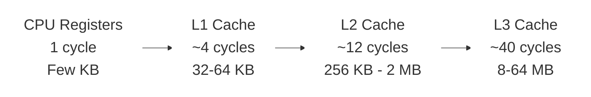
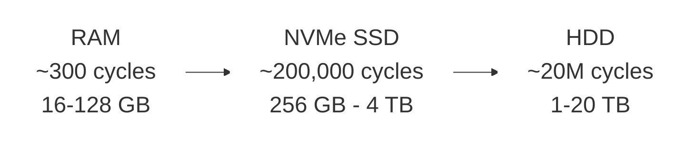

# Dr. Mindaugas Šarpis

# Best Research and Data Analysis Practices from CERN

## Computing Infrastructure

##### <span class="aims-badge">🔧 tool-agnostic · ⚙️ automation</span>

<!--
Speaker: set the frame — this is an advanced, optional lecture on the machines
under every analysis. Promise it demystifies the vocabulary they meet in job ads
and cloud consoles. (~1 min)
-->

---
hideInToc: true
layout: quote
---

# Every data analysis depends on the hardware beneath it. Understanding **CPUs**, **memory**, **storage**, and **accelerators** helps you write faster code, choose the right tools, and make the most of the machines you work with.

---
hideInToc: true
---

# Learning **Objectives**

<div class="note-text mt-sm">By the end of this lecture, you will be able to:</div>

<div class="stack-tight mt-sm">

<div class="card card-primary card-glass pad-compact">

🧠 Read a **CPU** spec — cores, clock, cache — and know what each buys you

</div>

<div class="card card-secondary card-glass pad-compact">

💾 Place data across the **memory hierarchy** and pick file formats (**Parquet**, **ROOT**) that exploit it

</div>

<div class="card card-accent card-glass pad-compact">

⚡ Speed an analysis up in the right order: **vectorise → processes → many machines**

</div>

<div class="card card-success card-glass pad-compact">

🎮 Recognise when a **GPU** or accelerator wins

</div>

<div class="card card-warning card-glass pad-compact">

🚀 Run a pipeline unattended (`nohup`, `tmux`) and describe a batch job for **Slurm / HTCondor / the grid**

</div>

</div>

<!--
Speaker: read these as promises, not a syllabus. Frame the lecture as the "why"
behind the machines they use daily — the paired Seminar 15 runs the seminar's
`make all` pipeline (starter provided) unattended, then at 10× scale. Set the
expectation. (~1 min)
-->

---
hideInToc: true
---

# Why Hardware **Matters** for Data Analysis

<div class="grid-2 mt-md gap-md">

<div class="card card-primary card-glass pad-tight">

## 🚀 **Performance**

The difference between a 10-second and a 10-hour analysis often comes down to hardware choices — memory size, storage speed, and whether you use a GPU

</div>

<div class="card card-secondary card-glass pad-tight">

## 🧠 **Informed Decisions**

Understanding what's under the hood helps you choose the right cloud instance, optimize your code, and debug performance bottlenecks

</div>

<div class="card card-accent card-glass pad-tight">

## 💡 **Vocabulary**

You will encounter terms like CPU cores, RAM, NVMe, and GPU acceleration constantly — in job descriptions, documentation, and team discussions

</div>

<div class="card card-info card-glass pad-tight">

## 🔬 **CERN Scale**

CERN processes petabytes of data using massive computing grids — the same principles apply at every scale, from your laptop to a data centre

</div>

</div>

<!--
Speaker: one concrete anchor — the same pandas script takes 4 s on a machine
where the table fits in RAM and 40 min on one where it swaps. Hardware decides.
(~2 min)
-->

---
layout: fact
hideInToc: true
---

#  What constitutes **computing infrastructure**?

<!--
Speaker: ask the room to shout out components before revealing the next slide —
they name CPU and RAM, rarely I/O, networking, or cooling. (~1 min)
-->

---
hideInToc: true
---

# Hardware **Components**

<div class="grid-2 mt-md gap-md">

<div class="card card-primary card-glass pad-tight">

## 🖥️ **Core Processing**

- Central Processing Unit (**CPU**)
- Specialized Processors (**GPUs**, **TPUs**)

</div>

<div class="card card-secondary card-glass pad-tight">

## 💾 **Memory & Storage**

- Memory (**RAM**)
- Storage Devices (**HDD, SSD, NVMe**)

</div>

<div class="card card-accent card-glass pad-tight">

## 🔌 **I/O & Connectivity**

- Input/Output (**I/O**) Devices
- Networking

</div>

<div class="card card-info card-glass pad-tight">

## ⚡ **Infrastructure**

- Power and Cooling
- Monitoring and Management Tools
- Physical and logical **security**, access control

</div>

</div>

<!--
Speaker: the top row is this lecture's first half; the bottom row is what a
data centre adds around it — we return to it in "Beyond One Machine". (~1 min)
-->

---
layout: section
hideInToc: true
---

# The **CPU**

<!--
Speaker: the processor everyone knows by name but few can describe. Preview the
three levers that actually matter — clock, cores, cache. (~30 sec)
-->

---
hideInToc: true
---

# CPU — the **Central** Processing Unit

<div class="grid-2 mt-md gap-md">

<div class="card card-primary card-glass pad-tight">

## 🧠 **What It Does**

- **Fetch** the next instruction from memory
- **Decode** it — which operation, on which operands
- **Execute** it — arithmetic, logic, load/store, jump

Billions of times per second — the fetch–decode–execute cycle from Lecture 03.

</div>

<div class="card card-secondary card-glass pad-tight">

## 🔧 **CPU Sub-Components**

<div class="stack-tight">

<div class="card card-info card-glass pad-compact">

⚙️ **Control Unit (CU)** — directs operations

</div>

<div class="card card-accent card-glass pad-compact">

➕ **Arithmetic Logic Unit (ALU)** — math & logic

</div>

<div class="card card-success card-glass pad-compact">

📋 **Registers** — fastest storage

</div>

<div class="card card-warning card-glass pad-compact">

💨 **Cache** — near-CPU memory

</div>

<div class="card card-primary card-glass pad-compact">

🔀 **Buses** — data pathways

</div>

</div>

</div>

</div>

<!--
Speaker: connect to Lecture 03 — they traced fetch–decode–execute by hand there;
this is the silicon that does it. (~2 min)
-->

---
hideInToc: true
---

# CPU **Performance** Factors

<div class="grid-2 mt-md gap-md">

<div class="card card-primary card-glass pad-tight">

## ⏱️ **Clock Speed**

How many cycles per second the CPU can execute — modern CPUs run at **3–5 GHz** (billions of cycles per second)

</div>

<div class="card card-secondary card-glass pad-tight">

## 🔢 **Number of Cores**

More cores enable parallel execution — laptops typically have **4–16 cores**, servers up to **128+**

</div>

<div class="card card-info card-glass pad-tight">

## 💨 **Cache Size**

Larger caches reduce memory access latency — typically **32 KB** (L1) to **32 MB** (L3) per chip

</div>

<div class="card card-accent card-glass pad-tight">

## 🔋 **Power Efficiency**

Performance per watt matters — a laptop CPU uses **15–45W**, top server chips now exceed **400W** TDP

</div>

</div>

<!--
Speaker: the buying guide — clock helps every program, cores only help parallel
ones, cache helps data-heavy loops. Ask which their analysis needs. (~2 min)
-->

---
hideInToc: true
---

# A **Spec Sheet**, Decoded

<div class="card card-info card-glass pad-compact mt-sm">

## 🏷️ **What the shop listing says**

`8 cores / 16 threads · 3.4 GHz base, 5.0 GHz boost · 24 MB L3 · 32 GB DDR5-5600 · 1 TB NVMe`

</div>

<div class="grid-2 mt-sm gap-md">

<div class="card card-primary card-glass pad-compact">

### 🔢 **8 cores / 16 threads**

Eight real cores; hyper-threading lets each run two threads, buying ~20–30% — not 2×. Only parallel code benefits at all

</div>

<div class="card card-secondary card-glass pad-compact">

### ⏱️ **3.4 GHz base, 5.0 GHz boost**

Boost holds on one busy core; load all eight and the clock drops toward base — a "5 GHz chip" rarely runs at 5 GHz

</div>

<div class="card card-accent card-glass pad-compact">

### 💨 **24 MB L3**

A working set that fits here never waits on RAM — a few million floats per core, roughly one histogram's worth of events

</div>

<div class="card card-success card-glass pad-compact">

### 💾 **32 GB DDR5-5600 · 1 TB NVMe**

The number that bites first: does the table fit in 32 GB? If not, the NVMe drive is your fallback — 1000× slower, still 100× better than an HDD

</div>

</div>

<!--
Speaker: read a real listing from a shop aloud and decode it together — the
"boost" and "threads" numbers are the ones marketing inflates. (~2.5 min)
-->

---
hideInToc: true
layout: image
image: /figures/cpu1.avif
---

<div class="absolute bottom-4 left-4 right-4">
<div class="card card-primary card-glass pad-compact" style="background: rgba(0,0,0,0.7);">

A packaged CPU in its motherboard socket — under the metal lid sits a die of billions of transistors: cores, cache, and I/O.

</div>
</div>

---
hideInToc: true
layout: image
image: /figures/cpu2.jpg
---

<div class="absolute bottom-4 left-4 right-4">
<div class="card card-primary card-glass pad-compact" style="background: rgba(0,0,0,0.7);">

A bare chip soldered straight to the motherboard — this one is an Intel I/O controller hub, the CPU's companion that talks to disks, USB, and the network. No lid, no socket: the die sits under a thin package.

</div>
</div>

---
hideInToc: true
layout: image
image: /figures/cpu_apple_M4.webp
---

<div class="absolute bottom-4 left-4 right-4">
<div class="card card-primary card-glass pad-compact" style="background: rgba(0,0,0,0.7);">

Apple M4 system-on-chip (SoC) — integrates CPU, GPU, and Neural Engine on a single die, with unified LPDDR memory co-packaged alongside it for maximum efficiency.

</div>
</div>

---
layout: section
hideInToc: true
---

# Memory & **Storage**

<!--
Speaker: the theme here is a speed/capacity trade-off — fast and small at the
top, slow and huge at the bottom. This sets up the memory hierarchy next.
(~30 sec)
-->

---
hideInToc: true
---

# RAM — **Random** Access Memory

<div class="grid-2 mt-md gap-md">

<div class="card card-primary card-glass pad-tight">

## 📝 **Characteristics**

- **Volatile memory** — data lost on power-off
- **High-Speed Access** — orders of magnitude faster than disk
- **Temporary Storage** — working space for active processes

</div>

<div class="card card-secondary card-glass pad-tight">

## 📊 **Specifications**

- **Capacity** — GB; decides whether your dataset fits in memory at all
- **Speed** — DDR5-5600 = 5600 MT/s, tens of GB/s of bandwidth
- Both are printed on the spec sheet — capacity is the one that bites first

</div>

</div>

<!--
Speaker: the single most useful number on a spec sheet for an analyst is RAM
capacity — "does my table fit?" — bandwidth matters once it does. (~2 min)
-->

---
hideInToc: true
layout: center
---


<div class="card card-secondary card-glass pad-compact mt-sm">

Laptop SO-DIMM modules — smaller, removable modules. Many modern ultrabooks instead solder DRAM chips directly to the board (not SO-DIMMs) to save space.

</div>

---
hideInToc: true
---

# Storage **Devices**

<div class="grid-2 mt-md gap-md">

<div class="card card-primary card-glass pad-tight">

## 💿 **Mechanical**

- **HDD** (Hard Disk Drive) — spinning platters, high capacity, slower

</div>

<div class="card card-secondary card-glass pad-tight">

## ⚡ **Solid State**

- **SSD** (Solid State Drive) — flash memory, faster, no moving parts
- **SSHD** (Solid State Hybrid Drive) — combines HDD + flash cache

</div>

<div class="card card-accent card-glass pad-tight" style="grid-column: 1 / -1;">

## 🚀 **NVMe** (Non-Volatile Memory Express)

Direct PCIe connection — fastest consumer storage available

</div>

</div>

<!--
Speaker: three generations on one slide — the mechanism (platter vs flash) and
the interface (SATA vs PCIe) are separate choices. (~1.5 min)
-->

---
hideInToc: true
layout: center
---


<div class="card card-accent card-glass pad-compact mt-sm">

A 2.5-inch laptop drive — this one is an SSHD: spinning platters (5400–7200 RPM) plus a small flash cache.

</div>

---
hideInToc: true
layout: image
image: /figures/hdd_schematic.png
backgroundSize: contain
---

<div class="absolute bottom-4 left-4 right-4">
<div class="card card-accent card-glass pad-compact" style="background: rgba(0,0,0,0.7);">

HDD schematic — data is stored in concentric tracks on the platter surface. The actuator arm positions the head over the correct track to read or write data.

</div>
</div>

---
hideInToc: true
layout: image
image: /figures/hdd_magnetic_domains.png
backgroundSize: contain
---

<div class="absolute bottom-4 left-4 right-4">
<div class="card card-accent card-glass pad-compact" style="background: rgba(0,0,0,0.7);">

Magnetic domains on an HDD platter — each bit is stored as the orientation of a tiny magnetic region. Smaller domains allow higher storage density.

</div>
</div>

---
hideInToc: true
layout: center
---


<div class="card card-accent card-glass pad-compact mt-sm">

A solid-state drive (SSD) — no moving parts means faster access, lower latency, and better shock resistance than HDDs.

</div>

---
hideInToc: true
layout: center
---


<div class="card card-accent card-glass pad-compact mt-sm">

NVMe M.2 drive — connects directly to the PCIe bus, bypassing SATA. PCIe 5.0 drives reach 12–14 GB/s sequential reads.

</div>

---
hideInToc: true
layout: image
image: /figures/ssd_floating_gate_3d.webp
backgroundSize: contain
---

<div class="absolute bottom-4 left-4 right-4">
<div class="card card-accent card-glass pad-compact" style="background: rgba(0,0,0,0.7);">

3D NAND flash architecture — memory cells are stacked vertically in layers, dramatically increasing storage density without shrinking individual cell sizes.

</div>
</div>

---
hideInToc: true
layout: image
image: /figures/ssd_floating_gate.png
backgroundSize: contain
---

<div class="absolute bottom-4 left-4 right-4">
<div class="card card-accent card-glass pad-compact" style="background: rgba(0,0,0,0.7);">

Floating gate transistor — the core storage mechanism of flash memory. Electrons trapped on the floating gate change the transistor's threshold voltage to represent 0 or 1.

</div>
</div>

---
layout: section
hideInToc: true
---

# The Memory **Hierarchy**

<!--
Speaker: now stack everything we just met on one axis — every rung down is
bigger, cheaper, and dramatically slower. (~30 sec)
-->

---
hideInToc: true
---

# The Memory **Hierarchy**

<div style="text-align: center;">





</div>

<!--
Speaker: walk left to right once. The two rows are one ladder — the break is
where "on the chip" ends and "over a bus" begins. (~2 min)
-->

---
hideInToc: true
---

# Memory **Access** Times

<div class="grid-2 mt-sm gap-md">

<div class="card card-info card-glass pad-compact">

## 🔬 **On the chip**

| **Level** | **Access time** | **CPU cycles** |
|-----------|-----------------|----------------|
| Register  | 0.3 ns          | 1              |
| L1 cache  | ~1 ns           | ~4             |
| L2 cache  | ~4 ns           | ~12            |
| L3 cache  | ~15 ns          | ~40            |

</div>

<div class="card card-accent card-glass pad-compact">

## 🚌 **Over a bus**

| **Level** | **Access time** | **CPU cycles** |
|-----------|-----------------|----------------|
| RAM       | ~100 ns         | ~300           |
| NVMe SSD  | ~50–100 µs      | ~200,000       |
| HDD       | ~5–10 ms        | ~20,000,000    |

</div>

</div>

<div class="note-text mt-sm">

💡 Cycles at ~3 GHz. Same ladder as the four-rung version you saw in Lecture 03 — now with the cache levels filled in. A cache miss to RAM costs ~300 instructions' worth of time; a disk read, millions.
</div>

<!--
Speaker: the ratios matter, not the digits — RAM is ~100× slower than L1, disk
is ~1000× slower than RAM. Every performance trick is about staying high up.
(~2 min)
-->

---
hideInToc: true
---

# Why This **Matters** for Data Analysis

<div class="grid-2 mt-md gap-md">

<div class="card card-primary card-glass pad-tight">

## 📍 **Locality Matters**

Keep related data close together in memory — sequential access patterns are dramatically faster than random access

</div>

<div class="card card-secondary card-glass pad-tight">

## ⚡ **Vectorization**

Process arrays in chunks that fit in cache — SIMD instructions can operate on multiple data points simultaneously

</div>

<div class="card card-accent card-glass pad-tight">

## 📂 **File Formats**

Columnar formats (Parquet) are cache-friendly — read only the columns you need instead of entire rows

</div>

<div class="card card-warning card-glass pad-tight">

## 🧮 **Algorithm Choice**

Memory access patterns affect performance more than computation — an algorithm with better locality often beats a "faster" one

</div>

</div>

<div class="note-text mt-sm">

💡 You've already used both: NumPy **vectorization** and **Parquet** from Lecture 13 are this hierarchy exploited in practice — both get their own slides shortly.
</div>

<!--
Speaker: this slide is the bridge from hardware to habits — every later section
(parallelism, formats) is one of these four cards expanded. (~2 min)
-->

---
hideInToc: true
---

<VideoPlayer src="How_Computer_Memory_Works.mp4" autoplay />

<!-- How computer memory works (fetched via videos.py fetch; was a YouTube embed) -->

---
hideInToc: true
---

# Exercise — Know Your **Machine**

<div class="grid-2 mt-sm gap-md">

<div class="card card-primary card-glass pad-compact">

## 🖥️ **macOS / Linux**

```bash
# CPU model + core count
sysctl -n machdep.cpu.brand_string; sysctl -n hw.ncpu   # macOS
lscpu; nproc                                             # Linux

# RAM
sysctl -n hw.memsize   # macOS (bytes)
free -h                # Linux

# SSD or HDD?
diskutil info disk0 | grep "Solid State"   # macOS
lsblk -d -o NAME,ROTA                      # Linux: ROTA=0 → SSD
```

</div>

<div class="card card-secondary card-glass pad-compact">

## 🪟 **Windows (PowerShell)**

```powershell
# CPU model + core count
Get-CimInstance Win32_Processor |
  Select-Object Name, NumberOfCores

# RAM (GB)
(Get-CimInstance Win32_ComputerSystem
  ).TotalPhysicalMemory / 1GB

# SSD or HDD?
Get-PhysicalDisk |
  Select-Object FriendlyName, MediaType
```

</div>

</div>

<div class="note-text mt-sm">

🎯 **Try it now** — how many cores, how much RAM, and is your disk an SSD? Those three numbers decide where on the hierarchy your dataset lives.
</div>

<!--
Speaker: give 3 minutes; collect the numbers on the board — the spread of RAM
in the room (8–64 GB) is the point: the same script fits on one laptop and
swaps on another. (~5 min)
-->

---
hideInToc: true
layout: section
---

# Input/Output (I/O) **Devices**

<!--
Speaker: the forgotten component — the CPU and RAM are fast; everything they
talk to is slow. (~30 sec)
-->

---
hideInToc: true
---

# Input/Output (**I/O**) Devices

<div class="grid-2 mt-md gap-md">

<div class="card card-primary card-glass pad-tight">

## 🔌 **What Is I/O?**

Any transfer of data **into** or **out of** the CPU — reading files from disk, receiving network packets, or sending output to a display.

</div>

<div class="card card-secondary card-glass pad-tight">

## 🚌 **Common I/O Interfaces**

- **PCIe** — high-speed internal bus (GPUs, NVMe, network cards)
- **USB** — universal external connectivity
- **SATA** — storage device interface
- **Ethernet / InfiniBand** — network data transfer

</div>

<div class="card card-accent card-glass pad-tight">

## 🚧 **The I/O Bottleneck**

I/O is typically the **slowest link** in the data pipeline. A fast CPU waiting on a slow disk read is effectively idle — this is why SSDs, caching, and async I/O matter.

</div>

<div class="card card-info card-glass pad-tight">

## 📊 **Why It Matters for Analysis**

Reading a large dataset from disk or over a network often dominates total runtime. Choosing the right storage, format, and access pattern can cut I/O time by orders of magnitude.

</div>

</div>

<!--
Speaker: "I/O-bound" is the diagnosis they will make most often in the seminar —
name it here so the bottleneck slide later lands. (~2 min)
-->

---
layout: section
hideInToc: true
---

# Specialized **Processors**

<!--
Speaker: pivot from "one fast core" to "thousands of small cores" — motivate why
GPUs and accelerators exist for parallel, data-heavy workloads. (~30 sec)
-->

---
hideInToc: true
---

# Specialized **Processors**

<div class="grid-2 mt-md gap-md">

<div class="card card-primary card-glass pad-tight">

## 🎮 **GPU** (Graphics Processing Unit)

Massively parallel — thousands of small cores for throughput

</div>

<div class="card card-secondary card-glass pad-tight">

## 🤖 **TPU** (Tensor Processing Unit)

Google-designed accelerator optimized for ML tensor operations

</div>

<div class="card card-accent card-glass pad-tight">

## 🔧 **FPGA** (Field-Programmable Gate Array)

Reconfigurable hardware — customizable logic for specific tasks

</div>

<div class="card card-info card-glass pad-tight">

## 🏭 **ASIC** (Application-Specific Integrated Circuit)

Fixed-function chip — maximum efficiency for a single task

</div>

</div>

<!--
Speaker: a spectrum from general to specialised — the further right, the faster
and the less flexible. LHCb's trigger runs on GPUs and FPGAs. (~1.5 min)
-->

---
hideInToc: true
---

# GPU — **Throughput** over Latency

<div class="grid-2 mt-md gap-md">

<div class="card card-primary card-glass pad-tight">

## 🐘 **CPU: a few fat cores**

4–16 cores, each with big caches, branch prediction, and out-of-order execution — built to finish **one thread as fast as possible** (low **latency**)

</div>

<div class="card card-secondary card-glass pad-tight">

## 🐜 **GPU: thousands of thin cores**

Simple cores in lock-step groups — **one instruction, many data** (SIMD/SIMT). Any single thread is slow; ten thousand of them together are not (high **throughput**)

</div>

<div class="card card-accent card-glass pad-tight">

## 🚰 **Memory bandwidth is the limit**

Those cores starve unless data arrives fast: GPU memory delivers **1–3 TB/s** vs **50–100 GB/s** for DDR5 — and every copy over PCIe is a tax you pay up front

</div>

<div class="card card-success card-glass pad-tight">

## 🎯 **When a GPU wins**

The **same simple operation** on millions of **independent** elements — matrix products, ML training, image processing, toy Monte Carlo. Branchy per-event logic with little data: stay on the CPU

</div>

</div>

<!--
Speaker: the mental model is a sports car vs a freight train — not "faster",
but a different job. The bandwidth card explains why "just use a GPU" often
disappoints on small data. (~3 min)
-->

---
hideInToc: true
layout: center
---


<div class="card card-primary card-glass pad-compact mt-sm">

A modern GPU — thousands of parallel cores under the cooler, designed for high-throughput computation.

</div>

---
hideInToc: true
---

<VideoPlayer src="CPU_vs_GPU_Demo.mp4" autoplay />

<!-- CPU vs GPU visualized (fetched via videos.py fetch; was a YouTube embed) -->

---
hideInToc: true
---

<MCQ
  question="Your analysis applies the same simple operation to millions of independent data points. Which hardware is best suited to accelerate it?"
  :options="[
    'A GPU — thousands of parallel cores apply the same instruction to many data points at once',
    'A single higher-clocked CPU core, since clock speed is the only thing that matters',
    'A larger HDD, because more storage capacity means faster computation',
    'More L1 cache alone, regardless of which processor runs the work'
  ]"
  :correct="0"
  explanation="A GPU's SIMD architecture runs the same instruction across thousands of small cores on different data — ideal for large, uniform, independent workloads."
/>

---
layout: section
hideInToc: true
---

# Parallelism for **Data Analysis**

<!--
Speaker: their laptop has 8+ cores; a plain Python script uses one. This section
closes that gap — in the right order: vectorise, then processes, then many
machines. (~30 sec)
-->

---
hideInToc: true
---

# The **Free Lunch** Is Over

<div class="grid-2 mt-md gap-md">

<div class="card card-primary card-glass pad-tight">

## 🧱 **The clock ceiling**

Around **2005**, CPU clocks hit a **power and heat wall** near 4 GHz — frequencies have barely moved since

</div>

<div class="card card-secondary card-glass pad-tight">

## 🔢 **Transistors became cores**

Moore's law kept shrinking transistors, so vendors spent them on **more cores**, wider **SIMD** units, and bigger caches

</div>

<div class="card card-accent card-glass pad-tight">

## 🐌 **Serial code stopped speeding up**

For decades, old programs got faster with every new CPU. That free lunch is over: one core today is only a **few times faster** than one core ten years ago — not the **100×** the 1990s delivered

</div>

<div class="card card-info card-glass pad-tight">

## 🎯 **Your move**

Extra speed now comes from **using all the cores** — vectorise, parallelise, and distribute your analysis

</div>

</div>

<!--
Speaker: Herb Sutter's 2005 essay title. The takeaway: a 2016 script is not
faster on a 2026 laptop unless it uses more cores. (~2 min)
-->

---
hideInToc: true
---

# Vectorisation: the **First** Parallelism

<div class="grid-2 mt-md gap-md">

<div class="card card-primary card-glass pad-tight">

## 🐍 **The interpreter tax**

A Python `for` loop pays **per-element overhead** — type checks, boxing, dispatch — often ~100× the cost of the arithmetic itself

</div>

<div class="card card-secondary card-glass pad-tight">

## ⚡ **One call, one C loop**

`np.sqrt(px**2 + py**2)` runs a **compiled loop** over contiguous memory and uses **SIMD** — the memory hierarchy exploited for you

</div>

</div>

<div class="note-text mt-sm">

💡 Order of operations: **vectorise first**, parallelise second — a 50× vectorisation win beats an 8-core speedup, and the two multiply.
</div>

<!--
Speaker: this is parallelism inside one core — SIMD lanes — and it costs no
extra hardware. Always the first thing to try. (~2 min)
-->

---
hideInToc: true
---

# Vectorisation, **Measured**

```py {monaco-run} {autorun:false}
import numpy as np, time, math

n = 100_000
px, py = np.random.rand(n), np.random.rand(n)
px_l, py_l = px.tolist(), py.tolist()   # plain Python lists for a fair loop

t = time.perf_counter()
pt_loop = [math.sqrt(x*x + y*y) for x, y in zip(px_l, py_l)]
t_loop = time.perf_counter() - t

t = time.perf_counter()
pt_vec = np.sqrt(px**2 + py**2)
t_vec = time.perf_counter() - t

print(f"Python loop: {t_loop*1000:8.1f} ms")
print(f"NumPy:       {t_vec*1000:8.1f} ms   ({t_loop/t_vec:.0f}x faster)")
```

<div class="note-text mt-sm">

Same arithmetic, same machine — only the **loop's location** changed: interpreter vs compiled C. This is *why* the Lecture 13 speed gap exists.
</div>

<!--
Speaker: run it live; then change n to 1_000_000 and run again — the ratio
holds. The list conversion keeps the comparison honest (no per-element NumPy
indexing tax in the loop). (~3 min)
-->

---
hideInToc: true
---

# Processes vs **Threads**

<div class="grid-2 mt-md gap-md">

<div class="card card-primary card-glass pad-tight">

## 🧵 **Threads**

- Live **inside one process** and share its memory
- Cheap to start, easy to pass data around
- Danger: **race conditions** on shared state
- Great for **waiting** — I/O, downloads, disk

</div>

<div class="card card-secondary card-glass pad-tight">

## 🧩 **Processes**

- Own **separate memory** — isolated by the OS
- Heavier: startup cost, data is **copied** between them
- No shared-state bugs by construction
- Great for **computing** — true multi-core work

</div>

</div>

<div class="note-text mt-sm">

🔧 Every language offers both; the trade-off is universal. Python adds one famous twist → next slide.
</div>

<!--
Speaker: rule of thumb — threads for waiting, processes for computing. Ask
which one a "download 200 files" script needs. (~2 min)
-->

---
hideInToc: true
---

# The Python **GIL**, Honestly

<div class="grid-2 mt-md gap-md">

<div class="card card-warning card-glass pad-tight">

## 🔒 **One interpreter at a time**

The **Global Interpreter Lock** lets only one thread execute Python bytecode at once — threads give **no speedup** for CPU-bound pure Python

</div>

<div class="card card-success card-glass pad-tight">

## ✅ **When threads still win**

The GIL is **released while waiting** on I/O — and inside NumPy/C extensions, so vectorised code can still use many cores under the hood

</div>

<div class="card card-info card-glass pad-tight">

## 🧩 **CPU-bound? Use processes**

`multiprocessing` and `ProcessPoolExecutor` sidestep the GIL with one interpreter per core

</div>

<div class="card card-accent card-glass pad-tight">

## 🔮 **The future**

Python 3.13 introduced a **free-threaded** build without a GIL; since 3.14 it is officially supported — still a separate build, and the ecosystem is catching up

</div>

</div>

<!--
Speaker: the GIL is why "add threads" disappoints in Python and "add processes"
works. Mention `python3.14t` exists, but the default interpreter still has the
lock. (~2 min)
-->

---
hideInToc: true
---

# **Embarrassingly** Parallel Analysis

<div class="card card-primary card-glass pad-compact mt-sm">

## 😎 **The best kind of parallel**

Chunks are **fully independent** — no communication needed. Analysis work is full of them: **files, runs, parameter sets, toy experiments**.

</div>

<div class="grid-2 mt-sm gap-md">

<div class="card card-secondary card-glass pad-compact">

### 🐍 **In Python**

```py
from concurrent.futures import ProcessPoolExecutor

with ProcessPoolExecutor() as ex:
    results = list(ex.map(process_file, files))
```

</div>

<div class="card card-accent card-glass pad-compact">

### 🖥️ **In the shell**

```bash
parallel python fit.py {} ::: data/*.csv
```

One process per file, all cores busy.

</div>

</div>

<div class="note-text mt-sm">

💡 The pattern: **map** each file to a partial result, then **merge** — this is exactly how grid jobs split work, too.
</div>

<!--
Speaker: the seminar's stretch goal is exactly this — one process per input
file with GNU parallel or a ProcessPoolExecutor. Two lines, all cores. (~2 min)
-->

---
hideInToc: true
---

# Amdahl's Law — the **Speedup** Ceiling

<div class="grid-2 mt-md gap-md">

<div class="card card-primary card-glass pad-tight">

## 📉 **The serial part rules**

If a fraction **s** of the runtime is serial, no number of cores can beat **1/s**:

speedup = 1 / (s + (1 − s) / N)

</div>

<div class="card card-info card-glass pad-tight">

## 🧮 **Ceiling by parallel share**

| **Parallel share** | **Max speedup (∞ cores)** |
|--------------------|---------------------------|
| 50%                | 2×                        |
| 90%                | 10×                       |
| 99%                | 100×                      |

</div>

</div>

<div class="note-text mt-sm">

💡 Loading and merging are the usual serial parts — which is why I/O and file formats (next section) matter as much as cores.
</div>

<!--
Speaker: do the 90% row out loud with N = 8: 1/(0.1 + 0.9/8) ≈ 4.7×, not 8×.
Cores are not free speed. (~2 min)
-->

---
layout: section
hideInToc: true
---

# Storage **Formats** for Analysis Data

<!--
Speaker: hardware set the speed limits; the file format decides how close you
get to them. Same data, 10–100× different read times. (~30 sec)
-->

---
hideInToc: true
---

# Row vs **Columnar** Layout

<div class="grid-2 mt-md gap-md">

<div class="card card-primary card-glass pad-tight">

## 📋 **Row layout**

- Records stored **one after another** — all fields together
- Natural for **transactions** and appending events
- Reading one column drags **every other field** off disk too

</div>

<div class="card card-secondary card-glass pad-tight">

## 📊 **Columnar layout**

- Each **column stored contiguously** on disk
- Analysis touches **few columns of many rows** — read only those
- Similar values sit together → **compresses better**, cache-friendly

</div>

</div>

<div class="note-text mt-sm">

🎯 Analysis queries are columnar by nature: "the mass of *every* candidate", not "everything about candidate 42".
</div>

<!--
Speaker: draw the table on the board and shade one column — row layout reads
the whole rectangle, columnar reads one stripe. (~2 min)
-->

---
hideInToc: true
---

# Four **Formats** You Will Meet

<div class="card card-info card-glass pad-tight mt-md">

## 🗃️ **Same table, four containers**

| **Format** | **Layout** | **Types/schema** | **Compression** | **Best at** |
|------------|------------|------------------|-----------------|-------------|
| CSV        | row, plain text | ❌ guessed on read | ❌ (external gzip) | small tables, interchange |
| Parquet    | columnar, binary | ✅ stored | ✅ built-in | big-table analysis |
| HDF5       | chunked n-dim arrays | ✅ stored | ✅ optional | numeric arrays, images |
| ROOT       | columnar event trees | ✅ stored | ✅ built-in | HEP events at exabyte scale |

</div>

<!--
Speaker: the two columns that matter are "types stored?" and "columnar?" — CSV
fails both, which is the whole story of the next slide. (~2 min)
-->

---
hideInToc: true
---

# CSV — Simple, Honest, **Slow**

<div class="grid-2 mt-md gap-md">

<div class="card card-success card-glass pad-tight">

## ✅ **Why it survives**

- Human-readable, diff-able, **every tool** on Earth opens it
- Perfect for **small tables**, examples, and hand-offs

</div>

<div class="card card-warning card-glass pad-tight">

## ⚠️ **What it costs**

- **No types** — "42" might be an int, a string, a date (the dtype surprises from Lecture 13)
- Every read **parses every byte** of every column
- Typically **5–10× larger** than the same data in Parquet

</div>

</div>

<div class="note-text mt-sm">

📏 Rule of thumb: CSV is fine below ~100 MB; for repeated analysis, convert once and read the binary format after that.
</div>

<!--
Speaker: nobody is banning CSV — it is the right hand-off format. The mistake is
re-parsing the same 5 GB CSV every morning. (~1.5 min)
-->

---
hideInToc: true
---

# Parquet — the **Columnar** Workhorse

<div class="grid-2 mt-md gap-md">

<div class="card card-primary card-glass pad-tight">

## ✂️ **Column pruning**

`pd.read_parquet(f, columns=["mass"])` touches only that column's bytes — reading 3 of 50 columns skips ~94% of the file

</div>

<div class="card card-secondary card-glass pad-tight">

## 📦 **Row groups + statistics**

Data is stored in row groups with **min/max stats** — engines skip whole chunks that cannot match your filter

</div>

<div class="card card-info card-glass pad-tight">

## 🔤 **Typed schema**

dtypes are **stored, not guessed** — a table round-trips exactly, no parsing surprises

</div>

<div class="card card-accent card-glass pad-tight">

## 🤝 **Ecosystem standard**

pandas, Polars, Spark, DuckDB, and Arrow all speak it natively — the default for tabular analysis data

</div>

</div>

<!--
Speaker: the `columns=` argument is the one-line habit to take away — it turns
a 50-column read into a 3-column read with no other change. (~2 min)
-->

---
hideInToc: true
---

# HDF5 & ROOT — Scientific **Heavyweights**

<div class="grid-2 mt-md gap-md">

<div class="card card-primary card-glass pad-tight">

## 🗄️ **HDF5**

- A **"filesystem in a file"** — hierarchical groups of n-dimensional arrays
- **Chunking + compression** per dataset; read any slice without loading the rest
- Standard across astronomy, climate science, and imaging

</div>

<div class="card card-secondary card-glass pad-tight">

## ⚛️ **ROOT**

- CERN's native format — **columnar event trees** (TTree, now RNTuple)
- Stores **objects too**: histograms, fits, calibrations
- Holds **over an exabyte** of physics data worldwide; readable from Python via `uproot`

</div>

</div>

<!--
Speaker: the LHCb sample in the seminars arrived as ROOT and was converted
once — that conversion step is this slide in practice. (~1.5 min)
-->

---
hideInToc: true
---

# Compression: **CPU** vs Disk vs Network

<div class="grid-3 mt-md gap-md">

<div class="card card-primary card-glass pad-tight">

## ⚖️ **The trade**

Compression spends **CPU cycles** to save **bytes** — worth it whenever disk or network is the bottleneck (it usually is)

</div>

<div class="card card-secondary card-glass pad-tight">

## 🐇 **Fast codecs**

**lz4, zstd, snappy** decompress at GB/s — reading compressed data is often *faster* than reading uncompressed

</div>

<div class="card card-accent card-glass pad-tight">

## 🐢 **Strong codecs**

**gzip, xz** squeeze harder but run slower — good for cold archives, not for hot analysis data

</div>

</div>

<div class="note-text mt-sm">

💡 Safe default in 2026: **zstd** — near-gzip ratios at many times the speed.
</div>

<!--
Speaker: counter-intuitive but true — a fast codec makes reads faster because
the disk moves fewer bytes and the CPU has cycles to spare. (~1.5 min)
-->

---
hideInToc: true
---

<MCQ
  question="You repeatedly scan 3 columns of a 100 GB, 50-column table. Which storage choice serves this workload best?"
  :options="[
    'Plain CSV, because any tool can read it and simplicity always wins',
    'Parquet with compression — read only the 3 columns and skip row groups via their statistics',
    'Gzipped CSV — the file is smaller, so scans must be faster',
    'Keep CSV but buy more RAM so the whole table fits in memory'
  ]"
  :correct="1"
  explanation="A columnar format reads only the bytes of the columns you ask for, and row-group statistics let engines skip data that cannot match. Gzipped CSV still decompresses and parses every byte of every column; RAM does not fix the first slow read."
/>

---
layout: section
hideInToc: true
---

# Beyond **One Machine**

<!--
Speaker: everything so far described a single box. Real analysis often outgrows
it — and this is exactly what Seminar 15 asks: run the seminar's `make all`
pipeline unattended, then at scale. Keep it practical. (~30 sec)
-->

---
hideInToc: true
---

# Running **Unattended**

<div class="card card-info card-glass pad-compact mt-sm">

## ⏳ **Keep the job running after you log out**

A long analysis shouldn't die when you close the laptop — send it to the background and log everything to a file.

</div>

<div class="grid-2 mt-sm gap-md">

<div class="card card-primary card-glass pad-compact">

### 🚀 **nohup — fire and forget**

```bash
nohup python analysis.py > run.log 2>&1 &
tail -f run.log   # watch progress live
```

You met `nohup … &` in Lecture 04 — the redirect is the new part: all output lands in `run.log`.

</div>

<div class="card card-secondary card-glass pad-compact">

### 🖥️ **screen / tmux — resumable session**

```bash
tmux new -s run     # start; launch your job
# detach: Ctrl-b d — reconnect later:
tmux attach -t run
```

Reconnect from anywhere; the job stays alive.

</div>

</div>

<div class="note-text mt-sm">

💡 Seminar 15's core task: `nohup make all > run.log 2>&1 &` on the seminar's `make all` pipeline (starter provided), then inspect `run.log`. ⚙️
</div>

<!--
Speaker: demo the nohup line live if a terminal is up — close the window, reopen,
`tail run.log`, still running. That moment is the whole slide. (~2.5 min)
-->

---
hideInToc: true
---

# Find the **Bottleneck**

<div class="grid-2 mt-sm gap-md">

<div class="card card-primary card-glass pad-compact">

## ⏱️ **Measure, don't guess**

```bash
/usr/bin/time -v make all      # Linux (-l on macOS)
#   Elapsed (wall clock) time ...   → wall time
#   Maximum resident set size ...   → peak memory
```

One line, two numbers — record both for every run.

</div>

<div class="card card-secondary card-glass pad-compact">

## 📈 **Watch it live**

`htop` in a second tmux pane: one core pinned at 100% while seven idle, or all cores idle while the disk light blinks — each pattern is a diagnosis.

Then read `run.log`: which **stage** of the pipeline took the time?

</div>

<div class="card card-accent card-glass pad-compact" style="grid-column: 1 / -1;">

## 🧭 **Three suspects, three cures**

- **CPU-bound** — one core at 100%, wall ≈ user time → vectorise, then parallelise
- **Memory-bound** — resident size near RAM, swapping → chunk, prune columns, Parquet
- **I/O-bound** — low CPU, long wall → faster disk, columnar format, compression

</div>

</div>

<div class="note-text mt-sm">

🔬 Seminar 15: run the pipeline at 10× the sample, time it, and name the bottleneck with numbers.
</div>

<!--
Speaker: the seminar's highest-value 20 minutes is this slide applied — a wall
time and a peak memory at 1× and 10×, then a one-word diagnosis. (~3 min)
-->

---
hideInToc: true
---

# Never **Clobber** Your Outputs

<div class="grid-2 mt-sm gap-md">

<div class="card card-warning card-glass pad-compact">

## ⚠️ **The problem**

Two runs writing `results/` at the same time — a half-written plot from run A, a fit table from run B. The reproducible pipeline just became irreproducible.

</div>

<div class="card card-primary card-glass pad-compact">

## 📁 **Namespace every run**

```bash
OUT=results/run_$(date +%s)
mkdir -p "$OUT"
make all OUT="$OUT" > "$OUT/run.log" 2>&1
```

A fresh directory per run; nothing is ever overwritten in place.

</div>

<div class="card card-secondary card-glass pad-compact">

## 🎟️ **Schedulers do it for you**

```bash
#SBATCH --output=logs/%j.out    # %j = job ID
mkdir -p results/$SLURM_JOB_ID
```

Every job gets its own ID — use it as the directory name.

</div>

<div class="card card-success card-glass pad-compact">

## ✅ **Then compare**

`diff results/run_A/summary.csv results/run_B/summary.csv` — identical numbers from two runs is the reproducibility check from Lecture 14, now automatic.

</div>

</div>

<!--
Speaker: the `OUT=` variable assumes the Makefile takes an output directory —
the seminar starter does; if theirs doesn't, that is task 1. (~2.5 min)
-->

---
hideInToc: true
---

# Batch **Schedulers**

<div class="grid-2 mt-sm gap-md">

<div class="card card-primary card-glass pad-compact">

## 🎟️ **What they do**

On a shared cluster you don't run jobs directly — you **submit** them:

**queue → allocate → run → collect**

You describe the resources you need; the scheduler finds a free node, runs the job, and saves the output. **Slurm** and **HTCondor** are the common ones.

</div>

<div class="card card-secondary card-glass pad-compact">

## 📝 **A minimal Slurm job**

```bash
#!/bin/bash
#SBATCH --job-name=d0
#SBATCH --cpus-per-task=4
#SBATCH --mem=8G
#SBATCH --time=01:00:00
make all
```

Submit with `sbatch job.sh`, watch with `squeue -u $USER`.

</div>

</div>

<div class="note-text mt-sm">

HTCondor — CERN's batch farm and many grid sites run it — is the same idea with a `submit` file.
</div>

<!--
Speaker: the four #SBATCH lines are the resource request — the bottleneck slide
told them what to ask for (cores vs memory vs time). (~2.5 min)
-->

---
hideInToc: true
---

# The Worldwide LHC Computing **Grid**

<div class="grid-2 mt-sm gap-md">

<div class="card card-info card-glass pad-compact">

## 🌍 **The "Planet-Sized Computer" (Lecture 02)**

No single centre can process the LHC's data, so CERN federates hundreds of sites into one grid:

- **170+ sites** across **42 countries**
- **~1.4 million CPU cores**, hundreds of petabytes/year
- Tiered: **Tier-0** (CERN) → **Tier-1** → **Tier-2**

</div>

<div class="card card-secondary card-glass pad-compact">

## 🔀 **Move the work to the data**

The grid ships **jobs** to the sites that already hold the **data** — shifting petabytes around is the real cost.

A physicist rarely knows *which country* their jobs run in. Your `sbatch` / HTCondor script is the same idea at small scale: describe the job, let the system place it.

</div>

</div>

<!--
Speaker: close the loop with Lecture 02 — the "planet-sized computer" is a
scheduler plus data locality, nothing they haven't now seen. (~2 min)
-->

---
hideInToc: true
---

# What a **Data Centre** Adds

<div class="grid-3 mt-sm gap-md">

<div class="card card-primary card-glass pad-compact">

## ⚡ **Power and Cooling**

Reliable power, UPS systems, and thermal management for sustained operation

</div>

<div class="card card-secondary card-glass pad-compact">

## 🌐 **Networking**

Interconnects, bandwidth, latency — moving data between nodes and sites

</div>

<div class="card card-info card-glass pad-compact">

## 📈 **Monitoring & Management**

System health, resource utilisation, alerting, and capacity planning

</div>

<div class="card card-warning card-glass pad-compact">

## 🔒 **Security**

Access control, encryption, firewalls, intrusion detection — protecting data and machines

</div>

<div class="card card-accent card-glass pad-compact">

## 💻 **Software**

Operating systems, drivers, and middleware between the hardware and your analysis code

</div>

<div class="card card-success card-glass pad-compact">

## ☁️ **Virtualization & Cloud**

Hardware abstracted into virtual machines and containers — scalable, on-demand resources

</div>

</div>

<div class="note-text mt-sm">

🐧 **Linux** — every cluster and grid node runs it, which is why the shell skills from Lecture 04 transfer.
</div>

<!--
Speaker: the second row of the components slide, now with a purpose — these are
the things a cluster admin provides so you only have to write the job script.
(~2 min)
-->

---
hideInToc: true
---

# Cloud vs **On-Prem** / Cluster

<div class="grid-3 mt-sm gap-md">

<div class="card card-success card-glass pad-compact">

## ☁️ **Cloud** (AWS, GCP, Azure)

- ✅ **Elastic** — 1000 cores for an hour, then gone
- ✅ No hardware to own or maintain
- ⚠️ Pay per second — and per GB moved **out**
- ⚠️ Data must first travel to the cloud

</div>

<div class="card card-primary card-glass pad-compact">

## 🏛️ **On-prem cluster / HPC**

- ✅ **Cheap per core** once it's bought
- ✅ **Data is local** — no egress fees
- ⚠️ Fixed capacity — you queue for it
- ⚠️ Someone has to maintain it

</div>

<div class="card card-accent card-glass pad-compact">

## ⚖️ **The trade-off**

**Elasticity vs cost vs data locality.**

Bursty, occasional work → cloud. Steady, data-heavy work next to a big dataset → cluster.

</div>

</div>

<!--
Speaker: the egress fee is the surprise — moving 10 TB out of a cloud costs
more than a month of compute. Data locality wins for physics. (~2 min)
-->

---
hideInToc: true
---

# When to **Scale Up**

<div class="card card-info card-glass pad-compact mt-sm">

## 🧭 **Three questions pick the machine**

**Data size** · **wall-time** · **repetition** — how big, how long, how many times?

</div>

<div class="grid-3 mt-sm gap-md">

<div class="card card-success card-glass pad-compact">

### 💻 **Laptop**

Fits in RAM, runs in minutes, a handful of times. Most of this course lives here.

</div>

<div class="card card-secondary card-glass pad-compact">

### 🖥️ **Lab box / workstation**

Data too big, or runs take hours. More RAM and cores — leave it overnight with `nohup`.

</div>

<div class="card card-accent card-glass pad-compact">

### 🏛️ **Cluster / grid**

Many files or parameter sets — embarrassingly parallel. Submit once, collect hundreds of results.

</div>

</div>

<div class="note-text mt-sm">

💡 Scale up only when a smaller machine actually blocks you — a tidy pipeline (Lecture 14) makes moving up trivial.
</div>

<!--
Speaker: most student analyses never leave the laptop, and that is fine — the
skill is knowing which of the three questions says "move". (~2 min)
-->

---
hideInToc: true
---

# Key **Takeaways**

<div class="grid-3 mt-md gap-md">

<div class="card card-primary card-glass pad-compact">

## 🧠 **CPU**

Clock, cores, and cache — clock speeds every program, cores only parallel ones, cache the data-heavy loops

</div>

<div class="card card-secondary card-glass pad-compact">

## 💾 **Memory Hierarchy**

Every rung down is bigger and slower — keep the working set high up, and let columnar formats do it for you

</div>

<div class="card card-accent card-glass pad-compact">

## 🎮 **Accelerators**

GPUs win on the same simple operation over millions of independent elements — and lose on branchy logic and small data

</div>

<div class="card card-info card-glass pad-compact">

## ⚡ **Parallelism**

In order: vectorise, then processes (the GIL blocks threads), then many machines — Amdahl caps the whole thing

</div>

<div class="card card-success card-glass pad-compact">

## 📂 **Formats**

CSV to hand off, Parquet to analyse, ROOT at CERN — typed, columnar, compressed beats parsed text

</div>

<div class="card card-warning card-glass pad-compact">

## 🚀 **Beyond one machine**

`nohup` + `run.log`, measure the bottleneck, namespace outputs, then describe the job for Slurm / HTCondor

</div>

</div>

<!--
Speaker: six cards, six objectives — read them as the checklist for the seminar
brief. (~1.5 min)
-->

---
hideInToc: true
---

# **Recap** — You Can Now…

<div class="grid-2 gap-md mt-sm">

<div class="card card-success card-glass pad-compact">

✅ Read a CPU spec — **cores**, **clock**, **cache** — and know what each buys you

</div>

<div class="card card-success card-glass pad-compact">

✅ Place data across the **memory hierarchy** and pick formats (**Parquet**, **ROOT**) that exploit it

</div>

<div class="card card-success card-glass pad-compact">

✅ Speed an analysis up in the right order: **vectorise → processes → many machines**

</div>

<div class="card card-success card-glass pad-compact">

✅ Recognise when a **GPU** or accelerator wins

</div>

<div class="card card-success card-glass pad-compact" style="grid-column: 1 / -1;">

✅ Run a pipeline unattended (`nohup`, `tmux`) and describe a batch job for **Slurm / HTCondor / the grid**

</div>

</div>

<div class="card card-accent card-glass pad-compact mt-md">

## 🔬 **Seminar 15 tie-in**

Run the seminar's `make all` pipeline (starter provided) unattended with `nohup`, then at 10× scale — time it, find the bottleneck, and namespace the outputs like a batch system would.

</div>

<!--
Speaker: this is the "you can now" beat — have them nod along to each. The
seminar tie-in makes it concrete: the same reproducible pipeline, now run
unattended and at scale. (~1 min)
-->
