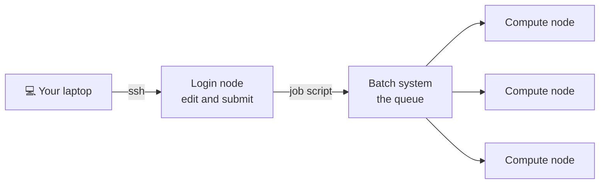

# Dr. Mindaugas Šarpis

# Best Research and Data Analysis Practices from CERN

## Computing Infrastructure

##### <span class="aims-badge">🔧 tool-agnostic · ⚙️ automation</span>

<!--
Speaker: a lecture of the block Further Topics. It uses the shell, Python and
NumPy as known. Every timing on the slides was measured on one laptop, which
the second section slide names. (~1 min)
-->

---
hideInToc: true
layout: quote
---

# The main goal of this lecture is to find out where the **time** and the **memory** of a computation go, and to decide from measured numbers whether it needs a **laptop**, a **cluster** or the **grid**.

---
hideInToc: true
---

# Learning **Objectives**

<div class="note-text mt-sm">By the end of this lecture, you will be able to:</div>

<div class="stack-tight mt-sm">

<div class="card card-primary card-glass pad-compact">

⏱️ **Time** the parts of a script and say which part is worth making faster

</div>

<div class="card card-secondary card-glass pad-compact">

📐 Derive **Amdahl's law** and use it to predict the speed-up from more cores

</div>

<div class="card card-accent card-glass pad-compact">

💾 **Estimate** from rows × bytes whether a table fits in memory, before loading it

</div>

<div class="card card-success card-glass pad-compact">

🚀 Run a job in the **background**, read its **log**, and read a **Slurm** job script

</div>

<div class="card card-warning card-glass pad-compact">

🌍 Say what a **batch system**, the **grid** and a **cloud** provider each provide

</div>

</div>

<!--
Speaker: the first three are done with numbers on the example file. The last
two are read and explained: the room has no cluster. (~1 min)
-->

---
layout: section
hideInToc: true
---

# Where the **Time** Goes

One sum over the 91&nbsp;583 rows of the example file is timed part by part. The numbers say which part is worth making faster.

<!--
Speaker: the question of the section is not "how do I make it fast" but "what
takes the time". The answer is measured, not guessed. (~30 sec)
-->

---
hideInToc: true
---

# The Machine Behind the **Numbers**

<div class="grid-2 mt-md gap-md">

<div class="card card-primary card-glass pad-compact">

## 💻 **Measured on**

- MacBook Pro 14-inch (2023), Apple M2 Pro
- 12 cores: 8 performance cores, 4 efficiency cores
- 16 GB of memory, 1 TB SSD
- Python 3.13.9, NumPy 2.3.5
- 4 October 2026. Each time is the smallest of five runs

</div>

<div class="card card-secondary card-glass pad-compact">

## 🔎 **The same for your laptop**

- **Windows:** Task Manager (`Ctrl+Shift+Esc`), tab **Performance**. **CPU** shows the cores, **Memory** the total
- **macOS:** Apple menu, **About This Mac**: the chip and the memory
- **Any system:**

```bash
python -c "import os; print(os.cpu_count())"
```

It prints `12` on this machine.

</div>

</div>

<div class="card card-info card-glass pad-compact mt-md">

Lecture 03 named the parts: a processor that fetches, decodes and executes instructions, and the memory hierarchy from registers to disk. This lecture puts numbers on them. A timing without the machine is not a measurement, so every table here belongs to this laptop.

</div>

<!--
Speaker: ask for the smallest and the largest memory in the room, and the
number of cores. Write them on the board. The spread matters later: a table
that fits on one laptop does not fit on another. (~2 min)
-->

---
hideInToc: true
---

# One Sum, Written as a **Loop**

<div class="grid-2 mt-sm gap-md">

<div class="card card-primary card-glass pad-compact">

```python
import time
import numpy as np

def loop_sum(values):
    total = 0.0
    for v in values:
        total += v
    return total

M = np.loadtxt("data/raw/D0_KPi.csv", delimiter=",",
               skiprows=1, usecols=0)
masses = M.tolist()

start = time.perf_counter()
total = loop_sum(masses)
elapsed = time.perf_counter() - start
print(f"loop {elapsed * 1000:8.3f} ms  {total!r}")
```

</div>

<div>

<div class="card card-secondary card-glass pad-compact">

## 🧮 **What is computed**

The sum of column `M`, the K⁻π⁺ mass, over all 91&nbsp;583 rows. Divided by the number of rows it is the mean mass: 1864.10 MeV/c².

</div>

<div class="card card-accent card-glass pad-compact mt-md">

## ⏱️ **The stopwatch**

`time.perf_counter()` is the stopwatch of Lecture 07: a time in seconds, finer than a microsecond. Here it surrounds the sum only, not the reading of the file.

</div>

<div class="card card-info card-glass pad-compact mt-md">

```text
loop    1.536 ms  170720289.9133972
```

</div>

</div>

</div>

<!--
Speaker: `M.tolist()` gives the loop a plain Python list, the fairest case for
it. A loop over the NumPy array itself is three times slower still (4.6 ms).
The stopwatch surrounds the sum only, not the reading of the file. (~2 min)
-->

---
hideInToc: true
---

# A Timing Has **Noise**

<div class="grid-2 mt-md gap-md">

<div class="card card-primary card-glass pad-compact">

## 🔁 **The same loop, five times**

```text
loop      1.580 ms  170720289.9133972
loop      1.578 ms  170720289.9133972
loop      1.572 ms  170720289.9133972
loop      1.531 ms  170720289.9133972
loop      1.565 ms  170720289.9133972
```

</div>

<div class="card card-secondary card-glass pad-compact">

## 📏 **Reading the five lines**

- The sum is the same five times. The time is not: 1.53 to 1.58&nbsp;ms
- Other programs take the processor for a moment. That can only add time, never remove it
- The smallest of several runs is therefore the best estimate of what the code itself costs
- A first run is often the slowest: neither the code nor the data is in the cache yet

</div>

</div>

<div class="card card-info card-glass pad-compact mt-md">

The rule of this lecture: time a thing five times and keep the smallest. The loop costs **1.53 ms**.

</div>

<!--
Speaker: the mean is the wrong summary here. The disturbances are one-sided,
so the distribution has a tail to the right and a hard edge on the left. The
edge is the cost of the code. (~2 min)
-->

---
hideInToc: true
---

# The Same Sum in **NumPy**

<div class="grid-2 mt-md gap-md">

<div class="card card-primary card-glass pad-compact">

## ✏️ **One line replaces the loop**

```python
start = time.perf_counter()
total = M.sum()
elapsed = time.perf_counter() - start
```

```text
numpy     0.043 ms  170720289.9134
numpy     0.021 ms  170720289.9134
numpy     0.019 ms  170720289.9134
numpy     0.018 ms  170720289.9134
numpy     0.018 ms  170720289.9134
```

</div>

<div class="card card-secondary card-glass pad-compact table-compact">

## ⚖️ **Side by side**

| The sum of 91&nbsp;583 values | Smallest of five |
| --- | --- |
| Python loop | 1.53 ms |
| NumPy `M.sum()` | 0.018 ms |
| Ratio | 85 |

Lecture 07 showed medians of 51 runs and found factors of 47 to 70. The smallest of five is less disturbed by other programs. For this sum it gives 85.

</div>

</div>

<div class="card card-info card-glass pad-compact mt-md">

The first NumPy run took 0.043 ms, more than twice the fifth: the first-run effect of the previous slide. A time of 18 microseconds is easily doubled by a disturbance, so its median and its smallest value lie far apart. For the loop, which takes a hundred times longer, they nearly agree.

</div>

<!--
Speaker: someone will ask about the last digits. Short answer now: the order
of the additions differs, and every addition rounds. The slide "The Sum
Changes in the Last Digits" has the numbers. (~2 min)
-->

---
hideInToc: true
---

# Time per **Row**

<div class="grid-2 mt-md gap-md">

<div class="card card-primary card-glass pad-compact table-compact">

## ➗ **Divide by 91&nbsp;583**

| | Time | Per row | Clock cycles |
| --- | --- | --- | --- |
| Python loop | 1.53 ms | 16.7 ns | about 60 |
| NumPy | 0.018 ms | 0.20 ns | less than 1 |

The clock of this processor ticks about 3.5 × 10⁹ times a second. One cycle lasts 1 / (3.5 × 10⁹) s = 0.29 ns.

- Loop: 16.7 ns / 0.29 ns = 58 cycles for one addition
- NumPy: 0.20 ns / 0.29 ns = 0.7 of a cycle, so more than one addition per cycle

</div>

<div class="card card-secondary card-glass pad-compact">

## 🔍 **Where 60 cycles go**

- The addition itself is one instruction
- Around it, for every row, Python follows a reference to the next 24-byte float object (Lecture 07), checks its type, reads its value, makes a new object for the result and updates the counters of both
- NumPy does none of this per row. The array holds only the 8-byte values, all of one type. One compiled loop adds them, more than one per cycle

</div>

</div>

<div class="card card-info card-glass pad-compact mt-md">

The loop does not add slowly. It spends almost all of its cycles on bookkeeping around the addition. This is the fetch, decode, execute cycle of Lecture 03, run sixty times for the work of one instruction.

</div>

<!--
Speaker: "more than one per cycle" is possible because the processor adds two
or more numbers with one instruction and works on several instructions at the
same time. The exact clock rate does not matter here, the factor of 85 does.
(~2.5 min)
-->

---
hideInToc: true
---

# The Whole Script, **Timed**

<div class="card card-primary card-glass pad-compact table-compact mt-sm">

| Part of the run | 91&nbsp;583 rows | 9&nbsp;158&nbsp;300 rows | Grows with the rows |
| --- | --- | --- | --- |
| Start Python and import NumPy | 60 ms | 60 ms | no |
| Read column `M` from the text file | 15 ms | 1&nbsp;010 ms | yes |
| The sum as a Python loop | 1.5 ms | 152 ms | yes |
| The sum in NumPy | 0.018 ms | 1.7 ms | yes |

</div>

<div class="grid-2 mt-md gap-md">

<div class="card card-secondary card-glass pad-compact">

## 📄 **The file as it is**

Nothing is slow. The run with the loop takes 0.08 s, and 60 ms of that is starting Python. The loop is 2 % of the run.

</div>

<div class="card card-accent card-glass pad-compact">

## 📚 **The file 100 times over**

The parts that grow with the rows take over. Reading is 83 % of the run, the loop 12 %, the start 5 %.

</div>

</div>

<div class="card card-info card-glass pad-compact mt-md">

A time that is proportional to the number of rows is predicted from a small sample: 1.53 ms × 100 = 153 ms. Measured on the long file: 152&nbsp;ms.

</div>

<!--
Speaker: the long file is the 91 583 data rows written 100 times into one file
of 392.6 MB. The start was measured with `time python -c "import numpy"`. The
point of the table: which part is the slow one depends on the size. (~2.5 min)
-->

---
hideInToc: true
---

# Reading Text Is the **Slow Part**

<div class="grid-2 mt-md gap-md">

<div class="card card-primary card-glass pad-compact">

## 📄 **Text**

- `np.loadtxt` reads the four columns of the 3.9 MB file in **17.6 ms**
- Getting the bytes into memory is 0.35 ms of that
- The other 98 % is turning characters into numbers, at 224&nbsp;MB of text per second on one core

</div>

<div class="card card-secondary card-glass pad-compact">

## 📦 **Binary**

```python
table = np.loadtxt("data/raw/D0_KPi.csv",
                   delimiter=",", skiprows=1)
np.save("data/processed/D0_KPi.npy", table)
table = np.load("data/processed/D0_KPi.npy")
```

`np.load` takes **0.26 ms**: 68 times faster. The file holds the 8 bytes of every float64 as they stand in memory.

</div>

</div>

<div class="card card-info card-glass pad-compact mt-md">

Lecture 03 compared the two forms by size: a number as text and as four or eight bytes. This is the same difference in time. The text file stays the raw data. The binary copy in `data/processed/` is made by a script and can be made again at any time.

</div>

<!--
Speaker: the .npy file has 2 930 784 bytes: 91 583 x 4 x 8 for the numbers and
128 for a header that states the type and the shape. A binary file needs its
description, and here the format carries it. (~2 min)
-->

---
layout: section
hideInToc: true
---

# Amdahl's **Law**

How much faster a run gets when one part of it is made faster: derived, then applied to the numbers of the last slides.

<!--
Speaker: the law is one line of algebra. Its use is to decide what to work on
before working on it. (~30 sec)
-->

---
hideInToc: true
---

# Speeding Up **One Part**

<div class="grid-2 mt-md gap-md">

<div class="card card-primary card-glass pad-compact">

## ✏️ **The algebra**

A run takes $T = T_a + T_b$. Part $b$ is made $k$ times faster:

$$
T' = T_a + \frac{T_b}{k}
$$

With $p = T_b / T$, the share of the run that part $b$ takes, the speed-up of the whole run is

$$
S = \frac{T}{T'} = \frac{1}{(1 - p) + p / k}
$$

</div>

<div class="card card-secondary card-glass pad-compact">

## 🔢 **With the long file**

The run takes 0.060 + 1.010 + 0.152 = 1.222 s. The loop is $p = 0.152 / 1.222 = 12.4\,\%$ of it. NumPy makes the sum $k = 89$ times faster:

$$
S = \frac{1}{0.876 + 0.124 / 89} = 1.14
$$

</div>

</div>

<div class="card card-info card-glass pad-compact mt-md">

Even $k = \infty$ gives only $S = 1 / (1 - p) = 1.14$. A part that takes 12 % of the time cannot save more than 12 % of the time. Gene Amdahl published the argument in 1967.

</div>

<!--
Speaker: derive it on the board with T_a and T_b as two bars. Then let the room
compute S for p = 0.5 and k = 10: 1 / (0.5 + 0.05) = 1.82. Half of the run
ten times faster is not even twice as fast. (~3 min)
-->

---
hideInToc: true
---

# Which Part to **Speed Up**

<div class="card card-primary card-glass pad-compact table-compact mt-sm">

| The long file, 9&nbsp;158&nbsp;300 rows | Start | Read | Sum | Whole run | Speed-up |
| --- | --- | --- | --- | --- | --- |
| Text file, Python loop | 0.060 s | 1.010 s | 0.152 s | 1.222 s | 1 |
| Text file, NumPy sum | 0.060 s | 1.010 s | 0.002 s | 1.072 s | 1.14 |
| Binary file, Python loop | 0.060 s | 0.009 s | 0.152 s | 0.221 s | 5.5 |
| Binary file, NumPy sum | 0.060 s | 0.009 s | 0.002 s | 0.071 s | 17 |

</div>

<div class="grid-2 mt-md gap-md">

<div class="card card-secondary card-glass pad-compact">

## 🥇 **The largest part first**

Reading was 83 % of the run. Making the read faster gives 5.5. Making the sum faster gives 1.14, although the sum itself became 89 times faster.

</div>

<div class="card card-accent card-glass pad-compact">

## 🛑 **Where to stop**

After both changes, starting Python is 85 % of what is left. The run takes 0.07 s. There is nothing left that is worth an hour of work.

</div>

</div>

<div class="card card-info card-glass pad-compact mt-md">

Measure the parts before changing the code. The part that looks slow in the editor, the loop, was 12 % of this run.

</div>

<!--
Speaker: all four rows are measured: text read 1.01 s, np.load of the binary
column 9 ms, loop 152 ms, NumPy sum 1.7 ms. The whole-run column is their sum
with the 60 ms start. (~2.5 min)
-->

---
hideInToc: true
---

# From One Part to *N* **Workers**

<div class="grid-2 mt-sm gap-md">

<div>

<div class="card card-primary card-glass pad-compact">

## 👥 **Split the part over *N* workers**

Then that part runs $N$ times faster: $k = N$. Write $s = 1 - p$ for the share that stays **serial**:

$$
S(N) = \frac{1}{s + (1 - s)/N} \qquad S(\infty) = \frac{1}{s}
$$

</div>

<div class="card card-secondary card-glass pad-compact mt-md">

## 🔢 **With *s* = 10 %**

$S(4) = 1 / (0.1 + 0.9 / 4) = 3.1$

$S(16) = 1 / (0.1 + 0.9 / 16) = 6.4$

$S(\infty) = 10$, whatever the number of workers

</div>

</div>

<div>


</div>

</div>

<!--
Speaker: both axes of the figure double at every step. Without a serial part
the speed-up follows the dashed line. Every curve leaves it and flattens at
1/s. With 1 % serial, 128 workers give 56, not 128. (~2.5 min)
-->

---
layout: section
hideInToc: true
---

# More Than One **Core**

The laptop has 12 cores, and the loop used one of them. The same sum is split over several, timed, and compared with what Amdahl's law predicts.

<!--
Speaker: the section has one surprise and one test. The surprise: four cores
are slower for this file. The test: the law predicts a time before it is
measured. (~30 sec)
-->

---
hideInToc: true
---

# A Pool of **Processes**

<div class="grid-2 mt-md gap-md">

<div class="card card-primary card-glass pad-compact">

## 🧩 **Process, worker, pool**

- A **process** is a running program with its own memory. The operating system gives each process a core to run on
- One Python process runs Python code on one core at a time, however many cores the machine has
- `Pool(4)` starts four more Python processes, the **workers**
- `pool.map(function, items)` hands out the items, runs the function on each one in a worker, and returns the results in the order of the items

</div>

<div class="card card-secondary card-glass pad-compact">

## ✏️ **The sum on four workers**

```python
from multiprocessing import Pool

if __name__ == "__main__":
    chunks = [masses[i::4] for i in range(4)]
    with Pool(4) as pool:
        parts = pool.map(loop_sum, chunks)
    total = sum(parts)
```

`masses[i::4]` is every fourth row, starting at row `i`: four lists of 22&nbsp;896 or 22&nbsp;895 values. Each worker adds up one of them with `loop_sum`.

</div>

</div>

<div class="card card-info card-glass pad-compact mt-md">

The limit of one core per process comes from a lock inside Python, the global interpreter lock. A compiled loop of NumPy also runs on one core for a sum. More cores are reached with more processes, and that works on every system.

</div>

<!--
Speaker: Python 3.13 added a build without the lock. It is not the default,
and most libraries assume the lock is there. `with Pool(4) as pool` closes the
pool at the end of the block, as `with open(...)` closes a file. (~2.5 min)
-->

---
hideInToc: true
---

# How a Worker **Starts**

<div class="grid-2 mt-md gap-md">

<div class="card card-primary card-glass pad-compact">

## 🚦 **On Windows and macOS**

1. The pool starts a new Python for every worker: 10 ms
2. The worker imports the script, to learn what `loop_sum` is. With `import numpy` in it: 50 ms more
3. Whatever stands at the top level of the script runs again in every worker
4. The lines under `if __name__ == "__main__":` run only in the process that was started by hand

</div>

<div class="card card-warning card-glass pad-compact">

## ⚠️ **Without that line**

Every worker would start a pool of its own. Python refuses and prints, again and again until `Ctrl+C`:

```text
RuntimeError:
    An attempt has been made to start a
    new process before the current process
    has finished its bootstrapping phase.
```

</div>

</div>

<div class="card card-info card-glass pad-compact mt-md">

The items and the results travel between the processes as bytes. Each chunk is packed, sent and unpacked, and each partial sum comes back the same way. Processes share no memory.

</div>

<!--
Speaker: the two start times are measured: `time python -c "pass"` gives 0.01 s
and `time python -c "import numpy"` 0.06 s. On Linux a worker can also start as
a copy of the running process, which is faster, but a script written with the
guard runs on all three systems. (~2 min)
-->

---
hideInToc: true
---

# Four Processes: **Slower**


<div class="grid-2 mt-md gap-md">

<div class="card card-primary card-glass pad-compact">

## ⏱️ **Measured**

The loop takes 1.53 ms. The same loop on four workers takes **91 ms**: 60 times longer. NumPy on one core takes 0.018 ms.

</div>

<div class="card card-secondary card-glass pad-compact">

## 🔍 **Where the 91 ms go**

Starting four workers, each with its import of NumPy, takes about 85 ms. With the workers already running, the same `pool.map` takes 1.9 ms, still more than 1.53: sending 91&nbsp;583 numbers costs more than adding them.

</div>

</div>

<div class="card card-info card-glass pad-compact mt-md">

Splitting has a fixed price, here about 0.1 s. It pays only for work that takes much longer than that.

</div>

<!--
Speaker: the axis is logarithmic, each gridline is ten times the one before.
The three bars span four orders of magnitude. The order to try things in
follows from it: first the array operation, then more cores. (~2 min)
-->

---
hideInToc: true
---

# A Job Worth **Splitting**

<div class="grid-2 mt-sm gap-md">

<div class="card card-primary card-glass pad-compact">

```python
def sum_passes(passes):
    M = np.loadtxt(PATH, delimiter=",",
                   skiprows=1, usecols=0)
    masses = M.tolist()
    total = 0.0
    for _ in range(passes):
        for m in masses:
            total += m
    return total

share = args.passes // args.workers
with Pool(args.workers) as pool:
    parts = pool.map(sum_passes,
                     [share] * args.workers)
```

</div>

<div>

<div class="card card-secondary card-glass pad-compact table-compact">

## ⏱️ **1&nbsp;200 passes over the rows**

| Workers *N* | Time *T*(*N*) | *T*(1) / *T*(*N*) |
| --- | --- | --- |
| 1 | 1.964 s | 1 |
| 2 | 1.044 s | 1.88 |
| 4 | 0.586 s | 3.35 |
| 8 | 0.406 s | 4.84 |
| 12 | 0.408 s | 4.81 |

</div>

<div class="card card-info card-glass pad-compact mt-md">

The job is 109&nbsp;899&nbsp;600 additions, as if the file had 110 million rows. A worker is sent a number of passes, not the rows. It reads the file itself.

</div>

</div>

</div>

<!--
Speaker: `python scripts/sum_parallel.py --workers 4`, shown live. The sum
printed at the end differs in its last digits from one worker count to the
next. Two workers are nearly twice as fast, twelve are not twelve times as
fast. The next slide asks whether a formula could have said so. (~2.5 min)
-->

---
hideInToc: true
---

# Amdahl, **Tested**

<div class="grid-2 mt-sm gap-md">

<div>

<div class="card card-primary card-glass pad-compact">

## ✏️ **Two runs fix the model**

$T(N) = T_s + T_p / N$ has two unknowns.

$T(1) - T(2) = T_p / 2$, so $T_p = 2 \times 0.920 = 1.840$ s

$T_s = T(1) - T_p = 0.124$ s, and $s = 0.124 / 1.964 = 6.3\,\%$

</div>

<div class="card card-secondary card-glass pad-compact table-compact mt-md">

## 🔮 **Predicted, then measured**

| *N* | $T_s + T_p / N$ | Measured |
| --- | --- | --- |
| 4 | 0.584 s | 0.586 s |
| 8 | 0.354 s | 0.406 s |
| 12 | 0.277 s | 0.408 s |

</div>

</div>

<div>


</div>

</div>

<div class="card card-info card-glass pad-compact mt-sm">

For four workers the prediction is right to 2 ms. The serial 0.124 s is the start of the workers and their reading of the file. With $s = 6.3\,\%$ no number of cores gives more than $1/s = 16$.

</div>

<!--
Speaker: this is the method of the whole course in small: a model with two
parameters, fixed by two measurements, tested on a third. It passes at N = 4
and fails at 8 and 12. The failure has a cause, on the next slide. (~3 min)
-->

---
hideInToc: true
---

# Twelve Workers, No Faster Than **Eight**

<div class="grid-3 mt-md gap-md">

<div class="card card-primary card-glass pad-compact">

## 🏎️ **Cores differ**

This processor has 8 fast cores and 4 slow ones. Laptops have had two kinds of core since 2020 (Apple) and 2021 (Intel). Workers 9 to 12 get the slow cores, and the run ends when the last worker ends.

</div>

<div class="card card-secondary card-glass pad-compact">

## 👥 **Cores are shared**

The editor, the browser and the system need cores as well. With eight workers on eight fast cores, every other program takes time from one of them.

</div>

<div class="card card-accent card-glass pad-compact">

## 📐 **The law is the best case**

$T_p / N$ assumes that every added worker is as fast as the first and has a core to itself. Real machines give that, or less.

</div>

</div>

<div class="grid-2 mt-md gap-md">

<div class="card card-info card-glass pad-compact table-compact">

| Workers | Speed-up by the law | Measured |
| --- | --- | --- |
| 4 | 3.36 | 3.35 |
| 8 | 5.55 | 4.84 |
| 12 | 7.08 | 4.81 |

</div>

<div class="card card-success card-glass pad-compact">

## 📏 **So measure**

The number of workers to use is found by measuring, as here. On this laptop four workers give 3.35 and eight give 4.84: the second four add less than half of what the first four did.

</div>

</div>

<!--
Speaker: the practical reading: asking for more cores than the measured
speed-up justifies wastes them, on a laptop and on a cluster alike. (~2 min)
-->

---
hideInToc: true
---

# The Sum Changes in the **Last Digits**

<div class="grid-2 mt-md gap-md">

<div class="card card-primary card-glass pad-compact table-compact">

## 🔢 **One file, four sums**

| How the 91&nbsp;583 values were added | Sum |
| --- | --- |
| Python loop, row after row | 170720289.9133972 |
| Four workers, then the four parts | 170720289.91340062 |
| NumPy `M.sum()` | 170720289.9134 |
| `math.fsum`, exactly rounded | 170720289.9134 |

</div>

<div class="card card-secondary card-glass pad-compact">

## 🔍 **Why**

- Near 1.7 × 10⁸ the step from one float64 to the next is 3.0&nbsp;×&nbsp;10⁻⁸ (Lecture 03, the steps between floats)
- Every addition rounds its result to the nearest float. Another order of additions rounds at other places. Lecture 07 met this for the mean
- The loop ends 2.8 × 10⁻⁶ below the exact sum: 1.6&nbsp;parts in&nbsp;10¹⁴

</div>

</div>

<div class="card card-warning card-glass pad-compact mt-md">

⚠️ A parallel run does not repeat a serial run bit for bit, and two worker counts do not agree with each other. Results are compared with a tolerance, `math.isclose(a, b)`. A test that demands equal digits fails for the wrong reason.

</div>

<!--
Speaker: NumPy adds in pairs, pairs of pairs and so on, which keeps the
rounding error small. `math.fsum` tracks the lost digits and returns the
correctly rounded sum. For a mean mass the difference is far below any
uncertainty. For a test it is the difference between pass and fail. (~2 min)
-->

---
hideInToc: true
---

# What Splits and What **Does Not**

<div class="grid-2 mt-md gap-md">

<div class="card card-success card-glass pad-compact table-compact">

## ✅ **Merges from parts**

| Quantity | Each part returns | Merge |
| --- | --- | --- |
| Sum | its sum | add |
| Count | its count | add |
| Mean | its sum and its count | add both, divide |
| Histogram | its counts per bin | add bin by bin |
| Minimum | its minimum | take the smallest |

</div>

<div class="card card-warning card-glass pad-compact">

## ❌ **Does not**

- **A mean of means.** Rows 1 to 10&nbsp;000 have mean 1863.874, the other 81&nbsp;583 rows 1864.133. The average of the two is 1864.003. The mean of all rows is 1864.105
- **A median.** The medians of the four quarters are 1863.963, 1864.046, 1864.174 and 1864.077. Their median is 1864.061. The median of all rows is 1864.078

</div>

</div>

<div class="card card-info card-glass pad-compact mt-md">

Whatever is a sum over rows can be computed in parts: a mean, a histogram, the χ² of Lecture 10. Split, compute the parts, merge. A batch system and the grid run this same pattern on many machines.

</div>

<!--
Speaker: checked on the file: the four quarter histograms of M between 1840
and 1890, added bin by bin, are exactly the histogram of all rows. A median
needs all values in one place, or a different algorithm. (~2 min)
-->

---
layout: section
hideInToc: true
---

# The **GPU**

A processor built for one kind of work: the same operation on very many numbers at once.

<!--
Speaker: a short section. What the chip is, a clip, and when it pays. (~30 sec)
-->

---
hideInToc: true
---

# Thousands of Small **Cores**

<div class="grid-2 mt-md gap-md">

<div class="card card-primary card-glass pad-compact table-compact">

## ⚖️ **Two processors**

| | CPU of this laptop | A graphics card |
| --- | --- | --- |
| Model | Apple M2 Pro, 2023 | Nvidia RTX 4090, 2022 |
| Cores | 12 | 16&nbsp;384 |
| A core | fast, runs any program | slow and simple |
| Good at | a long chain of different steps | one step on millions of numbers |
| Memory | shares the 16 GB | 24 GB of its own |

A graphics card is a computer inside the computer. It has its own cores and its own memory, and a slot connects it to the rest. What it computes on has to be copied into that memory first.

</div>

<div>


<div class="card card-secondary card-glass pad-compact mt-md">

GPU stands for graphics processing unit: built to compute the millions of pixels of one picture at the same time. The chips marked VRAM are the memory of the card.

</div>

</div>

</div>

<div class="card card-info card-glass pad-compact mt-md">

A GPU core does not run Python. A library takes an array and an operation, sends both to the card, and the card applies the operation to all elements at once. It is the array operation of NumPy on other hardware.

</div>

<!--
Speaker: CuPy offers the functions of NumPy computed on a GPU, and PyTorch
does the same for neural networks. Neither is needed in this course. (~2 min)
-->

---
hideInToc: true
---

<VideoPlayer src="CPU_vs_GPU_Demo.mp4" autoplay />

<!-- CPU vs GPU visualized (fetched via videos.py fetch; was a YouTube embed) -->

---
hideInToc: true
---

# When a GPU **Pays Off**

<div class="grid-2 mt-md gap-md">

<div class="card card-success card-glass pad-compact">

## ✅ **It pays**

- The same arithmetic on millions of independent elements: matrix products, images, simulated events
- Training a network: the weighted sums of Lecture 11, for millions of weights and many examples at once
- The first trigger stage of LHCb has run on GPUs since 2022. Every collision is partly reconstructed there before it is kept or dropped

</div>

<div class="card card-warning card-glass pad-compact">

## ❌ **It does not**

- Small data. The array is copied to the card and the result back. That copy is a serial part, as the start of the workers was. Amdahl's law holds here too
- Steps that depend on each other, or a different decision for every row
- A Python loop. The loop runs on the CPU

</div>

</div>

<div class="card card-info card-glass pad-compact mt-md">

Other chips go further the same way. An FPGA is wired for one computation and can be rewired. An ASIC is built for one and cannot. Both sit in detector electronics, where a decision is due within a few microseconds.

</div>

<!--
Speaker: the 91 583-row sum would lose on a GPU for the reason it lost on four
processes: the fixed price of getting the data there. (~2 min)
-->

---
layout: section
hideInToc: true
---

# Memory, Disk, **Network**

How many bytes a table needs, whether they fit, and what it costs in time when the data is on a disk or in another country.

<!--
Speaker: time was the first resource. Memory is the second, and the one that
ends a run with an error instead of a delay. (~30 sec)
-->

---
hideInToc: true
---

# How Many Bytes Is a **Table**?

<div class="grid-2 mt-md gap-md">

<div class="card card-primary card-glass pad-compact">

## 📐 **Rows × columns × bytes per value**

A float64 takes 8 bytes, a float32 takes 4 (Lecture 03). The example file:

91&nbsp;583 × 4 × 8 = **2&nbsp;930&nbsp;656 bytes**, 2.9 MB

```python
table = np.loadtxt("data/raw/D0_KPi.csv",
                   delimiter=",", skiprows=1)
print(table.shape, table.dtype, table.nbytes)
```

```text
(91583, 4) float64 2930656
```

</div>

<div class="card card-secondary card-glass pad-compact table-compact">

## 📦 **The same 366&nbsp;332 values, stored as**

| Form | Bytes per value | Total |
| --- | --- | --- |
| float64 array | 8 | 2.9 MB |
| float32 array | 4 | 1.5 MB |
| the text file | 10.7 | 3.9 MB |
| Python lists of floats | 32 | 11.7 MB |

Lecture 07 took the list apart: an object of 24 bytes for every value, and a reference of 8 bytes to it.

</div>

</div>

<div class="card card-info card-glass pad-compact mt-md">

Pandas keeps a column of numbers as a NumPy array, so the same product holds for a DataFrame. `df.info()` reports this table as 2.8 MB: 2&nbsp;930&nbsp;788 bytes counted in units of 1024 × 1024, the MiB of Lecture 03.

</div>

<!--
Speaker: the estimate is exact for a table of numbers, to the byte. Columns of
text are another matter: every string is an object, and a column of short
strings can take ten times its characters. (~2.5 min)
-->

---
hideInToc: true
---

# Peak Memory Is **Larger** Than the Table

<div class="grid-2 mt-md gap-md">

<div class="card card-primary card-glass pad-compact table-compact">

## 📈 **Measured with `tracemalloc`**

| Step | Extra memory at the peak |
| --- | --- |
| `np.loadtxt`, the table | 3.1 MB: 1.06 × the table |
| `pd.read_csv`, the same table | 5.9 MB: 2.0 × the table |
| `((M - M.mean())**2).sum()` | 0.73 MB: one more column |
| `M[(M > 1840) & (M < 1890)]` | 0.54 MB: mask and selection |

</div>

<div class="card card-secondary card-glass pad-compact">

## 🔍 **Where it comes from**

- A reader holds text and numbers at the same moment
- `M - M.mean()` is a new array as long as `M`. NumPy squares it in place, so the expression needs one extra column, not two
- A mask has one byte per row: 91&nbsp;583 bytes. The selection is a copy of 56&nbsp;577 rows

</div>

</div>

<div class="grid-2 mt-md gap-md">

<div class="card card-accent card-glass pad-compact">

```python
import tracemalloc
tracemalloc.start()
table = np.loadtxt(PATH, delimiter=",", skiprows=1)
current, peak = tracemalloc.get_traced_memory()
```

</div>

<div class="card card-info card-glass pad-compact">

The rule for planning: keep **three times the table** free. One for the table, one for a working copy, one for the reader and what else runs.

</div>

</div>

<!--
Speaker: `tracemalloc` is part of Python and works the same on every system.
It returns the current and the peak number of bytes that Python and NumPy have
allocated since `start()`. The whole process grows by more: reading the
100-fold file with Pandas took 986 MB for a table of 293 MB. (~2.5 min)
-->

---
hideInToc: true
---

# Does It Fit? **Estimate** Before Loading

<div class="grid-2 mt-md gap-md">

<div class="card card-primary card-glass pad-compact">

## ✏️ **From the file size to the memory**

1. Bytes per row of text: 3&nbsp;926&nbsp;142 / 91&nbsp;584 lines = 42.9
2. Rows = size of the file / 42.9
3. Memory = rows × 4 columns × 8 bytes
4. So memory / text = 32 / 42.9 = 0.75

Tested on the file written 100 times over, 392&nbsp;612&nbsp;616 bytes: predicted 0.75 × 392.6 MB = 293 MB. `table.nbytes` gives 293&nbsp;065&nbsp;600.

</div>

<div class="card card-secondary card-glass pad-compact table-compact">

## 🧮 **Three sizes**

| Rows | Text file | In memory | Three times that |
| --- | --- | --- | --- |
| 91&nbsp;583 | 3.9 MB | 2.9 MB | 8.8 MB |
| 9.2 million | 393 MB | 293 MB | 0.9 GB |
| 916 million | 39 GB | 29 GB | 88 GB |

The first two fit in 16 GB. The third does not, and it does not fit on any laptop.

</div>

</div>

<div class="card card-info card-glass pad-compact mt-md">

A laptop with 16 GB carries tables up to about 5 GB: 160 million rows of four float64 columns. The number of bytes per row comes from the first lines of the file, as in Lecture 03.

</div>

<!--
Speaker: let the room do it for their own laptop: memory in GB, divided by 3,
divided by 32 bytes per row. An 8 GB laptop carries 80 million of these rows.
(~2.5 min)
-->

---
hideInToc: true
---

# When It Does **Not Fit**

<div class="card card-primary card-glass pad-compact table-compact mt-sm">

| The long file: 9.2 million rows, 393 MB of text | Time | Peak memory of the process |
| --- | --- | --- |
| `np.loadtxt`, four columns, float64 | 1.9 s | 374 MB |
| `np.loadtxt`, four columns, `dtype=np.float32` | 1.9 s | 214 MB |
| `np.loadtxt`, `usecols=0` | 1.0 s | 147 MB |
| `pd.read_csv`, four columns | 1.7 s | 986 MB |
| Line by line with the `csv` module, adding as it reads | 5.8 s | 13 MB |

</div>

<div class="grid-3 mt-md gap-md">

<div class="card card-secondary card-glass pad-compact">

## ✂️ **Fewer columns**

Read only what the computation uses. One column of four is a quarter of the table.

</div>

<div class="card card-accent card-glass pad-compact">

## 🔢 **A smaller type**

float32 halves the table and keeps 7 digits. Sum it into a float64: `M.sum(dtype=np.float64)`.

</div>

<div class="card card-success card-glass pad-compact">

## 🧩 **In pieces**

A sum needs one number in memory, not the table. Pieces cost time and save memory.

</div>

</div>

<div class="card card-info card-glass pad-compact mt-md">

If the table still does not fit, the system moves part of the memory to the disk (swap). Every access to that part then takes the time of a disk, not of memory.

</div>

<!--
Speaker: peak memory here is that of the whole process, Python and its
libraries included: 27 MB with NumPy, about 100 MB with Pandas. The last row
is the pattern of the previous section in time instead of across cores: split
the rows, keep only the partial result. (~2.5 min)
-->

---
hideInToc: true
---

# Memory, Disk, Network: **Measured**

<div class="card card-primary card-glass pad-compact table-compact mt-sm">

| | A stream of bytes | One item, out of order | How it was measured |
| --- | --- | --- | --- |
| Memory | 10 GB/s copied, 42 GB/s summed | 6 ns | a 1 GB array in NumPy |
| SSD | 4.4 GB/s | 0.11 ms | a 2 GB file, kept out of the file cache |
| Hard disk | about 0.2 GB/s | 4 ms | half a turn at 7&nbsp;200 turns a minute |
| Network to CERN | the rate of the link | 46 ms | `ping cern.ch`, there and back |

</div>

<div class="grid-2 mt-md gap-md">

<div class="card card-secondary card-glass pad-compact">

## 🎯 **One item at a time**

6 ns, 0.11 ms, 46 ms. From memory to the SSD the wait grows 18&nbsp;000 times, from the SSD to the network 400 times more.

</div>

<div class="card card-accent card-glass pad-compact">

## 🌊 **A stream**

Streams differ far less. Data that is read in order and in large pieces travels well. Data that is asked for one row at a time does not.

</div>

</div>

<div class="card card-info card-glass pad-compact mt-md">

Lecture 03 listed these levels. Here they have numbers, for one laptop in 2026. A link of 100 Mbit/s carries 12.5 MB/s: eight bits to the byte.

</div>

<!--
Speaker: the hard disk row is the only one not measured: this laptop has none.
Its 0.2 GB/s is typical of a disk sold in 2024. Clusters and the grid still
keep most of their data on hard disks and tape, because a terabyte on them
costs a fraction of a terabyte of SSD. (~2.5 min)
-->

---
hideInToc: true
---

# Order in Memory **Matters**

<div class="grid-2 mt-md gap-md">

<div class="card card-primary card-glass pad-compact">

## 🧪 **Ten million values, two orders**

```python
rng = np.random.default_rng(1)
a = rng.random(125_000_000)    # 1 GB
i_order = np.arange(10_000_000)
i_random = rng.integers(0, a.size,
                        10_000_000)

a[i_order].sum()      # 13 ms
a[i_random].sum()     # 59 ms
```

</div>

<div class="card card-secondary card-glass pad-compact">

## 🔍 **Same work, 4.4 times the time**

- In order: 1.3 ns per value. At random places: 5.9 ns
- The processor keeps recently used memory in its cache and fetches the next values ahead while an array is read in order
- A value at a random place is not in the cache. The processor waits for main memory

</div>

</div>

<div class="card card-info card-glass pad-compact mt-md">

The cache of Lecture 03, seen from Python. For an analysis it means: go through an array from start to end, one column at a time. A column of a NumPy table or of a DataFrame is one unbroken run of memory.

</div>

<!--
Speaker: nothing in the code says "cache". The same ten million additions take
four times as long because of where the values lie. Sorting the random
positions first brings the time down to 28 ms. (~2 min)
-->

---
hideInToc: true
---

# Time to Move One **Terabyte**


<div class="grid-2 mt-md gap-md">

<div class="card card-primary card-glass pad-compact">

## ➗ **Size divided by rate**

10¹² bytes at 12.5 MB/s take 80&nbsp;000 s: 22 hours. The same terabyte comes off the SSD in 4 minutes.

</div>

<div class="card card-secondary card-glass pad-compact">

## 🏛️ **A petabyte**

A thousand times more. On a link of 100 Gbit/s, the kind that joins CERN to a large computing centre, it takes 10¹⁵ × 8 / 10¹¹ = 80&nbsp;000 s: again 22 hours.

</div>

</div>

<div class="card card-info card-glass pad-compact mt-md">

Data of this size is not brought to the program. The program is sent to the machine that has the data.

</div>

<!--
Speaker: the axis is logarithmic. The two memory and disk rates are the
measured ones of this laptop, the three network rates are definitions.
(~2 min)
-->

---
hideInToc: true
---

# The Limit Set by **Light**

<div class="grid-2 mt-md gap-md">

<div class="card card-primary card-glass pad-compact">

## ✏️ **From Vilnius to CERN**

- The distance along the surface is 1&nbsp;650 km
- Light in a glass fibre travels at about 200&nbsp;000 km/s, two thirds of its speed in vacuum
- One way: 1&nbsp;650 / 200&nbsp;000 s = 8.3 ms. There and back: 16.5 ms
- No network answers faster. `ping cern.ch` from this laptop gives 46 ms: the cable does not run straight, and every router on the way adds a little

</div>

<div class="card card-secondary card-glass pad-compact">

## 🔢 **What 46 ms does to a program**

- Asking a server at CERN for one row at a time: 91&nbsp;583 questions × 46 ms = 70 minutes
- Asking once for all rows: one wait of 46 ms, then 3.9 MB at the rate of the link. At 100 Mbit/s that is 0.3 s

</div>

</div>

<div class="card card-info card-glass pad-compact mt-md">

Over a network the number of requests matters more than the number of bytes. A faster link does not shorten the 46 ms.

</div>

<!--
Speaker: `ping cern.ch` works in every terminal (macOS: `ping -c 4 cern.ch`).
Run it live and compare with the bound of 16.5 ms. (~2 min)
-->

---
hideInToc: true
---

<VideoPlayer src="How_Computer_Memory_Works.mp4" autoplay />

<!-- How computer memory works (fetched via videos.py fetch; was a YouTube embed) -->

---
layout: section
hideInToc: true
---

# Running **Unattended**

A job of an hour should not need a person at the keyboard. It runs in the background, writes what it does into a file, and can be checked or stopped at any time.

<!--
Speaker: everything in this section runs on a laptop, in Git Bash on Windows
and in the terminal of macOS. The same commands are what a remote machine and
a cluster expect. (~30 sec)
-->

---
hideInToc: true
---

# A Job That Does Not Need **You**

<div class="grid-2 mt-md gap-md">

<div class="card card-primary card-glass pad-compact">

## 📋 **Four properties**

- It asks no questions. Every setting comes from the command line (Lecture 13)
- It writes its results into files
- It reports its progress, one line per step, with the time
- Its last line says that it finished

</div>

<div class="card card-secondary card-glass pad-compact">

## ✏️ **`scripts/long_job.py`, the loop**

```python
for step in range(1, args.steps + 1):
    total = loop_sum(masses, 300)
    elapsed = time.perf_counter() - start
    print(f"{now()}  step {step:2d} of {args.steps}"
          f"  {elapsed:5.1f} s")

mean = total / 300 / len(masses)
print(f"{now()}  done  mean of M = {mean:.4f}")
```

</div>

</div>

<div class="card card-info card-glass pad-compact mt-md">

The script adds up the mass column 300 times per step, for 60 steps: 28 s on this laptop. It stands for any analysis that takes an hour. `now()` returns the clock time as `18:26:42`.

</div>

<!--
Speaker: run it once in the foreground, `python scripts/long_job.py --steps 5`,
so that the room sees the lines appear one by one. (~2 min)
-->

---
hideInToc: true
---

# Two Output **Streams**

<div class="grid-3 mt-sm gap-md">

<div class="card card-primary card-glass pad-compact">

**Standard output** carries what `print` writes. **Standard error** carries error messages and tracebacks. Both go to the terminal.

</div>

<div class="card card-secondary card-glass pad-compact">

`> file` sends standard output into a file instead (Lecture 04). Standard error still goes to the terminal.

</div>

<div class="card card-accent card-glass pad-compact">

`2>&1` sends stream 2, standard error, to where stream 1, standard output, goes. It stands after `> file`.

</div>

</div>

<div class="card card-info card-glass pad-compact mt-md">

```text
$ python scripts/long_job.py --path data/raw/missing.csv > results/run.log
Traceback (most recent call last):
  ...
FileNotFoundError: data/raw/missing.csv not found.
$ cat results/run.log
$ python scripts/long_job.py --path data/raw/missing.csv > results/run.log 2>&1
$ tail -n 1 results/run.log
FileNotFoundError: data/raw/missing.csv not found.
```

</div>

<div class="card card-success card-glass pad-compact mt-md">

After the first command the log is empty: the error went to the terminal. After the second it is in the log, where it will be found the next morning.

</div>

<!--
Speaker: the `...` stands for nine lines of traceback. The file name is wrong
on purpose. A job that fails at night has nobody at the terminal, so the error
has to be in the file. (~2.5 min)
-->

---
hideInToc: true
---

# Into the Background with **&**

<div class="card card-primary card-glass pad-compact mt-sm">

```text
$ python -u scripts/long_job.py > results/run.log 2>&1 &
[1] 26395
$ jobs
[1]+  Running                 python -u scripts/long_job.py > results/run.log 2>&1 &
$ tail -n 2 results/run.log
18:26:34  step 10 of 60    4.7 s
18:26:35  step 11 of 60    5.2 s
$ kill %1
$ tail -n 1 results/run.log
18:26:38  step 18 of 60    8.5 s
[1]+  Terminated: 15          python -u scripts/long_job.py > results/run.log 2>&1
```

</div>

<div class="grid-2 mt-md gap-md">

<div class="card card-secondary card-glass pad-compact">

## ▶️ **Start and look**

- `&` at the end starts the command and gives the prompt back at once. `[1]` is the job number
- `jobs` lists the background jobs of this terminal
- `tail -f results/run.log` follows the log until `Ctrl+C`

</div>

<div class="card card-accent card-glass pad-compact">

## ⏹️ **Stop**

- `kill %1` stops job 1. The shell reports it at the next prompt
- With `-u` the log holds every line up to the stop
- A job that ended by itself is reported as `Done`, one that failed as `Exit 1`

</div>

</div>

<!--
Speaker: the transcript is from bash. In zsh, the default on macOS, the words
are in lower case: `running`, `terminated`, `done`. `26395` is the number of
the process. `fg` brings a job back to the foreground, where Ctrl+C stops it.
Show it live with two terminals side by side: the job in one, `tail -f` in the
other. (~3 min)
-->

---
hideInToc: true
---

# Why the Log Stays **Empty**

<div class="card card-primary card-glass pad-compact mt-sm">

```text
$ python scripts/long_job.py > results/run.log 2>&1 &
[1] 14332
$ cat results/run.log
$ kill %1
$ jobs
[1]+  Terminated: 15          python scripts/long_job.py > results/run.log 2>&1
$ cat results/run.log
$
```

</div>

<div class="grid-2 mt-md gap-md">

<div class="card card-secondary card-glass pad-compact">

## 🕳️ **Without `-u`**

- Five seconds into the job, `cat` prints nothing. After `kill` the log is still empty
- When its output goes into a file, Python collects it in a buffer of a few kilobytes. It writes the buffer when it is full, or when the program ends
- A killed process loses its buffer

</div>

<div class="card card-accent card-glass pad-compact">

## ✅ **With `-u`**

- `python -u` switches the buffer off: every line is written at once
- `print(..., flush=True)` does the same for one line
- A log is read while the job runs and after the job has failed. Both need output that is written at once

</div>

</div>

<!--
Speaker: the same happens on Windows. The buffer exists because one write to
the disk per line would slow down a program that prints millions of lines.
A progress line every few seconds costs nothing. (~2 min)
-->

---
hideInToc: true
---

# What a Log **Tells**

<div class="grid-2 mt-md gap-md">

<div class="card card-primary card-glass pad-compact">

## 📜 **The log of one run**

```text
18:26:42  read 91583 rows from data/raw/D0_KPi.csv
18:26:43  step  1 of 60    0.5 s
18:26:43  step  2 of 60    0.9 s
...
18:27:10  step 59 of 60   27.4 s
18:27:10  step 60 of 60   27.9 s
18:27:10  done  mean of M = 1864.1046
```

</div>

<div class="card card-secondary card-glass pad-compact">

## 🔍 **Line by line**

- The first line names the input and its row count: the right file was read
- Every line starts with the time. A gap shows which step was slow
- The last line says `done`. A log without it belongs to a job that did not finish
- After a run in the foreground, `echo $?` prints the exit code: 0 for success, 1 after an error

</div>

</div>

<div class="card card-info card-glass pad-compact mt-md">

The log is also a timing. 60 steps in 27.9 s are 0.47 s per step, so a job of 10&nbsp;000 steps will take 78 minutes. That number is known after the first ten lines.

</div>

<!--
Speaker: the estimate from the first lines of a log is the cheapest one there
is. If the first ten steps say 78 minutes, there is time to stop the job and
think before it has used the afternoon. (~2 min)
-->

---
hideInToc: true
---

# When the Terminal Closes: **nohup**

<div class="grid-2 mt-md gap-md">

<div class="card card-primary card-glass pad-compact">

## 🔌 **The hang-up signal**

- A job started with `&` belongs to its terminal. When the terminal closes, the system sends the job a hang-up signal, and the job stops
- `nohup`, for no hang-up, starts a command that ignores this signal

```bash
nohup python -u scripts/long_job.py \
    > results/run.log 2>&1 &
```

Tested on this laptop in bash and in zsh: without `nohup` the job was gone after the terminal closed. With it the job ran to its last step.

</div>

<div class="card card-secondary card-glass pad-compact">

## 🌐 **Where it matters**

- `ssh name@machine` opens a shell on another computer over the network. When the laptop sleeps or the connection drops, that shell closes, and every job it started gets the signal
- **tmux** is a terminal that lives on the remote machine. Start a job in it, detach, log out. After the next login, attach: the terminal is as it was left

</div>

</div>

<div class="card card-info card-glass pad-compact mt-md">

A job on a laptop also stops when the laptop goes to sleep. A job for the night belongs on a machine that stays on.

</div>

<!--
Speaker: the backslash at the end of the first line continues the command on
the next line. In tmux: `tmux new -s run` starts a session, Ctrl+B then D
detaches, `tmux attach -t run` returns to it. (~2.5 min)
-->

---
hideInToc: true
---

# One Folder per **Run**

<div class="grid-2 mt-md gap-md">

<div class="card card-warning card-glass pad-compact">

## ⚠️ **The problem**

A second run writes over the results of the first. A week later nobody knows which log belongs to which figure, or which settings made it.

</div>

<div class="card card-primary card-glass pad-compact">

## 📁 **A folder named by date and time**

```bash
RUN=results/run_$(date +%Y-%m-%d_%H%M)
mkdir -p "$RUN"
python -u scripts/long_job.py > "$RUN/run.log" 2>&1 &
```

The log is now `results/run_2026-10-04_1826/run.log`.

</div>

</div>

<div class="grid-2 mt-md gap-md">

<div class="card card-secondary card-glass pad-compact">

## 🗂️ **What goes into it**

The log, the results, and the settings of the run. The name sorts by date, as the file names of Lecture 02 do.

</div>

<div class="card card-success card-glass pad-compact">

## ♻️ **What it gives**

Two runs can be compared file by file. Equal results from two runs are the test of reproducibility of Lecture 13.

</div>

</div>

<!--
Speaker: `$(...)` puts the output of a command into the line: here the date in
the form 2026-10-04_1826. A batch system does the same with a job number
instead of the time. (~2 min)
-->

---
layout: section
hideInToc: true
---

# The Batch **System**

On a machine shared by hundreds of people nobody starts a job by hand. The job is described in a file, and a program decides when and where it runs.

<!--
Speaker: the room has no cluster. This section is read, not run. Everything in
it is what the laptop section did, with a queue in front. (~30 sec)
-->

---
hideInToc: true
---

# A Cluster Is **Shared**


```mermaid {scale: 0.72}
graph LR
    A[💻 Your laptop] -->|ssh| B[Login node<br/>edit and submit]
    B -->|job script| C[Batch system<br/>the queue]
    C --> D[Compute node]
    C --> E[Compute node]
    C --> F[Compute node]
```

<div class="grid-3 mt-sm gap-md">

<div class="card card-primary card-glass pad-compact">

## 🚪 **Login node**

One machine for everybody. Files are edited here, results looked at, jobs submitted. Nothing is computed here.

</div>

<div class="card card-secondary card-glass pad-compact">

## 🖥️ **Compute nodes**

Tens to thousands of servers. A node of a university cluster in 2025 has 32 to 128 cores and 128 to 512 GB of memory.

</div>

<div class="card card-accent card-glass pad-compact">

## 💾 **Shared storage**

Every node sees the same folders. A job finds the project folder where the login node left it.

</div>

</div>

<div class="card card-info card-glass pad-compact mt-md">

A cluster is many ordinary computers in one room, joined by a fast network and one file system. Work on such machines is called high-performance computing, HPC.

</div>

<!--
Speaker: the arrows are the only ways in. Nobody logs in to a compute node to
start a program by hand. (~2 min)
-->

---
hideInToc: true
---

# What the Batch System **Does**

<div class="grid-2 mt-md gap-md">

<div class="card card-primary card-glass pad-compact">

## 🔁 **Five steps**

1. You write a **job script**: the commands, and what the job needs in cores, memory and time
2. You submit it. The job waits in the **queue**
3. The batch system finds a node with that many free cores and that much free memory, and starts the script there
4. The output goes into a log file. Nobody watches the job run
5. A job that passes its time limit or its memory limit is stopped

</div>

<div>

<div class="card card-secondary card-glass pad-compact">

## ⚖️ **Why a program decides**

Hundreds of users share thousands of cores. Two jobs must not get the same core, and the machine must be shared fairly: who has used much lately waits longer.

</div>

<div class="card card-accent card-glass pad-compact mt-md">

## 🏷️ **Two names**

**Slurm** runs most university and national clusters, LUMI in Finland among them. **HTCondor** runs the batch service of CERN. The commands differ, the five steps do not.

</div>

</div>

</div>

<div class="card card-info card-glass pad-compact mt-md">

The request binds both sides. The job gets the cores and the memory it asked for, to itself. It gets no more, and not for longer.

</div>

<!--
Speaker: on a laptop a program that needs more memory slows the machine down
for everything else. On a cluster it is stopped, and the neighbours on the
same node notice nothing. (~2 min)
-->

---
hideInToc: true
---

# A Slurm Job **Script**

<div class="card card-primary card-glass pad-compact mt-sm">

```bash
#!/bin/bash
#SBATCH --job-name=sum_mass       # the name shown in the queue
#SBATCH --output=logs/%x_%j.log   # the log: %x is the name, %j the job number
#SBATCH --time=00:10:00           # limit hh:mm:ss, the job is stopped after it
#SBATCH --cpus-per-task=4         # cores, all on one node
#SBATCH --mem=2G                  # memory limit for the whole job

set -e                            # stop at the first command that fails
source .venv/bin/activate         # the environment of the project
echo "$(date +%H:%M:%S)  start on $(hostname), job $SLURM_JOB_ID"
python -u scripts/sum_parallel.py --workers "$SLURM_CPUS_PER_TASK"
echo "$(date +%H:%M:%S)  done"
```

</div>

<div class="grid-2 mt-md gap-md">

<div class="card card-secondary card-glass pad-compact">

## 📝 **An example to read**

This room has no cluster. The script is `scripts/job.sh`, a shell script like those of Lecture 04, with the request in its first lines.

</div>

<div class="card card-accent card-glass pad-compact">

## 💡 **Comments for bash, a request for Slurm**

A line that starts with `#` is a comment for bash, so the script also runs on a laptop. Slurm reads the `#SBATCH` lines and sets the two `$SLURM_…` variables.

</div>

</div>

<!--
Speaker: the script was run on the laptop with
`SLURM_JOB_ID=1 SLURM_CPUS_PER_TASK=4 bash scripts/job.sh` and printed the
start line, the sum with its time, and the done line. The folder `logs` has to
exist before the job is submitted. Stdout and stderr both go into the one log.
(~3 min)
-->

---
hideInToc: true
---

# Submit, Watch, **Cancel**

<div class="card card-primary card-glass pad-compact table-compact mt-sm">

| Command | What it does |
| --- | --- |
| `sbatch scripts/job.sh` | Submits the script and prints `Submitted batch job 4187263` |
| `squeue -u $USER` | Lists your jobs. State `PD` is pending, `R` is running |
| `tail -f logs/sum_mass_4187263.log` | Follows the log, as on the laptop |
| `scancel 4187263` | Takes the job out of the queue, or stops it |
| `sacct -j 4187263 --format=JobID,State,Elapsed,MaxRSS` | After the end: the state, the time taken, the most memory used |

</div>

<div class="grid-2 mt-md gap-md">

<div class="card card-secondary card-glass pad-compact">

## 🏁 **How a job ends**

- `COMPLETED`: the script returned exit code 0
- `FAILED`: a command returned an error. Read the log
- `TIMEOUT`: the time limit was reached
- `OUT_OF_MEMORY`: the memory limit was passed

</div>

<div class="card card-accent card-glass pad-compact">

## 📏 **Elapsed and MaxRSS**

They are the measured time and the measured peak memory of the job. The next request is written from them, not from a guess.

</div>

</div>

<!--
Speaker: the job number 4187263 is an example. The four commands map onto the
laptop section: `&` became sbatch, `jobs` became squeue, `kill %1` became
scancel. (~2 min)
-->

---
hideInToc: true
---

# What to **Ask For**

<div class="card card-primary card-glass pad-compact table-compact mt-sm">

| Line | Rule | For 1.2 million passes |
| --- | --- | --- |
| `--cpus-per-task=4` | the workers the script starts | 4 gave 3.35, 8 gave 4.84 |
| `--time=00:20:00` | time on a sample × the scale, doubled | 0.124 + 1&nbsp;000 × 1.840 / 4 = 460 s |
| `--mem=1G` | per worker: Python, and rows × bytes × 3 | 4 × (27 + 3 × 2.9) MB = 0.14 GB |

</div>

<div class="grid-2 mt-md gap-md">

<div class="card card-warning card-glass pad-compact">

## ⬇️ **Too little**

The job is stopped at the limit, and the hours it ran are lost.

</div>

<div class="card card-secondary card-glass pad-compact">

## ⬆️ **Too much**

The job waits longer in the queue, and the cores and memory it holds are not there for anyone else.

</div>

</div>

<div class="card card-info card-glass pad-compact mt-md">

The job is the measured one, a thousand times longer. Every number in its request comes from a measurement of this lecture: the time model $T_s + T_p / N$, the bytes of the table, the 27 MB that Python with NumPy takes before it has read anything.

</div>

<!--
Speaker: 1 GB is the smallest sensible memory request on most clusters, and
the 0.14 GB fit into it seven times. The time is doubled because a cluster
node is not this laptop. (~2.5 min)
-->

---
hideInToc: true
---

# An Honest Request Starts **Sooner**


<div class="grid-3 mt-md gap-md">

<div class="card card-primary card-glass pad-compact">

**A node with 8 cores.** Job A runs on 4 of them for 2 more hours. B is first in the queue and needs all 8, so it waits for A.

</div>

<div class="card card-success card-glass pad-compact">

**C asks for 4 cores and 2 hours.** It ends before B can start, so it starts now, ahead of its turn. This is **backfill**.

</div>

<div class="card card-warning card-glass pad-compact">

**D asks for 4 cores and 4 hours.** Started now it would hold its cores when B is due. It waits until B has ended, 5 hours from now.

</div>

</div>

<div class="card card-info card-glass pad-compact mt-md">

C and D differ only in the time they asked for. A request close to the measured need is the one that fits a gap.

</div>

<!--
Speaker: ask the room what happens to a job that needs 90 minutes and asks for
24 hours "to be safe". It is job D. (~2 min)
-->

---
hideInToc: true
---

# Many Files: the Job **Array**

<div class="card card-primary card-glass pad-compact mt-sm">

```bash
#!/bin/bash
#SBATCH --job-name=sum_files
#SBATCH --output=logs/%x_%A_%a.log   # %A the number of the array, %a of the task
#SBATCH --time=00:05:00
#SBATCH --cpus-per-task=1
#SBATCH --mem=1G
#SBATCH --array=0-99                 # 100 tasks, numbered 0 to 99

FILE=$(printf "data/raw/part_%03d.csv" "$SLURM_ARRAY_TASK_ID")
python -u scripts/sum_file.py "$FILE" > "results/sum_$SLURM_ARRAY_TASK_ID.txt"
```

</div>

<div class="grid-2 mt-md gap-md">

<div class="card card-secondary card-glass pad-compact">

## 🧩 **One script, 100 tasks**

- Each task finds its number in `$SLURM_ARRAY_TASK_ID` and picks its file with it: task 7 reads `part_007.csv`
- The tasks do not talk to each other. On 100 free cores they take the time of one

</div>

<div class="card card-accent card-glass pad-compact">

## 🔗 **Then merge**

- Each task writes its partial sum. A last, short job adds the 100 numbers
- A task that failed is submitted again alone: `sbatch --array=17 scripts/array.sh`

</div>

</div>

<!--
Speaker: an example to read, like the last script. A sum over 100 files, 100
histograms to add, 100 simulated experiments: work of this shape is most of
what a physics cluster runs. It has no serial part between the tasks, only
the merge at the end. (~2.5 min)
-->

---
layout: section
hideInToc: true
---

# The Grid and the **Cloud**

Two ways to use computers that are not in the building: the federation of computing centres built for the LHC, and machines rented by the hour.

<!--
Speaker: the grid is what CERN built because no single centre was enough. The
cloud is what companies built to rent out theirs. (~30 sec)
-->

---
hideInToc: true
---

# The LHC Computing **Grid**

<div class="card card-info card-glass pad-compact mt-sm">

🌍 No single data centre can process the LHC's output. The work is spread over a **tiered global grid** *(as of 2026: 170+ sites, 42 countries, ~1.4 million CPU cores)*.

</div>

<div class="stack-tight mt-md">

<div class="card card-primary card-glass pad-compact reveal-left">

🏛️ **Tier 0 — CERN** · the custodial copy of all raw data on tape, first-pass reconstruction

</div>

<div class="card card-secondary card-glass pad-compact reveal-left">

🏢 **Tier 1 — ~15 national labs** · second copies, large-scale reprocessing, round-the-clock links to CERN

</div>

<div class="card card-accent card-glass pad-compact reveal-left">

🏫 **Tier 2 — ~150 universities** · simulation and the everyday analyses of individual physicists

</div>

</div>

<div class="card card-success card-glass pad-compact mt-md reveal-up">

💡 A physicist who starts an analysis usually does not know **in which country** the jobs run. Every site runs a batch system of its own. The grid is the layer above them: one place to submit to, and one catalogue of where each file is.

</div>

<!--
Speaker: the full name is the Worldwide LHC Computing Grid, WLCG. A tier is a
role, not a size: Tier 0 records and keeps, Tier 1 keeps a second copy and
reprocesses, Tier 2 simulates and serves the analyses. (~2 min)
-->

---
hideInToc: true
---

# The Job Goes to the **Data**

<div class="grid-2 mt-md gap-md">

<div class="card card-primary card-glass pad-compact">

## ➗ **The arithmetic**

- A job script has a few kilobytes. The data it reads has terabytes
- One petabyte over a link of 100 Gbit/s takes 22 hours. The script crosses the same link in a fraction of a second
- So the grid keeps a catalogue of which site holds which file, and sends each job to a site that has its input

</div>

<div class="card card-secondary card-glass pad-compact">

## 🧾 **What the physicist does**

- Describes the job, as for Slurm: the program, the name of the input dataset, the outputs
- Submits it to the system of the experiment. At LHCb it is called DIRAC
- The system splits the dataset into groups of files, makes one job per group, and places each job at a site that holds its files

</div>

</div>

<div class="card card-info card-glass pad-compact mt-md">

This is the job array, with one addition. Among thousands of jobs at a hundred sites some always fail: a disk, a link, a site in maintenance. The system submits them again elsewhere, so a job must be safe to run twice.

</div>

<div class="card card-success card-glass pad-compact mt-md">

The software is not sent with the job. Every grid node sees one read-only folder, `/cvmfs`, into which an experiment publishes each numbered release once. It is the environment of Lecture 13, pinned for 170 sites.

</div>

<!--
Speaker: split by files, compute where the data is, merge the outputs: the
pattern of the four worker processes. CVMFS is the CernVM File System. A node
fetches only the files a job opens and keeps them in a local cache, so a
result does not depend on the site that computed it. (~3 min)
-->

---
hideInToc: true
---

# What the Cloud **Rents Out**

<div class="card card-primary card-glass pad-compact table-compact mt-sm">

| What is rented | Priced per | List price, Amazon Web Services, US East, 2025 |
| --- | --- | --- |
| A virtual machine with 2 vCPUs and 8 GiB of memory | hour | USD 0.096 |
| Storage | GB and month | USD 0.023 |
| Data sent out to the internet | GB | USD 0.09 |
| Data sent in | | free |

</div>

<div class="grid-2 mt-md gap-md">

<div class="card card-secondary card-glass pad-compact">

## 🖥️ **A virtual machine**

It behaves like a computer of its own, with its own system and disk. Many of them share one server. A **vCPU** is one hardware thread of that server's processor: on most servers half a core.

</div>

<div class="card card-accent card-glass pad-compact">

## ⏳ **By the hour**

Nothing is bought, and nothing waits in a queue. A thousand machines are started within minutes and given back an hour later. The bill is for what ran and for what is stored.

</div>

</div>

<div class="card card-info card-glass pad-compact mt-md">

The cloud is servers of a company, rented by the hour over the internet. The prices are those of the machine type m5.large and of the storage S3 Standard. Every provider has its own names for the same three things: machines, storage, traffic.

</div>

<!--
Speaker: the three large providers are Amazon, Microsoft and Google. Prices
change, and they differ between regions. The structure does not: time,
stored gigabytes, gigabytes out. (~2 min)
-->

---
hideInToc: true
---

# A Price, **Worked Out**

<div class="grid-2 mt-md gap-md">

<div class="card card-primary card-glass pad-compact table-compact">

## 🧮 **Three bills**

| Item | Calculation | USD |
| --- | --- | --- |
| 1&nbsp;000 vCPU-hours | 500 machine-hours × 0.096 | 48 |
| 1 TB stored for a month | 1&nbsp;000 GB × 0.023 | 23 |
| 1 TB downloaded once | 1&nbsp;000 GB × 0.09 | 90 |

</div>

<div class="card card-secondary card-glass pad-compact">

## 🔍 **What the bills say**

- 500 machines for 1 hour cost what 1 machine costs for 500 hours, which is 21 days. For work that splits, the cloud sells time
- Taking the data out costs more than computing on it. Here too the data stays where it is
- A cluster that a university owns costs the same whether it is used or idle. There a user pays in waiting time

</div>

</div>

<div class="card card-info card-glass pad-compact mt-md">

Rent for a burst of work that would wait weeks in a queue. Use a cluster for the steady load, next to the data. Use the grid for the data of an LHC experiment: it is already there.

</div>

<!--
Speaker: the first row is Amdahl's law in money. It holds only for the part
of the work that splits. A job with a 6 % serial part does not finish in an
hour on 500 machines. (~2 min)
-->

---
layout: section
hideInToc: true
---

# Estimate Before You **Start**

Three numbers, worked out on paper from one small measurement, say which machine a job needs.

<!--
Speaker: the closing section puts the measurements of the lecture to use.
(~30 sec)
-->

---
hideInToc: true
---

# Three Numbers Before **Starting**

<div class="grid-3 mt-md gap-md">

<div class="card card-primary card-glass pad-compact">

## 📏 **Rows**

The size of the file divided by the bytes per row. The bytes per row come from the first lines of the file: 42.9 for the example file.

</div>

<div class="card card-secondary card-glass pad-compact">

## 💾 **Memory**

Rows × columns × bytes per value, times 3 for working copies. Compare it with the memory of the machine.

</div>

<div class="card card-accent card-glass pad-compact">

## ⏱️ **Time**

Run the script on a sample of 1 %, or on one file of a hundred, and multiply by the scale. Add the parts that do not grow.

</div>

</div>

<div class="card card-info card-glass pad-compact mt-md">

They need a file listing, a calculator and one run on a sample. That is ten minutes of work, done before the long run and not after it has failed.

</div>

<div class="card card-success card-glass pad-compact mt-md">

The sample run gives a fourth thing for free: it shows that the script works at all, on a small file, before it is trusted with a large one.

</div>

<!--
Speaker: a sample of 1 % is the first 1 % of the rows, or one file. If the
time does not grow in proportion to the rows, a second, larger sample shows
it. (~2 min)
-->

---
hideInToc: true
---

# A Billion Rows: the **Estimate**

<div class="card card-primary card-glass pad-compact table-compact mt-sm">

| Quantity | Calculation, from the measured rates | Result |
| --- | --- | --- |
| The text file | 10⁹ rows × 42.9 bytes | 43 GB |
| The table in memory, four float64 columns | 10⁹ × 4 × 8 bytes | 32 GB |
| Column `M` alone, as float32 | 10⁹ × 4 bytes | 4 GB |
| Reading the text on one core | 43 GB at 224 MB/s | 190 s |
| The sum as a Python loop | 10⁹ × 16.7 ns | 17 s |
| The sum in NumPy | 10⁹ × 0.2 ns | 0.2 s |

</div>

<div class="grid-2 mt-md gap-md">

<div class="card card-warning card-glass pad-compact">

## 💻 **On a laptop with 16 GB**

The table does not fit: 32 GB, and 96 GB with room to work. Column `M` as float32 does: 4 GB.

</div>

<div class="card card-success card-glass pad-compact">

## 🗺️ **The plan**

Convert column `M` once, in pieces, into a binary file: about 3 minutes, nearly all of it parsing text. After that every run reads 4&nbsp;GB from the SSD in a second and sums it in 0.2 s.

</div>

</div>

<div class="card card-info card-glass pad-compact mt-md">

If all four columns are needed at once, the job needs a machine with 128 GB of memory: a job script with `--mem=100G`, and the same code.

</div>

<!--
Speaker: nothing on this slide was run. Every line is a product of two
numbers measured earlier in the lecture. That is the point: the plan exists
before the first long run. (~2.5 min)
-->

---
hideInToc: true
---

# Which **Machine**?

<div class="card card-primary card-glass pad-compact table-compact mt-sm">

| The job | Machine | Started with |
| --- | --- | --- |
| Fits in memory three times over, takes minutes | laptop | `python scripts/…` |
| Fits, but takes hours | a machine that stays on: a workstation, a server of the group | `nohup … &` and a log |
| Needs more memory than any machine at hand, or is hundreds of independent pieces | cluster | a job script, a job array |
| Reads the data of an LHC experiment | grid | the submission system of the experiment |
| A burst of work, no cluster, the data small or already there | cloud | rented machines |

</div>

<div class="grid-2 mt-md gap-md">

<div class="card card-secondary card-glass pad-compact">

## 🪜 **Go up one row only when blocked**

Each row down adds waiting, rules and things that can fail. Most analyses of this course are in the first row.

</div>

<div class="card card-accent card-glass pad-compact">

## 🧮 **First the code, then the machine**

On this laptop the array operation gave 85 on the sum, the binary file 5.5 on the run, four workers 3.35. A larger machine was needed for none of them.

</div>

</div>

<!--
Speaker: a tidy project moves between the rows without change: settings on
the command line, an environment file, results in a folder per run. That was
Lecture 13. (~2 min)
-->

---
hideInToc: true
---

# **Recap** — You Can Now…

<div class="grid-2 gap-md mt-sm">

<div class="card card-success card-glass pad-compact">

✅ **Time** the parts of a script and name the part worth making faster

</div>

<div class="card card-success card-glass pad-compact">

✅ Derive **Amdahl's law** and predict the speed-up from more cores

</div>

<div class="card card-success card-glass pad-compact">

✅ **Estimate** from rows × bytes whether a table fits in memory

</div>

<div class="card card-success card-glass pad-compact">

✅ Run a job in the **background**, read its **log**, read a **Slurm** job script

</div>

<div class="card card-success card-glass pad-compact" style="grid-column: 1 / -1;">

✅ Say what a **batch system**, the **grid** and a **cloud** provider each provide

</div>

</div>

<div class="card card-accent card-glass pad-tight mt-md">

## 🔬 **Before a long run**

Three numbers on paper: the rows, the memory, the time. Then one run on a small sample, with a log.

</div>

<!--
Speaker: the "you can now" beat. The last card is the habit to take away.
(~1 min)
-->

---
layout: section
hideInToc: true
---

# Check **Yourself**

Questions on this lecture, for after it. They are not part of the lecture time.

---
hideInToc: true
---

<MCQ
  question="A script spends 20 % of its time reading a file and 80 % in a loop that can be split over cores. What is the largest speed-up that 8 cores can give?"
  :options="[
    '8',
    '3.3',
    '5',
    '1.25'
  ]"
  :correct="1"
  explanation="Amdahl's law with s = 0.2 and N = 8: 1 / (0.2 + 0.8 / 8) = 1 / 0.3 = 3.3. The value 5 is the limit 1 / s for any number of cores. 1.25 is what a faster read alone could give at most."
/>

---
hideInToc: true
---

<MCQ
  question="A table has 40 million rows and 5 columns of float64. A laptop has 8 GB of memory. Does the table fit, with working room of three times its size?"
  :options="[
    'No: the table alone takes 16 GB',
    'Yes: the table takes 1.6 GB, and three times that is 4.8 GB',
    'Yes: the table takes 0.2 GB',
    'This cannot be known before the file is loaded'
  ]"
  :correct="1"
  explanation="40 000 000 rows x 5 columns x 8 bytes = 1.6 GB. Three times that, 4.8 GB, is below 8 GB. As float32 the table would take 0.8 GB."
/>

---
hideInToc: true
---

<MCQ
  question="A job was started with `python job.py > run.log 2>&1 &` and killed after ten minutes. The file `run.log` is empty. What is the most likely reason?"
  :options="[
    'The job never started',
    'Python kept the output in its buffer, and the buffer was lost when the job was killed',
    'The part 2>&1 sends all output to the terminal',
    'A job in the background cannot write files'
  ]"
  :correct="1"
  explanation="When output goes into a file, Python writes it in blocks of a few kilobytes. A killed process loses the block it was still collecting. Started with python -u, the job writes every line at once."
/>

---
hideInToc: true
---

<MCQ
  question="A node has 16 cores. A job on 8 of them runs for 3 more hours. First in the queue is a job that needs all 16 cores. Which waiting job can start now by backfill?"
  :options="[
    '8 cores, time limit 2 hours',
    '8 cores, time limit 6 hours',
    '12 cores, time limit 1 hour',
    'None: a queue is served strictly in order'
  ]"
  :correct="0"
  explanation="Eight cores are free for the next 3 hours. A job that asks for 8 cores and 2 hours ends before the 16-core job can start, so it delays nobody. The 6-hour job would still hold its cores then, and 12 cores are not free."
/>

---
hideInToc: true
---

<MCQ
  question="An analysis applies the same simple operation to 50 million independent values, and does so thousands of times. Which hardware suits it best?"
  :options="[
    'A GPU: thousands of simple cores apply one operation to many values at once',
    'One CPU core with a higher clock rate',
    'A larger disk',
    'A faster network link'
  ]"
  :correct="0"
  explanation="The same operation on many independent values is the work a GPU is built for. The data is large and reused many times, so the one copy to the card is a small serial part. For a single pass over a small array the copy would cost more than it saves."
/>
