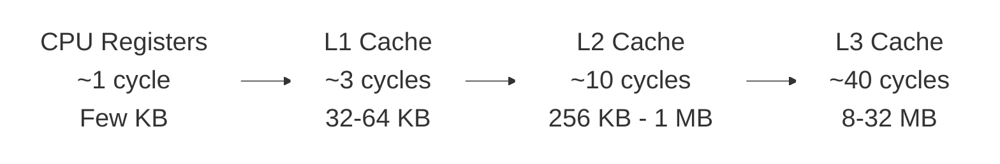
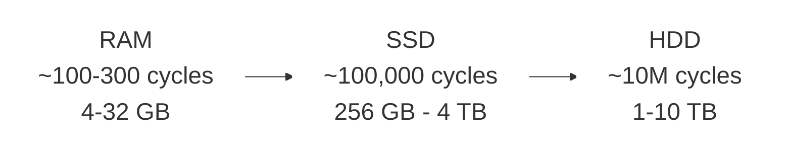

# Dr. Mindaugas Šarpis

# Data Analysis and Artificial Intelligence

## Computing Infrastructure

---
hideInToc: true
layout: quote
---

# Every data analysis depends on the hardware beneath it. Understanding **CPUs**, **memory**, **storage**, and **accelerators** helps you write faster code, choose the right tools, and make the most of the machines you work with.

---
hideInToc: true
---

# Why Hardware Matters for Data Analysis

<div class="grid-2 mt-md gap-md">

<div class="card card-primary card-glass pad-tight">

## 🚀 **Performance**

The difference between a 10-second and a 10-hour analysis often comes down to hardware choices — memory size, storage speed, and whether you use a GPU

</div>

<div class="card card-secondary card-glass pad-tight">

## 🧠 **Informed Decisions**

Understanding what's under the hood helps you choose the right cloud instance, optimize your code, and debug performance bottlenecks

</div>

<div class="card card-accent card-glass pad-tight">

## 💡 **Vocabulary**

You will encounter terms like CPU cores, RAM, NVMe, and GPU acceleration constantly — in job descriptions, documentation, and team discussions

</div>

<div class="card card-info card-glass pad-tight">

## 🔬 **CERN Scale**

CERN processes petabytes of data using massive computing grids — the same principles apply at every scale, from your laptop to a data centre

</div>

</div>

---
layout: fact
hideInToc: true
---

#  What constitutes **computing infrastructure**?

---
hideInToc: true
---

# Hardware Components

<div class="grid-3 mt-md gap-md">

<div class="card card-primary card-glass pad-tight">

## 🖥️ **Core Processing**

- Central Processing Unit (**CPU**)
- Specialized Processors (**GPUs**, **TPUs**)

</div>

<div class="card card-secondary card-glass pad-tight">

## 💾 **Memory & Storage**

- Memory (**RAM**)
- Storage Devices (**HDD, SSD, NVMe**)

</div>

<div class="card card-accent card-glass pad-tight">

## 🔌 **I/O & Connectivity**

- Input/Output (**I/O**) Devices
- Networking

</div>

<div class="card card-info card-glass pad-tight">

## ⚡ **Infrastructure**

- Power and Cooling
- Monitoring and Management Tools

</div>

<div class="card card-warning card-glass pad-tight">

## 🔒 **Security**

- Physical and logical security
- Access control

</div>

</div>

---
layout: section
hideInToc: true
---

# The **CPU**

---
hideInToc: true
---

# CPU (Central Processing Unit)

<div class="grid-2 mt-md gap-md">

<div class="card card-primary card-glass pad-tight">

## 🧠 **What It Does**

Basic arithmetic, logic, control, and input/output operations

</div>

<div class="card card-secondary card-glass pad-tight">

## 🔧 **CPU Sub-Components**

<div class="stack-tight">

<div class="card card-info card-glass pad-compact">⚙️ **Control Unit (CU)** — directs operations</div>

<div class="card card-accent card-glass pad-compact">➕ **Arithmetic Logic Unit (ALU)** — math & logic</div>

<div class="card card-success card-glass pad-compact">📋 **Registers** — fastest storage</div>

<div class="card card-warning card-glass pad-compact">💨 **Cache** — near-CPU memory</div>

<div class="card card-primary card-glass pad-compact">🔀 **Buses** — data pathways</div>

</div>

</div>

</div>

---
hideInToc: true
---

# CPU Performance Factors

<div class="grid-2 mt-md gap-md">

<div class="card card-primary card-glass pad-tight">

## ⏱️ **Clock Speed**

How many cycles per second the CPU can execute — modern CPUs run at **3–5 GHz** (billions of cycles per second)

</div>

<div class="card card-secondary card-glass pad-tight">

## 🔢 **Number of Cores**

More cores enable parallel execution — laptops typically have **4–16 cores**, servers up to **128+**

</div>

<div class="card card-info card-glass pad-tight">

## 💨 **Cache Size**

Larger caches reduce memory access latency — typically **32 KB** (L1) to **32 MB** (L3) per chip

</div>

<div class="card card-accent card-glass pad-tight">

## 🔋 **Power Efficiency**

Performance per watt matters — a laptop CPU uses **15–45W**, a server chip **200–350W**

</div>

</div>

---
hideInToc: true
layout: image
image: /figures/cpu1.avif
---

<div class="absolute bottom-4 left-4 right-4">
<div class="card card-primary card-glass pad-compact" style="background: rgba(0,0,0,0.7);">

A modern multi-core CPU die — the complex circuitry visible on the silicon wafer integrates billions of transistors for processing, cache, and I/O.

</div>
</div>

---
hideInToc: true
layout: image
image: /figures/cpu2.jpg
---

<div class="absolute bottom-4 left-4 right-4">
<div class="card card-primary card-glass pad-compact" style="background: rgba(0,0,0,0.7);">

Close-up of a CPU package mounted on a motherboard. The metal heat spreader covers the silicon die and conducts heat to the cooler above.

</div>
</div>

---
hideInToc: true
layout: image
image: /figures/cpu_apple_M4.webp
---

<div class="absolute bottom-4 left-4 right-4">
<div class="card card-primary card-glass pad-compact" style="background: rgba(0,0,0,0.7);">

Apple M4 system-on-chip (SoC) — integrates CPU, GPU, Neural Engine, and unified memory on a single die for maximum efficiency.

</div>
</div>

---
layout: section
hideInToc: true
---

# Memory & **Storage**

---
hideInToc: true
---

# RAM (Random Access Memory)

<div class="grid-2 mt-md gap-md">

<div class="card card-primary card-glass pad-tight">

## 📝 **Characteristics**

- **Volatile memory** — data lost on power-off
- **High-Speed Access** — orders of magnitude faster than disk
- **Temporary Storage** — working space for active processes

</div>

<div class="card card-secondary card-glass pad-tight">

## 📊 **Specifications**

- **Capacity** — measured in GB or TB
- **Performance** — measured in MHz or GHz
- Determines how much data can be processed simultaneously

</div>

</div>

---
hideInToc: true
layout: image
image: https://miro.medium.com/v2/resize:fit:1400/format:webp/0*6k9X6LPiM4XKyssm.jpg
---

<div class="absolute bottom-4 left-4 right-4">
<div class="card card-secondary card-glass pad-compact" style="background: rgba(0,0,0,0.7);">

Desktop RAM modules (DIMMs) — each stick contains multiple memory chips that provide fast, volatile storage for active programs and data.

</div>
</div>

---
hideInToc: true
layout: image
image: https://www.pcworld.com/wp-content/uploads/2023/04/corsair-dominator-memory-100884308-orig-1.jpg?quality=50&strip=all
---

<div class="absolute bottom-4 left-4 right-4">
<div class="card card-secondary card-glass pad-compact" style="background: rgba(0,0,0,0.7);">

High-performance DDR memory with heat spreaders. Overclocking-grade RAM uses custom PCB designs and binned chips for higher clock speeds.

</div>
</div>

---
hideInToc: true
layout: center
---


<div class="card card-secondary card-glass pad-compact mt-sm">

Laptop SO-DIMM RAM modules — smaller than desktop DIMMs, often soldered onto the motherboard in modern ultrabooks.

</div>

---
hideInToc: true
---

# Storage Devices

<div class="grid-2 mt-md gap-md">

<div class="card card-primary card-glass pad-tight">

## 💿 **Mechanical**

- **HDD** (Hard Disk Drive) — spinning platters, high capacity, slower

</div>

<div class="card card-secondary card-glass pad-tight">

## ⚡ **Solid State**

- **SSD** (Solid State Drive) — flash memory, faster, no moving parts
- **SSHD** (Solid State Hybrid Drive) — combines HDD + flash cache

</div>

<div class="card card-accent card-glass pad-tight" style="grid-column: 1 / -1;">

## 🚀 **NVMe** (Non-Volatile Memory Express)

Direct PCIe connection — fastest consumer storage available

</div>

</div>

<div style="margin-top: 2rem; text-align: center;">


</div>

---
hideInToc: true
layout: center
---


<div class="card card-accent card-glass pad-compact mt-sm">

Inside a hard disk drive (HDD) — spinning magnetic platters with a read/write head. Typical speeds: 5400–7200 RPM.

</div>

---
hideInToc: true
layout: image
image: /figures/hdd_schematic.png
backgroundSize: contain
---

<div class="absolute bottom-4 left-4 right-4">
<div class="card card-accent card-glass pad-compact" style="background: rgba(0,0,0,0.7);">

HDD schematic — data is stored in concentric tracks on the platter surface. The actuator arm positions the head over the correct track to read or write data.

</div>
</div>

---
hideInToc: true
layout: image
image: /figures/hdd_magnetic_domains.png
backgroundSize: contain
---

<div class="absolute bottom-4 left-4 right-4">
<div class="card card-accent card-glass pad-compact" style="background: rgba(0,0,0,0.7);">

Magnetic domains on an HDD platter — each bit is stored as the orientation of a tiny magnetic region. Smaller domains allow higher storage density.

</div>
</div>

---
hideInToc: true
layout: center
---


<div class="card card-accent card-glass pad-compact mt-sm">

A solid-state drive (SSD) — no moving parts means faster access, lower latency, and better shock resistance than HDDs.

</div>

---
hideInToc: true
layout: center
---


<div class="card card-accent card-glass pad-compact mt-sm">

NVMe M.2 drive — connects directly to the PCIe bus, bypassing SATA. Sequential reads can exceed 7 GB/s.

</div>

---
hideInToc: true
layout: image
image: /figures/ssd_floating_gate_3d.webp
backgroundSize: contain
---

<div class="absolute bottom-4 left-4 right-4">
<div class="card card-accent card-glass pad-compact" style="background: rgba(0,0,0,0.7);">

3D NAND flash architecture — memory cells are stacked vertically in layers, dramatically increasing storage density without shrinking individual cell sizes.

</div>
</div>

---
hideInToc: true
layout: image
image: /figures/ssd_floating_gate.png
backgroundSize: contain
---

<div class="absolute bottom-4 left-4 right-4">
<div class="card card-accent card-glass pad-compact" style="background: rgba(0,0,0,0.7);">

Floating gate transistor — the core storage mechanism of flash memory. Electrons trapped on the floating gate change the transistor's threshold voltage to represent 0 or 1.

</div>
</div>

---
hideInToc: true
layout: section
---

# Input/Output (I/O) **Devices**

---
hideInToc: true
---

# Input/Output (I/O) Devices

<div class="grid-2 mt-md gap-md">

<div class="card card-primary card-glass pad-tight">

## 🔌 **What Is I/O?**

Any transfer of data **into** or **out of** the CPU — reading files from disk, receiving network packets, or sending output to a display.

</div>

<div class="card card-secondary card-glass pad-tight">

## 🚌 **Common I/O Interfaces**

- **PCIe** — high-speed internal bus (GPUs, NVMe, network cards)
- **USB** — universal external connectivity
- **SATA** — storage device interface
- **Ethernet / InfiniBand** — network data transfer

</div>

<div class="card card-accent card-glass pad-tight">

## 🚧 **The I/O Bottleneck**

I/O is typically the **slowest link** in the data pipeline. A fast CPU waiting on a slow disk read is effectively idle — this is why SSDs, caching, and async I/O matter.

</div>

<div class="card card-info card-glass pad-tight">

## 📊 **Why It Matters for Analysis**

Reading a large dataset from disk or over a network often dominates total runtime. Choosing the right storage, format, and access pattern can cut I/O time by orders of magnitude.

</div>

</div>

---
layout: section
hideInToc: true
---

# Specialized **Processors**

---
hideInToc: true
---

# Specialized Processors

<div class="grid-2 mt-md gap-md">

<div class="card card-primary card-glass pad-tight">

## 🎮 **GPU** (Graphics Processing Unit)

Massively parallel — thousands of small cores for throughput

</div>

<div class="card card-secondary card-glass pad-tight">

## 🤖 **TPU** (Tensor Processing Unit)

Google-designed accelerator optimized for ML tensor operations

</div>

<div class="card card-accent card-glass pad-tight">

## 🔧 **FPGA** (Field-Programmable Gate Array)

Reconfigurable hardware — customizable logic for specific tasks

</div>

<div class="card card-info card-glass pad-tight">

## 🏭 **ASIC** (Application-Specific Integrated Circuit)

Fixed-function chip — maximum efficiency for a single task

</div>

</div>

---
hideInToc: true
---

# GPU (Graphics Processing Unit)

<div class="grid-2 mt-md gap-md">

<div class="card card-primary card-glass pad-tight">

## 🎯 **Primary Uses**

- Graphics Rendering
- Parallel Processing Power
- Video Processing and Encoding

</div>

<div class="card card-secondary card-glass pad-tight">

## 🔬 **Scientific Applications**

- Accelerating Machine Learning and AI
- Scientific and Data Analysis Computing
- Simulation and modelling

</div>

</div>

---
hideInToc: true
layout: center
---


<div class="card card-primary card-glass pad-compact mt-sm">

A modern GPU — thousands of parallel cores under the cooler, designed for high-throughput computation.

</div>

---
hideInToc: true
layout: image
image: https://cdn.mos.cms.futurecdn.net/xd2Hw9Cki3qhzbC2WxNBcA.jpg
---

<div class="absolute bottom-4 left-4 right-4">
<div class="card card-primary card-glass pad-compact" style="background: rgba(0,0,0,0.7);">

GPU die shot — the highly regular grid pattern reflects the SIMD architecture: thousands of identical cores executing the same instruction on different data in parallel.

</div>
</div>

---
hideInToc: true
---

# CPU vs GPU — Visualized

<div class="mt-md" style="text-align: center;">
  <iframe
    src="https://www.youtube.com/embed/1vXFxEzozcE?si=E6BKmW_vWHg0F0Pi&rel=0"
    width="720" height="340"
    style="border:0; border-radius: 8px;"
    allow="fullscreen"
    allowfullscreen>
  </iframe>
</div>


---
layout: section
hideInToc: true
---

# Infrastructure & **Software**

---
hideInToc: true
---

# Infrastructure & Operations

<div class="grid-3 mt-md gap-md">

<div class="card card-primary card-glass pad-tight">

## ⚡ **Power and Cooling**

Reliable power supply, UPS systems, and thermal management for sustained operation

</div>

<div class="card card-secondary card-glass pad-tight">

## 🌐 **Networking**

Interconnects, bandwidth, latency — moving data between components and systems

</div>

<div class="card card-info card-glass pad-tight">

## 📈 **Monitoring & Management**

System health, resource utilization, alerting, and capacity planning tools

</div>

</div>

---
hideInToc: true
---

# Security, Software & Cloud

<div class="grid-3 mt-md gap-md">

<div class="card card-warning card-glass pad-tight">

## 🔒 **Security**

Access control, encryption, firewalls, intrusion detection — protecting data and infrastructure

</div>

<div class="card card-accent card-glass pad-tight">

## 💻 **Software**

Operating systems, drivers, middleware, and application software that runs on the hardware

</div>

<div class="card card-success card-glass pad-tight">

## ☁️ **Virtualization & Cloud**

Abstract hardware into virtual machines and containers — scalable, on-demand resources

</div>

</div>

---
hideInToc: true
---

# Software Components

<div class="grid-2 mt-md gap-md">

<div class="card card-primary card-glass pad-tight">

## 🖥️ **Operating Systems**

- 🪟 **Windows** — desktop, enterprise
- 🍎 **macOS** — Apple ecosystem
- 🐧 **Linux** — servers, HPC, science

</div>

<div class="card card-secondary card-glass pad-tight">

## 🔗 **Middleware & Applications**

- **Middleware** and Virtualization — bridges OS and applications
- **Application** Software — the tools you actually use for analysis

</div>

</div>

---
layout: section
hideInToc: true
---

# The Memory **Hierarchy**

---
hideInToc: true
---

# The Memory Hierarchy

<div style="text-align: center;">





</div>

---
hideInToc: true
---

# Memory Access Times

<div class="card card-info card-glass pad-tight mt-md">

## ⏱️ **Latency Comparison**

| **Storage Type** | **Access Time** | **Relative Cost** |
|------------------|-----------------|-------------------|
| CPU Register     | 1 ns            | 1x                |
| L1 Cache         | 2-4 ns          | 2-4x              |
| L2 Cache         | 10-20 ns        | 10-20x            |
| RAM              | 100-300 ns      | 100-300x          |
| SSD              | 100 μs          | 100,000x          |
| HDD              | 10 ms           | 10,000,000x       |

</div>

---
hideInToc: true
---

# Why This Matters for Data Analysis

<div class="grid-2 mt-md gap-md">

<div class="card card-primary card-glass pad-tight">

## 📍 **Locality Matters**

Keep related data close together in memory — sequential access patterns are dramatically faster than random access

</div>

<div class="card card-secondary card-glass pad-tight">

## ⚡ **Vectorization**

Process arrays in chunks that fit in cache — SIMD instructions can operate on multiple data points simultaneously

</div>

<div class="card card-accent card-glass pad-tight">

## 📂 **File Formats**

Columnar formats (Parquet) are cache-friendly — read only the columns you need instead of entire rows

</div>

<div class="card card-warning card-glass pad-tight">

## 🧮 **Algorithm Choice**

Memory access patterns affect performance more than computation — an algorithm with better locality often beats a "faster" one

</div>

</div>

---
hideInToc: true
---

# How Computer Memory Works


<div class="mt-md" style="text-align: center;">
  <iframe
    src="https://www.youtube.com/embed/h9Z4oGN89MU?si=238qvmSpbhkseW2I"
    width="720" height="340"
    style="border:0; border-radius: 8px;"
    allow="fullscreen"
    allowfullscreen>
  </iframe>
</div>

---
hideInToc: true
---

# Exercise — Know Your Machine

<div class="grid-2 mt-md gap-md">

<div class="card card-primary card-glass pad-tight">

## 🖥️ **macOS / Linux**

```bash
# CPU info
sysctl -n machdep.cpu.brand_string  # macOS
lscpu                                # Linux

# RAM
sysctl -n hw.memsize      # macOS (bytes)
free -h                    # Linux

# Disk
df -h
```

</div>

<div class="card card-secondary card-glass pad-tight">

## 🪟 **Windows (PowerShell)**

```powershell
# CPU info
Get-WmiObject Win32_Processor | Select Name

# RAM
(Get-CimInstance Win32_PhysicalMemory |
  Measure -Property Capacity -Sum).Sum / 1GB

# Disk
Get-PSDrive C
```

</div>

</div>

<div class="card card-info card-glass pad-compact mt-md">

## 🎯 **Try it now**

Open a terminal and find out: How many CPU cores do you have? How much RAM? What type of storage (HDD or SSD)?

</div>

---
hideInToc: true
---

# Key Takeaways

<div class="grid-2 mt-md gap-md">

<div class="card card-primary card-glass pad-tight">

## 🧠 **CPU**

The brain of computation — clock speed, cores, and cache determine how fast you can crunch numbers

</div>

<div class="card card-secondary card-glass pad-tight">

## 💾 **Memory Hierarchy**

Speed and cost trade off — registers are fastest, disk is cheapest. Keeping data close to the CPU is key

</div>

<div class="card card-accent card-glass pad-tight">

## 🎮 **Specialized Hardware**

GPUs and other accelerators enable massive parallelism for data-intensive and ML workloads

</div>

<div class="card card-info card-glass pad-tight">

## 📊 **Why It Matters**

Understanding hardware helps you choose the right tools, write faster code, and avoid bottlenecks in your data analysis pipelines

</div>

</div>
