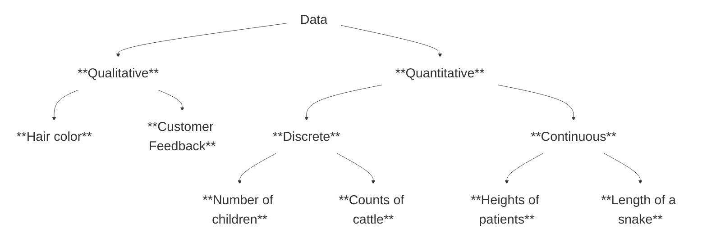

# Dr. Mindaugas Šarpis

# Data Analysis and Artificial Intelligence

## Concepts of Data Analysis — Extended

---
layout: section
hideInToc: true
---

# Examples of **data analysis** in different fields of science and industry

---
hideInToc: true
---

# **Bio medicine and Genomics**

- ## 🧬 Genome Sequencing → identifying variants & gene expression patterns

- ## 💊 Clinical Trials → monitoring safety, efficacy, adaptive designs

- ## 📊 Population health dashboards & personalised medicine

- ## 🎯 Decisions: targeted therapies, drug discovery, diagnostics

### 🧪 **23andMe** or **Ancestry.com** (ancestry services)? Comparing against *reference populations*

---
hideInToc: true
---

# **Environmental Sciences**

- ## 🌍 Climate models integrating satellite, sensor, and historical data

- ## 🏭 Pollution monitoring at city/block resolution

- ## 🌿 Biodiversity studies combining field notes + remote sensing

- ## 📜 Supports policy making, disaster response, conservation funding

#### 🔄 Living analysis → data feeds update models continuously

---
hideInToc: true
---

# **Social Sciences**

- ## 📈 Economic forecasting blending macro indicators & behavioural data

- ## 🧑‍🤝‍🧑 Social behaviour studies using surveys, logs, ethnography

- ## 💬 Text analysis for sentiment, misinformation, community wellbeing

- ## 🏛️ Informs policy, marketing, product design, civic planning

#### 🔗 Qualitative + quantitative insights reinforce each other

---
hideInToc: true
---

# **Astronomy**

- ## 🔭 Observational data analysis from telescopes, satellites, detectors

- ## 🌊 Gravitational wave detection via signal processing & ML

- ## 🌟 Cataloguing millions of celestial objects, anomaly detection

- ## 💻 Requires high-throughput computing, reproducible pipelines

#### 🤖 Fun fact: many ML innovations came from sky surveys

---
hideInToc: true
---

# **Particle Physics (CERN)**

- ## ⚛️ Petabytes of collision data → reconstruct events, filter noise

- ## 📊 Multivariate analysis to isolate rare signals (e.g. Higgs boson)

- ## 🤝 Collaboration across detectors, theory, computing teams

- ## 🌐 Drives advances in distributed computing & open data practices

---
hideInToc: true
---

# **Engineering**

- ## 🔧 Predictive maintenance on turbines, trains, manufacturing lines

- ## 👁️ Quality control with computer vision & statistical process control

- ## 📡 Structural health monitoring via sensors + physics-informed models

- ## 🎯 Outcomes: less downtime, safer infrastructure, cost optimisation

---
hideInToc: true
---

# **Healthcare Operations**

- ## 🦠 Epidemiology tracking outbreaks & transmission dynamics

- ## 🏥 Health policy simulation for capacity planning & funding

- ## 🏗️ Hospital operations: patient flow, staffing, supply chain analytics

- ## ⚖️ Ethical considerations: privacy, bias, explainability

---
hideInToc: true
---

# **Finance**

- ## 📈 Stock market analysis + algorithmic trading with latency constraints

- ## 🛡️ Risk management using stress tests, scenario analysis, VaR

- ## 🔍 Fraud detection & compliance monitoring with streaming data

- ## ⚖️ Balances profitability with regulation and transparency

---
hideInToc: true
---

# **Sports Analytics**

- ## 🏃 Performance analysis combining tracking sensors & video

- ## 🎮 Strategy optimisation: playbooks, opponent scouting

- ## 🎟️ Fan engagement through personalised content & ticket pricing

- ## 📊 Data informs coaching, recruitment, business growth

---
hideInToc: true
---

# **Product & Business Analytics**

- ## 📊 Growth funnels: acquisition, activation, retention, revenue, referral

- ## 🧪 Experimentation: A/B tests, feature flagging, causal inference

- ## 👥 Customer segmentation & lifetime value in subscription models

- ## 🗺️ Guides product roadmaps, marketing spend, customer success

---
hideInToc: true
---

# **Public Policy & Urban Planning**

- ## 🏙️ Smart city sensors to manage transport, energy, waste

- ## 📂 Open data portals enabling transparency & civic innovation

- ## 🗺️ Geospatial analysis for zoning, emergency response, sustainability

- ## 🤝 Stakeholder engagement & ethical data sharing are crucial

---
hideInToc: true
---

# **Education & Learning Analytics**

- ## 📚 Learning management system logs reveal engagement patterns

- ## 🚨 Early warning systems for student support

- ## 📝 Curriculum design using assessment data & qualitative feedback

- ## ⚖️ Balances personalisation with fairness and privacy

---
hideInToc: true
---

# Reflection — Which example resonates?

## 🔍 Where could similar data exist in your context?

## 🎯 What decisions would better data unlock?

## 🚧 What obstacles — technical, ethical, organisational — stand in the way?

---
layout: section
hideInToc: true
---

# Data **Fundamentals**

---
hideInToc: true
---

# Data comes in many shapes

## 📊 **Tabular** — rows × columns (experiments, business metrics)

## 🌳 **Hierarchical** — JSON/XML, nested logs, documents

## 🕸️ **Graph** — networks, relationships, supply chains

## 🗺️ **Spatial & temporal** — GIS layers, time series, event streams

## 🖼️ **Multimedia** — images, audio, video, sensor waveforms

---
hideInToc: true
---

# Structured vs unstructured

## 📐 **Structured**

Predefined schema, SQL-friendly (lab results)

## 🔖 **Semi-structured**

Consistent markers, flexible fields (JSON, HL7)

## 📝 **Unstructured**

Natural language, images, free-form signals

#### Choose storage, tooling, and cleaning strategies accordingly

---
hideInToc: true
---

# Levels of measurement

## 🏷️ **Nominal** — categories without order (blood type, product ID)

## 📶 **Ordinal** — ranked categories (survey Likert scales)

## 📏 **Interval** — consistent differences, no true zero (°C, calendar dates)

## ⚖️ **Ratio** — meaningful zero & ratios (mass, revenue, counts)

#### Measurement level dictates valid summaries & visualisations

---
hideInToc: true
---

# Granularity & unit of analysis

## 🔬 Define the entity: person, transaction, collision event, sensor ping

## 📊 Aggregation level affects signal vs noise

## ⚠️ Misaligned granularity introduces bias & misleading conclusions

## 📝 Document transformations between granularities

---
hideInToc: true
---

# Mind the time dimension

## 📊 Cross-sectional vs time series vs panel data

## ⏱️ Sampling frequency and latency influence what you can see

## 📈 Seasonality, trends, and lag effects require tailored methods

## 🕐 Align timestamps, time zones, and calendars early

---
hideInToc: true
---

# Metadata keeps data alive

## 👤 Who collected it, when, where, how, and why?

## 📐 Variable definitions, units, encoding schemes

## 🔗 Data lineage: transformations, assumptions, scripts, owners

## ⚠️ Without metadata the data become a liability, not an asset

---
hideInToc: true
---

# Data quality recap + two more dimensions

**Recall the quality checklist** — completeness, consistency, validity, timeliness, lineage, ethics. Two extra dimensions worth highlighting:

## 🎯 **Accuracy**

Does the recorded value reflect reality? Measurement error, transcription mistakes, and sensor drift all erode accuracy.

## 🔢 **Uniqueness**

Are there unintended duplicates? Deduplication is critical when merging datasets or ingesting repeated feeds.

---
hideInToc: true
---

# Common data issues & biases

## ❓ Missing data mechanisms (MCAR, MAR, MNAR)

## 📊 Outliers: true phenomena or collection errors?

## 🎯 Sampling bias & survivorship bias

## 🧠 Confirmation bias, p-hacking (see earlier definition), and multiple testing

## ⚖️ Ethical blind spots: representation, consent, accessibility

---
hideInToc: true
---

# **Continuous** and **Discrete** Data

### 🔢 Quantitative / Numerical Data

### 🏷️ Qualitative / Categorical Data

### 📅 Date and Time

---
hideInToc: true
---

# Exercise · Audit your data sources

## 📋 Pick one dataset you rely on

## 🔬 Classify type, granularity, measurement levels, quality risks

## 📝 Note missing metadata you would need before analysis

---
layout: section
hideInToc: true
---

# Data Lifecycle & **Workflow**

---
hideInToc: true
---

# Lifecycle Recap — Six Key Phases

Earlier we saw a detailed 9-stage lifecycle. Here is the same idea distilled into 6 high-level phases — easier to remember and apply day-to-day. The detailed stages nest inside these phases.

🎯 **Plan**

📥 **Acquire**

💾 **Store**

🔧 **Process**

📊 **Analyse**

📢 **Share**

---
hideInToc: true
---

# Governance overlays every stage

## 🔒 Security, privacy, compliance, and ethics checks

## 📝 Documentation and lineage updates

## ✅ Quality gates and automated tests

## 🔄 Feedback loops from stakeholders and end users

---
hideInToc: true
---

# Analysis is iterative

## 🔄 Expect to loop between question ↔ data ↔ analysis ↔ insight

## 🚧 Dead ends reveal where data, methods, or framing must change

## 🗂️ Maintain versioned checkpoints to compare approaches

## 📢 Communicate progress, uncertainty, and trade-offs early

---
hideInToc: true
---

# From data to decisions

## 💡 Translate insights into recommendations & actions

## 🎯 Align with organisational objectives and constraints

## 📏 Plan how outcomes will be measured post-decision

## 📝 Capture learnings to refine future analyses

---
layout: section
hideInToc: true
---

# Steps of Data **Analysis**

Now we walk through each step in detail — these map onto the lifecycle phases above, but focus on the practical "how"

---
hideInToc: true
---

# 1. **Define the Problem or Research Question**

## 🎯 Formulate the question with stakeholders and context

This might steer the choices in the following steps

## 📐 Translate goals into measurable metrics & hypotheses

## 🗺️ Map constraints: data access, time, ethics, skills

## 🧪 Plan the experimental or observational design

#### Interactive exercise · Draft a SMART question for your project

---
hideInToc: true
---

# 2. **Collect Data** — Key Questions

## 📊 How much data do you need?

## 🏷️ What sort of data do you need?

## 📁 What data formats should you choose?

## 🔍 Can you trust the data?

---
hideInToc: true
---

# 2. **Collect Data** — Best Practices

## ⚙️ Can you collect the data? Assess feasibility early

## 📝 Document permissions, consent, and provenance

## ✅ Automate validation checks at ingestion

---
hideInToc: true
---

# 3. **Clean Data**

## 🔍 **Data Selection**

## ✂️ **Data Stripping**

## 📊 **Data Skimming**

## 🔧 **Data Wrangling**

## ❓ Handle missing values, outliers, inconsistent categories

## 📝 Record transformations for reproducibility

---
hideInToc: true
---

# 4. **Analyze Data**

## 🔍 **Data Exploration**

## 📊 **Statistical Analysis**

## 🧪 **Model Building**

## 🤖 **Machine Learning**

## 🧠 **Classification (...AI...)**

## 📐 Evaluate assumptions, uncertainty, and sensitivity

#### Compare baseline vs advanced methods

---
hideInToc: true
---

# 5. **Visualize the data**

## 👥 What's your target audience?

## 💬 What is the message you want to convey?

## 🎨 Choose encodings that emphasise the core insight

## ✏️ Iterate quickly with sketches before polishing

#### 📌 Visualization principles are covered in the **Data Visualization** lecture (L7) — practical matplotlib skills come in later lectures

---
hideInToc: true
---

# 6. **Interpret and report the results**

## 🎯 Draw Conclusions from Data

## 📄 Report Findings

## 🔗 Connect to decisions, risks, next steps

## ❓ Capture limitations and open questions

## 📦 Package reproducible assets (code, dashboards, docs)

---
hideInToc: true
---

# Validation & monitoring

## 📊 Split data wisely, guard against leakage

## 📐 Assess error bars, confidence intervals, effect sizes

## 🧪 Stress test with scenario analysis & sensitivity checks

## 📡 Plan post-deployment monitoring for drift and quality

---
hideInToc: true
---

# Team checkpoints per phase

## 🚀 **Kickoff** → align on question, scope, success metrics

## 📊 **Midpoint** → share exploratory findings, data quality flags

## 🎤 **Pre-delivery** → rehearse narrative, anticipate objections

## 📝 **Retrospective** → document lessons, update playbooks

---
hideInToc: true
---

# Communication toolkit

## 📄 Executive summary (one-pager)

## 📓 Notebook or reproducible analysis package

## 📊 Dashboard / data app for continued monitoring

## 📋 Decision memo outlining options & trade-offs

## 🔬 Technical appendix for peers to audit

---
layout: section
hideInToc: true
---

# Tools & **Collaboration**

---
hideInToc: true
---

# Modern analytics stack

## 📡 **Data sources** — sensors, APIs, files, databases, experiments

## 📥 **Ingestion** — ETL/ELT tools, streaming pipelines, notebooks

## 💾 **Storage** — data lakes, warehouses, object stores, feature stores

## 💻 **Compute** — notebooks, scripts, distributed clusters, cloud services

## 📢 **Delivery** — dashboards, apps, reports, APIs, alerts

---
hideInToc: true
---

# People & roles

## 🧑‍🔬 **Domain experts** anchor context and define value

## 🔧 **Data engineers** ensure reliable, scalable pipelines

## 📊 **Analysts & scientists** explore, model, and interpret

## 🎨 **Visualisation designers** craft compelling stories

## ⚙️ **Product & ops teams** translate insight into action

---
hideInToc: true
---

# Collaboration rituals

## 📋 Shared backlog with clear owners & due dates

## 🔄 Version control (git) for notebooks, SQL, scripts

## 👁️ Code & analysis reviews to raise quality and share knowledge

## 🤝 Pair sessions for tricky modelling or cleaning tasks

## 📦 Reproducible environments (conda, containers, Poetry, Nix)

---
hideInToc: true
---

# Choosing the right artefact

## 📓 **Notebooks** for exploration, teaching, storytelling

## 📜 **Scripts & packages** for automation and reuse

## 📊 **Dashboards & apps** for ongoing monitoring

## 🧪 **Experiments** for causal claims and product decisions

#### Mix intentionally; document the purpose of each asset

---
hideInToc: true
---

# Languages of data

## 🗄️ **SQL** remains foundational for structured data

## 🐍 **Python** ecosystem (pandas, Polars, PySpark, SciPy, scikit-learn)

## 📊 **R** for statistics, visualisation, reproducible reports

## 🚀 **Julia, Scala, Rust** for performance-critical workloads

## 🔬 **Domain-specific** tools (ROOT at CERN, SAS, MATLAB, SPSS)

---
hideInToc: true
---

# Tool snapshots

## 🏢 **Proprietary**
Tableau, Origin, Excel

## 💻 **Languages**
Python, R, Julia

## 💡 **Tip**
Mix surface-level ease with depth and reproducibility

---
hideInToc: true
---

# **Proprietary** Tools

## ⚠️ **Drawbacks**

- Expensive
- Limited in scope
- Lack compatibility
- Lack flexibility

## ✅ **Benefits**

- Easy to learn / use (GUI)
- Great for rapid stakeholder demos & quick wins

---
hideInToc: true
---

# **Programming** Languages

## ✅ **Benefits**

- Open Source
- Free
- Powerful
- Scales from exploration to production

## ⚠️ **Drawbacks**

- Steep learning curve (CLI)

---
hideInToc: true
---

# DataOps & automation

## ⏱️ Schedule data pipelines with orchestration tools

## 🔄 Leverage CI/CD for tests, linting, deployment

## 📐 Parameterise workflows for reproducibility

## 📡 Monitor pipelines for latency, failures, data drift

---
hideInToc: true
---

# Testing your analysis

## 🧪 Unit tests for data transforms & calculations

## ✅ Data validation (great expectations, pydantic, pandera)

## 📊 Statistical tests to confirm assumptions

## 📂 Golden datasets & regression tests for dashboards

## 👁️ Peer review before results leave the team

---
hideInToc: true
---

# Documentation & knowledge sharing

## 📖 Analyst runbooks and playbooks

## 📋 Data dictionaries & catalogs

## 📝 Decision logs capturing context and rationale

## 🎤 Internal demos & show-and-tell sessions

## 🤝 Mentoring to spread tooling fluency

---
hideInToc: true
---

# **Discussion**

## 🤔 When to use proprietary tools?

## 🔧 What should you be using?

## 📈 Saturation of achieved proficiency

## 🔄 How do we ensure reproducibility when collaborating?

---
layout: section
hideInToc: true
---

# Data **Hygiene**

---
hideInToc: true
---

# Why data hygiene matters

## 🚫 Prevent costly errors & embarrassing corrections

## 🤝 Build trust with stakeholders & regulators

## 🔄 Accelerate future analyses with reusable assets

## 🔒 Protect sensitive data and maintain compliance

## 📦 Enable others to replicate or extend your work

---
hideInToc: true
---

# Hygiene habits to cultivate

## 🔄 Source control for data definitions and transformations

## ✅ Automated linting & formatting for notebooks/scripts

## 📁 Clear folder structures & naming conventions

## 🗂️ Versioned datasets or snapshotting

## 🧹 Regular housekeeping: archive, deprecate, document

---
hideInToc: true
---

# Ethics & responsible analytics

## 🛡️ Minimise harm: privacy, consent, security

## ⚖️ Fairness: monitor for disparate impact across groups

## 🔍 Transparency: explain methods, assumptions, limitations

## 👤 Accountability: define owners and escalation paths

## 🌍 Sustainability: consider computational & environmental cost

---
hideInToc: true
---

# Data governance essentials

## 🔐 Policies for access control and approvals

## 📋 Data catalogues & stewardship roles

## 📜 Compliance frameworks (GDPR, HIPAA, CERN policies)

## 🚨 Incident response plans for data breaches or quality issues

## 📚 Training & audits to keep teams aligned

---
layout: section
hideInToc: true
---

# **FAIR** Principles

---
layout: quote
hideInToc: true
---

## The first step in **(re)using data** is to find them. **Metadata** and data should be easy to find for both humans and computers. Machine-readable metadata are essential for automatic discovery of datasets and services, so this is an essential component of the FAIRification process.

---
hideInToc: true
---

# **Findable** data

## 🏷️ **F1.** (Meta)data are assigned a globally **unique** and persistent **identifier**

## 📝 **F2.** Data are described with **rich metadata**

## 🔗 **F3.** Metadata explicitly **include the identifier** of the data they describe

## 🔍 **F4.** (Meta)data are registered or indexed in a **searchable resource**

---
hideInToc: true
---

# What is **Metadata**?

## 📋 **Metadata** = data about data

Metadata describes the who, what, when, where, how, and why of a dataset. Examples: column names and types, units, collection date, author, license, provenance, and schema version.

## 🔍 **Why it matters for FAIR**

Without rich metadata, datasets cannot be found, understood, or reused. Machine-readable metadata enables automated discovery and integration across systems.

---
hideInToc: true
---

# **Accessible** data

## 🌐 **A1.** **(Meta)data** are retrievable by their **identifier** using a standardised communications protocol

### 📖 **A1.1** The protocol is **open**, free, and universally implementable

### 🔐 **A1.2** The protocol allows for an **authentication** and **authorisation** procedure, where necessary

## 📂 **A2.** Metadata are accessible, even when the data are no longer available

---
hideInToc: true
---

# **Interoperable** data

## 🗣️ **I1.** (Meta)data use a formal, accessible, shared, and broadly applicable **language for knowledge representation**

## 🔗 **I2.** (Meta)data use vocabularies that follow **FAIR principles**

## 📎 **I3.** (Meta)data include **qualified references** to other (meta)data

---
hideInToc: true
---

# **Reusable** data

## 📋 **R1.** (Meta)data are **richly described** with a plurality of accurate and relevant attributes

### 📜 **R1.1.** (Meta)data are released with a clear and **accessible** data usage **license**

### 🔗 **R1.2.** (Meta)data are associated with detailed **provenance**

### 🏛️ **R1.3.** (Meta)data meet **domain-relevant community standards**

---
hideInToc: true
---

# FAIR in practice

## 🏷️ Assign DOIs or persistent IDs through catalogues

## 📝 Publish rich metadata schemas (DCAT, schema.org, Invenio)

## 🌐 Provide API/documentation for programmatic access

## 📖 Reuse domain ontologies and controlled vocabularies

## 🔄 Capture provenance with tools like REANA, DVC, Quilt

---
layout: section
hideInToc: true
---

# Case Study · CERN **Open Data**

---
hideInToc: true
---

# Context

- ## 🌐 CERN releases proton-proton collision datasets via the Open Data portal

- ## 🎯 Goal: enable students & researchers to reproduce landmark analyses

- ## 📁 Data formats: ROOT files, CSV summaries, metadata packages

- ## 🔧 Tooling: ROOT, python, R, Jupyter, cloud notebooks

---
hideInToc: true
---

# Collaboration model

- ## 👥 Physicists, statisticians, software engineers, detector experts

- ## 🔄 Shared code repositories with rigorous review (ROOT macros, python)

- ## 🧪 Simulation teams provide synthetic data for validation

- ## 📄 Publication committees ensure rigour & messaging

---
hideInToc: true
---

# Risks & mitigations

## ⚠️ **Detector anomalies**

Continuous monitoring & calibration

## ⚠️ **Bias in selection cuts**

Blind analyses & control regions

## ✅ **Reproducibility**

Containerised environments, notebooks, docs

## ✅ **Communication**

Translate particle jargon for broader audiences

---
hideInToc: true
---

# Exercise · Plan your own analysis

## 📋 Pick a dataset (CERN or your organisation)

## 🔧 Draft a 6-step workflow referencing today's framework

## 👥 Identify stakeholders, success metrics, and key risks

## 📦 Decide what artefact you would deliver

---
hideInToc: true
---

# Lessons from CERN for everyone else

## 📝 Document everything — you never know who will re-run it

## 🔧 Invest in shared tooling and platforms early

## 🌐 Open data accelerates innovation beyond your organisation

## 👁️ Rigorous peer review can coexist with fast iteration

## 🎉 Celebrate small wins: incremental insights build trust

---
layout: section
hideInToc: true
---

# Wrap-up & **Next Steps**

---
hideInToc: true
---

# Key takeaways

## 🎯 Start with the decision, not the data

## 🔄 Treat data analysis as an iterative, collaborative lifecycle

## 🧹 Healthy data hygiene & governance underpin trustworthy insights

## 🔧 Choose tools intentionally to balance speed, scale, and rigour

## 📢 Communicate clearly, ethically, and with empathy for your audience

