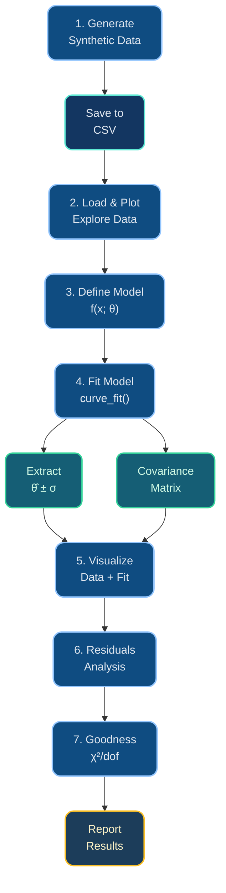

# Dr. Mindaugas Šarpis

# Lessons on **Data Analysis** from **CERN**

## Practical Data Fitting in Python

---
hideInToc: true
layout: quote
---

# From theory to practice: in L9 we learned the mathematics of MLE and χ². Now we apply these ideas to **real data** using Python's scientific computing tools.

---
hideInToc: true
---

# Motivation

<div class="card card-info pad-tight mt-md">

## **From L9 to L10: Closing the Loop**

In L9, we learned:
- Maximum Likelihood Estimation (MLE) for parameter estimation
- Least squares = MLE under Gaussian noise
- Chi-squared (χ²) statistic for goodness-of-fit
- The importance of uncertainty quantification

**Now:** Apply these concepts to fit models to real data using Python

</div>

<div class="grid-2 mt-md gap-md">

<div class="card card-primary pad-tight">

### 🎯 **Goals**
- Implement complete data analysis workflow
- Use `scipy.optimize.curve_fit`
- Visualize data and fitted models
- Compute uncertainties and residuals
- Assess fit quality (χ²/dof)

</div>

<div class="card card-secondary pad-tight">

### 🔬 **Example**
**Signal + Background Fitting**
- Gaussian signal (e.g., particle resonance)
- Exponential background
- Common in particle physics!

</div>

</div>

---
layout: section
hideInToc: true
---

# The Complete **Workflow**

---
hideInToc: true
---

# Scientific Data Analysis Workflow



<div class="card card-accent pad-tight mt-sm mermaid-note">

**This workflow is reproducible, modular, and follows best practices we've been building throughout the course**

</div>

---
layout: section
hideInToc: true
---

# Step 1: Generate **Synthetic Data**

---
hideInToc: true
---

# Why Synthetic Data?

<div class="grid-2 mt-md gap-md">

<div class="card card-primary pad-tight">

## **Educational Benefits**

✅ **Known truth**: we know the "right" answer

✅ **Controlled complexity**: adjust difficulty

✅ **Reproducible**: same random seed → same data

✅ **Fast iteration**: no waiting for experiments

</div>

<div class="card card-secondary pad-tight">

## **Real-World Application**

🔬 **Simulation studies** at CERN generate millions of events

📊 **Monte Carlo methods** model detector response

🎯 **Validate analysis pipelines** before applying to real data

💡 **Test edge cases** and statistical properties

</div>

</div>

<div class="card card-info pad-tight mt-md">

**Our Example**: Gaussian signal (particle resonance) + exponential background (combinatorial processes)

</div>

---
hideInToc: true
---

# Data Generation: Signal + Background

```py {monaco-run}
import numpy as np
import matplotlib.pyplot as plt

# Set random seed for reproducibility
np.random.seed(42)

# Signal parameters (Gaussian)
signal_mean = 5.0
signal_sigma = 1.0
n_signal = 1000

# Background parameters (Exponential)
background_scale = 2.0  # λ = 1/scale
n_background = 1500

# Generate data
signal = np.random.normal(signal_mean, signal_sigma, n_signal)
background = np.random.exponential(background_scale, n_background)
data = np.concatenate([signal, background])

# Visualize
fig, ax = plt.subplots(figsize=(10, 6))
ax.hist(background, bins=40, range=(0, 15), alpha=0.5, label='Background (exp)', color='#60a5fa')
ax.hist(signal, bins=40, range=(0, 15), alpha=0.5, label='Signal (Gaussian)', color='#fbbf24')
ax.hist(data, bins=40, range=(0, 15), histtype='step', linewidth=2, color='white', label='Combined Data')
ax.set_xlabel('Observable x', fontsize=12)
ax.set_ylabel('Counts', fontsize=12)
ax.legend(fontsize=10)
ax.grid(alpha=0.2)
plt.tight_layout()
plt.show()

print(f"Generated {n_signal} signal + {n_background} background = {len(data)} total events")
```

---
hideInToc: true
---

# Saving Data to CSV

<div class="card card-primary pad-tight mt-md">

## **Why CSV?**

- **Human-readable**: open in any text editor
- **Universal**: works across languages (Python, R, Excel)
- **Version control friendly**: text-based (unlike binary formats)
- **Simple**: no complex dependencies

</div>

```python
import csv

# Save to CSV
with open("sample_data.csv", "w", newline="") as f:
    writer = csv.writer(f)
    writer.writerow(["x"])  # Header
    writer.writerows([[val] for val in data])

print("Data saved to sample_data.csv")
```

<div class="card card-accent pad-tight mt-md">

**Best Practice**: Separate data generation from analysis. This makes your workflow modular and reproducible.

</div>

---
layout: section
hideInToc: true
---

# Step 2: Load & **Explore** Data

---
hideInToc: true
---

# Loading and Visualizing Data

```py {monaco-run}
import numpy as np
import matplotlib.pyplot as plt

# Generate synthetic data inline for this demo
np.random.seed(42)
data = np.concatenate([
    np.random.normal(5.0, 1.0, 1000),
    np.random.exponential(2.0, 1500)
])

# In practice, you'd load from CSV:
# data = np.loadtxt("sample_data.csv", delimiter=",", skiprows=1)

print(f"Loaded {len(data)} data points")
print(f"Range: [{data.min():.2f}, {data.max():.2f}]")
print(f"Mean: {data.mean():.2f}, Std: {data.std():.2f}")

# Create histogram for inspection
fig, ax = plt.subplots(figsize=(10, 6))
counts, bins, _ = ax.hist(data, bins=50, range=(0, 15),
                           edgecolor='white', linewidth=0.5,
                           color='#60a5fa', alpha=0.7)
ax.set_xlabel('Observable x', fontsize=12)
ax.set_ylabel('Counts', fontsize=12)
ax.set_title('Data Distribution (before fitting)', fontsize=14)
ax.grid(alpha=0.2)
plt.tight_layout()
plt.show()
```

<div class="card card-warning pad-tight mt-sm">

**Always visualize your data first!** Look for outliers, unexpected structure, or issues before fitting.

</div>

---
layout: section
hideInToc: true
---

# Step 3: Define the **Model**

---
hideInToc: true
---

# Mathematical Model

<div class="card card-info pad-tight mt-md">

## **Model: Gaussian Signal + Exponential Background**

$$f(x; \theta) = A \cdot \exp\left(-\frac{(x - \mu)^2}{2\sigma^2}\right) + N \cdot \exp\left(-\frac{x}{\lambda}\right)$$

Where parameters $\theta = \{A, \mu, \sigma, N, \lambda\}$:

- $A$: Gaussian amplitude (signal height)
- $\mu$: Gaussian mean (signal position)
- $\sigma$: Gaussian standard deviation (signal width)
- $N$: Exponential normalization (background level)
- $\lambda$: Exponential scale (background decay)

</div>

<div class="grid-2 mt-md gap-md">

<div class="card card-primary pad-tight">

### 🎯 **Signal Component**
Gaussian models localized peaks (e.g., particle mass resonances in physics)

</div>

<div class="card card-secondary pad-tight">

### 📉 **Background Component**
Exponential models smooth falling backgrounds (e.g., combinatorial processes)

</div>

</div>

---
hideInToc: true
---

# Implementing the Model in Python

```python
def model(x, amp, mean, sigma, exp_norm, exp_scale):
    """
    Combined Gaussian signal + exponential background model

    Parameters:
    -----------
    x : array-like
        Independent variable
    amp : float
        Amplitude of Gaussian signal
    mean : float
        Mean (center) of Gaussian
    sigma : float
        Standard deviation of Gaussian
    exp_norm : float
        Normalization of exponential background
    exp_scale : float
        Scale parameter (λ) of exponential

    Returns:
    --------
    y : array-like
        Model prediction at x
    """
    gaussian = amp * np.exp(-0.5 * ((x - mean) / sigma)**2)
    exponential = exp_norm * np.exp(-x / exp_scale)
    return gaussian + exponential
```

<div class="card card-accent pad-tight mt-sm">

**Docstring best practice**: Document parameters, returns, and purpose. Future you will thank present you!

</div>

---
layout: section
hideInToc: true
---

# Step 4: Fit the **Model**

---
hideInToc: true
---

# scipy.optimize.curve_fit

<div class="card card-primary pad-tight mt-md">

## **curve_fit: Maximum Likelihood Estimation**

`scipy.optimize.curve_fit` finds parameters that minimize the sum of squared residuals:

$$\chi^2 = \sum_i \frac{(y_i - f(x_i; \theta))^2}{\sigma_i^2}$$

When $\sigma_i$ are unknown (unweighted fit), this is equivalent to:

$$S(\theta) = \sum_i (y_i - f(x_i; \theta))^2$$

**This is exactly MLE under Gaussian errors** (from L9!)

</div>

<div class="grid-2 mt-md gap-md">

<div class="card card-info pad-tight">

### **Inputs**
- Model function `f(x, *params)`
- Data points `(x_data, y_data)`
- Initial parameter guess `p0`

</div>

<div class="card card-success pad-tight">

### **Outputs**
- Optimal parameters `popt`
- Covariance matrix `pcov`
- Uncertainties: `σ = sqrt(diag(pcov))`

</div>

</div>

---
hideInToc: true
---

# Fitting: From Histogram to Parameters

```py {monaco-run}
import numpy as np
import matplotlib.pyplot as plt
from scipy.optimize import curve_fit

# Generate synthetic data
np.random.seed(42)
data = np.concatenate([
    np.random.normal(5.0, 1.0, 1000),
    np.random.exponential(2.0, 1500)
])

# Create histogram (binned data for fitting)
hist, bin_edges = np.histogram(data, bins=50, range=[0, 15])
bin_centers = (bin_edges[:-1] + bin_edges[1:]) / 2

# Define model
def model(x, amp, mean, sigma, exp_norm, exp_scale):
    gaussian = amp * np.exp(-0.5 * ((x - mean) / sigma)**2)
    exponential = exp_norm * np.exp(-x / exp_scale)
    return gaussian + exponential

# Initial guess: [amp, mean, sigma, exp_norm, exp_scale]
initial_guess = [100, 5.0, 1.0, 50, 2.0]

# Perform fit
popt, pcov = curve_fit(model, bin_centers, hist, p0=initial_guess)
errors = np.sqrt(np.diag(pcov))

# Extract results
amp, mean, sigma, exp_norm, exp_scale = popt

print("Fit Results:")
print(f"  Gaussian mean:  {mean:.3f} ± {errors[1]:.3f}  (true: 5.0)")
print(f"  Gaussian sigma: {sigma:.3f} ± {errors[2]:.3f}  (true: 1.0)")
print(f"  Exp scale:      {exp_scale:.3f} ± {errors[4]:.3f}  (true: 2.0)")
print(f"\nSignal events: {amp * sigma * np.sqrt(2 * np.pi):.0f}")
```

---
hideInToc: true
---

# Understanding the Covariance Matrix

<div class="card card-info pad-tight mt-md">

## **Covariance Matrix: pcov**

The covariance matrix quantifies uncertainties and correlations between parameters:

$$\text{pcov}_{ij} = \text{Cov}(\theta_i, \theta_j)$$

- **Diagonal elements**: $\text{pcov}_{ii} = \sigma_i^2$ (variance of parameter $i$)
- **Off-diagonal elements**: correlation between parameters $i$ and $j$

**Parameter uncertainties**: $\sigma_i = \sqrt{\text{pcov}_{ii}}$

</div>

```python
# Extract uncertainties
errors = np.sqrt(np.diag(pcov))

print(f"Mean = {popt[1]:.3f} ± {errors[1]:.3f}")
```

<div class="card card-warning pad-tight mt-md">

**Important**: Uncertainties assume the model is correct and errors are Gaussian. Always check these assumptions!

</div>

---
layout: section
hideInToc: true
---

# Step 5: **Visualize** Fit Results

---
hideInToc: true
---

# Plotting Data with Fitted Model

```py {monaco-run}
import numpy as np
import matplotlib.pyplot as plt
from scipy.optimize import curve_fit

# Generate and fit data
np.random.seed(42)
data = np.concatenate([np.random.normal(5.0, 1.0, 1000), np.random.exponential(2.0, 1500)])
hist, bin_edges = np.histogram(data, bins=50, range=[0, 15])
bin_centers = (bin_edges[:-1] + bin_edges[1:]) / 2

def model(x, amp, mean, sigma, exp_norm, exp_scale):
    return amp * np.exp(-0.5 * ((x - mean) / sigma)**2) + exp_norm * np.exp(-x / exp_scale)

popt, pcov = curve_fit(model, bin_centers, hist, p0=[100, 5.0, 1.0, 50, 2.0])
amp, mean, sigma, exp_norm, exp_scale = popt

# Visualization
fig, ax = plt.subplots(figsize=(10, 6))
ax.hist(data, bins=50, range=[0, 15], alpha=0.6, label='Data', edgecolor='white', linewidth=0.5)

# Smooth curves for plotting
x_smooth = np.linspace(0, 15, 500)
ax.plot(x_smooth, model(x_smooth, *popt), 'r-', linewidth=2, label='Total Fit')
ax.plot(x_smooth, amp * np.exp(-0.5 * ((x_smooth - mean) / sigma)**2),
        'g--', linewidth=2, label='Signal (Gaussian)')
ax.plot(x_smooth, exp_norm * np.exp(-x_smooth / exp_scale),
        'm--', linewidth=2, label='Background (Exp)')

ax.set_xlabel('Observable x', fontsize=12)
ax.set_ylabel('Counts', fontsize=12)
ax.legend(fontsize=10)
ax.grid(alpha=0.2)
plt.tight_layout()
plt.show()
```

---
layout: section
hideInToc: true
---

# Step 6: **Residual** Analysis

---
hideInToc: true
---

# What are Residuals?

<div class="card card-primary pad-tight mt-md">

## **Definition**

**Residual** = observed value − fitted value

$$r_i = y_i - f(x_i; \hat{\theta})$$

Residuals tell us **how well the model fits** at each data point.

</div>

<div class="grid-2 mt-md gap-md">

<div class="card card-success pad-tight">

## ✅ **Good Fit**
- Residuals randomly scattered around zero
- No systematic patterns
- Approximately Gaussian distributed

</div>

<div class="card card-warning pad-tight">

## ⚠️ **Bad Fit**
- Clear trends or patterns
- Systematic deviations
- Model missing structure in data

</div>

</div>

---
hideInToc: true
---

# Residual Plot

```py {monaco-run}
import numpy as np
import matplotlib.pyplot as plt
from scipy.optimize import curve_fit

# Generate and fit data (same as before)
np.random.seed(42)
data = np.concatenate([np.random.normal(5.0, 1.0, 1000), np.random.exponential(2.0, 1500)])
hist, bin_edges = np.histogram(data, bins=50, range=[0, 15])
bin_centers = (bin_edges[:-1] + bin_edges[1:]) / 2

def model(x, amp, mean, sigma, exp_norm, exp_scale):
    return amp * np.exp(-0.5 * ((x - mean) / sigma)**2) + exp_norm * np.exp(-x / exp_scale)

popt, pcov = curve_fit(model, bin_centers, hist, p0=[100, 5.0, 1.0, 50, 2.0])

# Calculate residuals
fitted_values = model(bin_centers, *popt)
residuals = hist - fitted_values

# Plot residuals
fig, (ax1, ax2) = plt.subplots(2, 1, figsize=(10, 8), sharex=True,
                                 gridspec_kw={'height_ratios': [3, 1], 'hspace': 0.05})

# Top: Data + Fit
ax1.errorbar(bin_centers, hist, yerr=np.sqrt(hist), fmt='o', markersize=4,
             label='Data', color='white', alpha=0.7)
x_smooth = np.linspace(0, 15, 500)
ax1.plot(x_smooth, model(x_smooth, *popt), 'r-', linewidth=2, label='Fit')
ax1.set_ylabel('Counts', fontsize=12)
ax1.legend(fontsize=10)
ax1.grid(alpha=0.2)

# Bottom: Residuals
ax2.errorbar(bin_centers, residuals, yerr=np.sqrt(hist), fmt='o', markersize=4, color='#60a5fa')
ax2.axhline(0, color='red', linestyle='--', linewidth=1)
ax2.set_xlabel('Observable x', fontsize=12)
ax2.set_ylabel('Residuals', fontsize=12)
ax2.grid(alpha=0.2)

plt.tight_layout()
plt.show()

print(f"Mean residual: {residuals.mean():.2f} (should be ≈ 0)")
print(f"Std of residuals: {residuals.std():.2f}")
```

---
layout: section
hideInToc: true
---

# Step 7: Goodness-of-Fit with **χ²**

---
hideInToc: true
---

# Chi-Squared Test

<div class="card card-primary pad-tight mt-md">

## **Chi-Squared Statistic (from L9)**

$$\chi^2 = \sum_{i=1}^{n} \frac{(y_i - f(x_i; \hat{\theta}))^2}{\sigma_i^2}$$

For histogram bins with Poisson uncertainties: $\sigma_i = \sqrt{y_i}$

</div>

<div class="card card-info pad-tight mt-md">

## **Reduced Chi-Squared**

$$\chi^2_{\text{reduced}} = \frac{\chi^2}{\text{dof}} = \frac{\chi^2}{n - p}$$

where:
- $n$ = number of data points
- $p$ = number of fitted parameters
- $\text{dof}$ = degrees of freedom

</div>

<div class="grid-3 mt-md gap-md">

<div class="card card-success pad-tight">

### ✅ **Good Fit**
$\chi^2_{\text{red}} \approx 1$

</div>

<div class="card card-warning pad-tight">

### ⚠️ **Underfitting**
$\chi^2_{\text{red}} \gg 1$

Model too simple

</div>

<div class="card card-accent pad-tight">

### 🔍 **Overfitting?**
$\chi^2_{\text{red}} \ll 1$

Errors overestimated

</div>

</div>

---
hideInToc: true
---

# Calculating χ² in Python

```py {monaco-run}
import numpy as np
from scipy.optimize import curve_fit

# Generate and fit data
np.random.seed(42)
data = np.concatenate([np.random.normal(5.0, 1.0, 1000), np.random.exponential(2.0, 1500)])
hist, bin_edges = np.histogram(data, bins=50, range=[0, 15])
bin_centers = (bin_edges[:-1] + bin_edges[1:]) / 2

def model(x, amp, mean, sigma, exp_norm, exp_scale):
    return amp * np.exp(-0.5 * ((x - mean) / sigma)**2) + exp_norm * np.exp(-x / exp_scale)

popt, pcov = curve_fit(model, bin_centers, hist, p0=[100, 5.0, 1.0, 50, 2.0])

# Calculate chi-squared
fitted_values = model(bin_centers, *popt)
residuals = hist - fitted_values

# For histogram: uncertainties are sqrt(counts)
# Avoid division by zero for empty bins
uncertainties = np.sqrt(np.where(hist > 0, hist, 1))
chi_squared = np.sum((residuals / uncertainties)**2)

# Degrees of freedom
n_data_points = len(bin_centers)
n_parameters = 5
dof = n_data_points - n_parameters
chi_squared_reduced = chi_squared / dof

print(f"Chi-squared: {chi_squared:.2f}")
print(f"Degrees of freedom: {dof}")
print(f"Chi-squared / dof: {chi_squared_reduced:.3f}")
print()

if 0.8 <= chi_squared_reduced <= 1.2:
    print("✅ Good fit! χ²/dof ≈ 1")
elif chi_squared_reduced > 1.2:
    print("⚠️  χ²/dof > 1: Model may be missing structure")
else:
    print("🔍 χ²/dof < 1: Uncertainties may be overestimated")
```

---
hideInToc: true
---

# Complete Analysis Example

<div class="card card-accent pad-tight mt-md">

## **Putting It All Together**

Here's the complete workflow in one place:

</div>

<div class="grid-2 mt-md gap-md">

<div class="card card-primary pad-tight">

### **Analysis Steps**
1. ✅ Generate/load data
2. ✅ Visualize distribution
3. ✅ Define physical model
4. ✅ Fit with `curve_fit`
5. ✅ Extract parameters & uncertainties
6. ✅ Plot data + fit + components
7. ✅ Compute residuals
8. ✅ Calculate χ²/dof
9. ✅ Report results

</div>

<div class="card card-secondary pad-tight">

### **Key Results to Report**
- Fitted parameters with uncertainties
- Correlation between parameters
- Goodness-of-fit (χ²/dof)
- Visual comparison (data vs model)
- Residual analysis
- Physical interpretation

</div>

</div>

---
layout: section
hideInToc: true
---

# Advanced Topics

---
hideInToc: true
---

# Initial Parameter Guesses

<div class="card card-warning pad-tight mt-md">

## **Why Initial Guesses Matter**

`curve_fit` uses **iterative optimization** (Levenberg-Marquardt algorithm). It can get stuck in local minima if the initial guess is poor.

</div>

<div class="grid-2 mt-md gap-md">

<div class="card card-primary pad-tight">

### 💡 **Good Practices**

1. **Visualize first**: Estimate parameters by eye
2. **Physical constraints**: Use domain knowledge
3. **Order of magnitude**: Don't worry about precision
4. **Multiple attempts**: Try different starting points

</div>

<div class="card card-info pad-tight">

### **Example Heuristics**

For Gaussian:
- `mean` ≈ location of peak
- `sigma` ≈ width of peak
- `amplitude` ≈ peak height

For Exponential:
- `scale` ≈ x-value where y drops to ~1/e

</div>

</div>

```python
# Bad: completely arbitrary
initial_guess = [1, 1, 1, 1, 1]  # ❌

# Good: informed by data visualization
initial_guess = [100, 5.0, 1.0, 50, 2.0]  # ✅
```

---
hideInToc: true
---

# Constraining Parameters

Sometimes you need to enforce physical constraints (e.g., σ > 0, amplitudes positive):

```python
from scipy.optimize import curve_fit

# Define bounds: (lower_bounds, upper_bounds)
bounds = (
    [0, 0, 0.01, 0, 0.1],      # Lower: all positive, σ > 0.01
    [np.inf, 15, 5, np.inf, 10]  # Upper: reasonable ranges
)

popt, pcov = curve_fit(
    model,
    bin_centers,
    hist,
    p0=initial_guess,
    bounds=bounds  # Enforce constraints
)
```

<div class="card card-info pad-tight mt-md">

**Use case**: Prevent optimizer from exploring unphysical parameter space (negative widths, impossible masses, etc.)

</div>

---
hideInToc: true
---

# Weighted Fitting

When data points have different uncertainties, use **weighted fitting**:

```python
# If you have uncertainties (errors) on each data point
uncertainties = np.sqrt(hist)  # Poisson errors for histograms

# Tell curve_fit to use these as weights
popt, pcov = curve_fit(
    model,
    bin_centers,
    hist,
    sigma=uncertainties,  # Uncertainties on y-values
    absolute_sigma=True,  # Treat sigma as absolute (not relative)
    p0=initial_guess
)
```

<div class="card card-primary pad-tight mt-md">

## **Why Weight?**

Points with smaller uncertainties should have more influence on the fit. This is equivalent to minimizing:

$$\chi^2 = \sum_i \frac{(y_i - f(x_i; \theta))^2}{\sigma_i^2}$$

</div>

---
hideInToc: true
---

# Extracting Number of Signal Events

<div class="card card-info pad-tight mt-md">

## **Physical Interpretation: Counting Signal Events**

The Gaussian amplitude isn't the number of signal events—it's the peak height. To get the total signal count:

$$N_{\text{signal}} = \int_{-\infty}^{\infty} A \cdot e^{-\frac{(x-\mu)^2}{2\sigma^2}} \, dx = A \cdot \sigma \cdot \sqrt{2\pi}$$

</div>

```python
# After fitting
amp, mean, sigma, exp_norm, exp_scale = popt
amp_err, mean_err, sigma_err, _, _ = np.sqrt(np.diag(pcov))

# Calculate number of signal events
n_signal = amp * sigma * np.sqrt(2 * np.pi)

# Propagate uncertainty (simplified: ignoring correlations)
n_signal_err = n_signal * np.sqrt(
    (amp_err / amp)**2 + (sigma_err / sigma)**2
)

print(f"Signal events: {n_signal:.0f} ± {n_signal_err:.0f}")
```

---
hideInToc: true
---

# Model Comparison: Which Model is Better?

<div class="card card-primary pad-tight mt-md">

## **Comparing Nested Models**

Sometimes you want to test whether adding complexity improves the fit:

- **Model A**: Exponential background only
- **Model B**: Gaussian signal + exponential background

</div>

<div class="grid-2 mt-md gap-md">

<div class="card card-info pad-tight">

### **Likelihood Ratio Test**

Compare χ² values:

$$\Delta \chi^2 = \chi^2_A - \chi^2_B$$

If $\Delta \chi^2$ is large, Model B is significantly better

</div>

<div class="card card-secondary pad-tight">

### **Information Criteria**

**AIC** (Akaike): $2p - 2\ln(L)$

**BIC** (Bayesian): $p\ln(n) - 2\ln(L)$

Lower is better. Penalizes model complexity.

</div>

</div>

<div class="card card-warning pad-tight mt-md">

**Caution**: More parameters always improve χ², but may lead to overfitting. Use statistical tests or cross-validation.

</div>

---
layout: section
hideInToc: true
---

# Real-World Considerations

---
hideInToc: true
---

# Common Pitfalls and How to Avoid Them

<div class="grid-2 mt-md gap-md" style="margin-top: 0;">

<div class="stack-tight">

<div class="card card-warning pad-tight">

## ⚠️ **Empty Histogram Bins**

**Problem**: $\sigma_i = \sqrt{0}$ → division by zero in χ²

**Solution**: Exclude empty bins or use $\sigma_i = 1$

</div>

<div class="card card-warning pad-tight">

## ⚠️ **Too Many Parameters**

**Problem**: Overfitting—model fits noise, not signal

**Solution**: Occam's razor—simplest model that explains data

</div>

</div>

<div class="stack-tight">

<div class="card card-warning pad-tight">

## ⚠️ **Ignoring Correlations**

**Problem**: Parameters often correlated (e.g., amplitude ↔ width)

**Solution**: Use full covariance matrix for uncertainty propagation

</div>

<div class="card card-warning pad-tight">

## ⚠️ **Poor Initial Guesses**

**Problem**: Optimizer converges to local minimum or fails

**Solution**: Inspect data, estimate parameters by eye first

</div>

</div>

</div>

---
hideInToc: true
---

# When Fitting Goes Wrong: Debugging

<div class="card card-accent pad-tight mt-md">

## **Fit Failed or Gives Nonsense Results?**

</div>

<div class="grid-3 mt-md gap-md">

<div class="card card-primary pad-tight">

### 1️⃣ **Check Data**
- Plot it first
- Look for outliers
- Check for NaNs/Infs

</div>

<div class="card card-secondary pad-tight">

### 2️⃣ **Check Model**
- Does it match data qualitatively?
- Are there typos in formula?
- Test with known parameters

</div>

<div class="card card-info pad-tight">

### 3️⃣ **Check Initial Guess**
- Plot model with `p0`
- Adjust closer to truth
- Try multiple starts

</div>

</div>

```python
# Test model with initial guess before fitting
x_test = np.linspace(0, 15, 500)
y_test = model(x_test, *initial_guess)

plt.plot(x_test, y_test, label='Initial model')
plt.hist(data, bins=50, range=[0, 15], alpha=0.5, label='Data')
plt.legend()
plt.show()  # Does the model at least look similar to the data?
```

---
hideInToc: true
---

# Best Practices Summary

<div class="grid-2 mt-md gap-md">

<div class="card card-success pad-tight">

## ✅ **Do**

- Visualize data **before** fitting
- Use physically motivated models
- Provide reasonable initial guesses
- Report uncertainties with results
- Check residuals for patterns
- Calculate and report χ²/dof
- Document your analysis (code + text)
- Save plots and numerical results

</div>

<div class="card card-warning pad-tight">

## ❌ **Don't**

- Fit without looking at data
- Use arbitrary or "black box" models
- Ignore failed fits
- Report parameters without uncertainties
- Skip residual analysis
- Cherry-pick "good" fits
- Overfit with too many parameters
- Extrapolate far beyond data range

</div>

</div>

---
layout: section
hideInToc: true
---

# Connection to **Real Physics**

---
hideInToc: true
---

# Example: Higgs Boson Discovery

<div class="card card-accent pad-tight mt-md">

## **How the Higgs Was Discovered at CERN (2012)**

The same fitting techniques you just learned were used to discover the Higgs boson!

</div>

<div class="grid-2 mt-md gap-md">

<div class="card card-primary pad-tight">

### **The Analysis**

1. **Data**: Millions of collision events from LHC
2. **Signal**: Higgs → γγ (two photons)
3. **Background**: Random photon pairs (exponential-like)
4. **Model**: Signal (Gaussian) + Background (smooth function)
5. **Fit**: Extract signal strength and mass
6. **Result**: 5σ significance at ~125 GeV

</div>

<div class="card card-info pad-tight">

### **Key Parallels**

- ✅ Gaussian signal (particle resonance)
- ✅ Smooth background (combinatorics)
- ✅ Maximum likelihood fit
- ✅ χ² goodness-of-fit
- ✅ Systematic uncertainty analysis
- ✅ Signal significance calculation

**Our toy example mirrors real cutting-edge physics!**

</div>

</div>

---
hideInToc: true
---

# From Fitting to Machine Learning

<div class="card card-info pad-tight mt-md">

## **Fitting is the Foundation**

The principles you learned here extend directly to machine learning:

</div>

<div class="grid-2 mt-md gap-md">

<div class="card card-primary pad-tight">

### **Traditional Fitting**
- Explicit model: $y = f(x; \theta)$
- Physics-based functional form
- Few parameters (5-10)
- Minimize χ² or maximize likelihood
- Interpretable parameters

</div>

<div class="card card-secondary pad-tight">

### **Machine Learning**
- Flexible model: neural networks, trees
- Data-driven functional form
- Many parameters (thousands-millions)
- Minimize loss function (same idea!)
- Less interpretable, more flexible

</div>

</div>

<div class="card card-accent pad-tight mt-md">

**Both are parameter estimation problems solved via optimization. ML just uses more complex models with more data.**

</div>

---
hideInToc: true
---

# Practical Applications Beyond Physics

<div class="grid-3 mt-md gap-md">

<div class="card card-primary pad-tight">

### 🧬 **Biology**
- Growth curves (logistic)
- Enzyme kinetics (Michaelis-Menten)
- Population models

</div>

<div class="card card-secondary pad-tight">

### 💊 **Medicine**
- Dose-response curves
- Pharmacokinetics
- Survival analysis (Kaplan-Meier)

</div>

<div class="card card-info pad-tight">

### 🌍 **Climate Science**
- Temperature trends
- CO₂ concentration models
- Sea level projections

</div>

<div class="card card-success pad-tight">

### 💰 **Economics**
- Regression models
- Time series forecasting
- Demand curves

</div>

<div class="card card-accent pad-tight">

### 🏭 **Engineering**
- Calibration curves
- Signal processing
- Quality control

</div>

<div class="card card-warning pad-tight">

### 📊 **Data Science**
- A/B testing
- Predictive analytics
- Customer behavior models

</div>

</div>

---
hideInToc: true
---

# Next Steps: Where to Go From Here

<div class="grid-2 mt-md gap-md">

<div class="card card-primary pad-tight">

## **Immediate Practice**

- Try different models (polynomials, logarithms)
- Experiment with real datasets (from your field)
- Add more complex backgrounds
- Implement model selection (AIC/BIC)
- Practice with noisy or sparse data

</div>

<div class="card card-secondary pad-tight">

## **Advanced Topics (Coming Soon)**

- **L11**: NumPy, Pandas & Real Data
  - Working with large datasets
  - Data cleaning and preprocessing

- **L12**: Reproducible Workflows
  - Automation with scripts
  - Version control for data analysis

- **L13+**: Machine Learning
  - Supervised learning
  - Neural networks

</div>

</div>

---
hideInToc: true
---

# Resources for Further Learning

<div class="grid-2 mt-md gap-md">

<div class="card card-info pad-tight">

## 📚 **Documentation**

- [SciPy curve_fit docs](https://docs.scipy.org/doc/scipy/reference/generated/scipy.optimize.curve_fit.html)
- [NumPy documentation](https://numpy.org/doc/)
- [Matplotlib gallery](https://matplotlib.org/stable/gallery/index.html)

</div>

<div class="card card-secondary pad-tight">

## 📖 **Books**

- *Data Analysis* by Glen Cowan (particle physics focus)
- *Numerical Recipes* (comprehensive algorithms)
- *Python Data Science Handbook* by Jake VanderPlas

</div>

</div>

<div class="card card-accent pad-tight mt-md">

## 🔗 **Real CERN Data**

Explore open data from CERN experiments: [http://opendata.cern.ch](http://opendata.cern.ch)

</div>

---
layout: section
hideInToc: true
---

# Summary

---
hideInToc: true
---

# What We Learned Today

<div class="grid-2 mt-md gap-md">

<div class="card card-primary pad-tight">

## **Conceptual**

✅ Connected L9 theory (MLE, χ²) to practice

✅ Complete data analysis workflow

✅ Importance of visualization and diagnostics

✅ Interpreting fit results and uncertainties

✅ Recognizing good vs bad fits

</div>

<div class="card card-secondary pad-tight">

## **Technical**

✅ `scipy.optimize.curve_fit` for fitting

✅ Defining Python model functions

✅ Extracting parameters & covariance

✅ Calculating residuals and χ²/dof

✅ Plotting data + fits + components

✅ Debugging failed fits

</div>

</div>

<div class="card card-accent pad-tight mt-lg">

## 🎯 **Key Takeaway**

**Data fitting is the bridge between theoretical models and experimental reality. Master this skill, and you can analyze data in any scientific domain.**

</div>

---
hideInToc: true
layout: quote
---

# You now have the tools to fit models to data, quantify uncertainties, and validate your results. In L11, we'll scale this up to work with real, messy datasets using NumPy and Pandas.

---
hideInToc: true
layout: end
---

# Questions?

## Next lecture: **NumPy, Pandas & Real Data**
