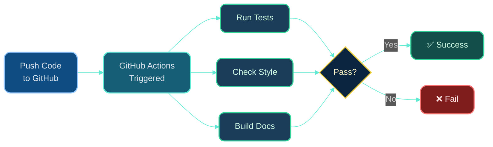

# Dr. Mindaugas Šarpis

# Lessons on **Data Analysis** from **CERN**

## Reproducible Workflows & Automation

---
hideInToc: true
layout: quote
---

# Science requires **reproducibility**. Good computing practices transform ad-hoc analysis scripts into professional, automated workflows that others (and future you) can understand, verify, and extend.

---
hideInToc: true
---

# Motivation

<div class="card card-warning pad-tight mt-md">

## **The Reproducibility Crisis**

Many scientific results cannot be reproduced because:
- Code is lost or poorly documented
- Dependencies are unclear
- Analysis steps are manual and forgotten
- Data processing is not tracked

**Goal**: Make your analysis reproducible in 5 years (or 5 hours!)

</div>

<div class="grid-2 mt-md gap-md">

<div class="card card-primary pad-tight">

### 🎯 **Today's Goals**

- Structure projects professionally
- Automate repetitive tasks
- Manage dependencies properly
- Document workflows clearly
- Version control everything

</div>

<div class="card card-secondary pad-tight">

### 🔬 **Real Benefits**

- Faster iteration on analysis
- Easy collaboration
- Reliable results
- Publication-ready code
- Career-ready skills

</div>

</div>

---
layout: section
hideInToc: true
---

# From **Scripts** to **Workflows**

---
hideInToc: true
---

# The Evolution of Your Analysis


<div class="grid-5 mt-md gap-tight">

<div class="card card-primary pad-tight">

### **Stage 1**
Interactive exploration

Manual execution

</div>

<div class="card card-secondary pad-tight">

### **Stage 2**
Saved as script

Still manual

</div>

<div class="card card-info pad-tight">

### **Stage 3**
Functions & modules

Reusable code

</div>

<div class="card card-success pad-tight">

### **Stage 4**
Command-line tools

Config files

</div>

<div class="card card-accent pad-tight">

### **Stage 5**
CI/CD testing

Containerized

</div>

</div>

<div class="card card-warning pad-tight mt-md">

**You are here** (after L1-L11): somewhere between stages 1-2. Let's reach stage 4!

</div>

---
hideInToc: true
---

# Anatomy of a Well-Structured Project

```
my_analysis/
├── README.md                 # Project overview, setup instructions
├── requirements.txt          # Python dependencies
├── environment.yml           # Conda environment (alternative)
├── config/
│   └── analysis_config.yaml  # Configuration parameters
├── data/
│   ├── raw/                  # Original, immutable data
│   ├── processed/            # Cleaned, transformed data
│   └── README.md             # Data sources and descriptions
├── src/                      # Source code (your modules)
│   ├── __init__.py
│   ├── data_loader.py        # Data loading functions
│   ├── preprocessing.py      # Cleaning, filtering
│   ├── fitting.py            # Model fitting routines
│   └── plotting.py           # Visualization functions
├── scripts/                  # Executable scripts
│   ├── 1_preprocess.py       # Step 1: Clean data
│   ├── 2_fit_model.py        # Step 2: Fit models
│   └── 3_make_plots.py       # Step 3: Generate figures
├── notebooks/                # Jupyter notebooks (exploration)
│   └── exploratory_analysis.ipynb
├── tests/                    # Unit tests
│   └── test_fitting.py
├── results/                  # Generated outputs
│   ├── figures/
│   └── fitted_parameters.csv
└── .gitignore                # Files to exclude from git
```

---
hideInToc: true
---

# Key Principles

<div class="grid-2 mt-md gap-md">

<div class="card card-primary pad-tight">

## **1. Separation of Concerns**

- **Data**: Raw vs processed (never modify raw!)
- **Code**: Reusable functions vs scripts
- **Config**: Parameters separate from code
- **Results**: Reproducible outputs

</div>

<div class="card card-secondary pad-tight">

## **2. Clear Dependencies**

- Document required packages
- Specify versions
- Use virtual environments
- Pin critical dependencies

</div>

<div class="card card-info pad-tight">

## **3. Self-Documentation**

- README explains what & how
- Code comments explain why
- Docstrings for functions
- Config files are readable

</div>

<div class="card card-accent pad-tight">

## **4. Automation**

- Scripts run without intervention
- Results are reproducible
- Tests validate correctness
- CI/CD catches errors early

</div>

</div>

---
layout: section
hideInToc: true
---

# Command-Line **Arguments**

---
hideInToc: true
---

# Why Command-Line Arguments?

<div class="card card-warning pad-tight mt-md">

## **Problem: Hardcoded Values**

```python
# Bad: hardcoded file paths and parameters
df = pd.read_csv('data.csv')
model_fit(df, n_bins=50, range_min=0, range_max=15)
```

**Issues**: Can't easily change parameters, not reusable, manual editing required

</div>

<div class="card card-success pad-tight mt-md">

## **Solution: Command-Line Arguments**

```bash
python fit_model.py --input data.csv --bins 50 --range 0 15
python fit_model.py --input new_data.csv --bins 100 --range 5 20
```

**Benefits**: Flexible, scriptable, no code changes needed

</div>

---
hideInToc: true
---

# argparse: Python's Standard Tool

```python
import argparse

# Create parser
parser = argparse.ArgumentParser(
    description='Fit a model to particle physics data'
)

# Add arguments
parser.add_argument('--input', type=str, required=True,
                    help='Path to input CSV file')
parser.add_argument('--output', type=str, default='results.csv',
                    help='Path to output file')
parser.add_argument('--bins', type=int, default=50,
                    help='Number of histogram bins')
parser.add_argument('--range', type=float, nargs=2, default=[0, 15],
                    help='Histogram range (min max)')
parser.add_argument('--verbose', action='store_true',
                    help='Print detailed output')

# Parse arguments
args = parser.parse_args()

# Use arguments
print(f"Loading data from {args.input}")
df = pd.read_csv(args.input)

if args.verbose:
    print(f"Using {args.bins} bins, range {args.range}")

# ... rest of analysis ...
```

---
hideInToc: true
---

# Complete Example: Configurable Fitting Script

```python
#!/usr/bin/env python3
"""
fit_model.py - Fit Gaussian + exponential to data

Usage:
    python fit_model.py --input data.csv --output results.png
"""
import argparse
import numpy as np
import pandas as pd
import matplotlib.pyplot as plt
from scipy.optimize import curve_fit

def model(x, amp, mean, sigma, exp_norm, exp_scale):
    """Gaussian + exponential model"""
    gaussian = amp * np.exp(-0.5 * ((x - mean) / sigma)**2)
    exponential = exp_norm * np.exp(-x / exp_scale)
    return gaussian + exponential

def main():
    # Parse command-line arguments
    parser = argparse.ArgumentParser(description='Fit model to data')
    parser.add_argument('--input', required=True, help='Input CSV file')
    parser.add_argument('--output', default='fit_result.png', help='Output plot')
    parser.add_argument('--bins', type=int, default=50, help='Number of bins')
    parser.add_argument('--range', type=float, nargs=2, default=[0, 15])
    args = parser.parse_args()

    # Load data
    print(f"Loading {args.input}...")
    data = pd.read_csv(args.input)['x'].values

    # Create histogram
    hist, bin_edges = np.histogram(data, bins=args.bins, range=args.range)
    bin_centers = (bin_edges[:-1] + bin_edges[1:]) / 2

    # Fit
    print("Fitting model...")
    initial_guess = [100, 5.0, 1.0, 50, 2.0]
    popt, pcov = curve_fit(model, bin_centers, hist, p0=initial_guess)
    errors = np.sqrt(np.diag(pcov))

    # Report results
    print(f"Fitted mean: {popt[1]:.3f} ± {errors[1]:.3f}")
    print(f"Fitted sigma: {popt[2]:.3f} ± {errors[2]:.3f}")

    # Plot
    plt.hist(data, bins=args.bins, range=args.range, alpha=0.5, label='Data')
    x_smooth = np.linspace(*args.range, 500)
    plt.plot(x_smooth, model(x_smooth, *popt), 'r-', label='Fit')
    plt.xlabel('x')
    plt.ylabel('Counts')
    plt.legend()
    plt.savefig(args.output, dpi=150)
    print(f"Saved plot to {args.output}")

if __name__ == '__main__':
    main()
```

---
hideInToc: true
---

# Running Your Script

```bash
# Basic usage
python fit_model.py --input sample.csv

# Custom parameters
python fit_model.py --input sample.csv --output my_fit.png --bins 100

# Get help
python fit_model.py --help
```

**Output:**
```
usage: fit_model.py [-h] --input INPUT [--output OUTPUT] [--bins BINS]
                    [--range RANGE RANGE]

Fit model to data

optional arguments:
  -h, --help           show this help message and exit
  --input INPUT        Input CSV file
  --output OUTPUT      Output plot
  --bins BINS          Number of bins
  --range RANGE RANGE
```

<div class="card card-accent pad-tight mt-sm">

**Pro tip**: Add `#!/usr/bin/env python3` at the top and `chmod +x fit_model.py` to make it directly executable: `./fit_model.py --input data.csv`

</div>

---
layout: section
hideInToc: true
---

# Configuration **Files**

---
hideInToc: true
---

# Why Configuration Files?

<div class="card card-info pad-tight mt-md">

## **When Command-Line Args Get Unwieldy**

Dozens of parameters → use configuration files instead!

</div>

<div class="grid-2 mt-md gap-md">

<div class="card card-warning pad-tight">

### ❌ **Too Many Arguments**

```bash
python analyze.py \
  --input data.csv \
  --bins 50 \
  --range 0 15 \
  --signal-mean 5.0 \
  --signal-sigma 1.0 \
  --bg-scale 2.0 \
  --fit-method mle \
  --output results.png \
  --verbose \
  --save-params params.json
```

Unreadable, error-prone!

</div>

<div class="card card-success pad-tight">

### ✅ **Config File**

```bash
python analyze.py --config analysis_config.yaml
```

```yaml
# analysis_config.yaml
input: data.csv
output: results.png
bins: 50
range: [0, 15]
signal:
  mean: 5.0
  sigma: 1.0
background:
  scale: 2.0
fit_method: mle
verbose: true
```

</div>

</div>

---
hideInToc: true
---

# YAML Configuration Files

<div class="card card-primary pad-tight mt-md">

## **YAML: Human-Readable Configuration**

**YAML** = YAML Ain't Markup Language (recursive acronym!)

- Easy to read and write
- Supports hierarchical structure
- Comments allowed
- Common for config files

</div>

```yaml
# config.yaml - Analysis configuration

# Data settings
data:
  input_file: "data/raw/sample.csv"
  output_dir: "results/"

# Histogram settings
histogram:
  bins: 50
  range: [0, 15]

# Model parameters (initial guesses)
model:
  signal:
    mean: 5.0
    sigma: 1.0
  background:
    scale: 2.0

# Fitting options
fitting:
  method: "mle"          # or "least_squares"
  max_iterations: 1000
  tolerance: 1e-6

# Output
output:
  save_plot: true
  save_parameters: true
  verbose: true
```

---
hideInToc: true
---

# Loading Config in Python

```python
import yaml

# Load configuration
with open('config.yaml', 'r') as f:
    config = yaml.safe_load(f)

# Access nested values
input_file = config['data']['input_file']
n_bins = config['histogram']['bins']
hist_range = config['histogram']['range']
signal_mean = config['model']['signal']['mean']
verbose = config['output']['verbose']

print(f"Loading {input_file}")
print(f"Histogram: {n_bins} bins, range {hist_range}")

# Use in analysis
hist, bins = np.histogram(data, bins=n_bins, range=hist_range)

# Initial guess from config
initial_guess = [
    100,  # amplitude (not in config, estimated)
    config['model']['signal']['mean'],
    config['model']['signal']['sigma'],
    50,   # exponential norm (estimated)
    config['model']['background']['scale']
]
```

<div class="card card-accent pad-tight mt-sm">

**Best practice**: Validate config (check required fields, types, ranges) before using values

</div>

---
hideInToc: true
---

# Combining argparse + Config Files

```python
#!/usr/bin/env python3
import argparse
import yaml
import sys

def load_config(config_path):
    """Load and validate configuration file"""
    try:
        with open(config_path, 'r') as f:
            config = yaml.safe_load(f)
        # Validate required fields
        required = ['data', 'histogram', 'model']
        for field in required:
            if field not in config:
                raise ValueError(f"Missing required field: {field}")
        return config
    except Exception as e:
        print(f"Error loading config: {e}")
        sys.exit(1)

def main():
    parser = argparse.ArgumentParser(description='Data analysis pipeline')
    parser.add_argument('--config', required=True, help='Config YAML file')
    parser.add_argument('--input', help='Override input file')
    parser.add_argument('--output', help='Override output file')
    args = parser.parse_args()

    # Load config
    config = load_config(args.config)

    # Command-line args override config file
    input_file = args.input or config['data']['input_file']
    output_dir = args.output or config['data']['output_dir']

    print(f"Configuration loaded from {args.config}")
    print(f"Processing {input_file} -> {output_dir}")

    # ... rest of analysis using config ...

if __name__ == '__main__':
    main()
```

---
layout: section
hideInToc: true
---

# Virtual Environments & **Dependencies**

---
hideInToc: true
---

# The Dependency Problem

<div class="card card-warning pad-tight mt-md">

## **"It Works on My Machine!"**

Common scenario:
- You develop analysis on your laptop (NumPy 1.24, Matplotlib 3.7)
- Collaborator tries to run it (different versions installed)
- Code breaks with mysterious errors
- 6 months later, you can't reproduce your own results

**Root cause**: Unmanaged dependencies

</div>

<div class="card card-success pad-tight mt-md">

## **Solution: Virtual Environments**

Isolated Python environments with specific package versions

- Each project has its own environment
- Reproducible: document exact versions
- No conflicts between projects

</div>

---
hideInToc: true
---

# Creating Virtual Environments

<div class="grid-2 mt-md gap-md">

<div class="card card-primary pad-tight">

## **Option 1: venv (built-in)**

```bash
# Create environment
python -m venv myenv

# Activate (Linux/Mac)
source myenv/bin/activate

# Activate (Windows)
myenv\Scripts\activate

# Install packages
pip install numpy pandas matplotlib

# Deactivate
deactivate
```

**Pros**: Built into Python, simple

**Cons**: Only Python packages

</div>

<div class="card card-secondary pad-tight">

## **Option 2: conda**

```bash
# Create environment
conda create -n myenv python=3.11

# Activate
conda activate myenv

# Install packages
conda install numpy pandas matplotlib
# or: pip install ...

# Deactivate
conda deactivate
```

**Pros**: Handles non-Python deps (C libs, etc.), popular in science

**Cons**: Heavier, slower

</div>

</div>

---
hideInToc: true
---

# requirements.txt: Documenting Dependencies

<div class="card card-info pad-tight mt-md">

## **requirements.txt: The Package List**

Simple text file listing all required packages (and optionally versions)

</div>

```bash
# requirements.txt
numpy>=1.24.0,<2.0.0
pandas==2.0.3
matplotlib>=3.7.0
scipy>=1.11.0
pyyaml>=6.0
```

```bash
# Install all requirements
pip install -r requirements.txt

# Generate requirements.txt from current environment
pip freeze > requirements.txt
```

<div class="card card-warning pad-tight mt-md">

**Warning**: `pip freeze` includes *everything*, even transitive dependencies. Better to manually list only direct dependencies with flexible version constraints.

</div>

---
hideInToc: true
---

# environment.yml: Conda Alternative

For conda users, use `environment.yml`:

```yaml
# environment.yml
name: particle_analysis
channels:
  - conda-forge
  - defaults
dependencies:
  - python=3.11
  - numpy>=1.24
  - pandas>=2.0
  - matplotlib>=3.7
  - scipy>=1.11
  - pyyaml>=6.0
  - pip
  - pip:
      - some-pip-only-package==1.2.3
```

```bash
# Create environment from file
conda env create -f environment.yml

# Update existing environment
conda env update -f environment.yml

# Export current environment
conda env export > environment.yml
```

---
hideInToc: true
---

# Best Practices: Dependencies

<div class="grid-2 mt-md gap-md">

<div class="card card-success pad-tight">

## ✅ **Do**

- Use virtual environments for every project
- Document all dependencies
- Use version constraints (`>=1.24,<2.0`)
- Pin versions for critical packages
- Include Python version requirement
- Update dependencies regularly
- Test on fresh environment before sharing

</div>

<div class="card card-warning pad-tight">

## ❌ **Don't**

- Install packages globally
- Use `pip freeze` blindly
- Pin every single package to exact version (too rigid)
- Forget to document custom/local packages
- Mix conda and pip carelessly
- Commit virtual environment to git
- Assume "latest" will work

</div>

</div>

<div class="card card-accent pad-tight mt-md">

**Add to .gitignore:**
```
# Virtual environments
venv/
myenv/
.conda/
*.egg-info/
```

</div>

---
layout: section
hideInToc: true
---

# Automation with **Makefiles**

---
hideInToc: true
---

# Why Makefiles?

<div class="card card-primary pad-tight mt-md">

## **Automate Your Workflow**

Instead of running commands manually:
```bash
python scripts/1_preprocess.py
python scripts/2_fit_model.py
python scripts/3_make_plots.py
```

Run a single command:
```bash
make all
```

</div>

<div class="grid-2 mt-md gap-md">

<div class="card card-info pad-tight">

### **Benefits**

- One-command execution
- Tracks dependencies
- Only reruns what's needed
- Documents workflow
- Standard tool (works everywhere)

</div>

<div class="card card-secondary pad-tight">

### **Common Uses**

- Run analysis pipeline
- Run tests
- Generate figures
- Build documentation
- Clean up temporary files

</div>

</div>

---
hideInToc: true
---

# Basic Makefile Syntax

```makefile
# Makefile - Analysis pipeline automation

# Targets and dependencies
target: dependencies
	command

# Example: generate plot from data
results/plot.png: data/processed/clean_data.csv scripts/make_plot.py
	python scripts/make_plot.py --input data/processed/clean_data.csv --output results/plot.png

# Phony targets (not files)
.PHONY: all clean test

all: results/plot.png results/fit_params.csv

clean:
	rm -rf results/*
	rm -rf data/processed/*

test:
	pytest tests/
```

**Key points**:
- **Target**: What to build (e.g., `results/plot.png`)
- **Dependencies**: What target needs (e.g., `data.csv`, `script.py`)
- **Command**: How to build it (must be indented with **TAB**)
- **Phony**: Targets that don't produce files (like `clean`, `test`)

---
hideInToc: true
---

# Complete Analysis Makefile

```makefile
# Makefile for particle physics analysis

# Configuration
PYTHON := python
DATA_RAW := data/raw/sample.csv
DATA_PROCESSED := data/processed/clean_data.csv
RESULTS_DIR := results

# Phony targets
.PHONY: all clean test help

# Default target
all: $(RESULTS_DIR)/fit_plot.png $(RESULTS_DIR)/fit_params.csv

# Step 1: Preprocess data
$(DATA_PROCESSED): $(DATA_RAW) scripts/1_preprocess.py
	$(PYTHON) scripts/1_preprocess.py --input $(DATA_RAW) --output $(DATA_PROCESSED)

# Step 2: Fit model
$(RESULTS_DIR)/fit_params.csv: $(DATA_PROCESSED) scripts/2_fit_model.py config/fit_config.yaml
	$(PYTHON) scripts/2_fit_model.py --config config/fit_config.yaml --input $(DATA_PROCESSED) --output $(RESULTS_DIR)/fit_params.csv

# Step 3: Generate plots
$(RESULTS_DIR)/fit_plot.png: $(RESULTS_DIR)/fit_params.csv scripts/3_make_plots.py
	$(PYTHON) scripts/3_make_plots.py --params $(RESULTS_DIR)/fit_params.csv --output $(RESULTS_DIR)/fit_plot.png

# Clean up generated files
clean:
	rm -rf $(RESULTS_DIR)/*
	rm -rf data/processed/*

# Run tests
test:
	pytest tests/ -v

# Help message
help:
	@echo "Available targets:"
	@echo "  all     - Run complete analysis pipeline"
	@echo "  clean   - Remove generated files"
	@echo "  test    - Run unit tests"
	@echo "  help    - Show this message"
```

---
hideInToc: true
---

# Using the Makefile

```bash
# Run entire pipeline
make all

# Clean up and rerun
make clean
make all

# Run tests
make test

# See available commands
make help
```

**Smart rebuilding**:
```bash
# First run: builds everything
make all

# Edit only the plotting script
vim scripts/3_make_plots.py

# Second run: only regenerates plot (skips preprocessing and fitting!)
make all
```

<div class="card card-accent pad-tight mt-sm">

Make checks file timestamps. If dependencies are newer than target, it rebuilds. Otherwise, it skips!

</div>

---
layout: section
hideInToc: true
---

# Continuous Integration with **GitHub Actions**

---
hideInToc: true
---

# What is CI/CD?

<div class="card card-info pad-tight mt-md">

## **Continuous Integration / Continuous Deployment**

Automatically run tasks when you push code to GitHub:
- Run tests
- Check code style
- Build documentation
- Run analysis pipeline
- Generate reports

**Benefits**: Catch errors early, ensure reproducibility, automate tedious tasks

</div>



---
hideInToc: true
---

# GitHub Actions: Basic Workflow

Create `.github/workflows/test.yml`:

```yaml
name: Run Tests

on:
  push:
    branches: [ main ]
  pull_request:
    branches: [ main ]

jobs:
  test:
    runs-on: ubuntu-latest

    steps:
    - name: Checkout code
      uses: actions/checkout@v3

    - name: Set up Python
      uses: actions/setup-python@v4
      with:
        python-version: '3.11'

    - name: Install dependencies
      run: |
        python -m pip install --upgrade pip
        pip install -r requirements.txt

    - name: Run tests
      run: |
        pytest tests/ -v
```

Now every push/PR automatically runs your tests!

---
hideInToc: true
---

# Advanced: Run Analysis Pipeline on Push

```yaml
name: Analysis Pipeline

on:
  push:
    branches: [ main ]

jobs:
  analyze:
    runs-on: ubuntu-latest

    steps:
    - uses: actions/checkout@v3

    - name: Set up Python
      uses: actions/setup-python@v4
      with:
        python-version: '3.11'

    - name: Install dependencies
      run: pip install -r requirements.txt

    - name: Download data
      run: |
        mkdir -p data/raw
        wget http://example.com/data.csv -O data/raw/sample.csv

    - name: Run analysis
      run: make all

    - name: Upload results
      uses: actions/upload-artifact@v3
      with:
        name: analysis-results
        path: results/

    - name: Commit results to repo (optional)
      run: |
        git config --local user.email "action@github.com"
        git config --local user.name "GitHub Action"
        git add results/
        git commit -m "Update analysis results" || echo "No changes"
        git push
```

---
layout: section
hideInToc: true
---

# Best Practices **Summary**

---
hideInToc: true
---

# Reproducible Analysis Checklist

<div class="grid-2 mt-md gap-md">

<div class="card card-success pad-tight">

## ✅ **Essential**

- [ ] Use version control (Git)
- [ ] Document dependencies (requirements.txt)
- [ ] Use virtual environments
- [ ] Write README with setup instructions
- [ ] Separate raw and processed data
- [ ] Use config files for parameters
- [ ] Never commit generated files
- [ ] Add .gitignore
- [ ] Test on clean environment

</div>

<div class="card card-info pad-tight">

## 🚀 **Advanced**

- [ ] Modular code (functions/classes)
- [ ] Command-line arguments (argparse)
- [ ] Automated pipeline (Makefile)
- [ ] Unit tests (pytest)
- [ ] CI/CD (GitHub Actions)
- [ ] Docker container (optional)
- [ ] Logging instead of print()
- [ ] Code style checking (black, ruff)
- [ ] Documentation (Sphinx)

</div>

</div>

---
hideInToc: true
---

# Example README.md

````markdown
# Particle Physics Data Analysis

Analysis of Higgs → γγ events using CMS Open Data.

## Setup

```bash
# Clone repository
git clone https://github.com/username/higgs-analysis.git
cd higgs-analysis

# Create virtual environment
python -m venv venv
source venv/bin/activate  # Windows: venv\Scripts\activate

# Install dependencies
pip install -r requirements.txt
```

## Usage

```bash
# Run complete analysis
make all

# Or step by step:
python scripts/1_preprocess.py --input data/raw/sample.csv --output data/processed/clean.csv
python scripts/2_fit_model.py --config config/analysis.yaml
python scripts/3_make_plots.py --output results/

# Run tests
make test
```

## Project Structure

```
.
├── data/           # Data files (not in git)
├── scripts/        # Analysis scripts
├── src/            # Reusable modules
├── config/         # Configuration files
├── results/        # Generated outputs
└── tests/          # Unit tests
```

## Citation

If you use this code, please cite: [DOI/paper]

## License

MIT License - see LICENSE file
````

---
hideInToc: true
---

# Version Control: .gitignore

<div class="card card-warning pad-tight mt-md">

**Never commit**:
- Large data files (use Git LFS or external storage)
- Generated results (should be reproducible!)
- Virtual environments
- OS-specific files
- Credentials/secrets

</div>

```bash
# .gitignore for data analysis project

# Data (too large, or stored elsewhere)
data/raw/*.csv
data/raw/*.root
data/processed/

# Generated results
results/
*.png
*.pdf
figures/

# Virtual environments
venv/
env/
.conda/

# Python
__pycache__/
*.pyc
*.pyo
.pytest_cache/
*.egg-info/

# Jupyter
.ipynb_checkpoints/

# OS
.DS_Store
Thumbs.db

# Secrets
.env
credentials.json
*.key
```

---
layout: section
hideInToc: true
---

# Docker: **Containerization** (Optional/Advanced)

---
hideInToc: true
---

# Why Docker?

<div class="card card-info pad-tight mt-md">

## **Ultimate Reproducibility**

**Virtual environments** handle Python packages. **Docker containers** handle *everything*:
- Operating system
- System libraries
- Python + packages
- Your code

**Result**: "It works on my machine" → "It works everywhere"

</div>

<div class="grid-2 mt-md gap-md">

<div class="card card-primary pad-tight">

### **Use Cases**

- Share analysis with exact environment
- Run on HPC clusters
- Deploy to production
- Archive for long-term reproducibility

</div>

<div class="card card-secondary pad-tight">

### **When to Use**

- Complex dependencies (ROOT, GEANT4)
- Collaboration with diverse systems
- Production deployment
- Long-term preservation

</div>

</div>

---
hideInToc: true
---

# Basic Dockerfile

```dockerfile
# Dockerfile - Analysis environment

# Base image
FROM python:3.11-slim

# Set working directory
WORKDIR /app

# Copy requirements and install
COPY requirements.txt .
RUN pip install --no-cache-dir -r requirements.txt

# Copy project files
COPY . .

# Default command
CMD ["python", "scripts/run_analysis.py"]
```

```bash
# Build container
docker build -t my-analysis .

# Run analysis in container
docker run my-analysis

# Interactive session
docker run -it my-analysis /bin/bash

# Mount local data
docker run -v $(pwd)/data:/app/data my-analysis
```

<div class="card card-accent pad-tight mt-sm">

**Note**: Docker has a learning curve. Start with virtual environments, add Docker when needed.

</div>

---
layout: section
hideInToc: true
---

# Real-World **Example**

---
hideInToc: true
---

# Putting It All Together

<div class="card card-accent pad-tight mt-md">

## **Complete Workflow: From Chaos to Order**

Let's transform a messy analysis into a professional, reproducible workflow.

</div>

<div class="grid-2 mt-md gap-md">

<div class="card card-warning pad-tight">

### 😱 **Before**

```
analysis_final_FINAL_v3.ipynb
data.csv
data_backup.csv
fit_attempt1.py
fit_attempt2_working.py
plot_results_old.py
results_oct15.png
results_oct22_updated.png
untitled.py
```

- Unclear what to run
- Can't reproduce results
- No documentation
- Lost in chaos

</div>

<div class="card card-success pad-tight">

### ✨ **After**

```
my_analysis/
├── README.md
├── requirements.txt
├── Makefile
├── config/analysis.yaml
├── scripts/
│   ├── 1_preprocess.py
│   ├── 2_fit.py
│   └── 3_plot.py
├── src/fitting.py
├── tests/test_fitting.py
└── .github/workflows/test.yml
```

- Clear workflow (`make all`)
- Reproducible
- Tested
- Documented

</div>

</div>

---
hideInToc: true
---

# Workflow Execution

```bash
# First-time setup (once)
git clone https://github.com/username/analysis.git
cd analysis
python -m venv venv
source venv/bin/activate
pip install -r requirements.txt

# Run analysis (any time)
make all

# Output:
# Step 1/3: Preprocessing data...
# Step 2/3: Fitting model...
#   Fitted mean: 5.021 ± 0.015
#   Chi-squared/dof: 1.03
# Step 3/3: Generating plots...
# ✅ Analysis complete! Results in results/

# Run tests
make test

# Clean and rerun
make clean && make all

# Push results
git add results/fit_params.csv
git commit -m "Update fit results"
git push
```

<div class="card card-accent pad-tight mt-sm">

**One command** runs everything. **Anyone** can reproduce your results. **Future you** will be grateful!

</div>

---
hideInToc: true
---

# Benefits in Practice

<div class="grid-3 mt-md gap-md">

<div class="card card-primary pad-tight">

### **For You**

✅ Faster iteration

✅ Easier to modify

✅ Less debugging

✅ Confidence in results

✅ Easy to revisit old work

</div>

<div class="card card-secondary pad-tight">

### **For Collaborators**

✅ Easy onboarding

✅ Clear workflow

✅ Reproducible results

✅ Parallel work (no conflicts)

✅ Review-friendly code

</div>

<div class="card card-info pad-tight">

### **For Science**

✅ Reproducible research

✅ Transparent methods

✅ Easier peer review

✅ Reusable by others

✅ Career-ready skills

</div>

</div>

---
layout: section
hideInToc: true
---

# Summary

---
hideInToc: true
---

# What We Learned Today

<div class="grid-2 mt-md gap-md">

<div class="card card-primary pad-tight">

## **Core Concepts**

✅ Project structure best practices

✅ Command-line arguments (argparse)

✅ Configuration files (YAML)

✅ Virtual environments (venv, conda)

✅ Dependency management (requirements.txt)

✅ Automation with Makefiles

✅ CI/CD with GitHub Actions

</div>

<div class="card card-secondary pad-tight">

## **Skills Acquired**

✅ Transform scripts into workflows

✅ Make analysis reproducible

✅ Automate repetitive tasks

✅ Manage dependencies properly

✅ Use industry-standard tools

✅ Collaborate effectively

✅ Publish-ready code

</div>

</div>

<div class="card card-accent pad-tight mt-md">

## 🎯 **The Big Picture**

You've learned the complete data analysis stack: computing fundamentals → Python → statistics → fitting → real data → **reproducible workflows**. You're now equipped to do professional, publication-quality data analysis!

</div>

---
hideInToc: true
---

# Next Steps

<div class="grid-2 mt-md gap-md">

<div class="card card-info pad-tight">

## **Immediate Practice**

1. Take an existing analysis and restructure it
2. Add argparse to your scripts
3. Create a requirements.txt
4. Write a Makefile
5. Set up GitHub Actions
6. Share with a collaborator

</div>

<div class="card card-secondary pad-tight">

## **What's Next?**

**L13+: Machine Learning**
- Supervised learning
- Classification and regression
- Neural networks
- Model evaluation
- Feature engineering

**Final Project**
- Apply everything learned
- Reproducible, version-controlled analysis
- GitHub repo with documentation
- Presentation of results

</div>

</div>

---
hideInToc: true
---

# Resources

<div class="grid-2 mt-md gap-md">

<div class="card card-primary pad-tight">

## **Tools & Documentation**

- [argparse tutorial](https://docs.python.org/3/howto/argparse.html)
- [YAML specification](https://yaml.org/)
- [GNU Make manual](https://www.gnu.org/software/make/manual/)
- [GitHub Actions docs](https://docs.github.com/en/actions)
- [Docker getting started](https://docs.docker.com/get-started/)

</div>

<div class="card card-secondary pad-tight">

## **Books & Guides**

- *Reproducible Research with R and RStudio* (Gandrud) - concepts apply to Python
- *The Pragmatic Programmer* (Hunt & Thomas)
- [The Turing Way](https://the-turing-way.netlify.app/) - reproducible research handbook
- [Research Software Engineering with Python](https://merely-useful.tech/py-rse/)

</div>

</div>

<div class="card card-accent pad-tight mt-md">

## 💡 **Pro Tip**

Start small. Don't try to implement everything at once. Add one improvement per project: argparse this week, Makefile next week, tests the following. Incrementally build good habits.

</div>

---
hideInToc: true
layout: quote
---

# Reproducibility is not a burden—it's a superpower. The time you invest in proper workflows pays back tenfold in reliability, speed, and scientific impact.

---
hideInToc: true
layout: end
---

# Questions?

## Next: **Machine Learning** (L13+)
