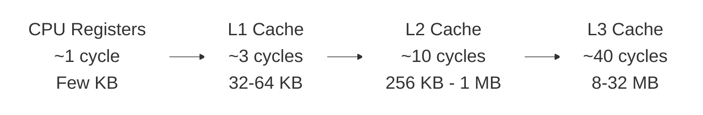
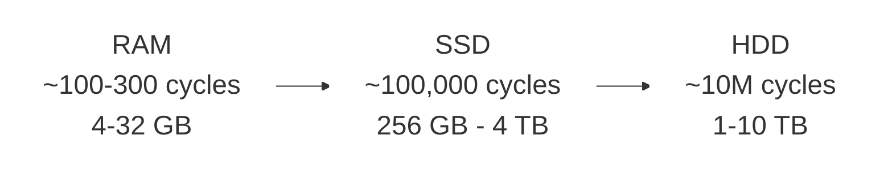

# Dr. Mindaugas Šarpis

# Lessons on **Data Analysis** from **CERN**

## Computing Infrastructure

---
hideInToc: true
layout: quote
---

# Every data analysis depends on the hardware beneath it. Understanding **CPUs**, **memory**, **storage**, and **accelerators** helps you write faster code, choose the right tools, and make the most of the machines you work with.

---
layout: fact
hideInToc: true
---

#  What constitutes **computing infrastructure**?

---
hideInToc: true
---

# Hardware Components

## 🖥️ **Core Processing**

- Central Processing Unit (**CPU**)
- Specialized Processors (**GPUs**, **TPUs**)

## 💾 **Memory & Storage**

- Memory (**RAM**)
- Storage Devices (**HDD, SSD, NVMe**)

## 🔌 **I/O & Connectivity**

- Input/Output (**I/O**) Devices
- Networking

## ⚡ **Infrastructure**

- Power and Cooling
- Monitoring and Management Tools

## 🔒 **Security**

- Physical and logical security
- Access control

---
hideInToc: true
---

# CPU (Central Processing Unit)

## 🧠 **What It Does**

Basic arithmetic, logic, control, and input/output operations

## 🔧 **CPU Sub-Components**

⚙️ **Control Unit (CU)** — directs operations

➕ **Arithmetic Logic Unit (ALU)** — math & logic

📋 **Registers** — fastest storage

💨 **Cache** — near-CPU memory

🔀 **Buses** — data pathways

---
hideInToc: true
---

# CPU Performance Factors

## ⏱️ **Clock Speed**

How many cycles per second the CPU can execute (measured in GHz)

## 🔢 **Number of Cores**

More cores enable parallel execution of independent tasks

## 💨 **Cache Size**

Larger caches reduce memory access latency for frequently used data

## 🔋 **Power Efficiency**

Performance per watt matters for sustained workloads and cooling

---
hideInToc: true
layout: image
image: /cpu1.avif
---

---
hideInToc: true
layout: image
image: /cpu2.jpg
---

---
hideInToc: true
layout: image
image: /cpu_apple_M4.webp
---

---
hideInToc: true
---

# RAM (Random Access Memory)

## 📝 **Characteristics**

- **Volatile memory** — data lost on power-off
- **High-Speed Access** — orders of magnitude faster than disk
- **Temporary Storage** — working space for active processes

## 📊 **Specifications**

- **Capacity** — measured in GB or TB
- **Performance** — measured in MHz or GHz
- Determines how much data can be processed simultaneously

---
hideInToc: true
layout: image
image: https://miro.medium.com/v2/resize:fit:1400/format:webp/0*6k9X6LPiM4XKyssm.jpg
---

---
hideInToc: true
layout: image
image: https://www.pcworld.com/wp-content/uploads/2023/04/corsair-dominator-memory-100884308-orig-1.jpg?quality=50&strip=all
---

---
hideInToc: true
layout: center
---

---
hideInToc: true
---

# Storage Devices

## 💿 **Mechanical**

- **HDD** (Hard Disk Drive) — spinning platters, high capacity, slower

## ⚡ **Solid State**

- **SSD** (Solid State Drive) — flash memory, faster, no moving parts
- **SSHD** (Solid State Hybrid Drive) — combines HDD + flash cache

## 🚀 **NVMe** (Non-Volatile Memory Express)

Direct PCIe connection — fastest consumer storage available

---
hideInToc: true
layout: center
---

---
hideInToc: true
layout: image
image: /hdd_schematic.png
backgroundSize: contain
---

---
hideInToc: true
layout: image
image: /hdd_magnetic_domains.png
backgroundSize: contain
---

---
hideInToc: true
layout: center
---

---
hideInToc: true
layout: center
---

---
hideInToc: true
layout: image
image: /ssd_floating_gate_3d.webp
backgroundSize: contain
---

---
hideInToc: true
layout: image
image: /ssd_floating_gate.png
backgroundSize: contain
---

---
hideInToc: true
layout: section
---

# Input/Output (I/O) **Devices**

---
hideInToc: true
---

# Specialized Processors

## 🎮 **GPU** (Graphics Processing Unit)

Massively parallel — thousands of small cores for throughput

## 🤖 **TPU** (Tensor Processing Unit)

Google-designed accelerator optimized for ML tensor operations

## 🔧 **FPGA** (Field-Programmable Gate Array)

Reconfigurable hardware — customizable logic for specific tasks

## 🏭 **ASIC** (Application-Specific Integrated Circuit)

Fixed-function chip — maximum efficiency for a single task

---
hideInToc: true
---

# GPU (Graphics Processing Unit)

## 🎯 **Primary Uses**

- Graphics Rendering
- Parallel Processing Power
- Video Processing and Encoding

## 🔬 **Scientific Applications**

- Accelerating Machine Learning and AI
- Scientific and Data Analysis Computing
- Simulation and modelling

---
hideInToc: true
layout: center
---

---
hideInToc: true
layout: image
image: https://cdn.mos.cms.futurecdn.net/xd2Hw9Cki3qhzbC2WxNBcA.jpg
---

---
hideInToc: true
layout: full
---

  <iframe
    src="https://www.youtube.com/embed/1vXFxEzozcE?si=E6BKmW_vWHg0F0Pi&rel=0"
    class="w-full h-full"
    style="border:0;"
    allow="fullscreen"
    allowfullscreen>
  </iframe>

---
hideInToc: true
---

# Infrastructure & Operations

## ⚡ **Power and Cooling**

Reliable power supply, UPS systems, and thermal management for sustained operation

## 🌐 **Networking**

Interconnects, bandwidth, latency — moving data between components and systems

## 📈 **Monitoring & Management**

System health, resource utilization, alerting, and capacity planning tools

---
hideInToc: true
---

# Security, Software & Cloud

## 🔒 **Security**

Access control, encryption, firewalls, intrusion detection — protecting data and infrastructure

## 💻 **Software**

Operating systems, drivers, middleware, and application software that runs on the hardware

## ☁️ **Virtualization & Cloud**

Abstract hardware into virtual machines and containers — scalable, on-demand resources

---
hideInToc: true
---

# Software Components

## 🖥️ **Operating Systems**

🪟 **Windows** — desktop, enterprise

🍎 **macOS** — Apple ecosystem

🐧 **Linux** — servers, HPC, science

## 🔗 **Middleware & Applications**

- **Middleware** and Virtualization — bridges OS and applications
- **Application** Software — the tools you actually use for analysis

---
hideInToc: true
---

# The Memory Hierarchy

---
hideInToc: true
---

# Memory Access Times

## ⏱️ **Latency Comparison**

| **Storage Type** | **Access Time** | **Relative Cost** |
|------------------|-----------------|-------------------|
| CPU Register     | 1 ns            | 1x                |
| L1 Cache         | 2-4 ns          | 2-4x              |
| L2 Cache         | 10-20 ns        | 10-20x            |
| RAM              | 100-300 ns      | 100-300x          |
| SSD              | 100 μs          | 100,000x          |
| HDD              | 10 ms           | 10,000,000x       |

---
hideInToc: true
---

# Why This Matters for Data Analysis

## 📍 **Locality Matters**

Keep related data close together in memory — sequential access patterns are dramatically faster than random access

## ⚡ **Vectorization**

Process arrays in chunks that fit in cache — SIMD instructions can operate on multiple data points simultaneously

## 📂 **File Formats**

Columnar formats (Parquet) are cache-friendly — read only the columns you need instead of entire rows

## 🧮 **Algorithm Choice**

Memory access patterns affect performance more than computation — an algorithm with better locality often beats a "faster" one

---
hideInToc: true
layout: full
---

  <iframe
    src="https://www.youtube.com/embed/h9Z4oGN89MU?si=238qvmSpbhkseW2I"
    class="w-full h-full"
    style="border:0;"
    allow="fullscreen"
    allowfullscreen>
  </iframe>

