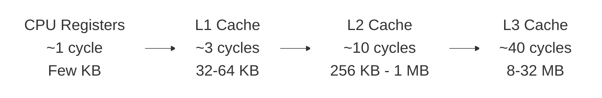
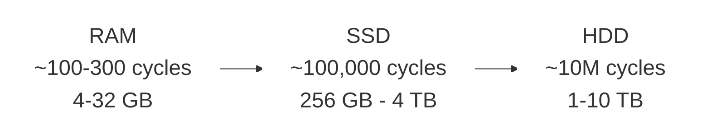

# Dr. Mindaugas Šarpis

# Lessons on **Data Analysis** from **CERN**

## Lecture 4:
  
## Computing Infrastructure

---
layout: fact
hideInToc: true
---

#  What constitutes **computing infrastructure**?
  
---
hideInToc: true
---

- # **Hardware Components**

  - ## Central Processing Unit (**CPU**)

  - ## Memory (**RAM**)

  - ## Storage Devices (**HDD, SSD, NVMe**)

  - ## Input/Output (**I/O**) Devices

  - ## Specialized Processors (**GPUs**, **TPUs**)

  - ## Power and Cooling

  - ## Networking

  - ## Monitoring and Management Tools

  - ## Security

---
hideInToc: true
---

- # **CPU** (Central Processing Unit)

  - ## Basic arithmetic, logic, control, and input/output operations

  - ## CPU sub-components

    - ### Control Unit (CU)

    - ### Arithmetic Logic Unit (ALU)

    - ### Registers

    - ### Cache

    - ### Buses

---
hideInToc: true
---

- # **CPU Performance** Factors:

  - ## Clock Speed

  - ## Number of Cores

  - ## Cache Size

  - ## Power Efficiency
    
---
hideInToc: true
layout: image
image: /cpu1.avif
---

---
hideInToc: true
layout: image
image: /cpu2.jpg
---

---
hideInToc: true
layout: image
image: /cpu_apple_M4.webp
---

---
hideInToc: true
---

- # **RAM** (Random Access Memory)

  - ## Volatile memory

  - ## High-Speed Access

  - ## Temporary Storage

  - ## Capacity (GB or TB)

  - ## Performance (MHz or GHz)

---
hideInToc: true
layout: image
image: https://miro.medium.com/v2/resize:fit:1400/format:webp/0*6k9X6LPiM4XKyssm.jpg
---

---
hideInToc: true
layout: image
image: https://www.pcworld.com/wp-content/uploads/2023/04/corsair-dominator-memory-100884308-orig-1.jpg?quality=50&strip=all
---

---
hideInToc: true
layout: center
---

---
hideInToc: true
---

- # **Storage** Devices:

  - ## **HDD** (Hard Disk Drive)

  - ## **SSD** (Solid State Drive)

  - ## **SSHD** (Solid State Hybrid Drive)

  - ## **NVMe** (Non-Volatile Memory Express)

---
hideInToc: true
layout: center
---

---
hideInToc: true
layout: image
image: /hdd_schematic.png
backgroundSize: contain
---

---
hideInToc: true
layout: image
image: /hdd_magnetic_domains.png
backgroundSize: contain
---

---
hideInToc: true
layout: center
---

---
hideInToc: true
layout: center
---

---
hideInToc: true
layout: image
image: /ssd_floating_gate_3d.webp
backgroundSize: contain
---

---
hideInToc: true
layout: image
image: /ssd_floating_gate.png
backgroundSize: contain
---

---
hideInToc: true
layout: section
---

# Input/Output (**I/O**) Devices

---
hideInToc: true
---

- # Specialized **Processors**:

  - ## **GPU** (Graphics Processing Unit)

  - ## **TPU** (Tensor Processing Unit)

  - ## **FPGA** (Field-Programmable Gate Array)

  - ## **ASIC** (Application-Specific Integrated Circuit)

---
hideInToc: true
---

- # **GPU** (Graphics Processing Unit)

  - ## Graphics Rendering

  - ## Parallel Processing Power

  - ## Accelerating Machine Learning and AI

  - ## Scientific and Data Analysis Computing

  - ## Video Processing and Encoding

---
hideInToc: true
layout: center
---

---
hideInToc: true
layout: image
image: https://cdn.mos.cms.futurecdn.net/xd2Hw9Cki3qhzbC2WxNBcA.jpg
---

---
hideInToc: true
layout: full
---

  <iframe
    src="https://www.youtube.com/embed/1vXFxEzozcE?si=E6BKmW_vWHg0F0Pi&rel=0"
    class="w-full h-full"
    style="border:0;"
    allow="fullscreen"
    allowfullscreen>
  </iframe>

---
hideInToc: true
---

- # Power and Cooling

- # Networking

- # Monitoring and Management Tools

---
hideInToc: true
---

- # Security

- # Software

- # Virtualization and Cloud Computing

---
hideInToc: true
---

- # **Software** Components

  - ## Operating Systems (**OS**)

    - ### Windows

    - ### macOS

    - ### Linux

  - ## **Middleware** and Virtualization

  - ## **Application** Software

---
layout: section
hideInToc: true
---

# Memory Hierarchy
    A[CPU Registers ~1 cycle Few KB] 
    B[L1 Cache ~3 cycles 32-64 KB]
    C[L2 Cache ~10 cycles 256 KB - 1 MB]
    D[L3 Cache ~40 cycles 8-32 MB]
    E[RAM ~100-300 cycles 4-32 GB]
    F[SSD ~100,000 cycles 256 GB - 4 TB]
    G[HDD ~10,000,000 cycles 1-10 TB]

---
hideInToc: true
---

# The Memory Pyramid

---
hideInToc: true
---

# Memory Access Times

| **Storage Type** | **Access Time** | **Relative Cost** |
|------------------|-----------------|-------------------|
| CPU Register     | 1 ns            | 1x                |
| L1 Cache         | 2-4 ns          | 2-4x              |
| L2 Cache         | 10-20 ns        | 10-20x            |
| RAM              | 100-300 ns      | 100-300x          |
| SSD              | 100 μs          | 100,000x          |
| HDD              | 10 ms           | 10,000,000x       |

---
hideInToc: true
---

# Why This Matters for Data Analysis

- ## **Locality matters**: Keep related data close together

- ## **Vectorization**: Process arrays in chunks that fit in cache

- ## **File formats**: Columnar formats (Parquet) are cache-friendly

- ## **Algorithm choice**: Memory access patterns affect performance more than computation

---
hideInToc: true
layout: full
---

  <iframe
    src="https://www.youtube.com/embed/h9Z4oGN89MU?si=238qvmSpbhkseW2I"
    class="w-full h-full"
    style="border:0;"
    allow="fullscreen"
    allowfullscreen>
  </iframe>

