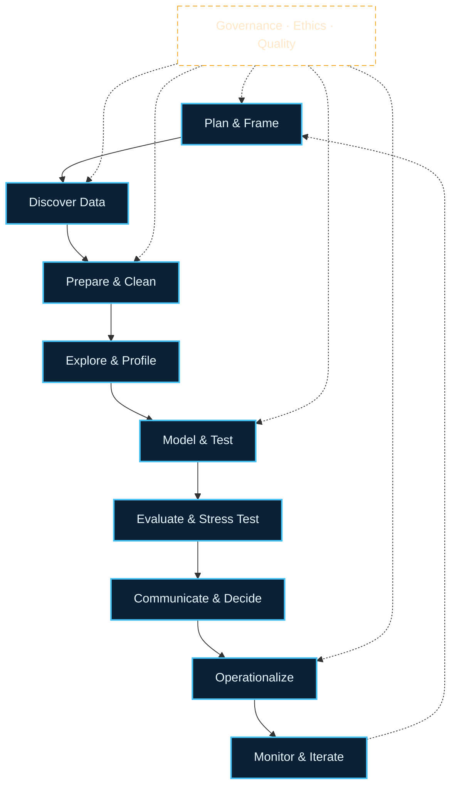

# Dr. Mindaugas Šarpis

# Data Analysis and Artificial Intelligence

## Concepts of Data Analysis

---
hideInToc: true
layout: fact
---

# What is **Data Analysis**?

---
hideInToc: true
layout: quote
---

## **Data analysis** is a process of inspecting, cleaning, transforming, and modeling **data** with the goal of discovering useful **information**, informing conclusions, and supporting decision-making

# Wikipedia

---
hideInToc: true
layout: fact
---

# What is **Data Science**?

---
hideInToc: true
layout: quote
---

## **Data science** is an interdisciplinary academic field that uses statistics, scientific computing, scientific methods, processing, scientific visualization, algorithms and systems to extract or extrapolate **knowledge and insights** from potentially noisy, structured, or unstructured data

# Wikipedia

---
hideInToc: true
layout: fact
---

# What is Data?

---
hideInToc: true
layout: quote
---

## **Data** are a collection of discrete or continuous values that convey information, describing the quantity, quality, fact, statistics, other basic **units of meaning**, or simply sequences of symbols that may be further interpreted formally. **A datum** is an individual value in a collection of data.

# Wikipedia

---
hideInToc: true
---

# Why Learn This Now?

## 🧭 **Framework Before Tools**

You have learned Python. Before diving into libraries and datasets, you need a conceptual framework for *thinking* about data — what it is, how to handle it, and what can go wrong.

## 🔬 **From CERN to Industry**

These concepts — lifecycle, quality, ethics, FAIR principles — apply identically whether you are analysing collision data at CERN or customer behaviour at a startup.

## 🎯 **This Lecture**

We will build the mental model: data types, quality, the analysis lifecycle, and key pitfalls to avoid.

---
hideInToc: true
---

# Data → Information → Knowledge

## 📋 **Data**
Capture observations (numbers, text, images, signals)

## 💡 **Information**
Emerges when data gain context, structure, and purpose

## 🧠 **Knowledge**
Blends information with experience and domain expertise

## 🎯 **Wisdom**
The responsibility to act on knowledge with judgement

---
hideInToc: true
---

# Example

## 📋 **Raw Data**

###  `2025-10-24, 22.3°C`

## 💡 **Information**

### `Lab A was 22.3°C at 10:24 on Oct 24, 2025.`

## 🧠 **Knowledge**

### `Lab A runs 1.5°C hotter on Fridays due to load.`

## 🎯 **Wisdom**

### `Shift calibration earlier on Fridays to reduce drift.`

---
hideInToc: true
---

# How disciplines overlap

## 📊 **Statistics**

Underpins inference, uncertainty, and experimental design

## 🔧 **Data Engineering**

Ensures data are collected, stored, and discoverable

## 🔍 **Data Analysis**

Explores, explains, and communicates what the data say

## 🧪 **Data Science**

Fuses engineering, analysis, and machine learning

## 🎯 **Decision Science**

Closes the loop with impact tracking and action

---
hideInToc: true
---

# Why data analysis matters now

## 📈 **Exploding volume, velocity, and variety** of data in every industry

## 🏆 **Competitive edge** comes from **evidence-based** decisions

## 📜 Regulations demand **traceability**, **privacy**, and **explainability**

## 🗣️ Teams need a **shared language** across disciplines

## 📖 Audiences expect stories backed by **data narratives**

### ⚛️ **CERN angle** — High-throughput pipelines, reproducible workflows, and rigorous uncertainty quantification are non-negotiable.

---
hideInToc: true
---

# Four flavours of analytics

| **Flavour** | **Question** | **Example** |
|:------------|:-------------|:------------|
| **Descriptive** | What happened? | Event rate rose 12% last run |
| **Diagnostic** | Why did it happen? | Rate rose due to trigger threshold change |
| **Predictive** | What is likely next? | Projected 8% rate increase next fill |
| **Prescriptive** | What should we do? | Raise threshold by 0.3 to maintain buffer |

---
hideInToc: true
---

# Each layer builds on the previous one

## 📋 **Descriptive** — establishes baseline facts

## 🔍 **Diagnostic** — uncovers root causes

## 🔮 **Predictive** — forecasts future states

## 🎯 **Prescriptive** — recommends optimal actions

---
hideInToc: true
---

# Key Ideas

## 🧪 **Universal Scope**
Any experiment (study or analysis) in any field of science will have a data analysis component

## 📄 **Publications**
Normally, the **results of data analysis** appear in scientific **publications**

## 💼 **Business Impact**
In business data analysis is imperative for **decision making**

## 🔄 **Multi-step & Multi-disciplinary**
Data analysis is a **multi-step** process spanning **multiple disciplines**

## 🔁 **Iterative**
Expect to **iterate** — insight rarely appears in a single pass

## 🤝 **Trust**
Trust is earned through **transparency**, **reproducibility**, and **storytelling**

---
hideInToc: true
---

# Thought Exercise — Your Data World

## 🤔 **Think** (1 min)

Pick a project, hobby, or job you know well. What data gets generated there? Who uses it, and for what decisions?

## 💬 **Discuss** (3 min)

Share with a neighbour: What is one decision that could be improved if the data were better collected, stored, or analysed?

## 🎯 **Goal**

Connect the abstract lifecycle ideas to your own experience before we see the full framework.

---
hideInToc: true
---

# End-to-end Lifecycle (1/2)

Here is the detailed nine-stage view of the analysis lifecycle. A simplified six-phase version appears later in this lecture.

### 🎯 **Problem Framing**
Hypotheses & success metrics

### 🔍 **Data Discovery**
Access & quality assessment

### 🧹 **Preparation**
Cleaning, joining, feature selection

### 📊 **Exploration**
Profiling, visualization, sanity checks

### 🧪 **Modeling/Inference**
Statistical tests & machine learning

---
hideInToc: true
---

# End-to-end Lifecycle (2/2)

### ✅ **Evaluation**
Validation, uncertainty, sensitivity

### 📢 **Communication**
Narrative, visuals, decisions

### ⚙️ **Operationalization**
Notebooks, scripts, pipelines

### 📡 **Monitoring**
Drift, quality, impact

---
hideInToc: true
class: text-center
---

# Lifecycle blueprint

<Transform :scale="0.8">

</Transform>

---
hideInToc: true
---

# Spotting opportunities

## 🗺️ Map stakeholders → decisions → supporting data

## 📏 Ask how outcomes are measured today

## 🔎 Identify gaps between available data and needed insight

## ✅ Check feasibility: access, quality, ethics, skills, time

---
hideInToc: true
---

# Data quality checklist

## ✅ **Completeness**

Missingness patterns and mechanisms

## 🔗 **Consistency**

Units, schemas, timezones

## 📐 **Validity**

Ranges, constraints, outliers (legit vs error)

## ⏱️ **Timeliness**

Latency, freshness

## 🔄 **Lineage**

Provenance, versioning, reproducibility

## ⚖️ **Ethics**

Consent, privacy, bias, fairness

---
hideInToc: true
---

# Uncertainty and inference

## 📊 Always report uncertainty: CIs, credible intervals, SEs

## ⚠️ Beware p-hacking (selectively analyzing data to get significant results); pre-register (publicly declare your analysis plan before seeing results) when possible

## 🔢 Power matters: effect size, N, variance

## 🔗 Distinguish correlation from causation

## 🧪 Sensitivity analyses: robustness to assumptions

---
hideInToc: true
---

# Visualization principles

## 🎨 Choose encodings that match the variable type

## 📏 Show context: baselines, denominators, time windows

## ⚠️ Avoid deceit: truncated axes, cherry-picked ranges

## 📊 Use small multiples for comparisons

## 📖 Tell the story: title as takeaway, caption as why

📌 Visualization principles are covered in the next lecture (**Data Visualization**). Practical tools (matplotlib, Pandas) come later in the course.

---
hideInToc: true
---

# Reproducibility practices

## 📓 Keep code with results (notebook discipline)

## 📦 Parameterize and record environment (env.yaml)

## 🗂️ Version data/queries or capture snapshots

## 🎲 Seed randomness; log configs and hashes

## ⚙️ Automate critical paths (Makefile/CI)

---
hideInToc: true
---

# Roles and collaboration

## 🧑‍🔬 **Domain expert**

Frames problems, validates insights

## 📊 **Analyst/Scientist**

Explores, models, communicates

## 🔧 **Engineer**

Data access, reliability, pipelines

## 📋 **PM/Lead**

Scope, impact, trade-offs

## 🤝 **Shared artifacts**

Glossary, metrics, dashboards

---
hideInToc: true
---

# Mini case study

## 📡 **Scenario**
Detector shows intermittent spike counts on night shifts.

## 📋 **Plan**

- Define metric (spike rate/hour), segment by shift.
- Pull two weeks of logs; check missingness.
- Visualize rates; annotate configuration changes.
- Test difference-in-means with bootstrap CI (resampling-based confidence intervals).
- Prescribe mitigation if effect is robust.

---
hideInToc: true
---

# Common pitfalls

## ⚠️ Overfitting pretty charts to noisy data

## ⚠️ Confusing proxy metrics with outcomes

## ⚠️ Ignoring units/timezones and data joins

## ⚠️ Confirmation bias; not seeking disconfirming evidence

## ⚠️ Shipping insights without reproducibility

---
hideInToc: true
---

# Useful patterns

## ✅ Start with a checklist (quality, ethics, uncertainty)

## ✅ Write the "results" slide first; work backward

## ✅ Keep a decisions log with assumptions

## ✅ Pair-review visuals and statistical claims

## ✅ Maintain a lightweight data dictionary

---
hideInToc: true
---

# Takeaways

## 🎯 Define decisions and metrics early

## 📊 Treat data quality and uncertainty as first-class

## 📢 Communicate with clarity and integrity

## 🔄 Make it reproducible; make it useful

## 📚 **Deep-dive topics** — data fundamentals, FAIR principles, tools & collaboration, data hygiene, and field-by-field examples are covered in a dedicated extended session

