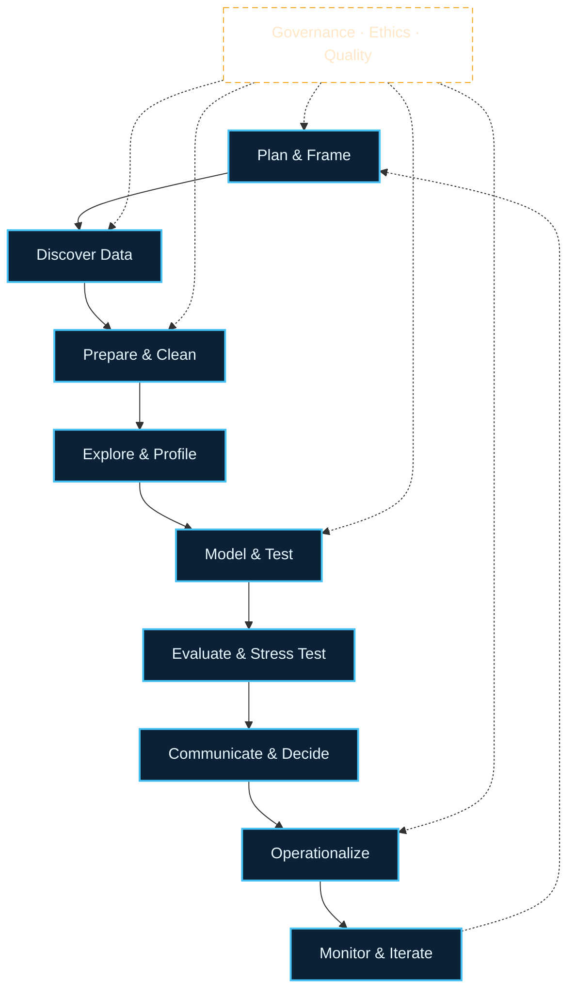
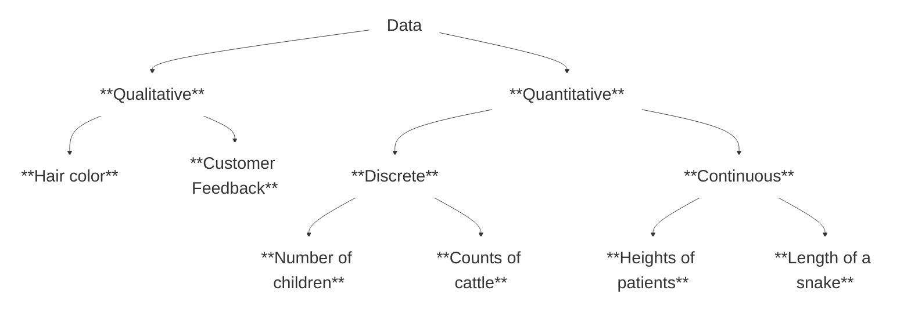

---
marp: true
mermaid: true
background: /background_intro.jpg

class: text-left
colorSchema: dark

theme: ./theme
drawings:
  persist: false

transition: fade

title: "Concepts of Data Analysis"
layout: cover
---

# Dr. Mindaugas Šarpis
# Lessons on **Data Analysis** from **CERN**

## Concepts of Data Analysis

---
hideInToc: true
layout: fact
---

# What is **Data Analysis**? 

---
hideInToc: true
layout: quote
---

## **Data analysis** is a process of inspecting, cleaning, transforming, and modeling **data** with the goal of discovering useful **information**, informing conclusions, and supporting decision-making

 

# Wikipedia

---
hideInToc: true
layout: fact
---

# What is **Data Science**?

---
hideInToc: true
layout: quote
---

## **Data science** is an interdisciplinary academic field that uses statistics, scientific computing, scientific methods, processing, scientific visualization, algorithms and systems to extract or extrapolate **knowledge and insights** from potentially noisy, structured, or unstructured data

 

# Wikipedia

---
hideInToc: true
layout: fact
---

# What is Data? 

---
hideInToc: true
layout: quote
---

## **Data** are a collection of discrete or continuous values that convey information, describing the quantity, quality, fact, statistics, other basic **units of meaning**, or simply sequences of symbols that may be further interpreted formally. **A datum** is an individual value in a collection of data.

 

# Wikipedia

---
hideInToc: true
---

# Data → Information → Knowledge

- ## **Data** capture observations (numbers, text, images, signals)

- ## **Information** emerges when data gain context, structure, and purpose

- ## **Knowledge** blends information with experience and domain expertise

- ## **Wisdom** is the responsibility to act on knowledge with judgement

---
hideInToc: true
---

# Example

- ## Raw Data: 

    ###  `2025-10-24, 22.3°C`

- ## Information:

    ### `Lab A was 22.3°C at 10:24 on Oct 24, 2025.`

- ## Knowledge:

    ### `Lab A runs 1.5°C hotter on Fridays due to load.`

- ## Wisdom:

  ### `Shift calibration earlier on Fridays to reduce drift.`

---
hideInToc: true
---

# How disciplines overlap

## **Statistics**

### underpins inference, uncertainty, and experimental design

 

## **Data Engineering**

### ensures data are collected, stored, and discoverable

 

## **Data Analysis**

### explores, explains, and communicates what the data say

## **Data Science**

### fuses engineering, analysis, and machine learning

 

## **Decision Science**

### closes the loop with impact tracking and action

---
hideInToc: true
---

# Why data analysis matters now

## Exploding **volume, velocity, and variety** of data in every industry

## Competitive edge comes from **evidence-based** decisions

- ## Regulations demand **traceability**, **privacy**, and **explainability**

- ## Teams need a **shared language** across disciplines

- ## Audiences expect stories backed by **data narratives**

&nbsp;

### CERN angle

- ## High-throughput pipelines, reproducible workflows, and rigorous uncertainty quantification are non-negotiable.

---
hideInToc: true
---

# Four flavours of analytics

| **Flavour** | **Question** | **Example** |
|:------------|:-------------|:------------|
| **Descriptive** | What happened? | Event rate rose 12% last run |
| **Diagnostic** | Why did it happen? | Rate rose due to trigger threshold change |
| **Predictive** | What is likely next? | Projected 8% rate increase next fill |
| **Prescriptive** | What should we do? | Raise threshold by 0.3 to maintain buffer |

---
hideInToc: true
---

# Each layer builds on the previous one

- ## **Descriptive** establishes baseline facts
- ## **Diagnostic** uncovers root causes
- ## **Predictive** forecasts future states
- ## **Prescriptive** recommends optimal actions

---
hideInToc: true
---

- # **Key Ideas** 

  - ## Any experiment (study or analysis) in any field of science will have a data analysis component

  - ## Normally, the **results of data analysis** appear in scientific **publications**

  - ## In business data analysis is imperative for **decision making**

  - ## Data analysis is a **multi-step** process

  - ## Data analysis is a **multi-disciplinary** field

  - ## Expect to **iterate — insight rarely appears in a single pass

  - ## Trust is earned through **transparency**, **reproducibility**, and **storytelling**

---
hideInToc: true
---

# End-to-end Lifecycle

## **Problem Framing**
- Hypotheses
- Success Metrics

## **Data Discovery**
- Access
- Quality Assessment

## **Preparation**
- Cleaning
- Joining
- Feature/Variable Selection

## **Exploration**
- Profiling
- Visualization
- Sanity Checks

## **Modeling/Inference**
- Statistical Tests
- Machine Learning

## **Evaluation**
- Validation
- Uncertainty
- Sensitivity

## **Communication**
- Narrative
- Visuals
- Decisions

## **Operationalization**
- Notebooks
- Scripts
- Pipelines

## **Monitoring**
- Drift
- Quality
- Impact

---
hideInToc: true
class: text-center
---

# Lifecycle blueprint

<Transform :scale="0.8">

</Transform>

---
hideInToc: true
---

# Spotting opportunities

- ## Map stakeholders → decisions → supporting data

- ## Ask how outcomes are measured today

- ## Identify gaps between available data and needed insight

- ## Check feasibility: access, quality, ethics, skills, time

---
hideInToc: true
---

# Data quality checklist

## **Completeness**
### Missingness patterns and mechanisms

 

## **Consistency**
### Units, schemas, timezones

 

## **Validity**
### Ranges, constraints, outliers (legit vs error)

## **Timeliness**
### Latency, freshness

 

## **Lineage**
### Provenance, versioning, reproducibility

 

## **Ethics**
### Consent, privacy, bias, fairness

---
hideInToc: true
---

# Uncertainty and inference

- ## Always report uncertainty: CIs, credible intervals, SEs
- ## Beware p-hacking; pre-register when possible
- ## Power matters: effect size, N, variance
- ## Distinguish correlation from causation
- ## Sensitivity analyses: robustness to assumptions

---
hideInToc: true
---

# Visualization principles

- ## Choose encodings that match the variable type
- ## Show context: baselines, denominators, time windows
- ## Avoid deceit: truncated axes, cherry-picked ranges
- ## Use small multiples for comparisons
- ## Tell the story: title as takeaway, caption as why

---
hideInToc: true
---

# Reproducibility practices

- ## Keep code with results (notebook discipline)
- ## Parameterize and record environment (env.yaml)
- ## Version data/queries or capture snapshots
- ## Seed randomness; log configs and hashes
- ## Automate critical paths (Makefile/CI)

---
hideInToc: true
---

# Roles and collaboration

- ## Domain expert: frames problems, validates insights
- ## Analyst/Scientist: explores, models, communicates
- ## Engineer: data access, reliability, pipelines
- ## PM/Lead: scope, impact, trade-offs
- ## Shared artifacts: glossary, metrics, dashboards

---
hideInToc: true
---

# Mini case study

## Scenario

- Detector shows intermittent spike counts on night shifts.

## Plan

- Define metric (spike rate/hour), segment by shift.
- Pull two weeks of logs; check missingness.
- Visualize rates; annotate configuration changes.
- Test difference-in-means with bootstrap CI (resampling-based confidence intervals).
- Prescribe mitigation if effect is robust.

---
hideInToc: true
---

# Common pitfalls

- ## Overfitting pretty charts to noisy data
- ## Confusing proxy metrics with outcomes
- ## Ignoring units/timezones and data joins
- ## Confirmation bias; not seeking disconfirming evidence
- ## Shipping insights without reproducibility

---
hideInToc: true
---

# Useful patterns

- ## Start with a checklist (quality, ethics, uncertainty)
- ## Write the “results” slide first; work backward
- ## Keep a decisions log with assumptions
- ## Pair-review visuals and statistical claims
- ## Maintain a lightweight data dictionary

---
hideInToc: true
---

# Takeaways

- ## Define decisions and metrics early
- ## Treat data quality and uncertainty as first-class
- ## Communicate with clarity and integrity
- ## Make it reproducible; make it useful

---
layout: section
hideInToc: true
---

# Examples of **data analysis** in different fields of science and industry 

---
hideInToc: true
---

# **Bio medicine and Genomics**

- ## Genome Sequencing → identifying variants & gene expression patterns

- ## Clinical Trials → monitoring safety, efficacy, adaptive designs

- ## Population health dashboards & personalised medicine

- ## Decisions: targeted therapies, drug discovery, diagnostics

&nbsp;

### **23andMe** or **Ancestry.com** (°Cestry services)?
### Comparing against *reference populations*

---
hideInToc: true
---

# **Environmental Sciences**

- ## Climate models integrating satellite, sensor, and historical data

- ## Pollution monitoring at city/block resolution

- ## Biodiversity studies combining field notes + remote sensing

- ## Supports policy making, disaster response, conservation funding

#### Living analysis → data feeds update models continuously

---
hideInToc: true
---

# **Social Sciences**

- ## Economic forecasting blending macro indicators & behavioural data

- ## Social behaviour studies using surveys, logs, ethnography

- ## Text analysis for sentiment, misinformation, community wellbeing

- ## Informs policy, marketing, product design, civic planning

#### Qualitative + quantitative insights reinforce each other

---
hideInToc: true
---

# **Astronomy** 

- ## Observational data analysis from telescopes, satellites, detectors

- ## Gravitational wave detection via signal processing & ML

- ## Cataloguing millions of celestial objects, anomaly detection

- ## Requires high-throughput computing, reproducible pipelines

#### Fun fact: many ML innovations came from sky surveys

---
hideInToc: true
---

# **Particle Physics (CERN)**

- ## Petabytes of collision data → reconstruct events, filter noise

- ## Multivariate analysis to isolate rare signals (e.g. Higgs boson)

- ## Collaboration across detectors, theory, computing teams

- ## Drives advances in distributed computing & open data practices

---
hideInToc: true
---

# **Engineering**

- ## Predictive maintenance on turbines, trains, manufacturing lines

- ## Quality control with computer vision & statistical process control

- ## Structural health monitoring via sensors + physics-informed models

- ## Outcomes: less downtime, safer infrastructure, cost optimisation

---
hideInToc: true
---

# **Healthcare Operations**

- ## Epidemiology tracking outbreaks & transmission dynamics

- ## Health policy simulation for capacity planning & funding

- ## Hospital operations: patient flow, staffing, supply chain analytics

- ## Ethical considerations: privacy, bias, explainability

---
hideInToc: true
---

# **Finance** 

- ## Stock market analysis + algorithmic trading with latency constraints

- ## Risk management using stress tests, scenario analysis, VaR

- ## Fraud detection & compliance monitoring with streaming data

- ## Balances profitability with regulation and transparency

---
hideInToc: true
---

# **Sports Analytics** 

- ## Performance analysis combining tracking sensors & video

- ## Strategy optimisation: playbooks, opponent scouting

- ## Fan engagement through personalised content & ticket pricing

- ## Data informs coaching, recruitment, business growth

---
hideInToc: true
---

# **Product & Business Analytics**

- ## Growth funnels: acquisition, activation, retention, revenue, referral

- ## Experimentation: A/B tests, feature flagging, causal inference

- ## Customer segmentation & lifetime value in subscription models

- ## Guides product roadmaps, marketing spend, customer success

---
hideInToc: true
---

# **Public Policy & Urban Planning**

- ## Smart city sensors to manage transport, energy, waste

- ## Open data portals enabling transparency & civic innovation

- ## Geospatial analysis for zoning, emergency response, sustainability

- ## Stakeholder engagement & ethical data sharing are crucial

---
hideInToc: true
---

# **Education & Learning Analytics**

- ## Learning management system logs reveal engagement patterns

- ## Early warning systems for student support

- ## Curriculum design using assessment data & qualitative feedback

- ## Balances personalisation with fairness and privacy

---
hideInToc: true
---

# Reflection — Which example resonates?

- ## Where could similar data exist in your context?

- ## What decisions would better data unlock?

- ## What obstacles — technical, ethical, organisational — stand in the way?

---
layout: section
hideInToc: true
---

# Data Fundamentals

---
hideInToc: true
---

# Data comes in many shapes

- ## Tabular: rows × columns (experiments, business metrics)

- ## Hierarchical: JSON/XML, nested logs, documents

- ## Graph: networks, relationships, supply chains

- ## Spatial & temporal: GIS layers, time series, event streams

- ## Multimedia: images, audio, video, sensor waveforms

---
hideInToc: true
---

# Structured vs unstructured

- ## **Structured**
  
  - ### predefined schema, SQL-friendly (lab results)

- ## **Semi-structured**

  - ### consistent markers, flexible fields (JSON, HL7)

- ## **Unstructured**
  
  - ### natural language, images, free-form signals

#### Choose storage, tooling, and cleaning strategies accordingly

---
hideInToc: true
---

# Levels of measurement

- ## **Nominal** — categories without order (blood type, product ID)

- ## **Ordinal** — ranked categories (survey Likert scales)

- ## **Interval** — consistent differences, no true zero (°C, calendar dates)

- ## **Ratio** — meaningful zero & ratios (mass, revenue, counts)

- ## Measurement level dictates valid summaries & visualisations

---
hideInToc: true
---

# Granularity & unit of analysis

- ## Define the entity: person, transaction, collision event, sensor ping

- ## Aggregation level affects signal vs noise

- ## Misaligned granularity introduces bias & misleading conclusions

- ## Document transformations between granularities

---
hideInToc: true
---

# Mind the time dimension

- ## Cross-sectional vs time series vs panel data

- ## Sampling frequency and latency influence what you can see

- ## Seasonality, trends, and lag effects require tailored methods

- ## Align timestamps, time zones, and calendars early

---
hideInToc: true
---

# Metadata keeps data alive

- ## Who collected it, when, where, how, and why?

- ## Variable definitions, units, encoding schemes

- ## Data lineage: transformations, assumptions, scripts, owners

- ## Without metadata the data become a liability, not an asset

---
hideInToc: true
---

# Data quality dimensions

- ## **Accuracy** · does it reflect reality?

- ## **Completeness** · are key fields missing?

- ## **Consistency** · same definition across sources?

- ## **Timeliness** · fresh enough to act on?

- ## **Validity** · conforms to rules and business logic?

- ## **Uniqueness** · no unintended duplicates?

---
hideInToc: true
---

# Common data issues & biases

- ## Missing data mechanisms (MCAR, MAR, MNAR)

- ## Outliers: true phenomena or collection errors?

- ## Sampling bias & survivorship bias

- ## Confirmation bias, p-hacking, and multiple testing

- ## Ethical blind spots: representation, consent, accessibility

---
hideInToc: true
---

# **Continuous** and **Discrete** Data

- ## Quantitative / Numerical Data
- ## Qualitative / Categorical Data
- ## Date and Time

---
hideInToc: true
---

# Exercise · Audit your data sources

- ## Pick one dataset you rely on

- ## Classify type, granularity, measurement levels, quality risks

- ## Note missing metadata you would need before analysis

---
layout: section
hideInToc: true
---

# Data Lifecycle & Workflow

---
hideInToc: true
---

# End-to-end lifecycle

- ## **Plan** · clarify problem, stakeholders, success criteria

- ## **Acquire** · collect, ingest, or access relevant data

- ## **Store** · organise, catalogue, secure

- ## **Process** · clean, transform, feature engineer

- ## **Analyse** · explore, model, evaluate

- ## **Share** · communicate, deploy, monitor, iterate

---
hideInToc: true
---

# Governance overlays every stage

- ## Security, privacy, compliance, and ethics checks

- ## Documentation and lineage updates

- ## Quality gates and automated tests

- ## Feedback loops from stakeholders and end users

---
hideInToc: true
---

# Analysis is iterative

- ## Expect to loop between question ↔ data ↔ analysis ↔ insight

- ## Dead ends reveal where data, methods, or framing must change

- ## Maintain versioned checkpoints to compare approaches

- ## Communicate progress, uncertainty, and trade-offs early

---
hideInToc: true
---

# From data to decisions

- ## Translate insights into recommendations & actions

- ## Align with organisational objectives and constraints

- ## Plan how outcomes will be measured post-decision

- ## Capture learnings to refine future analyses

---
layout: section
hideInToc: true
---

# **Steps of Data Analysis** 

---
hideInToc: true
---

- # 1. **Define the Problem or Research Question**

  - ## Formulate the question with stakeholders and context

    This might steer the choices in the following steps

  - ## Translate goals into measurable metrics & hypotheses

  - ## Map constraints: data access, time, ethics, skills

  - ## Plan the experimental or observational design

#### Interactive exercise · Draft a SMART question for your project

---
hideInToc: true
---

- # 2. **Collect Data** 

  - ## How much data do you need?

  - ## What sort of data do you need?

  - ## What data formats should you chose?

  - ## Can you trust the data?

  - ## Can you collect the data?

  - ## Document permissions, consent, and provenance

  - ## Automate validation checks at ingestion

---
hideInToc: true
---

- # 3. **Clean Data**

  - ## Data Selection

  - ## Data Stripping

  - ## Data Skimming

  - ## Data Wrangling

  - ## Handle missing values, outliers, inconsistent categories

  - ## Record transformations for reproducibility

---
hideInToc: true
---

- # 4. **Analyze Data**

  - ## Data Exploration

  - ## Statistical Analysis

  - ## Model Building

  - ## Machine Learning

  - ## Classification (...**AI**...)

  - ## Evaluate assumptions, uncertainty, and sensitivity

  - ## Compare baseline vs advanced methods

---
hideInToc: true
---

- # 5. **Visualize the data**

  - ## What's your target audience?

  - ## What is the message you want to convey?

  - ## Choose encodings that emphasise the core insight

  - ## Iterate quickly with sketches before polishing

---
hideInToc: true
---

- # 6. **Interpret and report the results**

  - ## Draw Conclusions from Data

  - ## Report Findings

  - ## Connect to decisions, risks, next steps

  - ## Capture limitations and open questions

  - ## Package reproducible assets (code, dashboards, docs)

---
hideInToc: true
---

# Validation & monitoring

- ## Split data wisely, guard against leakage

- ## Assess error bars, confidence intervals, effect sizes

- ## Stress test with scenario analysis & sensitivity checks

- ## Plan post-deployment monitoring for drift and quality

---
hideInToc: true
---

# Team checkpoints per phase

- ## Kickoff → align on question, scope, success metrics

- ## Midpoint → share exploratory findings, data quality flags

- ## Pre-delivery → rehearse narrative, anticipate objections

- ## Retrospective → document lessons, update playbooks

---
hideInToc: true
---

# Communication toolkit

- ## Executive summary (one-pager)

- ## Notebook or reproducible analysis package

- ## Dashboard / data app for continued monitoring

- ## Decision memo outlining options & trade-offs

- ## Technical appendix for peers to audit

---
layout: section
hideInToc: true
---

# Tools & Collaboration

---
hideInToc: true
---

# Modern analytics stack

- ## Data sources: sensors, APIs, files, databases, experiments

- ## Ingestion: ETL/ELT tools, streaming pipelines, notebooks

- ## Storage: data lakes, warehouses, object stores, feature stores

- ## Compute: notebooks, scripts, distributed clusters, cloud services

- ## Delivery: dashboards, apps, reports, APIs, alerts

---
hideInToc: true
---

# People & roles

- ## Domain experts anchor context and define value

- ## Data engineers ensure reliable, scalable pipelines

- ## Analysts & scientists explore, model, and interpret

- ## Visualisation designers craft compelling stories

- ## Product & ops teams translate insight into action

---
hideInToc: true
---

# Collaboration rituals

- ## Shared backlog with clear owners & due dates

- ## Version control (git) for notebooks, SQL, scripts

- ## Code & analysis reviews to raise quality and share knowledge

- ## Pair sessions for tricky modelling or cleaning tasks

- ## Reproducible environments (conda, containers, Poetry, Nix)

---
hideInToc: true
---

# Choosing the right artefact

- ## **Notebooks** for exploration, teaching, storytelling

- ## **Scripts & packages** for automation and reuse

- ## **Dashboards & apps** for ongoing monitoring

- ## **Experiments** for causal claims and product decisions

- ## Mix intentionally; document the purpose of each asset

---
hideInToc: true
---

# Languages of data

- ## SQL remains foundational for structured data

- ## Python ecosystem (pandas, Polars, PySpark, SciPy, scikit-learn)

- ## R for statistics, visualisation, reproducible reports

- ## Julia, Scala, Rust for performance-critical workloads

- ## Domain-specific tools (ROOT at CERN, SAS, MATLAB, SPSS)

---
hideInToc: true
---

# Tool snapshots

- ## Proprietary: Tableau, Origin, Excel
- ## Languages: Python, R, Julia
- ## Tip: mix surface-level ease with depth and reproducibility

---
hideInToc: true
---

# **Proprietary** Tools 

- ## Expensive
- ## Limited in scope
- ## Lack compatibility
- ## Lack flexibility
- ## Easy to learn / use (GUI)
- ## Great for rapid stakeholder demos & quick wins

---
hideInToc: true
---

# **Programming** Languages

- ## Open Source
- ## Free
- ## Powerful
- ## Steep learning curve (CLI)
- ## Scales from exploration to production

---
hideInToc: true
---

# DataOps & automation

- ## Schedule data pipelines with orchestration tools (°Ct)

- ## Leverage CI/CD for tests, linting, deployment

- ## Parameterise workflows for reproducibility

- ## Monitor pipelines for latency, failures, data drift

---
hideInToc: true
---

# Testing your analysis

- ## Unit tests for data transforms & calculations

- ## Data validation (great expectations, pydantic, pandera)

- ## Statistical tests to confirm assumptions

- ## Golden datasets & regression tests for dashboards

- ## Peer review before results leave the team

---
hideInToc: true
---

# Documentation & knowledge sharing

- ## Analyst runbooks and playbooks

- ## Data dictionaries & catalogs

- ## Decision logs capturing context and rationale

- ## Internal demos & show-and-tell sessions

- ## Mentoring to spread tooling fluency

---
hideInToc: true
---

# **Discussion**  

- ## When to use proprietary tools?

- ## What should you be using?  

- ## Saturation of achieved proficiency

- ## How do we ensure reproducibility when collaborating?

---
layout: section
hideInToc: true
---

# **Data Hygiene**

---
hideInToc: true
---

# Why data hygiene matters

- ## Prevent costly errors & embarrassing corrections

- ## Build trust with stakeholders & regulators

- ## Accelerate future analyses with reusable assets

- ## Protect sensitive data and maintain compliance

- ## Enable others to replicate or extend your work

---
hideInToc: true
---

# Hygiene habits to cultivate

- ## Source control for data definitions and transformations

- ## Automated linting & formatting for notebooks/scripts

- ## Clear folder structures & naming conventions

- ## Versioned datasets or snapshotting

- ## Regular housekeeping: archive, deprecate, document

---
hideInToc: true
---

# Ethics & responsible analytics

- ## Minimise harm: privacy, consent, security

- ## Fairness: monitor for disparate impact across groups

- ## Transparency: explain methods, assumptions, limitations

- ## Accountability: define owners and escalation paths

- ## Sustainability: consider computational & environmental cost

---
hideInToc: true
---

# Data governance essentials

- ## Policies for access control and approvals

- ## Data catalogues & stewardship roles

- ## Compliance frameworks (GDPR, HIPAA, CERN policies)

- ## Incident response plans for data breaches or quality issues

- ## Training & audits to keep teams aligned

---
layout: section
hideInToc: true
---

# **F A I R**

--- 
layout: quote
hideInToc: true
---

## The first step in **(re)using data** is to find them. **Metadata** and data should be easy to find for both humans and computers. Machine-readable metadata are essential for automatic discovery of datasets and services, so this is an essential component of the FAIRification process.

---
hideInToc: true
---

# **Findable** data

- ## **F1.** (Meta)data are assigned a globally **unique** and persistent **identifier**

- ## **F2.** Data are described with **rich metadata**

- ## **F3.** **Metadata** clearly and explicitly **include the identifier** of the data they describe

- ## **F4.** (Meta)data are registered or indexed in a **searchable resource**

###### What's metadata?

---
hideInToc: true
---

# **Accessible** data

- ## **A1.** **(Meta)data** are retrievable by their **identifier** using a standardised communications protocol

  - ## **A1.1** The protocol is **open**, free, and universally implementable

  - ## **A1.2** The protocol allows for an **authentication** and **authorisation** procedure, where necessary

- ## **A2.** Metadata are accessible, even when the data are no longer available

---
hideInToc: true
---

# **Interoperable** data

- ## **I1.** (Meta)data use a formal, accessible, shared, and broadly applicable **language for knowledge representation**

- ## **I2.** (Meta)data use vocabularies that follow **FAIR principles**

- ## **I3.** (Meta)data include **qualified references** to other (meta)data

---
hideInToc: true
---

# **Reusable** data

- ## **R1.** (Meta)data are **richly described** with a plurality of accurate and relevant attributes

  - ## **R1.1.** (Meta)data are released with a clear and **accessible** data usage **license**

  - ## **R1.2.** (Meta)data are associated with detailed **provenance**

  - ## **R1.3.** (Meta)data meet **domain-relevant community standards**

---
hideInToc: true
---

# FAIR in practice

- ## Assign DOIs or persistent IDs through catalogues

- ## Publish rich metadata schemas (DCAT, schema.org, Invenio)

- ## Provide API/documentation for programmatic access

- ## Reuse domain ontologies and controlled vocabularies

- ## Capture provenance with tools like REANA, DVC, Quilt

---
layout: section
hideInToc: true
---

# Case Study · CERN Open Data

---
hideInToc: true
---

# Context

- ## CERN releases proton-proton collision datasets via the Open Data portal

- ## Goal: enable students & researchers to reproduce landmark analyses

- ## Data formats: ROOT files, CSV summaries, metadata packages

- ## Tooling: ROOT, python, R, Jupyter, cloud notebooks

---
hideInToc: true
---

# Collaboration model

- ## Physicists, statisticians, software engineers, detector experts

- ## Shared code repositories with rigorous review (ROOT macros, python)

- ## Simulation teams provide synthetic data for validation

- ## Publication committees ensure rigour & messaging

---
hideInToc: true
---

# Risks & mitigations

- ## Detector anomalies → continuous monitoring & calibration

- ## Bias in selection cuts → blind analyses & control regions

- ## Reproducibility → containerised environments, notebooks, docs

- ## Communication → translate particle jargon for broader audiences

---
hideInToc: true
---

# Exercise · Plan your own analysis

- ## Pick a dataset (CERN or your organisation)

- ## Draft a 6-step workflow referencing today’s framework

- ## Identify stakeholders, success metrics, and key risks

- ## Decide what artefact you would deliver

---
hideInToc: true
---

# Lessons from CERN for everyone else

- ## Document everything—you never know who will re-run it

- ## Invest in shared tooling and platforms early

- ## Open data accelerates innovation beyond your organisation

- ## Rigorous peer review can coexist with fast iteration

- ## Celebrate small wins: incremental insights build trust

---
layout: section
hideInToc: true
---

# Wrap-up & Next Steps

---
hideInToc: true
---

# Key takeaways

- ## Start with the decision, not the data

- ## Treat data analysis as an iterative, collaborative lifecycle

- ## Healthy data hygiene & governance underpin trustworthy insights

- ## Choose tools intentionally to balance speed, scale, and rigour

- ## Communicate clearly, ethically, and with empathy for your audience
