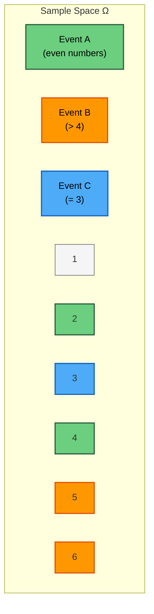
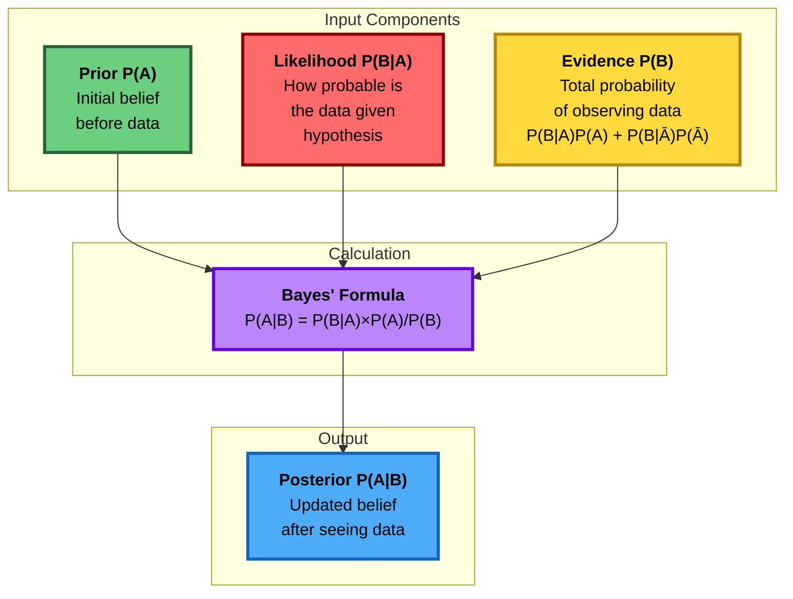
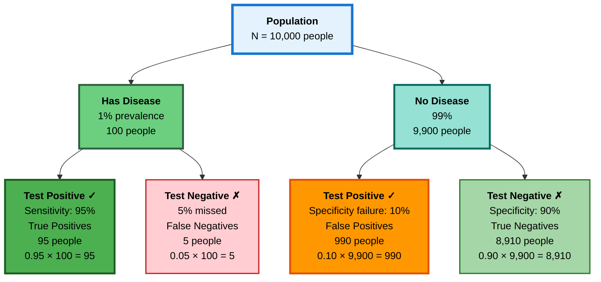
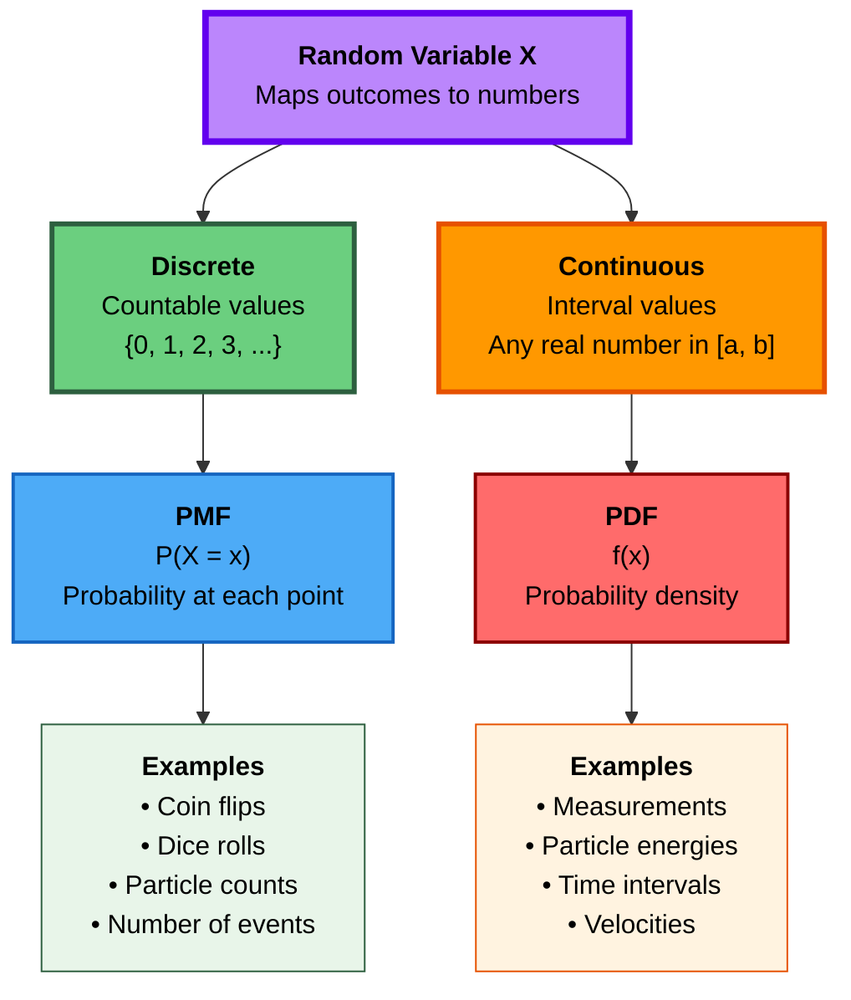
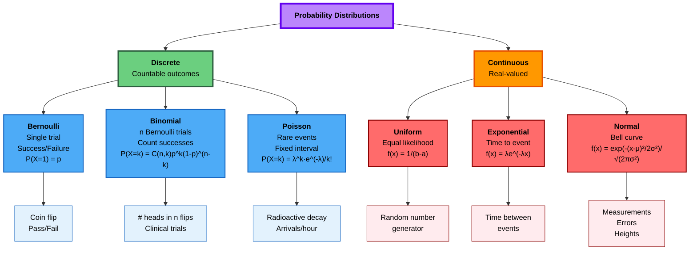
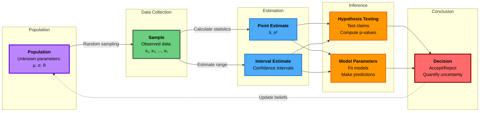
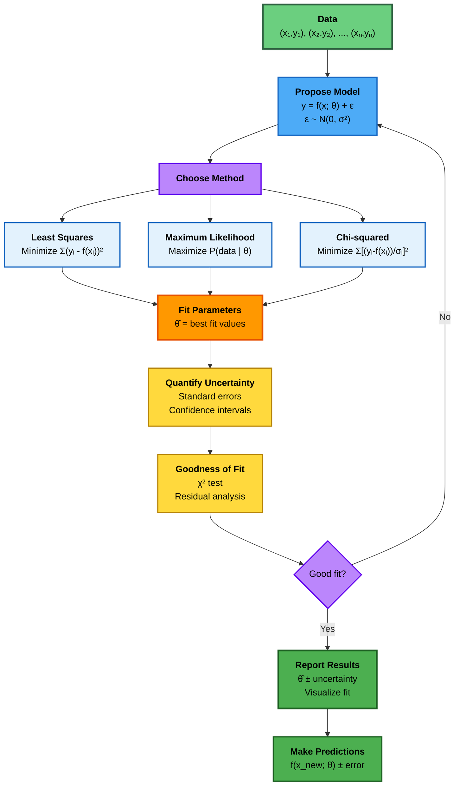

# Dr. Mindaugas Šarpis

# Lessons on **Data Analysis** from **CERN**

## Probability and Statistics

---
layout: fact
hideInToc: true
---

# Why **Probability** and **Statistics**?

---
hideInToc: true
layout: quote
---

## In science, we never measure the *true* value—we collect **samples**, estimate **parameters**, and quantify **uncertainty**. Probability gives us the language; statistics gives us the tools.

---
hideInToc: true
---

# Motivation

- ## All measurements have **uncertainty**

- ## We need to **distinguish signal from noise**

- ## Models require **parameter estimation**

- ## Results must be **statistically significant**

- ## Predictions come with **confidence intervals**

#### This lecture builds the foundation for data fitting, hypothesis testing, and inference

---
layout: section
hideInToc: true
---

# Foundations of **Probability**

---
hideInToc: true
---

# What is Probability?

<div style="display: grid; grid-template-columns: 1fr 1fr; gap: 2rem; margin-top: 2rem;">

<div>

## **Frequentist view**

### Probability = long-run frequency of an event

### Example: Flip a coin 10,000 times → ~50% heads

<br>

## **Bayesian view**

### Probability = degree of belief or uncertainty

### Example: "70% chance of rain" reflects our knowledge

</div>

<div>

## **Both views are useful**

### Frequentist for experiments with repeated trials

### Bayesian for updating beliefs with new data

<br>

### **In physics**: mostly frequentist

### **In machine learning**: increasingly Bayesian

</div>

</div>

---
hideInToc: true
---

# Basic Concepts

<div style="margin-top: 2rem;">

## **Experiment**
### Any process that produces an observation or outcome

## **Sample Space (Ω)**
### Set of all possible outcomes

## **Event**
### A subset of the sample space (collection of outcomes)

## **Probability P(A)**
### A number between 0 and 1 assigned to event A

</div>

---
layout: two-cols
hideInToc: true
---

# Example: Rolling a Die

## **Sample Space**
### Ω = {1, 2, 3, 4, 5, 6}

<br>

## **Events**
### A = "roll an even number" = {2, 4, 6}
### B = "roll greater than 4" = {5, 6}
### C = "roll a 3" = {3}

::right::

<br>
<br>

## **Probabilities**

### For a fair die:
```
P(1) = P(2) = ... = P(6) = 1/6
```

### P(A) = P(even) = 3/6 = 1/2

### P(B) = P(>4) = 2/6 = 1/3

### P(C) = P(3) = 1/6

---
hideInToc: true
---

# Visualizing Sample Space and Events



<div style="margin-top: 1rem; font-size: 1.1em;">

### **Rolling a die**: Ω = {1, 2, 3, 4, 5, 6}
- **Event A** (green): {2, 4, 6} - even numbers
- **Event B** (orange): {5, 6} - greater than 4
- **Event C** (blue): {3} - rolled a 3
- **A ∩ B** (overlap): {6} - even AND > 4

</div>

---
hideInToc: true
---

# Axioms of Probability (Kolmogorov)

<div style="font-size: 1.3em; margin-top: 2rem;">

## **Axiom 1: Non-negativity**
### For any event A: P(A) ≥ 0

<br>

## **Axiom 2: Normalization**
### P(Ω) = 1 (something must happen)

<br>

## **Axiom 3: Additivity**
### If A and B are mutually exclusive (disjoint):
### P(A ∪ B) = P(A) + P(B)

</div>

---
hideInToc: true
---

# Useful Rules from the Axioms

<div style="margin-top: 1.5rem;">

## **Complement Rule**
```
P(not A) = P(Aᶜ) = 1 − P(A)
```

## **Addition Rule (general)**
```
P(A ∪ B) = P(A) + P(B) − P(A ∩ B)
```

## **Multiplication Rule (independent events)**
```
P(A ∩ B) = P(A) × P(B)
```

</div>

---
layout: two-cols
hideInToc: true
---

# Conditional Probability

## **Definition**
### Probability of A given that B has occurred:

```
P(A|B) = P(A ∩ B) / P(B)
```

### (assuming P(B) > 0)

<br>

## **Intuition**
### Restricts sample space to only outcomes where B is true

::right::

<br>

## **Example: Two dice**

### A = "sum is 8"
### B = "first die shows 3"

<br>

### P(A) = 5/36

### P(B) = 6/36 = 1/6

### P(A|B) = ?

<br>

### If first die = 3, second must be 5 for sum = 8

### P(A|B) = 1/6

---
hideInToc: true
---

# Independence

<div style="margin-top: 2rem;">

## **Definition**
### Events A and B are independent if:
```
P(A ∩ B) = P(A) × P(B)
```

### Equivalently: P(A|B) = P(A)

<br>

## **Intuition**
### Knowing B occurred doesn't change the probability of A

<br>

## **Examples**
- ### Flipping two coins: outcomes are independent
- ### Drawing cards *without* replacement: NOT independent
- ### Drawing cards *with* replacement: independent

</div>

---
hideInToc: true
---

# Bayes' Theorem Flow



<div style="margin-top: 1rem;">

## **The Bayesian Update Process:**

1. **Prior P(A)**: What we believed before seeing data
2. **Likelihood P(B|A)**: How likely the data is, given our hypothesis
3. **Evidence P(B)**: Total probability of seeing the data (normalization)
4. **Posterior P(A|B)**: Updated belief after seeing the data

</div>

---
hideInToc: true
---

# Bayes' Theorem

<div style="margin-top: 2rem; font-size: 1.2em;">

## **Formula**
```
P(A|B) = P(B|A) × P(A) / P(B)
```

<br>

## **In words**
```
posterior = (likelihood × prior) / evidence
```

<br>

## **Why it matters**
- ### Allows us to *reverse* conditional probabilities
- ### Foundation of Bayesian inference
- ### Used in medical diagnosis, spam filters, particle physics

</div>

---
layout: two-cols
hideInToc: true
---

# Example: Medical Test

## **Scenario**
- Disease prevalence: 1%
- Test sensitivity: 95% (true positive rate)
- Test specificity: 90% (true negative rate)

## **Question**
### If you test positive, what's the probability you have the disease?

::right::

<br>

## **Solution using Bayes**

### Let D = disease, + = positive test

```
P(D|+) = P(+|D) × P(D) / P(+)
```

### P(+|D) = 0.95 (sensitivity)
### P(D) = 0.01 (prevalence)

### P(+) = P(+|D)P(D) + P(+|Dᶜ)P(Dᶜ)
### = 0.95×0.01 + 0.10×0.99 = 0.1085

### P(D|+) = 0.95×0.01 / 0.1085 ≈ **8.8%**

#### Surprisingly low!

---
hideInToc: true
---

# Visualizing the Medical Test



<div style="margin-top: 1rem; font-size: 1.1em;">

### **Key Insight**: Total Test Positive = 95 + 990 = **1,085 people**
### **P(Disease | Positive) = 95 / 1,085 = 8.8%**
### Only 8.8% of positive tests actually have the disease! (False positive problem with rare diseases)

</div>

---
layout: section
hideInToc: true
---

# Random Variables and Distributions

---
hideInToc: true
---

# What is a Random Variable?

<div style="margin-top: 2rem;">

## **Definition**
### A function that assigns a numerical value to each outcome in the sample space

<br>

## **Types**
- ### **Discrete**: takes countable values (0, 1, 2, ...)
- ### **Continuous**: takes values in an interval (any real number)

<br>

## **Notation**
- ### Capital letters for the variable: X, Y, Z
- ### Lower case for specific values: x, y, z

</div>

---
hideInToc: true
---

# Types of Random Variables



---
layout: two-cols
hideInToc: true
---

# Discrete Random Variables

## **Probability Mass Function (PMF)**
### P(X = x) = probability that X takes value x

<br>

## **Properties**
- ### P(X = x) ≥ 0 for all x
- ### Σ P(X = x) = 1

<br>

## **Example: Coin Flips**
### X = number of heads in 3 flips

::right::

<br>
<br>

## **PMF for X**

| x | P(X = x) |
|---|----------|
| 0 | 1/8 |
| 1 | 3/8 |
| 2 | 3/8 |
| 3 | 1/8 |

<br>

### Sum = 1/8 + 3/8 + 3/8 + 1/8 = 1 ✓

---
layout: two-cols
hideInToc: true
---

# Continuous Random Variables

## **Probability Density Function (PDF)**
### f(x) ≥ 0
### ∫ f(x)dx = 1

<br>

## **Key difference**
### P(X = x) = 0 for any specific x
### Only intervals have non-zero probability:

```
P(a ≤ X ≤ b) = ∫ₐᵇ f(x)dx
```

::right::

<br>

## **Intuition**
### The PDF is a *density*, not a probability

### Area under the curve = probability

<br>

## **Example: Uniform**
### X uniformly distributed on [0, 1]

```
f(x) = 1   if 0 ≤ x ≤ 1
f(x) = 0   otherwise
```

### P(0.2 ≤ X ≤ 0.5) = 0.3

---
hideInToc: true
---

# Cumulative Distribution Function (CDF)

<div style="margin-top: 2rem; font-size: 1.2em;">

## **Definition**
```
F(x) = P(X ≤ x)
```

<br>

## **Properties**
- ### F(x) is non-decreasing
- ### F(−∞) = 0, F(∞) = 1
- ### For continuous X: F'(x) = f(x)

<br>

## **Why it's useful**
- ### Works for both discrete and continuous variables
- ### Easier to work with mathematically
- ### Directly gives probabilities: P(a < X ≤ b) = F(b) − F(a)

</div>

---
layout: section
hideInToc: true
---

# Descriptive Statistics

---
hideInToc: true
---

# Measures of Central Tendency

<div style="display: grid; grid-template-columns: 1fr 1fr; gap: 2rem; margin-top: 2rem;">

<div>

## **Mean (Average)**
```
μ = Σ xᵢ / n
```
### Most common measure
### Sensitive to outliers

<br>

## **Median**
### Middle value when sorted
### Robust to outliers

</div>

<div>

## **Mode**
### Most frequent value
### Can have multiple modes

<br>

## **Example**
### Data: [1, 2, 2, 3, 10]
- Mean = 3.6
- Median = 2
- Mode = 2

### The outlier (10) pulls the mean up

</div>

</div>

---
hideInToc: true
---

# Interactive Demo: Central Tendency

```python {monaco-run}
import numpy as np
import matplotlib.pyplot as plt
from scipy import stats

# Initial dataset (try changing these values!)
data = [1, 2, 2, 3, 10]

# Calculate statistics
mean_val = np.mean(data)
median_val = np.median(data)
mode_val = stats.mode(data, keepdims=True)[0][0]

# Create visualization
fig, (ax1, ax2) = plt.subplots(1, 2, figsize=(12, 4))

# Histogram
ax1.hist(data, bins=10, edgecolor='black', alpha=0.7)
ax1.axvline(mean_val, color='red', linestyle='--', linewidth=2, label=f'Mean = {mean_val:.1f}')
ax1.axvline(median_val, color='blue', linestyle='--', linewidth=2, label=f'Median = {median_val:.1f}')
ax1.axvline(mode_val, color='green', linestyle='--', linewidth=2, label=f'Mode = {mode_val:.1f}')
ax1.set_xlabel('Value')
ax1.set_ylabel('Frequency')
ax1.set_title('Distribution with Outlier')
ax1.legend()
ax1.grid(True, alpha=0.3)

# Without outlier
data_no_outlier = [1, 2, 2, 3, 3]
ax2.hist(data_no_outlier, bins=10, edgecolor='black', alpha=0.7, color='orange')
ax2.axvline(np.mean(data_no_outlier), color='red', linestyle='--', linewidth=2, label=f'Mean = {np.mean(data_no_outlier):.1f}')
ax2.axvline(np.median(data_no_outlier), color='blue', linestyle='--', linewidth=2, label=f'Median = {np.median(data_no_outlier):.1f}')
ax2.set_xlabel('Value')
ax2.set_ylabel('Frequency')
ax2.set_title('Distribution without Outlier')
ax2.legend()
ax2.grid(True, alpha=0.3)

plt.tight_layout()
plt.show()

print(f"With outlier: Mean={mean_val:.2f}, Median={median_val:.2f}, Mode={mode_val:.2f}")
print(f"Without outlier: Mean={np.mean(data_no_outlier):.2f}, Median={np.median(data_no_outlier):.2f}")
```

### Try modifying the `data` list to see how different values affect the statistics!

---
hideInToc: true
---

# Interactive Demo: Sample Mean Convergence

```python {monaco-run}
import numpy as np
import matplotlib.pyplot as plt

# Parameters (try changing these!)
population_mean = 50        # True population mean
population_std = 10         # True population standard deviation
max_sample_size = 500       # Maximum sample size to test
n_experiments = 100         # Number of experiments to average

# Generate data: watch how sample mean converges to true mean
sample_sizes = np.linspace(5, max_sample_size, 50, dtype=int)
mean_estimates = []
std_errors = []

np.random.seed(42)

for n in sample_sizes:
    # Run multiple experiments with sample size n
    sample_means = []
    for _ in range(n_experiments):
        # Draw n samples from normal distribution
        sample = np.random.normal(population_mean, population_std, n)
        sample_means.append(np.mean(sample))

    # Average sample mean and its standard error
    mean_estimates.append(np.mean(sample_means))
    std_errors.append(np.std(sample_means))

# Create visualization
fig, (ax1, ax2) = plt.subplots(1, 2, figsize=(14, 5))

# LEFT PLOT: Convergence of sample mean
ax1.plot(sample_sizes, mean_estimates, 'b-', linewidth=2, label='Sample Mean')
ax1.axhline(population_mean, color='red', linestyle='--', linewidth=2,
            label=f'True Mean = {population_mean}')
ax1.fill_between(sample_sizes,
                  np.array(mean_estimates) - np.array(std_errors),
                  np.array(mean_estimates) + np.array(std_errors),
                  alpha=0.3, color='blue', label='±1 Standard Error')

ax1.set_xlabel('Sample Size (n)', fontsize=12, fontweight='bold')
ax1.set_ylabel('Estimated Mean', fontsize=12, fontweight='bold')
ax1.set_title('Convergence of Sample Mean to Population Mean', fontsize=13, fontweight='bold')
ax1.legend(loc='best')
ax1.grid(True, alpha=0.3)

# RIGHT PLOT: Standard Error vs Sample Size
theoretical_se = population_std / np.sqrt(sample_sizes)
ax2.plot(sample_sizes, std_errors, 'go-', linewidth=2, markersize=4,
         label='Observed Std Error', alpha=0.7)
ax2.plot(sample_sizes, theoretical_se, 'r--', linewidth=2,
         label=f'Theoretical: σ/√n = {population_std}/√n')

ax2.set_xlabel('Sample Size (n)', fontsize=12, fontweight='bold')
ax2.set_ylabel('Standard Error', fontsize=12, fontweight='bold')
ax2.set_title('Standard Error Decreases with Sample Size', fontsize=13, fontweight='bold')
ax2.legend(loc='best')
ax2.grid(True, alpha=0.3)

plt.tight_layout()
plt.show()

print("=" * 60)
print("SAMPLE MEAN CONVERGENCE DEMO")
print("=" * 60)
print(f"\nPopulation Mean (μ): {population_mean}")
print(f"Population Std Dev (σ): {population_std}")
print(f"\nKey Observations:")
print(f"  - With n=5: Standard Error ≈ {population_std/np.sqrt(5):.2f}")
print(f"  - With n=50: Standard Error ≈ {population_std/np.sqrt(50):.2f}")
print(f"  - With n=500: Standard Error ≈ {population_std/np.sqrt(500):.2f}")
print(f"\n✓ As sample size increases:")
print(f"  1. Sample mean gets closer to true mean")
print(f"  2. Variability (standard error) decreases as 1/√n")
print(f"  3. To halve the error, need 4× more samples!")
```

### Try changing `population_mean`, `population_std`, or `max_sample_size` to explore different scenarios!

---
hideInToc: true
---

# Measures of Spread

<div style="margin-top: 1.5rem;">

## **Range**
```
Range = max − min
```
### Simple but not robust

<br>

## **Variance**
```
σ² = Σ(xᵢ − μ)² / n
```
### Average squared deviation from mean

<br>

## **Standard Deviation**
```
σ = √(variance)
```
### Same units as the data • Most commonly reported

</div>

---
layout: two-cols
hideInToc: true
---

# Why Variance?

## **Why square the deviations?**

- ### Makes all deviations positive
- ### Penalizes large deviations more
- ### Mathematical convenience

<br>

## **Sample vs Population**

### Population variance: divide by n
### Sample variance: divide by (n−1)
### (Bessel's correction for unbiased estimate)

::right::

<br>
<br>

## **Example**

### Data: [2, 4, 6, 8]

### Mean μ = 5

### Deviations: [−3, −1, 1, 3]

### Squared: [9, 1, 1, 9]

### Variance σ² = 20/4 = 5

### Std dev σ = √5 ≈ 2.24

---
hideInToc: true
---

# Interactive Demo: Variance and Spread

```python {monaco-run}
import numpy as np
import matplotlib.pyplot as plt
from scipy import stats

# Parameters (try changing these!)
mean = 50
std_devs = [2, 5, 10, 15]  # Different standard deviations to compare
n_samples = 10000

# Create figure
fig, axes = plt.subplots(2, 2, figsize=(14, 10))
axes = axes.flatten()

np.random.seed(42)

for idx, std in enumerate(std_devs):
    # Generate samples
    data = np.random.normal(mean, std, n_samples)

    # Create histogram
    axes[idx].hist(data, bins=50, edgecolor='black', alpha=0.7, density=True)

    # Overlay theoretical normal distribution
    x = np.linspace(mean - 4*std, mean + 4*std, 200)
    pdf = stats.norm.pdf(x, mean, std)
    axes[idx].plot(x, pdf, 'r-', linewidth=2, label='Theoretical PDF')

    # Mark mean
    axes[idx].axvline(mean, color='blue', linestyle='--', linewidth=2, label=f'Mean = {mean}')

    # Mark ±1, ±2, ±3 standard deviations
    for k in [1, 2, 3]:
        axes[idx].axvline(mean + k*std, color='gray', linestyle=':', alpha=0.6)
        axes[idx].axvline(mean - k*std, color='gray', linestyle=':', alpha=0.6)

    # Shade ±1 std dev region
    x_fill = x[(x >= mean - std) & (x <= mean + std)]
    pdf_fill = stats.norm.pdf(x_fill, mean, std)
    axes[idx].fill_between(x_fill, pdf_fill, alpha=0.3, color='green')

    # Calculate actual variance from samples
    sample_var = np.var(data, ddof=1)
    sample_std = np.std(data, ddof=1)

    # Formatting
    axes[idx].set_xlabel('Value', fontsize=11)
    axes[idx].set_ylabel('Density', fontsize=11)
    axes[idx].set_title(f'Normal(μ={mean}, σ={std})\n' +
                       f'Variance = σ² = {std**2}, Std Dev = σ = {std}\n' +
                       f'Sample: σ² ≈ {sample_var:.1f}, σ ≈ {sample_std:.1f}',
                       fontsize=11, fontweight='bold')
    axes[idx].legend(loc='upper right', fontsize=9)
    axes[idx].grid(True, alpha=0.3)

plt.tight_layout()
plt.show()

print("=" * 70)
print("VARIANCE AND STANDARD DEVIATION COMPARISON")
print("=" * 70)
print(f"\nAll distributions have the same mean (μ = {mean})")
print(f"But different variances (σ²) and standard deviations (σ):\n")

for std in std_devs:
    print(f"  σ² = {std**2:>3}, σ = {std:>2}  →  " +
          f"68% of data between {mean - std:>5.1f} and {mean + std:>5.1f}")

print(f"\n✓ Key Insight:")
print(f"  - Larger variance/std dev → data more spread out")
print(f"  - Smaller variance/std dev → data more concentrated")
print(f"  - Variance measures average squared distance from mean")
print(f"  - Std dev is in same units as data (easier to interpret)")
```

### Try changing `mean` or `std_devs` to see how spread affects the shape of distributions!

---
hideInToc: true
---

# Expectation and Variance (Formal)

<div style="margin-top: 1.5rem; font-size: 1.15em;">

## **Expected Value E[X]**

### Discrete: E[X] = Σ x P(X = x)

### Continuous: E[X] = ∫ x f(x)dx

<br>

## **Variance Var(X)**
```
Var(X) = E[(X − μ)²] = E[X²] − (E[X])²
```

<br>

## **Properties**
- ### E[aX + b] = aE[X] + b
- ### Var(aX + b) = a²Var(X)
- ### Var(X + Y) = Var(X) + Var(Y) if X, Y independent

</div>

---
layout: section
hideInToc: true
---

# Common Probability Distributions

---
hideInToc: true
---

# Distribution Landscape



---
hideInToc: true
---

# Discrete Distributions

<div style="margin-top: 2rem;">

## **Bernoulli**
- Single trial: success (1) or failure (0)
- Parameter: p = P(success)
- Example: single coin flip

<br>

## **Binomial**
- n independent Bernoulli trials
- X = number of successes
- Parameters: n, p
- P(X = k) = C(n,k) pᵏ (1−p)ⁿ⁻ᵏ
- Example: number of heads in 10 coin flips

</div>

---
layout: two-cols
hideInToc: true
---

# Poisson Distribution

## **When to use**
- Counting rare events
- Fixed time/space interval
- Events occur independently

<br>

## **PMF**
```
P(X = k) = (λᵏ e⁻ᵏ) / k!
```

### Parameter λ = average rate

::right::

<br>

## **Properties**
- ### E[X] = λ
- ### Var(X) = λ

<br>

## **Examples**
- ### Radioactive decay counts
- ### Photon arrivals at a detector
- ### Network packet arrivals
- ### Mutations in DNA sequence

<br>

#### "How many events in a fixed interval?"

---
hideInToc: true
---

# Continuous Distributions

<div style="margin-top: 2rem;">

## **Uniform Distribution**
- All values in [a, b] equally likely
- f(x) = 1/(b−a) for x ∈ [a,b]
- E[X] = (a+b)/2, Var(X) = (b−a)²/12

<br>

## **Exponential Distribution**
- Time until first event (continuous analog of Poisson)
- f(x) = λe⁻ᵏˣ for x ≥ 0
- E[X] = 1/λ, Var(X) = 1/λ²
- Memoryless property: P(X > s+t | X > s) = P(X > t)

</div>

---
hideInToc: true
---

# Interactive Demo: Comparing Distributions

```python {monaco-run}
import numpy as np
import matplotlib.pyplot as plt
from scipy import stats

# Parameters (try changing these!)
n_binom = 20       # number of trials for binomial
p_binom = 0.3      # probability for binomial
lambda_poisson = 6 # rate parameter for Poisson
mu_normal = 10     # mean for normal
sigma_normal = 3   # standard deviation for normal

# Create figure with 3 subplots
fig, axes = plt.subplots(1, 3, figsize=(15, 4))

# 1. Binomial Distribution
x_binom = np.arange(0, n_binom + 1)
pmf_binom = stats.binom.pmf(x_binom, n_binom, p_binom)

axes[0].bar(x_binom, pmf_binom, alpha=0.7, color='steelblue', edgecolor='black')
axes[0].axvline(n_binom * p_binom, color='red', linestyle='--', linewidth=2, label=f'Mean = {n_binom * p_binom}')
axes[0].set_xlabel('k (number of successes)', fontsize=11)
axes[0].set_ylabel('Probability', fontsize=11)
axes[0].set_title(f'Binomial(n={n_binom}, p={p_binom})', fontsize=12, fontweight='bold')
axes[0].legend()
axes[0].grid(True, alpha=0.3)

# 2. Poisson Distribution
x_poisson = np.arange(0, int(lambda_poisson * 3))
pmf_poisson = stats.poisson.pmf(x_poisson, lambda_poisson)

axes[1].bar(x_poisson, pmf_poisson, alpha=0.7, color='coral', edgecolor='black')
axes[1].axvline(lambda_poisson, color='red', linestyle='--', linewidth=2, label=f'Mean = λ = {lambda_poisson}')
axes[1].set_xlabel('k (number of events)', fontsize=11)
axes[1].set_ylabel('Probability', fontsize=11)
axes[1].set_title(f'Poisson(λ={lambda_poisson})', fontsize=12, fontweight='bold')
axes[1].legend()
axes[1].grid(True, alpha=0.3)

# 3. Normal Distribution
x_normal = np.linspace(mu_normal - 4*sigma_normal, mu_normal + 4*sigma_normal, 200)
pdf_normal = stats.norm.pdf(x_normal, mu_normal, sigma_normal)

axes[2].plot(x_normal, pdf_normal, color='green', linewidth=2)
axes[2].fill_between(x_normal, pdf_normal, alpha=0.3, color='green')
axes[2].axvline(mu_normal, color='red', linestyle='--', linewidth=2, label=f'Mean = μ = {mu_normal}')
axes[2].set_xlabel('x', fontsize=11)
axes[2].set_ylabel('Probability Density', fontsize=11)
axes[2].set_title(f'Normal(μ={mu_normal}, σ={sigma_normal})', fontsize=12, fontweight='bold')
axes[2].legend()
axes[2].grid(True, alpha=0.3)

plt.tight_layout()
plt.show()

# Print summary statistics
print("=== Distribution Comparison ===")
print(f"\nBinomial(n={n_binom}, p={p_binom}):")
print(f"  Mean: {n_binom * p_binom:.2f}")
print(f"  Variance: {n_binom * p_binom * (1 - p_binom):.2f}")

print(f"\nPoisson(λ={lambda_poisson}):")
print(f"  Mean: {lambda_poisson}")
print(f"  Variance: {lambda_poisson}")

print(f"\nNormal(μ={mu_normal}, σ={sigma_normal}):")
print(f"  Mean: {mu_normal}")
print(f"  Variance: {sigma_normal**2}")

print("\nKey insights:")
print("- Binomial: Used for counting successes in fixed trials")
print("- Poisson: Used for counting rare events in intervals")
print("- Normal: Continuous, symmetric, ubiquitous in nature")
```

---
layout: fact
hideInToc: true
---

# The **Normal (Gaussian)** Distribution

---
hideInToc: true
---

# Why the Normal Distribution is Special

<div style="margin-top: 2rem;">

- ## **Most important distribution in statistics**

- ## Arises naturally in many phenomena

- ## Justified by the **Central Limit Theorem**

- ## Measurement errors often approximately normal

- ## Foundation for many statistical tests

- ## Two parameters: μ (mean), σ² (variance)

<br>

### **"The normal distribution is the pattern of patterns"**

</div>

---
layout: two-cols
hideInToc: true
---

# Normal Distribution PDF

## **Formula**
```
f(x) = (1/(σ√(2π))) exp(−(x−μ)²/(2σ²))
```

<br>

## **Notation**
### X ~ N(μ, σ²)

<br>

## **Properties**
- ### Bell-shaped, symmetric
- ### Mean = Median = Mode = μ
- ### Inflection points at μ ± σ

::right::

<br>

## **Standard Normal**
### Z ~ N(0, 1)

```
φ(z) = (1/√(2π)) exp(−z²/2)
```

<br>

## **Standardization**
```
Z = (X − μ) / σ
```

### Converts any normal to standard normal

<br>

### Tables and software give P(Z ≤ z)

---
hideInToc: true
---

# The 68-95-99.7 Rule

<div style="margin-top: 2rem; font-size: 1.3em;">

## For X ~ N(μ, σ²):

- ### **68%** of data within μ ± σ

- ### **95%** of data within μ ± 2σ

- ### **99.7%** of data within μ ± 3σ

<br>

### **Practical implication**: A measurement 3σ away from the mean is extremely rare (0.3% chance)

#### In particle physics: 5σ is the gold standard for discovery (1 in 3.5 million chance if no signal)

</div>

---
hideInToc: true
---

# Interactive Demo: Normal Distribution

```python {monaco-run}
import numpy as np
import matplotlib.pyplot as plt
from scipy import stats

# Parameters (try changing these!)
mu = 100      # mean
sigma = 15    # standard deviation

# Generate x values
x = np.linspace(mu - 4*sigma, mu + 4*sigma, 1000)
y = stats.norm.pdf(x, mu, sigma)

# Create the plot
fig, ax = plt.subplots(figsize=(12, 6))

# Plot the normal distribution
ax.plot(x, y, 'k-', linewidth=2, label='Normal Distribution')

# Shade regions for 68-95-99.7 rule
# 1 sigma (68%)
x1 = x[(x >= mu - sigma) & (x <= mu + sigma)]
y1 = stats.norm.pdf(x1, mu, sigma)
ax.fill_between(x1, y1, alpha=0.3, color='green', label='68% (μ ± 1σ)')

# 2 sigma (95%)
x2 = x[(x >= mu - 2*sigma) & (x <= mu + 2*sigma)]
y2 = stats.norm.pdf(x2, mu, sigma)
ax.fill_between(x2, y2, alpha=0.2, color='blue', label='95% (μ ± 2σ)')

# 3 sigma (99.7%)
x3 = x[(x >= mu - 3*sigma) & (x <= mu + 3*sigma)]
y3 = stats.norm.pdf(x3, mu, sigma)
ax.fill_between(x3, y3, alpha=0.1, color='red', label='99.7% (μ ± 3σ)')

# Add vertical lines at mean and sigma boundaries
ax.axvline(mu, color='black', linestyle='--', linewidth=1.5, label=f'μ = {mu}')
for i in range(1, 4):
    ax.axvline(mu + i*sigma, color='gray', linestyle=':', alpha=0.5)
    ax.axvline(mu - i*sigma, color='gray', linestyle=':', alpha=0.5)

# Labels and formatting
ax.set_xlabel('Value', fontsize=12)
ax.set_ylabel('Probability Density', fontsize=12)
ax.set_title(f'Normal Distribution: N({mu}, {sigma}²)\nThe 68-95-99.7 Rule', fontsize=14, fontweight='bold')
ax.legend(loc='upper right', fontsize=10)
ax.grid(True, alpha=0.3)

# Add text annotations
ax.text(mu, max(y)*0.5, '68%', ha='center', fontsize=14, fontweight='bold', color='green')
ax.text(mu, max(y)*0.3, '95%', ha='center', fontsize=14, fontweight='bold', color='blue')
ax.text(mu, max(y)*0.15, '99.7%', ha='center', fontsize=14, fontweight='bold', color='red')

plt.tight_layout()
plt.show()

print(f"Mean (μ): {mu}")
print(f"Standard Deviation (σ): {sigma}")
print(f"68% of data falls between {mu-sigma:.1f} and {mu+sigma:.1f}")
print(f"95% of data falls between {mu-2*sigma:.1f} and {mu+2*sigma:.1f}")
print(f"99.7% of data falls between {mu-3*sigma:.1f} and {mu+3*sigma:.1f}")
```

---
layout: section
hideInToc: true
---

# Central Limit Theorem

---
layout: fact
hideInToc: true
---

# **Central Limit Theorem (CLT)**

### The cornerstone of statistical inference

---
hideInToc: true
---

# Statement of the CLT

<div style="margin-top: 2rem; font-size: 1.2em;">

## **Informal version**

### Let X₁, X₂, ..., Xₙ be independent random variables from *any* distribution with mean μ and variance σ²

### The sample mean X̄ = (X₁ + X₂ + ... + Xₙ)/n

### As n → ∞, the distribution of X̄ approaches **N(μ, σ²/n)**

<br>

## **In other words**
- ### Sum (or average) of many random variables → Normal
- ### Works regardless of the original distribution
- ### Larger n → better approximation

</div>

---
layout: two-cols
hideInToc: true
---

# Why CLT Matters

## **Measurement errors**
### Sum of many small independent effects
### Result: normally distributed errors

<br>

## **Sampling distributions**
### Allows us to use normal approximation
### Even when population is not normal

<br>

## **Confidence intervals**
### Based on CLT assumptions

::right::

<br>

## **Example**

### Roll a die n times, average the results

- ### Single roll: uniform on {1,2,3,4,5,6}
- ### Average of 2: slightly peaked
- ### Average of 10: looks normal!
- ### Average of 100: very normal

<br>

#### The "magic" of CLT: any distribution → normal

---
hideInToc: true
---

# Interactive Demo: Central Limit Theorem

```python {monaco-run}
import numpy as np
import matplotlib.pyplot as plt
from scipy import stats

# Simulate CLT with uniform distribution
np.random.seed(42)

# Parameters
population_dist = 'uniform'  # Try: 'uniform', 'exponential', or 'custom'
sample_sizes = [2, 5, 10, 30, 100]
n_samples = 1000

fig, axes = plt.subplots(2, 3, figsize=(15, 8))
axes = axes.flatten()

# Original distribution
if population_dist == 'uniform':
    population = np.random.uniform(0, 10, 10000)
    axes[0].hist(population, bins=50, edgecolor='black', alpha=0.7, density=True)
    axes[0].set_title('Original Distribution: Uniform')
elif population_dist == 'exponential':
    population = np.random.exponential(2, 10000)
    axes[0].hist(population, bins=50, edgecolor='black', alpha=0.7, density=True)
    axes[0].set_title('Original Distribution: Exponential')
else:
    # Custom bimodal distribution
    population = np.concatenate([np.random.normal(2, 0.5, 5000),
                                 np.random.normal(8, 0.5, 5000)])
    axes[0].hist(population, bins=50, edgecolor='black', alpha=0.7, density=True)
    axes[0].set_title('Original Distribution: Bimodal')

axes[0].set_xlabel('Value')
axes[0].set_ylabel('Density')
axes[0].grid(True, alpha=0.3)

# Sample means distributions
for idx, n in enumerate(sample_sizes, start=1):
    sample_means = []
    for _ in range(n_samples):
        if population_dist == 'uniform':
            sample = np.random.uniform(0, 10, n)
        elif population_dist == 'exponential':
            sample = np.random.exponential(2, n)
        else:
            sample = np.concatenate([np.random.normal(2, 0.5, n//2),
                                     np.random.normal(8, 0.5, n - n//2)])
        sample_means.append(np.mean(sample))

    axes[idx].hist(sample_means, bins=40, edgecolor='black', alpha=0.7, density=True, color='orange')

    # Overlay theoretical normal distribution
    mu = np.mean(sample_means)
    sigma = np.std(sample_means)
    x = np.linspace(mu - 4*sigma, mu + 4*sigma, 100)
    axes[idx].plot(x, stats.norm.pdf(x, mu, sigma), 'r-', linewidth=2, label='Normal fit')

    axes[idx].set_title(f'Sample Size n={n}')
    axes[idx].set_xlabel('Sample Mean')
    axes[idx].set_ylabel('Density')
    axes[idx].legend()
    axes[idx].grid(True, alpha=0.3)

plt.tight_layout()
plt.show()

print(f"Original distribution: {population_dist}")
print(f"As sample size increases, the distribution of sample means becomes more normal!")
```

### Change `population_dist` to 'uniform', 'exponential', or 'custom' to see CLT with different distributions!

---
hideInToc: true
---

# Standard Error

<div style="margin-top: 2rem; font-size: 1.25em;">

## **Definition**
### Standard deviation of the sample mean:
```
SE = σ / √n
```

<br>

## **Interpretation**
- ### Uncertainty in our estimate of μ
- ### Decreases with sample size (√n)
- ### To halve the error, need 4× more data

<br>

## **Usage**
### Report results as: **mean ± SE**
### Or: **mean ± 2×SE** for ~95% confidence

</div>

---
layout: section
hideInToc: true
---

# Statistical Inference

---
hideInToc: true
---

# The Statistical Inference Process



---
hideInToc: true
---

# Estimation

<div style="margin-top: 2rem;">

## **Point Estimation**
### Single "best guess" for a parameter
- Sample mean x̄ estimates μ
- Sample variance s² estimates σ²

<br>

## **Interval Estimation**
### Range of plausible values
### **Confidence Interval**: range that contains the true parameter with specified probability (e.g., 95%)

<br>

## **Desirable properties**
- **Unbiased**: E[estimator] = true parameter
- **Consistent**: converges to true value as n → ∞
- **Efficient**: smallest variance among unbiased estimators

</div>

---
layout: two-cols
hideInToc: true
---

# Confidence Intervals

## **For a mean (known σ)**
```
CI = x̄ ± z* (σ/√n)
```

### z* = 1.96 for 95% confidence

<br>

## **Interpretation (careful!)**
- ### NOT: "95% chance μ is in this interval"
- ### CORRECT: "95% of such intervals contain μ"

::right::

<br>

## **Example**

### Measure particle mass 100 times
- x̄ = 125.3 GeV
- σ = 2.1 GeV (known)
- n = 100

### SE = 2.1/√100 = 0.21

### 95% CI = 125.3 ± 1.96(0.21)
### = 125.3 ± 0.41
### = [124.89, 125.71] GeV

---
hideInToc: true
---

# Maximum Likelihood Estimation (MLE)

<div style="margin-top: 1.5rem; font-size: 1.15em;">

## **Idea**
### Choose parameter values that make the observed data most probable

<br>

## **Likelihood Function**
### L(θ | data) = probability of data given parameter θ

### For independent observations x₁, ..., xₙ:
```
L(θ) = f(x₁; θ) × f(x₂; θ) × ... × f(xₙ; θ)
```

<br>

## **MLE**
### θ̂ = value that maximizes L(θ)
### In practice: maximize log L(θ) (easier math)

</div>

---
layout: two-cols
hideInToc: true
---

# MLE Example: Normal Mean

## **Setup**
- Data: x₁, ..., xₙ
- Model: X ~ N(μ, σ²) with known σ
- Find μ̂ that maximizes likelihood

## **Result**
### μ̂ = x̄ (sample mean)

### Confirms our intuition!

::right::

<br>

## **Why MLE?**

- ### Principled approach
- ### Works for any distribution
- ### Asymptotically optimal
- ### Foundation for model fitting

<br>

### **Coming up**: We'll use MLE to fit models to data!

---
layout: section
hideInToc: true
---

# Connecting to Data Fitting

---
hideInToc: true
---

# Data Fitting Workflow



---
hideInToc: true
---

# From Probability to Fitting

<div style="margin-top: 2rem;">

## **The data fitting problem**
- ### We have measurements: (x₁, y₁), (x₂, y₂), ..., (xₙ, yₙ)
- ### We propose a model: y = f(x; θ) + error
- ### Goal: find parameters θ that best explain the data

<br>

## **Statistical foundation**
- ### Assume errors are random (often normal)
- ### Use MLE or least squares to estimate θ
- ### Quantify uncertainty in θ using standard errors
- ### Test goodness of fit

<br>

### **Next lectures**: Apply these concepts to fitting lines, curves, and complex models

</div>

---
hideInToc: true
---

# Least Squares = MLE (for normal errors)

<div style="margin-top: 1.5rem; font-size: 1.2em;">

## **If errors are independent and normally distributed:**

```
yᵢ = f(xᵢ; θ) + εᵢ,    εᵢ ~ N(0, σ²)
```

<br>

## **Then minimizing sum of squared errors:**
```
S(θ) = Σ (yᵢ − f(xᵢ; θ))²
```

## **Is equivalent to maximizing the likelihood**

<br>

### This is why least squares fitting is so ubiquitous in science!

</div>

---
hideInToc: true
---

# Chi-Squared (χ²) Statistic

<div style="margin-top: 2rem; font-size: 1.2em;">

## **Definition**
```
χ² = Σ [(observed − expected)² / variance]
```

<br>

## **For fitting with uncertainties σᵢ:**
```
χ² = Σ [(yᵢ − f(xᵢ; θ)) / σᵢ]²
```

<br>

## **Interpretation**
- ### Measures "badness of fit"
- ### χ² ≈ (n − p) for a good fit (n data points, p parameters)
- ### χ²/(n−p) ≈ 1 ideal • χ²/(n−p) >> 1 bad fit or underestimated errors

</div>

---
hideInToc: true
---

# Hypothesis Testing (Preview)

<div style="margin-top: 2rem;">

## **Null hypothesis (H₀)**
### Statement we want to test (often "no effect")

<br>

## **Alternative hypothesis (H₁)**
### What we suspect might be true

<br>

## **Test statistic**
### Number computed from data that measures compatibility with H₀

<br>

## **p-value**
### Probability of observing data at least as extreme as ours, if H₀ is true
### Small p-value (< 0.05) → reject H₀

</div>

---
hideInToc: true
---

# Common Mistakes and Pitfalls

<div style="margin-top: 1.5rem;">

## **Confusing probability and statistics**
- Probability: known model → predict data
- Statistics: observed data → infer model

<br>

## **Misinterpreting confidence intervals**
- Not a probability about the parameter
- It's about the long-run behavior of the method

<br>

## **p-hacking**
- Testing multiple hypotheses until one is "significant"
- Solution: pre-register analysis, correct for multiple testing

<br>

## **Extrapolation beyond data range**
- Models are only valid where calibrated

</div>

---
layout: section
hideInToc: true
---

# Practical Examples

---
hideInToc: true
---

# Example 1: Counting Experiment

<div style="margin-top: 1.5rem; font-size: 1.15em;">

## **Scenario**: Measure radioactive decay events

- ### Expect background: λ_bg = 10 events/minute
- ### Observe: 23 events in 1 minute
- ### Is there a signal above background?

<br>

## **Statistical approach**

- ### Model: Poisson(λ_bg) for background only
- ### Under H₀: P(X ≥ 23) when λ = 10
- ### Using Poisson tables or software: p ≈ 0.002
- ### Strong evidence for signal! (> 3σ)

</div>

---
hideInToc: true
---

# Interactive Demo: Counting Experiment

```python {monaco-run}
import numpy as np
import matplotlib.pyplot as plt
from scipy import stats

# Parameters (try changing these!)
lambda_bg = 10      # expected background events
observed = 23       # observed events
confidence = 0.95   # confidence level for intervals

# Create figure with 2 subplots
fig, (ax1, ax2) = plt.subplots(1, 2, figsize=(14, 5))

# LEFT PLOT: Poisson Distribution
x_range = np.arange(0, max(30, observed + 5))
pmf = stats.poisson.pmf(x_range, lambda_bg)

# Plot the PMF
ax1.bar(x_range, pmf, alpha=0.7, color='steelblue', edgecolor='black', label='Poisson PMF')

# Highlight observed value and beyond
highlight = x_range >= observed
ax1.bar(x_range[highlight], pmf[highlight], alpha=0.9, color='red',
        edgecolor='black', label=f'P(X ≥ {observed})')

# Add mean line
ax1.axvline(lambda_bg, color='green', linestyle='--', linewidth=2,
            label=f'Expected λ = {lambda_bg}')

ax1.set_xlabel('Number of Events', fontsize=12, fontweight='bold')
ax1.set_ylabel('Probability', fontsize=12, fontweight='bold')
ax1.set_title(f'Poisson Distribution (λ = {lambda_bg})', fontsize=14, fontweight='bold')
ax1.legend(loc='upper right')
ax1.grid(True, alpha=0.3)

# RIGHT PLOT: Hypothesis Testing Visualization
# Calculate p-value: P(X >= observed | λ = lambda_bg)
p_value = 1 - stats.poisson.cdf(observed - 1, lambda_bg)

# Calculate significance in sigma
if p_value > 0:
    z_score = stats.norm.ppf(1 - p_value)
    sigma_significance = abs(z_score)
else:
    sigma_significance = float('inf')

# Confidence intervals
ci_lower = stats.poisson.ppf((1 - confidence) / 2, lambda_bg)
ci_upper = stats.poisson.ppf(1 - (1 - confidence) / 2, lambda_bg)

# Create bar chart for hypothesis test
categories = ['Expected\nBackground', 'Observed\nEvents', f'{confidence*100:.0f}% CI\nUpper']
values = [lambda_bg, observed, ci_upper]
colors = ['green', 'red', 'orange']

bars = ax2.bar(categories, values, color=colors, alpha=0.7, edgecolor='black', width=0.6)

# Add value labels on bars
for bar, val in zip(bars, values):
    height = bar.get_height()
    ax2.text(bar.get_x() + bar.get_width()/2., height,
             f'{val:.1f}', ha='center', va='bottom', fontsize=11, fontweight='bold')

# Add horizontal line for confidence interval
ax2.axhline(ci_upper, color='orange', linestyle='--', linewidth=2, alpha=0.7)
ax2.axhline(ci_lower, color='orange', linestyle='--', linewidth=2, alpha=0.7)

ax2.set_ylabel('Number of Events', fontsize=12, fontweight='bold')
ax2.set_title('Hypothesis Test Results', fontsize=14, fontweight='bold')
ax2.grid(True, alpha=0.3, axis='y')

plt.tight_layout()
plt.show()

# Print detailed results
print("=" * 50)
print(" COUNTING EXPERIMENT: STATISTICAL ANALYSIS")
print("=" * 50)
print(f"\nExpected background (λ): {lambda_bg} events/minute")
print(f"Observed events: {observed} events/minute")
print(f"\n--- Hypothesis Testing ---")
print(f"H₀: Only background present (λ = {lambda_bg})")
print(f"H₁: Signal + background present (λ > {lambda_bg})")
print(f"\np-value: {p_value:.6f}")
print(f"Significance: {sigma_significance:.2f}σ")

if p_value < 0.001:
    print("\n✓ VERY STRONG evidence for signal (> 3σ)!")
elif p_value < 0.05:
    print("\n✓ Strong evidence for signal!")
else:
    print("\n✗ Insufficient evidence for signal.")

print(f"\n--- Confidence Intervals ---")
print(f"{confidence*100:.0f}% CI for background: [{ci_lower:.1f}, {ci_upper:.1f}]")

excess = observed - lambda_bg
print(f"\nExcess events: {excess:.1f}")
print(f"Excess significance: {excess/np.sqrt(lambda_bg):.2f}σ (simple estimate)")
```

---
layout: two-cols
hideInToc: true
---

# Example 2: Measuring a Constant

## **Scenario**
### Measure speed of light (c)

### 10 measurements (in 10⁸ m/s):
```
2.95, 3.01, 2.98, 3.03, 2.97,
3.00, 2.99, 3.02, 2.96, 3.01
```

::right::

<br>

## **Analysis**

### Mean: x̄ = 2.992

### Std dev: s = 0.025

### SE = 0.025/√10 = 0.008

<br>

### 95% CI:
### 2.992 ± 2.26(0.008)
### = 2.992 ± 0.018
### = [2.974, 3.010]

<br>

#### (True value: 2.998) ✓

---
hideInToc: true
---

# Example 3: Comparing Two Samples

<div style="margin-top: 1.5rem; font-size: 1.15em;">

## **Scenario**: New detector vs old detector

- ### Old: mean = 100, σ = 15, n = 50
- ### New: mean = 108, σ = 12, n = 60

## **Question**: Is the difference significant?

<br>

## **Approach** (two-sample test)

### Difference in means: 108 − 100 = 8

### SE of difference: √(15²/50 + 12²/60) ≈ 2.58

### Test statistic: z = 8/2.58 ≈ 3.1

### p-value < 0.002 → **significant improvement!**

</div>

---
hideInToc: true
---

# Visualizing Distributions

<div style="margin-top: 2rem; font-size: 1.15em;">

## **Histograms**
- Show empirical distribution
- Check for normality, outliers, skewness

<br>

## **Q-Q plots**
- Compare quantiles of data vs theoretical distribution
- Straight line → good fit to assumed distribution

<br>

## **Box plots**
- Show median, quartiles, outliers
- Easy comparison across groups

<br>

### **Always visualize your data before fitting!**

</div>

---
layout: section
hideInToc: true
---

# Summary and Takeaways

---
hideInToc: true
---

# Key Concepts

<div style="display: grid; grid-template-columns: 1fr 1fr; gap: 2rem; margin-top: 1.5rem;">

<div>

## **Probability**
- Sample space, events
- Conditional probability
- Independence
- Bayes' theorem

<br>

## **Random Variables**
- Discrete vs continuous
- PMF, PDF, CDF
- Expectation and variance

</div>

<div>

## **Distributions**
- Binomial, Poisson
- Normal (Gaussian)
- Central Limit Theorem

<br>

## **Inference**
- Point and interval estimation
- Confidence intervals
- Maximum likelihood
- Hypothesis testing

</div>

</div>

---
hideInToc: true
---

# Building Towards Data Fitting

<div style="margin-top: 2rem; font-size: 1.25em;">

## **We now have the foundation to:**

- ### Model data as random variables with distributions

- ### Estimate parameters from measurements

- ### Quantify uncertainty (standard errors, confidence intervals)

- ### Judge fit quality (χ², residuals)

- ### Test hypotheses about our models

<br>

### **Next up**: Apply these tools to fit lines, curves, and complex functions to real experimental data

</div>

---
hideInToc: true
---

# Practical Advice

- ## **Always visualize** your data first

- ## **Check assumptions** (normality, independence)

- ## **Report uncertainties** alongside estimates

- ## **Understand what your p-value means** (and doesn't mean)

- ## **Don't over-interpret** small samples

- ## **Use simulation** when theory is unclear

- ## **Document your choices** for reproducibility

---
hideInToc: true
---

# Resources for Further Learning

<div style="margin-top: 2rem;">

## **Books**
- *Statistics* by Freedman, Pisani, Purves (intuitive)
- *Statistical Data Analysis* by Glen Cowan (for physicists)
- *All of Statistics* by Wasserman (mathematical)

<br>

## **Online**
- Khan Academy: Probability and Statistics
- Seeing Theory: visual intro to probability (seeing-theory.brown.edu)
- CERN Statistics Lectures (indico.cern.ch)

<br>

## **Software**
- Python: NumPy, SciPy, statsmodels
- R: built-in statistical functions
- ROOT: CERN's framework (root.cern.ch)

</div>

---
layout: fact
hideInToc: true
---

# Questions?

---
hideInToc: true
---

# Exercise: Practice Problems

<div style="margin-top: 1.5rem;">

## **1. Probability**
### A detector has 95% efficiency. You observe 90 particles. How many were actually produced? Include uncertainty.

<br>

## **2. Distributions**
### Generate 1000 random numbers from N(5, 2²). Compute mean and std dev. How close to 5 and 2?

<br>

## **3. Confidence Intervals**
### Measure: 12.3, 12.7, 12.1, 12.5, 12.4. Compute 95% CI for the mean (assume normal).

<br>

## **4. Hypothesis Test**
### Expected: 50 ± 7 events. Observed: 68. Is this a significant excess? Compute p-value.

</div>

---
layout: end
hideInToc: true
---

# Thank you!

## Next: **Data Fitting and Regression**
