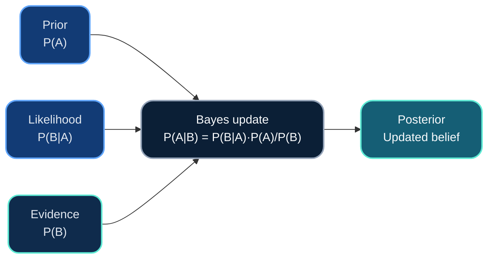
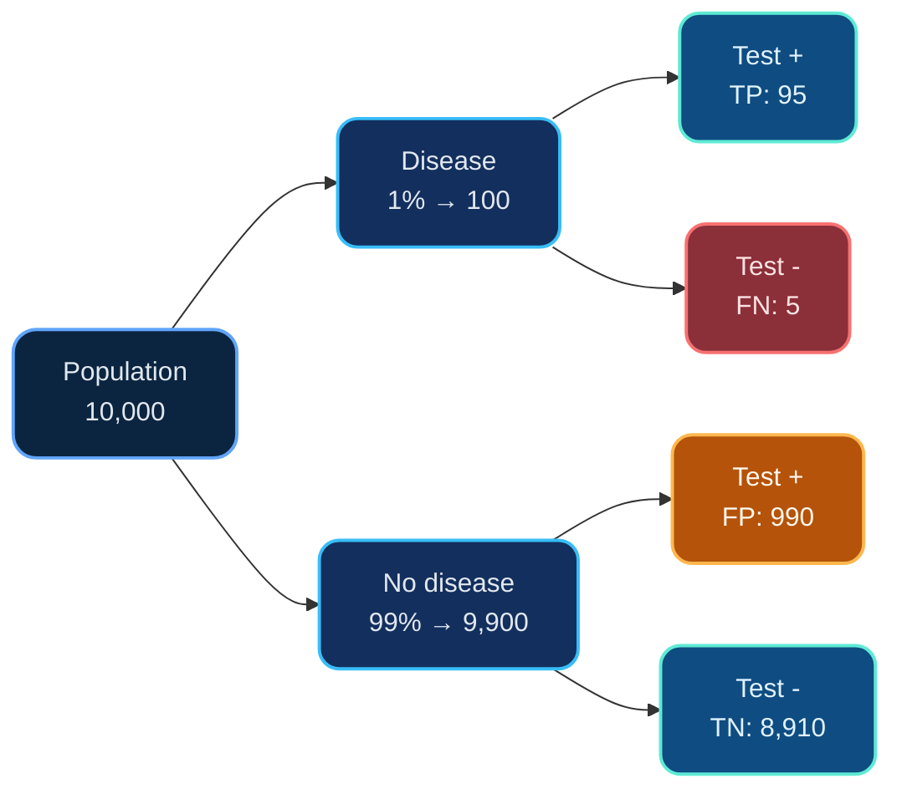
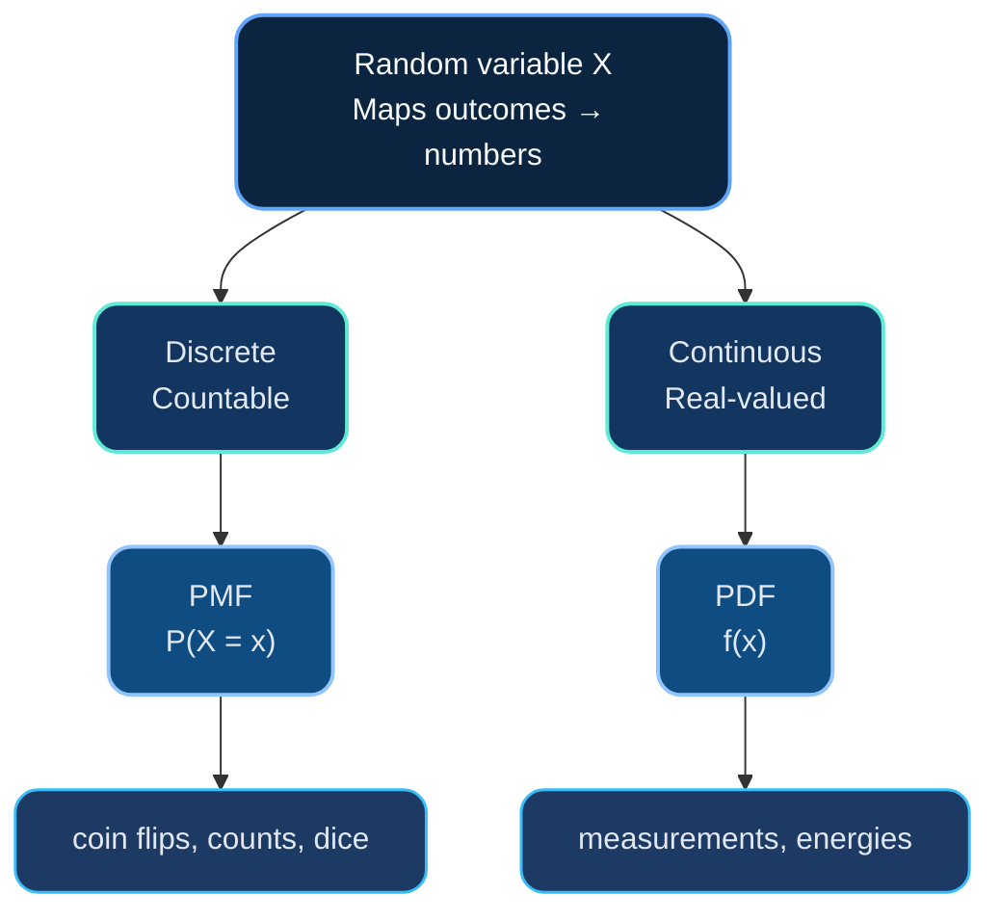
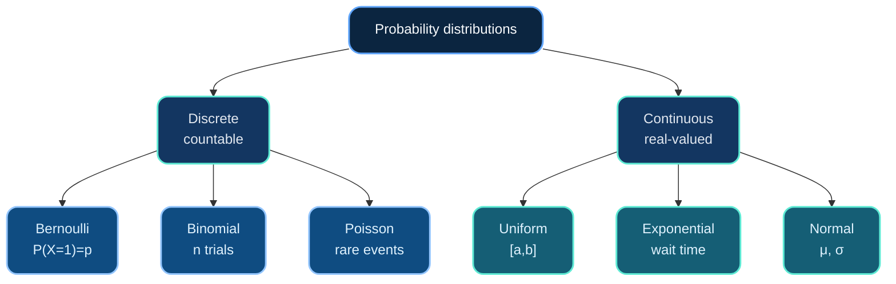
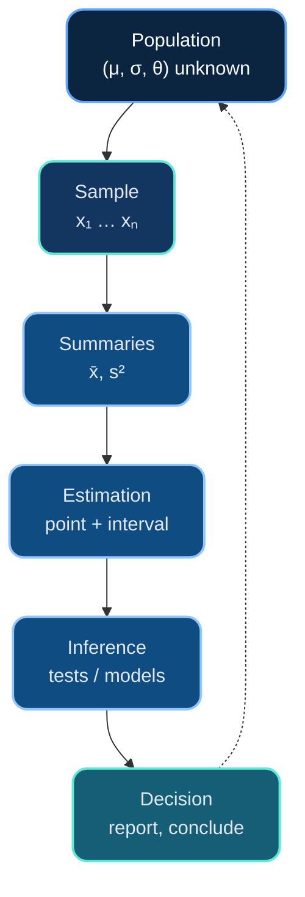
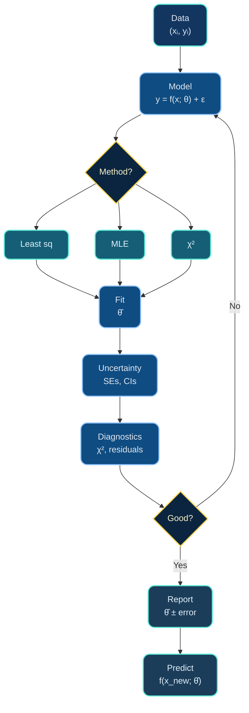

# Dr. Mindaugas Šarpis

# Lessons on **Data Analysis** from **CERN**

## Probability and Statistics

---
layout: fact
hideInToc: true
---

# Why **Probability** and **Statistics**?

---
hideInToc: true
layout: quote
---

## In science, we never measure the *true* value—we collect **samples**, estimate **parameters**, and quantify **uncertainty**. Probability gives us the language; statistics gives us the tools.

---
hideInToc: true
---

# Motivation

- ## All measurements have **uncertainty**

- ## We need to **distinguish signal from noise**

- ## Models require **parameter estimation**

- ## Results must be **statistically significant**

- ## Predictions come with **confidence intervals**

#### This lecture builds the foundation for data fitting, hypothesis testing, and inference

---
layout: section
hideInToc: true
---

# Foundations of **Probability**

---
hideInToc: true
---

# What is Probability?

<div class="grid-2 mt-lg">

<div class="card card-primary">

## 📊 **Frequentist View**

<div class="card-content">

**Probability = long-run frequency**

💡 Example: Flip a coin 10,000 times → ~50% heads

</div>

</div>

<div class="card card-secondary">

## 🧠 **Bayesian View**

<div class="card-content">

**Probability = degree of belief**

💡 Example: "70% chance of rain" reflects knowledge

</div>

</div>

</div>

<div class="card card-accent mt-lg">

## ⚖️ **Both Views are Useful**

<div class="grid-2 mt-sm text-base">

<div>

✅ **Frequentist** for repeated trials

✅ **Bayesian** for updating beliefs

</div>

<div>

⚛️ **Physics:** mostly frequentist

🤖 **ML:** increasingly Bayesian

</div>

</div>

</div>

---
hideInToc: true
---

# Basic Concepts

<div class="grid-2 mt-md gap-tight">

<div class="card card-primary pad-tight">

### 🔬 **Experiment**

<div class="note-text mt-xs">Repeatable process producing an outcome</div>

</div>

<div class="card card-secondary pad-tight">

### 🌐 **Sample Space (Ω)**

<div class="note-text mt-xs">All possible outcomes</div>

</div>

<div class="card card-accent pad-tight">

### 🎯 **Event**

<div class="note-text mt-xs">Subset of Ω satisfying a condition</div>

</div>

<div class="card card-info pad-tight">

### 📊 **Probability P(A)**

<div class="note-text mt-xs">Number in [0,1] quantifying likelihood</div>

</div>

</div>

---
hideInToc: true
---

# Visualizing Sample Space & Events

<div style="display: grid; grid-template-columns: 1fr 1fr; gap: 3rem; margin-top: 2rem; align-items: start;">

<div>

## 🎲 Sample Space <br>
## Ω = {1, 2, 3, 4, 5, 6}

<div style="display: grid; grid-template-columns: repeat(3, 1fr); gap: 0.7rem; margin-top: 1.5rem; max-width: 380px;">

<div style="background: linear-gradient(135deg, var(--color-primary) 0%, var(--color-primary-light) 100%); padding: 1.2rem; border-radius: 14px; text-align: center; font-size: 2em; font-weight: 700; color: #f8fafc; box-shadow: 0 4px 6px rgba(0,0,0,0.3);">1</div>

<div style="background: linear-gradient(135deg, var(--color-success) 0%, var(--color-success-light) 100%); padding: 1.2rem; border-radius: 14px; text-align: center; font-size: 2em; font-weight: 700; color: #f8fafc; box-shadow: 0 4px 6px rgba(0,0,0,0.3);">2</div>

<div style="background: linear-gradient(135deg, var(--color-info) 0%, var(--color-info-light) 100%); padding: 1.2rem; border-radius: 14px; text-align: center; font-size: 2em; font-weight: 700; color: #f8fafc; box-shadow: 0 4px 6px rgba(0,0,0,0.3);">3</div>

<div style="background: linear-gradient(135deg, var(--color-success) 0%, var(--color-success-light) 100%); padding: 1.2rem; border-radius: 14px; text-align: center; font-size: 2em; font-weight: 700; color: #f8fafc; box-shadow: 0 4px 6px rgba(0,0,0,0.3);">4</div>

<div style="background: linear-gradient(135deg, var(--color-warning) 0%, var(--color-warning-light) 100%); padding: 1.2rem; border-radius: 14px; text-align: center; font-size: 2em; font-weight: 700; color: #f8fafc; box-shadow: 0 4px 6px rgba(0,0,0,0.3);">5</div>

<div style="background: linear-gradient(135deg, var(--color-accent) 0%, var(--color-accent-light) 100%); padding: 1.2rem; border-radius: 14px; text-align: center; font-size: 2em; font-weight: 700; color: #f8fafc; box-shadow: 0 4px 6px rgba(0,0,0,0.3);">6</div>

</div>

<div style="text-align: center; margin-top: 1rem; font-size: 0.9em; opacity: 0.8;">
All outcomes are equally likely: P(each) = 1/6
</div>

</div>

<div>

## 📍 **Events (Subsets of Ω)**

<div style="display: flex; flex-direction: column; gap: 0.7rem; margin-top: 1.5rem;">

<div class="card card-success pad-snug">
<div class="flex-between">
<strong class="text-subhead">Event A (even):</strong>
<span class="mono-strong">{2, 4, 6}</span>
</div>
</div>

<div class="card card-warning pad-snug">
<div class="flex-between">
<strong class="text-subhead">Event B (&gt; 4):</strong>
<span class="mono-strong">{5, 6}</span>
</div>
</div>

<div class="card card-info pad-snug">
<div class="flex-between">
<strong class="text-subhead">Event C (exact):</strong>
<span class="mono-strong">{3}</span>
</div>
</div>

<div class="card card-accent pad-snug">
<div class="flex-between">
<strong class="text-subhead">A ∩ B (even &amp; &gt; 4):</strong>
<span class="mono-strong">{6}</span>
</div>
</div>

</div>

</div>

</div>

---
hideInToc: true
---

# Axioms of Probability (Kolmogorov)

<div class="grid-3 mt-md gap-tight">

<div class="card card-primary pad-tight">

### ✅ **Axiom 1**

**Non-negativity**

<div class="note-text-lg"> 

$P(A) \geq 0$ for any event A

</div>

</div>

<div class="card card-secondary pad-tight">

### 🌍 **Axiom 2**

**Normalization**

<div class="note-text-lg">

$P(\Omega) = 1$

</div>

</div>

<div class="card card-accent pad-tight">

### ➕ **Axiom 3**

**Additivity**

<div class="note-text-lg">

Mutually exclusive: 
$$P(A \cup B) = P(A) + P(B)$$

</div>

</div>

</div>

---
hideInToc: true
---

# Useful Rules from the Axioms

<div class="grid-3 mt-md gap-tight">

<div class="card card-warning pad-tight">

### 🔄 **Complement**

$$P(A^c) = 1 - P(A)$$

</div>

<div class="card card-info pad-tight">

### ➕ **Addition**

$P(A \cup B) = P(A) + P(B) - P(A \cap B)$

</div>

<div class="card card-success pad-tight">

### ✖️ **Multiplication**

$$P(A \cap B) = P(A) \times P(B)$$

<div class="meta-caption">if independent</div>

</div>

</div>

---
layout: two-cols
hideInToc: true
---

# Conditional Probability

## **Definition**

<div class="card card-primary text-base">

<div class="card-content">

Knowing that B happened shrinks the universe of outcomes to B. The probability of A in that restricted world is

$$P(A \mid B) = \frac{P(A \cap B)}{P(B)}, \quad P(B) > 0$$

</div>

</div>

<div class="card card-secondary text-base mt-md">

<div class="card-content">

Think of it as running the experiment again but keeping only the trials where B occurred.

</div>

</div>

::right::

## **Two-dice example**

<div class="card card-accent text-base">

- Event A: total sum is 8 (5 ways out of 36).  
- Event B: first die shows 3 (6 ways out of 36).

Once B happens, the only compatible pair giving sum 8 is (3, 5), so

$$P(A \mid B) = \frac{1}{6}$$

</div>

---
hideInToc: true
---

# Independence

<div class="grid-2 mt-lg">

<div class="card card-primary">

## 📐 **Definition**

<div class="card-content text-md">

Events A and B are independent if:

$$P(A \cap B) = P(A) \times P(B)$$

**Equivalently:** $P(A \mid B) = P(A)$

</div>

</div>

<div class="card card-secondary">

## 💡 **Intuition**

<div class="card-content text-md">

Knowing B occurred doesn't change the probability of A

</div>

</div>

</div>

<div class="card card-success mt-lg">

## 📚 **Examples**

<div class="card-content text-md">

✅ **Flipping two coins:** outcomes are independent

❌ **Drawing cards *without* replacement:** NOT independent

✅ **Drawing cards *with* replacement:** independent

</div>

</div>

---
hideInToc: true
---

# Bayes' Theorem Flow



<div class="note-text mt-sm">

**1.** Prior P(A): Belief before data • **2.** Likelihood P(B|A): Data probability • **3.** Evidence P(B): Normalization • **4.** Posterior P(A|B): Updated belief

</div>

---
hideInToc: true
---

# Bayes' Theorem

<div class="lead-block-lg">

## **Formula**
$$P(A \mid B) = \frac{P(B \mid A) \times P(A)}{P(B)}$$

## **In words**
$$\text{posterior} = \frac{\text{likelihood} \times \text{prior}}{\text{evidence}}$$

<br>

## **Why it matters**
Reverses conditionals • Bayesian inference • Diagnosis, filters, physics

</div>

---
layout: two-cols
hideInToc: true
---

# Example: Medical Test

## **Scenario**
- Disease prevalence: 1%
- Test sensitivity: 95% (true positive rate)
- Test specificity: 90% (true negative rate)

## **Question**
### If you test positive, what's the probability you have the disease?

::right::

<br>

## **Solution using Bayes**

### Let D = disease, + = positive test

$$P(D \mid +) = \frac{P(+ \mid D) \times P(D)}{P(+)}$$

### $P(+ \mid D) = 0.95$ (sensitivity)
### $P(D) = 0.01$ (prevalence)

### $P(+) = P(+ \mid D)P(D) + P(+ \mid D^c)P(D^c)$
### $= 0.95 \times 0.01 + 0.10 \times 0.99 = 0.1085$

### $P(D \mid +) = \frac{0.95 \times 0.01}{0.1085} \approx$ **8.8%**

#### Surprisingly low!


---
hideInToc: true
---

# Visualizing the Medical Test



<div class="card card-info pad-tight mermaid-note">

<div class="note-text">

Total positive: 95 + 990 = **1,085** • **P(Disease | +) = 95/1,085 = 8.8%** • False positives dominate when disease is rare

</div>

</div>

---
layout: section
hideInToc: true
---

# Random Variables and Distributions

---
hideInToc: true
---

# What is a Random Variable?

<div class="lead-block">

## **Definition**
Function mapping outcomes to numbers

## **Types**
**Discrete**: countable (0, 1, 2, ...) • **Continuous**: interval values (any real)

## **Notation**
Variable: X, Y, Z (capitals) • Values: x, y, z (lowercase)

</div>

---
hideInToc: true
---

# Types of Random Variables



---
layout: two-cols
hideInToc: true
---

# Discrete Random Variables

## **Probability Mass Function (PMF)**
### P(X = x) = probability that X takes value x

<br>

## **Properties**
- ### P(X = x) ≥ 0 for all x
- ### Σ P(X = x) = 1

<br>

## **Example: Coin Flips**
### X = number of heads in 3 flips

::right::

<br>
<br>

## **PMF for X**

| x | P(X = x) |
|---|----------|
| 0 | 1/8 |
| 1 | 3/8 |
| 2 | 3/8 |
| 3 | 1/8 |

<br>

### Sum = 1/8 + 3/8 + 3/8 + 1/8 = 1 ✓

---
layout: two-cols
hideInToc: true
---

# Continuous Random Variables

## **Probability Density Function (PDF)**
### f(x) ≥ 0
### ∫ f(x)dx = 1

<br>

## **Key difference**
### P(X = x) = 0 for any specific x
### Only intervals have non-zero probability:

$$P(a \leq X \leq b) = \int_a^b f(x)\,dx$$

::right::

<br>

## **Intuition**
### The PDF is a *density*, not a probability

### Area under the curve = probability

<br>

## **Example: Uniform**
### X uniformly distributed on [0, 1]

$$f(x) = \begin{cases} 1 & \text{if } 0 \leq x \leq 1 \\ 0 & \text{otherwise} \end{cases}$$

### $P(0.2 \leq X \leq 0.5) = 0.3$

---
hideInToc: true
---

# Cumulative Distribution Function (CDF)

<div class="lead-block">

## **Definition**
$$F(x) = P(X \leq x)$$

## **Properties**
$F(x)$ non-decreasing • $F(-\infty) = 0$, $F(\infty) = 1$ • Continuous X: $F'(x) = f(x)$

<br>

## **Why useful**
Works for discrete & continuous • Easier math • Direct probabilities: $P(a < X \leq b) = F(b) - F(a)$

</div>

---
layout: section
hideInToc: true
---

# Descriptive Statistics

---
hideInToc: true
---

# Measures of Central Tendency

<div style="display: grid; grid-template-columns: 1fr 1fr; gap: 2rem; margin-top: 2rem;">

<div>

## **Mean (Average)**
$$\mu = \frac{\sum x_i}{n}$$
### Most common measure
### Sensitive to outliers

<br>

## **Median**
### Middle value when sorted
### Robust to outliers

</div>

<div>

## **Mode**
### Most frequent value
### Can have multiple modes

<br>

## **Example**
### Data: [1, 2, 2, 3, 10]
- Mean = 3.6
- Median = 2
- Mode = 2

### The outlier (10) pulls the mean up

</div>

</div>

---
hideInToc: true
---

# Measures of Spread

<div class="grid-3 mt-md gap-tight">

<div class="card card-warning pad-tight">

### 📏 **Range**

$$\text{Range} = \max - \min$$

<div class="meta-caption">Simple but not robust</div>

</div>

<div class="card card-accent pad-tight">

### 📊 **Variance**

$$\sigma^2 = \frac{\sum(x_i - \mu)^2}{n}$$

<div class="meta-caption">Average squared deviation</div>

</div>

<div class="card card-info pad-tight">

### 📈 **Standard Deviation**

$$\sigma = \sqrt{\text{variance}}$$

<div class="meta-caption">Same units as data</div>

</div>

</div>

---
layout: two-cols
hideInToc: true
---

# Why Variance?

## **Why square the deviations?**

- ### Makes all deviations positive
- ### Penalizes large deviations more
- ### Mathematical convenience

<br>

## **Sample vs Population**

### Population variance: divide by n
### Sample variance: divide by (n−1)
### (Bessel's correction for unbiased estimate)

::right::

<br>
<br>

## **Example**

### Data: [2, 4, 6, 8]

### Mean μ = 5

### Deviations: [−3, −1, 1, 3]

### Squared: [9, 1, 1, 9]

### Variance σ² = 20/4 = 5

### Std dev σ = √5 ≈ 2.24

---
hideInToc: true
---

# Expectation and Variance (Formal)

<div class="lead-block-lg">

## **Expected Value E[X]**

### Discrete: $E[X] = \sum x P(X = x)$

### Continuous: $E[X] = \int x f(x)\,dx$

<br>

## **Variance Var(X)**
$$\text{Var}(X) = E[(X - \mu)^2] = E[X^2] - (E[X])^2$$

<br>

## **Properties**
- ### $E[aX + b] = aE[X] + b$
- ### $\text{Var}(aX + b) = a^2\text{Var}(X)$
- ### $\text{Var}(X + Y) = \text{Var}(X) + \text{Var}(Y)$ if X, Y independent

</div>

---
layout: section
hideInToc: true
---

# Common Probability Distributions

---
hideInToc: true
---

# Distribution Landscape



---
hideInToc: true
---

# Discrete Distributions

<div class="lead-block">

## **Bernoulli**
Single trial: success/failure • Parameter: $p = P(\text{success})$ • Ex: coin flip

<br>

## **Binomial**
$n$ independent trials • $X$ = successes • $P(X = k) = C(n,k) p^k (1-p)^{n-k}$ • Ex: heads in 10 flips

</div>

---
layout: two-cols
hideInToc: true
---

# Poisson Distribution

## **When to use**
- Counting rare events
- Fixed time/space interval
- Events occur independently

<br>

## **PMF**
$$P(X = k) = \frac{\lambda^k e^{-\lambda}}{k!}$$

### Parameter $\lambda$ = average rate

::right::

<br>

## **Properties**
- ### $E[X] = \lambda$
- ### $\text{Var}(X) = \lambda$

<br>

## **Examples**
- ### Radioactive decay counts
- ### Photon arrivals at a detector
- ### Network packet arrivals
- ### Mutations in DNA sequence

<br>

#### "How many events in a fixed interval?"

---
hideInToc: true
---

# Continuous Distributions

<div class="lead-block">

## **Uniform Distribution**
All values in [a, b] equally likely • $f(x) = \frac{1}{b-a}$ • $E[X] = \frac{a+b}{2}$, $\text{Var}(X) = \frac{(b-a)^2}{12}$

<br>

## **Exponential Distribution**
Time to first event • $f(x) = \lambda e^{-\lambda x}$ • $E[X] = \frac{1}{\lambda}$, $\text{Var}(X) = \frac{1}{\lambda^2}$ • Memoryless: $P(X > s+t \mid X > s) = P(X > t)$

</div>

---
layout: fact
hideInToc: true
---

# The **Normal (Gaussian)** Distribution

---
hideInToc: true
---

# Why the Normal Distribution is Special

<div class="grid-3" style="gap: 0.8rem; margin-top: 1.5rem;">

<div class="card card-primary pad-compact">
<div class="emoji-xl">🏆</div>
<div class="meta-strong">Most Important</div>
</div>

<div class="card card-secondary pad-compact">
<div class="emoji-xl">🌿</div>
<div class="meta-strong">Arises Naturally</div>
</div>

<div class="card card-info pad-compact">
<div class="emoji-xl">🎯</div>
<div class="meta-strong">CLT Foundation</div>
</div>

<div class="card card-success pad-compact">
<div class="emoji-xl">🔬</div>
<div class="meta-strong">Measurement Errors</div>
</div>

<div class="card card-warning pad-compact">
<div class="emoji-xl">🧪</div>
<div class="meta-strong">Statistical Tests</div>
</div>

<div class="card card-accent pad-compact">
<div class="emoji-xl">⚙️</div>
<div class="meta-strong">Two Parameters: μ, σ²</div>
</div>

</div>

<div style="text-align: center; font-size: 1.1em; font-weight: bold; margin-top: 1.5rem;">

🌟 **"The normal distribution is the pattern of patterns"**

</div>

---
layout: two-cols
hideInToc: true
---

# Normal Distribution PDF

## **Formula**
$$f(x) = \frac{1}{\sigma\sqrt{2\pi}} \exp\left(-\frac{(x-\mu)^2}{2\sigma^2}\right)$$

<br>

## **Notation**
### $X \sim N(\mu, \sigma^2)$

<br>

## **Properties**
- ### Bell-shaped, symmetric
- ### Mean = Median = Mode = $\mu$
- ### Inflection points at $\mu \pm \sigma$

::right::

<br>

## **Standard Normal**
### $Z \sim N(0, 1)$

$$\phi(z) = \frac{1}{\sqrt{2\pi}} \exp\left(-\frac{z^2}{2}\right)$$

<br>

## **Standardization**
$$Z = \frac{X - \mu}{\sigma}$$

### Converts any normal to standard normal

<br>

### Tables and software give $P(Z \leq z)$

---
hideInToc: true
---

# The 68-95-99.7 Rule

<div style="text-align: center; font-size: 1.1em; font-weight: 600; margin: 1rem 0 0.8rem 0;">
For $X \sim N(\mu, \sigma^2)$:
</div>

<div class="grid-3 gap-tight">

<div class="card card-success pad-balanced text-center">
<div class="text-xl-strong">📊 68%</div>
<div class="note-text mt-xs">$\mu \pm \sigma$</div>
</div>

<div class="card card-info pad-balanced text-center">
<div class="text-xl-strong">📈 95%</div>
<div class="note-text mt-xs">$\mu \pm 2\sigma$</div>
</div>

<div class="card card-primary pad-balanced text-center">
<div class="text-xl-strong">🎯 99.7%</div>
<div class="note-text mt-xs">$\mu \pm 3\sigma$</div>
</div>

</div>

<div class="card card-warning pad-balanced" style="margin-top: 1.2rem;">

### 💡 **Practical Implication**

<div class="note-text mt-xs">

$3\sigma$ measurement = extremely rare (0.3%)

⚛️ **Physics**: $5\sigma$ = gold standard (1 in 3.5M)

</div>

</div>

---
layout: section
hideInToc: true
---

# Central Limit Theorem

---
layout: fact
hideInToc: true
---

# **Central Limit Theorem (CLT)**

### The cornerstone of statistical inference

---
hideInToc: true
---

# Statement of the CLT

<div class="lead-block">

## **Informal version**

Let $X_1, X_2, \ldots, X_n$ be independent random variables from *any* distribution with mean $\mu$ and variance $\sigma^2$

Sample mean: $\bar{X} = \frac{X_1 + X_2 + \cdots + X_n}{n}$

As $n \to \infty$, distribution of $\bar{X}$ approaches **$N(\mu, \sigma^2/n)$**

<br>

## **In other words**
Sum/average → Normal • Any original distribution • Larger $n$ → better approx

</div>

---
layout: two-cols
hideInToc: true
---

# Why CLT Matters

## **Measurement errors**
### Many small effects
### Result: normal errors

<br>

## **Sampling distributions**
### Normal approximation
### Even non-normal population

<br>

## **Confidence intervals**
### Based on CLT

::right::

<br>

## **Example**

### Roll die $n$ times, average

- ### $n=1$: uniform
- ### $n=2$: peaked
- ### $n=10$: normal
- ### $n=100$: very normal

<br>

#### CLT "magic": any → normal

---
hideInToc: true
---

# Standard Error

<div class="grid-3 mt-md gap-tight">

<div class="card card-primary pad-balanced">

### 📐 **Definition**

$$SE = \frac{\sigma}{\sqrt{n}}$$

<div class="meta-caption">Std dev of sample mean</div>

</div>

<div class="card card-warning pad-balanced">

### 🔍 **Interpretation**

<div class="text-tight">

📊 Uncertainty in $\mu$

📉 Decreases as $\sqrt{n}$

🔢 Halve error: $4\times$ data

</div>

</div>

<div class="card card-success pad-balanced">

### 📝 **Usage**

<div class="text-tight">

**mean $\pm$ SE**

or **mean $\pm 2 \times$ SE**

for ~95% confidence

</div>

</div>

</div>

---
layout: section
hideInToc: true
---

# Statistical Inference

---
hideInToc: true
---

# The Statistical Inference Process



---
hideInToc: true
---

# Estimation

<div class="mt-xxl">

## **Point Estimation**
### Single "best guess" for parameter
- Sample mean estimates $\mu$
- Sample variance estimates $\sigma^2$

<br>

## **Interval Estimation**
### Range of plausible values
### **Confidence Interval**: contains true parameter with specified probability

<br>

## **Desirable properties**
- **Unbiased**: E[estimator] = true parameter
- **Consistent**: converges as $n \to \infty$
- **Efficient**: smallest variance

</div>

---
layout: two-cols
hideInToc: true
---

# Confidence Intervals

## **For a mean (known σ)**
$$CI = \bar{x} \pm z^* \frac{\sigma}{\sqrt{n}}$$

### $z^* = 1.96$ for 95% confidence

<br>

## **Interpretation (careful!)**
- ### NOT: "95% chance $\mu$ is in this interval"
- ### CORRECT: "95% of such intervals contain $\mu$"

::right::

<br>

## **Example**

### Measure particle mass 100 times
- $\bar{x} = 125.3$ GeV
- $\sigma = 2.1$ GeV (known)
- $n = 100$

### $SE = 2.1/\sqrt{100} = 0.21$

### 95% CI $= 125.3 \pm 1.96(0.21)$
### $= 125.3 \pm 0.41$
### $= [124.89, 125.71]$ GeV

---
hideInToc: true
---

# Interactive Demo: Confidence Intervals

```python {monaco-run}
import numpy as np
import matplotlib.pyplot as plt
from scipy import stats

# Parameters (try changing these!)
true_mean = 100           # True population mean
true_std = 15             # True population std dev
sample_size = 30          # Sample size
n_samples = 100           # Number of confidence intervals to generate
confidence_level = 0.95   # Confidence level (0.90, 0.95, 0.99)

# Generate multiple samples and calculate confidence intervals
np.random.seed(42)
sample_means = []
cis_lower = []
cis_upper = []
contains_true_mean = []

# Critical value from t-distribution
alpha = 1 - confidence_level
t_critical = stats.t.ppf(1 - alpha/2, sample_size - 1)

for _ in range(n_samples):
    # Generate a sample
    sample = np.random.normal(true_mean, true_std, sample_size)

    # Calculate sample mean and standard error
    sample_mean = np.mean(sample)
    sample_std = np.std(sample, ddof=1)
    se = sample_std / np.sqrt(sample_size)

    # Calculate confidence interval
    margin_of_error = t_critical * se
    ci_lower = sample_mean - margin_of_error
    ci_upper = sample_mean + margin_of_error

    # Store results
    sample_means.append(sample_mean)
    cis_lower.append(ci_lower)
    cis_upper.append(ci_upper)
    contains_true_mean.append(ci_lower <= true_mean <= ci_upper)

# Calculate coverage
coverage = sum(contains_true_mean) / n_samples

# Create visualization
fig, (ax1, ax2) = plt.subplots(1, 2, figsize=(16, 6))

# LEFT PLOT: Confidence intervals
show_n = min(50, n_samples)  # Show first 50 CIs
for i in range(show_n):
    color = 'green' if contains_true_mean[i] else 'red'
    alpha_val = 0.7 if contains_true_mean[i] else 0.9
    ax1.plot([i, i], [cis_lower[i], cis_upper[i]], color=color, alpha=alpha_val, linewidth=1.5)
    ax1.plot(i, sample_means[i], 'o', color=color, markersize=4, alpha=alpha_val)

# Add true mean line
ax1.axhline(true_mean, color='blue', linestyle='--', linewidth=2, label=f'True Mean = {true_mean}')

ax1.set_xlabel('Sample Number', fontsize=12, fontweight='bold')
ax1.set_ylabel('Value', fontsize=12, fontweight='bold')
ax1.set_title(f'{confidence_level*100:.0f}% Confidence Intervals (first {show_n} samples)\n' +
              f'Green: Contains true mean | Red: Does not contain true mean',
              fontsize=13, fontweight='bold')
ax1.legend(loc='best')
ax1.grid(True, alpha=0.3, axis='y')

# RIGHT PLOT: Distribution of sample means
ax2.hist(sample_means, bins=30, edgecolor='black', alpha=0.7, density=True, color='steelblue')

# Overlay theoretical distribution of sample means
x = np.linspace(min(sample_means), max(sample_means), 200)
theoretical_se = true_std / np.sqrt(sample_size)
pdf = stats.norm.pdf(x, true_mean, theoretical_se)
ax2.plot(x, pdf, 'r-', linewidth=2, label='Theoretical Distribution')

# Mark true mean
ax2.axvline(true_mean, color='blue', linestyle='--', linewidth=2, label=f'True Mean = {true_mean}')

# Mark confidence interval bounds on mean
mean_ci_lower = true_mean - t_critical * theoretical_se
mean_ci_upper = true_mean + t_critical * theoretical_se
ax2.axvline(mean_ci_lower, color='orange', linestyle=':', linewidth=2, alpha=0.7)
ax2.axvline(mean_ci_upper, color='orange', linestyle=':', linewidth=2, alpha=0.7)
ax2.fill_betweenx([0, max(pdf)], mean_ci_lower, mean_ci_upper, alpha=0.2, color='orange',
                   label=f'{confidence_level*100:.0f}% Expected Range')

ax2.set_xlabel('Sample Mean', fontsize=12, fontweight='bold')
ax2.set_ylabel('Density', fontsize=12, fontweight='bold')
ax2.set_title('Distribution of Sample Means', fontsize=13, fontweight='bold')
ax2.legend(loc='best')
ax2.grid(True, alpha=0.3)

plt.tight_layout()
plt.show()

# Print summary
print("=" * 70)
print(f"{confidence_level*100:.0f}% CONFIDENCE INTERVALS SIMULATION")
print("=" * 70)
print(f"\nTrue Parameters:")
print(f"  Population Mean (μ): {true_mean}")
print(f"  Population Std Dev (σ): {true_std}")
print(f"  Sample Size (n): {sample_size}")
print(f"\nSimulation Results:")
print(f"  Number of samples: {n_samples}")
print(f"  Confidence level: {confidence_level*100:.0f}%")
print(f"  Expected coverage: {confidence_level*100:.0f}%")
print(f"  Actual coverage: {coverage*100:.1f}%")
print(f"  CIs containing true mean: {sum(contains_true_mean)}/{n_samples}")
print(f"  CIs NOT containing true mean: {n_samples - sum(contains_true_mean)}/{n_samples}")
print(f"\nInterpretation:")
print(f"  In {confidence_level*100:.0f}% of repeated sampling, the CI will contain the true mean.")
print(f"  Our observed coverage of {coverage*100:.1f}% {'matches' if abs(coverage - confidence_level) < 0.05 else 'is close to'} the expected {confidence_level*100:.0f}%.")
print(f"\nTry changing confidence_level to 0.90 or 0.99 to see how it affects coverage!")
```

### Watch how changing the confidence level and sample size affects interval width and coverage!

---
hideInToc: true
---

# Maximum Likelihood Estimation (MLE)

<div class="lead-block">

## **Idea**
Choose $\theta$ maximizing data probability

<br>

## **Likelihood Function**
$L(\theta \mid \text{data})$ = P(data | $\theta$)

Independent observations: $L(\theta) = \prod f(x_i; \theta)$

<br>

## **MLE**
$\hat{\theta}$ maximizes $L(\theta)$ • Practice: maximize $\log L(\theta)$

</div>

---
layout: two-cols
hideInToc: true
---

# MLE Example: Normal Mean

## **Setup**
- Data: $x_1, \ldots, x_n$
- Model: $X \sim N(\mu, \sigma^2)$ with known $\sigma$
- Find $\hat{\mu}$ that maximizes likelihood

## **Result**
### $\hat{\mu} = \bar{x}$ (sample mean)

### Confirms our intuition!

::right::

<br>

## **Why MLE?**

- ### Principled approach
- ### Works for any distribution
- ### Asymptotically optimal
- ### Foundation for fitting

---
layout: section
hideInToc: true
---

# Connecting to Data Fitting

---
hideInToc: true
---

# Data Fitting Workflow



---
hideInToc: true
---

# From Probability to Fitting

<div class="mt-xxl">

## **Data fitting problem**
- ### Measurements: $(x_i, y_i)$
- ### Model: $y = f(x; \theta) + \text{error}$
- ### Goal: find best $\theta$

<br>

## **Statistical foundation**
- ### Random errors (often normal)
- ### MLE or least squares
- ### Quantify uncertainty (SEs)
- ### Test goodness of fit

<br>

### **Next**: Lines, curves, models

</div>

---
hideInToc: true
---

# Least Squares = MLE (for normal errors)

<div class="lead-block">

**If errors are independent and normally distributed:**

$$y_i = f(x_i; \theta) + \varepsilon_i, \quad \varepsilon_i \sim N(0, \sigma^2)$$

**Then minimizing sum of squared errors:**
$$S(\theta) = \sum \left(y_i - f(x_i; \theta)\right)^2$$

**Is equivalent to maximizing the likelihood**

This is why least squares fitting is so ubiquitous in science!

</div>

---
hideInToc: true
---

# Chi-Squared (χ²) Statistic

<div class="lead-block">

## **Definition**
$$\chi^2 = \sum \frac{(\text{observed} - \text{expected})^2}{\text{variance}}$$

## **For fitting with uncertainties $\sigma_i$:**
$$\chi^2 = \sum \left[\frac{y_i - f(x_i; \theta)}{\sigma_i}\right]^2$$

<br>

## **Interpretation**
Measures "badness of fit" • $\chi^2 \approx (n - p)$ for good fit • $\chi^2/(n-p) \approx 1$ ideal • $\chi^2/(n-p) \gg 1$ bad fit

</div>

---
hideInToc: true
---

# Hypothesis Testing (Preview)

<div class="mt-xxl">

## **Null hypothesis ($H_0$)**
### Statement to test (often "no effect")

<br>

## **Alternative ($H_1$)**
### What we suspect

<br>

## **Test statistic**
### Measures compatibility with $H_0$

<br>

## **p-value**
### P(data as extreme | $H_0$ true)
### Small (< 0.05) $\to$ reject $H_0$

</div>

---
hideInToc: true
---

# Common Mistakes and Pitfalls

<div style="margin-top: 1.5rem;">

## **Confusing probability and statistics**
- Probability: model → data
- Statistics: data → model

<br>

## **Misinterpreting CIs**
- Not probability of parameter
- Long-run method behavior

<br>

## **p-hacking**
- Testing until "significant"
- Pre-register, correct multiple tests

<br>

## **Extrapolation**
- Models valid only in calibration range

</div>

---
layout: section
hideInToc: true
---

# Practical Examples

---
hideInToc: true
---

# Example 1: Counting Experiment

<div class="lead-block-lg">

## **Scenario**: Measure radioactive decay events

- ### Expect background: $\lambda_{\text{bg}} = 10$ events/minute
- ### Observe: 23 events in 1 minute
- ### Is there a signal above background?

<br>

## **Statistical approach**

- ### Model: $\text{Poisson}(\lambda_{\text{bg}})$ for background only
- ### Under $H_0$: $P(X \geq 23)$ when $\lambda = 10$
- ### Using Poisson tables or software: $p \approx 0.002$
- ### Strong evidence for signal! (> $3\sigma$)

</div>

---
layout: two-cols
hideInToc: true
---

# Example 2: Measuring a Constant

## **Scenario**
### Measure speed of light (c)

### 10 measurements (in 10⁸ m/s):
```
2.95, 3.01, 2.98, 3.03, 2.97,
3.00, 2.99, 3.02, 2.96, 3.01
```

::right::

<br>

## **Analysis**

### Mean: $\bar{x} = 2.992$

### Std dev: $s = 0.025$

### $SE = 0.025/\sqrt{10} = 0.008$

<br>

### 95% CI:
### $2.992 \pm 2.26(0.008)$
### $= 2.992 \pm 0.018$
### $= [2.974, 3.010]$

<br>

#### (True value: 2.998) ✓

---
hideInToc: true
---

# Example 3: Comparing Two Samples

<div class="lead-block-lg">

## **Scenario**: New detector vs old detector

- ### Old: mean $= 100$, $\sigma = 15$, $n = 50$
- ### New: mean $= 108$, $\sigma = 12$, $n = 60$

## **Question**: Is the difference significant?

<br>

## **Approach** (two-sample test)

### Difference in means: $108 - 100 = 8$

### SE of difference: $\sqrt{15^2/50 + 12^2/60} \approx 2.58$

### Test statistic: $z = 8/2.58 \approx 3.1$

### p-value $< 0.002 \to$ **significant improvement!**

</div>

---
hideInToc: true
---

# Visualizing Distributions

<div style="margin-top: 2rem; font-size: 1.15em;">

## **Histograms**
- Empirical distribution
- Check normality, outliers

<br>

## **Q-Q plots**
- Data vs theoretical quantiles
- Straight line = good fit

<br>

## **Box plots**
- Median, quartiles, outliers
- Easy group comparison

<br>

### **Always visualize before fitting!**

</div>

---
layout: section
hideInToc: true
---

# Summary and Takeaways

---
hideInToc: true
---

# Key Concepts

<div style="display: grid; grid-template-columns: 1fr 1fr; gap: 2rem; margin-top: 1.5rem;">

<div>

## **Probability**
- Sample space, events
- Conditional probability
- Independence
- Bayes' theorem

<br>

## **Random Variables**
- Discrete vs continuous
- PMF, PDF, CDF
- Expectation and variance

</div>

<div>

## **Distributions**
- Binomial, Poisson
- Normal (Gaussian)
- Central Limit Theorem

<br>

## **Inference**
- Point and interval estimation
- Confidence intervals
- Maximum likelihood
- Hypothesis testing

</div>

</div>

---
hideInToc: true
---

# Building Towards Data Fitting

<div style="margin-top: 2rem; font-size: 1.25em;">

## **Foundation complete:**

- ### Model data as random variables
- ### Estimate parameters
- ### Quantify uncertainty (SE, CIs)
- ### Judge fit quality ($\chi^2$)
- ### Test hypotheses

<br>

### **Next**: Fit lines, curves to experimental data

</div>

---
hideInToc: true
---

# Practical Advice

<div class="grid-3 mt-lg">

<div class="card card-primary">

## 📊 **Visualize**

<div class="card-content text-base">

Visualize data first

</div>

</div>

<div class="card card-secondary">

## ✓ **Check**

<div class="card-content text-base">

Verify assumptions

</div>

</div>

<div class="card card-info">

## 📏 **Report**

<div class="card-content text-base">

Include uncertainties

</div>

</div>

<div class="card card-success">

## 🎯 **Understand**

<div class="card-content text-base">

Know p-values

</div>

</div>

<div class="card card-warning">

## ⚠️ **Caution**

<div class="card-content text-base">

Small sample limits

</div>

</div>

<div class="card card-accent">

## 🔬 **Simulate**

<div class="card-content text-base">

When unclear

</div>

</div>

<div class="card card-primary" style="grid-column: 1 / -1;">

## 📝 **Document for Reproducibility**

</div>

</div>
