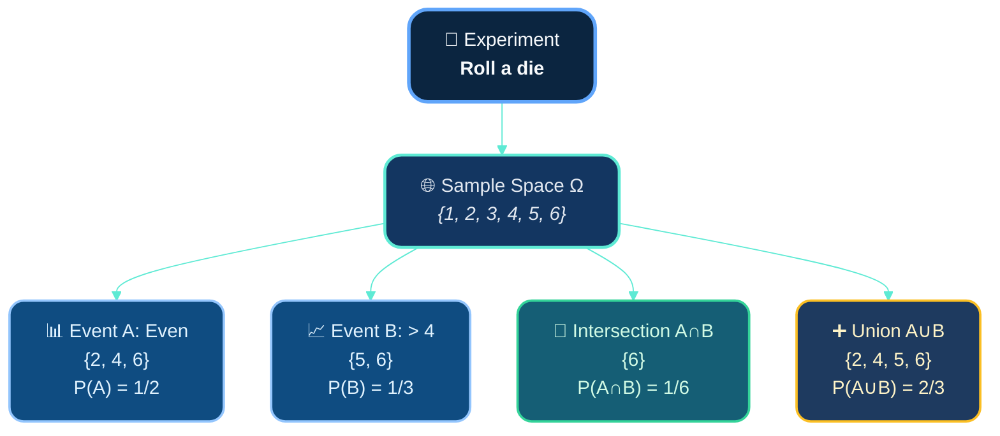
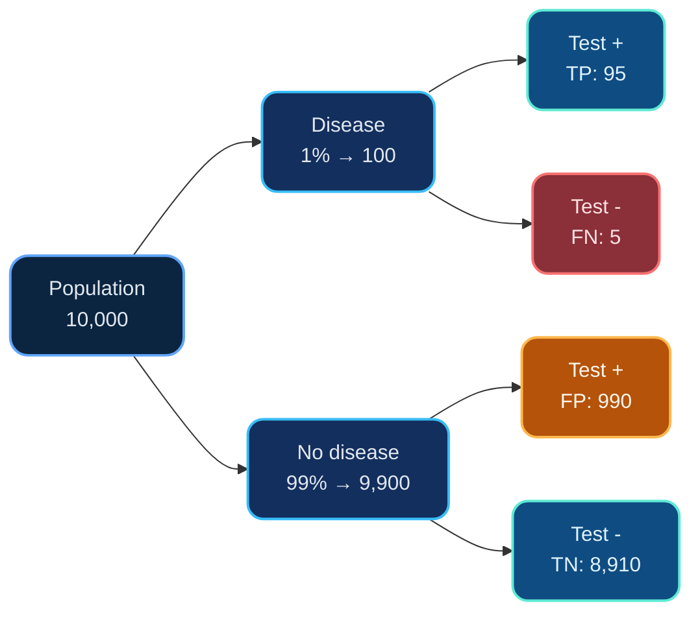
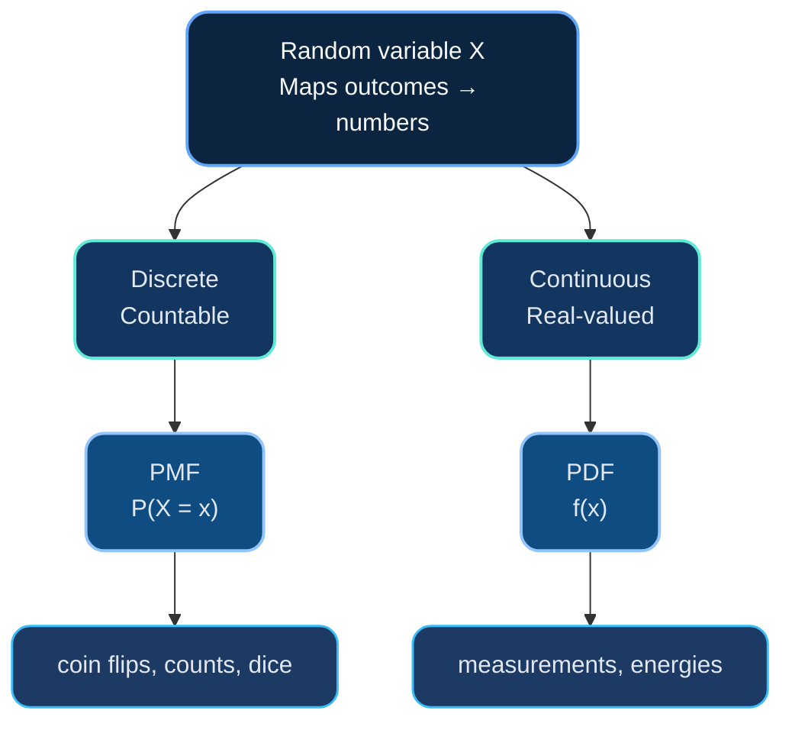
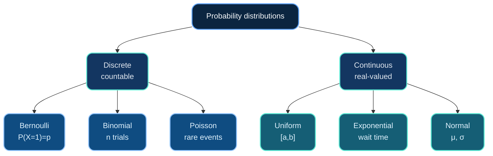
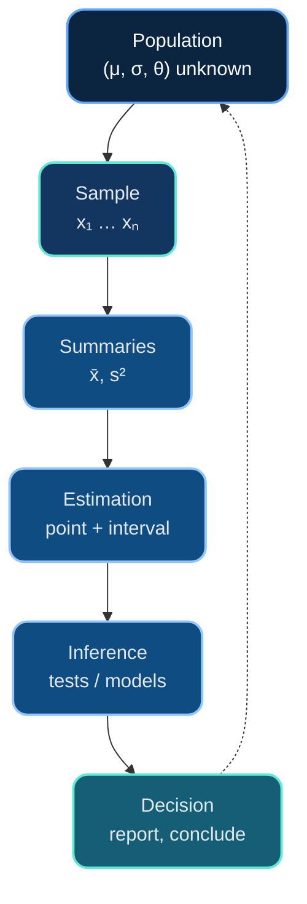
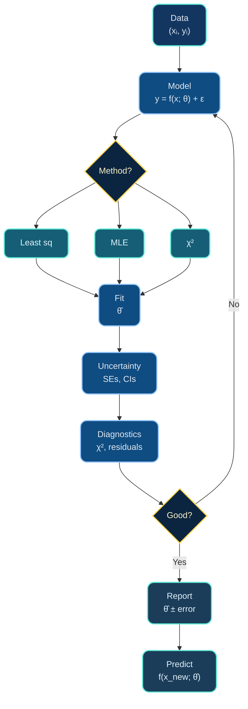

# Dr. Mindaugas Šarpis

# Lessons on **Data Analysis** from **CERN**

## Probability and Statistics

---
hideInToc: true
layout: quote
---

# In science, we never measure the *true* value—we collect **samples**, estimate **parameters**, and quantify **uncertainty**. Probability gives us the language; statistics gives us the tools.

---
hideInToc: true
---

# Motivation

- ## All measurements have **uncertainty**

- ## We need to **distinguish signal from noise**

- ## Models require **parameter estimation**

- ## Results must be **statistically significant**

- ## Predictions come with **confidence intervals**

#### This lecture builds the foundation for data fitting, hypothesis testing, and inference

---
layout: section
hideInToc: true
---

# Foundations of **Probability**

---
hideInToc: true
---

# What is Probability?

<div class="card card-info pad-tight">

## 🎲 **Definition**

**Probability** is a numerical measure of the likelihood of an event occurring, constrained to the interval $[0, 1]$:

- 🚫 $P(A) = 0$ means event $A$ is **impossible**
- ✅ $P(A) = 1$ means event $A$ is **certain**
- 🤔 $0 < P(A) < 1$ means event $A$ is **uncertain**

</div>

<div class="card card-primary pad-tight mt-md">

## 🎯 **Purpose**

📊 Quantify uncertainty • 🔮 Make predictions • 📈 Update beliefs with evidence • 🌍 Model random phenomena in nature

</div>

---
hideInToc: true
---

# Two Interpretations of Probability

<div class="grid-2 gap-md">

<div class="card card-primary pad-tight">

## 📊 **Frequentist**

**Probability = long-run relative frequency**

$$P(A) = \lim_{n \to \infty} \frac{n_A}{n}$$

where $n_A$ = occurrences of $A$ in $n$ trials

💡 **Example:** Flip coin 10,000 times → ~50% heads

**Used for:** Repeated experiments, physical processes

</div>

<div class="card card-secondary pad-tight">

## 🧠 **Bayesian**

**Probability = degree of belief**

Subjective confidence updated with evidence

💡 **Example:** "70% chance of rain tomorrow"

**Used for:** One-time events, updating knowledge

</div>

</div>

<div class="card card-accent pad-tight mt-md">

⚖️ **Both valid!** • ⚛️ Physics: mostly frequentist • 🤖 ML: increasingly Bayesian

</div>

---
hideInToc: true
---

# Basic Concepts

<div class="grid-2 mt-md gap-tight">

<div class="card card-primary pad-tight">

### 🔬 **Experiment**

<div class="note-text mt-xs">Repeatable process producing an outcome</div>

</div>

<div class="card card-secondary pad-tight">

### 🌐 **Sample Space (Ω)**

<div class="note-text mt-xs">All possible outcomes</div>

</div>

<div class="card card-accent pad-tight">

### 🎯 **Event**

<div class="note-text mt-xs">Subset of Ω satisfying a condition</div>

</div>

<div class="card card-info pad-tight">

### 📊 **Probability P(A)**

<div class="note-text mt-xs">Number in [0,1] quantifying likelihood</div>

</div>

</div>

---
hideInToc: true
---



<div class="card card-info pad-tight mermaid-note">

<div class="note-text">

**Key:** Sample space Ω contains all outcomes • Events are subsets • Intersection (∩) = both occur • Union (∪) = at least one occurs

</div>

</div>

---
hideInToc: true
---

# Visualizing Sample Space & Events

<div class="grid-2-large">

<div>

## 🎲 Sample Space <br>
## Ω = {1, 2, 3, 4, 5, 6}

<div class="dice-grid">

<div class="dice-box dice-box-primary">1</div>
<div class="dice-box dice-box-success">2</div>
<div class="dice-box dice-box-info">3</div>
<div class="dice-box dice-box-success">4</div>
<div class="dice-box dice-box-warning">5</div>
<div class="dice-box dice-box-accent">6</div>

</div>

<div class="caption-text">
All outcomes are equally likely: P(each) = 1/6
</div>

</div>

<div>

## 📍 **Events (Subsets of Ω)**

<div class="stack-tight">

<div class="card card-success pad-snug">
<div class="flex-between">
<strong class="text-subhead">Event A (even):</strong>
<span class="mono-strong">{2, 4, 6}</span>
</div>
</div>

<div class="card card-warning pad-snug">
<div class="flex-between">
<strong class="text-subhead">Event B (&gt; 4):</strong>
<span class="mono-strong">{5, 6}</span>
</div>
</div>

<div class="card card-info pad-snug">
<div class="flex-between">
<strong class="text-subhead">Event C (exact):</strong>
<span class="mono-strong">{3}</span>
</div>
</div>

<div class="card card-accent pad-snug">
<div class="flex-between">
<strong class="text-subhead">A ∩ B (even &amp; &gt; 4):</strong>
<span class="mono-strong">{6}</span>
</div>
</div>

</div>

</div>

</div>

---
hideInToc: true
---

# Axioms of Probability (Kolmogorov)

<div class="card card-info pad-tight mt-md">

## **Axiomatic Foundation**

Given a sample space $\Omega$ and a collection of events, a probability function $P$ assigns to each event $A$ a real number $P(A)$ satisfying three axioms:

</div>

<div class="grid-3 mt-md gap-md">

<div class="card card-primary pad-tight">

### ✅ **Axiom 1**

**Non-negativity**

$$P(A) \geq 0$$

for any event $A$

<div class="meta-caption mt-xs">
Probabilities cannot be negative
</div>

</div>

<div class="card card-secondary pad-tight">

### 🌍 **Axiom 2**

**Normalization**

$$P(\Omega) = 1$$

<div class="meta-caption mt-xs">
The entire sample space has probability 1
</div>

</div>

<div class="card card-accent pad-tight">

### ➕ **Axiom 3**

**Countable Additivity**

If $A$ and $B$ are mutually exclusive $(A \cap B = \emptyset)$:

$$P(A \cup B) = P(A) + P(B)$$

<div class="meta-caption mt-xs">
Disjoint events add
</div>

</div>

</div>

---
hideInToc: true
---

# Useful Rules from the Axioms

<div class="card card-info pad-tight mt-md">

## **Derived Properties**

From the three axioms, we can derive important rules that make probability calculations tractable.

</div>

<div class="grid-3 mt-md gap-md">

<div class="card card-warning pad-tight">

### 🔄 **Complement Rule**

$$P(A^c) = 1 - P(A)$$

where $A^c$ is the complement of $A$

<div class="meta-caption mt-xs">
Follows from $A \cup A^c = \Omega$ and $A \cap A^c = \emptyset$
</div>

</div>

<div class="card card-info pad-tight">

### ➕ **General Addition Rule**

For any events $A$ and $B$:

$$P(A \cup B) = P(A) + P(B) - P(A \cap B)$$

<div class="meta-caption mt-xs">
Avoids double-counting the intersection
</div>

</div>

<div class="card card-success pad-tight">

### ✖️ **Multiplication Rule**

For independent events:

$$P(A \cap B) = P(A) \times P(B)$$

<div class="meta-caption mt-xs">
Only if $A$ and $B$ are independent
</div>

</div>

</div>

---
hideInToc: true
---

# Conditional Probability

<div class="card card-info pad-tight">

## 🎯 **Definition**

$$P(A \mid B) = \frac{P(A \cap B)}{P(B)}, \quad P(B) > 0$$

Probability of $A$ given that $B$ has occurred • Restricts sample space to $B$

</div>

<div class="grid-2 mt-md gap-tight">

<div class="card card-primary pad-tight">

## 📐 **Properties**

$0 \leq P(A \mid B) \leq 1$ • $P(\Omega \mid B) = 1$ • Additive for mutually exclusive events

</div>

<div class="card card-accent pad-tight">

## 🎲 **Example: Two dice**

$A$: sum is 8, $P(A) = 5/36$ • $B$: first die shows 3, $P(B) = 1/6$

$A \cap B = \{(3,5)\}$ → $P(A \mid B) = \frac{1/36}{1/6} = \frac{1}{6}$

</div>

</div>

---
hideInToc: true
---

# Conditional Probability Visualization


<div class="card card-info pad-tight mermaid-note">

<div class="note-text">

**Flow:** Start with Ω → Given B occurs → Restrict to B → Find A∩B → Calculate ratio P(A∩B)/P(B)

</div>

</div>

---
hideInToc: true
---

# Independence

<div class="card card-info pad-tight">

## 🔀 **Definition**

Events $A$ and $B$ are **independent** if:

$$P(A \cap B) = P(A) \cdot P(B) \quad \text{or equivalently} \quad P(A \mid B) = P(A)$$

Knowing $B$ occurred provides **no information** about $A$

</div>

<div class="grid-2 mt-md gap-tight">

<div class="card card-primary pad-tight">

## ✅ **Independent**

- Flipping two coins
- Rolling two dice
- Drawing cards **with** replacement

</div>

<div class="card card-warning pad-tight">

## ❌ **Not Independent**

- Drawing cards **without** replacement
- Height and weight
- Temperature and ice cream sales

</div>

</div>

---
hideInToc: true
---

# Bayes' Theorem Components

<div style="display: flex; align-items: center; gap: 1.2rem; margin-top: 2rem; justify-content: center;">

<div class="card card-primary pad-tight" style="flex: 0 0 auto; min-width: 140px; text-align: center;">

### 📊 **Prior**
### $P(A)$

<div class="note-text mt-xs">Initial belief</div>

</div>

<div style="font-size: 2.5em; color: #5eead4; font-weight: 700;">×</div>

<div class="card card-secondary pad-tight" style="flex: 0 0 auto; min-width: 140px; text-align: center;">

### 📈 **Likelihood**
### $P(B|A)$

<div class="note-text mt-xs">Data probability</div>

</div>

<div style="font-size: 2.5em; color: #5eead4; font-weight: 700;">÷</div>

<div class="card card-info pad-tight" style="flex: 0 0 auto; min-width: 140px; text-align: center;">

### 📐 **Evidence**
### $P(B)$

<div class="note-text mt-xs">Normalization</div>

</div>

<div style="font-size: 2.5em; color: #5eead4; font-weight: 700;">=</div>

<div class="card card-accent pad-tight" style="flex: 0 0 auto; min-width: 140px; text-align: center;">

### 🎯 **Posterior**
### $P(A|B)$

<div class="note-text mt-xs">Updated belief</div>

</div>

</div>

<div class="card card-success pad-tight" style="margin-top: 1.5rem; text-align: center;">

**The Bayesian Update:** Multiply prior by likelihood, then normalize by evidence to get updated belief

</div>

---
hideInToc: true
---

# Bayes' Theorem

<div class="card card-info pad-tight">

## 🔄 **Formula**

$$P(A \mid B) = \frac{P(B \mid A) \cdot P(A)}{P(B)}$$

**Terminology:** Prior $P(A)$ • Likelihood $P(B \mid A)$ • Evidence $P(B)$ • Posterior $P(A \mid B)$

</div>

<div class="grid-2 mt-md gap-tight">

<div class="card card-primary pad-tight">

## 💡 **Key Idea**

Reverses conditionals: $P(B \mid A) \to P(A \mid B)$

Update beliefs with new data

</div>

<div class="card card-accent pad-tight">

## 🎯 **Applications**

Medical diagnosis • Spam filters • Parameter estimation • Hypothesis testing • ML

</div>

</div>

# Example: Medical Test

<div class="card card-warning pad-tight">

## 🏥 **Scenario**

Disease: 1% prevalence • Test: 95% sensitivity, 90% specificity

**Question:** Probability of disease if test is positive?

</div>

<div class="grid-2 mt-md gap-tight">

<div class="card card-primary pad-tight">

## 📊 **Calculation**

$$P(D \mid +) = \frac{P(+ \mid D) \cdot P(D)}{P(+)}$$

$P(+) = 0.95(0.01) + 0.10(0.99) = 0.1085$

$$P(D \mid +) = \frac{0.0095}{0.1085} \approx \textbf{8.8%}$$

</div>

<div class="card card-accent pad-tight">

## 💡 **Insight**

Only **8.8%** chance despite positive test!

**Why?** Rare disease → false positives (990) >> true positives (95)

</div>

</div>


---
hideInToc: true
---

# Visualizing the Medical Test



<div class="card card-info pad-tight mermaid-note">

<div class="note-text">

Total positive: 95 + 990 = **1,085** • **P(Disease | +) = 95/1,085 = 8.8%** • False positives dominate when disease is rare

</div>

</div>

---
layout: section
hideInToc: true
---

# Random Variables and Distributions

---
hideInToc: true
---

# What is a Random Variable?

<div class="card card-info pad-tight mt-md">

## **Formal Definition**

A **random variable** $X$ is a function that maps each outcome $\omega$ in the sample space $\Omega$ to a real number:

$$X: \Omega \rightarrow \mathbb{R}$$

</div>

<div class="grid-2 mt-md gap-md">

<div class="card card-primary pad-tight">

## **Purpose**

Random variables allow us to:
- Work with numbers instead of abstract outcomes
- Use calculus and algebra
- Define probability distributions
- Calculate expected values and variances

</div>

<div class="card card-secondary pad-tight">

## **Notation**

- **Random Variable:** $X, Y, Z$ (uppercase)
- **Specific Value:** $x, y, z$ (lowercase)
- **Probability:** $P(X = x)$ or $P(X \leq x)$

**Example:**
- Coin flip: $X = \begin{cases} 1 & \text{if heads} \\ 0 & \text{if tails} \end{cases}$

</div>

</div>

---
hideInToc: true
---

# Types of Random Variables



---
hideInToc: true
---

# Discrete Random Variables

<div class="card card-info pad-tight mt-md">

## **Definition**

A random variable $X$ is **discrete** if it can only take countable values (e.g., $0, 1, 2, \ldots$ or a finite set).

</div>

<div class="grid-2 mt-md gap-md">

<div class="card card-primary pad-tight">

## **Probability Mass Function (PMF)**

The PMF $p_X(x)$ or $P(X = x)$ gives the probability that $X$ takes the value $x$.

**Properties:**
1. $P(X = x) \geq 0$ for all $x$
2. $\sum_{\text{all } x} P(X = x) = 1$

**Example:** Number of heads in 3 coin flips

</div>

<div class="card card-accent pad-tight">

## **Example PMF**

$X$ = number of heads in 3 flips

| $x$ | $P(X = x)$ | Calculation |
|-----|------------|-------------|
| 0   | 1/8        | $\binom{3}{0}(0.5)^3$ |
| 1   | 3/8        | $\binom{3}{1}(0.5)^3$ |
| 2   | 3/8        | $\binom{3}{2}(0.5)^3$ |
| 3   | 1/8        | $\binom{3}{3}(0.5)^3$ |

$$\sum_{x=0}^{3} P(X = x) = \frac{1+3+3+1}{8} = 1 \quad \checkmark$$

</div>

</div>

---
hideInToc: true
---

# Continuous Random Variables

<div class="card card-info pad-tight mt-md">

## **Definition**

A random variable $X$ is **continuous** if it can take any value in an interval or union of intervals (uncountably many values).

**Key Insight:** For continuous $X$, $P(X = x) = 0$ for any specific $x$. Only intervals have non-zero probability.

</div>

<div class="grid-2 mt-md gap-md">

<div class="card card-primary pad-tight">

## **Probability Density Function (PDF)**

The PDF $f(x)$ is **not** a probability, but a density. Probabilities are computed as:

$$P(a \leq X \leq b) = \int_a^b f(x)\,dx$$

**Properties:**
1. $f(x) \geq 0$ for all $x$
2. $\int_{-\infty}^{\infty} f(x)\,dx = 1$
3. $P(X = c) = 0$ for any specific $c$

</div>

<div class="card card-accent pad-tight">

## **Example: Uniform on [0,1]**

$$f(x) = \begin{cases} 1 & \text{if } 0 \leq x \leq 1 \\ 0 & \text{otherwise} \end{cases}$$

**Verification:**

$$\int_0^1 1 \, dx = 1 \quad \checkmark$$

**Probability calculation:**

$$P(0.2 \leq X \leq 0.5) = \int_{0.2}^{0.5} 1 \, dx = 0.3$$

</div>

</div>

---
hideInToc: true
---

# Cumulative Distribution Function (CDF)

<div class="card card-info pad-tight mt-md">

## **Definition**

For any random variable $X$ (discrete or continuous), the CDF is:

$$F(x) = P(X \leq x)$$

The CDF gives the probability that $X$ takes a value **at most** $x$.

</div>

<div class="grid-2 mt-md gap-md">

<div class="card card-primary pad-tight">

## **Properties**

1. **Non-decreasing:** If $x_1 < x_2$, then $F(x_1) \leq F(x_2)$
2. **Limits:** $\lim_{x \to -\infty} F(x) = 0$ and $\lim_{x \to \infty} F(x) = 1$
3. **Right-continuous:** $\lim_{h \to 0^+} F(x+h) = F(x)$
4. **For continuous $X$:** $F'(x) = f(x)$ (PDF is derivative of CDF)

</div>

<div class="card card-accent pad-tight">

## **Why CDFs are useful**

- Works for **both** discrete and continuous RVs
- Probability of intervals:

$$P(a < X \leq b) = F(b) - F(a)$$

- Quantiles: Find $x$ such that $F(x) = p$
- Easy to visualize cumulative behavior
- Foundation for statistical inference

</div>

</div>

---
layout: section
hideInToc: true
---

# Descriptive Statistics

---
hideInToc: true
---

# Measures of Central Tendency

<div style="display: grid; grid-template-columns: 1fr 1fr; gap: 2rem; margin-top: 2rem;">

<div>

## **Mean (Average)**
$$\mu = \frac{\sum x_i}{n}$$
### Most common measure
### Sensitive to outliers

<br>

## **Median**
### Middle value when sorted
### Robust to outliers

</div>

<div>

## **Mode**
### Most frequent value
### Can have multiple modes

<br>

## **Example**
### Data: [1, 2, 2, 3, 10]
- Mean = 3.6
- Median = 2
- Mode = 2

### The outlier (10) pulls the mean up

</div>

</div>

---
hideInToc: true
---

# Measures of Spread

<div class="grid-3 mt-md gap-tight">

<div class="card card-warning pad-tight">

### 📏 **Range**

$$\text{Range} = \max - \min$$

<div class="meta-caption">Simple but not robust</div>

</div>

<div class="card card-accent pad-tight">

### 📊 **Variance**

$$\sigma^2 = \frac{\sum(x_i - \mu)^2}{n}$$

<div class="meta-caption">Average squared deviation</div>

</div>

<div class="card card-info pad-tight">

### 📈 **Standard Deviation**

$$\sigma = \sqrt{\text{variance}}$$

<div class="meta-caption">Same units as data</div>

</div>

</div>

---
layout: two-cols
hideInToc: true
---

# Why Variance?

## **Why square the deviations?**

- ### Makes all deviations positive
- ### Penalizes large deviations more
- ### Mathematical convenience

<br>

## **Sample vs Population**

### Population variance: divide by n
### Sample variance: divide by (n−1)
### (Bessel's correction for unbiased estimate)

::right::

<br>
<br>

## **Example**

### Data: [2, 4, 6, 8]

### Mean μ = 5

### Deviations: [−3, −1, 1, 3]

### Squared: [9, 1, 1, 9]

### Variance σ² = 20/4 = 5

### Std dev σ = √5 ≈ 2.24

---
hideInToc: true
---

# Expectation and Variance

<div class="card card-info pad-tight mt-md">

## **Expected Value (Mean)**

The **expectation** or **expected value** $E[X]$ (also written $\mu$) is the "average" value of $X$ weighted by probabilities:

**Discrete:**

$$E[X] = \sum_{\text{all } x} x \cdot P(X = x)$$

**Continuous:**

$$E[X] = \int_{-\infty}^{\infty} x \cdot f(x)\,dx$$

</div>

<div class="grid-2 mt-md gap-md">

<div class="card card-primary pad-tight">

## **Variance**

Measures spread around the mean:

$$\text{Var}(X) = E[(X - \mu)^2]$$

**Computational formula:**

$$\text{Var}(X) = E[X^2] - (E[X])^2$$

**Standard deviation:**

$$\sigma = \sqrt{\text{Var}(X)}$$

</div>

<div class="card card-accent pad-tight">

## **Key Properties**

**Linearity of Expectation:**
- $E[aX + b] = aE[X] + b$
- $E[X + Y] = E[X] + E[Y]$ (always!)

**Variance Properties:**
- $\text{Var}(aX + b) = a^2\text{Var}(X)$
- $\text{Var}(X + Y) = \text{Var}(X) + \text{Var}(Y)$

  (only if $X$ and $Y$ are independent)

</div>

</div>

---
layout: section
hideInToc: true
---

# Common Probability Distributions

---
hideInToc: true
---

# Distribution Landscape



---
hideInToc: true
---

# Discrete Distributions

<div class="lead-block">

## **Bernoulli**
Single trial: success/failure • Parameter: $p = P(\text{success})$ • Ex: coin flip

<br>

## **Binomial**
$n$ independent trials • $X$ = successes • $P(X = k) = C(n,k) p^k (1-p)^{n-k}$ • Ex: heads in 10 flips

</div>

---
layout: two-cols
hideInToc: true
---

# Poisson Distribution

## **When to use**
- Counting rare events
- Fixed time/space interval
- Events occur independently

<br>

## **PMF**
$$P(X = k) = \frac{\lambda^k e^{-\lambda}}{k!}$$

### Parameter $\lambda$ = average rate

::right::

<br>

## **Properties**
- ### $E[X] = \lambda$
- ### $\text{Var}(X) = \lambda$

<br>

## **Examples**
- ### Radioactive decay counts
- ### Photon arrivals at a detector
- ### Network packet arrivals
- ### Mutations in DNA sequence

<br>

#### "How many events in a fixed interval?"

---
hideInToc: true
---

# Continuous Distributions

<div class="lead-block">

## **Uniform Distribution**
All values in [a, b] equally likely • $f(x) = \frac{1}{b-a}$ • $E[X] = \frac{a+b}{2}$, $\text{Var}(X) = \frac{(b-a)^2}{12}$

<br>

## **Exponential Distribution**
Time to first event • $f(x) = \lambda e^{-\lambda x}$ • $E[X] = \frac{1}{\lambda}$, $\text{Var}(X) = \frac{1}{\lambda^2}$ • Memoryless: $P(X > s+t \mid X > s) = P(X > t)$

</div>

---
layout: fact
hideInToc: true
---

# The **Normal (Gaussian)** Distribution

---
hideInToc: true
---

# Why the Normal Distribution is Special

<div class="grid-3" style="gap: 0.8rem; margin-top: 1.5rem;">

<div class="card card-primary pad-compact">
<div class="emoji-xl">🏆</div>
<div class="meta-strong">Most Important</div>
</div>

<div class="card card-secondary pad-compact">
<div class="emoji-xl">🌿</div>
<div class="meta-strong">Arises Naturally</div>
</div>

<div class="card card-info pad-compact">
<div class="emoji-xl">🎯</div>
<div class="meta-strong">CLT Foundation</div>
</div>

<div class="card card-success pad-compact">
<div class="emoji-xl">🔬</div>
<div class="meta-strong">Measurement Errors</div>
</div>

<div class="card card-warning pad-compact">
<div class="emoji-xl">🧪</div>
<div class="meta-strong">Statistical Tests</div>
</div>

<div class="card card-accent pad-compact">
<div class="emoji-xl">⚙️</div>
<div class="meta-strong">Two Parameters: μ, σ²</div>
</div>

</div>

<div style="text-align: center; font-size: 1.1em; font-weight: bold; margin-top: 1.5rem;">

🌟 **"The normal distribution is the pattern of patterns"**

</div>

---
hideInToc: true
---

# Normal Distribution

<div class="card card-info pad-tight mt-md">

## **Probability Density Function**

A random variable $X$ follows a **normal (Gaussian) distribution** with parameters $\mu$ (mean) and $\sigma^2$ (variance), written $X \sim N(\mu, \sigma^2)$, if:

$$f(x) = \frac{1}{\sigma\sqrt{2\pi}} \exp\left(-\frac{(x-\mu)^2}{2\sigma^2}\right), \quad -\infty < x < \infty$$

</div>

<div class="grid-2 mt-md gap-md">

<div class="card card-primary pad-tight">

## **Key Properties**

1. **Symmetric** about $\mu$
2. **Bell-shaped** (unimodal)
3. **Mean = Median = Mode = $\mu$**
4. **Inflection points** at $x = \mu \pm \sigma$
5. **Area under curve = 1**
6. **Asymptotic**: tails approach (but never reach) zero

</div>

<div class="card card-accent pad-tight">

## **Standard Normal**

The **standard normal** $Z \sim N(0, 1)$ has:

$$\phi(z) = \frac{1}{\sqrt{2\pi}} \exp\left(-\frac{z^2}{2}\right)$$

**Z-transformation (standardization):**

$$Z = \frac{X - \mu}{\sigma}$$

If $X \sim N(\mu, \sigma^2)$, then $Z \sim N(0, 1)$

This allows us to use standard tables/software for any normal distribution.

</div>

</div>

---
hideInToc: true
---

# The 68-95-99.7 Rule

<div style="text-align: center; font-size: 1.1em; font-weight: 600; margin: 1rem 0 0.8rem 0;">
For $X \sim N(\mu, \sigma^2)$:
</div>

<div class="grid-3 gap-tight">

<div class="card card-success pad-balanced text-center">
<div class="text-xl-strong">📊 68%</div>
<div class="note-text mt-xs">$\mu \pm \sigma$</div>
</div>

<div class="card card-info pad-balanced text-center">
<div class="text-xl-strong">📈 95%</div>
<div class="note-text mt-xs">$\mu \pm 2\sigma$</div>
</div>

<div class="card card-primary pad-balanced text-center">
<div class="text-xl-strong">🎯 99.7%</div>
<div class="note-text mt-xs">$\mu \pm 3\sigma$</div>
</div>

</div>

<div class="card card-warning pad-balanced" style="margin-top: 1.2rem;">

### 💡 **Practical Implication**

<div class="note-text mt-xs">

$3\sigma$ measurement = extremely rare (0.3%)

⚛️ **Physics**: $5\sigma$ = gold standard (1 in 3.5M)

</div>

</div>

---
layout: section
hideInToc: true
---

# Central Limit Theorem

---
layout: fact
hideInToc: true
---

# **Central Limit Theorem (CLT)**

### The cornerstone of statistical inference

---
hideInToc: true
---

# Statement of the CLT

<div class="card card-info pad-tight mt-md">

## **Theorem Statement**

Let $X_1, X_2, \ldots, X_n$ be independent and identically distributed (i.i.d.) random variables with:
- Mean: $E[X_i] = \mu$
- Variance: $\text{Var}(X_i) = \sigma^2 < \infty$

Define the sample mean:

$$\bar{X} = \frac{X_1 + X_2 + \cdots + X_n}{n} = \frac{1}{n}\sum_{i=1}^{n} X_i$$

Then as $n \to \infty$:

$$\bar{X} \sim N\left(\mu, \frac{\sigma^2}{n}\right)$$

Or equivalently, the standardized sum converges in distribution to $N(0,1)$:

$$\frac{\bar{X} - \mu}{\sigma/\sqrt{n}} = \frac{\sum X_i - n\mu}{\sigma\sqrt{n}} \xrightarrow{d} N(0, 1)$$

</div>

<div class="card card-primary pad-tight mt-md">

## **Key Insights**

- Works for **any** underlying distribution (not just normal!)
- Larger $n$ → better approximation
- Standard error: $SE = \sigma/\sqrt{n}$ decreases with $\sqrt{n}$
- Rule of thumb: $n \geq 30$ often sufficient for good approximation

</div>

---
layout: two-cols
hideInToc: true
---

# Why CLT Matters

## **Measurement errors**
### Many small effects
### Result: normal errors

<br>

## **Sampling distributions**
### Normal approximation
### Even non-normal population

<br>

## **Confidence intervals**
### Based on CLT

::right::

<br>

## **Example**

### Roll die $n$ times, average

- ### $n=1$: uniform
- ### $n=2$: peaked
- ### $n=10$: normal
- ### $n=100$: very normal

<br>

#### CLT "magic": any → normal

---
hideInToc: true
---

# Standard Error

<div class="grid-3 mt-md gap-tight">

<div class="card card-primary pad-balanced">

### 📐 **Definition**

$$SE = \frac{\sigma}{\sqrt{n}}$$

<div class="meta-caption">Std dev of sample mean</div>

</div>

<div class="card card-warning pad-balanced">

### 🔍 **Interpretation**

<div class="text-tight">

📊 Uncertainty in $\mu$

📉 Decreases as $\sqrt{n}$

🔢 Halve error: $4\times$ data

</div>

</div>

<div class="card card-success pad-balanced">

### 📝 **Usage**

<div class="text-tight">

**mean $\pm$ SE**

or **mean $\pm 2 \times$ SE**

for ~95% confidence

</div>

</div>

</div>

---
layout: section
hideInToc: true
---

# Statistical Inference

---
hideInToc: true
---

# The Statistical Inference Process



---
hideInToc: true
---

# Estimation

<div class="mt-xxl">

## **Point Estimation**
### Single "best guess" for parameter
- Sample mean estimates $\mu$
- Sample variance estimates $\sigma^2$

<br>

## **Interval Estimation**
### Range of plausible values
### **Confidence Interval**: contains true parameter with specified probability

<br>

## **Desirable properties**
- **Unbiased**: E[estimator] = true parameter
- **Consistent**: converges as $n \to \infty$
- **Efficient**: smallest variance

</div>

---
layout: two-cols
hideInToc: true
---

# Confidence Intervals

## **For a mean (known σ)**
$$CI = \bar{x} \pm z^* \frac{\sigma}{\sqrt{n}}$$

### $z^* = 1.96$ for 95% confidence

<br>

## **Interpretation (careful!)**
- ### NOT: "95% chance $\mu$ is in this interval"
- ### CORRECT: "95% of such intervals contain $\mu$"

::right::

<br>

## **Example**

### Measure particle mass 100 times
- $\bar{x} = 125.3$ GeV
- $\sigma = 2.1$ GeV (known)
- $n = 100$

### $SE = 2.1/\sqrt{100} = 0.21$

### 95% CI $= 125.3 \pm 1.96(0.21)$
### $= 125.3 \pm 0.41$
### $= [124.89, 125.71]$ GeV

---
hideInToc: true
---

# Maximum Likelihood Estimation (MLE)

<div class="lead-block">

## **Idea**
Choose $\theta$ maximizing data probability

<br>

## **Likelihood Function**
$L(\theta \mid \text{data})$ = P(data | $\theta$)

Independent observations: $L(\theta) = \prod f(x_i; \theta)$

<br>

## **MLE**
$\hat{\theta}$ maximizes $L(\theta)$ • Practice: maximize $\log L(\theta)$

</div>

---
layout: two-cols
hideInToc: true
---

# MLE Example: Normal Mean

## **Setup**
- Data: $x_1, \ldots, x_n$
- Model: $X \sim N(\mu, \sigma^2)$ with known $\sigma$
- Find $\hat{\mu}$ that maximizes likelihood

## **Result**
### $\hat{\mu} = \bar{x}$ (sample mean)

### Confirms our intuition!

::right::

<br>

## **Why MLE?**

- ### Principled approach
- ### Works for any distribution
- ### Asymptotically optimal
- ### Foundation for fitting

---
layout: section
hideInToc: true
---

# Connecting to Data Fitting

---
hideInToc: true
---

# Data Fitting Workflow



---
hideInToc: true
---

# From Probability to Fitting

<div class="mt-xxl">

## **Data fitting problem**
- ### Measurements: $(x_i, y_i)$
- ### Model: $y = f(x; \theta) + \text{error}$
- ### Goal: find best $\theta$

<br>

## **Statistical foundation**
- ### Random errors (often normal)
- ### MLE or least squares
- ### Quantify uncertainty (SEs)
- ### Test goodness of fit

<br>

### **Next**: Lines, curves, models

</div>

---
hideInToc: true
---

# Least Squares = MLE (for normal errors)

<div class="lead-block">

**If errors are independent and normally distributed:**

$$y_i = f(x_i; \theta) + \varepsilon_i, \quad \varepsilon_i \sim N(0, \sigma^2)$$

**Then minimizing sum of squared errors:**
$$S(\theta) = \sum \left(y_i - f(x_i; \theta)\right)^2$$

**Is equivalent to maximizing the likelihood**

This is why least squares fitting is so ubiquitous in science!

</div>

---
hideInToc: true
---

# Chi-Squared (χ²) Statistic

<div class="lead-block">

## **Definition**
$$\chi^2 = \sum \frac{(\text{observed} - \text{expected})^2}{\text{variance}}$$

## **For fitting with uncertainties $\sigma_i$:**
$$\chi^2 = \sum \left[\frac{y_i - f(x_i; \theta)}{\sigma_i}\right]^2$$

<br>

## **Interpretation**
Measures "badness of fit" • $\chi^2 \approx (n - p)$ for good fit • $\chi^2/(n-p) \approx 1$ ideal • $\chi^2/(n-p) \gg 1$ bad fit

</div>

---
hideInToc: true
---

# Hypothesis Testing (Preview)

<div class="mt-xxl">

## **Null hypothesis ($H_0$)**
### Statement to test (often "no effect")

<br>

## **Alternative ($H_1$)**
### What we suspect

<br>

## **Test statistic**
### Measures compatibility with $H_0$

<br>

## **p-value**
### P(data as extreme | $H_0$ true)
### Small (< 0.05) $\to$ reject $H_0$

</div>

---
hideInToc: true
---

# Common Mistakes and Pitfalls

<div style="margin-top: 1.5rem;">

## **Confusing probability and statistics**
- Probability: model → data
- Statistics: data → model

<br>

## **Misinterpreting CIs**
- Not probability of parameter
- Long-run method behavior

<br>

## **p-hacking**
- Testing until "significant"
- Pre-register, correct multiple tests

<br>

## **Extrapolation**
- Models valid only in calibration range

</div>

---
layout: section
hideInToc: true
---

# Practical Examples

---
hideInToc: true
---

# Example 1: Counting Experiment

<div class="lead-block-lg">

## **Scenario**: Measure radioactive decay events

- ### Expect background: $\lambda_{\text{bg}} = 10$ events/minute
- ### Observe: 23 events in 1 minute
- ### Is there a signal above background?

<br>

## **Statistical approach**

- ### Model: $\text{Poisson}(\lambda_{\text{bg}})$ for background only
- ### Under $H_0$: $P(X \geq 23)$ when $\lambda = 10$
- ### Using Poisson tables or software: $p \approx 0.002$
- ### Strong evidence for signal! (> $3\sigma$)

</div>

---
layout: two-cols
hideInToc: true
---

# Example 2: Measuring a Constant

## **Scenario**
### Measure speed of light (c)

### 10 measurements (in 10⁸ m/s):
```
2.95, 3.01, 2.98, 3.03, 2.97,
3.00, 2.99, 3.02, 2.96, 3.01
```

::right::

<br>

## **Analysis**

### Mean: $\bar{x} = 2.992$

### Std dev: $s = 0.025$

### $SE = 0.025/\sqrt{10} = 0.008$

<br>

### 95% CI:
### $2.992 \pm 2.26(0.008)$
### $= 2.992 \pm 0.018$
### $= [2.974, 3.010]$

<br>

#### (True value: 2.998) ✓

---
hideInToc: true
---

# Example 3: Comparing Two Samples

<div class="lead-block-lg">

## **Scenario**: New detector vs old detector

- ### Old: mean $= 100$, $\sigma = 15$, $n = 50$
- ### New: mean $= 108$, $\sigma = 12$, $n = 60$

## **Question**: Is the difference significant?

<br>

## **Approach** (two-sample test)

### Difference in means: $108 - 100 = 8$

### SE of difference: $\sqrt{15^2/50 + 12^2/60} \approx 2.58$

### Test statistic: $z = 8/2.58 \approx 3.1$

### p-value $< 0.002 \to$ **significant improvement!**

</div>

---
hideInToc: true
---

# Visualizing Distributions

<div style="margin-top: 2rem; font-size: 1.15em;">

## **Histograms**
- Empirical distribution
- Check normality, outliers

<br>

## **Q-Q plots**
- Data vs theoretical quantiles
- Straight line = good fit

<br>

## **Box plots**
- Median, quartiles, outliers
- Easy group comparison

<br>

### **Always visualize before fitting!**

</div>

---
layout: section
hideInToc: true
---

# Summary and Takeaways

---
hideInToc: true
---

# Key Concepts

<div style="display: grid; grid-template-columns: 1fr 1fr; gap: 2rem; margin-top: 1.5rem;">

<div>

## **Probability**
- Sample space, events
- Conditional probability
- Independence
- Bayes' theorem

<br>

## **Random Variables**
- Discrete vs continuous
- PMF, PDF, CDF
- Expectation and variance

</div>

<div>

## **Distributions**
- Binomial, Poisson
- Normal (Gaussian)
- Central Limit Theorem

<br>

## **Inference**
- Point and interval estimation
- Confidence intervals
- Maximum likelihood
- Hypothesis testing

</div>

</div>

---
hideInToc: true
---

# Building Towards Data Fitting

<div style="margin-top: 2rem; font-size: 1.25em;">

## **Foundation complete:**

- ### Model data as random variables
- ### Estimate parameters
- ### Quantify uncertainty (SE, CIs)
- ### Judge fit quality ($\chi^2$)
- ### Test hypotheses

<br>

### **Next**: Fit lines, curves to experimental data

</div>

---
hideInToc: true
---

# Practical Advice

<div class="grid-3 mt-lg">

<div class="card card-primary pad-tight">

## 📊 **Visualize**

<div class="card-content text-base">

Visualize data first

</div>

</div>

<div class="card card-secondary pad-tight">

## ✓ **Check**

<div class="card-content text-base">

Verify assumptions

</div>

</div>

<div class="card card-info pad-tight">

## 📏 **Report**

<div class="card-content text-base">

Include uncertainties

</div>

</div>

<div class="card card-success pad-tight">

## 🎯 **Understand**

<div class="card-content text-base">

Know p-values

</div>

</div>

<div class="card card-warning pad-tight">

## ⚠️ **Caution**

<div class="card-content text-base">

Small sample limits

</div>

</div>

<div class="card card-accent pad-tight">

## 🔬 **Simulate**

<div class="card-content text-base">

When unclear

</div>

</div>

<div class="card card-primary pad-tight" style="grid-column: 1 / -1;">

## 📝 **Document for Reproducibility**

</div>

</div>
