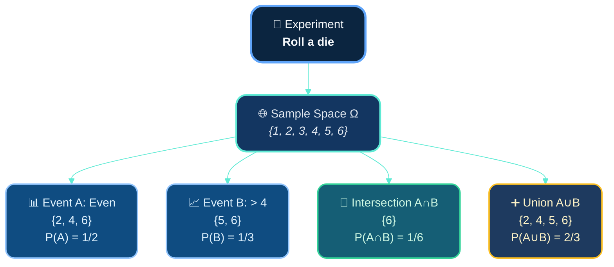
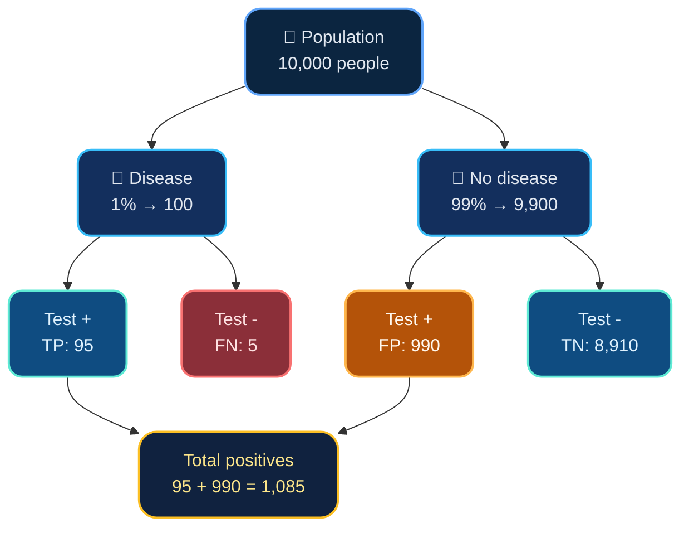
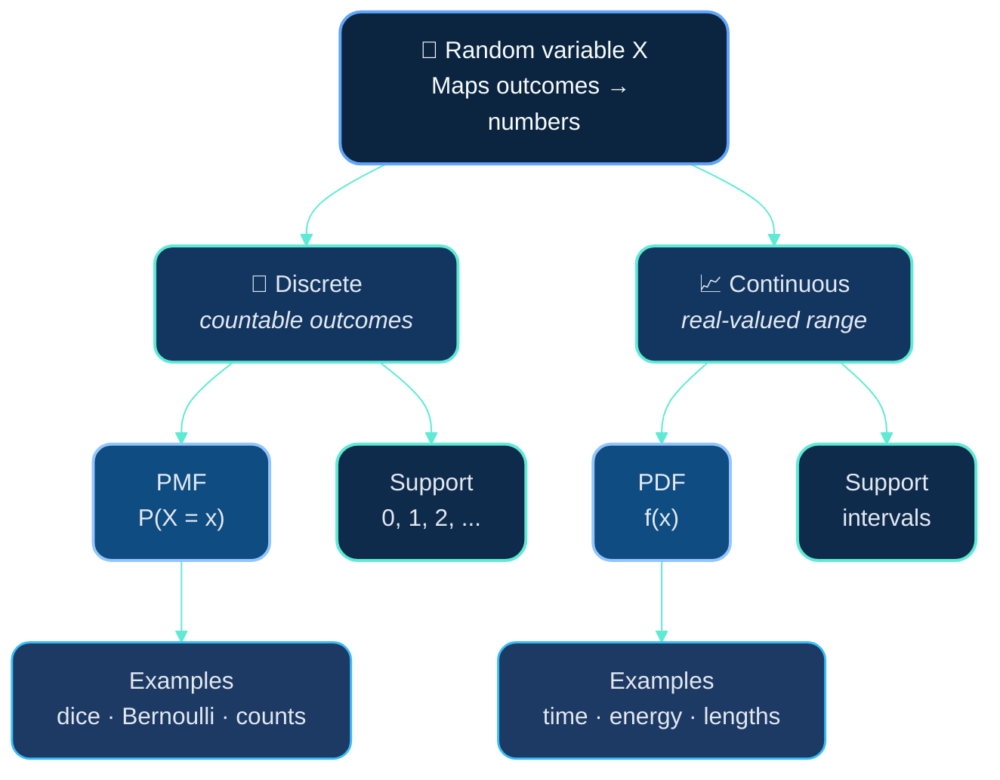
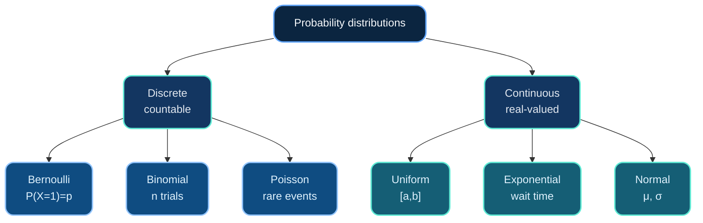
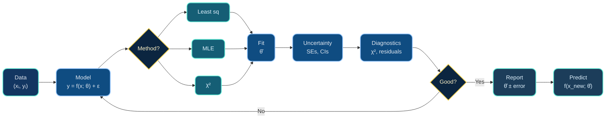

# Dr. Mindaugas Šarpis

# Lessons on **Data Analysis** from **CERN**

## Probability and Statistics

---
hideInToc: true
layout: quote
---

# In science, we never measure the *true* value—we collect **samples**, estimate **parameters**, and quantify **uncertainty**. Probability gives us the language; statistics gives us the tools.

---
hideInToc: true
---

# Motivation

- ## All measurements have **uncertainty**

- ## We need to **distinguish signal from noise**

- ## Models require **parameter estimation**

- ## Results must be **statistically significant**

- ## Predictions come with **confidence intervals**

#### This lecture builds the foundation for data fitting, hypothesis testing, and inference

---
layout: section
hideInToc: true
---

# Foundations of **Probability**

---
hideInToc: true
---

# What is Probability?

## 🎲 **Definition**

**Probability** is a numerical measure of the likelihood of an event occurring, constrained to the interval $[0, 1]$:

- 🚫 $P(A) = 0$ means event $A$ is **impossible**
- ✅ $P(A) = 1$ means event $A$ is **certain**
- 🤔 $0 < P(A) < 1$ means event $A$ is **uncertain**

## 🎯 **Purpose**

📊 Quantify uncertainty • 🔮 Make predictions • 📈 Update beliefs with evidence • 🌍 Model random phenomena in nature

---
hideInToc: true
---

# Two Interpretations of Probability

## 📊 **Frequentist**

**Probability = long-run relative frequency**

$$P(A) = \lim_{n \to \infty} \frac{n_A}{n}$$

where $n_A$ = occurrences of $A$ in $n$ trials

💡 **Example:** Flip coin 10,000 times → ~50% heads

**Used for:** Repeated experiments, physical processes

## 🧠 **Bayesian**

**Probability = degree of belief**

Subjective confidence updated with evidence

💡 **Example:** "70% chance of rain tomorrow"

**Used for:** One-time events, updating knowledge

⚖️ **Both valid!** • ⚛️ Physics: mostly frequentist • 🤖 ML: increasingly Bayesian

---
hideInToc: true
---

# Basic Concepts

### 🔬 **Experiment**

Repeatable process producing an outcome

### 🌐 **Sample Space (Ω)**

All possible outcomes

### 🎯 **Event**

Subset of Ω satisfying a condition

### 📊 **Probability P(A)**

Number in [0,1] quantifying likelihood

---
hideInToc: true
---

**Key:** Sample space Ω contains all outcomes • Events are subsets • Intersection (∩) = both occur • Union (∪) = at least one occurs

---
hideInToc: true
---

# Visualizing Sample Space & Events

## 🎲 Sample Space  
## Ω = {1, 2, 3, 4, 5, 6}

1

2

3

4

5

6

All outcomes are equally likely: P(each) = 1/6

## 📍 **Events (Subsets of Ω)**

<strong class="text-subhead">Event A (even):</strong>
{2, 4, 6}

<strong class="text-subhead">Event B (&gt; 4):</strong>
{5, 6}

<strong class="text-subhead">Event C (exact):</strong>
{3}

<strong class="text-subhead">A ∩ B (even &amp; &gt; 4):</strong>
{6}

---
hideInToc: true
---

# Axioms of Probability (Kolmogorov)

## **Axiomatic Foundation**

Given a sample space $\Omega$ and a collection of events, a probability function $P$ assigns to each event $A$ a real number $P(A)$ satisfying three axioms:

### ✅ **Axiom 1**

**Non-negativity**

$$P(A) \geq 0$$

for any event $A$

Probabilities cannot be negative

### 🌍 **Axiom 2**

**Normalization**

$$P(\Omega) = 1$$

The entire sample space has probability 1

### ➕ **Axiom 3**

**Countable Additivity**

If $A$ and $B$ are mutually exclusive $(A \cap B = \emptyset)$:

$$P(A \cup B) = P(A) + P(B)$$

Disjoint events add

---
hideInToc: true
---

# Useful Rules from the Axioms

## **Derived Properties**

From the three axioms, we can derive important rules that make probability calculations tractable.

### 🔄 **Complement Rule**

$$P(A^c) = 1 - P(A)$$

where $A^c$ is the complement of $A$

Follows from $A \cup A^c = \Omega$ and $A \cap A^c = \emptyset$

### ➕ **General Addition Rule**

For any events $A$ and $B$:

$$P(A \cup B) = P(A) + P(B) - P(A \cap B)$$

Avoids double-counting the intersection

### ✖️ **Multiplication Rule**

For independent events:

$$P(A \cap B) = P(A) \times P(B)$$

Only if $A$ and $B$ are independent

---
hideInToc: true
---

# Conditional Probability

## 🎯 **Definition**

$$P(A \mid B) = \frac{P(A \cap B)}{P(B)}, \quad P(B) > 0$$

Probability of $A$ given that $B$ has occurred • Restricts sample space to $B$

## 📐 **Properties**

$0 \leq P(A \mid B) \leq 1$ • $P(\Omega \mid B) = 1$ • Additive for mutually exclusive events

## 🎲 **Example: Two dice**

$A$: sum is 8, $P(A) = 5/36$ • $B$: first die shows 3, $P(B) = 1/6$

$A \cap B = \{(3,5)\}$ → $P(A \mid B) = \frac{1/36}{1/6} = \frac{1}{6}$

---
hideInToc: true
---

# Conditional Probability Visualization

**Flow:** Start with Ω → Given B occurs → Restrict to B → Find A∩B → Calculate ratio P(A∩B)/P(B)

---
hideInToc: true
---

# Independence

## 🔀 **Definition**

Events $A$ and $B$ are **independent** if:

$$P(A \cap B) = P(A) \cdot P(B) \quad \text{or equivalently} \quad P(A \mid B) = P(A)$$

Knowing $B$ occurred provides **no information** about $A$

## ✅ **Independent**

- Flipping two coins
- Rolling two dice
- Drawing cards **with** replacement

## ❌ **Not Independent**

- Drawing cards **without** replacement
- Height and weight
- Temperature and ice cream sales

---
hideInToc: true
---

# Bayes' Theorem Components

### 📊 **Prior**
### $P(A)$

Initial belief

×

### 📈 **Likelihood**
### $P(B|A)$

Data probability

÷

### 📐 **Evidence**
### $P(B)$

Normalization

=

### 🎯 **Posterior**
### $P(A|B)$

Updated belief

**The Bayesian Update:** Multiply prior by likelihood, then normalize by evidence to get updated belief

---
hideInToc: true
---

# Bayes' Theorem

## 🔄 **Formula**

$$P(A \mid B) = \frac{P(B \mid A) \cdot P(A)}{P(B)}$$

**Terminology:** Prior $P(A)$ • Likelihood $P(B \mid A)$ • Evidence $P(B)$ • Posterior $P(A \mid B)$

## 💡 **Key Idea**

Reverses conditionals: $P(B \mid A) \to P(A \mid B)$

Update beliefs with new data

## 🎯 **Applications**

Medical diagnosis • Spam filters • Parameter estimation • Hypothesis testing • ML

---
hideInToc: true
---

# Example: Medical Test

## 🏥 **Scenario**

Disease: 1% prevalence • Test: 95% sensitivity, 90% specificity

**Question:** Probability of disease if test is positive?

## 📊 **Calculation**

$$P(D \mid +) = \frac{P(+ \mid D) \cdot P(D)}{P(+)}$$

$P(+) = 0.95(0.01) + 0.10(0.99) = 0.1085$

$$P(D \mid +) = \frac{0.0095}{0.1085} \approx \textbf{8.8%}$$

## 💡 **Insight**

Only **8.8%** chance despite positive test!

**Why?** Rare disease → false positives (990) >> true positives (95)

---
hideInToc: true
---

# Visualizing the Medical Test

Total positive: 95 + 990 = **1,085** • **P(Disease | +) = 95/1,085 = 8.8%** • False positives dominate when disease is rare

---
layout: section
hideInToc: true
---

# Random Variables and Distributions

---
hideInToc: true
---

## **Formal Definition**

A **random variable** $X$ is a function that maps each outcome $\omega$ in the sample space $\Omega$ to a real number:

$$X: \Omega \rightarrow \mathbb{R}$$

## **Purpose**

Random variables allow us to:
- Work with numbers instead of abstract outcomes
- Use calculus and algebra
- Define probability distributions
- Calculate expected values and variances

## **Notation**

- **Random Variable:** $X, Y, Z$ (uppercase)
- **Specific Value:** $x, y, z$ (lowercase)
- **Probability:** $P(X = x)$ or $P(X \leq x)$

**Example:**
- Coin flip: $X = \begin{cases} 1 & \text{if heads} \\ 0 & \text{if tails} \end{cases}$

---
hideInToc: true
---

---
hideInToc: true
---

## **Definition**

A random variable $X$ is **discrete** if it can only take countable values (e.g., $0, 1, 2, \ldots$ or a finite set).

## **Probability Mass Function**

The PMF $p_X(x)$ or $P(X = x)$ gives the probability that $X$ takes the value $x$.

**Properties:**
1. $P(X = x) \geq 0$ for all $x$
2. $\sum_{\text{all } x} P(X = x) = 1$

**Example:** Number of heads in 3 coin flips

## **Example PMF**

$X$ = number of heads in 3 flips

| $x$ | $P(X = x)$ | Calculation |
|-----|------------|-------------|
| 0   | 1/8        | $\binom{3}{0}(0.5)^3$ |
| 1   | 3/8        | $\binom{3}{1}(0.5)^3$ |
| 2   | 3/8        | $\binom{3}{2}(0.5)^3$ |
| 3   | 1/8        | $\binom{3}{3}(0.5)^3$ |

$$\sum_{x=0}^{3} P(X = x) = \frac{1+3+3+1}{8} = 1 \quad \checkmark$$

---
hideInToc: true
---

## **Definition**

A random variable $X$ is **continuous** if it can take any value in an interval or union of intervals (uncountably many values).

**Key Insight:** For continuous $X$, $P(X = x) = 0$ for any specific $x$. Only intervals have non-zero probability.

---
hideInToc: true
---

## **Probability Density Function (PDF)**

The PDF $f(x)$ is **not** a probability, but a density. Probabilities are computed as:

$$P(a \leq X \leq b) = \int_a^b f(x)\,dx$$

**Properties:**
1. $f(x) \geq 0$ for all $x$
2. $\int_{-\infty}^{\infty} f(x)\,dx = 1$
3. $P(X = c) = 0$ for any specific $c$

## **Example: Uniform on [0,1]**

$$f(x) = \begin{cases} 1 & \text{if } 0 \leq x \leq 1 \\ 0 & \text{otherwise} \end{cases}$$

**Verification:**

$$\int_0^1 1 \, dx = 1 \quad \checkmark$$

**Probability calculation:**

$$P(0.2 \leq X \leq 0.5) = \int_{0.2}^{0.5} 1 \, dx = 0.3$$

---
hideInToc: true
---

# Cumulative Distribution Function (CDF)

## **Definition**

For any random variable $X$ (discrete or continuous), the CDF is:

$$F(x) = P(X \leq x)$$

The CDF gives the probability that $X$ takes a value **at most** $x$.

---
hideInToc: true
---

## **Properties**

1. **Non-decreasing:** If $x_1 < x_2$, then $F(x_1) \leq F(x_2)$
2. **Limits:** $\lim_{x \to -\infty} F(x) = 0$ and $\lim_{x \to \infty} F(x) = 1$
3. **Right-continuous:** $\lim_{h \to 0^+} F(x+h) = F(x)$
4. **For continuous $X$:** $F'(x) = f(x)$ (PDF is derivative of CDF)

## **Why CDFs are useful**

- Works for **both** discrete and continuous RVs
- Probability of intervals:

$$P(a < X \leq b) = F(b) - F(a)$$

- Quantiles: Find $x$ such that $F(x) = p$
- Easy to visualize cumulative behavior
- Foundation for statistical inference

---
layout: section
hideInToc: true
---

# Descriptive Statistics

---
hideInToc: true
---

# Measures of Central Tendency

## **Mean (Average)**

- Formula: $\mu = \frac{\sum x_i}{n}$
- Uses every value
- Most familiar summary
- **Sensitive** to outliers

## **Median**

- Middle value after sorting
- Splits data into two halves
- Robust to skew/outliers

## **Mode**

- Most frequent value(s)
- Good for categorical data
- Can have multiple modes

## **Example**

Data: [1, 2, 2, 3, 10]

- Mean = **3.6**
- Median = **2**
- Mode = **2**

Outlier 10 pulls the mean upward, but median/mode stay near the bulk.

---
hideInToc: true
---

# Measures of Spread

### 📏 **Range**

$$\text{Range} = \max - \min$$

Simple but not robust

### 📊 **Variance**

$$\sigma^2 = \frac{\sum(x_i - \mu)^2}{n}$$

Average squared deviation

### 📈 **Standard Deviation**

$$\sigma = \sqrt{\text{variance}}$$

Same units as data

---
hideInToc: true
---

# Why Variance?

## **Why square deviations?**

Squaring removes sign, magnifies large misses, and yields smooth functions that work well with calculus/optimization.

## **Population vs Sample**

$$
\sigma^2 = \frac{1}{n}\sum (x_i-\mu)^2, \qquad

$$

$$
s^2 = \frac{1}{n-1}\sum (x_i-\bar{x})^2
$$
Bessel’s correction ($n-1$) keeps $s^2$ unbiased.

---
hideInToc: true
---

# Expectation and Variance

## **Expected Value (Mean)**

The **expectation** or **expected value** $E[X]$ (also written $\mu$) is the "average" value of $X$ weighted by probabilities:

**Discrete:**

$$E[X] = \sum_{\text{all } x} x \cdot P(X = x)$$

**Continuous:**

$$E[X] = \int_{-\infty}^{\infty} x \cdot f(x)\,dx$$

---
hideInToc: true
---

## **Variance**

Measures spread around the mean:

$$\text{Var}(X) = E[(X - \mu)^2]$$

**Computational formula:**

$$\text{Var}(X) = E[X^2] - (E[X])^2$$

**Standard deviation:**

$$\sigma = \sqrt{\text{Var}(X)}$$

## **Key Properties**

**Linearity of Expectation:**
- $E[aX + b] = aE[X] + b$
- $E[X + Y] = E[X] + E[Y]$ (always!)

**Variance Properties:**
- $\text{Var}(aX + b) = a^2\text{Var}(X)$
- $\text{Var}(X + Y) = \text{Var}(X) + \text{Var}(Y)$

  (only if $X$ and $Y$ are independent)

---
layout: section
hideInToc: true
---

# Common Probability Distributions

---
hideInToc: true
---

---
hideInToc: true
---

# Discrete Distributions

## **Bernoulli (1 trial)**

- Outcome: success (1) or failure (0)
- Parameter: $p = P(X = 1)$
- Mean $= p$, variance $= p(1-p)$
- Building block for discrete models

## **Binomial (n trials)**

- $n$ independent Bernoulli trials
- $X =$ number of successes
- $P(X = k) = \binom{n}{k} p^k (1-p)^{n-k}$
- Mean $= np$, variance $= np(1-p)$

---
hideInToc: true
---

# Poisson Distribution

## **When to use**

- Counting rare events in fixed interval
- Events occur independently
- Constant average rate $\lambda$

## **PMF**
$$P(X = k) = \frac{\lambda^k e^{-\lambda}}{k!}$$

Parameter $\lambda$ = expected count.

## **Properties & Examples**

- Mean = variance = $\lambda$
- $P(X=0) = e^{-\lambda}$ (no events)
- Additive: sum of independent Poissons → Poisson

- Radioactive decays • photon arrivals
- Network packet counts • DNA mutations

Use Poisson to answer: "How many events per interval?"

---
hideInToc: true
---

# Continuous Distributions

## **Uniform Distribution**

- Support: $[a,b]$
- $f(x) = \tfrac{1}{b-a}$ (flat)
- $E[X] = \tfrac{a+b}{2}$
- $\text{Var}(X) = \tfrac{(b-a)^2}{12}$

## **Exponential Distribution**

- Time to first event
- $f(x) = \lambda e^{-\lambda x}$, $x \ge 0$
- $E[X] = 1/\lambda$, $\text{Var}(X) = 1/\lambda^2$
- **Memoryless:** $P(X > s+t \mid X > s) = P(X > t)$

---
hideInToc: true
---

# Why the Normal Distribution is Special

🏆

Most Important

🌿

Arises Naturally

🎯

CLT Foundation

🔬

Measurement Errors

🧪

Statistical Tests

⚙️

Two Parameters: μ, σ²

🌟 **"The normal distribution is the pattern of patterns"**

---
hideInToc: true
---

# Normal Distribution

## **Probability Density Function**

A random variable $X$ follows a **normal (Gaussian) distribution** with parameters $\mu$ (mean) and $\sigma^2$ (variance), written $X \sim N(\mu, \sigma^2)$, if:

$$f(x) = \frac{1}{\sigma\sqrt{2\pi}} \exp\left(-\frac{(x-\mu)^2}{2\sigma^2}\right), \quad -\infty < x < \infty$$

---
hideInToc: true
---

## **Key Properties**

1. **Symmetric** about $\mu$
2. **Bell-shaped** (unimodal)
3. **Mean = Median = Mode = $\mu$**
4. **Inflection points** at $x = \mu \pm \sigma$
5. **Area under curve = 1**
6. **Asymptotic**: tails approach (but never reach) zero

## **Standard Normal**

The **standard normal** $Z \sim N(0, 1)$ has:

$$\phi(z) = \frac{1}{\sqrt{2\pi}} \exp\left(-\frac{z^2}{2}\right)$$

**Z-transformation (standardization):**

$$Z = \frac{X - \mu}{\sigma}$$

If $X \sim N(\mu, \sigma^2)$, then $Z \sim N(0, 1)$

This allows us to use standard tables/software for any normal distribution.

---
hideInToc: true
---

# The 68-95-99.7 Rule

For $X \sim N(\mu, \sigma^2)$:

📊 68%

$\mu \pm \sigma$

📈 95%

$\mu \pm 2\sigma$

🎯 99.7%

$\mu \pm 3\sigma$

### 💡 **Practical Implication**

$3\sigma$ measurement = extremely rare (0.3%)

⚛️ **Physics**: $5\sigma$ = gold standard (1 in 3.5M)

---
layout: fact
hideInToc: true
---

# **Central Limit Theorem (CLT)**

### The cornerstone of statistical inference

---
hideInToc: true
---

## **Theorem Statement**

Let $X_1, X_2, \ldots, X_n$ be independent and identically distributed (i.i.d.) random variables with:
- Mean: $E[X_i] = \mu$
- Variance: $\text{Var}(X_i) = \sigma^2 < \infty$

Define the sample mean:

$$\bar{X} = \frac{X_1 + X_2 + \cdots + X_n}{n} = \frac{1}{n}\sum_{i=1}^{n} X_i$$

Then as $n \to \infty$:

$$\bar{X} \sim N\left(\mu, \frac{\sigma^2}{n}\right)$$

---
hideInToc: true
---

Or equivalently, the standardized sum converges in distribution to $N(0,1)$:

$$\frac{\bar{X} - \mu}{\sigma/\sqrt{n}} = \frac{\sum X_i - n\mu}{\sigma\sqrt{n}} \xrightarrow{d} N(0, 1)$$

## **Key Insights**

- Works for **any** underlying distribution (not just normal!)
- Larger $n$ → better approximation
- Standard error: $SE = \sigma/\sqrt{n}$ decreases with $\sqrt{n}$
- Rule of thumb: $n \geq 30$ often sufficient for good approximation

---
hideInToc: true
---

# Why CLT Matters

## **Why we rely on it**

- Measurement errors = many tiny effects → approximate normal
- Sampling distributions of means trend toward normal even if raw data are skewed
- Confidence intervals & hypothesis tests assume normality via CLT

## **Die-rolling intuition**

- Roll a die $n$ times and average:
  - $n=1$: uniform
  - $n=2$: slightly peaked
  - $n=10$: bell-shaped
  - $n=100$: tightly normal
- More samples $\Rightarrow$ distribution of $\bar{X}$ smooths out.

CLT magic: sum/average of many independent pieces → normal.

---
hideInToc: true
---

# Standard Error

### 📐 **Definition**

$$SE = \frac{\sigma}{\sqrt{n}}$$

Std dev of sample mean

### 🔍 **Interpretation**

📊 Uncertainty in $\mu$

📉 Decreases as $\sqrt{n}$

🔢 Halve error: $4\times$ data

### 📝 **Usage**

**mean $\pm$ SE**

or **mean $\pm 2 \times$ SE**

for ~95% confidence

---
hideInToc: true
---

# Estimation

## **Point Estimation**

- Single best guess for a parameter
- $\bar{x}$ estimates $\mu$
- $s^2$ estimates $\sigma^2$
- Deterministic function of the data

## **Interval Estimation**

- Range of plausible parameter values
- Confidence interval (CI) contains true value with chosen probability (e.g., 95%)
- Communicates both estimate and uncertainty

## **Desirable Properties**

- **Unbiased:** $E[\hat{\theta}] = \theta$
- **Consistent:** converges to truth as $n$ grows
- **Efficient:** minimal variance among unbiased estimators

---
hideInToc: true
---

# Maximum Likelihood Estimation (MLE)

## **Idea**

Pick parameter values $\theta$ that make the observed data most probable.

## **Likelihood Function**

$L(\theta \mid \text{data}) = P(\text{data} \mid \theta)$

- Independent observations: $L(\theta) = \prod f(x_i; \theta)$
- Often easier to work with $\log L(\theta)$ (turns products into sums)

## **Maximum Likelihood Estimator**

- $\hat{\theta} = \arg\max_\theta L(\theta)$
- Many estimators have closed forms (e.g., mean of normals)
- Provides asymptotically efficient, normal estimators

---
hideInToc: true
---

# MLE Example: Normal Mean

## **Setup**

- Observations $x_1, \ldots, x_n$
- Model: $X_i \sim N(\mu, \sigma^2)$ with known $\sigma$
- Likelihood: $L(\mu) = \prod \frac{1}{\sqrt{2\pi}\sigma}\exp\left(-\frac{(x_i-\mu)^2}{2\sigma^2}\right)$

## **Result**

$\hat{\mu} = \bar{x}$ (sample mean) maximizes $L(\mu)$.

## **Why this matters**

- MLE gives a principled estimator derived from probability
- Extends to any distribution by swapping in the appropriate pdf/pmf
- Asymptotically optimal (minimum variance, normal errors)
- Foundation for many fitting algorithms

---
layout: section
hideInToc: true
---

# Connecting to Data Fitting

---
hideInToc: true
---

# Data Fitting Workflow

---
hideInToc: true
---

# From Probability to Fitting

## **Data fitting problem**

- Observations $(x_i, y_i)$
- Model relationship $y = f(x; \theta) + \varepsilon$
- Goal: pick $\theta$ that best explains the data

## **Statistical foundation**

- Errors modeled as random (often normal)
- Estimate $\theta$ via least squares / MLE
- Quantify uncertainty (SEs, CIs, $\chi^2$)
- Diagnose fit quality before trusting results

Next: apply these ideas to concrete fitting workflows.

---
hideInToc: true
---

# Least Squares = MLE (for normal errors)

If errors are independent and normally distributed:

$$y_i = f(x_i; \theta) + \varepsilon_i, \quad \varepsilon_i \sim N(0, \sigma^2)$$

Then minimizing the sum of squared errors

$$S(\theta) = \sum \left(y_i - f(x_i; \theta)\right)^2$$

is mathematically identical to maximizing the likelihood.

Least squares = MLE under Gaussian noise → explains its ubiquity.

---
hideInToc: true
---

# Chi-Squared (χ²) Statistic

## **Definition**

$$\chi^2 = \sum \frac{(\text{observed} - \text{expected})^2}{\text{variance}}$$

For weighted fits with known uncertainties $\sigma_i$:

$$\chi^2 = \sum \left[\frac{y_i - f(x_i; \theta)}{\sigma_i}\right]^2$$

## **Interpretation**

- Measures "badness of fit"
- Expectation: $\chi^2 \approx n - p$ (dof)
- Good fit: $\chi^2/(n-p) \approx 1$
- $\gg 1$: model misses structure; $\ll 1$: uncertainties inflated

---
hideInToc: true
---

# Common Mistakes and Pitfalls

## **Probability vs Statistics**

Probability starts with a model and reasons forward to the data, while statistics starts with data and works backward to infer or validate a model. Treating them as the same step often leads to incorrect intuition.

## **p-hacking**

Running many tests until one looks “significant” inflates false positives. Pre-register analyses and adjust for multiple comparisons to keep results honest.

## **Misreading Confidence Intervals**

A 95% confidence interval does not mean “95% chance the parameter lies here.” It means that, across repeated experiments, the method produces intervals that contain the true value about 95% of the time.

## **Extrapolation**

Models are trustworthy only within the range where they were calibrated. Predictions far outside that range should be treated with caution (or new data).

---
hideInToc: true
---

# Practical Advice

## 📊 **Visualize**

Visualize data first

## ✓ **Check**

Verify assumptions

## 📏 **Report**

Include uncertainties

## 🎯 **Understand**

Know p-values

## ⚠️ **Caution**

Small sample limits

## 🔬 **Simulate**

When unclear

## 📝 **Document for Reproducibility**

