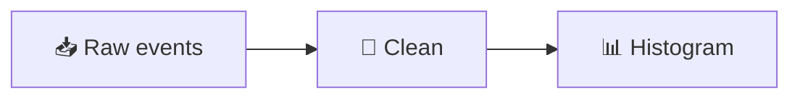

# Mermaid Diagrams — Course Style

All mermaid diagrams share one look ("kinetic glass", the same language as
the card system): deep-navy translucent nodes with a luminous sky-blue edge
and a soft glow, teal connectors with rounded caps, Space Grotesk semibold
labels, edge labels as small chips. It is applied **globally** — a fence needs
nothing but the diagram:

````md

````

## Where the style lives

- **`lectures/content/setup/mermaid.ts`** — the single source of truth:
  `themeVariables` (colours for flowchart / sequence / gitGraph / pie) and
  `themeCSS` (stroke widths, radius, glow, fonts, edge-label chips), plus
  layout defaults (`flowchart.curve: basis`, spacing).
- **`theme/styles/mermaid-styles.css`** — only the host element and the
  light-DOM measuring container (label font + measure-only slack). Slidev
  renders each diagram into a **shadow root**, so page CSS cannot style the
  SVG — do not add node/edge rules there.

## Do not add `%%{init: …}%%` blocks

They override the global theme piecemeal and drift. The only accepted use is
a **layout-only** directive when a specific diagram needs different spacing
or must not stretch:

```
%%{init: {'flowchart': {'nodeSpacing': 10, 'rankSpacing': 80, 'useMaxWidth': false}}}%%
%%{init: {'gitGraph': {'showCommitLabel': false}}}%%
```

## Semantic node colours (classDef)

Default nodes are navy/sky. When a diagram needs meaning in colour, use these
names with exactly these definitions (fill / stroke / text only — width,
radius and glow come from the global style):

```
classDef input    fill:#0b2a4a,stroke:#5eead4,color:#e8f1ff
classDef process  fill:#0a1f3f,stroke:#38bdf8,color:#e8f1ff
classDef output   fill:#063c34,stroke:#34d399,color:#d1fae5
classDef check    fill:#2a2208,stroke:#fbbf24,color:#fef3c7
classDef bad      fill:#3b1020,stroke:#f87171,color:#fee2e2
```

| name | meaning | accent |
|---|---|---|
| `input` (`action`) | a source / something you provide | teal |
| `process` (`step`, `stage`) | a transformation — the default look | sky |
| `output` (`good`, `success`) | a result, a passing state | emerald |
| `check` (`decision`) | a decision point, a validation | amber |
| `bad` (`fail`) | a failure, a dead end | red |

Aliases in parentheses are already used in some decks with the same colours;
prefer the first name in new diagrams. The L14 maturity ladder uses
`stage1…stage5` as a five-step spectrum (sky → teal → emerald → amber → rose).

`box` / `transparentBox` / `invisible` (L03 black box, L15 memory hierarchy)
are deliberate "outline only" diagrams and keep their own definitions.

## Palette reference

Mirrors `--color-*` / `--accent-*` in `custom-slides.css`:

- node fill `#0a1f3f` (navy, drawn at 82 % opacity) · deep `#08172f` · mid `#0b2d4d`
- borders sky `#38bdf8` · connectors cyan `#22d3ee` · teal `#5eead4`
- text `#e8f1ff` · chips `#a5f3fc` on `#020617`
- accents: emerald `#34d399` · amber `#fbbf24` · red `#f87171` · violet `#a78bfa` · rose `#f472b6`

## Sizing

Use the fence's `{scale: …}` to fit the slide (0.6–0.9 typical; 1.0+ for
one-liners). Labels are measured with a little extra width on purpose, so a
multi-line label will not lose its last glyph when the SVG is scaled down.
