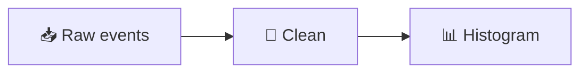

# Mermaid Diagrams — Course Style

All mermaid diagrams share one look, the landing page's (tokens in
`theme/styles/tokens.css`): near-transparent nodes with a 1px hairline edge on
the near-black backdrop, `--dim` connectors, Space Grotesk labels in `--fg`,
edge labels as small chips on `--bg`. No gradients, glows or shadows; the one
accent `#7dd3fc` marks inputs. It is applied **globally** — a fence needs
nothing but the diagram:

````md

```mermaid {scale: 0.8}
graph LR
    A[📥 Raw events] --> B[🧹 Clean] --> C[📊 Histogram]
```
````

## Where the style lives

- **`lectures/content/setup/mermaid.ts`** — the single source of truth:
  `themeVariables` (colours for flowchart / sequence / gitGraph / pie) and
  `themeCSS` (stroke widths, radius, fonts, edge-label chips, semantic class
  colours), plus layout defaults (`flowchart.curve: basis`, spacing). It also
  strips fill / stroke / color from the semantic classDefs below before
  mermaid parses a fence (`recolourClassDefs`): mermaid writes a classDef as
  an inline `!important` style that no stylesheet can override.
- **`theme/styles/mermaid-styles.css`** — only the host element and the
  light-DOM measuring container (label font + measure-only slack). Slidev
  renders each diagram into a **shadow root**, so page CSS cannot style the
  SVG — do not add node/edge rules there.

## Do not add `%%{init: …}%%` blocks

They override the global theme piecemeal and drift. The only accepted use is
a **layout-only** directive when a specific diagram needs different spacing
or must not stretch:

```
%%{init: {'flowchart': {'nodeSpacing': 10, 'rankSpacing': 80, 'useMaxWidth': false}}}%%
%%{init: {'gitGraph': {'showCommitLabel': false}}}%%
```

## Semantic node colours (classDef)

Default nodes are hairline panels. When a diagram needs meaning in colour,
give the node one of these class names. The colours come from `themeCSS`,
keyed on the NAME — whatever fill / stroke / color a classDef spells out is
dropped, so the definitions below (kept for older decks) are only placeholders
that make the class exist:

```
classDef input    fill:#0b2a4a,stroke:#5eead4,color:#e8f1ff
classDef process  fill:#0a1f3f,stroke:#38bdf8,color:#e8f1ff
classDef output   fill:#063c34,stroke:#34d399,color:#d1fae5
classDef check    fill:#2a2208,stroke:#fbbf24,color:#fef3c7
classDef bad      fill:#3b1020,stroke:#f87171,color:#fee2e2
```

| name | meaning | stroke |
|---|---|---|
| `input` (`action`, `highlight`, `accent`) | a source / something you provide | accent `#7dd3fc` |
| `process` (`step`, `stage`) | a transformation — the default look | hairline |
| `output` (`good`, `success`) | a result, a passing state | `--ok` `#2dd4bf` |
| `check` (`decision`, `warning`, `warn`) | a decision point, a validation | `--warn` `#fbbf24` |
| `bad` (`fail`, `error`) | a failure, a dead end | `#f87171` |

Aliases in parentheses are already used in some decks with the same colours;
prefer the first name in new diagrams. A classDef that also names a class
outside this list is left untouched.

`box` / `transparentBox` / `invisible` (L03 black box, L15 memory hierarchy)
are deliberate "outline only" diagrams and keep their own definitions.

## Palette reference

Mirrors `theme/styles/tokens.css` (spelled out in `setup/mermaid.ts`):

- node fill `rgba(255,255,255,.02)` · hairline stroke `rgba(139,151,166,.45)`
  (solid twin `#3a4350`) · page `#050507`
- text `#f2f5f9` · edge-label chips `#c3ccd8` on `#050507` · connectors `#8b97a6`
- accent `#7dd3fc` · `--ok` `#2dd4bf` · `--warn` `#fbbf24` · failures `#f87171`
- gitGraph lanes: `#7dd3fc` (first branch), then `#e5e7eb`, `#2dd4bf`,
  `#fbbf24`, `#94a3b8`, `#bae6fd`, `#99f6e4`, `#fde68a` (course colours and
  neutrals only); branch names as
  outlined chips, commit hashes in Space Mono

## Sizing

Use the fence's `{scale: …}` to fit the slide (0.6–0.9 typical; 1.0+ for
one-liners). Label metrics (font, weight, letter-spacing) in `themeCSS` and in
the measuring rule of `mermaid-styles.css` must stay identical, or labels are
sized for one font and drawn in another.
