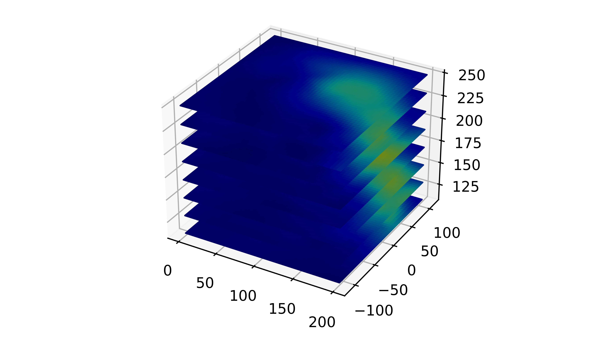

# Dr. Mindaugas Šarpis
# Lessons on **Data Analysis** from **CERN**

## Lecture 2

### Introduction to Data Analysis

---

# What is **Data Analysis**? 

\* What is **Data**? 

***interactive exercise***

---

# **Data analysis** is a process of inspecting, cleaning, transforming, and modeling data with the goal of discovering useful **information**, informing conclusions, and supporting decision-making.

## Wikipedia

---

# What is **Data Science**?

---

# **Data science** is an interdisciplinary academic field that uses statistics, scientific computing, scientific methods, processing, scientific visualization, algorithms and systems to extract or extrapolate **knowledge and insights** from potentially noisy, structured, or unstructured data.

## Wikipedia

---

---

# Key Ideas 

- ## Any **experiment** (study or analysis) in any field of science **will have** a **data analysis** component
- ## Normally, the **results of data analysis** appear in scientific **publications**\*

***"...lacking excellence..."*** 
***"...aimed at serving the industry..."*** 

--- 

# Examples of **significance** of **data analysis** in different fields of science and beyond 

---

# Biomedicine and Genomics

 - ## Genome Sequencing
 - ## Clinical Trials
 \* 23andMe anyone (ancestry services)?
 \** comparing against *reference populations*

---

 # Environmental Sciences

- ## Climate Change Models
- ## Pollution Monitoring
- ## Biodiversity Studies

\* again a *living analysis* 

---

 # Social Sciences

- ## Economic Forecasting
- ## Social Behavior Studies

\* may be qualitative analysis 

---

# Astronomy 

- ## Observational Data Analysis
- ## Gravitational Waves

---

---

# Engineering

- ## Predictive Maintenance
- ## Quality Control
- ## Structural Health Monitoring

---

# Healthcare

- ## Epidemiology
- ## Health Policy

---

# Finance 

- ## Stock Market Analysis
- ## Risk Management
- ## Algorithmic Trading

---

# Sports Analytics 

- ## Performance Analysis
- ## Fan Engagement

---

# Steps of **Data Analysis** 

---

# 1. **Define** the Problem or Research Question 

- ## Formulation
- ## Experimental Design

\* This might steer the choices in the following steps

***Interactive exercise*** 

---

# 2. **Collect** Data 

- ## How much data do you need?
- ## What sort of data do you need?
- ## What data formats should you chose?

---

# 3. **Clean** Data 

- ## Data Selection
- ## Data Stripping 
- ## Data Skimming
- ## Data Wrangling 
- ## ...

---

# 4. **Analyze** Data

- ## Data Exploration
- ## Statistical Analysis 
- ## Model Building
- ## Machine Learning
- ## Classification (**...AI...**)

---

# 5. **Visualize** the data

- ## What's your target audience? 
- ## What is the message you want to convey?

---

# 6. **Interpret** and **report** the results

- ## Draw Conclusions from Data
- ## Report Findings

---

# Data **Higiene**

---

--- 

# The first step in **(re)using data** is to find them. **Metadata** and data should be easy to find for both humans and computers. Machine-readable metadata are essential for automatic discovery of datasets and services, so this is an essential component of the FAIRification process.

---

# **Findable** data

- ## F1. (Meta)data are assigned a globally **unique and persistent identifier**
- ## F2. Data are described with **rich metadata** 
- ## F3. **Metadata** clearly and explicitly **include the identifier** of the data they describe
- ## F4. (Meta)data are registered or indexed in a **searchable resource**

---

# **Accessible** data

- ## A1. **(Meta)data** are retrievable by their **identifier** using a standardised communications protocol

    - ## A1.1 The protocol is **open**, free, and universally implementable

    - ## A1.2 The protocol allows for an **authentication** and **authorisation** procedure, where necessary

- ## A2. Metadata are accessible, even when the data are no longer available

---

# **Interoperable** data

- ## I1. (Meta)data use a formal, accessible, shared, and broadly applicable **language for knowledge representation**.

- ## I2. (Meta)data use vocabularies that follow **FAIR principles**

- ## I3. (Meta)data include **qualified references** to other (meta)data

---

# **Reusable** data

- ## R1. (Meta)data are **richly described** with a plurality of accurate and relevant attributes

    - ## R1.1. (Meta)data are released with a clear and **accessible** data usage **license**

    - ## R1.2. (Meta)data are associated with detailed **provenance**

    - ## R1.3. (Meta)data meet **domain-relevant community standards**

---

# Examples of **Tools** used for **Data Analysis**

---

---

# Proprietary tools 

- ## Expensive
- ## Limited in scope
- ## Lack compatibility 
- ## Lack flexibility
- ## Easy to learn / use (GUI)

---

# Programming languages 

- ## Open Source
- ## Free
- ## Powerful 
- ## Steep leraning curve (CLI)

---

# **Discussion**  

- ## When to use proprietary tools?
- ## Whas should you be using?  
- ## saturation of achieved proficiency 

--- 

# Seminar

# Introduction to **Python**

---

# Naming **Conventions** for **Variables**

---

# **Single lowercase** letter

##  a 
##  b
##  c 

---

<!--
_color: red
--> 

# Never use l (lima)

--- 

# **Single Uppercase** letter

##  A

##  B

##  C

---

<!--
_color: red
--> 

# Never use O (oscar) or I (india) 

---

# **lowercase**

- ## velocity
- ## temperature
- ## total 

---

# **lower_case_with_underscores**

- ## user_age
- ## file_name
- ## calculate_total

--- 

# **UPPERCASE**

- ## PI = 3.14159
- ## MAX_SIZE = 100
- ## DEFAULT_TIMEOUT = 30
- ## DEBUG_MODE = True

---

# **UPPER_CASE_WITH_UNDERSCORES**

- ## DEFAULT_USER_ROLE = "guest"
- ## CONNECTION_TIMEOUT_LIMIT = 60
- ## MAX_BUFFER_SIZE = 1024

---

# **CamelCase**

- ## DataProcessor
- ## HTTPRequestHandler 
- ## XMLParser

\* Acronyms are capitalized

--- 

# **mixedCase**

- ## fileReader
- ## isEnabled
- ## getValue

---

# **Python** as a **Calculator**

---

##  1: Basic Arithmetic Operations

Try these calculations in the Python terminal:

- Calculate the sum of 25 and 75.
- Subtract 150 from 300.
- Multiply 12 by 15.
- Divide 144 by 12.

---

##  2: Order of Operations

Evaluate the following expressions, keeping the order of operations in mind:

- `10 + 20 * 5`
- `(8 + 4) * (6 - 2)`
- `10**3 - 3 * 5 + 1`

---

##  3: Floating-Point Arithmetic

Explore floating-point arithmetic:

- Divide 7 by 3 and observe the result.
- Compute `22 / 7` and compare it to `22 // 7`.
- Multiply 5.5 by 2.3.

---

##  4: Power and Modulus Operations

Practice power and modulus calculations:

- Find `2**8` (2 raised to the power of 8).
- Compute `17 % 5` to find the remainder.

---

##  5: Using `_` for Last Result

Use the underscore (`_`) to refer to the last result:

1. Perform `45 + 55`.
2. Multiply the last result (`_`) by 2.
3. Subtract 50 from the previous result using `_`.

---

##  6: Variable Assignments

Assign values to variables and perform calculations:

- Assign `x = 50`, then calculate `x * 2`.
- Set `a = 10` and `b = 25`, then find the sum of `a` and `b`.
- Change `a` to 15 and calculate `a * b`.

---

##  7: String Operations

Experiment with string operations:

- Concatenate `"Hello"` and `" World!"`.
- Repeat `"Python!"` three times.
- Find the length of the string `"Learning Python"`.

---

##  8: Variables in String Operations

Manipulate strings using variables:

- Assign `name = "Alice"`. Create the greeting: `"Hello, Alice!"`.
- Set `word = "Python"`. Check the result of `word * 5`.

---

##  9: String Slicing and Indexing

Try string slicing and indexing:

- Assign `text = "Python Programming"`. Extract the first 6 characters.
- Get the last character of `text`.
- Slice to get "Programming" from `text`.

---

##  10: Basic Mathematical Expressions

Solve these simple mathematical problems:

- Calculate the area of a circle with radius 7 using `π ≈ 3.14` (`area = π * radius**2`).
- Compute the square root of 144 using the power operator.