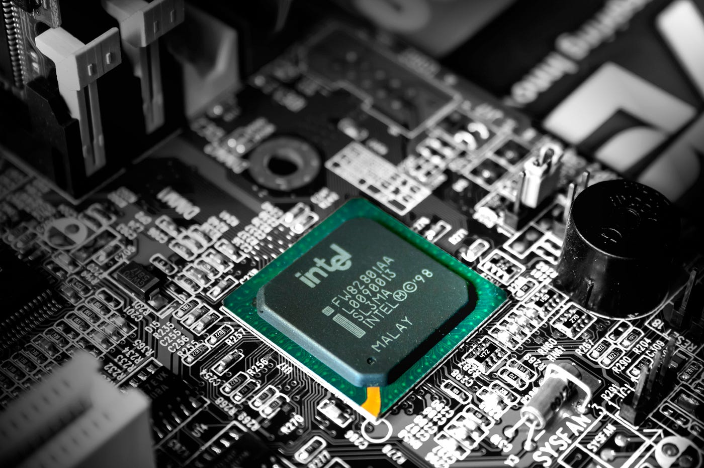

# Dr. Mindaugas Šarpis
# Lessons on Data Analysis from CERN

## Lecture 3

### Overview of Computing Principles

---

# Computing Infrastructure 

---

  - ## What constitutes computing infrastructure?
  - ## The role of computing infrastructure in various domains 
    - ### Research
    - ### Business
    - ### Everyday life

---

# Crash Course on **Main Principles Computing**  

\* Blackboard exercise

---

---

# Interlude to CERN Computing ... 

--- 
# Core Components of Computing Infrastructure

---

# Hardware Components
  - ## Central Processing Unit (CPU)
  - ## Memory (RAM)
  - ## Storage Devices
  - ## Input/Output (I/O) Devices
  - ## Specialized Processors (e.g., GPUs)
--- 

# CPU 

 - ## Architecture
    - ###  Cores
    - ###  Threads
    - ###  Clock Speed

  - ## Role of the CPU in computation - **the brain of the computer**
  - ## Limitations of the CPU
    
---

<!-- _backgroundColor: black -->

--- 

<!-- _backgroundColor: black -->

--- 

<!-- _backgroundColor: black -->

--- 
  - **Memory (RAM)**:
    - Function of RAM in computing.
    - Types of RAM and their characteristics (e.g., DDR, SDRAM).
    - The relationship between memory and performance.
  - **Storage Devices**:
    - Different types of storage: HDD, SSD, NVMe.
    - How storage impacts system performance.
    - Data storage hierarchy: Caches, RAM, and Disk Storage.
  - **Input/Output (I/O) Devices**:
    - Overview of I/O devices (e.g., keyboards, mice, monitors, network interfaces).
    - Importance of I/O in user interaction and system communication.

- **1.2.2 Software Components**:
  - **Operating Systems (OS)**:
    - Role of the OS in managing hardware and software resources.
    - Introduction to popular operating systems (Windows, Linux, macOS).
    - Kernel, drivers, and system services.
  - **Middleware and Virtualization**:
    - Role of middleware in software interaction and integration.
    - Introduction to virtualization: Hypervisors and Virtual Machines.
  - **Application Software**:
    - Different categories of software: System software vs. Application software.
    - Examples of application software relevant to computing (e.g., IDEs, data analysis tools).

## Break (10 Minutes)

---

## Part 2: Main Working Principles of Computing Systems (1 Hour 20 Minutes)

### 2.1 Basic Concepts in Computing (30 Minutes)
- **2.1.1 Binary and Data Representation**:
  - Introduction to binary number system.
  - How data is represented in computers: Bits, bytes, and data types.
  - Encoding of characters (ASCII, Unicode).
- **2.1.2 Logic Gates and Boolean Algebra**:
  - Overview of basic logic gates (AND, OR, NOT, NAND, NOR, XOR).
  - Introduction to Boolean algebra and its application in computing.
  - Building simple circuits using logic gates.

### 2.2 Working Principles of a Computer System (50 Minutes)
- **2.2.1 The Fetch-Decode-Execute Cycle**:
  - Detailed explanation of the Fetch-Decode-Execute cycle.
  - Role of the CPU, memory, and buses in executing instructions.
  - Examples of basic machine instructions.
- **2.2.2 Memory Management**:
  - How the OS manages memory allocation and deallocation.
  - Introduction to virtual memory and paging.
  - Concepts of memory hierarchy: Cache memory, primary memory, secondary memory.
- **2.2.3 Input/Output (I/O) Operations**:
  - Overview of how data is transferred between the CPU and peripheral devices.
  - Concepts of polling, interrupts, and DMA (Direct Memory Access).
  - Examples of I/O devices and their interaction with the system.

### 2.3 Computing Performance and Optimization
- **2.3.1 Understanding Performance Metrics**:
  - Introduction to key performance metrics: CPU speed, FLOPS, IOPS, latency, and throughput.
  - How hardware and software optimization impacts performance.
- **2.3.2 Parallel Computing**:
  - Basic introduction to parallel processing and multi-threading.
  - The importance of parallelism in modern computing (e.g., multi-core processors).
  - Real-world applications of parallel computing.

## Q&A and Discussion (10 Minutes)
- **Open Q&A Session**:
  - Address any questions from students about the lecture content.
  - Discuss practical examples and encourage students to relate the concepts to real-world scenarios.

--- 