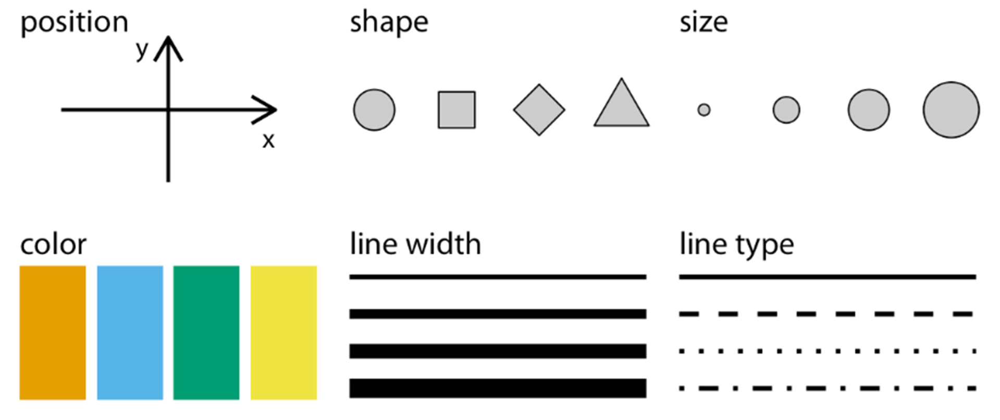
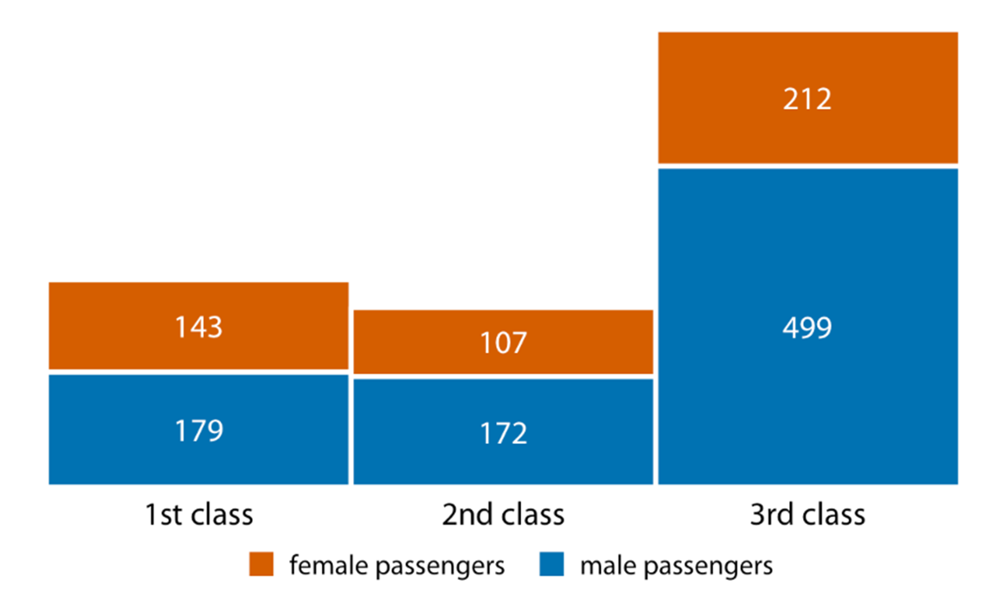
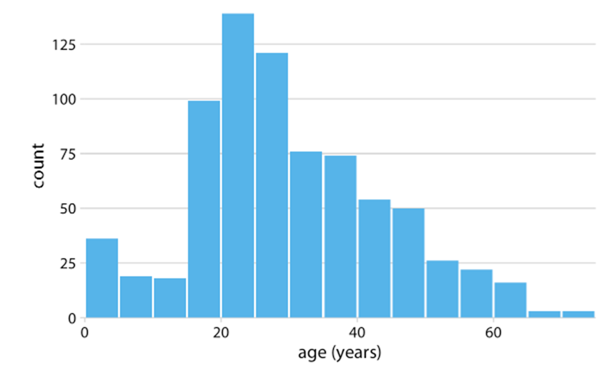
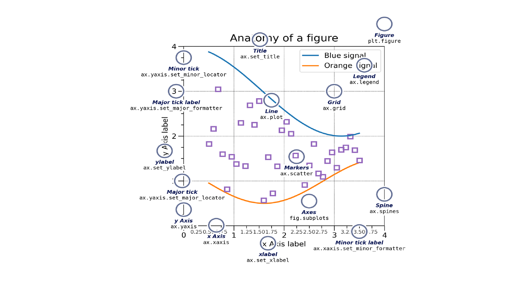

# Dr. Mindaugas Šarpis
# Lessons on **Data Analysis** from **CERN**

## Lecture 5

### Data **Visualization**

--- 

# Data **Visualization**

- ## One of the key components of data analysis 
    - ### Interpreting Results 
    - ### Reporting Findings
- ## Chosing appropriate method of visualization and representation is crucial

--- 

---

---

---

# **Aesthetics** of Data Visualization

---

# **Continuous** and **Discrete** Data

- ## Quantitative / Numerical Data
- ## Qualitative / Categorical Data
- ## Date and Time 
- ## Text 

---

# **Legend**

---

---

---

---

# Axis and overall **Scale**

---

---

---

#  Visualizing **Amounts**

- ## Bar Charts
- ## Grouped Bar Charts
- ## Stacked Bar Charts
- ## Heat Maps

---

---

---

---

---

---

---

---

---

---

---

# **Histograms** 

---

---

---

---

# **Color** 

---

--- 

# **Error** Bars

---

---

---

# Anatomy of a **Plot**

---

