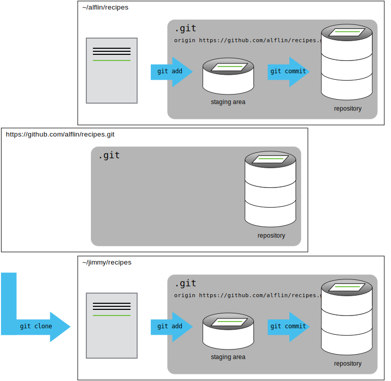
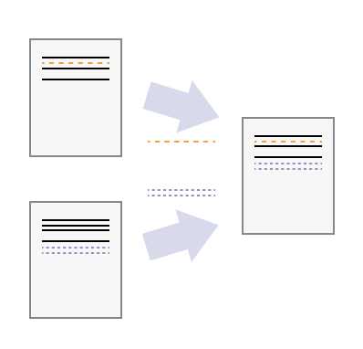

# Dr. Mindaugas Šarpis

# Lessons on **Data Analysis** from **CERN**

## Lecture 8

### **Version** Control using Git

---
layout: image-right
image: ./resources/git/comic_version.jfif
backgroundSize: contain
---

# The Importance of Version Control

- ### Even if working alone, many different version of the same file will exist. 
- ### Some overwritten changes might be needed later.
- ### A "versioned" file might be needed when implementing comments from supervisor / reviewers. 
- ### This hold true for written work, code and other files. 

---

# Tracking Changes (differences)  

- ## Rather than saving multiple copies of the same file, we can track changes.
- ## `git` is an open-source version control system that is used to track changes in files.


---
layout: image-right
image: ./resources/git/versions.svg
backgroundSize: contain
---

# Different Versions 

- An eddit to a file might overwrite some of the content in the previous version.
- This *divergences* may arrise while working alone, but they are really common when multiple people are working on the same file.  

---
layout: image-right
image: ./resources/git/merge.svg
backgroundSize: contain
---

# Merging 

- ### `git` has great functionality for merging different versions of the same file.
- ### If the previous content is not overwritten, or deleted, merge just combines the changes into one file.

---

# When using `git` for the first time 

- ### You need to configure your user name and email address.

```bash
git config --global user.name "Alfredo Linguini"
git config --global user.email "a.linguini@ratatouille.fr"
```

- ### You can check the configuration with

```bash
git config --list
```

- ### You can open the help with
   
```bash
git config --h
git config --help
```

---
layout: two-cols
---

# Creating a new repository

- ### A repository is initialized with the following command:

```bash
git init
```

::right::


- ### This command creates a new repository in the current directory. 
- ### The repository is a hidden directory called `.git` that contains all the information changes tracked by `git`.

- ### You can check the status of the repository with:
  
```bash
git status
```

- ### In a new repository, the output will be:
```
On branch main

No commits yet

nothing to commit (create/copy files and use "git add" to track)
```

---

# Staging Area

- ### `git` has a staging area where files are placed before they are committed to the repository.
  
- ###  To move a file to the staging area use: 
  
  ```bash
  git add <file>
  ```

- ### To move all files to the staging area use: 
  
  ```bash
  git add --all
  ```

- ### Only files in the staging area are committed to the repository.
- ### To commit the files in the staging area use:

  ```bash
  git commit -m "A message describing the changes"
  ```
- ### Any new changes to the files in the repository are now tracked by `git`.

- ### Changes to files can be viewed with:
  ```bash
  git diff
  ```


---


---


---


---


---



---


---



---


--- 3

```bash
git init
```

---