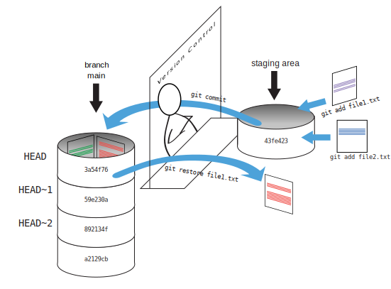
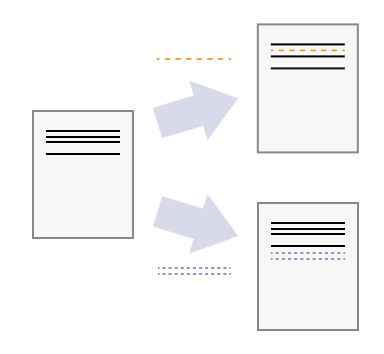

# Dr. Mindaugas Šarpis
# Lessons on **Data Analysis** from **CERN**

## Lecture 8

### **Version** Control using Git

---
layout: image-right
image: ./resources/git/comic_version.jfif
backgroundSize: contain
---

# The Importance of Version Control

- ### Even if working alone, many different version of the same file will exist. 
- ### Some overwritten changes might be needed later.
- ### A "versioned" file might be needed when implementing comments from supervisor / reviewers. 
- ### This hold true for written work, code and other files. 

---

# Tracking Changes (differences)  

- ## Rather than saving multiple copies of the same file, we can track changes.
- ## `git` is an open-source version control system that is used to track changes in files.


---


---



---


---


---


---


---


---


---


---



--- 3

```bash
git init
```

---