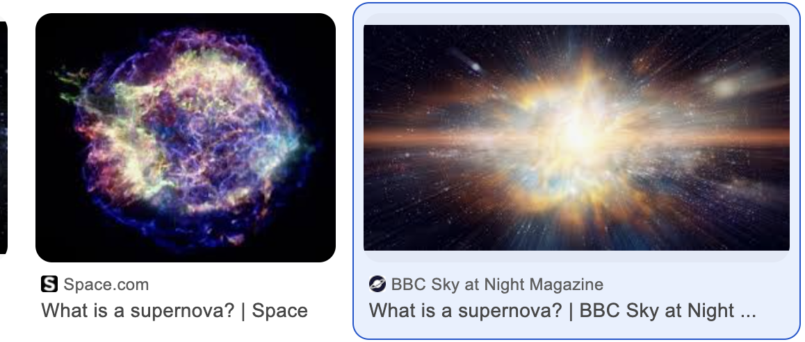

---

marp: true
paginate: true

---

# Instructions on how to use markdown

---

This is the first time I am using markdown. I am excited to learn how to use it.
I am going to learn how to use the following. 

---

Paragraph 1. 

Paragraph 2. As you can see, I am learning how to use markdown. aragraph 2. As you can see, I am learning how to use markdown.
Paragraph 2. As you can see, I am learning how to use markdown.
Paragraph 2. As you can see, I am learning how to use markdown.

---

This text is **bold**. 

This text is __bold__.

This text is *italic*.

This text is _italic_.

This text is **_bold and italic_**.
---

This is a little bit of code 
```python
print("Hello World")
```

```
pwd; echo "Hello World"; ls -l
```
---

### Manual of what to do 

This is what you need to do: 

+ Get the data
+ Clean the data 
+ Analyze the data
+ Visualize the data
+ Share the data
+ Expand the list here:
---

- Get the data
- Clean the data 
- Analyze the data
- Visualize the data
- Share the data
- Expand the list here:
  - Add more data
---

1. Get the data
2. Clean the data
    1. Hi
    2. Hello
3. Analyze the data 
---


---



| Name | Age | Last Name |
|------|-----|-----------|
| John | 23  | Kazlauskas|
| Jane | 24  | Kazlauskas|
| Doe  | 25  | Kazlauskas|

---
|This is a | markdown table | 
|---|---| 
| 0 | 0 |
---
|This is a | markdown table | 
|---|---| 
| 1 | 1 |
---
|This is a | markdown table | 
|---|---| 
| 2 | 4 |
---
|This is a | markdown table | 
|---|---| 
| 3 | 9 |
---
|This is a | markdown table | 
|---|---| 
| 4 | 16 |
---
|This is a | markdown table | 
|---|---| 
| 5 | 25 |
---
|This is a | markdown table | 
|---|---| 
| 6 | 36 |
---
|This is a | markdown table | 
|---|---| 
| 7 | 49 |
---
|This is a | markdown table | 
|---|---| 
| 8 | 64 |
---
|This is a | markdown table | 
|---|---| 
| 9 | 81 |
---
|This is a | markdown table | 
|---|---| 
| 10 | 100 |
---
|This is a | markdown table | 
|---|---| 
| 11 | 121 |
---
|This is a | markdown table | 
|---|---| 
| 12 | 144 |
---
|This is a | markdown table | 
|---|---| 
| 13 | 169 |
---